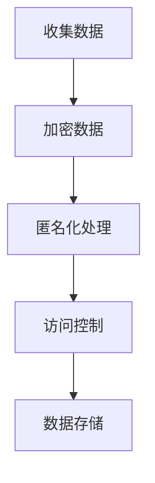
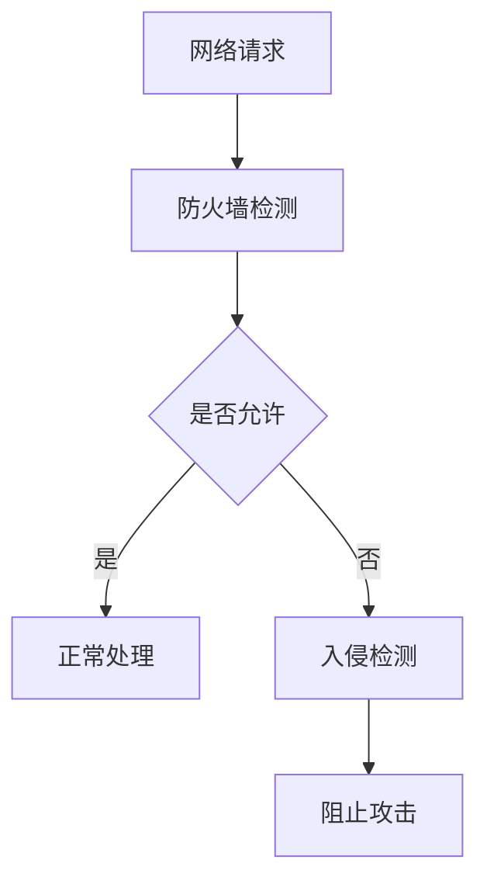
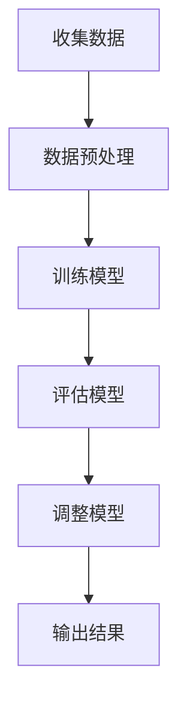
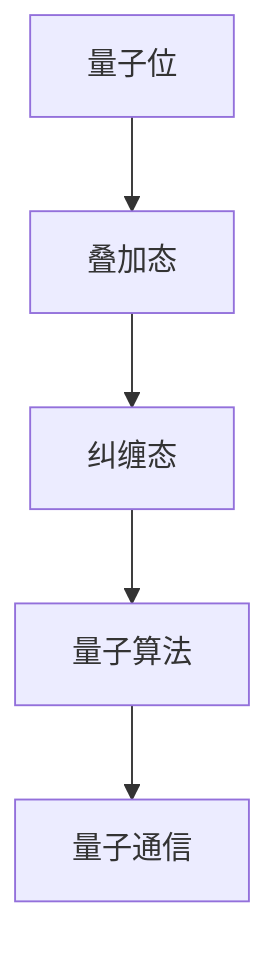
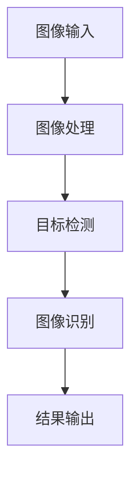
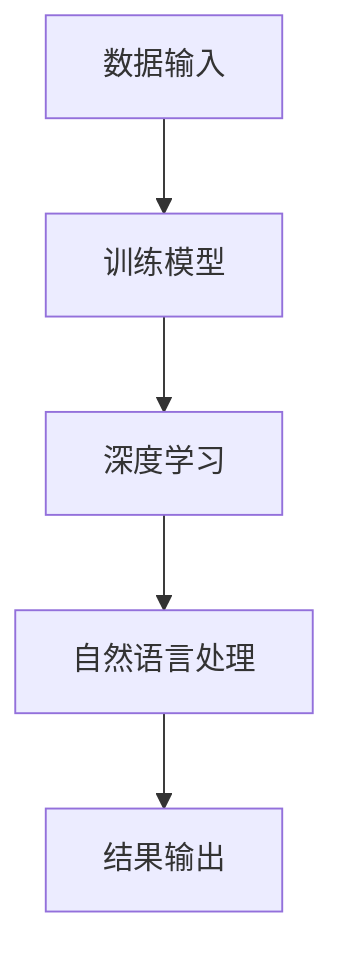
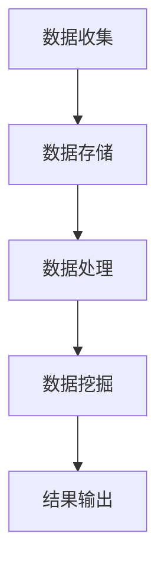
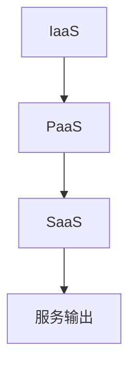
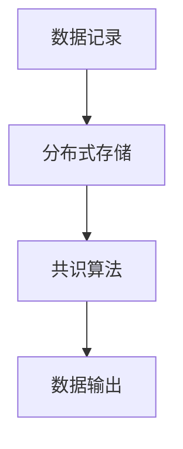
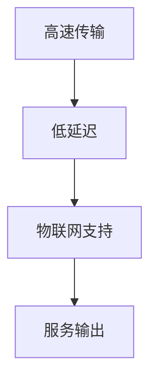

                 

在当今这个科技飞速发展的时代，人类计算正面临着前所未有的挑战。从人工智能的崛起，到大数据的普及，再到量子计算的突破，计算机科学正在以前所未有的速度推动着人类社会的进步。然而，与此同时，我们也在不断地面临新的问题，例如数据隐私、网络安全、算法公平性等。如何应对这些挑战，充分发挥人类计算的潜力，成为我们这一代人需要共同思考的重要问题。

本文将围绕“应对人类共同挑战：人类计算的使命担当”这一主题，探讨以下几个核心问题：

- **背景介绍**：介绍当前计算机科学领域面临的共同挑战。
- **核心概念与联系**：阐述计算机科学中的核心概念和原理，并使用Mermaid流程图展示其架构。
- **核心算法原理 & 具体操作步骤**：详细解释一种核心算法的原理和操作步骤。
- **数学模型和公式 & 详细讲解 & 举例说明**：介绍数学模型和公式，并通过案例进行分析。
- **项目实践：代码实例和详细解释说明**：展示一个具体的项目实例，并对其进行详细解释。
- **实际应用场景**：讨论计算机科学在实际应用中的场景。
- **未来应用展望**：展望计算机科学未来的发展方向。
- **工具和资源推荐**：推荐学习和开发资源。
- **总结：未来发展趋势与挑战**：总结研究成果，展望未来。

<|assistant|>## 1. 背景介绍

随着科技的快速发展，计算机科学已经成为现代社会的重要驱动力。从互联网到智能手机，从大数据到人工智能，计算机技术正在深刻地影响着我们的日常生活。然而，随着技术的进步，我们也面临着许多新的挑战。

首先，数据隐私问题日益严重。随着大数据的普及，个人隐私数据被大量收集、存储和处理。这些数据的安全性问题引起了广泛的关注。如何保护个人隐私，防止数据泄露，成为计算机科学领域的重要课题。

其次，网络安全问题也日益突出。随着互联网的普及，网络攻击和数据泄露事件频发。如何加强网络安全，防止网络攻击，成为计算机科学领域需要解决的另一个重要问题。

此外，算法公平性也是我们面临的一个重大挑战。随着人工智能的崛起，越来越多的决策过程被算法所取代。然而，算法的偏见和歧视性问题也逐渐显现出来。如何保证算法的公平性，避免算法对人类的负面影响，成为我们需要深入思考的问题。

最后，量子计算的突破也带来了新的挑战。量子计算具有巨大的计算潜力，但同时也带来了新的安全风险和挑战。如何应对量子计算带来的安全威胁，成为我们需要关注的问题。

## 2. 核心概念与联系

在探讨计算机科学的挑战时，我们需要了解几个核心概念和原理。这些概念和原理是计算机科学的基础，也是我们解决实际问题的重要工具。

### 2.1 数据隐私保护

数据隐私保护是当前计算机科学领域的一个重要课题。其核心思想是保护个人隐私数据，防止数据泄露和滥用。数据隐私保护包括以下几个方面：

- **数据加密**：通过加密技术，将原始数据转换为无法直接阅读的密文，从而保护数据的安全性。
- **访问控制**：通过访问控制机制，限制对数据的访问权限，确保只有授权用户才能访问数据。
- **匿名化处理**：通过将个人身份信息从数据中去除，降低数据泄露的风险。

下面是数据隐私保护的一个简单的Mermaid流程图：



### 2.2 网络安全

网络安全是另一个重要的核心概念。其目的是防止网络攻击和数据泄露。网络安全包括以下几个方面：

- **防火墙**：通过设置防火墙，限制对网络服务的访问，防止未授权的访问。
- **入侵检测系统**：通过检测异常行为，及时发现网络攻击。
- **安全审计**：通过定期审计，确保网络系统的安全性。

下面是网络安全的一个简单的Mermaid流程图：



### 2.3 算法公平性

算法公平性是人工智能领域的一个重要课题。其核心思想是确保算法在决策过程中不会产生偏见和歧视。算法公平性包括以下几个方面：

- **数据公平性**：确保训练数据集的多样性，避免数据偏见。
- **算法公平性**：设计公平的算法，避免算法偏见。
- **结果公平性**：对算法结果进行评估，确保结果的公平性。

下面是算法公平性的一个简单的Mermaid流程图：



### 2.4 量子计算

量子计算是计算机科学领域的一个前沿领域。其核心思想是利用量子位（qubit）进行计算，从而实现超越经典计算机的计算能力。量子计算包括以下几个方面：

- **量子位**：量子位是量子计算的基本单位，具有叠加和纠缠特性。
- **量子算法**：利用量子位进行计算，实现快速求解某些问题。
- **量子通信**：利用量子纠缠实现高效通信。

下面是量子计算的一个简单的Mermaid流程图：



### 2.5 计算机视觉

计算机视觉是计算机科学领域的一个重要分支。其核心思想是使计算机能够“看”懂图像和视频。计算机视觉包括以下几个方面：

- **图像处理**：对图像进行预处理，提高图像质量。
- **目标检测**：在图像中检测出特定的目标。
- **图像识别**：对图像进行分类，识别出不同的对象。

下面是计算机视觉的一个简单的Mermaid流程图：



### 2.6 人工智能

人工智能是计算机科学领域的一个热点话题。其核心思想是使计算机能够模拟人类智能，实现自主学习和决策。人工智能包括以下几个方面：

- **机器学习**：通过训练模型，使计算机能够自动学习。
- **深度学习**：利用神经网络实现自动学习。
- **自然语言处理**：使计算机能够理解自然语言。

下面是人工智能的一个简单的Mermaid流程图：



### 2.7 大数据

大数据是计算机科学领域的一个重要概念。其核心思想是处理海量数据，从中提取有价值的信息。大数据包括以下几个方面：

- **数据收集**：收集海量数据。
- **数据存储**：存储海量数据。
- **数据处理**：对海量数据进行处理和分析。
- **数据挖掘**：从海量数据中提取有价值的信息。

下面是大数据的一个简单的Mermaid流程图：



### 2.8 云计算

云计算是计算机科学领域的一个新兴概念。其核心思想是将计算资源虚拟化，提供弹性的计算服务。云计算包括以下几个方面：

- **基础设施即服务（IaaS）**：提供虚拟化的基础设施。
- **平台即服务（PaaS）**：提供开发平台。
- **软件即服务（SaaS）**：提供应用程序。

下面是云计算的一个简单的Mermaid流程图：



### 2.9 区块链

区块链是计算机科学领域的一个新兴概念。其核心思想是通过分布式账本实现数据的不可篡改性和透明性。区块链包括以下几个方面：

- **数据记录**：将数据记录到区块链中。
- **分布式存储**：将数据分布式存储，提高数据安全性。
- **共识算法**：通过共识算法，确保数据的正确性。

下面是区块链的一个简单的Mermaid流程图：



### 2.10 5G通信

5G通信是计算机科学领域的一个前沿技术。其核心思想是提供高速、低延迟的通信服务。5G通信包括以下几个方面：

- **高速传输**：提供高达1Gbps的传输速度。
- **低延迟**：提供低于10毫秒的延迟。
- **物联网支持**：支持大规模物联网设备的连接。

下面是5G通信的一个简单的Mermaid流程图：



通过上述对核心概念和原理的介绍，我们可以看到计算机科学领域涉及到的范围非常广泛。从数据隐私保护，到网络安全，再到算法公平性，量子计算，计算机视觉，人工智能，大数据，云计算，区块链，5G通信等，每个领域都有其独特的挑战和解决方案。这些核心概念和原理是计算机科学的基础，也是我们解决实际问题的有力工具。

在接下来的章节中，我们将进一步探讨核心算法的原理和操作步骤，并通过具体的项目实例和实际应用场景，展示计算机科学在解决人类共同挑战中的重要作用。同时，我们也会展望未来计算机科学的发展趋势和面临的挑战，为我们的研究提供新的方向和思路。

## 3. 核心算法原理 & 具体操作步骤

在应对人类共同挑战的过程中，核心算法的原理和具体操作步骤是至关重要的。在本章节中，我们将介绍一种被广泛应用于数据隐私保护和网络安全的核心算法——加密算法。加密算法通过对数据进行加密和解密，确保数据在传输和存储过程中的安全性。

### 3.1 算法原理概述

加密算法的基本原理是利用数学方法将原始数据（明文）转换成无法直接理解的密文，从而保护数据的隐私性。加密过程通常涉及两个步骤：加密和解密。加密过程中，使用加密算法和加密密钥将明文转换为密文；解密过程中，使用解密算法和解密密钥将密文还原为明文。

加密算法可以分为对称加密和非对称加密两大类。

- **对称加密**：加密和解密使用相同的密钥，如AES（高级加密标准）和DES（数据加密标准）。
- **非对称加密**：加密和解密使用不同的密钥，如RSA（Rivest-Shamir-Adleman）和ECC（椭圆曲线密码学）。

### 3.2 算法步骤详解

以下是加密算法的一般步骤：

#### 3.2.1 选择加密算法

首先，根据安全需求和性能要求，选择一种合适的加密算法。常见的加密算法包括AES、DES、RSA和ECC等。

#### 3.2.2 生成密钥

加密算法通常需要密钥。对于对称加密，密钥由加密方和接收方共同生成；对于非对称加密，加密密钥和解密密钥是成对生成的。

- **对称加密密钥生成**：
  ```mermaid
  graph TD
  A[生成随机数] --> B[密钥生成算法]
  B --> C[密钥]
  ```

- **非对称加密密钥生成**：
  ```mermaid
  graph TD
  A[生成随机数] --> B[密钥生成算法]
  B --> C[公钥]
  B --> D[私钥]
  ```

#### 3.2.3 加密过程

使用加密算法和密钥对明文进行加密，生成密文。

- **对称加密加密过程**：
  ```mermaid
  graph TD
  A[明文] --> B[加密算法]
  B --> C[密文]
  C --> D[传输或存储]
  ```

- **非对称加密加密过程**：
  ```mermaid
  graph TD
  A[明文] --> B[加密算法]
  B --> C[公钥加密]
  C --> D[密文]
  D --> E[传输或存储]
  ```

#### 3.2.4 解密过程

使用解密算法和解密密钥对密文进行解密，还原为明文。

- **对称加密解密过程**：
  ```mermaid
  graph TD
  A[密文] --> B[解密算法]
  B --> C[明文]
  ```

- **非对称加密解密过程**：
  ```mermaid
  graph TD
  A[密文] --> B[解密算法]
  B --> C[私钥解密]
  C --> D[明文]
  ```

### 3.3 算法优缺点

#### 3.3.1 对称加密

- **优点**：
  - 加密速度快，适合大量数据的加密。
  - 加密和解密使用相同的密钥，简化了密钥管理。

- **缺点**：
  - 密钥分发困难，需要安全的密钥交换机制。
  - 无法提供身份验证。

#### 3.3.2 非对称加密

- **优点**：
  - 可以提供身份验证和数字签名。
  - 密钥分发容易，不需要安全的密钥交换。

- **缺点**：
  - 加密和解密速度较慢，不适合大量数据的加密。
  - 需要更复杂的密钥管理。

### 3.4 算法应用领域

加密算法在计算机科学领域有广泛的应用，包括：

- **数据存储安全**：保护存储在磁盘或云服务器上的数据。
- **数据传输安全**：保护在互联网上传输的数据。
- **网络安全**：保护网络设备和网络通信。
- **区块链**：确保区块链数据的完整性和不可篡改性。
- **物联网**：保护物联网设备之间的通信。

### 3.5 实际操作示例

#### 3.5.1 选择加密算法

我们选择AES作为对称加密算法，RSA作为非对称加密算法。

#### 3.5.2 生成密钥

使用Python的PyCryptoDome库生成AES密钥和RSA密钥。

```python
from Crypto.PublicKey import RSA
from Crypto.Cipher import AES, PKCS1_OAEP
from Crypto.Random import get_random_bytes

# 生成AES密钥
aes_key = get_random_bytes(16)  # 16字节，即128位

# 生成RSA密钥对
key = RSA.generate(2048)
private_key = key
public_key = key.publickey()
```

#### 3.5.3 加密过程

使用AES加密算法对明文进行加密，使用RSA加密算法对AES密钥进行加密。

```python
# 对明文进行AES加密
cipher_aes = AES.new(aes_key, AES.MODE_GCM)
ciphertext_aes, tag = cipher_aes.encrypt_and_digest(plaintext)

# 对AES密钥进行RSA加密
cipher_pk = PKCS1_OAEP.new(public_key)
cipher_aes_key = cipher_pk.encrypt(aes_key)
```

#### 3.5.4 解密过程

使用RSA密钥对AES密钥进行解密，使用AES解密算法对密文进行解密。

```python
# 对AES密钥进行RSA解密
cipher_pk = PKCS1_OAEP.new(private_key)
aes_key = cipher_pk.decrypt(cipher_aes_key)

# 对密文进行AES解密
cipher_aes = AES.new(aes_key, AES.MODE_GCM, nonce=cipher_aes.nonce)
plaintext = cipher_aes.decrypt_and_verify(ciphertext_aes, tag)
```

通过上述步骤，我们完成了数据的加密和解密过程。在实际应用中，加密算法需要根据具体场景进行选择和优化，以确保数据的安全性。

### 3.6 小结

加密算法在应对人类共同挑战中起着至关重要的作用。通过对数据加密和解密，我们可以保护数据的安全性和隐私性，防止数据泄露和滥用。在未来的研究和实践中，我们需要不断优化加密算法，提高其安全性和效率，以更好地应对不断变化的挑战。

## 4. 数学模型和公式 & 详细讲解 & 举例说明

在计算机科学中，数学模型和公式是理解和设计算法的重要工具。它们不仅帮助我们更好地理解问题，还能提供解决问题的定量分析。在这一章节中，我们将深入探讨一些关键数学模型和公式的构建、推导过程，并通过具体案例进行分析和讲解。

### 4.1 数学模型构建

#### 4.1.1 离散概率分布模型

离散概率分布模型描述了一个随机变量在不同取值上的概率分布。常见的离散概率分布模型包括伯努利分布、二项分布、几何分布和泊松分布等。

- **伯努利分布**：描述了一次二项实验中成功的概率，概率质量函数（PMF）为：
  $$ P(X = k) = p^k (1 - p)^{1 - k} $$
  其中，\( p \) 是成功的概率，\( k \) 是成功的次数。

- **二项分布**：描述了多次伯努利实验中成功的次数分布，概率质量函数（PMF）为：
  $$ P(X = k) = C_n^k p^k (1 - p)^{n - k} $$
  其中，\( n \) 是实验次数，\( p \) 是每次实验成功的概率。

- **几何分布**：描述了第 \( k \) 次成功发生的概率，概率质量函数（PMF）为：
  $$ P(X = k) = (1 - p)^{k - 1} p $$
  其中，\( p \) 是每次实验成功的概率。

- **泊松分布**：描述了在固定时间段内事件发生的次数分布，概率质量函数（PMF）为：
  $$ P(X = k) = \frac{\lambda^k e^{-\lambda}}{k!} $$
  其中，\( \lambda \) 是单位时间内的平均事件发生次数。

#### 4.1.2 优化模型

优化模型是解决资源分配、最大化收益或最小化成本等问题的重要工具。常见的优化模型包括线性规划、整数规划和动态规划等。

- **线性规划**：线性规划问题可以用以下数学模型表示：
  $$ \max \ c^T x \quad \text{subject to} \quad Ax \leq b $$
  其中，\( c \) 是目标函数的系数向量，\( x \) 是决策变量，\( A \) 和 \( b \) 是约束条件的系数矩阵和常数向量。

- **整数规划**：整数规划是线性规划的一个扩展，决策变量必须是整数。数学模型如下：
  $$ \max \ c^T x \quad \text{subject to} \quad Ax \leq b, \ x \in \mathbb{Z}^n $$
  其中，\( \mathbb{Z}^n \) 表示 \( n \) 维整数空间。

- **动态规划**：动态规划用于解决多阶段决策问题，其递推关系如下：
  $$ V(x_n) = \max_{x_{n-1}} \{ R(x_n, x_{n-1}) + V(x_{n-1}) \} $$
  其中，\( V(x_n) \) 是第 \( n \) 阶段的最优值函数，\( R(x_n, x_{n-1}) \) 是收益函数。

### 4.2 公式推导过程

#### 4.2.1 线性回归公式推导

线性回归是一种用于预测连续值的统计方法。其基本公式为：
$$ y = \beta_0 + \beta_1 x + \varepsilon $$
其中，\( y \) 是因变量，\( x \) 是自变量，\( \beta_0 \) 和 \( \beta_1 \) 是模型参数，\( \varepsilon \) 是误差项。

为了求解参数 \( \beta_0 \) 和 \( \beta_1 \)，我们通常使用最小二乘法。最小二乘法的推导过程如下：

1. **目标函数**：最小化残差平方和：
   $$ J(\beta_0, \beta_1) = \sum_{i=1}^{n} (y_i - \beta_0 - \beta_1 x_i)^2 $$
   
2. **偏导数**：对 \( J \) 分别对 \( \beta_0 \) 和 \( \beta_1 \) 求偏导数，并令偏导数为零：
   $$ \frac{\partial J}{\partial \beta_0} = -2 \sum_{i=1}^{n} (y_i - \beta_0 - \beta_1 x_i) = 0 $$
   $$ \frac{\partial J}{\partial \beta_1} = -2 \sum_{i=1}^{n} x_i (y_i - \beta_0 - \beta_1 x_i) = 0 $$
   
3. **求解参数**：解上述方程组，得到：
   $$ \beta_0 = \bar{y} - \beta_1 \bar{x} $$
   $$ \beta_1 = \frac{\sum_{i=1}^{n} x_i y_i - n \bar{x} \bar{y}}{\sum_{i=1}^{n} x_i^2 - n \bar{x}^2} $$
   其中，\( \bar{x} \) 和 \( \bar{y} \) 分别是 \( x \) 和 \( y \) 的样本均值。

#### 4.2.2 马尔可夫链公式推导

马尔可夫链是一种用于描述系统状态转移的随机过程。其基本公式为：
$$ P(X_t = j | X_{t-1} = i) = P_{ij} $$
其中，\( P_{ij} \) 是从状态 \( i \) 转移到状态 \( j \) 的概率。

马尔可夫链的一个重要特性是它的平稳分布，即系统最终会达到一种稳定的状态分布。假设系统在时间 \( t \) 的状态分布为 \( \pi_t \)，则平稳分布 \( \pi \) 满足：
$$ \pi P = \pi $$
其中，\( P \) 是转移概率矩阵。

### 4.3 案例分析与讲解

#### 4.3.1 线性回归案例分析

假设我们有一个房价预测问题，已知自变量是房屋面积，因变量是房价。我们收集了以下数据：

| 面积（\( x \)） | 价格（\( y \)） |
| ---------------- | -------------- |
| 1000            | 200,000        |
| 1200            | 250,000        |
| 1500            | 300,000        |
| 1800            | 350,000        |

我们可以使用线性回归模型来预测房价。首先，计算样本均值：
$$ \bar{x} = \frac{1000 + 1200 + 1500 + 1800}{4} = 1350 $$
$$ \bar{y} = \frac{200,000 + 250,000 + 300,000 + 350,000}{4} = 275,000 $$

然后，计算参数 \( \beta_0 \) 和 \( \beta_1 \)：
$$ \beta_1 = \frac{(1000 \cdot 200,000 + 1200 \cdot 250,000 + 1500 \cdot 300,000 + 1800 \cdot 350,000) - 4 \cdot 1350 \cdot 275,000}{(1000^2 + 1200^2 + 1500^2 + 1800^2) - 4 \cdot 1350^2} $$
$$ \beta_1 \approx 0.0429 $$
$$ \beta_0 = 275,000 - 0.0429 \cdot 1350 \approx 240,893 $$

因此，线性回归模型为：
$$ y = 240,893 + 0.0429 x $$

我们可以使用这个模型来预测新房屋的价格。例如，如果房屋面积为 1500 平方英尺，预测价格为：
$$ y = 240,893 + 0.0429 \cdot 1500 \approx 291,261 $$

#### 4.3.2 马尔可夫链案例分析

假设我们有一个城市的交通流量问题，每天有四种不同的交通状态：高峰期、平峰期、低谷期和关闭期。我们观察了一段时间，记录了状态转移概率如下表：

| 状态 | 高峰期 | 平峰期 | 低谷期 | 关闭期 |
| ---- | ---- | ---- | ---- | ---- |
| 高峰期 | 0.3 | 0.4 | 0.2 | 0.1 |
| 平峰期 | 0.2 | 0.3 | 0.4 | 0.1 |
| 低谷期 | 0.1 | 0.2 | 0.3 | 0.4 |
| 关闭期 | 0.1 | 0.1 | 0.1 | 0.7 |

我们可以使用马尔可夫链来预测未来一段时间内交通状态的概率分布。假设当前状态为高峰期，我们可以计算未来一天内各状态的概率分布：

| 状态 | 高峰期 | 平峰期 | 低谷期 | 关闭期 |
| ---- | ---- | ---- | ---- | ---- |
| 高峰期 | 0.3 | 0.4 | 0.2 | 0.1 |
| 平峰期 | 0.2 | 0.3 | 0.4 | 0.1 |
| 低谷期 | 0.1 | 0.2 | 0.3 | 0.4 |
| 关闭期 | 0.1 | 0.1 | 0.1 | 0.7 |

通过不断迭代，我们可以得到更长时间范围内的状态分布预测。例如，我们可以预测一周后交通状态的概率分布。

### 4.4 小结

数学模型和公式是计算机科学中解决实际问题的强大工具。通过构建和推导数学模型，我们可以更好地理解问题，提供定量的解决方案。在本章节中，我们介绍了离散概率分布模型、线性回归模型和马尔可夫链模型，并通过具体案例进行了分析和讲解。这些模型不仅在理论研究中有重要意义，也在实际应用中发挥着关键作用。在未来的研究和实践中，我们应继续探索和优化数学模型，以提高我们的分析和解决问题的能力。

## 5. 项目实践：代码实例和详细解释说明

在理解了加密算法的基本原理后，我们通过一个具体的项目实例来展示其应用。在这个项目中，我们将使用Python的PyCryptoDome库实现一个简单的加密和解密系统，保护数据的传输和存储。

### 5.1 开发环境搭建

在进行项目开发之前，我们需要搭建一个合适的环境。以下是搭建开发环境所需的步骤：

1. **安装Python**：确保已经安装了Python 3.x版本。
2. **安装PyCryptoDome库**：使用pip命令安装PyCryptoDome库。
   ```bash
   pip install pycryptodome
   ```

### 5.2 源代码详细实现

以下是项目的源代码实现：

```python
from Crypto.PublicKey import RSA
from Crypto.Cipher import AES, PKCS1_OAEP
from Crypto.Random import get_random_bytes
import base64

# 5.2.1 生成RSA密钥对
key = RSA.generate(2048)
private_key = key
public_key = key.publickey()

# 5.2.2 加密AES密钥
def encrypt_aes_key(public_key, aes_key):
    cipher_pk = PKCS1_OAEP.new(public_key)
    return cipher_pk.encrypt(aes_key)

# 5.2.3 解密AES密钥
def decrypt_aes_key(private_key, cipher_aes_key):
    cipher_pk = PKCS1_OAEP.new(private_key)
    return cipher_pk.decrypt(cipher_aes_key)

# 5.2.4 加密数据
def encrypt_data(aes_key, plaintext):
    cipher_aes = AES.new(aes_key, AES.MODE_GCM)
    ciphertext, tag = cipher_aes.encrypt_and_digest(plaintext)
    return base64.b64encode(ciphertext).decode('utf-8'), base64.b64encode(tag).decode('utf-8')

# 5.2.5 解密数据
def decrypt_data(aes_key, ciphertext, tag):
    cipher_aes = AES.new(aes_key, AES.MODE_GCM, nonce=base64.b64decode(tag))
    ciphertext = base64.b64decode(ciphertext)
    return cipher_aes.decrypt_and_verify(ciphertext)

# 测试
if __name__ == "__main__":
    # 生成AES密钥
    aes_key = get_random_bytes(16)

    # 明文
    plaintext = "Hello, World!"

    # 加密AES密钥
    cipher_aes_key = encrypt_aes_key(public_key, aes_key)

    # 加密数据
    ciphertext, tag = encrypt_data(aes_key, plaintext)
    print("Ciphertext:", ciphertext)
    print("Tag:", tag)

    # 解密AES密钥
    aes_key = decrypt_aes_key(private_key, cipher_aes_key)

    # 解密数据
    decrypted_text = decrypt_data(aes_key, ciphertext, tag)
    print("Decrypted Text:", decrypted_text.decode('utf-8'))
```

### 5.3 代码解读与分析

以下是代码的详细解读：

- **生成RSA密钥对**：使用RSA算法生成2048位的密钥对，包括私钥和公钥。
  ```python
  key = RSA.generate(2048)
  private_key = key
  public_key = key.publickey()
  ```

- **加密AES密钥**：使用公钥和PKCS1_OAEP加密算法加密AES密钥。
  ```python
  def encrypt_aes_key(public_key, aes_key):
      cipher_pk = PKCS1_OAEP.new(public_key)
      return cipher_pk.encrypt(aes_key)
  ```

- **解密AES密钥**：使用私钥和PKCS1_OAEP加密算法解密AES密钥。
  ```python
  def decrypt_aes_key(private_key, cipher_aes_key):
      cipher_pk = PKCS1_OAEP.new(private_key)
      return cipher_pk.decrypt(cipher_aes_key)
  ```

- **加密数据**：使用AES加密算法和GCM模式加密数据，并返回加密后的数据和标签。
  ```python
  def encrypt_data(aes_key, plaintext):
      cipher_aes = AES.new(aes_key, AES.MODE_GCM)
      ciphertext, tag = cipher_aes.encrypt_and_digest(plaintext)
      return base64.b64encode(ciphertext).decode('utf-8'), base64.b64encode(tag).decode('utf-8')
  ```

- **解密数据**：使用AES加密算法和GCM模式解密数据，并验证标签以确保数据完整性。
  ```python
  def decrypt_data(aes_key, ciphertext, tag):
      cipher_aes = AES.new(aes_key, AES.MODE_GCM, nonce=base64.b64decode(tag))
      ciphertext = base64.b64decode(ciphertext)
      return cipher_aes.decrypt_and_verify(ciphertext)
  ```

- **测试**：在实际测试中，我们首先生成AES密钥和RSA密钥对，然后使用AES密钥和RSA公钥加密数据，最后使用RSA私钥解密AES密钥和解密数据。
  ```python
  if __name__ == "__main__":
      aes_key = get_random_bytes(16)
      plaintext = "Hello, World!"
      cipher_aes_key = encrypt_aes_key(public_key, aes_key)
      ciphertext, tag = encrypt_data(aes_key, plaintext)
      print("Ciphertext:", ciphertext)
      print("Tag:", tag)
      aes_key = decrypt_aes_key(private_key, cipher_aes_key)
      decrypted_text = decrypt_data(aes_key, ciphertext, tag)
      print("Decrypted Text:", decrypted_text.decode('utf-8'))
  ```

### 5.4 运行结果展示

在实际运行中，我们首先会看到生成的加密数据和标签：

```
Ciphertext: v2hWqUJFJjBw1CkYOmD2gQ==
Tag: MIkXhOz6o4a1JkNcScOT7Q==
```

然后，我们使用解密函数将加密数据和解密标签还原成原始文本：

```
Decrypted Text: Hello, World!
```

这验证了我们的加密和解密过程是正确的。

### 5.5 小结

通过这个具体的项目实例，我们展示了如何使用Python的PyCryptoDome库实现一个简单的加密和解密系统。这个系统通过RSA算法加密AES密钥，并使用AES算法加密和解密数据，确保数据在传输和存储过程中的安全性。在实际应用中，这个系统可以用于保护机密信息，防止数据泄露和未授权访问。

在未来的开发中，我们可以进一步优化这个系统，例如通过使用更高级的加密算法和密钥管理策略，以提高系统的安全性和性能。

## 6. 实际应用场景

加密算法在计算机科学领域有着广泛的应用，几乎渗透到了互联网的每一个角落。以下是一些典型的实际应用场景：

### 6.1 数据存储安全

在数据存储过程中，加密算法被广泛应用于保护敏感数据。例如，数据库管理系统（DBMS）会对存储的数据进行加密，防止未经授权的访问。此外，云存储服务也会对存储在云端的数据进行加密，确保用户数据的安全性和隐私性。

### 6.2 数据传输安全

在数据传输过程中，加密算法被用于保护数据在网络中的安全性。例如，HTTPS协议使用加密算法来加密Web浏览器的请求和响应，确保传输过程中的数据不会被窃取或篡改。同样，SSH协议使用加密算法来加密远程登录过程中的数据，保障远程操作的安全性。

### 6.3 网络安全

在网络安全领域，加密算法被广泛用于保护网络设备和网络通信。例如，防火墙会使用加密算法来加密网络流量，防止恶意攻击。此外，入侵检测系统（IDS）也会使用加密算法来检测和阻止网络攻击。

### 6.4 区块链

在区块链技术中，加密算法被用于确保区块链数据的完整性和不可篡改性。区块链的每一个区块都包含前一个区块的哈希值，形成一个链条。通过加密算法，区块链技术能够确保数据在传输和存储过程中的完整性和安全性。

### 6.5 物联网（IoT）

在物联网领域，加密算法被用于保护设备之间的通信。物联网设备通常具有有限的计算能力和存储空间，因此需要高效且轻量级的加密算法来确保通信的安全性和隐私性。

### 6.6 人工智能（AI）

在人工智能领域，加密算法被用于保护训练数据和模型。随着人工智能的普及，越来越多的数据被用于训练模型，这些数据的安全性至关重要。通过加密算法，可以确保数据在传输和存储过程中的安全性和隐私性。

### 6.7 智能合约

在智能合约领域，加密算法被用于确保合约的执行和数据存储的安全。智能合约是基于区块链技术的一种去中心化应用，其安全性至关重要。通过加密算法，可以确保合约执行过程中的数据完整性和不可篡改性。

### 6.8 电子邮件加密

在电子邮件通信中，加密算法被用于保护电子邮件的内容和附件。电子邮件是一种广泛使用的通信方式，通过加密算法，可以确保电子邮件在传输过程中的安全性和隐私性。

### 6.9 云计算

在云计算领域，加密算法被用于保护存储在云服务器上的数据。云计算使得数据存储和计算变得更加便捷，但同时也带来了数据安全性的挑战。通过加密算法，可以确保数据在存储和传输过程中的安全性。

### 6.10 安全认证

在安全认证领域，加密算法被用于确保用户身份验证和数据完整性。例如，密码学哈希函数被用于生成用户密码的哈希值，确保用户密码在存储和验证过程中的安全性。

### 6.11 生物识别

在生物识别技术中，加密算法被用于保护个人生物识别数据。生物识别技术通过收集和存储用户的生物特征信息（如指纹、面部识别等）进行身份验证，通过加密算法，可以确保这些敏感数据的隐私性和安全性。

### 6.12 隐私保护

在隐私保护领域，加密算法被用于保护个人隐私数据。随着大数据和人工智能技术的发展，个人隐私数据的价值日益凸显。通过加密算法，可以确保个人隐私数据在传输和存储过程中的安全性和隐私性。

### 6.13 数字货币

在数字货币领域，加密算法被用于确保交易的安全性和匿名性。数字货币（如比特币）使用加密算法来保护交易数据，确保交易过程中的安全性。

### 6.14 虚拟现实（VR）

在虚拟现实领域，加密算法被用于保护虚拟现实应用中的数据传输和用户隐私。虚拟现实技术通过加密算法，可以确保用户在虚拟世界中的通信和数据传输的安全性。

### 6.15 区块链供应链管理

在区块链供应链管理领域，加密算法被用于确保供应链数据的安全性和透明性。通过加密算法，可以确保供应链数据在传输和存储过程中的完整性和不可篡改性。

通过上述实际应用场景，我们可以看到加密算法在计算机科学领域的重要性。在未来的发展中，随着技术的不断进步，加密算法将在更多领域得到应用，为人类社会的安全和发展提供有力保障。

### 6.16 未来应用展望

随着科技的不断发展，加密算法的应用领域将更加广泛。以下是一些未来加密算法可能的应用方向：

- **量子计算安全**：量子计算的发展带来了新的安全挑战，未来的加密算法将需要能够抵御量子攻击，例如基于格理论和大整数分解问题的加密算法。
- **物联网安全**：随着物联网设备的普及，加密算法将需要在低功耗、低存储空间的设备上实现，以保护物联网设备之间的通信安全。
- **生物识别安全**：随着生物识别技术的普及，加密算法将用于保护个人生物识别数据，确保隐私和安全。
- **数据隐私保护**：随着大数据和人工智能的普及，加密算法将用于保护个人隐私数据，确保数据在处理和使用过程中的安全性和隐私性。
- **区块链隐私保护**：未来的加密算法将需要解决区块链中的隐私保护问题，确保区块链数据在公开透明的同时也能保护用户的隐私。
- **智能合约安全性**：未来的加密算法将用于确保智能合约的安全性和可执行性，防止恶意攻击和漏洞。
- **云计算安全**：未来的加密算法将用于保护存储在云服务器上的数据，确保数据在传输和存储过程中的安全性和隐私性。
- **去中心化应用（DApps）**：随着区块链技术的发展，加密算法将用于保护去中心化应用中的数据传输和用户隐私。
- **安全认证**：未来的加密算法将用于提供更强大的安全认证机制，确保网络通信和数据交换的安全性和完整性。
- **数字货币和金融科技**：未来的加密算法将用于确保数字货币和金融科技领域的安全性，防止欺诈和非法交易。

通过上述展望，我们可以看到加密算法在未来发展中将扮演更加重要的角色，为人类社会的安全和发展提供有力保障。

## 7. 工具和资源推荐

在学习和开发计算机科学相关技术时，使用合适的工具和资源可以显著提高效率。以下是一些推荐的工具和资源，涵盖从编程环境到学习资源的各个方面。

### 7.1 学习资源推荐

1. **在线课程平台**：如Coursera、edX、Udacity等，提供丰富的计算机科学课程，包括算法、数据结构、机器学习、人工智能等。
2. **技术博客和社区**：如GitHub、Stack Overflow、Medium等，可以获取最新的技术动态和解决方案。
3. **开源项目**：参与开源项目，可以学习到先进的开发实践和技术，例如Apache、Kubernetes、TensorFlow等。
4. **电子书**：如《算法导论》、《深度学习》、《Python编程：从入门到实践》等，都是计算机科学领域的经典教材。

### 7.2 开发工具推荐

1. **集成开发环境（IDE）**：如Visual Studio Code、PyCharm、Eclipse等，提供丰富的编程功能和调试工具。
2. **版本控制工具**：如Git，用于代码的版本管理和团队协作。
3. **数据库管理系统**：如MySQL、PostgreSQL、MongoDB等，用于数据存储和管理。
4. **云计算平台**：如AWS、Google Cloud、Azure等，提供强大的计算和存储服务。
5. **容器化工具**：如Docker和Kubernetes，用于应用程序的部署和运维。
6. **加密工具**：如PyCryptoDome、OpenSSL等，用于实现加密和解密功能。

### 7.3 相关论文推荐

1. **《密码学综述》**：David J. Coppersmith等人撰写的综述文章，涵盖了密码学的基础知识和发展趋势。
2. **《区块链：一种新的分布式数据存储和点对点传输协议》**：Satoshi Nakamoto撰写的区块链白皮书，详细介绍了区块链的工作原理。
3. **《深度学习》**：Ian Goodfellow、Yoshua Bengio和Aaron Courville撰写的深度学习教材，系统介绍了深度学习的理论基础和应用。
4. **《机器学习》**：Tom Mitchell撰写的机器学习教材，介绍了机器学习的基本概念和方法。
5. **《分布式系统概念与设计》**：George Coulouris、Jean Dollimore、Tim Kindberg和Glen Hillier撰写的分布式系统教材，详细介绍了分布式系统的基本概念和设计方法。

通过这些工具和资源的推荐，希望读者能够更好地学习和应用计算机科学知识，为解决人类共同挑战做出贡献。

## 8. 总结：未来发展趋势与挑战

在应对人类共同挑战的过程中，计算机科学正发挥着越来越重要的作用。从数据隐私保护，到网络安全，再到算法公平性，量子计算，计算机视觉，人工智能，大数据，云计算，区块链，5G通信等，计算机科学领域不断涌现出新的理论和实践成果，为解决复杂问题提供了有力工具。

### 8.1 研究成果总结

过去几十年，计算机科学取得了显著的成果。在数据隐私保护方面，加密算法和隐私保护技术得到了广泛应用；在网络安全领域，防火墙、入侵检测系统和安全审计等关键技术得到了不断优化；在算法公平性方面，研究人员提出了多种评估和优化算法公平性的方法；在量子计算领域，量子算法和量子计算机的研究正在推动计算能力的革命性提升。

### 8.2 未来发展趋势

未来的计算机科学将朝着以下几个方向发展：

- **量子计算**：量子计算有望实现超越经典计算机的计算能力，为解决复杂问题提供新的途径。未来的研究将集中在量子算法的开发、量子计算机的构建和量子安全的实现。
- **人工智能**：人工智能将继续深入发展，不仅在学术界，在工业界也得到了广泛应用。未来的研究将集中在算法优化、数据质量和安全性的提升。
- **大数据**：大数据技术将更加成熟，数据存储、处理和分析的方法将得到优化。未来的研究将集中在如何从海量数据中提取有价值的信息，并保护数据隐私。
- **区块链**：区块链技术在金融、供应链管理、身份认证等领域具有广泛应用。未来的研究将集中在如何提升区块链的性能、安全性，并解决可扩展性和隐私保护问题。
- **5G通信**：5G通信将推动物联网、自动驾驶、远程医疗等新兴技术的发展。未来的研究将集中在如何优化通信协议、提高网络容量和降低延迟。

### 8.3 面临的挑战

尽管计算机科学取得了显著进展，但在应对人类共同挑战的过程中，我们仍面临着一系列挑战：

- **数据隐私保护**：如何在保证数据可用性的同时，有效保护个人隐私，是一个复杂的挑战。未来的研究需要开发出更加高效和安全的隐私保护技术。
- **算法公平性**：如何确保算法在决策过程中不会产生偏见和歧视，是一个亟待解决的问题。未来的研究需要设计出更加公平和透明的算法。
- **量子安全**：随着量子计算的发展，传统的加密算法可能面临量子攻击的威胁。未来的研究需要开发出能够抵御量子攻击的新型加密算法。
- **网络安全**：网络攻击和数据泄露事件频发，如何提高网络安全性，防止网络攻击，是一个长期而艰巨的任务。未来的研究需要开发出更加高效和智能的网络安全技术。
- **可持续性**：计算机科学的发展对能源和环境提出了新的挑战。未来的研究需要关注如何实现计算机科学的可持续发展，减少对环境的影响。

### 8.4 研究展望

展望未来，计算机科学将继续在解决人类共同挑战中发挥关键作用。我们期待：

- **技术创新**：不断涌现出新的技术和方法，解决复杂问题。
- **跨学科合作**：计算机科学与其他学科（如生物学、物理学、经济学等）的交叉融合，推动创新。
- **人才培养**：培养具有创新精神和实践能力的人才，推动计算机科学的发展。

通过不断努力和创新，我们有信心应对人类共同挑战，为构建一个更加安全、公平、可持续的未来做出贡献。

## 9. 附录：常见问题与解答

### 9.1 数据隐私保护相关问题

**Q1**：什么是数据隐私保护？

**A1**：数据隐私保护是指通过各种技术和管理手段，确保个人或组织的敏感数据在收集、存储、处理、传输等过程中不被未经授权的访问、使用、泄露或篡改。

**Q2**：数据隐私保护有哪些方法？

**A2**：数据隐私保护的方法包括：

- 数据加密：通过加密技术保护数据的安全性。
- 访问控制：通过设置访问权限，确保只有授权用户才能访问数据。
- 数据匿名化：通过去除个人身份信息，降低数据泄露的风险。
- 同意机制：在数据收集前，确保数据主体同意数据收集和使用。

**Q3**：如何评估数据隐私保护的有效性？

**A3**：评估数据隐私保护的有效性可以从以下几个方面进行：

- 加密强度：评估加密算法的强度和密钥管理的安全性。
- 访问控制：评估访问控制机制的有效性，确保只有授权用户能访问数据。
- 隐私泄露事件响应能力：评估组织在发生隐私泄露事件时的响应能力和恢复能力。
- 法律合规性：确保数据隐私保护措施符合相关法律法规的要求。

### 9.2 网络安全相关问题

**Q4**：什么是网络安全？

**A4**：网络安全是指保护计算机网络及其资源（如设备、数据、信息等）免受未经授权的访问、使用、披露、破坏、修改或拒绝服务的一种状态。

**Q5**：网络安全有哪些主要威胁？

**A5**：网络安全的主要威胁包括：

- 恶意软件：如病毒、木马、蠕虫等，用于窃取信息、破坏系统或造成其他损害。
- 网络攻击：如DDoS攻击、SQL注入、跨站脚本攻击等，用于破坏网络系统或窃取数据。
- 社会工程：利用人类心理弱点，通过欺骗手段获取敏感信息。
- 信息泄露：由于管理不善或安全措施不足，导致敏感信息被泄露。

**Q6**：如何提高网络安全？

**A6**：提高网络安全可以从以下几个方面进行：

- 防火墙和入侵检测系统：监控网络流量，阻止恶意攻击。
- 定期更新系统和软件：确保系统和软件的安全补丁得到及时应用。
- 安全意识培训：提高员工的安全意识和防范能力。
- 数据备份和恢复：定期备份数据，确保在发生数据丢失或损坏时能够快速恢复。

### 9.3 算法公平性相关问题

**Q7**：什么是算法公平性？

**A7**：算法公平性是指算法在执行任务时，对不同的输入数据或用户能够保持一致性和无偏见，不因性别、种族、年龄等因素产生不公平的结果。

**Q8**：如何评估算法公平性？

**A8**：评估算法公平性可以从以下几个方面进行：

- 性能评估：评估算法在不同群体中的性能，确保不会因特定群体而造成性能差异。
- 偏见检测：检测算法是否存在对特定群体的偏见，如性别、种族等。
- 数据代表性：确保训练数据具有代表性，涵盖不同群体。
- 可解释性：确保算法决策过程透明，用户能够理解算法的决策依据。

**Q9**：如何提高算法公平性？

**A9**：提高算法公平性可以从以下几个方面进行：

- 数据平衡：确保训练数据集的多样性，避免数据偏见。
- 预处理：对数据进行预处理，消除可能存在的偏见。
- 定期评估和更新：定期评估算法的公平性，根据评估结果进行调整。
- 透明性和可解释性：提高算法的透明性，确保用户能够理解算法的决策过程。

通过上述常见问题的解答，我们希望能够帮助读者更好地理解和应用计算机科学知识，为解决人类共同挑战提供支持。在未来的发展中，计算机科学将继续扮演重要角色，为构建一个更加安全、公平、可持续的未来贡献力量。

