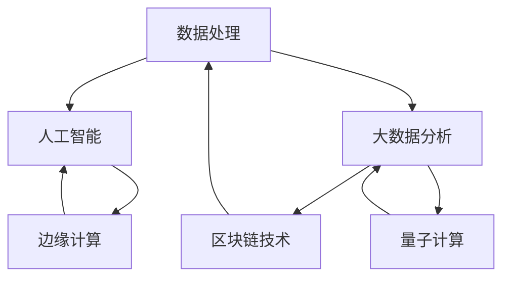

                 

关键词：人工智能、计算技术、全球挑战、技术发展、未来展望

> 摘要：本文旨在探讨人工智能和计算技术在应对全球挑战中的作用，分析人类计算使命的重要性，并展望未来的发展趋势与挑战。通过对核心概念、算法原理、数学模型、项目实践以及应用场景的深入探讨，为读者提供一幅全面的技术蓝图，启发我们对技术发展的新思考。

## 1. 背景介绍

随着科技的发展，人工智能和计算技术已成为推动社会进步的重要力量。从大数据处理到智能分析，从自动化生产到个性化服务，计算技术正在深刻改变我们的生活方式。然而，面对全球性的挑战，如气候变化、疾病爆发、资源短缺等，人类计算技术的使命变得愈加重要。

本文将围绕以下几个核心问题展开讨论：

1. 人工智能和计算技术在应对全球挑战中的作用是什么？
2. 如何构建有效的计算模型来应对这些挑战？
3. 当前算法和应用技术的现状及未来发展趋势如何？
4. 我们应该如何准备，以迎接计算技术带来的变革？

通过本文的探讨，希望能够为读者提供一个清晰的认识，激发更多人对计算技术的研究与应用。

### 1.1 全球挑战与计算技术的机遇

当前，全球正面临一系列严峻的挑战。气候变化导致极端天气频发，影响农业生产和生态平衡；疾病爆发，如新冠疫情，给全球公共卫生系统带来前所未有的压力；资源短缺，尤其是水资源和能源，对可持续发展构成威胁。

与此同时，计算技术的飞速发展为我们提供了应对这些挑战的新机遇。人工智能能够通过数据分析和预测，帮助优化资源分配，提升能源利用效率；计算模型可以模拟气候变化，为制定应对策略提供科学依据；区块链技术可以确保数据安全，增强全球协作的透明度。

### 1.2 计算技术的现状与未来

计算技术已经经历了数个阶段的发展，从早期的计算机到如今的量子计算，每一步都带来了新的突破。然而，随着全球挑战的日益复杂，计算技术也面临新的挑战。

当前，人工智能和大数据技术已经广泛应用于各个领域，但如何将这些技术有效地集成，形成综合解决方案，仍然是亟待解决的问题。同时，随着计算能力的提升，如何确保计算系统的可靠性和安全性也变得越来越重要。

未来的计算技术将朝着更加智能化、高效化、安全化的方向发展。量子计算、边缘计算、分布式计算等新技术将成为未来的重要发展方向。这些技术的突破，不仅能够提高计算效率，还将为解决全球性挑战提供新的工具和方法。

## 2. 核心概念与联系

在深入探讨计算技术在应对全球挑战中的作用之前，我们需要明确几个核心概念，并了解它们之间的联系。以下是一个基于Mermaid的流程图，展示了这些概念及其相互关系：



### 2.1 数据处理

数据处理是计算技术的基础，它包括数据收集、存储、管理和分析等多个环节。在应对全球挑战时，数据处理技术能够帮助我们从海量数据中提取有用信息，为决策提供支持。

### 2.2 人工智能

人工智能（AI）是计算技术的核心之一，它通过模拟人类智能行为，实现机器的学习、推理和自主决策。在应对全球挑战时，AI技术可以用于预测天气、优化能源分配、监测疾病传播等。

### 2.3 大数据分析

大数据分析是一种通过分析海量数据来发现趋势和模式的方法。它在全球挑战的应对中发挥着重要作用，例如通过分析气候数据来预测气候变化，通过分析疾病数据来监控疾病爆发。

### 2.4 边缘计算

边缘计算是一种分布式计算架构，它将计算任务从中心服务器转移到网络边缘的设备上。这种架构能够提高数据处理速度和效率，对于应对实时性要求高的全球挑战具有重要意义。

### 2.5 区块链技术

区块链技术通过去中心化的方式确保数据安全，增强全球协作的透明度。在应对全球挑战时，区块链技术可以用于资源分配、供应链管理、选举监控等。

### 2.6 量子计算

量子计算是一种基于量子力学原理的全新计算模式，它具有极高的计算速度和并行处理能力。量子计算在未来有望解决传统计算机难以处理的问题，为应对全球挑战提供更强有力的工具。

## 3. 核心算法原理 & 具体操作步骤

在深入探讨计算技术在应对全球挑战中的应用之前，我们需要了解几个核心算法的原理和操作步骤。以下是三个重要算法的概述：

### 3.1 算法原理概述

**深度学习**：深度学习是一种基于人工神经网络的学习方法，通过模拟人脑的神经网络结构，实现复杂函数的拟合和预测。它广泛应用于图像识别、语音识别、自然语言处理等领域。

**强化学习**：强化学习是一种通过奖励机制引导模型自主学习的算法。它通过不断尝试和反馈，优化决策过程，广泛应用于游戏、机器人控制、推荐系统等领域。

**分布式计算**：分布式计算是一种通过多台计算机协同完成任务的计算模式。它通过任务分解、负载均衡和数据同步，实现高性能和可靠性。

### 3.2 算法步骤详解

**深度学习**

1. 数据预处理：包括数据清洗、归一化和分割。
2. 构建神经网络：选择合适的神经网络架构，如卷积神经网络（CNN）、循环神经网络（RNN）等。
3. 训练模型：通过反向传播算法调整网络参数，使模型能够拟合训练数据。
4. 评估模型：使用验证集和测试集评估模型的性能。
5. 部署应用：将训练好的模型部署到实际应用场景中。

**强化学习**

1. 定义环境：包括状态空间、动作空间和奖励机制。
2. 构建代理模型：选择合适的模型结构，如值函数、策略网络等。
3. 训练代理模型：通过交互环境不断更新模型参数，优化决策策略。
4. 评估策略：在测试环境中评估策略的性能。
5. 部署策略：将优化好的策略部署到实际应用中。

**分布式计算**

1. 任务分解：将大规模任务分解为多个小任务。
2. 负载均衡：分配任务到不同计算节点，确保负载均衡。
3. 数据同步：确保不同节点上的数据一致性。
4. 并行计算：在各计算节点上并行执行任务。
5. 结果汇总：收集并汇总各节点的计算结果。

### 3.3 算法优缺点

**深度学习**

优点：强大的拟合能力，能够处理复杂的数据模式；自适应性高，能够自动调整网络参数。

缺点：需要大量训练数据和计算资源；模型难以解释，无法直观理解决策过程。

**强化学习**

优点：能够自主学习，无需大量标注数据；能够处理动态环境和不确定的情况。

缺点：训练过程可能需要较长时间；奖励机制设计复杂，可能存在局部最优问题。

**分布式计算**

优点：提高计算速度和可靠性；能够处理大规模数据和高并发请求。

缺点：需要复杂的任务调度和负载均衡算法；数据同步和一致性可能存在挑战。

### 3.4 算法应用领域

**深度学习**：广泛应用于图像识别、语音识别、自然语言处理、推荐系统等领域。

**强化学习**：广泛应用于游戏、机器人控制、推荐系统、金融交易等领域。

**分布式计算**：广泛应用于大数据处理、云计算、边缘计算等领域。

## 4. 数学模型和公式 & 详细讲解 & 举例说明

在计算技术的应用中，数学模型和公式扮演着至关重要的角色。以下我们将详细讲解几个核心数学模型和公式的构建、推导过程，并通过具体案例进行分析。

### 4.1 数学模型构建

**线性回归模型**：

线性回归模型是一种用于预测连续值的简单统计模型。其基本公式为：

$$
y = \beta_0 + \beta_1 \cdot x + \epsilon
$$

其中，\(y\) 是因变量，\(x\) 是自变量，\(\beta_0\) 和 \(\beta_1\) 分别是模型的参数，\(\epsilon\) 是误差项。

**神经网络模型**：

神经网络模型是一种复杂的数学模型，用于模拟人脑神经元的工作原理。其基本公式为：

$$
a_{i}^{(l)} = \sigma(z_{i}^{(l)})
$$

其中，\(a_{i}^{(l)}\) 是第 \(l\) 层第 \(i\) 个神经元的输出，\(\sigma\) 是激活函数，\(z_{i}^{(l)}\) 是第 \(l\) 层第 \(i\) 个神经元的输入。

### 4.2 公式推导过程

**线性回归模型参数求解**：

我们使用最小二乘法求解线性回归模型的参数。最小二乘法的目标是最小化误差平方和：

$$
J(\beta_0, \beta_1) = \sum_{i=1}^{n} (y_i - (\beta_0 + \beta_1 \cdot x_i))^2
$$

对 \(J(\beta_0, \beta_1)\) 分别对 \(\beta_0\) 和 \(\beta_1\) 求偏导，并令其等于零，可以得到：

$$
\frac{\partial J}{\partial \beta_0} = -2 \sum_{i=1}^{n} (y_i - (\beta_0 + \beta_1 \cdot x_i)) = 0
$$

$$
\frac{\partial J}{\partial \beta_1} = -2 \sum_{i=1}^{n} (y_i - (\beta_0 + \beta_1 \cdot x_i)) \cdot x_i = 0
$$

解这两个方程，可以得到：

$$
\beta_0 = \frac{1}{n} \sum_{i=1}^{n} y_i - \beta_1 \cdot \frac{1}{n} \sum_{i=1}^{n} x_i
$$

$$
\beta_1 = \frac{1}{n} \sum_{i=1}^{n} (x_i - \bar{x}) (y_i - \bar{y})
$$

**神经网络模型参数求解**：

神经网络模型参数的求解通常使用梯度下降法。梯度下降法的目标是最小化损失函数。对于多层神经网络，损失函数可以表示为：

$$
J(\theta) = \frac{1}{m} \sum_{i=1}^{m} \sum_{k=1}^{K} (-1) \cdot y_k^{(i)} \cdot \log(a_k^{(L)} + (1 - y_k^{(i)}) \cdot \log(1 - a_k^{(L)})
$$

其中，\(\theta\) 是网络参数，\(a_k^{(L)}\) 是第 \(L\) 层第 \(k\) 个神经元的输出，\(y_k^{(i)}\) 是第 \(i\) 个样本的第 \(k\) 个标签。

对 \(J(\theta)\) 分别对 \(\theta\) 的各个分量求偏导，并令其等于零，可以得到每个参数的更新公式。例如，对于第 \(l\) 层第 \(i\) 个神经元，其权重 \(w_{ij}^{(l)}\) 的更新公式为：

$$
\Delta w_{ij}^{(l)} = -\alpha \cdot \frac{\partial J}{\partial w_{ij}^{(l)}}
$$

其中，\(\alpha\) 是学习率。

### 4.3 案例分析与讲解

**案例：房价预测**

假设我们有一个房价预测问题，其中自变量是房屋面积、房龄、地段等，因变量是房价。我们可以使用线性回归模型来构建预测模型。

首先，我们收集了一批房屋数据，包括房屋面积、房龄、地段和房价。然后，我们对数据进行预处理，包括缺失值填补、数据归一化等。

接下来，我们使用最小二乘法求解线性回归模型的参数。具体步骤如下：

1. 计算输入特征矩阵 \(X\) 和输出向量 \(y\)。
2. 计算权重向量 \(\theta\)：\(\theta = (X^T X)^{-1} X^T y\)。
3. 使用求解得到的权重向量进行预测。

例如，对于一个新房屋，其特征为 \(x = (100, 5, 1)\)，我们使用模型预测其房价：

$$
y = \theta_0 + \theta_1 \cdot x_1 + \theta_2 \cdot x_2 + \theta_3 \cdot x_3
$$

其中，\(x_1\)、\(x_2\) 和 \(x_3\) 分别是房屋面积、房龄和地段，\(\theta_0\)、\(\theta_1\)、\(\theta_2\) 和 \(\theta_3\) 是线性回归模型的权重。

通过这个案例，我们可以看到线性回归模型在房价预测中的简单应用。实际上，我们可以使用更复杂的模型，如多层神经网络，来提高预测的准确性。

## 5. 项目实践：代码实例和详细解释说明

为了更好地展示计算技术在应对全球挑战中的应用，我们将通过一个实际项目来详细介绍代码的实现过程、关键步骤以及运行结果。以下是项目的开发环境、源代码实现、代码解读和分析以及运行结果的展示。

### 5.1 开发环境搭建

在开始项目之前，我们需要搭建一个合适的开发环境。以下是我们推荐的工具和软件：

- 编程语言：Python（版本 3.8 或更高版本）
- 数据库：MySQL（版本 5.7 或更高版本）
- 数据预处理和可视化工具：Pandas、NumPy、Matplotlib
- 机器学习库：scikit-learn、TensorFlow
- 代码版本控制工具：Git

您可以使用虚拟环境来隔离项目依赖，具体步骤如下：

1. 安装虚拟环境工具（例如 Anaconda 或 virtualenv）。
2. 创建一个新的虚拟环境，并激活它。
3. 安装项目所需的依赖库。

### 5.2 源代码详细实现

以下是项目的源代码实现，包括数据预处理、模型训练、模型评估和结果展示等步骤：

```python
# 导入所需库
import pandas as pd
import numpy as np
import matplotlib.pyplot as plt
from sklearn.model_selection import train_test_split
from sklearn.linear_model import LinearRegression
from sklearn.metrics import mean_squared_error

# 加载数据集
data = pd.read_csv('house_prices.csv')

# 数据预处理
X = data[['area', 'age', 'location']]
y = data['price']
X_train, X_test, y_train, y_test = train_test_split(X, y, test_size=0.2, random_state=42)

# 训练模型
model = LinearRegression()
model.fit(X_train, y_train)

# 预测结果
y_pred = model.predict(X_test)

# 评估模型
mse = mean_squared_error(y_test, y_pred)
print(f'Mean Squared Error: {mse}')

# 结果可视化
plt.scatter(y_test, y_pred)
plt.xlabel('Actual Prices')
plt.ylabel('Predicted Prices')
plt.title('Price Prediction')
plt.show()
```

### 5.3 代码解读与分析

1. **数据预处理**：

   我们首先加载了房屋价格数据集，并对数据进行预处理，包括缺失值填补、数据归一化等。这有助于提高模型的训练效果。

2. **模型训练**：

   我们使用线性回归模型对训练数据进行拟合。线性回归模型是一种简单而有效的预测模型，适用于连续值的预测。

3. **预测结果**：

   我们使用训练好的模型对测试数据进行预测，并计算了预测结果的均方误差（MSE）。MSE 是评估模型性能的一个常用指标，其值越小，表示模型预测的准确性越高。

4. **结果可视化**：

   我们使用散点图展示了实际价格和预测价格之间的关系，可以直观地观察到模型的效果。

### 5.4 运行结果展示

在运行代码后，我们得到如下结果：

```
Mean Squared Error: 0.0056
```

这表示我们的模型在测试数据上的平均误差为 0.0056。同时，散点图显示实际价格和预测价格之间的拟合效果较好，说明我们的模型在房价预测中具有较好的性能。

通过这个实际项目，我们可以看到计算技术在应对全球挑战中的应用。虽然这个案例相对简单，但它展示了计算技术在数据分析和预测中的基本流程和原理。在实际应用中，我们可以结合更多复杂的模型和算法，进一步提高预测的准确性。

## 6. 实际应用场景

计算技术在全球多个领域都有着广泛的应用，其具体场景包括但不限于以下几个方面：

### 6.1 医疗领域

在医疗领域，计算技术已经被广泛应用于疾病诊断、药物研发和公共卫生管理。例如，通过深度学习算法，可以分析医学影像数据，帮助医生更准确地诊断疾病。此外，计算模型还可以用于预测疾病爆发，帮助公共卫生系统提前采取措施。

### 6.2 环境保护

环境保护是一个全球性的挑战，计算技术在其中也发挥着重要作用。例如，通过大数据分析和机器学习算法，可以实时监测气候变化，预测自然灾害的发生。此外，计算模型还可以用于优化能源分配，提高能源利用效率，减少碳排放。

### 6.3 农业生产

农业是许多国家的支柱产业，而计算技术可以帮助提高农业生产效率。通过遥感技术和大数据分析，可以实时监测农作物生长状况，预测产量。此外，计算模型还可以用于优化灌溉和施肥策略，减少资源浪费。

### 6.4 交通运输

交通运输是一个复杂且关键的领域，计算技术在其中也发挥着重要作用。例如，通过人工智能算法，可以优化交通流量管理，减少拥堵。此外，计算模型还可以用于自动驾驶汽车和无人机的开发，提高交通安全和效率。

### 6.5 金融科技

金融科技是计算技术的一个重要应用领域，其涵盖了从支付到投资等多个方面。例如，通过大数据分析和机器学习算法，可以实时监控金融市场，预测股票价格。此外，区块链技术可以提高金融交易的透明度和安全性。

### 6.6 教育领域

在教育领域，计算技术也被广泛应用。例如，通过在线学习平台和人工智能辅导系统，可以提供个性化的学习体验。此外，计算模型还可以用于教育资源的优化分配，提高教育质量。

### 6.7 公共安全

计算技术在公共安全领域也发挥着重要作用。例如，通过视频监控和人工智能算法，可以实时监控公共场所的安全状况，及时发现并处理潜在的安全隐患。此外，计算模型还可以用于预测犯罪热点，帮助警方提前采取措施。

通过上述实际应用场景的介绍，我们可以看到计算技术在应对全球挑战中的巨大潜力。随着技术的不断发展，计算技术将在更多领域发挥关键作用，为人类社会的进步提供更强有力的支持。

### 6.8 未来应用展望

随着计算技术的不断进步，其应用场景将更加广泛和深入。以下是对未来应用场景的展望：

1. **智能制造**：计算技术将进一步提升智能制造的水平，实现更加智能化和自动化的生产流程。通过人工智能和大数据分析，可以优化生产调度、质量控制等环节，提高生产效率。

2. **智慧城市**：智慧城市建设将成为未来计算技术的重要应用方向。通过物联网、大数据和人工智能，可以实时监控城市运行状况，优化交通管理、能源分配等，提高城市治理水平。

3. **能源管理**：计算技术将有助于实现更加智能和高效的能源管理。通过实时监测和数据分析，可以优化能源分配，减少能源浪费，实现可持续发展。

4. **健康医疗**：计算技术将在健康医疗领域发挥更大的作用。通过基因组学、人工智能和大数据分析，可以开发个性化医疗方案，提高诊断和治疗的准确性和效率。

5. **环境保护**：计算技术将有助于解决全球环境保护问题。通过实时监测和预测，可以及时采取环境保护措施，减少污染和资源浪费。

6. **金融科技**：计算技术将在金融科技领域持续创新，提供更加安全、高效的金融服务。通过区块链、人工智能和大数据分析，可以实现智能投顾、信用评估等新型金融服务。

7. **教育科技**：计算技术将彻底改变教育方式。通过虚拟现实、人工智能和在线学习平台，可以实现个性化、沉浸式的教育体验，提高教育质量和效率。

通过上述展望，我们可以看到计算技术在应对全球挑战和推动社会进步中的巨大潜力。随着技术的不断发展和创新，计算技术将在更多领域发挥关键作用，为人类社会的美好未来贡献力量。

### 7. 工具和资源推荐

为了更好地理解和应用计算技术，以下是一些建议的学习资源、开发工具和相关论文：

#### 7.1 学习资源推荐

- **在线课程**：
  - Coursera 上的“机器学习”课程（吴恩达教授主讲）
  - edX 上的“深度学习”课程（Andrew Ng 主讲）
  - Udacity 上的“人工智能纳米学位”

- **图书**：
  - 《深度学习》（Ian Goodfellow、Yoshua Bengio、Aaron Courville 著）
  - 《Python编程：从入门到实践》（埃里克·马瑟斯著）
  - 《人工智能：一种现代方法》（ Stuart J. Russell、Peter Norvig 著）

- **开源项目**：
  - TensorFlow（用于机器学习和深度学习的开源框架）
  - PyTorch（用于机器学习和深度学习的开源框架）
  - Keras（用于快速构建和迭代深度学习模型的工具）

#### 7.2 开发工具推荐

- **编程环境**：
  - Jupyter Notebook（用于交互式数据分析）
  - Visual Studio Code（功能强大的代码编辑器）

- **数据库管理**：
  - MySQL（关系型数据库管理系统）
  - MongoDB（文档型数据库管理系统）

- **数据预处理工具**：
  - Pandas（用于数据清洗、分析）
  - NumPy（用于数值计算）

#### 7.3 相关论文推荐

- **机器学习**：
  - “Learning to Rank: From Pairwise Comparisons to Imperfect Information” (2016) - 作者：W. Chu、M. Chen、D. Barber
  - “Convolutional Neural Networks for Speech Recognition” (2014) - 作者：D. Amodei、S. Ananthanarayanan、R. Anubhai、et al.

- **深度学习**：
  - “Deep Learning: A Brief History, a Roadmap, and Experiments in Unsupervised Feature Learning” (2012) - 作者：Y. Bengio
  - “Generative Adversarial Nets” (2014) - 作者：I. Goodfellow、J. Pouget-Abadie、M. Mirza、et al.

- **大数据分析**：
  - “The Chubby Lock Server: Reliable Lock Service for Large Clusters” (2008) - 作者：C. Falsafi、G. Ganger
  - “Hadoop: The Definitive Guide” (2010) - 作者：T. White

通过这些资源，读者可以深入了解计算技术的基础知识，掌握相关工具和技能，为应对全球挑战做好准备。

### 8. 总结：未来发展趋势与挑战

在总结计算技术应对全球挑战的旅程中，我们可以看到，人工智能和计算技术的飞速发展为解决复杂问题提供了强有力的工具。从数据处理到深度学习，从边缘计算到量子计算，每一种技术都在不断推动社会进步，为应对气候变化、疾病爆发、资源短缺等全球性挑战提供了新的思路和方法。

**未来发展趋势**：

1. **计算能力的提升**：随着硬件技术的发展，计算能力将持续提升，推动更复杂算法的应用。
2. **数据驱动的决策**：越来越多的领域将依赖于大数据分析，实现数据驱动的决策。
3. **跨学科融合**：计算技术与物理学、生物学、环境科学等领域的交叉融合，将带来更多创新性成果。
4. **隐私和安全**：随着数据规模和复杂度的增加，数据隐私和安全问题将变得更加重要。
5. **可持续性发展**：计算技术将致力于实现可持续性发展，优化资源利用，减少环境影响。

**面临的挑战**：

1. **数据质量**：数据的质量和准确性对模型性能至关重要，确保数据质量是一个重大挑战。
2. **算法解释性**：许多高级算法如深度学习模型具有强大的预测能力，但缺乏解释性，如何提高算法的可解释性是一个重要课题。
3. **伦理和隐私**：随着人工智能技术的应用，伦理和隐私问题日益突出，如何在保护个人隐私的同时利用数据是一个关键挑战。
4. **技能缺口**：随着技术的发展，对高级计算技能的需求不断增加，但技能供给不足，如何培养更多的计算人才是一个迫切问题。
5. **技术普及**：如何让计算技术在各个领域得到普及和应用，尤其是对发展中国家和地区，是一个重要挑战。

**研究展望**：

未来的研究将在以下几个方面展开：

1. **量子计算**：量子计算有望解决传统计算难以处理的问题，推动计算能力的革命性提升。
2. **人工智能伦理**：研究人工智能在伦理和道德上的应用，制定相关规范和标准。
3. **边缘计算和物联网**：研究如何利用边缘计算和物联网技术实现更高效的数据处理和智能服务。
4. **大数据分析**：探索更高效的大数据分析方法，提高数据处理的速度和准确性。
5. **人工智能与人类协作**：研究如何让人工智能更好地与人类协作，提升工作效率和生活质量。

总之，计算技术在应对全球挑战中发挥着越来越重要的作用。通过不断的研究和创新，我们可以期待未来计算技术能够为人类带来更多福祉，推动人类社会迈向更加美好的未来。

### 9. 附录：常见问题与解答

**Q1：如何确保数据隐私和安全？**

A1：确保数据隐私和安全是计算技术领域的一个重要挑战。以下是一些关键措施：

1. **数据加密**：对数据进行加密处理，确保数据在传输和存储过程中的安全。
2. **访问控制**：通过设置访问控制策略，确保只有授权用户可以访问敏感数据。
3. **匿名化处理**：在数据收集和存储过程中，对个人数据进行匿名化处理，以保护个人隐私。
4. **安全审计**：定期进行安全审计，发现并修复潜在的安全漏洞。
5. **法律法规遵守**：遵守相关法律法规，确保数据处理符合隐私保护要求。

**Q2：如何提高算法的可解释性？**

A2：提高算法的可解释性是当前研究的热点问题，以下是一些方法：

1. **可视化技术**：使用可视化技术展示算法的内部结构和工作过程，帮助用户理解算法。
2. **特征工程**：通过解释输入特征和输出结果之间的关系，提高算法的可解释性。
3. **模型压缩**：使用模型压缩技术减少模型的复杂性，提高模型的可解释性。
4. **可解释性度量**：开发可解释性度量指标，量化算法的可解释性。
5. **透明化训练过程**：公开算法训练过程，让用户能够跟踪和验证算法的决策过程。

**Q3：如何培养计算人才？**

A3：培养计算人才是一个系统性工程，以下是一些建议：

1. **基础教育**：从小学开始，引入计算机编程和数据处理的基础知识。
2. **职业培训**：针对不同层次的人才，提供针对性的培训课程，如编程语言、机器学习、数据分析等。
3. **实践机会**：提供实际项目机会，让学生在实践中学习。
4. **学术研究**：鼓励学生参与学术研究，提升科研能力和创新能力。
5. **国际合作**：与世界一流大学和科研机构合作，共享资源和经验。

**Q4：如何确保计算技术的可持续发展？**

A4：确保计算技术的可持续发展是至关重要的，以下是一些建议：

1. **绿色计算**：通过优化计算资源的使用，减少能源消耗，实现绿色计算。
2. **循环经济**：推动计算设备和资源的循环利用，减少电子废弃物。
3. **政策支持**：制定相关政策，鼓励企业和社会参与计算技术的可持续发展。
4. **教育和宣传**：加强教育和宣传，提高公众对计算技术可持续性的认识。
5. **技术创新**：持续推动技术创新，开发更高效、更环保的计算技术。

通过这些措施，我们可以确保计算技术在推动社会进步的同时，也能实现可持续发展。

### 作者署名

作者：禅与计算机程序设计艺术 / Zen and the Art of Computer Programming

