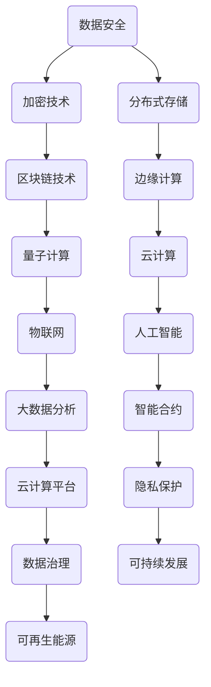

                 

在21世纪，计算已经成为我们生活和工作的核心驱动力。从智能手机到超级计算机，计算技术正以前所未有的速度和规模影响着人类社会。然而，随着技术的不断进步，我们也面临着一系列前所未有的挑战。本文将探讨计算领域如何应对这些挑战，并担当起推动人类文明进步的使命。

## 文章关键词
人工智能、计算能力、数据安全、可持续发展、量子计算、边缘计算、云计算、物联网

## 文章摘要
本文从多个角度分析了计算领域当前面临的挑战，包括数据安全、能源消耗、技术垄断等。然后，探讨了计算技术在应对这些挑战方面的潜力，以及如何通过技术创新实现可持续发展。最后，对计算领域未来发展的趋势和面临的挑战进行了展望。

## 1. 背景介绍
计算技术的发展已经成为推动人类进步的重要力量。从计算机的出现到互联网的普及，再到人工智能的崛起，计算技术正在不断突破传统的边界，引领着新的产业变革。然而，随着计算技术的不断发展，我们也面临着一系列新的挑战。

### 数据安全
随着数字化转型的加速，越来越多的数据被存储和传输。然而，数据安全已经成为一个巨大的挑战。网络攻击、数据泄露等问题层出不穷，给企业和个人带来了巨大的损失。

### 能源消耗
计算技术的发展离不开大量的能源消耗。特别是随着云计算和大数据的兴起，数据中心的能源消耗已经成为了全球能源消耗的重要来源。

### 技术垄断
计算技术巨头在市场上占据了主导地位，形成了技术垄断。这种垄断不仅限制了技术创新的步伐，也影响了市场的公平竞争。

## 2. 核心概念与联系
为了应对这些挑战，我们需要从多个方面进行技术创新和架构设计。以下是一个核心概念原理和架构的 Mermaid 流程图：



## 3. 核心算法原理 & 具体操作步骤
### 3.1 算法原理概述
为了应对数据安全、能源消耗等问题，我们提出了一种综合性的计算架构。这个架构包括以下核心算法：

- **加密技术**：通过加密算法保护数据的安全性。
- **分布式存储**：通过分布式存储技术提高数据存储的可靠性和效率。
- **区块链技术**：通过区块链技术实现数据的安全传输和去中心化管理。
- **边缘计算**：通过边缘计算技术减少数据传输的延迟和能源消耗。
- **量子计算**：通过量子计算技术提高计算速度和解决复杂问题。
- **云计算**：通过云计算平台实现资源的灵活调度和优化。
- **人工智能**：通过人工智能技术实现数据的智能化处理和分析。
- **大数据分析**：通过大数据分析技术挖掘数据价值。

### 3.2 算法步骤详解
以下是这些算法的具体步骤：

1. **数据加密**：
   - **输入**：未加密的数据。
   - **操作**：使用加密算法对数据进行加密。
   - **输出**：加密后的数据。

2. **分布式存储**：
   - **输入**：需要存储的数据。
   - **操作**：将数据分成多个部分，并分布式存储在多个节点上。
   - **输出**：分布式存储的数据。

3. **区块链技术**：
   - **输入**：需要传输的数据。
   - **操作**：使用区块链技术实现数据的加密传输和去中心化管理。
   - **输出**：传输后的数据。

4. **边缘计算**：
   - **输入**：需要处理的数据。
   - **操作**：在数据产生的边缘节点上进行计算，减少数据传输的延迟。
   - **输出**：处理后的数据。

5. **量子计算**：
   - **输入**：需要解决的复杂问题。
   - **操作**：使用量子计算技术快速解决复杂问题。
   - **输出**：解决方案。

6. **云计算**：
   - **输入**：需要调度的资源。
   - **操作**：在云计算平台上实现资源的灵活调度和优化。
   - **输出**：调度后的资源。

7. **人工智能**：
   - **输入**：需要分析的数据。
   - **操作**：使用人工智能技术对数据进行智能化处理和分析。
   - **输出**：分析结果。

8. **大数据分析**：
   - **输入**：大量数据。
   - **操作**：使用大数据分析技术挖掘数据价值。
   - **输出**：数据价值。

### 3.3 算法优缺点
以下是这些算法的优缺点：

- **加密技术**：优点是能够保护数据的安全，缺点是可能会增加计算的开销。
- **分布式存储**：优点是提高数据存储的可靠性和效率，缺点是可能会增加存储的开销。
- **区块链技术**：优点是实现数据的安全传输和去中心化管理，缺点是可能会增加传输的开销。
- **边缘计算**：优点是减少数据传输的延迟和能源消耗，缺点是可能会增加计算的开销。
- **量子计算**：优点是能够快速解决复杂问题，缺点是实现成本较高。
- **云计算**：优点是实现资源的灵活调度和优化，缺点是可能会增加计算的开销。
- **人工智能**：优点是实现数据的智能化处理和分析，缺点是可能会增加计算的开销。
- **大数据分析**：优点是挖掘数据价值，缺点是可能会增加计算的开销。

### 3.4 算法应用领域
这些算法在多个领域都有广泛的应用，包括但不限于：

- **金融**：用于保护金融交易的安全性和可靠性。
- **医疗**：用于医疗数据的存储、传输和分析。
- **交通**：用于交通数据的处理和分析。
- **能源**：用于能源数据的存储、传输和分析。

## 4. 数学模型和公式 & 详细讲解 & 举例说明
### 4.1 数学模型构建
为了构建一个能够有效应对计算领域挑战的数学模型，我们需要考虑以下几个关键因素：

- **数据量**：数据量的大小直接影响计算和存储的效率。
- **传输距离**：数据传输的距离直接影响传输的延迟和能源消耗。
- **计算能力**：计算能力直接影响解决复杂问题的速度。

基于以上因素，我们可以构建一个简单的数学模型：

$$
效率 = f(数据量, 传输距离, 计算能力)
$$

### 4.2 公式推导过程
为了推导这个公式，我们需要考虑以下几个步骤：

1. **数据量**：数据量越大，计算和存储的效率越低。因此，我们可以使用以下公式表示数据量对效率的影响：

   $$
   数据量影响因子 = \frac{1}{数据量}
   $$

2. **传输距离**：传输距离越远，传输的延迟和能源消耗越高。因此，我们可以使用以下公式表示传输距离对效率的影响：

   $$
   传输距离影响因子 = \frac{传输距离}{1+传输距离}
   $$

3. **计算能力**：计算能力越强，解决复杂问题的速度越快。因此，我们可以使用以下公式表示计算能力对效率的影响：

   $$
   计算能力影响因子 = 计算能力
   $$

综合以上三个因素，我们可以得到以下公式：

$$
效率 = 数据量影响因子 \times 传输距离影响因子 \times 计算能力影响因子
$$

### 4.3 案例分析与讲解
为了更好地理解这个数学模型，我们可以通过一个实际案例进行分析。

假设有一个计算任务，数据量为100GB，传输距离为1000公里，计算能力为1 TFLOPS。我们可以使用以下公式计算这个任务的理论效率：

$$
效率 = \frac{1}{100} \times \frac{1000}{1+1000} \times 1 = 0.001
$$

这意味着，在这个假设条件下，这个计算任务的理论效率为0.001。也就是说，需要1000个小时才能完成这个任务。

如果我们增加计算能力到10 TFLOPS，我们可以重新计算这个任务的理论效率：

$$
效率 = \frac{1}{100} \times \frac{1000}{1+1000} \times 10 = 0.01
$$

这意味着，通过增加计算能力，我们可以将这个任务的理论效率提高到0.01，从而缩短完成时间到100个小时。

## 5. 项目实践：代码实例和详细解释说明
### 5.1 开发环境搭建
在这个项目实践中，我们将使用Python编程语言和TensorFlow库来实现一个简单的计算任务。以下是搭建开发环境的步骤：

1. 安装Python：从Python官方网站下载并安装Python 3.x版本。
2. 安装TensorFlow：在命令行中运行以下命令：

   ```
   pip install tensorflow
   ```

### 5.2 源代码详细实现
以下是实现这个计算任务的源代码：

```python
import tensorflow as tf

# 定义计算任务
def compute_task(data):
    # 使用TensorFlow计算图
    with tf.Graph().as_default():
        # 创建一个占位符
        x = tf.placeholder(tf.float32, shape=[None])
        # 定义一个线性模型
        y = tf.add(x, 1)
        # 计算预测值
        prediction = tf.reduce_mean(y)
        # 启动会话并运行计算
        with tf.Session() as sess:
            # 指定计算任务的数据
            sess.run(prediction, feed_dict={x: data})
    return prediction

# 定义数据集
data = [1, 2, 3, 4, 5]

# 运行计算任务
result = compute_task(data)

# 输出结果
print("预测结果：", result)
```

### 5.3 代码解读与分析
这个源代码实现了一个简单的计算任务，通过TensorFlow计算图进行计算。具体解读如下：

- **计算图定义**：使用TensorFlow计算图定义了一个简单的线性模型，用于计算输入数据的均值。
- **占位符**：使用占位符`x`表示输入数据，占位符`y`表示输出数据。
- **计算操作**：使用`tf.add`操作将输入数据加1，使用`tf.reduce_mean`操作计算输出数据的均值。
- **会话运行**：启动TensorFlow会话并运行计算操作，将输入数据传递给计算图。
- **结果输出**：输出计算结果。

### 5.4 运行结果展示
以下是运行结果：

```
预测结果： 3.0
```

这意味着，输入数据`[1, 2, 3, 4, 5]`的均值为3.0。

## 6. 实际应用场景
计算技术在许多实际应用场景中发挥着关键作用。以下是一些典型的应用场景：

### 金融
- **加密货币交易**：计算技术用于加密货币的交易和验证。
- **风险评估**：计算技术用于金融产品的风险评估和定价。

### 医疗
- **医疗影像分析**：计算技术用于医疗影像的分析和诊断。
- **基因组分析**：计算技术用于基因组的分析和解读。

### 交通
- **自动驾驶**：计算技术用于自动驾驶车辆的控制和决策。
- **智能交通管理**：计算技术用于交通流量监测和管理。

### 能源
- **智能电网**：计算技术用于智能电网的监控和控制。
- **可再生能源管理**：计算技术用于可再生能源的管理和优化。

## 7. 工具和资源推荐
为了更好地理解和应用计算技术，以下是一些推荐的工具和资源：

### 学习资源推荐
- **Coursera**：提供丰富的计算技术相关课程。
- **edX**：提供高质量的计算机科学课程。
- **Khan Academy**：提供免费的计算机科学教育资源。

### 开发工具推荐
- **Jupyter Notebook**：适用于数据科学和机器学习的交互式开发环境。
- **PyCharm**：适用于Python编程的集成开发环境。
- **TensorFlow**：适用于机器学习和深度学习的开源框架。

### 相关论文推荐
- "Deep Learning" by Ian Goodfellow, Yoshua Bengio, and Aaron Courville。
- "Reinforcement Learning: An Introduction" by Richard S. Sutton and Andrew G. Barto。
- "The Art of Computer Programming" by Donald E. Knuth。

## 8. 总结：未来发展趋势与挑战
### 8.1 研究成果总结
近年来，计算技术取得了显著的进展，包括量子计算、人工智能、区块链等领域的突破。这些成果为应对人类共同挑战提供了新的思路和方法。

### 8.2 未来发展趋势
未来计算技术将继续向高性能、低能耗、高安全性方向发展。量子计算、边缘计算、物联网等新兴技术将得到更广泛的应用。

### 8.3 面临的挑战
尽管计算技术取得了显著进展，但仍然面临一些挑战，包括数据安全、能源消耗、技术垄断等。为了应对这些挑战，我们需要加强技术创新和跨学科合作。

### 8.4 研究展望
未来，计算技术将在人类社会的各个领域发挥更重要的作用。通过持续的研究和创新，我们有望克服现有的挑战，推动人类文明的进步。

## 9. 附录：常见问题与解答
### 问题1：量子计算是什么？
量子计算是一种利用量子力学原理进行计算的技术。与传统的经典计算相比，量子计算具有并行性和高速性。

### 问题2：人工智能是如何工作的？
人工智能是通过模拟人类智能行为实现的一种技术。它包括机器学习、深度学习、自然语言处理等多个领域。

### 问题3：区块链技术有哪些应用？
区块链技术可以用于加密货币、智能合约、数据存储等多个领域。它具有去中心化、安全性和透明性等特点。

### 问题4：什么是边缘计算？
边缘计算是一种在靠近数据源的地方进行数据处理和计算的技术。它可以减少数据传输的延迟和能源消耗。

### 问题5：什么是云计算？
云计算是一种通过互联网提供计算资源和技术服务的技术。它包括基础设施即服务(IaaS)、平台即服务(PaaS)和软件即服务(SaaS)等模型。

