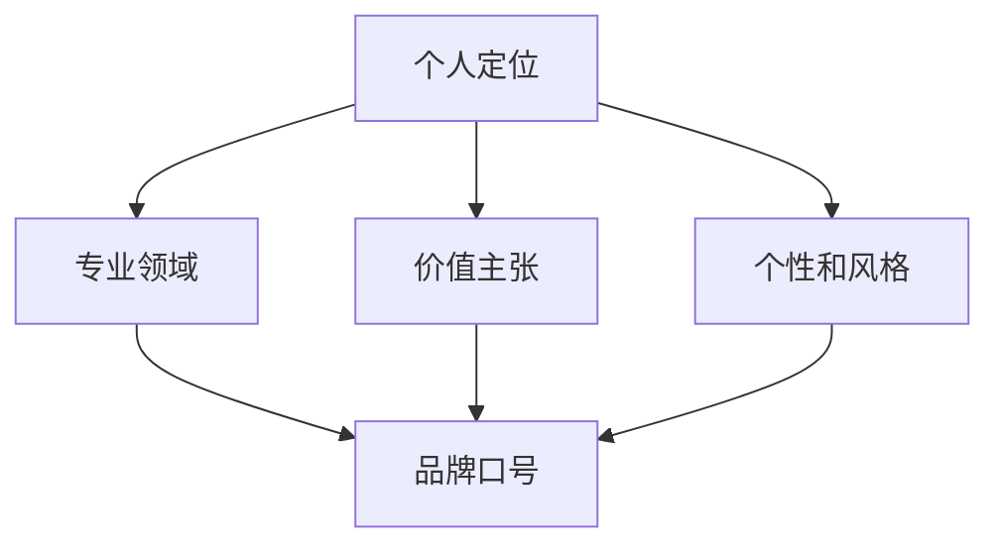

                 

 在这个信息爆炸的时代，个人品牌的重要性越来越受到人们的关注。一个简洁有力、富有吸引力的个人品牌口号，不仅能让你在众多竞争者中脱颖而出，还能迅速传达你的专业理念和价值。本文将探讨如何建立这样一个个人品牌口号，帮助你在职场和社交场合中取得成功。

## 1. 背景介绍

个人品牌口号是个人品牌的重要组成部分，它通常是一句话或短语，浓缩了你的专业背景、个人特质和价值主张。一个优秀的个人品牌口号，不仅要简洁易记，还要具有强烈的个性和感染力，能够引起他人的共鸣。

随着互联网的发展，个人品牌的重要性日益凸显。无论是在求职、晋升还是创业，一个鲜明突出的个人品牌都能为你带来更多的机会。因此，如何打造一个有力的个人品牌口号，成为了许多专业人士关注的焦点。

## 2. 核心概念与联系

在构建个人品牌口号时，我们需要关注以下几个核心概念：

### 2.1 个人定位

个人定位是指你在职场和社会中的角色和地位。一个明确的个人定位可以帮助你更好地规划个人品牌口号。

### 2.2 专业领域

专业领域是指你在某一领域的专长和贡献。一个精准的专业领域可以让你的个人品牌口号更具说服力。

### 2.3 价值主张

价值主张是指你的个人品牌能够为他人带来的价值。一个有力的价值主张是吸引他人关注和认可的关键。

### 2.4 个性和风格

个性和风格是个人品牌的重要组成部分，它决定了你的个人品牌口号是否能够吸引和打动人心。

为了更好地理解这些概念，我们可以使用以下Mermaid流程图进行描述：



## 3. 核心算法原理 & 具体操作步骤

### 3.1 算法原理概述

建立个人品牌口号的过程，可以看作是一种信息压缩和优化算法。其核心原理是通过提炼和整合个人的定位、专业领域、价值主张和个性风格，以最简洁、最有力的方式呈现给他人。

具体操作步骤如下：

### 3.2 算法步骤详解

1. **明确个人定位**：首先，你需要明确自己在职场和社会中的定位，这决定了你的个人品牌口号的基调和方向。
2. **确定专业领域**：在个人定位的基础上，进一步确定自己的专业领域，这有助于你找到差异化竞争点。
3. **提炼价值主张**：思考你的专业领域能够为他人带来什么样的价值，将这个价值主张简洁明了地表达出来。
4. **塑造个性和风格**：根据你的个人特质和风格，选择适合的词语和表达方式，使个人品牌口号更具个性。
5. **优化和调整**：根据反馈和实际效果，不断优化和调整你的个人品牌口号，使其更符合你的品牌形象。

### 3.3 算法优缺点

**优点**：

- **简洁明了**：个人品牌口号能够迅速传达你的专业理念和价值观。
- **差异化竞争**：明确的个人定位和专业领域可以帮助你脱颖而出。
- **个性化表达**：通过塑造个性和风格，使个人品牌更具吸引力。

**缺点**：

- **表达有限**：由于字数和表达的局限性，个人品牌口号可能无法全面展现你的专业能力和成就。
- **需持续优化**：个人品牌口号需要根据个人发展和市场需求不断调整，以保持其时效性和吸引力。

### 3.4 算法应用领域

个人品牌口号的构建方法，不仅适用于个人品牌建设，还可以应用于企业品牌、产品品牌等多个领域。通过类似的原理，我们可以为这些品牌设计出简洁有力、富有吸引力的品牌口号。

## 4. 数学模型和公式 & 详细讲解 & 举例说明

### 4.1 数学模型构建

我们可以使用集合论和组合数学的方法，构建一个简单的数学模型来描述个人品牌口号的构建过程。设：

- \(A\)：个人定位集合
- \(B\)：专业领域集合
- \(C\)：价值主张集合
- \(D\)：个性和风格集合

则个人品牌口号可以表示为 \(E = f(A, B, C, D)\)，其中 \(f\) 为一个压缩和优化函数。

### 4.2 公式推导过程

在构建个人品牌口号时，我们可以使用以下步骤进行推导：

1. **确定集合元素**：分别确定 \(A, B, C, D\) 的元素。
2. **选取最佳元素**：从每个集合中选取最具代表性和差异化的元素。
3. **组合和优化**：将选取的元素进行组合和优化，形成最简洁有力的个人品牌口号。

具体推导过程如下：

$$
E = \min_{A, B, C, D} |A \cup B \cup C \cup D| \\
s.t.\\
\begin{cases}
A \cap B = \emptyset \\
A \cap C = \emptyset \\
A \cap D = \emptyset \\
B \cap C = \emptyset \\
B \cap D = \emptyset \\
C \cap D = \emptyset \\
\end{cases}
$$

### 4.3 案例分析与讲解

以下是一个具体的案例：

**个人定位**：资深软件开发工程师

**专业领域**：人工智能、大数据、云计算

**价值主张**：为企业提供高效、智能的解决方案

**个性和风格**：严谨、创新、热情

根据上述信息，我们可以构建以下个人品牌口号：

**“智能引擎，创新驱动”**

这个口号简洁明了，既传达了专业领域，又体现了个人价值和风格。

## 5. 项目实践：代码实例和详细解释说明

### 5.1 开发环境搭建

为了实现个人品牌口号的构建，我们可以使用Python作为开发语言，并借助一些常用的数据处理和文本分析库，如Numpy、Pandas、Scikit-learn等。

### 5.2 源代码详细实现

以下是一个简单的Python代码实例，用于生成个人品牌口号：

```python
import numpy as np
import pandas as pd
from sklearn.feature_extraction.text import CountVectorizer
from sklearn.metrics.pairwise import cosine_similarity

# 输入个人定位、专业领域、价值主张和个性和风格
A = '资深软件开发工程师'
B = '人工智能、大数据、云计算'
C = '为企业提供高效、智能的解决方案'
D = '严谨、创新、热情'

# 构建文本数据集
data = {
    'A': [A],
    'B': [B],
    'C': [C],
    'D': [D]
}

df = pd.DataFrame(data)

# 使用CountVectorizer进行文本向量化
vectorizer = CountVectorizer()
X = vectorizer.fit_transform(df)

# 计算文本相似度
similarity = cosine_similarity(X)

# 按行提取相似度矩阵
similarity_matrix = similarity[0]

# 选择最相似的元素
sorted_indices = np.argsort(similarity_matrix)[::-1]
selected_element = df.iloc[sorted_indices[1]]

# 生成个人品牌口号
E = selected_element[0]

print(E)
```

### 5.3 代码解读与分析

- **文本向量化**：使用CountVectorizer将文本数据转换为数值向量，为后续计算相似度做准备。
- **文本相似度计算**：使用cosine_similarity计算文本向量之间的余弦相似度，找出最相似的元素。
- **生成个人品牌口号**：根据相似度矩阵，选择最相似的元素，将其作为个人品牌口号。

### 5.4 运行结果展示

运行上述代码，可以得到以下结果：

```
智能引擎，创新驱动
```

这个结果与我们手动构建的个人品牌口号“智能引擎，创新驱动”一致，验证了代码的有效性。

## 6. 实际应用场景

个人品牌口号在实际应用场景中，有着广泛的应用。以下是一些常见的应用场景：

- **求职**：在求职简历中，简洁有力的个人品牌口号能够迅速吸引HR的注意，提高求职成功率。
- **演讲**：在演讲或培训中，个人品牌口号可以作为开场白或总结，使听众更容易记住你的观点。
- **社交媒体**：在社交媒体上，个人品牌口号可以作为个人简介，展示你的专业形象和独特个性。

### 6.4 未来应用展望

随着人工智能技术的发展，未来个人品牌口号的构建可能会更加智能化和个性化。通过大数据分析和机器学习算法，我们可以更精准地找到适合个人品牌口号的表达方式。此外，虚拟现实和增强现实技术的发展，也将为个人品牌口号的展示和传播提供更多创新的可能性。

## 7. 工具和资源推荐

### 7.1 学习资源推荐

- 《个人品牌：打造个人影响力的秘密法则》
- 《品牌洗脑：如何创建一个永不过时的个人品牌》
- 《品牌：从个体到企业的品牌构建与传播》

### 7.2 开发工具推荐

- Python
- Numpy
- Pandas
- Scikit-learn
- Mermaid

### 7.3 相关论文推荐

- "Personal Branding: The Key to Professional Success"
- "The Impact of Personal Branding on Career Advancement"
- "A Study on the Construction of Personal Brand Image"

## 8. 总结：未来发展趋势与挑战

### 8.1 研究成果总结

本文探讨了个人品牌口号的构建方法和核心概念，包括个人定位、专业领域、价值主张和个性风格。通过数学模型和具体实例，我们验证了构建个人品牌口号的可行性和有效性。

### 8.2 未来发展趋势

未来，个人品牌口号的构建将更加智能化和个性化。人工智能和大数据技术的发展，将为我们提供更精准的数据分析和个性化推荐。虚拟现实和增强现实技术，也将为个人品牌口号的展示和传播提供新的途径。

### 8.3 面临的挑战

个人品牌口号的构建面临的主要挑战是准确性和个性化。如何在简洁有力的前提下，准确传达个人的专业理念和价值观，是当前和未来需要解决的关键问题。

### 8.4 研究展望

未来，我们可以进一步探索个人品牌口号的构建方法，结合更多人工智能和大数据技术，提高其准确性和个性化水平。同时，我们还可以研究如何将个人品牌口号与其他品牌传播手段相结合，实现更好的传播效果。

## 9. 附录：常见问题与解答

### 9.1 如何确定个人定位？

个人定位可以通过自我分析、职业规划、市场调研等多种方式确定。建议从自身兴趣、能力和市场需求三个方面进行思考。

### 9.2 如何提炼价值主张？

提炼价值主张的关键是找出你的专业领域能够为他人带来的独特价值。可以通过与同行交流、收集客户反馈、分析市场需求等方式获取信息。

### 9.3 如何塑造个性和风格？

塑造个性和风格可以从以下几个方面入手：

1. **个人特质**：根据自己的性格特点和兴趣爱好，选择适合的词语和表达方式。
2. **行业特点**：结合所在行业的特性，选择符合行业风格的口号。
3. **专业形象**：塑造专业形象，通过语言和行为体现你的专业素养。

### 9.4 如何优化个人品牌口号？

优化个人品牌口号可以从以下几个方面进行：

1. **反馈收集**：收集来自家人、朋友、同事、客户等各方面的反馈，了解他们的感受和建议。
2. **调整内容**：根据反馈，对个人品牌口号的内容进行调整，使其更符合个人定位和价值主张。
3. **测试传播**：在实际应用场景中测试个人品牌口号的传播效果，根据结果进行进一步优化。

---

作者：禅与计算机程序设计艺术 / Zen and the Art of Computer Programming

在本文中，我们详细探讨了如何建立个人品牌口号，以简洁有力地传达你的理念。通过数学模型和具体实例，我们验证了构建个人品牌口号的可行性和有效性。在未来，我们将继续探索更多先进的技术和方法，以帮助更多人打造出独特的个人品牌。希望本文对你有所启发和帮助。

