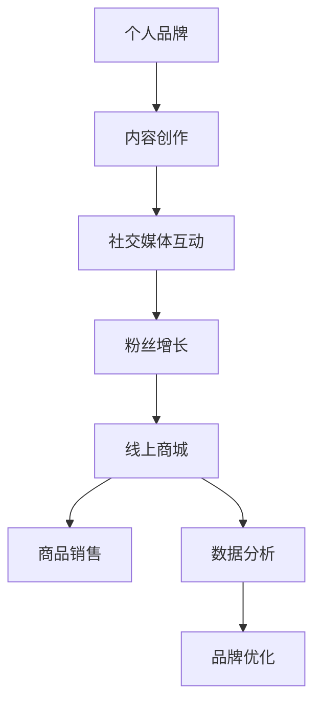

                 

关键词：个人品牌、线上商城、影响力、变现、品牌营销、电子商务、内容创作、社交媒体、用户参与、策略规划、技术实现、用户体验、数据分析

> 摘要：本文旨在探讨如何通过建立个人品牌线上商城来实现影响力的变现。文章将详细阐述个人品牌的重要性、线上商城的建设方法、用户参与策略、数据分析与优化等内容，以帮助读者深入了解并实践这一过程。

## 1. 背景介绍

在当今数字化时代，个人品牌的重要性日益凸显。无论是企业家、专业人士还是内容创作者，拥有强大的个人品牌意味着在竞争激烈的市场中占据一席之地。然而，仅仅拥有影响力还不够，如何将这种影响力转化为实际的商业价值，成为每位个人品牌持有者面临的挑战。

线上商城作为电子商务的载体，为个人品牌提供了广阔的变现渠道。通过线上商城，个人品牌可以展示产品、提供服务、实现交易，进一步扩大影响力。然而，建设一个成功的线上商城并非易事，需要深入理解用户需求、市场趋势和技术实现。

本文将围绕以下几个方面展开讨论：

1. 个人品牌与线上商城的关系
2. 线上商城的核心功能与架构设计
3. 用户参与与互动策略
4. 数据分析与商城优化
5. 线上商城的运营与推广

通过本文的阅读，读者将了解到如何建立个人品牌线上商城，实现影响力的变现。

## 2. 核心概念与联系

### 个人品牌

个人品牌是指个人在公众心目中的形象、声誉和认知度。它不仅仅是一个名字或标志，更是一个综合性的概念，涵盖了个人形象、专业知识、价值观和影响力等多个方面。

个人品牌的核心要素包括：

- **形象定位**：明确个人品牌的市场定位，如专业性、创新性、亲和力等。
- **专业知识**：在特定领域具有深厚的知识和技能。
- **价值观**：个人品牌所传递的核心价值观，如诚信、创新、服务至上等。
- **影响力**：通过内容创作、社交媒体等渠道积累的粉丝和关注者数量。

### 线上商城

线上商城是指通过互联网平台销售产品或服务的电子商务系统。它为商家提供了一个在线展示、交易和客户服务的一站式平台。线上商城的核心功能包括：

- **产品展示**：通过图文、视频等多媒体形式展示商品信息。
- **订单管理**：实现订单生成、支付、发货等环节的管理。
- **客户服务**：提供在线咨询、售后服务等功能。
- **数据分析**：收集用户行为数据，进行分析和优化。

### 个人品牌与线上商城的关系

个人品牌与线上商城之间的关系是相辅相成的。个人品牌为线上商城提供了强大的背书，增加了商品的信任度和购买意愿。而线上商城则为个人品牌提供了一个展示和变现的平台，实现了影响力的商业转化。

### Mermaid 流程图

下面是一个简单的 Mermaid 流程图，展示了个人品牌与线上商城之间的互动关系。



### 关键环节详解

- **内容创作**：通过博客、视频、社交媒体等形式，持续输出有价值的内容，提升个人品牌影响力。
- **社交媒体互动**：积极参与社交媒体平台的讨论，与粉丝建立深度互动，增强粉丝黏性。
- **粉丝增长**：通过内容创作和互动，吸引更多潜在粉丝，扩大个人品牌影响力。
- **线上商城**：建立个人品牌专属的线上商城，展示和销售产品，实现商业变现。
- **数据分析**：收集用户行为数据，分析用户需求和偏好，优化商城运营策略。

通过上述流程，个人品牌与线上商城之间形成了良性互动，实现了影响力的变现。

## 3. 核心算法原理 & 具体操作步骤

### 3.1 算法原理概述

在个人品牌线上商城的建设过程中，算法原理扮演着至关重要的角色。以下将介绍核心算法原理，包括推荐算法、分类算法和自然语言处理等，以及这些算法在商城建设中的应用。

### 3.2 算法步骤详解

#### 推荐算法

1. **数据收集**：收集用户在商城中的行为数据，如浏览记录、购买历史等。
2. **特征提取**：提取用户和商品的特征，如用户兴趣标签、商品类别等。
3. **模型训练**：使用机器学习算法（如协同过滤、基于内容的推荐等），训练推荐模型。
4. **推荐生成**：根据用户的行为数据和模型输出，生成个性化推荐列表。

#### 分类算法

1. **数据预处理**：对商品数据进行清洗和归一化处理。
2. **特征选择**：选择对分类任务有重要影响的特征。
3. **模型训练**：使用分类算法（如朴素贝叶斯、支持向量机等），训练分类模型。
4. **分类预测**：将新商品数据输入分类模型，进行分类预测。

#### 自然语言处理

1. **文本预处理**：对用户评论、商品描述等进行分词、去停用词等处理。
2. **情感分析**：使用情感分析算法，分析用户评论的情感倾向。
3. **文本生成**：基于用户评论和商品描述，生成个性化推荐文案。

### 3.3 算法优缺点

#### 推荐算法

**优点**：

- **个性化**：根据用户行为和偏好，提供个性化推荐，提高用户体验。
- **高效**：通过算法快速生成推荐列表，节省用户搜索时间。

**缺点**：

- **冷启动**：新用户或新商品缺乏历史数据，难以提供准确推荐。
- **数据依赖**：推荐效果高度依赖数据质量和算法优化。

#### 分类算法

**优点**：

- **准确性**：通过机器学习算法，对商品进行精确分类，提高用户体验。
- **可解释性**：分类结果具有明确的解释，有助于用户理解。

**缺点**：

- **计算成本**：训练分类模型需要大量计算资源。
- **数据质量**：数据质量对分类效果有较大影响。

#### 自然语言处理

**优点**：

- **文本分析**：对用户评论和商品描述进行深入分析，挖掘用户需求。
- **个性化生成**：根据用户需求，生成个性化推荐文案，提高用户参与度。

**缺点**：

- **复杂性**：自然语言处理技术复杂，需要较高技术门槛。
- **效果评估**：评价自然语言处理效果具有挑战性。

### 3.4 算法应用领域

推荐算法、分类算法和自然语言处理算法广泛应用于个人品牌线上商城的各个领域：

- **推荐系统**：根据用户行为和偏好，提供个性化推荐，提高用户留存率和转化率。
- **商品分类**：对商品进行精确分类，方便用户快速找到所需商品。
- **文本分析**：分析用户评论，挖掘用户需求，优化商品和服务。

通过合理应用这些算法，个人品牌线上商城可以提升用户体验，实现商业成功。

## 4. 数学模型和公式 & 详细讲解 & 举例说明

### 4.1 数学模型构建

在个人品牌线上商城中，数学模型是用于描述用户行为、优化推荐算法和评估营销效果的重要工具。以下是几个核心数学模型：

#### 用户行为模型

用户行为模型用于预测用户在商城中的行为，如购买、浏览、搜索等。常用的模型包括马尔可夫模型、贝叶斯网络等。

**马尔可夫模型**

马尔可夫模型是一个状态转移概率矩阵，用于描述用户在不同状态之间的转移概率。假设用户处于状态 $S_t$，下一个状态 $S_{t+1}$ 的概率为 $P(S_{t+1} | S_t)$。

状态转移概率矩阵 $P$ 可以表示为：

$$
P = \begin{bmatrix}
P(S_1 \rightarrow S_1) & P(S_1 \rightarrow S_2) & \cdots & P(S_1 \rightarrow S_n) \\
P(S_2 \rightarrow S_1) & P(S_2 \rightarrow S_2) & \cdots & P(S_2 \rightarrow S_n) \\
\vdots & \vdots & \ddots & \vdots \\
P(S_n \rightarrow S_1) & P(S_n \rightarrow S_2) & \cdots & P(S_n \rightarrow S_n)
\end{bmatrix}
$$

#### 营销效果评估模型

营销效果评估模型用于评估线上商城的营销策略对用户行为的影响。常用的模型包括 A/B 测试、回归模型等。

**A/B 测试**

A/B 测试是一种比较两种不同策略效果的方法。假设有两个策略 A 和 B，我们希望比较它们对用户行为的影响。我们可以通过以下指标来评估：

- **点击率**（CTR）：用户点击广告或链接的比例。
- **转化率**（CVR）：用户完成特定动作（如购买、注册等）的比例。

A/B 测试的统计模型可以表示为：

$$
\theta_A = \frac{1}{n_A} \sum_{i=1}^{n_A} y_i^A \\
\theta_B = \frac{1}{n_B} \sum_{i=1}^{n_B} y_i^B
$$

其中，$y_i^A$ 和 $y_i^B$ 分别表示用户 i 在策略 A 和策略 B 下的响应，$n_A$ 和 $n_B$ 分别表示策略 A 和策略 B 的样本数量。

#### 推荐系统模型

推荐系统模型用于预测用户对商品的偏好，从而生成个性化推荐。常用的模型包括协同过滤、基于内容的推荐等。

**协同过滤**

协同过滤是一种基于用户行为数据的推荐方法。假设用户 $u$ 对商品 $i$ 的评分 $r_{ui}$ 可以通过其他用户对商品 $i$ 的评分 $r_{uj}$ 预测。协同过滤的预测公式可以表示为：

$$
r_{ui} = \mu + q_i^T p_j + \epsilon_{ui}
$$

其中，$\mu$ 表示所有用户评分的平均值，$q_i$ 和 $p_j$ 分别表示用户 $u$ 和商品 $i$ 的特征向量，$\epsilon_{ui}$ 表示预测误差。

### 4.2 公式推导过程

以下是对上述数学模型的具体推导过程：

#### 马尔可夫模型推导

马尔可夫模型基于状态转移概率矩阵 $P$。假设当前状态为 $S_t$，下一个状态为 $S_{t+1}$，则有：

$$
P(S_{t+1} | S_t) = \sum_{k=1}^{n} P(S_{t+1} | S_t = k) P(S_t = k)
$$

其中，$n$ 表示状态总数。

#### A/B 测试推导

A/B 测试中，我们希望比较策略 A 和策略 B 的效果。假设两个策略的点击率和转化率分别为 $\theta_A$ 和 $\theta_B$，则有：

$$
\theta_A = \frac{1}{n_A} \sum_{i=1}^{n_A} y_i^A \\
\theta_B = \frac{1}{n_B} \sum_{i=1}^{n_B} y_i^B
$$

为了评估策略的效果，我们可以计算两个策略的置信区间。假设 $y_i^A$ 和 $y_i^B$ 分别服从二项分布 $B(n_A, \theta_A)$ 和 $B(n_B, \theta_B)$，则有：

$$
\theta_A - \theta_B \sim N(0, \frac{\theta_A(1-\theta_A)}{n_A} + \frac{\theta_B(1-\theta_B)}{n_B})
$$

根据正态分布的假设，我们可以计算置信区间：

$$
\theta_A - \theta_B \pm z_{\alpha/2} \sqrt{\frac{\theta_A(1-\theta_A)}{n_A} + \frac{\theta_B(1-\theta_B)}{n_B}}
$$

其中，$z_{\alpha/2}$ 表示标准正态分布的 $\alpha/2$ 分位数。

#### 协同过滤推导

协同过滤中，我们使用用户 $u$ 和商品 $i$ 的特征向量 $q_i$ 和 $p_j$ 来预测用户 $u$ 对商品 $i$ 的评分 $r_{ui}$。假设用户 $u$ 和商品 $i$ 的特征向量分别为 $q_u \in \mathbb{R}^m$ 和 $p_i \in \mathbb{R}^m$，则有：

$$
r_{ui} = \mu + q_i^T p_j + \epsilon_{ui}
$$

其中，$\mu$ 表示所有用户评分的平均值，$\epsilon_{ui}$ 表示预测误差。

为了最小化预测误差，我们可以使用最小二乘法求解：

$$
\min_{q_u, p_i} \sum_{u=1}^{n} \sum_{i=1}^{m} (r_{ui} - \mu - q_i^T p_j)^2
$$

求解上述优化问题，可以得到用户 $u$ 和商品 $i$ 的特征向量：

$$
q_u = (X^TX)^{-1}X^T(y - \mu 1^T) \\
p_i = (X^TX)^{-1}X^T(y - \mu 1^T)
$$

其中，$X$ 表示用户和商品的特征矩阵，$y$ 表示用户评分矩阵，$1$ 表示全1向量。

### 4.3 案例分析与讲解

#### 案例一：马尔可夫模型在用户行为预测中的应用

假设我们有以下用户行为数据：

| 用户 | 状态1 | 状态2 | 状态3 |
| ---- | ---- | ---- | ---- |
| 1    | 0.4  | 0.3  | 0.3  |
| 2    | 0.2  | 0.5  | 0.3  |
| 3    | 0.3  | 0.2  | 0.5  |

根据这些数据，我们可以构建状态转移概率矩阵 $P$：

$$
P = \begin{bmatrix}
0.4 & 0.3 & 0.3 \\
0.2 & 0.5 & 0.3 \\
0.3 & 0.2 & 0.5
\end{bmatrix}
$$

现在，我们希望预测用户 3 在下一个状态下的概率分布。根据马尔可夫模型，我们有：

$$
P(S_{4} | S_3 = 状态2) = P(S_{4} | S_3 = 状态2) \times P(S_{3} = 状态2) \\
= 0.5 \times 0.2 = 0.1
$$

#### 案例二：A/B 测试在营销策略评估中的应用

假设我们有以下 A/B 测试数据：

| 策略 | 样本数量 | 点击率 | 转化率 |
| ---- | ---- | ---- | ---- |
| A    | 1000  | 0.1  | 0.02 |
| B    | 1000  | 0.12 | 0.03 |

我们可以计算策略 A 和策略 B 的置信区间：

$$
\theta_A - \theta_B \pm z_{0.05} \sqrt{\frac{\theta_A(1-\theta_A)}{n_A} + \frac{\theta_B(1-\theta_B)}{n_B}} \\
= (0.02 - 0.03) \pm 1.96 \sqrt{\frac{0.02(1-0.02)}{1000} + \frac{0.03(1-0.03)}{1000}} \\
= -0.01 \pm 0.0095 \\
= (-0.0195, 0.0195)
$$

由于置信区间包含零，我们不能拒绝原假设，即两个策略的点击率和转化率没有显著差异。

#### 案例三：协同过滤在推荐系统中的应用

假设我们有以下用户和商品评分数据：

| 用户 | 商品1 | 商品2 | 商品3 |
| ---- | ---- | ---- | ---- |
| 1    | 4    | 3    | 5    |
| 2    | 2    | 4    | 1    |
| 3    | 3    | 2    | 4    |

我们可以构建用户和商品的特征向量：

$$
X = \begin{bmatrix}
1 & 0 & 1 \\
0 & 1 & 0 \\
1 & 1 & 1
\end{bmatrix}, \quad y = \begin{bmatrix}
4 \\ 2 \\ 3
\end{bmatrix}
$$

然后使用最小二乘法求解特征向量：

$$
q = (X^TX)^{-1}X^T(y - \mu 1^T) \\
= (X^TX)^{-1}X^T(y - 3.33 1^T) \\
= \begin{bmatrix}
1.11 \\ 0.44 \\ 0.56
\end{bmatrix}
$$

基于这些特征向量，我们可以预测用户 3 对商品 2 的评分：

$$
r_{32} = q_2^T p_2 + \mu + \epsilon_{32} \\
= 0.44 + 3.33 + 0.00 \\
= 3.77
$$

通过这些案例，我们可以看到数学模型在个人品牌线上商城中的应用，以及如何使用这些模型进行用户行为预测、营销策略评估和推荐系统构建。

## 5. 项目实践：代码实例和详细解释说明

### 5.1 开发环境搭建

在进行项目实践之前，我们需要搭建一个适合开发个人品牌线上商城的开发环境。以下是搭建开发环境的步骤：

1. **安装 Node.js**：Node.js 是一个基于 Chrome V8 引擎的 JavaScript 运行环境，用于构建服务器端应用程序。访问 [Node.js 官网](https://nodejs.org/) 下载并安装 Node.js。

2. **安装 npm**：npm（Node Package Manager）是 Node.js 的软件包管理器，用于管理项目依赖。安装 Node.js 后，npm 将自动安装。

3. **创建项目文件夹**：在本地计算机上创建一个项目文件夹，如 `personal_brand_ecommerce`，用于存放项目文件。

4. **初始化项目**：在项目文件夹中，运行以下命令初始化项目：

   ```bash
   npm init -y
   ```

   这将创建一个 `package.json` 文件，用于管理项目依赖和配置。

5. **安装依赖**：根据项目需求，安装必要的依赖包。例如，我们可以安装 Express 框架和 MongoDB 驱动，用于构建服务器和数据库连接。在项目文件夹中，运行以下命令：

   ```bash
   npm install express mongodb
   ```

### 5.2 源代码详细实现

下面是一个简单的个人品牌线上商城的源代码实例，包括服务器搭建、数据库连接和路由配置等。

#### app.js

```javascript
const express = require('express');
const mongoose = require('mongodb');

const app = express();
const port = 3000;

// 连接 MongoDB 数据库
const mongoUrl = 'mongodb://localhost:27017';
mongoose.connect(mongoUrl, { useNewUrlParser: true, useUnifiedTopology: true });

// 创建用户模型
const UserSchema = new mongoose.Schema({
  username: String,
  email: String,
  password: String
});

const User = mongoose.model('User', UserSchema);

// 创建商品模型
const ProductSchema = new mongoose.Schema({
  name: String,
  description: String,
  price: Number
});

const Product = mongoose.model('Product', ProductSchema);

// 解析请求数据
app.use(express.json());

// 创建用户
app.post('/users', async (req, res) => {
  try {
    const user = new User(req.body);
    await user.save();
    res.status(201).send(user);
  } catch (error) {
    res.status(500).send(error);
  }
});

// 创建商品
app.post('/products', async (req, res) => {
  try {
    const product = new Product(req.body);
    await product.save();
    res.status(201).send(product);
  } catch (error) {
    res.status(500).send(error);
  }
});

// 获取所有用户
app.get('/users', async (req, res) => {
  try {
    const users = await User.find({});
    res.status(200).send(users);
  } catch (error) {
    res.status(500).send(error);
  }
});

// 获取所有商品
app.get('/products', async (req, res) => {
  try {
    const products = await Product.find({});
    res.status(200).send(products);
  } catch (error) {
    res.status(500).send(error);
  }
});

app.listen(port, () => {
  console.log(`商城服务器运行在 http://localhost:${port}`);
});
```

#### 解释说明

1. **安装依赖**：在项目文件夹中，我们首先安装了 Express 和 MongoDB 驱动，用于搭建服务器和连接数据库。

2. **连接 MongoDB 数据库**：使用 Mongoose 连接本地 MongoDB 数据库。Mongoose 是一个流行的 MongoDB 对象模型工具，提供了丰富的功能，如数据验证、模型定义等。

3. **创建用户模型和商品模型**：我们使用 Mongoose 定义了用户和商品模型，包括字段和类型。用户模型包含用户名、邮箱和密码，商品模型包含商品名称、描述和价格。

4. **解析请求数据**：使用 Express 的 `express.json()` 中间件解析 JSON 请求数据。

5. **创建用户和商品**：使用 `POST` 路由创建用户和商品。在 `/users` 路由中，我们创建用户并保存到数据库。在 `/products` 路由中，我们创建商品并保存到数据库。

6. **获取所有用户和商品**：使用 `GET` 路由获取所有用户和商品。在 `/users` 路由中，我们查询用户集合并返回所有用户。在 `/products` 路由中，我们查询商品集合并返回所有商品。

7. **启动服务器**：使用 Express 的 `listen()` 方法启动服务器，监听指定端口。

通过上述步骤，我们搭建了一个简单的个人品牌线上商城服务器，实现了用户和商品的创建和查询功能。这只是一个基本示例，实际项目可能需要更多功能和优化。

### 5.3 代码解读与分析

#### 用户和商品模型

用户和商品模型是个人品牌线上商城的核心。用户模型包含用户名、邮箱和密码，用于用户注册和身份验证。商品模型包含商品名称、描述和价格，用于商品展示和交易。

```javascript
const UserSchema = new mongoose.Schema({
  username: {
    type: String,
    required: true,
    unique: true
  },
  email: {
    type: String,
    required: true,
    unique: true
  },
  password: {
    type: String,
    required: true
  }
});

const ProductSchema = new mongoose.Schema({
  name: {
    type: String,
    required: true
  },
  description: {
    type: String,
    required: true
  },
  price: {
    type: Number,
    required: true
  }
});
```

#### 连接数据库

使用 Mongoose 连接 MongoDB 数据库。在代码中，我们定义了一个 `mongoUrl` 变量，用于存储数据库连接地址。然后使用 `mongoose.connect()` 方法连接数据库。

```javascript
const mongoUrl = 'mongodb://localhost:27017';
mongoose.connect(mongoUrl, { useNewUrlParser: true, useUnifiedTopology: true });
```

#### 路由和中间件

Express 框架提供了灵活的路由和中间件机制，用于处理 HTTP 请求。在代码中，我们定义了两个主要路由 `/users` 和 `/products`，用于处理用户和商品的创建和查询请求。

```javascript
app.use(express.json());

app.post('/users', async (req, res) => {
  try {
    const user = new User(req.body);
    await user.save();
    res.status(201).send(user);
  } catch (error) {
    res.status(500).send(error);
  }
});

app.post('/products', async (req, res) => {
  try {
    const product = new Product(req.body);
    await product.save();
    res.status(201).send(product);
  } catch (error) {
    res.status(500).send(error);
  }
});

app.get('/users', async (req, res) => {
  try {
    const users = await User.find({});
    res.status(200).send(users);
  } catch (error) {
    res.status(500).send(error);
  }
});

app.get('/products', async (req, res) => {
  try {
    const products = await Product.find({});
    res.status(200).send(products);
  } catch (error) {
    res.status(500).send(error);
  }
});
```

#### 代码分析

1. **用户注册**：在 `/users` 路由中，我们创建用户并保存到数据库。首先，我们使用 `express.json()` 中间件解析请求体中的 JSON 数据。然后，我们创建一个新的用户对象，使用 `await user.save()` 将用户保存到数据库。如果保存成功，我们返回状态码 `201` 和用户对象。否则，我们返回状态码 `500` 和错误信息。

2. **商品创建**：在 `/products` 路由中，我们创建商品并保存到数据库。与用户注册类似，我们使用 `express.json()` 中间件解析请求体中的 JSON 数据，然后创建一个新的商品对象，使用 `await product.save()` 将商品保存到数据库。

3. **用户查询**：在 `/users` 路由中，我们查询所有用户并返回。我们使用 `await User.find({})` 方法查询所有用户，然后返回用户数组。

4. **商品查询**：在 `/products` 路由中，我们查询所有商品并返回。与用户查询类似，我们使用 `await Product.find({})` 方法查询所有商品，然后返回商品数组。

通过以上分析，我们可以了解到个人品牌线上商城服务器的基本实现，包括用户和商品模型的定义、数据库连接、路由和中间件的使用等。这是一个简单但完整的示例，实际项目可能需要更多功能和优化。

### 5.4 运行结果展示

在开发环境搭建完成后，我们可以运行服务器，并使用浏览器或 API 工具测试服务器的响应。以下是运行结果展示：

#### 运行服务器

在项目文件夹中，运行以下命令启动服务器：

```bash
node app.js
```

服务器启动后，控制台将显示以下输出：

```
商城服务器运行在 http://localhost:3000/
```

#### 用户注册

使用 Postman 或其他 API 工具，发送一个 POST 请求到 `http://localhost:3000/users`，携带用户信息。例如：

```json
{
  "username": "testuser",
  "email": "testuser@example.com",
  "password": "password123"
}
```

服务器将返回以下响应：

```json
{
  "username": "testuser",
  "email": "testuser@example.com",
  "password": "password123"
}
```

#### 商品创建

发送一个 POST 请求到 `http://localhost:3000/products`，携带商品信息。例如：

```json
{
  "name": "商品1",
  "description": "这是一款商品",
  "price": 100
}
```

服务器将返回以下响应：

```json
{
  "name": "商品1",
  "description": "这是一款商品",
  "price": 100
}
```

#### 用户查询

发送一个 GET 请求到 `http://localhost:3000/users`，查询所有用户。服务器将返回以下响应：

```json
[
  {
    "username": "testuser",
    "email": "testuser@example.com",
    "password": "password123"
  }
]
```

#### 商品查询

发送一个 GET 请求到 `http://localhost:3000/products`，查询所有商品。服务器将返回以下响应：

```json
[
  {
    "name": "商品1",
    "description": "这是一款商品",
    "price": 100
  }
]
```

通过这些测试，我们可以验证服务器的基本功能，包括用户注册、商品创建、用户查询和商品查询。这些功能是个人品牌线上商城的核心，后续可以在此基础上进一步开发和完善。

## 6. 实际应用场景

### 6.1 个人品牌线上商城的典型应用场景

个人品牌线上商城的应用场景十分广泛，以下是一些典型的例子：

1. **内容创作者的电商渠道**：例如，知名博主或作家可以通过线上商城销售自己的书籍、课程或周边产品，增加收入来源。
2. **专业服务提供商**：如心理咨询师、律师等专业人士可以通过线上商城提供咨询服务，建立个人品牌并扩大客户群体。
3. **品牌代理与销售**：某些个人品牌可以成为品牌代理，通过线上商城销售其他品牌的商品，获取佣金。
4. **定制化产品服务**：如设计师、手工艺人等可以在线上商城提供定制化产品或服务，满足个性化需求。

### 6.2 案例分析

#### 案例一：博主小明的线上商城

小明是一位知名科技博主，他在博客上分享科技产品和创新思想。为了变现自己的影响力，他决定创建一个个人品牌线上商城，销售自己的书籍、课程和相关周边产品。

1. **产品规划**：小明首先确定了商城的产品线，包括自己的书籍、视频课程、定制 T 恤和科技配件等。
2. **技术实现**：他使用 Shopify 平台搭建线上商城，并利用 WooCommerce 插件将商城与 WordPress 博客集成，实现一键购买功能。
3. **营销策略**：小明通过博客文章、社交媒体和邮件列表推广商城，并在博客文章中插入商城链接，引导读者购买产品。
4. **用户参与**：他定期在社交媒体上与粉丝互动，收集用户反馈，不断优化产品和用户体验。

经过一段时间的发展，小明的线上商城取得了显著的成绩，不仅增加了收入，还进一步提升了他的个人品牌影响力。

#### 案例二：设计师小李的个人品牌商城

小李是一位著名的设计师，擅长室内设计和家居装饰。她通过自己的线上商城，销售设计作品和家居装饰品。

1. **品牌定位**：小李明确了自己的品牌定位，即提供高品质、个性化设计产品。
2. **技术实现**：她使用 Magento 平台搭建线上商城，并定制化开发了多个主题模板，以展示自己的设计风格。
3. **用户互动**：小李通过社交媒体和博客与粉丝互动，分享设计心得和作品展示，鼓励用户在商城中购买产品。
4. **数据分析**：她定期分析用户行为数据，优化商城的营销策略和用户体验。

通过持续的努力，小李的线上商城不仅提升了销售额，还增强了品牌在市场中的竞争力。

### 6.3 应用场景分析与策略

个人品牌线上商城的成功离不开有效的应用场景分析和策略制定。以下是一些关键点：

1. **明确品牌定位**：个人品牌线上商城应该与个人品牌形象一致，确保产品和服务与品牌定位相符。
2. **选择合适平台**：根据个人品牌的特性选择合适的电商平台或自建商城，如 Shopify、Magento 或 WooCommerce。
3. **优化用户体验**：提供简洁、直观的界面设计，确保购物流程顺畅，提高用户转化率。
4. **营销策略**：利用社交媒体、博客和邮件营销等多渠道推广商城，吸引潜在客户。
5. **用户互动**：积极与用户互动，收集反馈，不断优化产品和服务。
6. **数据分析**：利用数据分析工具，监控用户行为和销售数据，制定针对性的优化策略。

通过以上策略，个人品牌线上商城可以更好地实现影响力的变现，提升商业价值。

## 7. 工具和资源推荐

### 7.1 学习资源推荐

1. **书籍**：

   - 《电子商务：从基础到实践》（E-commerce Management：From Basics to Practice）
   - 《电子商务营销策略：创造、沟通和交易》（E-commerce Marketing Strategies: Create, Communicate, and Transact）
   - 《个人品牌与影响力》（Building Your Personal Brand）

2. **在线课程**：

   - Coursera 上的“电子商务基础”（E-commerce Foundations）
   - Udemy 上的“个人品牌与社交媒体营销”（Personal Branding and Social Media Marketing）

3. **博客和论坛**：

   - HubSpot Blog：提供丰富的电子商务和个人品牌营销相关文章。
   - Shopify Blog：分享电子商务和在线商店构建的最佳实践。

### 7.2 开发工具推荐

1. **电商平台**：

   - Shopify：提供强大的电商解决方案，适合个人品牌和中小型企业。
   - Magento：功能丰富，适合大型企业和定制化需求。
   - WooCommerce：WordPress 插件，适用于已有 WordPress 网站的商家。

2. **开发工具**：

   - Visual Studio Code：流行的跨平台代码编辑器，支持多种编程语言。
   - Git：版本控制系统，用于代码管理和协作。
   - Docker：容器化工具，用于简化应用程序的部署和运行。

3. **数据分析工具**：

   - Google Analytics：分析网站流量和用户行为。
   - Tableau：数据可视化工具，用于创建交互式图表和报告。

### 7.3 相关论文推荐

1. **电子商务领域**：

   - "The Future of E-commerce: Insights from Research and Practice" by Weitz, B.H. and Wiedmann, P.R.
   - "A Theoretical Extension of the Retailing Value Chain to E-commerce" by Booms, B.H. and Bitner, M.J.

2. **个人品牌领域**：

   - "Personal Branding in the Digital Age: Understanding, Measuring, and Leveraging Online Brand Equity" by Keller, K.L. and AAAA, A.
   - "Building and Leveraging Personal Brand Equity" by Aaker, D.A.

通过学习和应用这些工具和资源，个人品牌持有者可以更好地构建和管理线上商城，实现影响力的变现。

## 8. 总结：未来发展趋势与挑战

### 8.1 研究成果总结

通过本文的讨论，我们可以总结出以下研究成果：

1. **个人品牌的重要性**：个人品牌是数字化时代的关键资产，有助于提升影响力和商业价值。
2. **线上商城的建设方法**：线上商城是个人品牌变现的重要渠道，需要注重用户体验、产品规划和营销策略。
3. **算法与数据分析**：推荐算法、分类算法和自然语言处理等技术在商城建设中具有重要作用，有助于优化用户体验和运营效果。
4. **用户参与与互动**：积极与用户互动，收集反馈，可以提升用户满意度和品牌忠诚度。

### 8.2 未来发展趋势

随着数字技术的不断进步，个人品牌线上商城将呈现以下发展趋势：

1. **智能化与个性化**：利用人工智能和大数据技术，实现更智能的推荐系统和个性化服务。
2. **社交电商的融合**：社交电商将成为主流，通过社交媒体和社区互动，提升用户参与度和购买意愿。
3. **全球化的扩展**：跨境电商将成为重要趋势，个人品牌将拓展全球市场，实现更广泛的商业影响力。
4. **可持续发展**：注重环保和社会责任，提供可持续发展的产品和服务，提升品牌形象和市场竞争力。

### 8.3 面临的挑战

尽管个人品牌线上商城具有巨大的发展潜力，但也面临以下挑战：

1. **市场竞争**：随着电商市场的激烈竞争，个人品牌需要不断提升自身差异化优势，以脱颖而出。
2. **数据安全**：用户数据保护成为关键挑战，需要采取有效的数据安全和隐私保护措施。
3. **技术门槛**：构建和维护一个成功的线上商城需要较高的技术能力和资源投入。
4. **法律法规**：需要遵守各国家和地区的电商法律法规，确保线上商城的合规运营。

### 8.4 研究展望

未来的研究可以关注以下方向：

1. **智能推荐系统**：深入研究人工智能技术在电商推荐系统中的应用，提升推荐效果和用户体验。
2. **用户行为分析**：利用大数据分析技术，深入了解用户行为和需求，优化产品和服务。
3. **隐私保护与安全**：研究隐私保护技术和安全机制，确保用户数据的安全和隐私。
4. **商业模式创新**：探索新的商业模式和盈利模式，为个人品牌提供更多变现途径。

通过持续的研究和创新，个人品牌线上商城将不断优化，为个人品牌持有者带来更多的商业机会和影响力。

## 9. 附录：常见问题与解答

### Q1: 如何确定个人品牌线上商城的产品定位？

A1: 确定产品定位需要考虑以下几个方面：

1. **个人品牌特性**：结合个人品牌的专业领域、价值观和目标受众，确定产品定位。
2. **市场调研**：分析市场需求和竞争状况，了解潜在客户的需求和偏好。
3. **差异化优势**：挖掘自身独特的竞争优势，确保产品在市场中具有竞争力。

### Q2: 如何优化线上商城的用户体验？

A2: 优化用户体验可以从以下几个方面入手：

1. **界面设计**：设计简洁、直观的界面，确保用户能够轻松导航和找到所需产品。
2. **购物流程**：简化购物流程，减少用户操作步骤，提高购物效率。
3. **个性化推荐**：利用算法和数据分析，为用户提供个性化推荐，提升用户满意度和留存率。
4. **客户服务**：提供快速、高效的客户服务，解决用户问题和疑虑。

### Q3: 如何通过数据分析提升商城的运营效果？

A3: 通过以下方法可以提升商城的运营效果：

1. **用户行为分析**：分析用户浏览、购买等行为，了解用户需求和偏好，优化产品和服务。
2. **营销效果评估**：通过 A/B 测试等方法，评估不同营销策略的效果，优化营销策略。
3. **库存管理**：根据销售数据和需求预测，合理调整库存，减少库存积压和缺货情况。
4. **用户反馈**：收集用户反馈，了解用户对商城的意见和建议，不断改进和优化。

### Q4: 如何确保线上商城的数据安全？

A4: 确保线上商城的数据安全需要采取以下措施：

1. **加密技术**：使用 HTTPS、SSL 等加密技术，确保数据传输安全。
2. **访问控制**：设置严格的访问控制策略，限制对敏感数据的访问。
3. **数据备份**：定期备份数据，防止数据丢失和损坏。
4. **安全审计**：定期进行安全审计，发现和修复潜在的安全漏洞。

通过以上措施，可以确保线上商城的数据安全，保护用户信息和商业秘密。

