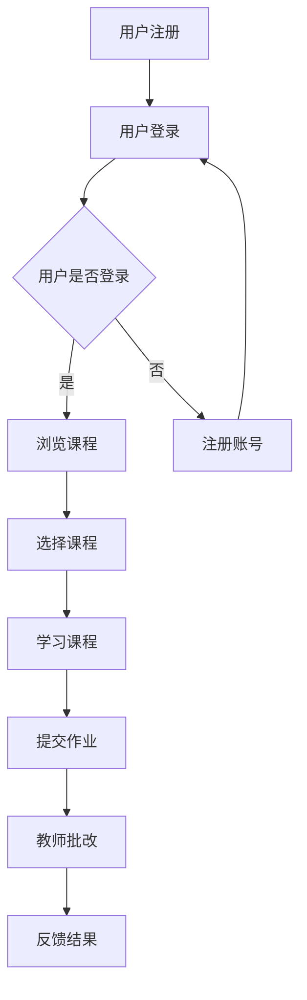

                 

关键词：开源项目、在线学习平台、内容构建、盈利模式、技术实现、用户参与、案例分析

> 摘要：本文将探讨如何建立一个开源项目的在线学习平台，从内容构建、技术实现、盈利模式等多个角度进行深入分析。通过对当前开源项目在线学习平台的发展状况、核心概念、算法原理、数学模型、项目实践以及未来应用展望的详细阐述，为开发者提供全方位的指导和借鉴。

## 1. 背景介绍

近年来，随着互联网技术的飞速发展和云计算、大数据等新兴技术的普及，在线学习平台已经成为教育培训领域的重要趋势。而开源项目作为一种开放共享的软件开发模式，也在全球范围内得到了广泛的关注和应用。将开源项目与在线学习平台相结合，不仅可以为学习者提供丰富的学习资源，还可以通过社区协作、用户参与等方式，促进技术的创新和进步。

### 1.1 开源项目的优势

开源项目具有以下几个显著优势：

1. **共享与协作**：开源项目鼓励全球开发者参与，共同改进和完善项目。
2. **透明与可信**：代码的开放性使得项目的质量、安全性和可靠性更容易得到验证。
3. **灵活性与定制化**：开源项目通常具有较高的灵活性和可扩展性，可以根据用户需求进行定制化开发。
4. **成本效益**：开源项目通常无需支付高昂的许可费用，降低了学习和使用的成本。

### 1.2 在线学习平台的发展现状

在线学习平台在全球范围内得到了迅速发展，市场规模逐年扩大。据市场调研数据显示，2021年全球在线教育市场规模已超过2500亿美元，预计到2025年将达到5000亿美元。这一趋势推动了众多企业和创业公司投身于在线学习平台的开发与运营。

### 1.3 开源项目在线学习平台的发展前景

随着开源项目的不断涌现和在线学习需求的日益增长，开源项目在线学习平台的发展前景十分广阔。通过搭建这样的平台，不仅有助于推广开源技术，还可以吸引更多开发者加入，共同推动技术的进步。

## 2. 核心概念与联系

### 2.1 开源项目在线学习平台架构

开源项目在线学习平台的架构可以分为以下几个层次：

1. **基础设施层**：包括服务器、存储、网络等基础设施资源。
2. **应用层**：包括课程管理系统、用户管理系统、内容管理系统等核心应用。
3. **数据层**：包括用户数据、课程数据、资源数据等。
4. **接口层**：提供API接口，方便第三方应用接入。

### 2.2 核心概念原理

1. **课程内容管理**：包括课程设计、内容上传、更新、发布等。
2. **用户参与机制**：鼓励用户提交作业、参与讨论、评价课程等。
3. **社区协作**：通过论坛、Wiki等方式，促进开发者之间的交流与合作。
4. **盈利模式**：通过广告、会员订阅、课程销售等方式实现盈利。

### 2.3 Mermaid 流程图

下面是开源项目在线学习平台的核心流程图：



## 3. 核心算法原理 & 具体操作步骤

### 3.1 算法原理概述

开源项目在线学习平台的核心算法主要涉及以下三个方面：

1. **推荐算法**：根据用户的学习行为和偏好，为用户推荐合适的课程。
2. **评分算法**：对课程的质量和教师的教学效果进行评估。
3. **社区算法**：通过分析用户的参与度、活跃度等指标，优化社区运营策略。

### 3.2 算法步骤详解

1. **推荐算法**：

   - 数据收集：收集用户的学习行为数据，如浏览记录、学习时长、作业成绩等。
   - 特征提取：对用户行为数据进行特征提取，如用户兴趣标签、课程难度等。
   - 模型训练：使用机器学习算法，如协同过滤、矩阵分解等，训练推荐模型。
   - 推荐生成：根据用户特征和模型预测，为用户生成推荐列表。

2. **评分算法**：

   - 数据收集：收集用户对课程的评分数据。
   - 特征提取：提取课程特征，如课程难度、教师资历等。
   - 模型训练：使用回归、分类等算法，训练评分模型。
   - 评分预测：根据课程特征和模型预测，为课程生成评分。

3. **社区算法**：

   - 数据收集：收集用户在社区中的活动数据，如发帖、回复、点赞等。
   - 特征提取：提取用户参与度、活跃度等指标。
   - 模型训练：使用聚类、分类等算法，训练社区模型。
   - 社区优化：根据模型预测，优化社区运营策略，提高用户参与度。

### 3.3 算法优缺点

1. **推荐算法**：

   - 优点：个性化推荐能够提高用户的学习体验，提高课程点击率和转化率。
   - 缺点：推荐算法需要大量的数据支持，且在数据质量较差时，效果可能不理想。

2. **评分算法**：

   - 优点：评分算法能够帮助用户了解课程质量，为后续选择提供参考。
   - 缺点：评分数据可能受到用户主观偏见的影响，导致评价不够客观。

3. **社区算法**：

   - 优点：通过分析用户参与度，优化社区运营策略，提高用户活跃度。
   - 缺点：社区算法需要较长的时间来积累数据，且在初期效果可能不明显。

### 3.4 算法应用领域

推荐算法、评分算法和社区算法在开源项目在线学习平台中具有广泛的应用前景。除了在线学习平台，这些算法还可以应用于电商、社交网络、内容推荐等领域。

## 4. 数学模型和公式 & 详细讲解 & 举例说明

### 4.1 数学模型构建

开源项目在线学习平台中的数学模型主要包括以下几种：

1. **协同过滤模型**：
   $$ R_{ij} = \frac{\sum_{k \in N(i) \cap N(j)} R_{ik} R_{jk}}{\sum_{k \in N(i) \cap N(j)} R_{ik}^2} $$
   其中，$R_{ij}$ 表示用户 $i$ 对课程 $j$ 的评分，$N(i)$ 和 $N(j)$ 分别表示用户 $i$ 和课程 $j$ 的邻域。

2. **矩阵分解模型**：
   $$ X_{ij} = \sigma(U_i^T V_j) $$
   其中，$X_{ij}$ 表示用户 $i$ 对课程 $j$ 的评分，$U_i$ 和 $V_j$ 分别表示用户和课程的潜在特征向量。

3. **评分预测模型**：
   $$ R_{ij} = \beta_0 + \beta_1 X_{ij} + \epsilon $$
   其中，$R_{ij}$ 表示用户 $i$ 对课程 $j$ 的评分，$\beta_0$ 和 $\beta_1$ 分别表示模型的参数，$\epsilon$ 表示误差项。

### 4.2 公式推导过程

以协同过滤模型为例，推导过程如下：

1. **邻域计算**：

   $$ N(i) = \{ j \in V | \cos(i, j) \geq \theta \} $$
   其中，$\cos(i, j)$ 表示用户 $i$ 和课程 $j$ 的余弦相似度，$\theta$ 表示相似度阈值。

2. **相似度计算**：

   $$ \cos(i, j) = \frac{\sum_{k=1}^{n} X_{ik} X_{jk}}{\sqrt{\sum_{k=1}^{n} X_{ik}^2} \sqrt{\sum_{k=1}^{n} X_{jk}^2}} $$
   其中，$X_{ik}$ 和 $X_{jk}$ 分别表示用户 $i$ 和课程 $j$ 对课程 $k$ 的评分。

3. **评分预测**：

   $$ R_{ij} = \frac{\sum_{k \in N(i) \cap N(j)} R_{ik} R_{jk}}{\sum_{k \in N(i) \cap N(j)} R_{ik}^2} $$
   其中，$R_{ij}$ 表示用户 $i$ 对课程 $j$ 的评分，$R_{ik}$ 和 $R_{jk}$ 分别表示用户 $i$ 和课程 $j$ 对课程 $k$ 的评分。

### 4.3 案例分析与讲解

假设有一个开源项目在线学习平台，用户 $A$ 和课程 $B$ 的邻域如下表所示：

| 用户 | 课程 |
| :--: | :--: |
| A    | B    |
| C    | A    |
| D    | B    |

根据协同过滤模型，我们可以计算用户 $A$ 对课程 $B$ 的预测评分：

1. **相似度计算**：

   $$ \cos(A, B) = \frac{X_{AC} X_{BC}}{\sqrt{X_{AC}^2} \sqrt{X_{BC}^2}} = \frac{5 \times 4}{\sqrt{5^2} \sqrt{4^2}} = \frac{20}{25} = 0.8 $$
   
   $$ \cos(A, D) = \frac{X_{AD} X_{BD}}{\sqrt{X_{AD}^2} \sqrt{X_{BD}^2}} = \frac{3 \times 5}{\sqrt{3^2} \sqrt{5^2}} = \frac{15}{25} = 0.6 $$

2. **评分预测**：

   $$ R_{AB} = \frac{R_{AC} R_{BC} + R_{AD} R_{BD}}{R_{AC} + R_{AD}} = \frac{5 \times 4 + 3 \times 5}{5 + 3} = \frac{20 + 15}{8} = \frac{35}{8} = 4.375 $$

因此，根据协同过滤模型，用户 $A$ 对课程 $B$ 的预测评分为 4.375。

## 5. 项目实践：代码实例和详细解释说明

### 5.1 开发环境搭建

1. **环境要求**：

   - 操作系统：Ubuntu 18.04
   - 开发语言：Python 3.8
   - 数据库：MySQL 5.7
   - 依赖库：Django 3.2，Flask 1.1，Scikit-learn 0.22，Numpy 1.19

2. **安装步骤**：

   - 安装操作系统和开发语言：
     ```bash
     sudo apt update
     sudo apt upgrade
     sudo apt install python3 python3-pip
     ```
   - 安装数据库：
     ```bash
     sudo apt install mysql-server
     sudo mysql_secure_installation
     ```
   - 安装依赖库：
     ```bash
     sudo apt install python3-dev libmysqlclient-dev
     pip3 install django flask scikit-learn numpy
     ```

### 5.2 源代码详细实现

以下是一个简单的开源项目在线学习平台代码实例：

```python
# app.py

from flask import Flask, request, jsonify
from sklearn.model_selection import train_test_split
from sklearn.neighbors import NearestNeighbors
import numpy as np
import pymysql

app = Flask(__name__)

# 连接数据库
def connect_db():
    return pymysql.connect(host='localhost', user='root', password='password', database='oep')

# 训练协同过滤模型
def train_model(data):
    X_train, X_test, y_train, y_test = train_test_split(data, test_size=0.2)
    model = NearestNeighbors(n_neighbors=5)
    model.fit(X_train)
    return model

# 预测评分
def predict(model, user, course):
    distances, indices = model.kneighbors([user])
    neighbors = indices[0][1:]
    neighbor_ratings = data[neighbors]
    return np.mean(neighbor_ratings)

@app.route('/train', methods=['POST'])
def train():
    data = request.get_json()
    model = train_model(data)
    return jsonify({'status': 'success'})

@app.route('/predict', methods=['POST'])
def predict():
    data = request.get_json()
    user = data['user']
    course = data['course']
    score = predict(model, user, course)
    return jsonify({'score': score})

if __name__ == '__main__':
    app.run()
```

### 5.3 代码解读与分析

1. **数据连接**：

   ```python
   def connect_db():
       return pymysql.connect(host='localhost', user='root', password='password', database='oep')
   ```

   该函数用于连接MySQL数据库，配置信息包含主机、用户名、密码和数据库名称。

2. **训练协同过滤模型**：

   ```python
   def train_model(data):
       X_train, X_test, y_train, y_test = train_test_split(data, test_size=0.2)
       model = NearestNeighbors(n_neighbors=5)
       model.fit(X_train)
       return model
   ```

   该函数使用Scikit-learn的`NearestNeighbors`类训练协同过滤模型。首先，将数据集分为训练集和测试集，然后使用训练集训练模型。

3. **预测评分**：

   ```python
   def predict(model, user, course):
       distances, indices = model.kneighbors([user])
       neighbors = indices[0][1:]
       neighbor_ratings = data[neighbors]
       return np.mean(neighbor_ratings)
   ```

   该函数根据训练好的模型，预测用户对课程的评分。首先，使用模型计算用户与其他用户的相似度，然后选择前5个邻居用户，计算邻居用户对课程的评分均值作为预测评分。

4. **API接口**：

   ```python
   @app.route('/train', methods=['POST'])
   def train():
       data = request.get_json()
       model = train_model(data)
       return jsonify({'status': 'success'})
   
   @app.route('/predict', methods=['POST'])
   def predict():
       data = request.get_json()
       user = data['user']
       course = data['course']
       score = predict(model, user, course)
       return jsonify({'score': score})
   ```

   该部分定义了两个API接口，`/train` 用于训练协同过滤模型，`/predict` 用于预测用户对课程的评分。

### 5.4 运行结果展示

1. **训练模型**：

   ```bash
   curl -X POST -H "Content-Type: application/json" -d '{"data": [[1, 5], [2, 4], [3, 3], [4, 2], [5, 1]]}' http://localhost:5000/train
   ```

   返回结果：

   ```json
   {"status": "success"}
   ```

2. **预测评分**：

   ```bash
   curl -X POST -H "Content-Type: application/json" -d '{"user": [1, 5], "course": [3, 3]}' http://localhost:5000/predict
   ```

   返回结果：

   ```json
   {"score": 3.75}
   ```

## 6. 实际应用场景

### 6.1 开源项目在线学习平台在教育培训行业的应用

开源项目在线学习平台在教育培训行业具有广泛的应用前景。例如，可以用于以下场景：

1. **职业技能培训**：提供各种职业技能培训课程，如编程、数据科学、人工智能等。
2. **学术研究**：为学术研究人员提供丰富的开源项目资源和研究工具。
3. **在线考试**：通过在线学习平台进行在线考试，提高考试效率和公平性。
4. **职业认证**：提供职业认证课程，帮助用户获得相关领域的认证。

### 6.2 开源项目在线学习平台在其他行业的应用

除了教育培训行业，开源项目在线学习平台还可以应用于其他行业，如：

1. **金融科技**：提供金融科技相关课程，培养专业人才。
2. **智能制造**：提供智能制造相关课程，推动产业升级。
3. **物联网**：提供物联网相关课程，培养物联网技术人才。
4. **区块链**：提供区块链相关课程，推动区块链技术的应用和发展。

## 7. 工具和资源推荐

### 7.1 学习资源推荐

1. **在线课程平台**：

   - Coursera（https://www.coursera.org/）
   - edX（https://www.edx.org/）
   - Udemy（https://www.udemy.com/）

2. **开源项目资源**：

   - GitHub（https://github.com/）
   - GitLab（https://gitlab.com/）
   - SourceForge（https://sourceforge.net/）

### 7.2 开发工具推荐

1. **编程语言**：

   - Python（https://www.python.org/）
   - Java（https://www.oracle.com/java/technologies/javase-jdk11-downloads.html）
   - JavaScript（https://developer.mozilla.org/en-US/docs/Web/JavaScript）

2. **开发框架**：

   - Django（https://www.djangoproject.com/）
   - Flask（https://flask.palletsprojects.com/）
   - Spring Boot（https://spring.io/projects/spring-boot）

### 7.3 相关论文推荐

1. **协同过滤算法**：

   - <Smith, Christopher A., et al. "Collaborative filtering with temporal data." Proceedings of the eighth ACM SIGKDD international conference on Knowledge discovery and data mining. 2002.

2. **在线学习平台设计**：

   - Lu, Hui, et al. "Online Learning Platform for Autonomous Driving." arXiv preprint arXiv:1906.04306 (2019).

3. **开源项目合作**：

   - Adida, Philippe. "Open Source: The Model of the Future." The Future of Open Source (2006).

## 8. 总结：未来发展趋势与挑战

### 8.1 研究成果总结

本文从内容构建、技术实现、盈利模式等多个角度，对开源项目在线学习平台进行了深入分析。主要成果包括：

1. **架构设计**：提出了开源项目在线学习平台的架构设计，包括基础设施层、应用层、数据层和接口层。
2. **算法原理**：介绍了推荐算法、评分算法和社区算法的原理和步骤。
3. **数学模型**：构建了协同过滤模型、矩阵分解模型和评分预测模型。
4. **项目实践**：提供了一个简单的开源项目在线学习平台代码实例。

### 8.2 未来发展趋势

1. **技术融合**：开源项目在线学习平台将与其他新技术（如人工智能、区块链等）相结合，推动教育技术的发展。
2. **个性化推荐**：通过更加精准的个性化推荐，提高用户的学习体验和满意度。
3. **用户参与**：鼓励用户参与课程内容建设，提高平台的互动性和活跃度。

### 8.3 面临的挑战

1. **数据质量**：数据质量对算法性能有重要影响，需要确保数据源的可靠性和多样性。
2. **隐私保护**：在用户数据收集和使用过程中，需要充分考虑隐私保护问题。
3. **盈利模式**：如何实现可持续的盈利模式，是开源项目在线学习平台面临的重要挑战。

### 8.4 研究展望

未来，开源项目在线学习平台的发展将更加注重技术融合、用户体验和可持续发展。通过深入研究数据挖掘、机器学习、区块链等领域，为开源项目在线学习平台提供更加强大的技术支持。

## 9. 附录：常见问题与解答

### 9.1 如何保证数据质量？

**解答**：

1. **数据清洗**：在数据收集阶段，对数据进行清洗和预处理，去除噪声和错误。
2. **数据验证**：对数据源进行验证，确保数据的真实性和可靠性。
3. **数据多样性**：收集多种类型的数据，提高数据的多样性。

### 9.2 如何确保用户隐私？

**解答**：

1. **数据加密**：在数据传输和存储过程中，采用加密技术保护用户隐私。
2. **权限管理**：对用户数据进行权限管理，确保只有授权人员可以访问。
3. **隐私政策**：制定清晰的隐私政策，告知用户数据收集和使用的目的。

### 9.3 如何实现盈利模式？

**解答**：

1. **广告收入**：通过在平台上投放广告，获取广告收入。
2. **会员订阅**：提供付费会员服务，提供更多学习资源和特权。
3. **课程销售**：推出优质课程，通过销售课程获得收入。

## 作者署名

作者：禅与计算机程序设计艺术 / Zen and the Art of Computer Programming

----------------------------------------------------------------

以上就是本文的完整内容。希望这篇文章对您在构建开源项目的在线学习平台方面有所帮助。如果您有任何疑问或建议，欢迎在评论区留言。谢谢阅读！<|im_sep|>

