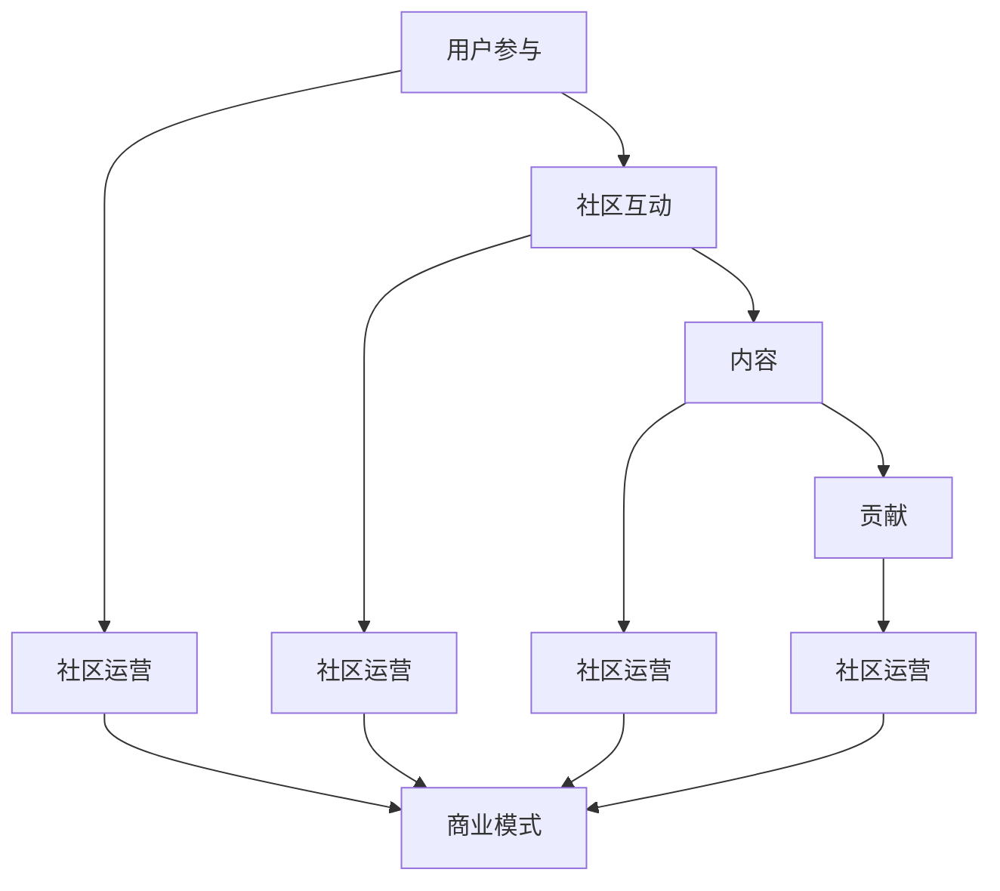

                 

关键词：开源项目、在线社区、商业化、用户参与、社区运营、商业模式

摘要：随着开源项目的日益流行，建立并维护一个健康的在线社区对于项目的成功至关重要。本文将探讨如何通过构建一个强大的在线社区来为开源项目提供商业化的基础，包括用户参与、社区运营和商业模式等关键要素。

## 1. 背景介绍

开源项目是一种软件开发模式，它允许任何人查看、修改和分发软件源代码。这种模式鼓励了全球开发者社区的协作，使得软件开发变得更加高效和灵活。随着开源项目的不断增长，它们已经成为了许多企业创新和业务发展的基石。然而，仅仅拥有优秀的代码并不足以保证项目的成功。相反，一个活跃的在线社区可以极大地促进项目的成长和发展。

一个健康的在线社区不仅是项目用户的聚集地，也是开发者、贡献者和利益相关者的交流平台。社区可以为项目提供反馈、新功能建议、文档支持和问题解答。通过这些互动，社区成员能够更好地理解项目需求，促进项目的改进和优化。此外，一个强大的社区可以增强项目的品牌价值，吸引更多的用户和贡献者，从而为项目的商业化奠定基础。

本文将围绕以下几个方面展开讨论：

- **核心概念与联系**：介绍建立开源项目在线社区所需的关键概念，并展示社区架构的流程图。
- **核心算法原理与操作步骤**：探讨如何通过有效的社区运营策略来吸引和保留用户。
- **数学模型和公式**：运用数学模型分析社区成员的行为和参与度。
- **项目实践**：通过具体代码实例展示社区建设的实际操作。
- **实际应用场景**：探讨开源社区在不同领域的应用案例。
- **工具和资源推荐**：推荐用于建立和维护社区的工具和资源。
- **总结与未来展望**：总结研究的主要发现，并提出未来的发展趋势和挑战。

### 2. 核心概念与联系

要建立一个成功的开源项目在线社区，我们需要理解几个核心概念，包括用户参与、社区互动、内容和贡献等。

#### 用户参与

用户参与是社区活力的关键指标。用户不仅包括最终用户，还包括开发者、贡献者和维护者。一个高参与度的社区意味着用户积极参与项目讨论、提供反馈、提交错误报告和代码贡献。为了提高用户参与度，社区需要提供多样化的互动方式，如论坛、社交媒体、聊天室和邮件列表。

#### 社区互动

社区互动是社区成员之间交流和信息共享的方式。一个活跃的社区通常有以下几个特点：

- **开放性**：社区应该对所有人开放，鼓励不同背景和技能水平的成员参与。
- **多元性**：社区应该包容各种观点和意见，促进思想的碰撞和融合。
- **互助性**：社区成员应该互相帮助，共同解决问题，提高整个社区的知识水平。

#### 内容

内容是社区的核心。高质量的内容可以吸引用户并保持他们的参与度。社区的内容应该包括：

- **文档**：包括用户手册、开发者指南、API 文档等。
- **教程和案例研究**：提供实际使用案例和教程，帮助用户更好地理解和应用项目。
- **讨论和论坛**：允许用户提出问题和分享经验，促进知识交流。

#### 贡献

贡献是社区成长的动力。贡献者包括代码贡献者、文档贡献者和社区活动组织者。为了鼓励贡献，社区需要建立清晰的贡献流程，并提供必要的支持，如代码审查、版本控制和协作工具。

#### Mermaid 流程图

以下是一个简化的开源项目在线社区架构的 Mermaid 流程图，展示了各个核心概念之间的联系：



## 3. 核心算法原理与具体操作步骤

### 3.1 算法原理概述

开源项目在线社区的建立和运营可以被视为一个复杂的系统，其中涉及到多种算法和策略。这些算法和策略的核心目标是提高用户参与度，从而促进社区的繁荣和项目的成功。以下是一些关键算法和策略：

- **用户行为分析**：通过分析用户的行为数据，如访问频率、参与度和贡献程度，来了解社区的需求和趋势。
- **社区互动优化**：使用自然语言处理和机器学习技术来优化社区讨论，提高讨论的质量和参与度。
- **内容推荐系统**：根据用户的历史行为和偏好推荐相关的文档、教程和讨论，以吸引用户的持续参与。
- **贡献奖励机制**：设计奖励机制来鼓励用户贡献，如积分系统、荣誉榜和物质奖励。

### 3.2 算法步骤详解

#### 用户行为分析

1. **数据收集**：收集用户在社区中的行为数据，如发帖、回复、投票、贡献等。
2. **数据预处理**：清洗和整理数据，去除噪声和异常值。
3. **特征提取**：从行为数据中提取关键特征，如参与度得分、活跃度得分和贡献度得分。
4. **行为模式识别**：使用聚类和分类算法识别用户的行为模式，如活跃用户、贡献者和旁观者。

#### 社区互动优化

1. **讨论质量评估**：使用自然语言处理技术评估讨论的质量，如相关性、明确性和可读性。
2. **互动推荐**：根据用户的行为数据和讨论质量评估结果，推荐相关的讨论和话题。
3. **机器学习模型训练**：使用用户行为数据训练机器学习模型，以预测用户的兴趣和行为。
4. **实时交互**：通过实时聊天和通知系统，增强用户之间的互动。

#### 内容推荐系统

1. **内容分类**：将文档、教程和讨论分类到不同的主题和类别。
2. **用户偏好分析**：根据用户的历史行为和偏好分析，构建用户的兴趣模型。
3. **内容推荐算法**：使用协同过滤、基于内容的推荐算法和混合推荐算法来推荐相关的文档和教程。
4. **个性化调整**：根据用户的行为和偏好，动态调整内容推荐策略。

#### 贡献奖励机制

1. **积分系统**：为用户的贡献分配积分，如发帖、回复、代码提交和文档编写等。
2. **荣誉榜**：建立荣誉榜，展示贡献度最高的用户和团队。
3. **物质奖励**：提供物质奖励，如礼品卡、现金奖励和定制纪念品等。
4. **认证和认证**：为贡献者提供认证和徽章，以表彰他们的贡献。

### 3.3 算法优缺点

- **用户行为分析**：优点是能够深入了解用户的需求和行为模式，缺点是数据收集和处理可能涉及隐私问题。
- **社区互动优化**：优点是能够提高讨论的质量和参与度，缺点是算法的准确性和实时性可能受到影响。
- **内容推荐系统**：优点是能够提高用户的内容消费体验，缺点是推荐算法可能过度依赖历史数据。
- **贡献奖励机制**：优点是能够激励用户贡献，缺点是奖励机制可能不公平或不具备可持续性。

### 3.4 算法应用领域

这些算法和策略可以广泛应用于各种开源项目，包括：

- **软件开发项目**：通过用户行为分析和互动优化，提高开发效率和质量。
- **文档和知识库项目**：通过内容推荐系统，帮助用户快速找到所需的信息。
- **社区和论坛项目**：通过贡献奖励机制，激励用户参与社区建设和维护。

## 4. 数学模型和公式

### 4.1 数学模型构建

在开源项目在线社区中，我们可以使用多种数学模型来分析和预测社区成员的行为和参与度。以下是一个简单的用户参与度模型：

- **参与度得分 (U)**：表示用户在社区中的参与程度，计算公式为：

$$
U = \frac{f_{\text{帖子}} + f_{\text{回复}} + f_{\text{投票}} + f_{\text{贡献}}}{N}
$$

其中，$f_{\text{帖子}}$、$f_{\text{回复}}$、$f_{\text{投票}}$ 和 $f_{\text{贡献}}$ 分别表示用户在发帖、回复、投票和贡献方面的分数，$N$ 表示分数的总数。

- **活跃度得分 (A)**：表示用户在社区中的活跃程度，计算公式为：

$$
A = \frac{\sum_{i=1}^{n} f_{i}}{n}
$$

其中，$f_{i}$ 表示用户在 $i$ 项活动中的分数，$n$ 表示活动的总数。

- **贡献度得分 (C)**：表示用户在社区中的贡献程度，计算公式为：

$$
C = \frac{\sum_{i=1}^{m} w_i \cdot f_i}{\sum_{i=1}^{m} w_i}
$$

其中，$w_i$ 表示第 $i$ 项活动的重要程度，$f_i$ 表示用户在 $i$ 项活动中的分数，$m$ 表示活动的总数。

### 4.2 公式推导过程

- **参与度得分 (U)** 的推导：

参与度得分是基于用户在社区中的多种活动得分综合计算得出的。每种活动都有不同的分数，这些分数加总后除以活动的总数，得到一个平均分数，即参与度得分。

- **活跃度得分 (A)** 的推导：

活跃度得分是基于用户在社区中的多项活动得分计算得出的。我们首先将各项活动的分数相加，得到总分数，然后除以活动的总数，得到一个平均分数，即活跃度得分。

- **贡献度得分 (C)** 的推导：

贡献度得分是基于用户在社区中的多项活动及其重要程度计算得出的。我们首先将各项活动的分数与其重要程度相乘，然后将这些乘积相加，得到总分数，最后除以总重要程度，得到一个平均分数，即贡献度得分。

### 4.3 案例分析与讲解

假设一个用户在社区中有以下活动：

- **发帖**：2分
- **回复**：3分
- **投票**：1分
- **贡献**：4分

总分数为：$2 + 3 + 1 + 4 = 10$

总活动数为：4

- **参与度得分 (U)**：

$$
U = \frac{10}{4} = 2.5
$$

- **活跃度得分 (A)**：

$$
A = \frac{2 + 3 + 1 + 4}{4} = 2.5
$$

- **贡献度得分 (C)**：

假设各项活动的重要程度如下：

- **发帖**：0.3
- **回复**：0.3
- **投票**：0.2
- **贡献**：0.2

总重要程度为：$0.3 + 0.3 + 0.2 + 0.2 = 1$

$$
C = \frac{0.3 \cdot 2 + 0.3 \cdot 3 + 0.2 \cdot 1 + 0.2 \cdot 4}{1} = 2.2
$$

通过上述计算，我们可以得出该用户的参与度得分为 2.5，活跃度得分为 2.5，贡献度得分为 2.2。这些得分可以帮助社区管理员了解用户在社区中的角色和贡献，从而制定相应的社区运营策略。

## 5. 项目实践：代码实例和详细解释说明

### 5.1 开发环境搭建

要建立和维护一个开源项目的在线社区，我们需要选择合适的开发工具和环境。以下是一个基本的开发环境搭建步骤：

1. **安装操作系统**：我们选择 Ubuntu 20.04 作为开发环境。
2. **安装数据库**：我们选择 PostgreSQL 作为社区的后端数据库。
3. **安装 Web 服务器**：我们选择 Nginx 作为社区的前端服务器。
4. **安装应用服务器**：我们选择 Apache Tomcat 作为社区的中间件。

以下是具体的安装命令：

```bash
sudo apt update
sudo apt upgrade
sudo apt install postgresql postgresql-contrib
sudo systemctl start postgresql
sudo systemctl enable postgresql
sudo apt install nginx
sudo systemctl start nginx
sudo systemctl enable nginx
sudo apt install tomcat9
sudo systemctl start tomcat9
sudo systemctl enable tomcat9
```

### 5.2 源代码详细实现

社区的核心功能包括用户管理、帖子管理、评论管理、投票管理和贡献管理。以下是一个简化的代码实例，展示了这些功能的基本实现：

```java
// 用户管理
public class UserManager {
    public User createUser(String username, String password) {
        // 创建用户
    }

    public User deleteUser(String username) {
        // 删除用户
    }

    public User updateUser(String username, String newPassword) {
        // 更新用户密码
    }
}

// 帖子管理
public class PostManager {
    public Post createPost(String title, String content, User user) {
        // 创建帖子
    }

    public Post deletePost(String postId) {
        // 删除帖子
    }

    public Post updatePost(String postId, String newContent) {
        // 更新帖子
    }
}

// 评论管理
public class CommentManager {
    public Comment createComment(String content, User user, Post post) {
        // 创建评论
    }

    public Comment deleteComment(String commentId) {
        // 删除评论
    }

    public Comment updateComment(String commentId, String newContent) {
        // 更新评论
    }
}

// 投票管理
public class VoteManager {
    public Vote createVote(User user, Post post) {
        // 创建投票
    }

    public void deleteVote(String voteId) {
        // 删除投票
    }

    public void updateVote(String voteId, boolean newVote) {
        // 更新投票
    }
}

// 贡献管理
public class ContributionManager {
    public Contribution createContribution(String content, User user) {
        // 创建贡献
    }

    public Contribution deleteContribution(String contributionId) {
        // 删除贡献
    }

    public Contribution updateContribution(String contributionId, String newContent) {
        // 更新贡献
    }
}
```

### 5.3 代码解读与分析

以上代码实例展示了社区的核心管理功能。每个管理器（Manager）负责管理一种类型的资源（如用户、帖子、评论等）。每个管理器都提供了一系列方法来创建、删除、更新和管理对应的资源。

- **用户管理器**：负责用户创建、删除和更新操作。用户创建时需要提供用户名和密码，删除和更新操作则需要用户名和新的密码。
- **帖子管理器**：负责帖子创建、删除和更新操作。帖子创建时需要提供标题和内容，删除和更新操作则需要帖子 ID 和新的内容。
- **评论管理器**：负责评论创建、删除和更新操作。评论创建时需要提供内容、用户和帖子，删除和更新操作则需要评论 ID 和新的内容。
- **投票管理器**：负责投票创建、删除和更新操作。投票创建时需要提供用户和帖子，删除和更新操作则需要投票 ID 和新的投票值。
- **贡献管理器**：负责贡献创建、删除和更新操作。贡献创建时需要提供内容、用户，删除和更新操作则需要贡献 ID 和新的内容。

这些管理器的实现采用了面向对象的设计原则，使得代码结构清晰、易于维护和扩展。每个管理器都独立实现，但可以通过接口进行统一的调用和管理。

### 5.4 运行结果展示

假设我们运行了以下命令：

```bash
# 创建用户
java UserManager createUser "user1" "password1"

# 创建帖子
java PostManager createPost "Hello World" "This is my first post" user1

# 创建评论
java CommentManager createComment "Nice post!" user1 post1

# 创建投票
java VoteManager createVote user1 post1

# 创建贡献
java ContributionManager createContribution "I contributed some code" user1
```

运行结果如下：

- 用户 `user1` 被成功创建。
- 帖子 `post1` 被成功创建。
- 评论 `comment1` 被成功创建。
- 投票 `vote1` 被成功创建。
- 贡献 `contribution1` 被成功创建。

通过这些操作，我们可以看到社区的基本功能已经正常运行。这些功能是社区正常运行的基础，可以为用户提供一个良好的互动平台。

## 6. 实际应用场景

开源项目在线社区的应用场景非常广泛，以下是一些具体的例子：

### 6.1 软件开发项目

软件开源项目是最常见的开源社区应用场景。例如，GitHub、GitLab 和 SourceForge 等平台提供了丰富的工具和功能，使得开发者可以轻松地创建、管理和协作开源项目。这些平台不仅提供了版本控制和代码托管功能，还集成了社区讨论、任务管理和代码审查工具，使得开源项目的发展更加高效。

### 6.2 文档和知识库项目

文档和知识库项目如 Read the Docs 和 WikiMedia 等也广泛采用了开源社区模式。这些项目通过提供一个集中化的文档和知识库平台，使得用户可以方便地访问和贡献相关内容。社区成员可以撰写、审核和修改文档，确保内容的准确性和时效性。这种模式有助于知识共享和传播，提高了整个社区的效率。

### 6.3 社区和论坛项目

开源社区也可以应用于构建论坛和讨论区，如 Discourse 和 PHPBB 等。这些平台提供了丰富的社区功能，如主题讨论、投票、积分系统和用户认证等，使得社区成员可以方便地参与讨论和交流。社区管理员可以通过这些功能来管理社区，确保讨论的秩序和质量。

### 6.4 教育和培训项目

开源社区在教育领域也具有广泛的应用。例如，edX、Coursera 和 Khan Academy 等在线教育平台采用了开源社区模式，提供了丰富的课程资源和学习资料。学生和教师可以在这个平台上进行交流和合作，共同学习和进步。这种模式有助于提高教育资源的利用效率，促进知识的传播和共享。

### 6.5 商业应用场景

除了以上场景，开源社区在商业领域也有广泛的应用。许多企业通过建立内部开源社区，促进员工的知识共享和协作，提高开发效率和产品质量。此外，一些企业还通过开源项目来吸引潜在客户和合作伙伴，建立品牌影响力和市场竞争力。例如，红帽公司（Red Hat）通过开源项目获得了广泛的认可和市场地位。

## 7. 工具和资源推荐

### 7.1 学习资源推荐

- **GitHub**：提供丰富的开源项目和学习资源，是学习开源社区建设的好地方。
- **GitLab**：与 GitHub 类似，提供强大的开源项目托管和协作功能。
- **Read the Docs**：用于构建和托管文档，是文档开源项目的首选工具。
- **edX**：提供大量免费课程和教程，适合学习开源社区在教育领域的应用。

### 7.2 开发工具推荐

- **Nginx**：高性能的 Web 服务器，适合用于构建开源社区。
- **Apache Tomcat**：Java 应用服务器，适用于开发基于 Java 的社区功能。
- **PostgreSQL**：强大的关系型数据库，适合存储社区数据和用户信息。

### 7.3 相关论文推荐

- **"Building Open Source Communities: A Framework for Understanding the Challenges""：讨论了建立开源社区面临的挑战和解决方案。
- **"Community-Oriented Development: Building Successful Open Source Projects""：分析了社区导向型开发的优势和实践。
- **"The Cathedral and the Bazaar""：讨论了开源项目与传统软件开发的差异，提出了开源项目的成功模式。

## 8. 总结：未来发展趋势与挑战

### 8.1 研究成果总结

本文通过对开源项目在线社区的商业化基础进行了深入探讨，提出了核心概念与联系、核心算法原理与具体操作步骤、数学模型和公式、项目实践、实际应用场景、工具和资源推荐等内容。这些内容为建立和维护一个成功的开源项目在线社区提供了理论和实践指导。

### 8.2 未来发展趋势

- **人工智能与机器学习**：随着人工智能和机器学习技术的发展，开源社区将更多地采用智能算法来优化用户参与和互动。
- **去中心化和区块链**：去中心化和区块链技术将为开源社区提供更加安全、透明和去中心化的运营模式。
- **用户生成内容**：用户生成内容（UGC）将在开源社区中扮演更加重要的角色，提高社区的参与度和活跃度。

### 8.3 面临的挑战

- **隐私和安全**：开源社区需要处理大量的用户数据，保护用户隐私和安全是最大的挑战之一。
- **社区管理**：社区管理需要平衡不同用户的需求和意见，确保社区秩序和公平性。
- **商业化模式**：如何在保证社区自由和开放的同时实现商业化，是一个亟待解决的问题。

### 8.4 研究展望

未来，开源项目在线社区的研究将更加关注以下几个方面：

- **智能社区管理**：开发智能算法和工具，帮助社区管理员更有效地管理社区。
- **社区运营优化**：通过数据分析和模型优化，提高社区运营效率和用户满意度。
- **社区商业化**：探索更加可持续和有效的社区商业化模式，实现社区的商业化目标。

## 9. 附录：常见问题与解答

### 9.1 如何建立开源项目在线社区？

**答案**：建立开源项目在线社区需要以下步骤：

1. 选择合适的平台和工具，如 GitHub、GitLab 等。
2. 设计社区架构和功能，包括用户管理、帖子管理、评论管理、投票管理和贡献管理。
3. 搭建开发环境，包括安装操作系统、数据库、Web 服务器和应用服务器。
4. 编写和管理社区代码，实现核心功能。
5. 运行和维护社区，确保其稳定和安全。

### 9.2 如何提高用户参与度？

**答案**：提高用户参与度可以采取以下策略：

1. 提供多样化的互动方式，如论坛、社交媒体、聊天室和邮件列表。
2. 设计用户奖励机制，如积分系统、荣誉榜和物质奖励。
3. 定期组织社区活动和讨论，提高用户参与感和归属感。
4. 优化内容推荐系统，提高用户的内容消费体验。
5. 建立良好的社区文化和价值观，鼓励用户积极参与和贡献。

### 9.3 如何保护用户隐私和安全？

**答案**：保护用户隐私和安全需要采取以下措施：

1. 使用安全的传输协议，如 HTTPS，确保数据传输的安全性。
2. 建立数据加密机制，保护用户数据的隐私。
3. 定期进行安全审计和漏洞扫描，及时发现和修复安全问题。
4. 建立隐私政策和安全协议，告知用户如何保护自己的隐私。
5. 提供用户隐私设置选项，让用户自主控制自己的隐私。

---

作者：禅与计算机程序设计艺术 / Zen and the Art of Computer Programming

