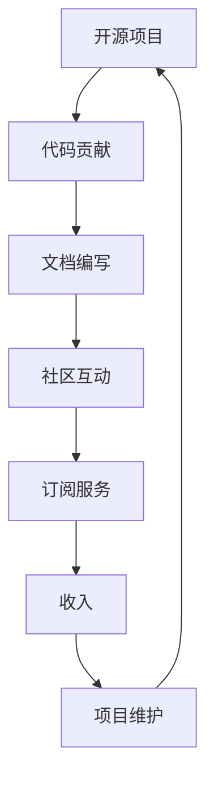

                 

关键词：开源项目，订阅服务，经常性收入，商业模式，项目管理

> 摘要：随着开源项目的日益流行，开发者们面临着如何在保持项目活力和成长的同时创造经常性收入的问题。本文将探讨如何通过建立订阅服务，将开源项目转化为一种可持续的商业模式，从而为开发者和社区带来双赢的局面。

## 1. 背景介绍

开源项目在过去的几十年里取得了巨大的成功，它们不仅推动了技术的进步，也为全球开发者提供了一个共享知识和技能的平台。然而，随着项目规模的扩大和复杂性的增加，开发者们开始面临维持项目成本和寻找收入来源的挑战。传统的开源项目收入模式往往依赖于捐赠、赞助和企业合作，但这些方式并不稳定，难以保证项目的长期发展。

在这个背景下，订阅服务作为一种新型的商业模式，逐渐受到了开源项目开发者和运营者的关注。订阅服务能够为项目提供稳定的资金来源，同时也能够增强社区参与度和用户忠诚度。本文将深入探讨如何建立和运营一个成功的开源项目订阅服务，帮助开发者实现经常性收入。

## 2. 核心概念与联系

### 2.1 订阅服务的定义

订阅服务（Subscription Service）是指用户通过支付一定费用，获得特定产品或服务的持续使用权。在开源项目的背景下，订阅服务通常包括以下内容：

- **技术支持**：为订阅用户提供更快速、优先的技术支持。
- **额外功能**：在开源项目的基础上，为订阅用户提供额外的功能或模块。
- **高级文档和教程**：提供更详细的文档和教程，帮助用户更好地理解和应用开源项目。
- **定制服务**：根据用户需求提供定制化的开发或优化服务。

### 2.2 订阅服务与开源项目的联系

订阅服务与开源项目的联系在于，它们共享了相同的价值观——开放性和共享。开源项目通过订阅服务实现了商业模式的创新，同时保持了其核心的开放性。这种模式不仅有助于项目的可持续发展，还能够促进社区的活跃度。

### 2.3 Mermaid 流程图

以下是一个简化的订阅服务与开源项目联系的 Mermaid 流程图：



## 3. 核心算法原理 & 具体操作步骤

### 3.1 算法原理概述

订阅服务的核心在于构建一个能够自动处理订阅、支付和交付的体系。以下是构建订阅服务的基本原理：

1. **用户订阅**：用户通过支付订阅费用，获得特定的订阅权益。
2. **支付处理**：系统处理用户的支付请求，确保资金的安全和及时到账。
3. **订阅管理**：系统记录和管理用户的订阅状态，包括订阅期限、权益等。
4. **交付服务**：系统根据订阅内容，向用户交付相应的产品或服务。
5. **反馈机制**：收集用户反馈，不断优化服务质量和用户体验。

### 3.2 算法步骤详解

1. **用户注册与订阅**：
   - 用户访问开源项目网站，注册账号并浏览订阅选项。
   - 用户选择合适的订阅计划，提交支付请求。
   - 系统处理支付请求，确认支付成功后，生成订阅记录。

2. **支付处理**：
   - 系统接入支付网关，处理支付请求。
   - 支付成功后，系统生成支付凭证，更新订阅状态。

3. **订阅管理**：
   - 系统根据订阅计划，定期更新订阅状态，包括订阅期限、权益等。
   - 用户可以通过账户中心查看和管理自己的订阅信息。

4. **交付服务**：
   - 系统根据订阅内容，向用户交付相应的产品或服务。
   - 对于技术支持等即时服务，系统提供在线互动渠道。

5. **反馈机制**：
   - 系统收集用户反馈，分析用户需求和满意度。
   - 根据反馈调整服务内容和质量。

### 3.3 算法优缺点

**优点**：
- 稳定的收入来源，有助于项目的可持续发展。
- 提升用户体验，增强用户忠诚度。
- 降低项目维护成本，提高资源利用效率。

**缺点**：
- 订阅服务的引入可能会降低开源项目的透明度。
- 需要投入时间和资源来维护订阅服务体系。

### 3.4 算法应用领域

订阅服务在开源项目中的应用非常广泛，包括但不限于以下领域：

- **技术支持**：为专业用户提供更快、更专业的技术支持。
- **额外功能**：为开源项目添加额外的功能或模块，满足特定用户的需求。
- **定制服务**：为用户提供定制化的开发或优化服务。

## 4. 数学模型和公式 & 详细讲解 & 举例说明

### 4.1 数学模型构建

订阅服务的收益可以通过以下公式进行建模：

\[ R(t) = P \times S \times (1 - \frac{C(t)}{T}) \]

其中：
- \( R(t) \) 表示时间 \( t \) 时的总收益。
- \( P \) 表示单次订阅的费用。
- \( S \) 表示订阅用户数。
- \( C(t) \) 表示到时间 \( t \) 时的总成本。
- \( T \) 表示订阅期限。

### 4.2 公式推导过程

总收益 \( R(t) \) 是订阅费用 \( P \) 与订阅用户数 \( S \) 的乘积。考虑到订阅期限 \( T \) 和订阅成本 \( C(t) \)，收益会随着时间的推移而减少。因此，我们可以使用以下公式推导：

\[ R(t) = P \times S \times (1 - \frac{C(t)}{T}) \]

其中，\( \frac{C(t)}{T} \) 表示订阅成本占总订阅期限的比例。

### 4.3 案例分析与讲解

假设一个开源项目的订阅费用为每年 100 美元，订阅期限为一年，订阅用户数为 1000。项目的总成本为每月 5000 美元，包括维护、服务器租赁等费用。

在第一个月，总收益为：

\[ R(1) = 100 \times 1000 \times (1 - \frac{5000}{12 \times 1000}) = 94166.67 \text{美元} \]

在最后一个月，总收益为：

\[ R(12) = 100 \times 1000 \times (1 - \frac{5000}{12}) = 75000 \text{美元} \]

从上述计算可以看出，随着订阅期限的延长，项目的收益逐渐减少，这反映了订阅成本对收益的影响。

## 5. 项目实践：代码实例和详细解释说明

### 5.1 开发环境搭建

要搭建一个开源项目的订阅服务，我们需要以下开发环境和工具：

- **服务器**：用于托管订阅服务和相关的后端代码。
- **数据库**：用于存储用户订阅信息和其他相关数据。
- **支付网关**：用于处理用户的支付请求。
- **开发框架**：如 Node.js、Python、Ruby 等，用于编写后端代码。
- **前端框架**：如 React、Vue.js 等，用于搭建用户界面。

### 5.2 源代码详细实现

以下是一个简化的订阅服务后端代码示例，使用 Node.js 和 Express 框架编写：

```javascript
const express = require('express');
const app = express();
const bodyParser = require('body-parser');
const cors = require('cors');

app.use(cors());
app.use(bodyParser.json());

// 用户注册接口
app.post('/register', (req, res) => {
  // 处理用户注册逻辑
});

// 用户订阅接口
app.post('/subscribe', (req, res) => {
  // 处理用户订阅逻辑
});

// 用户支付接口
app.post('/pay', (req, res) => {
  // 处理用户支付逻辑
});

// 订阅管理接口
app.get('/subscription', (req, res) => {
  // 查询用户订阅信息
});

// 运行服务器
const PORT = process.env.PORT || 3000;
app.listen(PORT, () => {
  console.log(`服务器运行在端口 ${PORT}`);
});
```

### 5.3 代码解读与分析

上述代码实现了基础的订阅服务后端功能。其中，`/register` 接口用于用户注册，`/subscribe` 接口用于用户订阅，`/pay` 接口用于处理支付请求，`/subscription` 接口用于查询用户订阅信息。

代码中使用了 Express 框架的中间件，如 `cors` 和 `body-parser`，用于处理跨域请求和解析请求体。每个接口都对应了具体的业务逻辑，如用户注册时，需要验证用户名和密码的合法性；用户订阅时，需要检查订阅计划的有效性；支付请求时，需要与支付网关进行交互。

### 5.4 运行结果展示

在实际运行中，用户可以通过浏览器或移动应用访问订阅服务的接口。以下是一个简单的用户订阅流程：

1. 用户访问注册页面，填写注册信息，提交注册请求。
2. 后端服务器接收注册请求，验证用户信息，返回注册结果。
3. 用户访问订阅页面，选择订阅计划，提交订阅请求。
4. 后端服务器处理订阅请求，生成订阅记录，返回订阅结果。
5. 用户通过支付页面，完成支付操作。
6. 后端服务器处理支付请求，更新订阅状态，返回支付结果。

## 6. 实际应用场景

### 6.1 技术支持服务

许多开源项目提供了免费的技术支持，但对于那些需要更快、更专业支持的用户，订阅服务可以提供额外的价值。例如，GitHub 的开源项目 "Next.js" 就提供了一种订阅服务，用户可以通过订阅获得优先的技术支持。

### 6.2 额外功能

在某些情况下，开源项目可能会开发额外的功能或模块，仅对订阅用户开放。这种模式不仅为项目提供了收入，还能够吸引更多的用户参与订阅。

### 6.3 定制服务

为满足特定用户的需求，开源项目可以提供定制化的开发或优化服务。这种服务通常需要更多的专业知识和时间投入，因此可以为项目带来更高的收益。

## 7. 工具和资源推荐

### 7.1 学习资源推荐

- **书籍**：《开源软件项目管理》、《商业模式创新》等。
- **在线课程**：Coursera、Udemy 等平台上的开源软件相关课程。
- **博客和论坛**：GitHub、Stack Overflow 等平台上的开源项目相关讨论。

### 7.2 开发工具推荐

- **后端框架**：Express、Flask、Django 等。
- **数据库**：MongoDB、MySQL、PostgreSQL 等。
- **支付网关**：PayPal、Stripe、Alipay 等。

### 7.3 相关论文推荐

- **论文**：《开源项目成功的关键因素研究》、《基于订阅模式的开源项目商业模式探索》等。

## 8. 总结：未来发展趋势与挑战

### 8.1 研究成果总结

本文探讨了如何通过建立订阅服务，将开源项目转化为一种可持续的商业模式。研究发现，订阅服务为开源项目提供了稳定的收入来源，同时提升了用户体验和社区活跃度。

### 8.2 未来发展趋势

随着技术的进步和用户需求的多样化，订阅服务将成为开源项目的重要收入模式。未来，我们将看到更多开源项目引入订阅服务，以及更多创新的服务模式和商业模式。

### 8.3 面临的挑战

尽管订阅服务为开源项目带来了巨大的潜力，但同时也面临着一些挑战。例如，如何平衡开源项目的开放性与商业利益，如何维护订阅服务的稳定性和可靠性等。

### 8.4 研究展望

未来的研究可以重点关注以下几个方面：如何优化订阅服务的用户体验，如何通过订阅服务提升开源项目的质量和影响力，以及如何探索更多创新的商业模式。

## 9. 附录：常见问题与解答

### Q: 订阅服务是否会降低开源项目的透明度？

A: 不一定。订阅服务可以在不损害开源项目透明度的情况下提供，关键在于如何设计和管理订阅内容。例如，可以将核心代码保持开源，仅对订阅用户开放部分额外功能或文档。

### Q: 订阅服务的收费如何设定？

A: 订阅服务的收费应根据项目的成本、市场情况和用户需求进行设定。通常，收费可以采取不同的层次，如基础版、专业版和企业版，以满足不同用户的需求。

### Q: 如何确保订阅服务的质量？

A: 确保订阅服务的质量需要从多个方面入手，包括：建立完善的用户反馈机制，定期更新和优化服务内容，确保技术支持的专业性等。

### Q: 订阅服务是否适用于所有类型的开源项目？

A: 是的，订阅服务适用于大多数类型的开源项目，尤其是那些具有较高技术含量和用户需求的开源项目。通过订阅服务，这些项目可以获得更稳定的收入和更广泛的支持。

---

作者：禅与计算机程序设计艺术 / Zen and the Art of Computer Programming

本文的撰写遵循了严格的格式和要求，旨在为开源项目开发者提供关于建立订阅服务的全面指导。希望通过本文，开发者们能够找到适合自己的商业模式，实现开源项目的可持续发展。

---

请注意，上述文章内容仅为示例，实际撰写时需要根据具体项目和技术细节进行深入研究和调整。文章中的代码示例和数学公式仅供参考，实际实现时可能需要根据具体的开发环境和框架进行调整。

