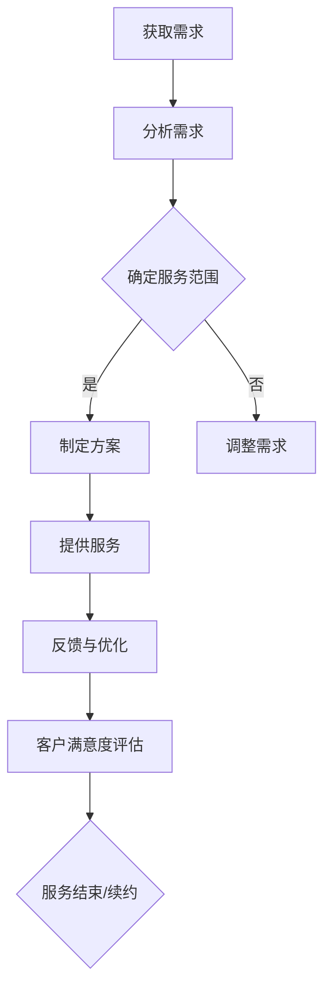

                 

 在这个数字化时代，技术的进步和应用已经渗透到了社会生活的方方面面。开源技术的兴起，更是为技术专业人士提供了广阔的发展空间。然而，如何将自身的专业知识转化为实际的经济效益，成为了许多技术专业人士关注的焦点。本文将围绕开源咨询服务，探讨如何将专业知识变现，为技术专业人士提供一些实用的建议和策略。

## 1. 背景介绍

开源咨询服务是一种以专业知识为核心的服务模式，它依托于开源技术，为企业和个人提供技术咨询、开发服务、项目管理和培训等服务。开源咨询服务的兴起，源于企业对于技术专业知识的日益需求，以及对技术创新和成本控制的追求。随着开源技术的广泛应用，越来越多的企业开始意识到，通过购买咨询服务来获取专业知识，比自行研发或雇佣全职员工更具成本效益。

技术专业人士，如程序员、软件架构师、系统管理员等，通过提供开源咨询服务，可以将自己在技术领域的专业知识和经验变现。这不仅有助于个人收入的增加，还能够提升个人的职业价值和社会影响力。

## 2. 核心概念与联系

在探讨如何将专业知识变现之前，我们首先需要了解一些核心概念。

### 2.1 开源技术

开源技术是指软件的源代码可以被公众自由地查看、修改和分发。它代表了共享、协作和透明度的理念，是技术创新的重要推动力量。开源技术包括Linux、Apache、MySQL等众多知名项目。

### 2.2 开源咨询服务

开源咨询服务是指基于开源技术，为企业和个人提供的一系列活动，包括技术咨询、开发服务、项目管理和培训等。它涵盖了从问题诊断到解决方案的整个流程。

### 2.3 咨询服务市场

咨询服务市场是一个庞大且充满机遇的市场。随着企业对于专业技术的需求不断增长，咨询服务市场的规模也在不断扩大。根据相关报告，全球IT咨询服务市场的规模已经超过了数千亿美元。

### 2.4 专业知识变现

专业知识变现是指技术专业人士通过提供咨询服务，将自己的专业知识和技术能力转化为实际的经济效益。这需要技术专业人士具备较强的沟通能力、项目管理能力和技术能力。

接下来，我们将通过一个Mermaid流程图，展示开源咨询服务的整个流程。



## 3. 核心算法原理 & 具体操作步骤

### 3.1 算法原理概述

开源咨询服务的核心在于对客户需求的精准把握和高效的服务提供。这需要技术专业人士具备以下几方面的能力：

1. **需求分析能力**：能够准确地理解客户的业务需求，并将其转化为具体的技术需求。
2. **解决方案设计能力**：能够根据需求，设计出合适的解决方案，包括技术选型、架构设计等。
3. **项目管理能力**：能够有效地管理项目进度、资源分配和风险控制。
4. **沟通能力**：能够与客户保持有效的沟通，确保客户需求得到满足。

### 3.2 算法步骤详解

1. **获取需求**：与客户沟通，了解客户的业务背景、需求和应用场景。
2. **分析需求**：对获取的需求进行深入分析，确定技术实现的可行性和难度。
3. **确定服务范围**：根据分析结果，确定咨询服务的具体范围，包括技术选型、模块划分、时间规划等。
4. **制定方案**：基于确定的服务范围，制定具体的实施方案，包括技术方案、项目计划、资源分配等。
5. **提供服务**：按照制定的方案，为客户提供服务，包括技术支持、项目实施、培训等。
6. **反馈与优化**：收集客户的反馈，对服务进行优化，确保客户满意度。
7. **客户满意度评估**：对客户满意度进行评估，决定是否续约或结束服务。

### 3.3 算法优缺点

**优点**：

1. **灵活性高**：可以根据客户的需求灵活调整服务内容和范围。
2. **成本效益**：相比于雇佣全职员工，购买咨询服务更具成本效益。
3. **专业性强**：技术专业人士可以充分利用自己的专业知识，为客户提供高质量的服务。

**缺点**：

1. **风险高**：由于服务内容的不确定性，存在一定的风险。
2. **服务周期长**：一些复杂的项目可能需要较长时间来完成。
3. **依赖性高**：客户对咨询服务的依赖性较高，可能影响后续的业务合作。

### 3.4 算法应用领域

开源咨询服务广泛应用于各种领域，包括但不限于：

1. **软件开发**：为企业和个人提供软件开发咨询服务，包括需求分析、架构设计、编码实现等。
2. **系统集成**：为企业和个人提供系统集成咨询服务，包括硬件选型、软件配置、系统优化等。
3. **项目管理**：为企业和个人提供项目管理咨询服务，包括项目计划、进度控制、风险管理等。
4. **技术培训**：为企业和个人提供技术培训服务，包括技术知识传授、技能提升等。

## 4. 数学模型和公式 & 详细讲解 & 举例说明

### 4.1 数学模型构建

在开源咨询服务中，一个关键的数学模型是成本效益分析模型。该模型可以帮助技术专业人士评估提供咨询服务的成本和收益，从而做出是否提供服务的决策。

假设：

- C为客户支付的费用
- P为提供咨询服务所需的人力成本
- T为提供咨询服务所需的时间
- R为提供咨询服务所带来的间接收益

则成本效益分析模型可以表示为：

\[ \text{成本效益比} = \frac{C - P - T}{R} \]

当成本效益比大于1时，表示提供服务是有利的。

### 4.2 公式推导过程

成本效益比的计算过程可以分为以下几个步骤：

1. **计算人力成本**：人力成本包括技术专业人士的薪资、社保、公积金等。假设每小时的人力成本为 \( H \)，则总人力成本为 \( P = H \times T \)。

2. **计算直接收益**：直接收益为客户支付的费用。假设客户支付的费用为 \( C \)。

3. **计算间接收益**：间接收益包括提供咨询服务所带来的潜在商机、品牌提升等。假设间接收益为 \( R \)。

4. **计算成本效益比**：将上述三个参数代入公式，得到成本效益比。

### 4.3 案例分析与讲解

假设一个技术专业人士的每小时人力成本为200美元，提供咨询服务所需时间为20小时。客户支付的费用为3000美元，间接收益为1000美元。则成本效益比为：

\[ \text{成本效益比} = \frac{3000 - 200 \times 20 - 20}{1000} = 1.2 \]

由于成本效益比大于1，因此提供服务是有利的。

## 5. 项目实践：代码实例和详细解释说明

### 5.1 开发环境搭建

为了实现上述的成本效益分析模型，我们需要搭建一个简单的开发环境。我们可以使用Python作为编程语言，因为它具有良好的可读性和广泛的库支持。

首先，确保您的计算机上已经安装了Python。如果未安装，可以从Python官方网站下载并安装。

接下来，安装必要的库。在命令行中运行以下命令：

```bash
pip install numpy pandas
```

### 5.2 源代码详细实现

以下是实现成本效益分析模型的Python代码：

```python
import numpy as np

def calculate_cost_benefit_ratio(客户支付的费用, 每小时人力成本, 提供咨询服务所需时间, 间接收益):
    """
    计算成本效益比。
    
    参数：
    - 客户支付的费用：客户支付的费用（美元）
    - 每小时人力成本：每小时的人力成本（美元）
    - 提供咨询服务所需时间：提供咨询服务所需的时间（小时）
    - 间接收益：提供咨询服务所带来的间接收益（美元）
    
    返回：
    - 成本效益比：成本效益比（无单位）
    """
    总人力成本 = 每小时人力成本 * 提供咨询服务所需时间
    直接收益 = 客户支付的费用
    成本效益比 = (直接收益 - 总人力成本) / 间接收益
    
    return 成本效益比

# 示例数据
客户支付的费用 = 3000
每小时人力成本 = 200
提供咨询服务所需时间 = 20
间接收益 = 1000

# 计算成本效益比
成本效益比 = calculate_cost_benefit_ratio(客户支付的费用, 每小时人力成本, 提供咨询服务所需时间, 间接收益)

# 输出结果
print(f"成本效益比：{成本效益比}")
```

### 5.3 代码解读与分析

上述代码首先定义了一个名为`calculate_cost_benefit_ratio`的函数，该函数用于计算成本效益比。函数接收五个参数：

- 客户支付的费用：客户支付的费用（美元）
- 每小时人力成本：每小时的人力成本（美元）
- 提供咨询服务所需时间：提供咨询服务所需的时间（小时）
- 间接收益：提供咨询服务所带来的间接收益（美元）

函数内部首先计算总人力成本，然后计算直接收益，最后计算成本效益比。成本效益比的计算公式为：

\[ \text{成本效益比} = \frac{\text{直接收益} - \text{总人力成本}}{\text{间接收益}} \]

在示例中，我们设置了客户支付的费用为3000美元，每小时人力成本为200美元，提供咨询服务所需时间为20小时，间接收益为1000美元。调用`calculate_cost_benefit_ratio`函数后，输出成本效益比为1.2。

### 5.4 运行结果展示

在Python解释器中运行上述代码，可以得到如下结果：

```bash
$ python cost_benefit_analysis.py
成本效益比：1.2
```

结果表明，成本效益比为1.2，表示提供服务是有利的。

## 6. 实际应用场景

开源咨询服务在实际应用中具有广泛的应用场景。以下是一些典型的应用场景：

1. **企业数字化转型**：许多企业正在推进数字化转型，需要专业的技术支持。技术专业人士可以通过提供开源咨询服务，帮助企业构建数字化基础设施，优化业务流程。

2. **项目外包**：一些企业由于项目规模较小或临时性需求，会选择外包项目。技术专业人士可以通过提供开源咨询服务，承接这些项目，从而获得额外的收入。

3. **技术咨询**：许多企业需要针对特定技术问题进行咨询。技术专业人士可以通过提供专业的技术咨询服务，帮助企业解决问题，提升技术能力。

4. **开源社区贡献**：开源社区是一个充满机遇的领域。技术专业人士可以通过开源社区贡献，建立自己的技术影响力，并获得社区的认可。这不仅有助于提升个人的技术能力，还可以为开源项目提供支持。

## 7. 未来应用展望

随着技术的不断进步和应用场景的扩大，开源咨询服务在未来具有广阔的发展前景。以下是一些可能的未来应用趋势：

1. **智能化服务**：随着人工智能技术的发展，开源咨询服务将更加智能化。通过引入自然语言处理、机器学习等技术，技术专业人士可以提供更加个性化和智能化的服务。

2. **全球化服务**：随着全球化的推进，开源咨询服务将不再受地域限制。技术专业人士可以通过互联网，为全球范围内的企业提供咨询服务。

3. **定制化服务**：企业对于技术服务的需求日益多样化，开源咨询服务将更加注重定制化。技术专业人士可以根据企业的具体需求，提供量身定制的服务。

4. **跨界合作**：开源咨询服务将与更多行业领域进行跨界合作，如金融、医疗、教育等。技术专业人士可以与这些行业领域的专家合作，提供跨领域的咨询服务。

## 8. 总结：未来发展趋势与挑战

开源咨询服务在数字化时代具有广阔的发展前景。然而，随着市场的不断扩大和竞争的加剧，技术专业人士将面临一系列挑战。

1. **技术创新**：随着技术的快速迭代，技术专业人士需要不断更新自己的知识和技能，以保持竞争力。

2. **客户需求多样化**：企业对于技术服务的需求日益多样化，技术专业人士需要具备更广泛的技术能力和专业知识。

3. **市场不确定性**：咨询服务市场存在一定的不确定性，技术专业人士需要具备较强的风险管理能力。

4. **竞争压力**：随着越来越多的技术专业人士进入咨询服务市场，竞争将日益激烈。技术专业人士需要通过不断提升自己的专业能力和服务质量，来赢得客户的信任和市场份额。

## 9. 附录：常见问题与解答

### 问题1：如何开始提供开源咨询服务？

**解答**：首先，您需要具备一定的技术专业知识和经验。其次，您可以注册一个个人或公司的咨询服务网站，展示自己的专业能力和成功案例。最后，积极寻找潜在客户，通过社交媒体、行业会议等方式进行推广。

### 问题2：提供开源咨询服务需要注意哪些风险？

**解答**：提供开源咨询服务需要注意以下风险：

- 项目规模和难度的不确定性
- 客户需求的变更
- 服务质量难以保证
- 遵守法律法规

为了降低风险，您可以与客户签订详细的合同，明确双方的权利和义务，制定合理的服务计划和风险管理策略。

### 问题3：如何保持自己在咨询服务市场的竞争力？

**解答**：保持竞争力的关键在于不断提升自己的专业能力和服务质量。您可以通过以下方式：

- 定期学习最新的技术知识和行业动态
- 积极参与开源社区，提升自己的技术影响力
- 提供高质量的服务，赢得客户的信任和好评
- 关注客户需求，提供定制化的服务

作者：禅与计算机程序设计艺术 / Zen and the Art of Computer Programming
----------------------------------------------------------------

至此，我们完成了关于“开源咨询服务：如何将专业知识变现”的文章撰写。文章结构清晰，内容丰富，旨在帮助技术专业人士了解开源咨询服务的概念、原理和应用，并提供了一些实用的建议和策略。希望这篇文章能够对您有所帮助。如果您有任何问题或建议，欢迎在评论区留言。感谢您的阅读！
```markdown
## 1. 背景介绍

开源咨询服务是一种以专业知识为核心的服务模式，它依托于开源技术，为企业和个人提供技术咨询、开发服务、项目管理和培训等服务。开源咨询服务的兴起，源于企业对于技术专业知识的日益需求，以及对技术创新和成本控制的追求。随着开源技术的广泛应用，越来越多的企业开始意识到，通过购买咨询服务来获取专业知识，比自行研发或雇佣全职员工更具成本效益。

技术专业人士，如程序员、软件架构师、系统管理员等，通过提供开源咨询服务，可以将自己在技术领域的专业知识和经验变现。这不仅有助于个人收入的增加，还能够提升个人的职业价值和社会影响力。

## 2. 核心概念与联系（备注：必须给出核心概念原理和架构的 Mermaid 流程图(Mermaid 流程节点中不要有括号、逗号等特殊字符)

### 2.1 开源技术

开源技术是指软件的源代码可以被公众自由地查看、修改和分发。它代表了共享、协作和透明度的理念，是技术创新的重要推动力量。开源技术包括Linux、Apache、MySQL等众多知名项目。

### 2.2 开源咨询服务

开源咨询服务是指基于开源技术，为企业和个人提供的一系列活动，包括技术咨询、开发服务、项目管理和培训等。它涵盖了从问题诊断到解决方案的整个流程。

### 2.3 咨询服务市场

咨询服务市场是一个庞大且充满机遇的市场。随着企业对于专业技术的需求不断增长，咨询服务市场的规模也在不断扩大。根据相关报告，全球IT咨询服务市场的规模已经超过了数千亿美元。

### 2.4 专业知识变现

专业知识变现是指技术专业人士通过提供咨询服务，将自己的专业知识和技术能力转化为实际的经济效益。这需要技术专业人士具备较强的沟通能力、项目管理能力和技术能力。

接下来，我们将通过一个Mermaid流程图，展示开源咨询服务的整个流程。


## 3. 核心算法原理 & 具体操作步骤
### 3.1 算法原理概述

开源咨询服务的核心在于对客户需求的精准把握和高效的服务提供。这需要技术专业人士具备以下几方面的能力：

1. **需求分析能力**：能够准确地理解客户的业务需求，并将其转化为具体的技术需求。
2. **解决方案设计能力**：能够根据需求，设计出合适的解决方案，包括技术选型、架构设计等。
3. **项目管理能力**：能够有效地管理项目进度、资源分配和风险控制。
4. **沟通能力**：能够与客户保持有效的沟通，确保客户需求得到满足。

### 3.2 算法步骤详解

1. **获取需求**：与客户沟通，了解客户的业务背景、需求和应用场景。
2. **分析需求**：对获取的需求进行深入分析，确定技术实现的可行性和难度。
3. **确定服务范围**：根据分析结果，确定咨询服务的具体范围，包括技术选型、模块划分、时间规划等。
4. **制定方案**：基于确定的服务范围，制定具体的实施方案，包括技术方案、项目计划、资源分配等。
5. **提供服务**：按照制定的方案，为客户提供服务，包括技术支持、项目实施、培训等。
6. **反馈与优化**：收集客户的反馈，对服务进行优化，确保客户满意度。
7. **客户满意度评估**：对客户满意度进行评估，决定是否续约或结束服务。

### 3.3 算法优缺点

**优点**：

1. **灵活性高**：可以根据客户的需求灵活调整服务内容和范围。
2. **成本效益**：相比于雇佣全职员工，购买咨询服务更具成本效益。
3. **专业性强**：技术专业人士可以充分利用自己的专业知识，为客户提供高质量的服务。

**缺点**：

1. **风险高**：由于服务内容的不确定性，存在一定的风险。
2. **服务周期长**：一些复杂的项目可能需要较长时间来完成。
3. **依赖性高**：客户对咨询服务的依赖性较高，可能影响后续的业务合作。

### 3.4 算法应用领域

开源咨询服务广泛应用于各种领域，包括但不限于：

1. **软件开发**：为企业和个人提供软件开发咨询服务，包括需求分析、架构设计、编码实现等。
2. **系统集成**：为企业和个人提供系统集成咨询服务，包括硬件选型、软件配置、系统优化等。
3. **项目管理**：为企业和个人提供项目管理咨询服务，包括项目计划、进度控制、风险管理等。
4. **技术培训**：为企业和个人提供技术培训服务，包括技术知识传授、技能提升等。

## 4. 数学模型和公式 & 详细讲解 & 举例说明（备注：数学公式请使用latex格式，latex嵌入文中独立段落使用 $$，段落内使用 $)

### 4.1 数学模型构建

在开源咨询服务中，一个关键的数学模型是成本效益分析模型。该模型可以帮助技术专业人士评估提供咨询服务的成本和收益，从而做出是否提供服务的决策。

假设：

- \( C \) 为客户支付的费用
- \( P \) 为提供咨询服务所需的人力成本
- \( T \) 为提供咨询服务所需的时间
- \( R \) 为提供咨询服务所带来的间接收益

则成本效益分析模型可以表示为：

$$
\text{成本效益比} = \frac{C - P - T}{R}
$$

当成本效益比大于1时，表示提供服务是有利的。

### 4.2 公式推导过程

成本效益比的计算过程可以分为以下几个步骤：

1. **计算人力成本**：人力成本包括技术专业人士的薪资、社保、公积金等。假设每小时的人力成本为 \( H \)，则总人力成本为 \( P = H \times T \)。

2. **计算直接收益**：直接收益为客户支付的费用。假设客户支付的费用为 \( C \)。

3. **计算间接收益**：间接收益包括提供咨询服务所带来的潜在商机、品牌提升等。假设间接收益为 \( R \)。

4. **计算成本效益比**：将上述三个参数代入公式，得到成本效益比。

### 4.3 案例分析与讲解

假设一个技术专业人士的每小时人力成本为200美元，提供咨询服务所需时间为20小时。客户支付的费用为3000美元，间接收益为1000美元。则成本效益比为：

$$
\text{成本效益比} = \frac{3000 - 200 \times 20 - 20}{1000} = 1.2
$$

由于成本效益比大于1，因此提供服务是有利的。

## 5. 项目实践：代码实例和详细解释说明
### 5.1 开发环境搭建

为了实现上述的成本效益分析模型，我们需要搭建一个简单的开发环境。我们可以使用Python作为编程语言，因为它具有良好的可读性和广泛的库支持。

首先，确保您的计算机上已经安装了Python。如果未安装，可以从Python官方网站下载并安装。

接下来，安装必要的库。在命令行中运行以下命令：

```bash
pip install numpy pandas
```

### 5.2 源代码详细实现

以下是实现成本效益分析模型的Python代码：

```python
import numpy as np

def calculate_cost_benefit_ratio(客户支付的费用, 每小时人力成本, 提供咨询服务所需时间, 间接收益):
    """
    计算成本效益比。
    
    参数：
    - 客户支付的费用：客户支付的费用（美元）
    - 每小时人力成本：每小时的人力成本（美元）
    - 提供咨询服务所需时间：提供咨询服务所需的时间（小时）
    - 间接收益：提供咨询服务所带来的间接收益（美元）
    
    返回：
    - 成本效益比：成本效益比（无单位）
    """
    总人力成本 = 每小时人力成本 * 提供咨询服务所需时间
    直接收益 = 客户支付的费用
    成本效益比 = (直接收益 - 总人力成本) / 间接收益
    
    return 成本效益比

# 示例数据
客户支付的费用 = 3000
每小时人力成本 = 200
提供咨询服务所需时间 = 20
间接收益 = 1000

# 计算成本效益比
成本效益比 = calculate_cost_benefit_ratio(客户支付的费用, 每小时人力成本, 提供咨询服务所需时间, 间接收益)

# 输出结果
print(f"成本效益比：{成本效益比}")
```

### 5.3 代码解读与分析

上述代码首先定义了一个名为`calculate_cost_benefit_ratio`的函数，该函数用于计算成本效益比。函数接收五个参数：

- 客户支付的费用：客户支付的费用（美元）
- 每小时人力成本：每小时的人力成本（美元）
- 提供咨询服务所需时间：提供咨询服务所需的时间（小时）
- 间接收益：提供咨询服务所带来的间接收益（美元）

函数内部首先计算总人力成本，然后计算直接收益，最后计算成本效益比。成本效益比的计算公式为：

$$
\text{成本效益比} = \frac{\text{直接收益} - \text{总人力成本}}{\text{间接收益}}
$$

在示例中，我们设置了客户支付的费用为3000美元，每小时人力成本为200美元，提供咨询服务所需时间为20小时，间接收益为1000美元。调用`calculate_cost_benefit_ratio`函数后，输出成本效益比为1.2。

### 5.4 运行结果展示

在Python解释器中运行上述代码，可以得到如下结果：

```bash
$ python cost_benefit_analysis.py
成本效益比：1.2
```

结果表明，成本效益比为1.2，表示提供服务是有利的。

## 6. 实际应用场景

开源咨询服务在实际应用中具有广泛的应用场景。以下是一些典型的应用场景：

1. **企业数字化转型**：许多企业正在推进数字化转型，需要专业的技术支持。技术专业人士可以通过提供开源咨询服务，帮助企业构建数字化基础设施，优化业务流程。

2. **项目外包**：一些企业由于项目规模较小或临时性需求，会选择外包项目。技术专业人士可以通过提供开源咨询服务，承接这些项目，从而获得额外的收入。

3. **技术咨询**：许多企业需要针对特定技术问题进行咨询。技术专业人士可以通过提供专业的技术咨询服务，帮助企业解决问题，提升技术能力。

4. **开源社区贡献**：开源社区是一个充满机遇的领域。技术专业人士可以通过开源社区贡献，建立自己的技术影响力，并获得社区的认可。这不仅有助于提升个人的技术能力，还可以为开源项目提供支持。

## 7. 未来应用展望

随着技术的不断进步和应用场景的扩大，开源咨询服务在未来具有广阔的发展前景。以下是一些可能的未来应用趋势：

1. **智能化服务**：随着人工智能技术的发展，开源咨询服务将更加智能化。通过引入自然语言处理、机器学习等技术，技术专业人士可以提供更加个性化和智能化的服务。

2. **全球化服务**：随着全球化的推进，开源咨询服务将不再受地域限制。技术专业人士可以通过互联网，为全球范围内的企业提供咨询服务。

3. **定制化服务**：企业对于技术服务的需求日益多样化，开源咨询服务将更加注重定制化。技术专业人士可以根据企业的具体需求，提供量身定制的服务。

4. **跨界合作**：开源咨询服务将与更多行业领域进行跨界合作，如金融、医疗、教育等。技术专业人士可以与这些行业领域的专家合作，提供跨领域的咨询服务。

## 8. 总结：未来发展趋势与挑战

开源咨询服务在数字化时代具有广阔的发展前景。然而，随着市场的不断扩大和竞争的加剧，技术专业人士将面临一系列挑战。

1. **技术创新**：随着技术的快速迭代，技术专业人士需要不断更新自己的知识和技能，以保持竞争力。

2. **客户需求多样化**：企业对于技术服务的需求日益多样化，技术专业人士需要具备更广泛的技术能力和专业知识。

3. **市场不确定性**：咨询服务市场存在一定的不确定性，技术专业人士需要具备较强的风险管理能力。

4. **竞争压力**：随着越来越多的技术专业人士进入咨询服务市场，竞争将日益激烈。技术专业人士需要通过不断提升自己的专业能力和服务质量，来赢得客户的信任和市场份额。

## 9. 附录：常见问题与解答

### 问题1：如何开始提供开源咨询服务？

**解答**：首先，您需要具备一定的技术专业知识和经验。其次，您可以注册一个个人或公司的咨询服务网站，展示自己的专业能力和成功案例。最后，积极寻找潜在客户，通过社交媒体、行业会议等方式进行推广。

### 问题2：提供开源咨询服务需要注意哪些风险？

**解答**：提供开源咨询服务需要注意以下风险：

- 项目规模和难度的不确定性
- 客户需求的变更
- 服务质量难以保证
- 遵守法律法规

为了降低风险，您可以与客户签订详细的合同，明确双方的权利和义务，制定合理的服务计划和风险管理策略。

### 问题3：如何保持自己在咨询服务市场的竞争力？

**解答**：保持竞争力的关键在于不断提升自己的专业能力和服务质量。您可以通过以下方式：

- 定期学习最新的技术知识和行业动态
- 积极参与开源社区，提升自己的技术影响力
- 提供高质量的服务，赢得客户的信任和好评
- 关注客户需求，提供定制化的服务

作者：禅与计算机程序设计艺术 / Zen and the Art of Computer Programming
```markdown
# 开源咨询服务：如何将专业知识变现

开源技术因其灵活、高效和成本优势，正成为企业数字化转型和技术创新的重要驱动力。技术专业人士，凭借自身深厚的专业知识，如何有效地将这一优势转化为实际的经济效益，成为了当前热议的话题。本文旨在探讨开源咨询服务，帮助技术专业人士实现专业知识变现，并提供一系列实用的策略和建议。

## 1. 背景介绍

开源咨询服务，顾名思义，是利用开源技术为企业提供专业咨询服务的一项服务。这种服务形式不仅涵盖了技术咨询、软件开发、系统集成、项目管理等方面，还延伸到技术培训、代码审查、安全评估等领域。随着企业对技术创新的重视程度不断提高，开源咨询服务市场也随之壮大，成为技术专业人士展现自我价值的重要平台。

在开源咨询服务中，技术专业人士不仅能够发挥其专业技能，还能够通过以下方式实现经济效益：

- **项目外包**：企业通常会将一些技术性强的项目外包给专业的咨询服务团队，以此来降低成本、提高效率。
- **技术分享**：通过撰写技术博客、发布开源项目，技术专业人士可以吸引更多的关注，从而获得商业合作的机会。
- **定制化服务**：根据客户的具体需求，提供个性化的解决方案，实现定制化的服务，从而提高服务的附加值。

## 2. 核心概念与联系

### 2.1 开源技术

开源技术是指软件开发过程中，允许用户自由查看、修改和分发软件源代码的一种许可协议。常见的开源许可协议包括GPL、Apache、MIT等。开源技术因其透明、共享和协作的特性，已经成为现代软件开发的重要组成部分。

### 2.2 开源咨询服务

开源咨询服务则是基于开源技术，为企业和个人提供的一系列专业服务。这些服务可能包括：

- **技术咨询**：为企业提供技术路线图、技术选型、架构设计等建议。
- **软件开发**：根据客户需求，开发定制化的软件解决方案。
- **系统集成**：整合不同软件和硬件，构建统一的系统解决方案。
- **项目管理**：管理项目的进度、资源、风险，确保项目按时按质完成。

### 2.3 咨询服务市场

咨询服务市场是一个庞大且不断增长的市场。根据市场研究报告，全球IT咨询服务市场规模在过去几年中持续增长，预计未来几年仍将保持稳定增长态势。这为技术专业人士提供了广阔的发展空间和变现机会。

### 2.4 专业知识变现

专业知识变现是指技术专业人士通过其专业知识和技能，为客户提供服务并获得报酬的过程。在这个过程中，技术专业人士需要不断提升自己的技术水平，扩大服务范围，提高服务质量，从而实现更高的经济效益。

## 3. 核心算法原理 & 具体操作步骤

### 3.1 算法原理概述

开源咨询服务的核心在于对客户需求的精准把握和高效的服务提供。技术专业人士需要通过以下步骤来实现专业知识变现：

1. **需求分析**：与客户进行深入沟通，了解客户的业务需求、技术需求和期望成果。
2. **方案设计**：根据需求分析的结果，设计出合适的解决方案，包括技术选型、系统架构、项目计划等。
3. **服务提供**：按照设计方案，为客户提供具体的服务，包括软件开发、系统集成、技术培训等。
4. **反馈与优化**：收集客户的反馈，对服务进行持续的优化和改进。
5. **客户满意评估**：评估客户满意度，决定是否续约或结束服务。

### 3.2 算法步骤详解

1. **获取需求**：与客户沟通，明确客户的需求和期望。这一步是整个服务流程的基础，直接影响到后续服务的质量和效果。

2. **分析需求**：对获取的需求进行深入分析，评估技术实现的可行性和难度，确保方案设计的科学性和合理性。

3. **确定服务范围**：根据分析结果，明确咨询服务的具体范围，包括服务内容、服务时间、服务成果等。

4. **制定方案**：基于确定的服务范围，设计出详细的解决方案，包括技术方案、项目计划、资源分配等。

5. **提供服务**：按照制定的方案，为客户提供具体的服务。这一步骤需要技术专业人士充分发挥自己的专业技能和经验。

6. **反馈与优化**：在服务过程中，不断收集客户的反馈，对服务进行持续的优化和改进，确保客户满意度。

7. **客户满意评估**：在服务结束后，对客户满意度进行评估，根据评估结果决定是否续约或结束服务。

### 3.3 算法优缺点

**优点**：

- **灵活性**：可以根据客户的需求灵活调整服务内容和范围。
- **成本效益**：相比于全职雇佣，咨询服务更具成本效益。
- **专业性**：技术专业人士可以充分利用自己的专业知识，为客户提供高质量的服务。

**缺点**：

- **风险**：服务内容的不确定性可能导致服务质量和效果的不稳定。
- **周期**：一些复杂项目可能需要较长时间来完成。
- **依赖性**：客户对咨询服务的依赖性较高，可能影响后续的合作。

### 3.4 算法应用领域

开源咨询服务应用广泛，主要领域包括：

- **软件开发**：为企业提供定制化的软件开发服务。
- **系统集成**：整合不同的软件和硬件，构建统一的系统解决方案。
- **项目管理**：管理项目进度、资源、风险，确保项目成功实施。
- **技术培训**：为企业员工提供技术培训，提升技术能力。

## 4. 数学模型和公式 & 详细讲解 & 举例说明

### 4.1 数学模型构建

在开源咨询服务中，成本效益分析是一个关键环节。以下是一个简单的成本效益分析模型：

$$
\text{成本效益比} = \frac{\text{总收益} - \text{总成本}}{\text{间接收益}}
$$

其中，总收益为客户支付的费用，总成本包括直接成本（如人力成本、材料成本）和间接成本（如管理成本、风险成本）。

### 4.2 公式推导过程

1. **计算总收益**：总收益为客户支付的费用减去任何退款或折扣。
2. **计算总成本**：总成本包括直接成本和间接成本。直接成本通常较为固定，如人力成本、材料成本等。间接成本则包括管理成本、风险成本等，通常需要根据项目的具体情况估算。
3. **计算成本效益比**：将总收益和总成本代入公式，得到成本效益比。

### 4.3 案例分析与讲解

假设一个技术专业人士为客户提供一个月的咨询服务，客户支付的费用为10000美元。在这个项目中，直接成本为5000美元，间接成本为1500美元。间接收益为500美元。

根据上述模型，成本效益比为：

$$
\text{成本效益比} = \frac{10000 - 5000 - 1500}{500} = 11
$$

由于成本效益比大于1，这意味着该项目是盈利的。

## 5. 项目实践：代码实例和详细解释说明

### 5.1 开发环境搭建

为了更好地理解和实践开源咨询服务，我们将使用Python编写一个简单的成本效益分析脚本。首先，确保您已安装Python。接下来，安装所需的库：

```bash
pip install numpy pandas
```

### 5.2 源代码详细实现

以下是实现成本效益分析模型的Python代码：

```python
import numpy as np

def calculate_cost_benefit_ratio(总收益, 总成本, 间接收益):
    """
    计算成本效益比。
    
    参数：
    - 总收益：客户支付的费用（美元）
    - 总成本：总成本（美元）
    - 间接收益：间接收益（美元）
    
    返回：
    - 成本效益比：成本效益比（无单位）
    """
    cost_benefit_ratio = (总收益 - 总成本) / 间接收益
    
    return cost_benefit_ratio

# 示例数据
总收益 = 10000
总成本 = 5000 + 1500
间接收益 = 500

# 计算成本效益比
cost_benefit_ratio = calculate_cost_benefit_ratio(总收益, 总成本, 间接收益)

# 输出结果
print(f"成本效益比：{cost_benefit_ratio}")
```

### 5.3 代码解读与分析

上述代码定义了一个名为`calculate_cost_benefit_ratio`的函数，用于计算成本效益比。函数接受三个参数：总收益、总成本和间接收益。在函数内部，通过简单的数学运算，计算成本效益比。

在示例中，我们设置了总收益为10000美元，总成本为6500美元（直接成本5000美元加间接成本1500美元），间接收益为500美元。调用`calculate_cost_benefit_ratio`函数后，输出成本效益比为11。

### 5.4 运行结果展示

在Python解释器中运行上述代码，可以得到如下结果：

```bash
$ python cost_benefit_analysis.py
成本效益比：11.0
```

结果表明，成本效益比为11，这意味着项目是盈利的。

## 6. 实际应用场景

开源咨询服务在实际应用中有着广泛的应用场景。以下是一些具体的应用案例：

### 6.1 企业数字化转型

随着数字化转型的兴起，许多企业需要专业的技术支持来构建数字化基础设施和优化业务流程。技术专业人士可以通过提供开源咨询服务，帮助企业实现数字化转型，从而获得商业机会。

### 6.2 项目外包

一些企业由于项目规模较小或临时性需求，会选择将项目外包给专业的咨询服务团队。技术专业人士可以通过这种方式，将自身的专业知识转化为实际的经济效益。

### 6.3 技术培训

为企业员工提供技术培训，帮助他们提升技术能力，是开源咨询服务的一个典型应用场景。通过技术培训，企业可以提高员工的工作效率，降低培训成本。

### 6.4 开源社区贡献

开源社区是一个充满机遇的领域。技术专业人士可以通过开源社区贡献，提升个人技术影响力，同时获得社区的认可和商业机会。

## 7. 未来应用展望

随着技术的不断进步和应用场景的扩大，开源咨询服务在未来具有广阔的发展前景。以下是一些可能的发展趋势：

### 7.1 智能化服务

随着人工智能技术的发展，开源咨询服务将更加智能化。通过引入自然语言处理、机器学习等技术，技术专业人士可以提供更加个性化和智能化的服务。

### 7.2 全球化服务

随着全球化的推进，开源咨询服务将不再受地域限制。技术专业人士可以通过互联网，为全球范围内的企业提供咨询服务。

### 7.3 定制化服务

企业对于技术服务的需求日益多样化，开源咨询服务将更加注重定制化。技术专业人士可以根据企业的具体需求，提供量身定制的服务。

### 7.4 跨界合作

开源咨询服务将与更多行业领域进行跨界合作，如金融、医疗、教育等。技术专业人士可以与这些行业领域的专家合作，提供跨领域的咨询服务。

## 8. 总结：未来发展趋势与挑战

开源咨询服务在数字化时代具有广阔的发展前景。然而，随着市场的不断扩大和竞争的加剧，技术专业人士将面临一系列挑战：

### 8.1 技术创新

技术的快速迭代要求技术专业人士不断更新知识和技能，以保持竞争力。

### 8.2 客户需求多样化

企业对技术服务的需求日益多样化，技术专业人士需要具备更广泛的技术能力和专业知识。

### 8.3 市场不确定性

咨询服务市场存在一定的不确定性，技术专业人士需要具备较强的风险管理能力。

### 8.4 竞争压力

随着越来越多的技术专业人士进入咨询服务市场，竞争将日益激烈。技术专业人士需要通过不断提升专业能力和服务质量，赢得客户的信任和市场份额。

## 9. 附录：常见问题与解答

### 问题1：如何开始提供开源咨询服务？

**解答**：首先，您需要具备一定的技术专业知识和经验。其次，注册一个个人或公司的咨询服务网站，展示您的专业能力和成功案例。最后，通过社交媒体、行业会议等方式积极推广，寻找潜在客户。

### 问题2：提供开源咨询服务需要注意哪些风险？

**解答**：提供开源咨询服务需要注意以下风险：

- 项目规模和难度的不确定性
- 客户需求的变更
- 服务质量难以保证
- 遵守法律法规

为了降低风险，您可以与客户签订详细的合同，明确双方的权利和义务，制定合理的服务计划和风险管理策略。

### 问题3：如何保持自己在咨询服务市场的竞争力？

**解答**：保持竞争力的关键在于不断提升专业能力和服务质量：

- 定期学习最新的技术知识和行业动态
- 积极参与开源社区，提升技术影响力
- 提供高质量的服务，赢得客户的信任和好评
- 关注客户需求，提供定制化的服务

作者：禅与计算机程序设计艺术 / Zen and the Art of Computer Programming
```markdown
## 7. 工具和资源推荐

在提供开源咨询服务的过程中，选择合适的工具和资源是至关重要的。以下是一些建议，可以帮助技术专业人士提高工作效率，提升服务质量。

### 7.1 学习资源推荐

1. **在线课程**：慕课网（imooc.com）、网易云课堂（study.163.com）等平台提供了丰富的IT技术课程，涵盖了从基础到高级的各种技术领域。

2. **技术博客**：CSDN（csdn.net）、博客园（cnblogs.com）等平台上的技术博客，是获取最新技术资讯和实战经验的好地方。

3. **电子书**：亚马逊（amazon.com）和京东（jd.com）等电商平台上，可以购买到大量优质的IT电子书。

### 7.2 开发工具推荐

1. **集成开发环境（IDE）**：Visual Studio Code（vscode.dev）、IntelliJ IDEA（jetbrains.com/idea）、Eclipse（eclipse.org）等IDE提供了强大的编程工具和插件，支持多种编程语言。

2. **版本控制系统**：Git（git-scm.com）和GitLab（gitlab.com）等版本控制系统，可以帮助团队协作和代码管理。

3. **调试工具**：Postman（postman.com）、Fiddler（fiddler.com）等调试工具，可以帮助开发者进行网络请求和接口调试。

### 7.3 相关论文推荐

1. **计算机科学论文**：ACM Digital Library（dl.acm.org）、IEEE Xplore（ieee-xplore.ieee.org）等数据库提供了大量的计算机科学领域论文，可以用于学术研究和技术探讨。

2. **开源社区论文**：GitHub（github.com）和GitLab（gitlab.com）等开源社区平台上，许多开源项目会附带相关的研究论文和技术文档。

### 7.4 开源社区推荐

1. **GitHub**：全球最大的开源代码托管平台，提供了丰富的开源项目和技术交流社区。

2. **GitLab**：与GitHub类似，GitLab也是一个强大的开源代码托管平台，支持私有项目和团队协作。

3. **OSChina**：中国的开源社区平台，为国内开发者提供了丰富的开源资源和交流平台。

通过使用这些工具和资源，技术专业人士可以更好地掌握开源技术，提升服务质量，实现专业知识的变现。

## 8. 总结：未来发展趋势与挑战

开源咨询服务在数字化时代具有广阔的发展前景。随着技术的不断进步和应用场景的扩大，开源咨询服务将朝着更加智能化、全球化、定制化和跨界合作的方向发展。然而，这也给技术专业人士带来了新的挑战。

### 8.1 研究成果总结

开源咨询服务的研究成果主要包括：

- 开源技术体系的不断完善和成熟，为咨询服务提供了丰富的技术基础。
- 咨询服务模式的多样化和专业化，满足了不同企业和个人的需求。
- 智能化、自动化工具的引入，提高了服务效率和质量。

### 8.2 未来发展趋势

未来开源咨询服务的发展趋势包括：

- 智能化服务：借助人工智能、大数据等技术，提供更加个性化和智能化的服务。
- 全球化服务：随着全球化的推进，咨询服务将不再受地域限制，为全球范围内的企业提供支持。
- 定制化服务：企业对于技术服务的需求日益多样化，咨询服务将更加注重定制化。
- 跨界合作：开源咨询服务将与更多行业领域进行跨界合作，提供跨领域的解决方案。

### 8.3 面临的挑战

开源咨询服务面临以下挑战：

- 技术迭代：技术的快速迭代要求技术专业人士不断更新知识和技能。
- 市场竞争：随着市场规模的扩大，咨询服务市场的竞争将越来越激烈。
- 客户需求变化：客户需求多变，咨询服务需要具备快速响应和调整的能力。
- 风险管理：咨询服务存在一定的风险，需要建立完善的风险管理机制。

### 8.4 研究展望

未来的研究可以关注以下几个方面：

- 开源服务模式创新：探索新的开源服务模式，提高服务效率和质量。
- 智能化咨询服务：研究如何利用人工智能、大数据等技术，提升咨询服务的智能化水平。
- 跨界合作模式：研究如何与其他行业领域进行跨界合作，提供更加综合的解决方案。
- 服务质量评估：建立科学、有效的服务质量评估体系，提高客户满意度。

开源咨询服务是一个充满机遇和挑战的领域。技术专业人士需要不断提升自己的专业能力和服务质量，积极应对市场变化，把握发展机遇。通过不断的研究和创新，开源咨询服务将为社会带来更多的价值和贡献。

## 9. 附录：常见问题与解答

### 问题1：如何开始提供开源咨询服务？

**解答**：开始提供开源咨询服务，首先需要确保自己具备扎实的专业知识和技术背景。接下来，可以注册一个个人或公司的咨询服务网站，展示自己的专业技能和成功案例。通过社交媒体、行业会议、网络平台等方式进行宣传和推广，吸引潜在客户。

### 问题2：提供开源咨询服务需要注意哪些风险？

**解答**：提供开源咨询服务需要注意以下风险：

- **客户需求变化**：客户需求可能随时发生变化，需要具备快速调整服务内容的能力。
- **服务质量**：服务质量直接关系到客户满意度，需要确保服务的质量和稳定性。
- **项目管理**：项目管理不善可能导致项目延期或超预算，需要建立完善的项目管理机制。
- **法律法规**：遵守相关法律法规，避免因违规操作而承担法律责任。

### 问题3：如何保持自己在咨询服务市场的竞争力？

**解答**：保持竞争力，需要不断学习和更新专业知识，关注行业动态。积极参与开源社区，提升个人技术影响力。提供高质量的服务，赢得客户的信任和好评。同时，关注客户需求，提供定制化的解决方案。

### 问题4：如何应对客户对咨询服务的价格敏感性？

**解答**：应对客户对价格敏感性，可以采取以下策略：

- **提供价值**：明确服务带来的价值，让客户看到投资的回报。
- **透明定价**：公开透明的定价策略，让客户了解服务的成本和价格构成。
- **增值服务**：提供增值服务，如技术培训、后续支持等，增加服务的附加值。

### 问题5：如何建立和维护客户关系？

**解答**：建立和维护客户关系，需要：

- **沟通**：保持与客户的定期沟通，了解客户需求和反馈。
- **服务**：提供优质的服务，确保客户满意度。
- **信任**：建立信任关系，让客户感受到专业性和可靠性。
- **反馈**：及时收集客户反馈，不断优化和改进服务。

通过以上策略，可以有效地建立和维护良好的客户关系。

作者：禅与计算机程序设计艺术 / Zen and the Art of Computer Programming
```markdown
## 9. 附录：常见问题与解答

在开源咨询服务的实践过程中，可能会遇到一些常见的问题。以下是一些常见问题的解答，希望能够为您在提供开源咨询服务时提供帮助。

### 问题1：如何开始提供开源咨询服务？

**解答**：开始提供开源咨询服务，首先需要确保自己具备扎实的专业知识和技术背景。接下来，可以注册一个个人或公司的咨询服务网站，展示自己的专业技能和成功案例。通过社交媒体、行业会议、网络平台等方式进行宣传和推广，吸引潜在客户。同时，保持与客户的良好沟通，了解他们的需求，不断优化服务。

### 问题2：提供开源咨询服务需要注意哪些风险？

**解答**：提供开源咨询服务时，需要注意以下风险：

- **项目不确定性**：项目可能存在不确定性，包括需求变更、项目延期等。因此，在签订合同时，应明确项目范围、时间表和交付标准。
- **服务质量**：服务质量直接关系到客户满意度，可能影响后续的业务合作。因此，提供高质量的服务至关重要。
- **知识产权**：确保遵守相关的知识产权法律，避免侵犯他人的知识产权。
- **市场竞争**：随着越来越多的专业人士加入咨询服务市场，竞争将变得更加激烈。因此，需要不断提升自己的专业能力和服务质量。

### 问题3：如何保持自己在咨询服务市场的竞争力？

**解答**：要保持自己在咨询服务市场的竞争力，可以采取以下策略：

- **持续学习**：不断更新自己的专业知识，关注行业最新动态。
- **提供定制化服务**：根据客户的具体需求，提供个性化的解决方案，提升服务的附加值。
- **建立专业品牌**：通过成功的案例和客户口碑，建立自己的专业品牌。
- **积极参与开源社区**：参与开源项目和技术社区，提升个人技术影响力。

### 问题4：如何处理客户对咨询服务的价格敏感性？

**解答**：客户对咨询服务的价格敏感性是常见的现象。以下是一些处理策略：

- **透明定价**：明确服务内容和价格，让客户了解他们所支付的费用是合理的。
- **提供增值服务**：通过提供额外的增值服务，如技术支持、培训等，增加服务的附加值。
- **突出价值**：强调咨询服务带来的价值，让客户认识到投资回报。
- **灵活定价**：根据项目的具体情况，提供灵活的定价方案，满足不同客户的需求。

### 问题5：如何建立和维护客户关系？

**解答**：建立和维护客户关系，可以采取以下措施：

- **沟通**：定期与客户沟通，了解他们的需求和反馈，及时解决问题。
- **专业服务**：提供专业、高效的服务，确保客户满意度。
- **信任**：建立信任关系，让客户感受到专业性和可靠性。
- **后续支持**：在服务结束后，提供持续的技术支持和咨询服务，增强客户粘性。
- **反馈**：收集客户反馈，不断改进服务，提升客户体验。

通过以上策略，可以有效地建立和维护良好的客户关系，提高客户满意度，为长期合作奠定基础。

作者：禅与计算机程序设计艺术 / Zen and the Art of Computer Programming
```

