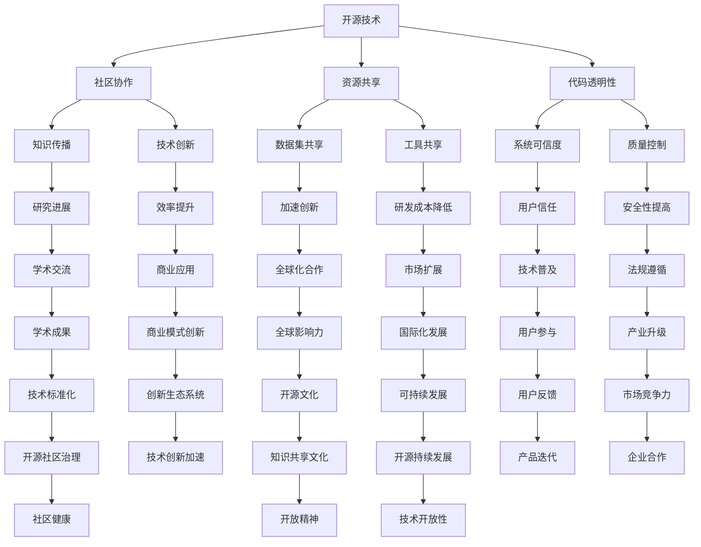

                 

关键词：开源技术，AI，人工智能，进步，创新，社区协作，共享

> 摘要：本文将探讨开源技术对人工智能（AI）发展的推动作用，分析开源社区在AI领域的贡献，并展望开源未来在AI发展中的前景。通过对开源技术核心概念、算法原理、数学模型、项目实践以及应用场景的详细阐述，揭示开源技术在AI领域的关键作用。

## 1. 背景介绍

人工智能作为一门涉及计算机科学、数学、神经科学和认知科学的交叉学科，近年来取得了显著进展。然而，AI的发展并非一蹴而就，开源技术的普及和应用在其中起到了至关重要的作用。开源技术是一种基于共享和协作的开发模式，它允许开发者自由地访问、修改和分发软件源代码。这种模式不仅降低了研发成本，还促进了技术的快速迭代和传播。

在AI领域，开源技术的重要性体现在以下几个方面：

1. **资源共享**：开源技术提供了丰富的数据集、工具和算法，使研究人员和开发者能够更容易地获取和使用这些资源，加速了AI技术的创新和应用。
2. **社区协作**：开源社区鼓励开发者的协作和交流，促进了知识的共享和技术的传播，有助于解决AI领域中的难题。
3. **透明度和可信度**：开源技术使AI系统的设计和实现更加透明，有助于提高系统的可靠性和可信度，为AI的广泛部署提供了保障。

## 2. 核心概念与联系

为了更好地理解开源技术对AI发展的推动作用，我们首先需要了解一些核心概念。以下是开源技术、AI以及两者之间联系的核心概念和架构，使用Mermaid流程图展示：



通过以上流程图，我们可以看到开源技术不仅为AI的发展提供了资源、工具和透明度，还促进了社区协作、知识传播、技术创新和效率提升，从而加速了AI领域的进步。

## 3. 核心算法原理 & 具体操作步骤

### 3.1 算法原理概述

在AI领域，开源技术对核心算法的推动作用尤为显著。以深度学习为例，其背后的算法原理包括神经网络、卷积神经网络（CNN）、递归神经网络（RNN）等。这些算法通过大规模数据训练和优化，实现从简单的数据识别到复杂模式识别的飞跃。

- **神经网络**：神经网络是模拟人脑神经元结构和功能的基本计算单元。它通过调整权重和偏置来实现非线性变换，从而实现特征提取和分类。
- **卷积神经网络**：卷积神经网络（CNN）主要用于图像处理任务，通过卷积操作提取图像特征，实现图像分类、目标检测等。
- **递归神经网络**：递归神经网络（RNN）适用于序列数据，如自然语言处理和语音识别，通过记忆状态实现序列的建模。

### 3.2 算法步骤详解

以卷积神经网络（CNN）为例，其基本操作步骤包括：

1. **输入层**：接收原始图像数据。
2. **卷积层**：通过卷积操作提取图像特征，并形成特征图。
3. **激活函数**：常用的激活函数包括ReLU、Sigmoid和Tanh，用于引入非线性变换。
4. **池化层**：通过池化操作降低特征图的维度，减少参数数量。
5. **全连接层**：将特征图展开为一维数据，通过全连接层进行分类和回归。
6. **输出层**：输出分类结果或回归值。

### 3.3 算法优缺点

- **优点**：
  - **高效性**：CNN能够通过多层卷积和池化操作，提取丰富的图像特征，实现高效的特征提取和分类。
  - **灵活性**：CNN适用于多种图像处理任务，如分类、检测和分割。
  - **可扩展性**：通过增加卷积层和池化层，可以构建更深的网络结构，提高模型的性能。

- **缺点**：
  - **计算量大**：CNN需要大量的计算资源，训练时间较长。
  - **数据依赖性**：模型的性能对数据质量有较高要求，需要大量的标注数据。

### 3.4 算法应用领域

CNN在AI领域的应用广泛，包括但不限于：

- **计算机视觉**：图像分类、目标检测、人脸识别等。
- **自然语言处理**：文本分类、情感分析、机器翻译等。
- **语音识别**：语音信号处理、语音合成等。

通过开源技术，这些算法得以广泛应用和优化，推动了AI领域的进步。

## 4. 数学模型和公式 & 详细讲解 & 举例说明

### 4.1 数学模型构建

在AI领域，数学模型是核心算法的基础。以深度学习中的卷积神经网络（CNN）为例，其数学模型包括以下几个关键部分：

1. **卷积操作**：卷积操作通过在输入图像上滑动卷积核，提取局部特征。其数学表示为：
   $$ f(x, y) = \sum_{i=1}^{m} \sum_{j=1}^{n} w_{ij} * g(x+i, y+j) $$
   其中，$f(x, y)$ 表示卷积结果，$w_{ij}$ 表示卷积核权重，$g(x+i, y+j)$ 表示输入图像上的点。

2. **激活函数**：常用的激活函数包括ReLU（Rectified Linear Unit）和Sigmoid。ReLU函数的数学表示为：
   $$ \text{ReLU}(x) = \max(0, x) $$
   Sigmoid函数的数学表示为：
   $$ \text{Sigmoid}(x) = \frac{1}{1 + e^{-x}} $$

3. **池化操作**：池化操作通过在局部区域内选择最大或平均值，降低特征图的维度。最大池化的数学表示为：
   $$ \text{MaxPool}(x) = \max \{ x_{ij} : x_{ij} \in A \} $$
   其中，$A$ 表示局部区域。

4. **全连接层**：全连接层通过将特征图展开为一维向量，进行全连接运算，输出分类或回归结果。其数学表示为：
   $$ y = \sum_{i=1}^{n} w_i x_i + b $$
   其中，$y$ 表示输出值，$w_i$ 表示权重，$x_i$ 表示输入值，$b$ 表示偏置。

### 4.2 公式推导过程

以ReLU激活函数为例，其推导过程如下：

1. **设定目标函数**：我们希望找到一个函数，使得输入值大于0时输出为输入值，小于等于0时输出为0。

2. **定义ReLU函数**：根据上述目标，我们可以定义ReLU函数为：
   $$ \text{ReLU}(x) = \max(0, x) $$

3. **证明性质**：
   - 当 $x > 0$ 时，$\max(0, x) = x$，满足要求。
   - 当 $x \leq 0$ 时，$\max(0, x) = 0$，满足要求。

因此，ReLU函数满足我们的目标。

### 4.3 案例分析与讲解

以图像分类任务为例，我们使用一个简单的CNN模型进行讲解。

1. **输入层**：输入一张32x32的彩色图像，数据范围为[0, 1]。

2. **卷积层**：使用一个3x3的卷积核，对图像进行卷积操作，得到32个特征图。

3. **激活函数**：使用ReLU函数作为激活函数，对每个特征图进行非线性变换。

4. **池化层**：对每个特征图进行2x2的最大池化操作，降低特征图的维度。

5. **全连接层**：将32个特征图展开为一维向量，输入到全连接层进行分类。

6. **输出层**：输出分类结果，通过softmax函数计算每个类别的概率。

通过上述步骤，我们可以训练和测试CNN模型，实现图像分类任务。

## 5. 项目实践：代码实例和详细解释说明

### 5.1 开发环境搭建

为了实践CNN模型，我们需要搭建一个Python开发环境，包括以下工具：

- Python 3.8及以上版本
- TensorFlow 2.5及以上版本
- Keras 2.5及以上版本

安装命令如下：

```bash
pip install python==3.8
pip install tensorflow==2.5
pip install keras==2.5
```

### 5.2 源代码详细实现

以下是一个简单的CNN模型实现：

```python
import tensorflow as tf
from tensorflow.keras.models import Sequential
from tensorflow.keras.layers import Conv2D, MaxPooling2D, Flatten, Dense

# 创建Sequential模型
model = Sequential()

# 添加卷积层
model.add(Conv2D(32, (3, 3), activation='relu', input_shape=(32, 32, 3)))
model.add(MaxPooling2D((2, 2)))

# 添加全连接层
model.add(Flatten())
model.add(Dense(128, activation='relu'))
model.add(Dense(10, activation='softmax'))

# 编译模型
model.compile(optimizer='adam', loss='categorical_crossentropy', metrics=['accuracy'])

# 模型可视化
model.summary()
```

### 5.3 代码解读与分析

- **模型构建**：使用Sequential模型构建CNN，包括卷积层、池化层、全连接层和输出层。
- **卷积层**：使用Conv2D层进行卷积操作，提取图像特征，激活函数为ReLU。
- **池化层**：使用MaxPooling2D层进行最大池化操作，降低特征图维度。
- **全连接层**：使用Flatten层将特征图展开为一维向量，使用Dense层进行分类。
- **编译模型**：使用编译函数设置优化器、损失函数和评价指标。

### 5.4 运行结果展示

通过训练和测试数据集，我们可以评估模型的性能：

```python
# 加载数据集
(x_train, y_train), (x_test, y_test) = tf.keras.datasets.cifar10.load_data()

# 数据预处理
x_train = x_train / 255.0
x_test = x_test / 255.0

# 转换为one-hot编码
y_train = tf.keras.utils.to_categorical(y_train, 10)
y_test = tf.keras.utils.to_categorical(y_test, 10)

# 训练模型
model.fit(x_train, y_train, epochs=10, batch_size=32, validation_data=(x_test, y_test))

# 评估模型
test_loss, test_acc = model.evaluate(x_test, y_test)
print(f"Test accuracy: {test_acc:.2f}")
```

通过上述步骤，我们可以训练和评估CNN模型，实现图像分类任务。

## 6. 实际应用场景

### 6.1 医疗领域

在医疗领域，开源技术在AI的应用非常广泛。例如，基于开源深度学习框架（如TensorFlow、PyTorch），研究人员和医生可以开发出用于医学图像分析的AI模型，如肿瘤检测、疾病诊断等。开源技术提供了丰富的工具和资源，使研究人员能够快速搭建和优化模型，提高了诊断的准确性和效率。

### 6.2 自动驾驶

自动驾驶是另一个典型的应用场景。开源技术为自动驾驶算法的研究和开发提供了强大的支持。例如，开源深度学习框架和传感器数据处理工具（如OpenCV）使研究人员能够开发出用于物体检测、车道线识别等自动驾驶核心技术的AI模型。此外，开源自动驾驶平台（如Apollo）为开发者提供了一个完整的自动驾驶解决方案，降低了开发门槛。

### 6.3 自然语言处理

自然语言处理（NLP）是AI领域的另一个重要应用领域。开源技术为NLP的研究和应用提供了丰富的资源，如预训练模型（如BERT、GPT）、文本处理工具（如NLTK、spaCy）等。这些开源技术不仅促进了NLP技术的发展，还为企业和研究机构提供了强大的工具，使其能够快速构建和应用NLP系统。

## 6.4 未来应用展望

随着AI技术的不断进步，开源技术在未来的应用前景将更加广阔。以下是未来开源技术在AI领域的一些应用展望：

- **跨领域融合**：开源技术将促进不同领域AI技术的融合，如医疗、自动驾驶、智能家居等，推动AI技术的综合应用。
- **智能助手与虚拟现实**：开源技术将为智能助手和虚拟现实应用提供强大支持，如语音识别、图像处理、自然语言理解等，使这些应用更加智能和人性化。
- **边缘计算**：开源技术将推动边缘计算的发展，使AI模型能够在边缘设备上高效运行，降低延迟，提高实时性。
- **人工智能治理**：开源技术将促进人工智能治理体系的建立，通过开放标准和共享机制，确保AI系统的透明性、公正性和可解释性。

## 7. 工具和资源推荐

### 7.1 学习资源推荐

1. **《深度学习》（Goodfellow, Bengio, Courville著）**：这是一本深度学习领域的经典教材，涵盖了深度学习的理论基础、算法实现和应用。
2. **《Python机器学习》（Scikit-Learn官方文档）**：Scikit-Learn是一个基于Python的机器学习库，官方文档提供了丰富的教程和示例，适合初学者和进阶者。
3. **《人工智能：一种现代方法》（Stuart Russell & Peter Norvig著）**：这是一本全面介绍人工智能的教材，涵盖了人工智能的基本概念、技术和应用。

### 7.2 开发工具推荐

1. **TensorFlow**：TensorFlow是一个开源深度学习框架，提供了丰富的API和工具，适用于各种深度学习任务。
2. **PyTorch**：PyTorch是一个基于Python的深度学习库，具有灵活的动态计算图和强大的GPU支持，适合研究人员和开发者。
3. **Keras**：Keras是一个基于TensorFlow和Theano的开源深度学习库，提供了简洁、易用的API，适用于快速搭建和实验深度学习模型。

### 7.3 相关论文推荐

1. **“Deep Learning” by Ian Goodfellow, Yoshua Bengio, and Aaron Courville**：这是一篇关于深度学习的综述论文，介绍了深度学习的基本概念、算法和最新进展。
2. **“Convolutional Neural Networks for Visual Recognition” by Karen Simonyan and Andrew Zisserman**：这是一篇关于卷积神经网络在视觉识别任务上的应用的经典论文。
3. **“Recurrent Neural Networks for Language Modeling” by Yoon Kim**：这是一篇关于递归神经网络在自然语言处理任务上应用的论文，提出了基于RNN的词向量模型。

## 8. 总结：未来发展趋势与挑战

### 8.1 研究成果总结

开源技术在AI领域取得了显著的成果，推动了AI技术的发展和应用。通过开源社区的合作，大量先进的算法、工具和资源得以共享，加速了AI技术的进步。例如，深度学习框架（如TensorFlow、PyTorch）的开源，使得研究人员和开发者能够轻松搭建和优化AI模型，推动了计算机视觉、自然语言处理、自动驾驶等领域的快速发展。

### 8.2 未来发展趋势

随着AI技术的不断进步，开源技术在AI领域的发展趋势将更加显著：

1. **跨领域融合**：开源技术将促进不同领域AI技术的融合，推动AI技术的综合应用。
2. **智能化与人性化**：开源技术将为智能助手、虚拟现实等应用提供强大支持，使AI系统更加智能化和人性化。
3. **边缘计算**：开源技术将推动边缘计算的发展，提高AI系统的实时性和效率。
4. **人工智能治理**：开源技术将促进人工智能治理体系的建立，确保AI系统的透明性、公正性和可解释性。

### 8.3 面临的挑战

尽管开源技术在AI领域取得了显著成果，但仍面临一些挑战：

1. **数据隐私**：开源技术需要处理大量的个人数据，如何保护数据隐私是亟待解决的问题。
2. **算法透明性**：开源技术的算法需要具备更高的透明性和可解释性，以避免算法偏见和错误。
3. **开源社区治理**：开源社区需要建立有效的治理机制，确保社区的健康发展和技术进步。

### 8.4 研究展望

为了应对这些挑战，未来需要在以下几个方面加强研究：

1. **数据隐私保护**：开发更加安全的数据保护技术，确保个人数据的隐私和安全。
2. **算法透明性提升**：研究如何提高算法的透明性和可解释性，使其更加可靠和公正。
3. **开源社区发展**：建立更加完善的社区治理机制，促进开源技术的健康发展。

总之，开源技术在AI领域的未来充满希望，但也面临诸多挑战。通过持续的研究和创新，开源技术将继续推动AI技术的进步，为人类带来更多福祉。

## 9. 附录：常见问题与解答

### Q1：什么是开源技术？

A1：开源技术是指软件开发过程中，开发者允许其他人自由地访问、修改和分发软件源代码。这种模式促进了社区协作和技术的快速传播。

### Q2：开源技术在AI领域有哪些优势？

A2：开源技术在AI领域具有以下优势：

- **资源共享**：提供了丰富的数据集、工具和算法，降低了研发成本。
- **社区协作**：鼓励开发者协作和交流，促进了知识的共享和技术的传播。
- **透明度和可信度**：使AI系统的设计和实现更加透明，提高了系统的可靠性和可信度。

### Q3：开源技术如何推动AI技术的发展？

A3：开源技术通过以下几个方面推动AI技术的发展：

- **加速算法创新**：开源社区提供了丰富的算法和工具，使研究人员和开发者能够快速构建和优化AI模型。
- **促进应用落地**：开源技术降低了AI应用的门槛，使得企业和研究机构能够更快地将AI技术应用于实际场景。
- **提高技术透明度**：开源技术使AI系统的设计和实现更加透明，促进了技术的推广和普及。

### Q4：开源技术在AI领域的未来发展趋势是什么？

A4：开源技术在AI领域的未来发展趋势包括：

- **跨领域融合**：促进不同领域AI技术的融合，推动AI技术的综合应用。
- **智能化与人性化**：为智能助手、虚拟现实等应用提供强大支持，使AI系统更加智能化和人性化。
- **边缘计算**：推动边缘计算的发展，提高AI系统的实时性和效率。
- **人工智能治理**：促进人工智能治理体系的建立，确保AI系统的透明性、公正性和可解释性。

