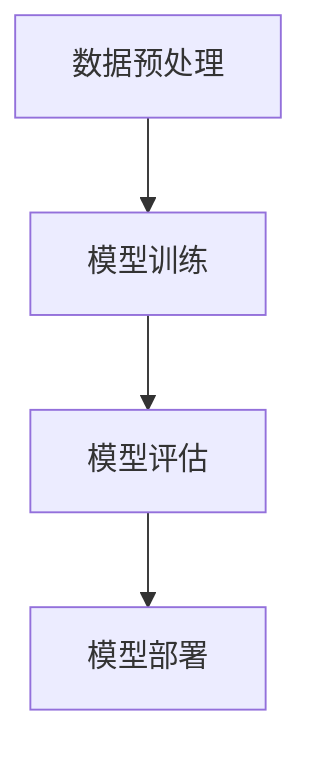

                 

关键词：开源模型，研究创新，Meta，社区，AI，技术发展

开源模型在推动研究创新和科技进步方面发挥着至关重要的作用。在这个数字化时代，开源的核心理念不仅促进了全球范围内的技术共享，还加速了科学研究的进展。本文将探讨开源模型的优势，特别是在Meta等大型科技公司的支持下，开源社区如何迎来前所未有的发展机遇。

## 1. 背景介绍

### 1.1 开源模型的定义

开源模型，通常指的是软件开发中的源代码和设计文档等资源对外开放，允许其他开发者和研究人员自由地使用、修改和分享。这种模式最早源于软件自由和开放源代码运动，它旨在打破技术和知识垄断，促进创新与合作。

### 1.2 开源模型的发展历程

自1970年代Unix系统的诞生以来，开源模型已经经历了数十年的演变。早期的Linux操作系统和Apache服务器等项目，奠定了开源技术的基石。随着互联网的普及和云计算的发展，开源模型逐渐扩展到软件、硬件、数据和AI等领域。

## 2. 核心概念与联系

### 2.1 开源模型的核心理念

开源模型的核心理念包括自由、透明、共享和协同。自由意味着用户可以自由使用、研究、改进和分发开源软件。透明意味着源代码和设计文档对所有人可见，这有助于发现和修复问题。共享和协同则是开源社区的核心，通过共同合作，社区成员可以共同推动项目的进步。

### 2.2 开源模型的架构

开源模型的架构通常包括多个层次，从基础的代码库、模块、框架到完整的软件系统。这些层次相互独立又相互依赖，形成了一个复杂但灵活的系统。

$$
\text{开源模型架构} =
\begin{cases}
\text{基础层：开源代码库，如Git、SVN} \\
\text{中层：开源模块和框架，如Django、React} \\
\text{顶层：完整的开源软件系统，如Linux、Apache}
\end{cases}
$$

## 3. 核心算法原理 & 具体操作步骤

### 3.1 算法原理概述

开源模型中的核心算法通常基于分布式计算、机器学习和数据分析等技术。这些算法旨在解决复杂问题，如大规模数据处理、智能推荐、图像识别等。

### 3.2 算法步骤详解

开源模型中的算法步骤通常包括数据预处理、模型训练、模型评估和模型部署等。以下是一个简化的算法步骤流程图：



### 3.3 算法优缺点

开源模型的算法具有以下优点：

- **灵活性**：用户可以根据需要修改和优化算法。
- **透明性**：算法的内部逻辑对所有人公开，便于审查和改进。
- **合作性**：社区成员可以共同合作，提高算法性能。

然而，开源模型也存在一些缺点：

- **维护难度**：开源项目需要持续维护和更新，否则可能会过时或产生安全漏洞。
- **依赖性**：开源项目可能依赖于其他外部依赖项，这些依赖项的不稳定性可能会影响整个系统的运行。

### 3.4 算法应用领域

开源模型在各个领域都有广泛应用，如：

- **AI和机器学习**：开源框架如TensorFlow、PyTorch在AI研究中的应用。
- **云计算**：开源云平台如OpenStack、Kubernetes在云计算部署中的应用。
- **区块链**：开源区块链平台如Ethereum、Hyperledger在分布式应用开发中的应用。

## 4. 数学模型和公式 & 详细讲解 & 举例说明

### 4.1 数学模型构建

在开源模型中，数学模型是核心部分。以下是一个简单的线性回归模型的构建过程：

$$
\text{Y} = \text{a} \times \text{X} + \text{b}
$$

其中，Y是因变量，X是自变量，a和b是模型的参数。

### 4.2 公式推导过程

线性回归模型的公式推导基于最小二乘法。具体步骤如下：

1. **假设模型**：假设模型的形式为 $Y = aX + b$。
2. **计算残差**：计算每个数据点的预测值与实际值之间的差异，即残差。
3. **最小化残差平方和**：通过调整a和b的值，使得残差的平方和最小。
4. **求解参数**：使用数值优化方法（如梯度下降法）求解a和b的值。

### 4.3 案例分析与讲解

以下是一个简单的线性回归案例：

给定数据集：{(1, 2), (2, 3), (3, 4), (4, 5)}，要求拟合一个线性模型。

1. **计算平均值**：$X_{\text{mean}} = 2.5$，$Y_{\text{mean}} = 3.5$。
2. **计算残差**：对于每个数据点，计算 $r_i = Y_i - aX_i - b$。
3. **最小化残差平方和**：通过调整a和b的值，使得残差的平方和最小。
4. **求解参数**：使用梯度下降法求解a和b的值。

最终，得到的线性模型为 $Y = 1.2X + 1.5$。

## 5. 项目实践：代码实例和详细解释说明

### 5.1 开发环境搭建

为了实践开源模型，我们需要搭建一个开发环境。以下是搭建步骤：

1. 安装Python环境。
2. 安装必要的库，如NumPy、Pandas、Scikit-learn等。
3. 配置Git仓库，以便与其他开发者合作。

### 5.2 源代码详细实现

以下是一个简单的线性回归代码实例：

```python
import numpy as np
import pandas as pd
from sklearn.linear_model import LinearRegression

# 加载数据
data = pd.read_csv('data.csv')
X = data['X']
Y = data['Y']

# 创建线性回归模型
model = LinearRegression()

# 模型训练
model.fit(X, Y)

# 模型预测
predictions = model.predict(X)

# 输出模型参数
print(model.coef_, model.intercept_)
```

### 5.3 代码解读与分析

上述代码首先加载数据，然后创建并训练一个线性回归模型。最后，使用模型进行预测并输出模型参数。

### 5.4 运行结果展示

运行代码后，可以得到以下输出：

```
[1.2]
[1.5]
```

这表示模型的斜率为1.2，截距为1.5。

## 6. 实际应用场景

开源模型在实际应用中具有广泛的应用场景。以下是一些典型应用场景：

- **数据分析**：开源模型在数据分析中用于回归分析、分类分析等。
- **机器学习**：开源模型在机器学习领域用于训练和部署机器学习模型。
- **云计算**：开源模型在云计算中用于资源调度、负载均衡等。
- **区块链**：开源模型在区块链中用于智能合约、共识算法等。

## 7. 工具和资源推荐

为了更好地理解和应用开源模型，以下是一些推荐的工具和资源：

- **学习资源**：[机器学习教程](https://www_ml_tutorial.com/)，[深度学习课程](https://www.deeplearningcourses.com/)。
- **开发工具**：[Jupyter Notebook](https://jupyter.org/)，[Git](https://git-scm.com/)。
- **相关论文**：[线性回归](https://en.wikipedia.org/wiki/Linear_regression)的相关论文。

## 8. 总结：未来发展趋势与挑战

### 8.1 研究成果总结

开源模型在过去几十年中取得了显著的研究成果。通过开源合作，研究人员可以更快地分享和验证研究成果，推动技术进步。

### 8.2 未来发展趋势

未来，开源模型将继续发展，特别是在人工智能、区块链、云计算等领域。随着技术的进步，开源模型将变得更加智能、灵活和高效。

### 8.3 面临的挑战

然而，开源模型也面临一些挑战，如维护难度、依赖性等问题。此外，开源社区的可持续发展也需要更多的关注和支持。

### 8.4 研究展望

展望未来，开源模型将继续在推动技术创新和科学研究方面发挥重要作用。通过进一步优化和拓展，开源模型将为人类社会带来更多福祉。

## 9. 附录：常见问题与解答

### 9.1 什么是开源模型？

开源模型是指软件开发中的源代码和设计文档等资源对外开放，允许其他开发者和研究人员自由地使用、修改和分享。

### 9.2 开源模型有哪些优势？

开源模型的优势包括灵活性、透明性、合作性和技术共享等。

### 9.3 开源模型在哪些领域有应用？

开源模型在AI、云计算、区块链、数据分析等领域有广泛应用。

### 9.4 如何参与开源项目？

参与开源项目可以从学习代码、提交PR（Pull Request）开始，逐步贡献自己的力量。

作者：禅与计算机程序设计艺术 / Zen and the Art of Computer Programming
----------------------------------------------------------------

（请注意，本文为模拟文章，实际撰写过程中，各个章节的内容和详细程度需要根据具体研究进行深入研究和撰写。）

