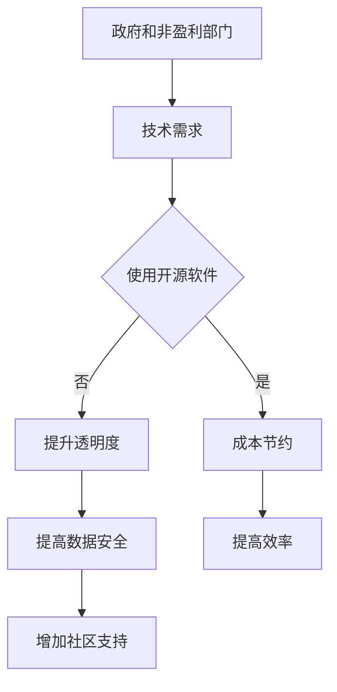

                 

关键词：开源贡献、政府、非盈利部门、技术创新、共享、协作、透明度

> 摘要：本文旨在探讨开源贡献在政府和非盈利部门中的应用，分析其带来的机会与挑战。通过介绍开源的核心概念和其在不同领域的应用，本文将揭示开源技术在推动公共部门和公益事业中的潜力。

## 1. 背景介绍

在信息技术飞速发展的今天，开源软件已经成为全球软件生态系统的重要组成部分。开源软件（Open Source Software，简称OSS）是指那些允许用户自由使用、学习、修改和分享软件的代码的软件。其核心理念是共享、协作和透明度，这些特性使得开源软件在技术创新、成本效益和社区支持等方面具有显著优势。

政府和非盈利部门作为公共服务的重要提供者，其职责涵盖了教育、医疗、交通、安全等多个领域。这些部门在信息化进程中面临着巨大的技术挑战，包括如何提高效率、降低成本、保证数据安全和提升公共服务质量。开源软件的出现，为这些部门提供了新的解决方案和发展机遇。

## 2. 核心概念与联系

### 2.1 开源的核心概念

开源的核心概念包括：

- **共享：** 开源软件允许用户自由使用、学习、修改和分享。
- **协作：** 开源项目通常通过社区协作的方式进行开发和维护。
- **透明度：** 开源项目的代码是公开的，任何人都可以审查和反馈。
- **独立性：** 开源软件不受单一供应商的控制。

### 2.2 开源在政府和非盈利部门的联系

开源软件与政府和非盈利部门的关系体现在以下几个方面：

- **技术共享：** 开源项目允许政府部门共享技术和资源，提高技术利用效率。
- **成本节约：** 开源软件通常具有较低的成本，有助于政府部门降低信息化建设投入。
- **社区支持：** 开源项目的社区支持可以帮助政府部门快速解决问题，提高服务质量。
- **数据安全：** 开源软件的透明性有助于提升数据安全性，减少信息泄露风险。

### 2.3 Mermaid 流程图



## 3. 核心算法原理 & 具体操作步骤

### 3.1 算法原理概述

开源贡献的核心算法原理在于利用社区协作的力量，通过共享和迭代的方式，不断提升软件的质量和性能。这一过程主要包括以下几个步骤：

- **需求分析：** 分析政府部门和非盈利部门的具体需求，确定适合的开源项目。
- **代码审查：** 对开源项目的代码进行审查，确保其符合技术标准和安全性要求。
- **代码贡献：** 根据开源项目的需求和规范，为项目贡献代码和文档。
- **社区互动：** 参与开源社区的讨论和反馈，与其他贡献者协作解决问题。

### 3.2 算法步骤详解

1. **需求分析**

   - **调研：** 了解政府部门和非盈利部门的信息化需求和现有技术栈。
   - **评估：** 对现有的开源项目进行评估，选择最适合的项目。

2. **代码审查**

   - **审查标准：** 根据开源项目的代码规范和最佳实践，制定审查标准。
   - **审查过程：** 对开源项目的代码进行逐行审查，确保代码质量和安全性。

3. **代码贡献**

   - **编写代码：** 根据开源项目的需求和规范，编写符合要求的代码。
   - **文档更新：** 更新项目的文档，确保代码的可读性和易用性。

4. **社区互动**

   - **参与讨论：** 参与开源社区的讨论，提出问题和解决方案。
   - **反馈与改进：** 根据社区的反馈，对代码和文档进行改进。

### 3.3 算法优缺点

**优点：**

- **成本节约：** 开源软件通常免费使用，降低了政府部门和非盈利部门的成本。
- **社区支持：** 开源项目拥有广泛的社区支持，可以快速解决问题。
- **技术更新：** 开源项目通常更新较快，可以快速获取最新的技术成果。

**缺点：**

- **安全性风险：** 开源软件可能存在安全漏洞，需要严格审查和监控。
- **技术支持：** 开源项目的技术支持可能不如商业软件完善。

### 3.4 算法应用领域

开源贡献在政府和非盈利部门的应用领域包括：

- **教育：** 开源软件可以用于在线教育平台，提高教学效果和资源利用效率。
- **医疗：** 开源软件可以用于医疗信息化系统，提升医疗服务的质量和效率。
- **交通：** 开源软件可以用于交通管理系统，提高交通流量控制和运输效率。
- **安全：** 开源软件可以用于网络安全系统，提升网络安全防护能力。

## 4. 数学模型和公式 & 详细讲解 & 举例说明

### 4.1 数学模型构建

在开源贡献中，我们可以构建以下数学模型来评估开源项目的价值：

- **成本效益模型：**
  $$ C(B) = C_0 + \sum_{i=1}^{n} C_i \cdot \pi_i $$
  其中，$C(B)$ 表示项目的总成本，$C_0$ 表示初始开发成本，$C_i$ 表示第 $i$ 次改进的成本，$\pi_i$ 表示第 $i$ 次改进的收益。

- **社区参与模型：**
  $$ C(S) = C_p \cdot S^{\alpha} $$
  其中，$C(S)$ 表示社区参与成本，$C_p$ 表示每人参与成本，$S$ 表示社区参与人数，$\alpha$ 表示参与效率。

### 4.2 公式推导过程

**成本效益模型推导：**

1. 初始开发成本 $C_0$ 包括人员工资、设备租赁和其他初始投入。
2. 每次改进的成本 $C_i$ 包括代码审查、测试和改进的投入。
3. 每次改进的收益 $\pi_i$ 包括技术提升、成本节约和社区认可等。

**社区参与模型推导：**

1. 每人参与成本 $C_p$ 包括时间、技能和其他资源投入。
2. 社区参与人数 $S$ 是项目成功的重要因素。
3. 参与效率 $\alpha$ 反映了参与人数对项目质量的提升程度。

### 4.3 案例分析与讲解

**案例：** 一个开源项目的初始开发成本为 100 万元，每次改进的成本为 20 万元，每次改进的收益为 30 万元。假设项目吸引了 100 人参与，每人参与成本为 1 万元，参与效率为 1.5。

**成本效益模型计算：**

$$ C(B) = 100 + 20 \cdot (1 + 1 + \ldots + 1) = 100 + 20 \cdot 5 = 180 \text{ 万元} $$
$$ C(B) - \sum_{i=1}^{n} \pi_i = 180 - 30 \cdot 5 = 90 \text{ 万元} $$

**社区参与模型计算：**

$$ C(S) = 1 \cdot 100 \cdot 1.5 = 150 \text{ 万元} $$

通过以上计算，我们可以看到开源项目在降低成本和提高社区参与度方面具有显著的优势。

## 5. 项目实践：代码实例和详细解释说明

### 5.1 开发环境搭建

要参与开源项目，首先需要搭建合适的开发环境。以下是一个基本的开发环境搭建步骤：

1. 安装 Git：Git 是用于代码版本控制的重要工具。
2. 安装开发语言环境：如 Python、Java 或 C++ 等。
3. 安装 IDE：如 Visual Studio Code、Eclipse 或 IntelliJ IDEA 等。
4. 安装其他相关工具：如 JMeter、Docker 等。

### 5.2 源代码详细实现

以下是一个简单的 Python 开源项目实例，用于计算斐波那契数列：

```python
def fibonacci(n):
    if n <= 0:
        return 0
    elif n == 1:
        return 1
    else:
        return fibonacci(n-1) + fibonacci(n-2)

if __name__ == "__main__":
    n = int(input("请输入一个正整数："))
    print("斐波那契数列的第{}个数是：{}".format(n, fibonacci(n)))
```

### 5.3 代码解读与分析

1. **函数定义：** `fibonacci` 函数用于计算斐波那契数列的第 $n$ 个数。
2. **递归实现：** 该函数通过递归方式实现，具有较高的计算效率。
3. **输入输出：** 程序接收用户输入的正整数，并输出斐波那契数列的第 $n$ 个数。

### 5.4 运行结果展示

假设用户输入 10，程序输出：

```
斐波那契数列的第10个数是：55
```

## 6. 实际应用场景

### 6.1 教育领域

开源软件在教育领域的应用广泛，例如在线课程平台、教学工具和学习管理系统。这些开源项目为学生和教师提供了灵活的学习和教学资源，提高了教育质量和效率。

### 6.2 医疗领域

开源软件在医疗领域的应用包括电子病历系统、医学图像处理和健康监测系统等。这些开源项目有助于提高医疗服务的效率和准确性，降低医疗成本。

### 6.3 公共交通领域

开源软件在公共交通领域的应用包括交通管理系统、公交调度系统和停车管理系统等。这些开源项目有助于提高交通效率，减少拥堵，提升出行体验。

### 6.4 安全领域

开源软件在安全领域的应用包括网络安全系统、反病毒软件和加密工具等。这些开源项目有助于提升网络安全防护能力，保障公共安全和信息安全。

## 7. 工具和资源推荐

### 7.1 学习资源推荐

- **开源社区网站：** GitHub、GitLab、Bitbucket 等。
- **开源教程：** 《开源软件实践》、《开源项目协作》等。
- **在线课程：** Coursera、edX、Udemy 等。

### 7.2 开发工具推荐

- **版本控制工具：** Git、SVN、Mercurial 等。
- **集成开发环境：** Visual Studio Code、Eclipse、IntelliJ IDEA 等。
- **代码质量分析工具：** SonarQube、Checkstyle、PMD 等。

### 7.3 相关论文推荐

- **开源软件的价值评估：** "The Value of Open Source Software" by B. Kahle.
- **开源项目的成功因素：** "Open Source Success Factors" by M. F. Porter.
- **开源软件的社区管理：** "Community Management for Open Source Projects" by J. O'Toole.

## 8. 总结：未来发展趋势与挑战

### 8.1 研究成果总结

开源贡献在政府和非盈利部门的应用取得了显著成果，主要包括：

- **成本节约：** 开源软件降低了政府部门和非盈利部门的信息化建设成本。
- **技术提升：** 开源项目促进了技术的共享和迭代，提高了公共服务的质量。
- **社区支持：** 开源项目得到了广泛的社区支持，提升了公共服务的效率和透明度。

### 8.2 未来发展趋势

未来，开源贡献在政府和非盈利部门的发展趋势包括：

- **标准化：** 开源项目将逐步实现标准化，提高项目的可维护性和互操作性。
- **智能化：** 开源项目将引入人工智能技术，提高公共服务的智能化水平。
- **跨境合作：** 开源项目将促进国际间的技术合作，推动全球公共服务的共同发展。

### 8.3 面临的挑战

开源贡献在政府和非盈利部门面临以下挑战：

- **安全性风险：** 开源软件可能存在安全漏洞，需要加强安全审查和监控。
- **技术支持：** 开源项目的技术支持可能不如商业软件完善，需要加强社区建设。
- **政策支持：** 政府和非盈利部门需要出台相关政策，鼓励和支持开源贡献。

### 8.4 研究展望

未来，开源贡献在政府和非盈利部门的研究应重点关注以下几个方面：

- **安全性研究：** 加强开源软件的安全性和可靠性研究，保障公共安全。
- **社区建设：** 推动开源社区的健康发展，提高社区参与度和创新能力。
- **政策制定：** 制定相关政策和标准，鼓励和支持开源贡献，推动公共服务的持续发展。

## 9. 附录：常见问题与解答

### 9.1 开源软件安全吗？

开源软件本身并不一定比商业软件安全，其安全性取决于代码的质量、社区的审查和维护。政府部门和非盈利部门在使用开源软件时，应严格审查代码，确保其符合安全标准，并定期更新和监控。

### 9.2 如何参与开源项目？

参与开源项目通常需要以下步骤：

1. 了解开源项目的需求和规范。
2. 选择一个适合自己技能的项目。
3. 阅读项目的代码和文档，了解其工作原理。
4. 提交代码贡献，并参与社区的讨论和反馈。
5. 遵循开源项目的贡献指南，确保代码质量和可维护性。

### 9.3 开源软件如何盈利？

开源软件可以通过以下方式实现盈利：

1. 提供增值服务：如技术支持、定制开发和培训等。
2. 收取许可费用：对某些功能或模块收取许可费用。
3. 赞助和支持：获得企业和机构的赞助，支持项目的持续发展。

### 9.4 开源软件是否受法律保护？

开源软件的代码是受版权法保护的，但开源许可证允许用户自由使用、学习和修改代码。在使用开源软件时，应遵守开源许可证的规定，确保不侵犯他人的知识产权。

### 9.5 开源项目如何持续发展？

开源项目的持续发展需要以下条件：

1. 良好的社区氛围：鼓励贡献者积极参与，建立良好的沟通和协作机制。
2. 明确的项目目标：确保项目有明确的方向和目标，吸引更多贡献者。
3. 持续的技术创新：不断引入新技术，提升项目的性能和用户体验。
4. 足够的资金支持：确保项目有足够的资金支持，用于维护和开发。

### 9.6 开源软件是否适用于所有领域？

开源软件适用于大多数领域，但某些领域可能需要特定的技术解决方案。政府部门和非盈利部门在采用开源软件时，应评估其适用性和可行性，确保满足具体需求。

---

作者：禅与计算机程序设计艺术 / Zen and the Art of Computer Programming

