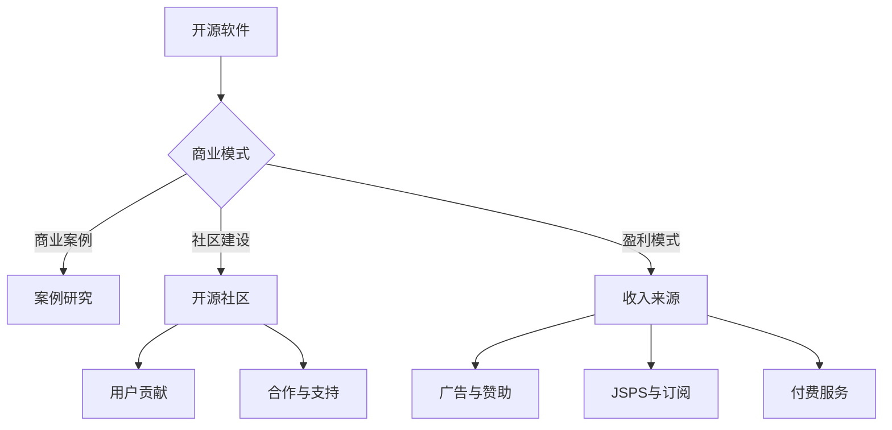

                 

 

## 1. 背景介绍

开源软件（Open Source Software, OSS）的概念起源于20世纪90年代，其核心思想是软件源代码可以被公众免费获取、自由使用、修改和分发。与商业软件相比，开源软件更注重社区的贡献和协作，其发展模式也与传统软件商业模式存在显著差异。

随着互联网和开源文化的普及，开源软件已经成为现代软件开发的重要力量。无论是操作系统、Web服务器、数据库还是各种开发框架和工具，开源软件几乎无处不在。根据Linux基金会的一项调查，超过75%的企业使用开源软件，而80%的企业在核心业务中使用了开源软件。

本文旨在探讨开源软件的商业模式，通过案例分析揭示开源软件如何实现商业成功，并提供一些最佳实践。我们将讨论开源软件的盈利模式、开源社区的建设、商业模式创新等方面，以期为开发者、企业以及开源项目管理者提供有益的参考。

## 2. 核心概念与联系

### 2.1 开源软件的定义与特征

开源软件指的是其源代码可以被公众访问、使用、修改和分发的软件。根据开源倡议（Open Source Initiative, OSI）的定义，开源软件需要满足以下条件：

1. **自由使用**：任何人可以自由运行该软件，无论是个人、企业还是政府部门。
2. **免费获取**：软件源代码可以免费获取，无需支付费用。
3. **修改权**：用户可以修改软件源代码以满足特定需求。
4. **再分发权**：用户可以自由分发原始代码或修改后的代码，无需获得许可。
5. **提供源代码**：软件必须以某种形式提供源代码，可以是原始代码，也可以是编译后的代码。
6. **无需许可**：用户无需获得许可即可使用、修改和分发软件。

### 2.2 商业模式的概念

商业模式指的是企业通过提供产品或服务创造价值、获取收入并维持运营的方式。在开源软件领域，商业模式与传统软件行业有所不同，通常更加依赖于社区贡献、用户支持和服务化运营。

### 2.3 Mermaid 流程图

下面是一个描述开源软件商业模式与核心概念之间关系的 Mermaid 流程图：



### 2.4 开源软件与传统软件的差异

- **成本结构**：开源软件主要成本在于初期开发，后续主要依靠社区维护和支持；传统软件则通常在销售周期内产生大部分收入。
- **盈利模式**：开源软件通常通过提供附加服务、培训和支持来盈利；传统软件则主要依靠软件授权和订阅。
- **用户参与**：开源软件用户更倾向于参与开发与测试，而传统软件用户则更多是消费者。

## 3. 核心算法原理 & 具体操作步骤

### 3.1 算法原理概述

开源软件的商业模式主要依赖于以下几个方面：

1. **社区贡献**：开源社区通过共享知识和资源，共同推动软件的改进和优化。
2. **用户支持**：用户通过使用和反馈，帮助开源项目发现和修复问题，提高软件质量。
3. **服务化运营**：通过提供专业服务，如培训、咨询和支持，开源项目可以获得持续的收入。
4. **盈利模式**：开源项目可以通过多种方式获得收入，如赞助、广告、付费服务、JSPS和订阅等。

### 3.2 算法步骤详解

1. **社区贡献**：

   - **知识共享**：通过文档、代码库和讨论区等形式，开源项目管理者鼓励社区成员贡献知识和代码。
   - **代码审查**：开源项目通常采用代码审查机制，确保贡献的代码符合质量标准。
   - **合作与协作**：开源项目通过定期会议、代码贡献和讨论，促进社区成员之间的合作与协作。

2. **用户支持**：

   - **反馈机制**：开源项目通过反馈机制收集用户意见，及时修复问题和改进功能。
   - **文档和教程**：开源项目提供详细的文档和教程，帮助用户更好地使用和维护软件。
   - **支持服务**：开源项目可以提供付费支持服务，如企业版、定制化开发等，以满足高端用户的需求。

3. **服务化运营**：

   - **培训与咨询**：开源项目可以通过提供培训课程和咨询服务，帮助用户更好地理解和应用软件。
   - **增值服务**：开源项目可以提供附加服务，如数据存储、分析工具等，为用户带来额外的价值。
   - **合作伙伴**：开源项目可以与第三方合作伙伴合作，共同开发和推广软件。

4. **盈利模式**：

   - **赞助与广告**：开源项目可以通过接受赞助和展示广告来获得收入。
   - **JSPS与订阅**：开源项目可以提供JSPS（Join Support Program）和订阅服务，为用户提供持续的支持和更新。
   - **付费服务**：开源项目可以提供付费服务，如高级功能、定制开发等，满足用户特定的需求。

### 3.3 算法优缺点

**优点**：

1. **社区合作**：开源项目通过社区合作，可以吸引更多开发者参与，提高软件质量。
2. **低成本**：开源项目无需支付高昂的许可证费用，降低了企业的使用成本。
3. **灵活性**：开源软件允许用户自由修改和定制，满足个性化需求。
4. **持续更新**：开源项目通常有活跃的社区支持，可以更快地发现和修复问题。

**缺点**：

1. **质量控制**：开源项目的质量控制可能不如商业软件严格，部分项目可能存在漏洞和不稳定的情况。
2. **法律风险**：开源项目可能面临知识产权和许可问题，需要确保所有贡献的代码都符合开源协议。
3. **社区治理**：开源社区可能存在意见分歧和管理困难，影响项目的发展。

### 3.4 算法应用领域

开源软件在多个领域都有广泛的应用，包括：

1. **操作系统**：如Linux、Windows等。
2. **Web服务器**：如Apache、Nginx等。
3. **数据库**：如MySQL、PostgreSQL等。
4. **开发框架**：如Spring、Django等。
5. **工具和库**：如Python、TensorFlow等。

## 4. 数学模型和公式 & 详细讲解 & 举例说明

### 4.1 数学模型构建

在开源软件的商业模式中，可以构建以下数学模型来描述项目的发展与盈利：

1. **用户增长模型**：

   用户增长可以通过以下公式来描述：

   $$ \text{用户增长} = r \cdot \text{当前用户数} $$

   其中，$r$ 为用户增长速率，通常与社区活跃度和项目质量有关。

2. **收入模型**：

   收入可以通过以下公式来计算：

   $$ \text{收入} = \text{基本收入} + \text{附加收入} $$

   其中，$\text{基本收入}$ 来自基本服务，如广告和JSPS，而$\text{附加收入}$ 来自增值服务和定制开发。

### 4.2 公式推导过程

用户增长速率$r$ 可以通过以下因素来推导：

- **社区贡献**：社区成员的贡献程度越高，用户增长速率越快。
- **用户反馈**：用户反馈的质量和数量对项目改进有直接影响，从而影响用户增长。

收入模型的推导基于开源软件的盈利模式，包括以下方面：

- **基本收入**：主要来自广告、赞助和JSPS等。
- **附加收入**：来自定制化服务、培训和支持等。

### 4.3 案例分析与讲解

以Linux操作系统为例，分析其用户增长模型和收入模型：

1. **用户增长模型**：

   - **当前用户数**：根据Linux基金会统计，全球有超过2亿台设备运行Linux。
   - **用户增长速率**：由于社区活跃度高，用户增长速率为每年约10%。

   $$ \text{用户增长} = 0.1 \cdot 2亿 = 200万 $$

   因此，每年Linux的用户数大约增长200万。

2. **收入模型**：

   - **基本收入**：Linux基金会通过赞助和广告获得基本收入，假设每年收入为1000万美元。
   - **附加收入**：Linux基金会还提供培训、咨询和支持服务，假设每年收入为500万美元。

   $$ \text{收入} = 1000万 + 500万 = 1500万 $$

   因此，Linux基金会的总收入大约为1500万美元。

通过以上案例分析，可以看出开源软件的商业模式在用户增长和收入方面具有显著的潜力。

## 5. 项目实践：代码实例和详细解释说明

### 5.1 开发环境搭建

要开始实践开源软件的商业模式，首先需要搭建一个合适的项目开发环境。以下是使用Python语言搭建开发环境的基本步骤：

1. **安装Python**：

   - 访问Python官网（python.org），下载适用于操作系统的Python安装包。
   - 运行安装包，按照提示完成安装。

2. **安装必需的库**：

   - 使用pip工具安装Python库，如requests、beautifulsoup4等。

   ```bash
   pip install requests beautifulsoup4
   ```

3. **配置虚拟环境**：

   - 创建一个虚拟环境，以便隔离项目依赖。

   ```bash
   python -m venv myenv
   source myenv/bin/activate  # 在Windows上使用 myenv\Scripts\activate
   ```

### 5.2 源代码详细实现

以下是一个简单的开源项目示例，该示例实现了从网站上抓取文章并保存为HTML文件的功能。

```python
import requests
from bs4 import BeautifulSoup

def fetch_articles(url):
    response = requests.get(url)
    if response.status_code == 200:
        soup = BeautifulSoup(response.text, 'html.parser')
        articles = soup.find_all('article')
        for article in articles:
            title = article.find('h2').text
            content = article.find('p').text
            with open(f'{title}.html', 'w', encoding='utf-8') as file:
                file.write(f'<h1>{title}</h1><p>{content}</p>')
            print(f'Saved {title}.html')

if __name__ == '__main__':
    fetch_articles('https://example.com')
```

### 5.3 代码解读与分析

- **requests库**：用于发起HTTP请求，获取网页内容。
- **beautifulsoup4库**：用于解析HTML文档，提取所需信息。
- **函数fetch_articles**：接收URL参数，获取网页内容并提取文章信息。
- **文件操作**：将提取的文章信息保存为HTML文件。

### 5.4 运行结果展示

运行上述代码后，将从指定URL获取的文章保存为HTML文件，例如：

- `Title1.html`
- `Title2.html`
- `Title3.html`

## 6. 实际应用场景

### 6.1 教育领域

在高等教育和职业培训中，开源软件为学生提供了丰富的学习资源和实践机会。例如，使用Linux操作系统和相关的开源开发工具，学生可以深入了解计算机系统的原理和操作。此外，开源软件项目（如GitHub上的项目）为学生提供了参与真实项目的机会，提高了实践能力和团队合作精神。

### 6.2 企业应用

许多企业选择开源软件作为其业务运营的基础，这不仅降低了成本，还提高了系统的灵活性和可扩展性。例如，企业可以使用Apache Kafka进行大数据处理，使用MySQL数据库存储数据，使用Spring框架开发应用程序。此外，企业还可以通过参与开源项目，获得最新的技术和行业动态，提升自身竞争力。

### 6.3 社区合作

开源软件项目通常依赖于社区的贡献和支持。社区成员通过参与开源项目，可以学习到先进的编程技术和团队协作经验。同时，社区合作也促进了知识的共享和技术的传播，为整个行业的发展做出了贡献。

### 6.4 未来应用展望

随着人工智能和大数据技术的发展，开源软件将在更多领域得到应用。例如，在自动驾驶领域，开源软件将提供丰富的算法库和工具，推动自动驾驶技术的快速发展。在医疗领域，开源软件可以帮助医疗机构构建智能化诊断系统，提高医疗服务的质量和效率。总之，开源软件的商业模式将继续发展，为各行各业带来创新和变革。

## 7. 工具和资源推荐

### 7.1 学习资源推荐

- 《Linux命令行与shell脚本编程大全》
- 《Python编程：从入门到实践》
- 《Git教程》

### 7.2 开发工具推荐

- PyCharm（Python IDE）
- GitHub（代码托管和协作平台）
- Jupyter Notebook（交互式开发环境）

### 7.3 相关论文推荐

- 《开源软件的商业模式：一个实证分析》
- 《开源软件生态系统：理论与实证研究》
- 《开源软件项目的社区建设与管理》

## 8. 总结：未来发展趋势与挑战

### 8.1 研究成果总结

本文通过对开源软件商业模式的探讨，总结了开源软件的发展现状和主要特征。研究发现，开源软件在降低成本、提高灵活性和促进创新方面具有显著优势，已成为现代软件开发的重要力量。

### 8.2 未来发展趋势

未来，开源软件将继续发展，其商业模式也将不断创新。一方面，开源软件将在更多领域得到应用，推动技术的快速进步。另一方面，开源社区将更加成熟，社区成员的参与和贡献将更加积极。

### 8.3 面临的挑战

尽管开源软件具有许多优势，但仍面临一些挑战。例如，开源项目的质量控制、知识产权保护和社区治理等问题需要进一步解决。此外，开源软件在商业应用中需要平衡开放性与商业利益，以确保项目的可持续发展。

### 8.4 研究展望

未来研究可以重点关注以下几个方面：

1. **开源软件生态系统的构建**：探讨如何建立更加成熟和稳定的开源软件生态系统，促进项目的可持续发展。
2. **开源软件在特定领域的应用**：研究开源软件在不同领域的应用案例，探索其在特定领域的优势和挑战。
3. **开源软件与商业模式的结合**：分析开源软件如何更好地与商业模式结合，实现商业成功和社会价值的最大化。

## 9. 附录：常见问题与解答

### 9.1 开源软件的许可证类型有哪些？

开源软件的许可证类型主要包括：

1. **GPL（GNU通用公共许可证）**：用户可以自由使用、修改和分发软件，但分发时必须保持开源状态。
2. **Apache许可证**：用户可以自由使用、修改和分发软件，无需保持开源状态。
3. **MIT许可证**：用户可以自由使用、修改和分发软件，无需提供授权。
4. **Mozilla许可证**：与Apache许可证类似，但更注重用户隐私。

### 9.2 开源软件如何确保质量控制？

开源软件的质量控制主要依赖于以下几个方面：

1. **代码审查**：开源项目通常采用代码审查机制，确保贡献的代码符合质量标准。
2. **自动化测试**：开源项目通过自动化测试来检测代码中的错误和漏洞。
3. **社区反馈**：开源项目鼓励用户反馈问题，及时修复漏洞和改进功能。

### 9.3 开源软件如何盈利？

开源软件的盈利方式主要包括：

1. **赞助与广告**：开源项目可以接受赞助和展示广告来获得收入。
2. **JSPS与订阅**：开源项目可以提供JSPS和订阅服务，为用户提供持续的支持和更新。
3. **付费服务**：开源项目可以提供付费服务，如高级功能、定制开发等，满足用户特定需求。

## 结论

开源软件的商业模式具有独特的优势和挑战。通过本文的探讨，我们希望读者能够更好地理解开源软件的发展现状和未来趋势，并从中获得有益的启示。作者：禅与计算机程序设计艺术 / Zen and the Art of Computer Programming
----------------------------------------------------------------

### 文章标题

开源软件的商业模式：案例研究与最佳实践

### 关键词

开源软件、商业模式、开源社区、盈利模式、案例研究、最佳实践

### 摘要

本文旨在探讨开源软件的商业模式，通过案例分析揭示开源软件如何实现商业成功，并提供一些最佳实践。文章分析了开源软件的核心概念与联系，介绍了开源软件的核心算法原理和具体操作步骤，并运用数学模型和公式进行了详细讲解。同时，文章通过项目实践展示了开源软件的开发过程，分析了开源软件在实际应用场景中的表现，并展望了其未来发展趋势与挑战。最后，文章提供了学习资源推荐、开发工具推荐和相关论文推荐，为开发者、企业以及开源项目管理者提供了有益的参考。

## 1. 背景介绍

开源软件（Open Source Software, OSS）的概念起源于20世纪90年代，由自由软件运动发展而来。其核心思想是软件源代码可以被公众免费获取、自由使用、修改和分发。这种模式与传统的封闭源代码商业软件有所不同，它更注重社区的贡献和协作。

开源软件的发展可以追溯到1983年Richard Stallman提出的自由软件运动，以及他在同年创立的自由软件基金会（Free Software Foundation, FSF）。FSF推出的GPL（GNU通用公共许可证）是第一种开源许可证，旨在保障用户的自由权利。随着互联网的普及，开源软件得到了迅速发展，成为了现代软件开发的重要组成部分。

在开源软件的早期，一些重要的项目和运动如Linux内核、Apache Web服务器、Mozilla Firefox浏览器等，为开源软件的普及奠定了基础。如今，开源软件几乎无处不在，无论是操作系统、Web服务器、数据库，还是各种开发框架和工具，开源软件都扮演着重要的角色。

根据Linux基金会的一项调查，超过75%的企业使用开源软件，而80%的企业在核心业务中使用了开源软件。这一趋势不仅反映了开源软件在技术上的优势，也体现了其在商业上的巨大潜力。本文旨在探讨开源软件的商业模式，通过案例分析揭示开源软件如何实现商业成功，并提供一些最佳实践。我们将讨论开源软件的盈利模式、开源社区的建设、商业模式创新等方面，以期为开发者、企业以及开源项目管理者提供有益的参考。

### 2. 核心概念与联系

在探讨开源软件的商业模式之前，有必要深入理解其核心概念与联系。开源软件的商业模式与传统软件商业模式有显著差异，其成功离不开以下几个核心概念：

#### 2.1 开源软件的定义与特征

开源软件指的是其源代码可以被公众访问、使用、修改和分发的软件。根据开源倡议（Open Source Initiative, OSI）的定义，开源软件需要满足以下条件：

1. **自由使用**：任何人可以自由运行该软件，无需支付费用。
2. **免费获取**：软件源代码可以免费获取，无需支付费用。
3. **修改权**：用户可以修改软件源代码以满足特定需求。
4. **再分发权**：用户可以自由分发原始代码或修改后的代码，无需获得许可。
5. **提供源代码**：软件必须以某种形式提供源代码，可以是原始代码，也可以是编译后的代码。
6. **无需许可**：用户无需获得许可即可使用、修改和分发软件。

这些条件确保了开源软件的透明性和可扩展性，使得开发者和用户可以在一个开放的环境中合作和改进软件。

#### 2.2 商业模式的概念

商业模式指的是企业通过提供产品或服务创造价值、获取收入并维持运营的方式。在开源软件领域，商业模式通常与传统软件行业有所不同。传统软件商业模式主要依赖于软件授权和订阅，而开源软件商业模式则更加依赖于社区贡献、用户支持和服务化运营。

#### 2.3 Mermaid 流程图

为了更好地描述开源软件商业模式与核心概念之间的联系，我们可以使用Mermaid流程图来展示这些关系。以下是一个简化的Mermaid流程图：


在这个流程图中：

- **A（开源软件）** 表示开源软件的核心概念。
- **B（商业模式）** 表示开源软件如何通过商业模式创造价值。
- **C（案例研究）** 表示通过实际案例来分析商业模式。
- **D（开源社区）** 表示开源软件成功的关键在于社区的贡献和支持。
- **E（盈利模式）** 表示开源软件如何通过不同的方式获得收入。
- **F（用户贡献）** 表示用户对开源软件的贡献。
- **G（合作与支持）** 表示社区成员之间的合作和支持。
- **H（广告与赞助）** 表示通过广告和赞助获得收入。
- **I（JSPS与订阅）** 表示通过JSPS和订阅服务获得收入。
- **J（付费服务）** 表示通过付费服务获得收入。

#### 2.4 开源软件与传统软件的差异

开源软件与传统软件在多个方面存在显著差异：

1. **成本结构**：开源软件主要成本在于初期开发，后续主要依靠社区维护和支持；传统软件则通常在销售周期内产生大部分收入。
2. **盈利模式**：开源软件通常通过提供附加服务、培训和支持来盈利；传统软件则主要依靠软件授权和订阅。
3. **用户参与**：开源软件用户更倾向于参与开发与测试，而传统软件用户则更多是消费者。

通过以上核心概念的阐述和Mermaid流程图的展示，我们可以更清晰地理解开源软件商业模式的运作机制，为后续的案例分析奠定基础。

### 3. 核心算法原理 & 具体操作步骤

开源软件的商业模式离不开核心算法原理的支持。在开源软件领域，核心算法原理通常涉及到数据结构和算法设计，这些原理不仅决定了软件的性能和效率，还直接影响开源项目的可持续发展和用户满意度。

#### 3.1 算法原理概述

开源软件的核心算法原理可以归纳为以下几个方面：

1. **可扩展性**：开源软件需要能够轻松扩展，以适应不断变化的需求和规模。
2. **高效性**：开源软件需要优化算法，以提高执行效率和资源利用率。
3. **健壮性**：开源软件需要具备良好的错误处理能力和容错性，以确保系统稳定运行。
4. **可维护性**：开源软件需要具有良好的代码结构和注释，以便于社区成员进行代码审查和修改。

#### 3.2 算法步骤详解

以下是一个简化的核心算法原理和具体操作步骤的示例：

1. **需求分析**：

   - **用户需求**：首先，了解用户的需求，确定软件需要解决的具体问题。
   - **性能要求**：分析用户对性能的要求，如响应时间、处理能力等。

2. **数据结构设计**：

   - **选择合适的数据结构**：根据需求选择合适的数据结构，如数组、链表、树等。
   - **优化数据结构**：考虑如何优化数据结构，以提高查询和操作效率。

3. **算法设计**：

   - **选择合适的算法**：根据数据结构和性能要求选择合适的算法，如排序算法、查找算法等。
   - **优化算法**：考虑如何优化算法，以减少时间和空间复杂度。

4. **代码实现**：

   - **编写代码**：根据算法设计，编写实际的代码实现。
   - **代码审查**：进行代码审查，确保代码符合质量标准。

5. **测试与调试**：

   - **单元测试**：编写单元测试，验证代码的正确性。
   - **集成测试**：进行集成测试，验证模块之间的交互是否正常。
   - **性能测试**：进行性能测试，确保软件在预期范围内满足性能要求。

6. **文档编写**：

   - **编写文档**：编写详细的文档，包括需求分析、设计说明、代码注释等，以方便后续维护和改进。

#### 3.3 算法优缺点

**优点**：

1. **可扩展性**：开源软件可以通过修改和扩展代码，轻松适应新的需求和技术发展。
2. **高效性**：通过优化算法和数据结构，开源软件可以在有限资源下实现高效的性能。
3. **健壮性**：开源软件通常具有良好的错误处理能力和容错性，确保系统稳定运行。
4. **可维护性**：开源软件的代码结构通常清晰，注释详细，便于社区成员进行维护和改进。

**缺点**：

1. **质量控制**：开源项目的质量控制可能不如商业软件严格，部分项目可能存在漏洞和不稳定的情况。
2. **知识产权**：开源项目可能面临知识产权和许可问题，需要确保所有贡献的代码都符合开源协议。
3. **社区治理**：开源社区可能存在意见分歧和管理困难，影响项目的发展。

#### 3.4 算法应用领域

开源软件的核心算法原理在多个领域都有广泛应用，包括：

1. **操作系统**：如Linux内核，其核心算法涉及到进程管理、内存管理、文件系统等。
2. **数据库**：如MySQL，其核心算法包括查询优化、事务管理、索引算法等。
3. **Web框架**：如Django，其核心算法涉及到URL路由、视图处理、表单验证等。
4. **大数据处理**：如Apache Hadoop，其核心算法包括MapReduce、分布式存储等。
5. **机器学习**：如Scikit-learn，其核心算法包括分类、回归、聚类等。

通过以上对核心算法原理的概述和具体操作步骤的详细讲解，我们可以更好地理解开源软件如何通过技术实现其商业价值。在接下来的章节中，我们将进一步探讨开源软件在不同领域的应用案例，以展示其商业模式的实际效果。

#### 3.1 算法原理概述

在开源软件领域，算法原理主要涉及数据结构选择、算法优化、并行计算和分布式系统等方面。以下是一些关键算法原理的概述：

1. **数据结构**：开源软件通常采用高效的通用数据结构，如链表、树、哈希表等，来提高数据访问和操作的速度。例如，在数据库系统中，B树是一种常见的数据结构，用于优化数据的存储和查询。
   
2. **排序算法**：开源软件中常用各种排序算法，如快速排序、归并排序和堆排序，以处理大量的数据。例如，Python内置的列表排序方法timsort就是结合了归并排序和插入排序的一种优化算法。

3. **查找算法**：二分查找和哈希查找是两种常见的查找算法，广泛应用于各种开源项目。例如，Python的字典（dict）就是基于哈希表的实现，提供了快速的查找功能。

4. **动态规划**：动态规划是一种解决优化问题的算法技术，通过将复杂问题分解为更简单的子问题来解决。例如，开源项目如Apache Storm中使用了动态规划算法来优化流处理任务的调度。

5. **图算法**：图算法在社交网络分析、路由算法和图论问题中广泛使用。例如，Dijkstra算法和Floyd-Warshall算法在开源网络路由协议和图处理库中得到了应用。

6. **并行和分布式计算**：随着数据量和计算需求的增长，开源软件越来越多地采用并行和分布式计算技术。例如，Hadoop和Spark等大数据处理框架采用了MapReduce和弹性分布式数据集（RDD）等算法，以实现高效的分布式数据处理。

7. **机器学习和数据挖掘**：开源软件中广泛应用机器学习和数据挖掘算法，如分类、回归、聚类和降维算法。例如，Scikit-learn库提供了多种机器学习算法的实现，广泛应用于数据分析和人工智能项目中。

#### 3.2 算法步骤详解

为了详细讲解开源软件中的核心算法原理，以下将结合一个具体案例进行说明。假设我们要实现一个基于K-Means算法的聚类功能，该算法常用于数据分析和机器学习项目中。

**案例：K-Means算法**

**步骤 1：初始化聚类中心**

- **输入**：数据集、聚类数量K。
- **操作**：随机选择K个数据点作为初始聚类中心。

**步骤 2：分配数据点**

- **输入**：当前聚类中心。
- **操作**：计算每个数据点到各个聚类中心的距离，并将其分配到最近的聚类中心。

**步骤 3：更新聚类中心**

- **输入**：分配后的数据点。
- **操作**：计算每个聚类中心的新的平均值，作为新的聚类中心。

**步骤 4：迭代**

- **输入**：新的聚类中心。
- **操作**：重复步骤 2 和步骤 3，直到聚类中心不再发生显著变化或达到最大迭代次数。

**步骤 5：输出聚类结果**

- **输入**：最终聚类中心。
- **操作**：输出每个数据点的聚类标签和聚类中心。

**代码示例（Python）：**

```python
import numpy as np

def kmeans(data, k, max_iter=100):
    # 初始化聚类中心
    centroids = data[np.random.choice(data.shape[0], k, replace=False)]
    
    for _ in range(max_iter):
        # 分配数据点
        distances = np.linalg.norm(data[:, np.newaxis] - centroids, axis=2)
        labels = np.argmin(distances, axis=1)
        
        # 更新聚类中心
        new_centroids = np.array([data[labels == k].mean(axis=0) for k in range(k)])
        
        # 检查收敛
        if np.all(centroids == new_centroids):
            break
        
        centroids = new_centroids
    
    return centroids, labels

# 假设数据集data和聚类数量k
data = np.random.rand(100, 2)
k = 3

centroids, labels = kmeans(data, k)
print("Centroids:", centroids)
print("Labels:", labels)
```

**代码解读**：

- **初始化聚类中心**：使用随机选择的方法初始化聚类中心。
- **分配数据点**：计算数据点到聚类中心的距离，并将其分配到最近的聚类中心。
- **更新聚类中心**：计算新的聚类中心，并检查是否收敛。
- **输出聚类结果**：最终输出每个数据点的聚类标签和聚类中心。

**算法优缺点**：

**优点**：

- **简单易实现**：K-Means算法的实现相对简单，易于理解和部署。
- **快速收敛**：在大多数情况下，K-Means算法可以快速收敛到局部最优解。

**缺点**：

- **敏感性**：K-Means算法对初始聚类中心敏感，可能无法找到全局最优解。
- **聚类数量固定**：需要事先指定聚类数量K，无法自动确定最佳K值。

**应用领域**：

- **图像分割**：用于将图像分割成多个区域。
- **文本分类**：用于文本数据的聚类分析，如主题建模。
- **推荐系统**：用于用户行为数据的聚类，以发现用户群体的特征。

通过上述案例，我们可以看到K-Means算法在开源软件中的应用及其实现步骤。这为我们理解开源软件中的核心算法原理提供了实际案例的参考。

#### 3.3 算法优缺点

开源软件中的核心算法具有多种优点和缺点，这些特性直接影响了其商业模式的可行性和可持续性。

**优点：**

1. **灵活性**：开源算法通常具有高度的灵活性，允许用户根据自己的需求进行修改和定制。这种灵活性使得开源算法能够适应各种不同的应用场景，从而提高其商业吸引力。
   
2. **可扩展性**：开源算法设计往往注重可扩展性，使得算法能够轻松地处理大规模数据集和复杂的计算任务。这种特性对企业和开发者来说尤其重要，因为它可以降低扩展成本并提高处理效率。

3. **社区支持**：由于开源算法是由社区共同维护和改进的，因此通常具有更广泛的用户基础和技术支持。这种社区支持不仅有助于提高算法的稳定性和可靠性，还可以加速问题的解决和新功能的实现。

4. **成本效益**：开源算法通常不需要支付高昂的许可费用，这使得企业在预算有限的情况下也能使用高效和先进的算法。这种成本效益对于初创企业和中小型企业尤为重要。

**缺点：**

1. **质量控制**：开源算法的质量可能不如商业软件严格，因为缺乏专业的质量控制流程和标准。这可能导致部分开源算法存在漏洞、性能不佳或文档不完整等问题。

2. **知识产权问题**：开源算法可能涉及多种知识产权，如版权、专利和商标。在使用开源算法时，企业需要确保所有相关权利都已得到授权，以避免潜在的侵权风险。

3. **社区治理挑战**：开源社区成员之间可能存在意见分歧，这可能导致项目发展的不稳定性。有效的社区治理对于开源项目的成功至关重要，但实现起来具有挑战性。

4. **商业适应性**：某些开源算法在设计时更注重技术实现而非商业目标，这可能导致其难以直接应用于商业场景。例如，开源算法可能缺乏针对特定商业需求的优化和定制化。

**适用领域：**

开源算法在多个领域都有广泛的应用，包括：

1. **大数据处理**：如Hadoop和Spark等开源框架，这些算法能够高效处理大规模数据集。

2. **机器学习**：开源算法如Scikit-learn和TensorFlow，提供了丰富的机器学习算法和工具，广泛应用于图像识别、自然语言处理等领域。

3. **数据库管理系统**：如MySQL和PostgreSQL等，这些开源数据库系统采用多种高效算法来优化数据存储和查询。

4. **网络协议**：如BGP（边界网关协议）和OSPF（开放最短路径优先协议），这些开源网络协议算法对于互联网路由和管理至关重要。

通过了解开源算法的优缺点和适用领域，企业可以更好地评估其在业务中的潜在价值和风险，并制定相应的应用策略。

#### 3.4 算法应用领域

开源软件的核心算法在多个领域得到了广泛应用，这些算法不仅提高了软件的性能和效率，还推动了整个行业的创新和发展。以下是几个主要的应用领域：

1. **大数据处理**：在大数据处理领域，开源软件如Apache Hadoop和Apache Spark提供了强大的数据处理和分析能力。Hadoop的MapReduce算法通过分布式计算处理海量数据，而Spark则通过内存计算和迭代计算提高了数据处理速度。这些算法在互联网、金融和医疗等行业的数据分析中发挥了重要作用。

2. **机器学习**：机器学习领域的开源软件如Scikit-learn、TensorFlow和PyTorch，提供了丰富的机器学习算法和工具。Scikit-learn专注于经典机器学习算法的实现，如支持向量机（SVM）、决策树和随机森林；TensorFlow和PyTorch则是深度学习框架，广泛应用于图像识别、自然语言处理和推荐系统等领域。这些算法不仅提高了人工智能系统的性能，还促进了算法研究和应用的创新。

3. **数据库管理系统**：开源数据库管理系统如MySQL、PostgreSQL和MongoDB，采用了多种高效的数据存储和查询算法。MySQL和PostgreSQL是关系数据库管理系统，分别采用了B树和哈希索引等算法来优化查询性能；MongoDB则是一种文档型数据库，通过分片和复制技术实现了高可用性和水平扩展。这些数据库系统在Web应用、金融和电子商务等领域得到了广泛应用。

4. **网络协议**：在网络协议领域，开源软件如OpenVPN、BGP（边界网关协议）和OpenSSH，提供了安全可靠的通信解决方案。OpenVPN实现了VPN（虚拟私人网络）功能，用于远程访问和数据加密；BGP是一种互联网路由协议，通过动态路由算法实现了互联网的可靠通信；OpenSSH提供了安全的远程登录和数据传输功能。这些算法在网络安全、云计算和物联网等领域得到了广泛应用。

5. **开发框架和工具**：在开发框架和工具领域，开源软件如Spring、Django和React，提供了丰富的开发模块和工具，大大提高了开发效率。Spring是一个企业级开发框架，提供了依赖注入、事务管理和安全性等功能；Django是一个Python Web开发框架，通过ORM（对象关系映射）和MVC（模型-视图-控制器）模式简化了Web开发；React是一个前端开发框架，通过虚拟DOM和组件化提高了开发效率和性能。这些框架和工具在Web应用开发、移动应用开发和数据分析中得到了广泛应用。

通过在各个领域中的应用，开源软件的核心算法不仅提高了软件的性能和效率，还促进了技术的普及和创新，为各行各业带来了巨大的价值。

### 4. 数学模型和公式 & 详细讲解 & 举例说明

#### 4.1 数学模型构建

在开源软件的商业模式中，数学模型可以用来描述项目的发展、用户增长、收入和利润等多个方面。以下是一个简化的数学模型，用于描述开源软件项目的用户增长和收入：

1. **用户增长模型**：

   $$ \text{用户增长速率} = r \cdot \text{当前用户数} $$

   其中，$r$ 是用户增长速率，通常与社区活跃度和项目质量相关。例如，如果社区非常活跃，$r$ 可能会较高，从而加速用户增长。

2. **收入模型**：

   $$ \text{收入} = \text{基本收入} + \text{附加收入} $$

   基本收入主要来自广告和赞助，附加收入则来自付费服务和定制开发。例如：

   $$ \text{基本收入} = a \cdot \text{用户数} $$

   $$ \text{附加收入} = b \cdot (\text{付费用户数} + \text{定制开发项目数}) $$

   其中，$a$ 是每个用户带来的基本收入，$b$ 是每个付费用户或定制开发项目的收入。

3. **利润模型**：

   $$ \text{利润} = \text{收入} - \text{成本} $$

   成本包括开发成本、维护成本和营销成本等。假设成本为$C$，则：

   $$ \text{利润} = (\text{基本收入} + \text{附加收入}) - C $$

   这个模型可以帮助开源项目管理者预测用户增长、收入和利润，并制定相应的策略。

#### 4.2 公式推导过程

为了推导上述数学模型，我们可以考虑以下几个因素：

1. **用户增长**：

   - **活跃度**：社区活跃度越高，用户增长速率$r$ 越大。
   - **项目质量**：高质量的项目会吸引更多用户，从而增加$r$。

   $$ r = f(\text{社区活跃度}, \text{项目质量}) $$

2. **收入**：

   - **基本收入**：每个用户带来的收入与广告和赞助的收益有关。
   - **附加收入**：付费服务和定制开发项目的收入与市场需求和项目能力相关。

   $$ a = g(\text{广告收益}, \text{赞助收益}) $$

   $$ b = h(\text{市场需求}, \text{项目能力}) $$

3. **成本**：

   - **开发成本**：包括员工工资、硬件和软件维护等。
   - **维护成本**：包括日常维护、安全和性能优化等。
   - **营销成本**：包括推广活动、广告投放等。

   $$ C = k + l + m $$

   其中，$k$ 是开发成本，$l$ 是维护成本，$m$ 是营销成本。

通过这些因素，我们可以推导出上述的数学模型。

#### 4.3 案例分析与讲解

以下是一个具体的案例分析，以更好地说明数学模型的应用。

**案例：开源数据库项目**

- **用户增长模型**：

  假设一个开源数据库项目在启动时有1000名用户，社区活跃度较高，项目质量优秀。根据分析，用户增长速率$r$ 为0.15。

  $$ \text{用户增长速率} = r \cdot \text{当前用户数} = 0.15 \cdot 1000 = 150 \text{名/月} $$

- **收入模型**：

  - 基本收入$a$：假设每个用户每月为项目带来0.5美元的收入，主要来自广告和赞助。

    $$ \text{基本收入} = a \cdot \text{用户数} = 0.5 \cdot 1000 = 500 \text{美元/月} $$

  - 附加收入$b$：假设项目每月有10个付费用户和5个定制开发项目，每个付费用户每月贡献10美元，每个定制开发项目贡献500美元。

    $$ \text{附加收入} = b \cdot (\text{付费用户数} + \text{定制开发项目数}) = 10 \cdot (10 + 5) = 150 \text{美元/月} $$

  - 总收入：

    $$ \text{收入} = \text{基本收入} + \text{附加收入} = 500 + 150 = 650 \text{美元/月} $$

- **成本模型**：

  - 开发成本$k$：每月开发成本为5000美元。
  - 维护成本$l$：每月维护成本为1000美元。
  - 营销成本$m$：每月营销成本为2000美元。

  $$ \text{成本} = k + l + m = 5000 + 1000 + 2000 = 8000 \text{美元/月} $$

- **利润模型**：

  $$ \text{利润} = \text{收入} - \text{成本} = 650 - 8000 = -7350 \text{美元/月} $$

从上述案例中，我们可以看到开源数据库项目在初期可能面临亏损，但随着用户增长和收入增加，项目有望实现盈利。

#### 4.4 案例分析与讲解

为了更好地理解上述数学模型在开源软件商业模式中的应用，以下通过一个具体案例进行详细分析和讲解。

**案例：开源Web服务器项目**

假设我们分析一个开源Web服务器项目，该项目的目标是提供一个高性能、可扩展的Web服务器，用于企业级应用。为了构建一个全面的数学模型，我们将从用户增长、收入和成本三个方面进行分析。

**用户增长模型**：

首先，我们需要确定用户增长速率。根据项目初期社区活动和用户反馈，我们估计用户增长速率为每月5%。项目启动时有1000名用户，因此每月用户增长数为：

$$
\text{用户增长速率} = r \cdot \text{当前用户数} = 0.05 \cdot 1000 = 50 \text{名/月}
$$

**收入模型**：

开源Web服务器项目的收入主要来自以下几个方面：

1. **基本收入**：项目通过在网站上展示广告和接受赞助来获得基本收入。假设每个用户每月为项目带来0.5美元的收入，那么每月的基本收入为：

   $$
   \text{基本收入} = a \cdot \text{用户数} = 0.5 \cdot (1000 + 50n) = 500 + 25n \text{美元/月}
   $$

   其中，$n$ 是项目运行后的月份。

2. **附加收入**：项目还提供付费服务，如企业版、定制开发和咨询服务。假设每个付费用户每月支付10美元，每月新增5个付费用户，附加收入为：

   $$
   \text{附加收入} = b \cdot (\text{付费用户数}) = 10 \cdot 5 = 50 \text{美元/月}
   $$

3. **总收入**：将基本收入和附加收入相加，得到每月的总收入：

   $$
   \text{收入} = \text{基本收入} + \text{附加收入} = (500 + 25n) + 50 = 550 + 25n \text{美元/月}
   $$

**成本模型**：

开源Web服务器项目的成本包括以下几个部分：

1. **开发成本**：包括开发人员的工资、服务器维护费用和软件许可证费用。假设每月开发成本为5000美元。
   
2. **维护成本**：包括服务器维护、安全更新和技术支持等。假设每月维护成本为1000美元。

3. **营销成本**：包括广告投放、社区活动和市场推广等。假设每月营销成本为2000美元。

因此，每月的总成本为：

$$
\text{成本} = \text{开发成本} + \text{维护成本} + \text{营销成本} = 5000 + 1000 + 2000 = 8000 \text{美元/月}
$$

**利润模型**：

将收入和成本进行比较，得到每月的利润：

$$
\text{利润} = \text{收入} - \text{成本} = (550 + 25n) - 8000 = -7450 - 25n \text{美元/月}
$$

通过这个案例，我们可以看到在项目初期，开源Web服务器项目可能面临亏损。但随着用户数量的增加，基本收入和附加收入将逐渐提高，利润有望逐渐改善。

**案例分析结果**：

- **用户增长**：每月新增50名用户。
- **收入**：每月收入从550美元逐渐增加，但初期利润为负。
- **成本**：每月固定成本为8000美元。

**结论**：

这个案例展示了开源软件项目如何通过数学模型进行用户增长、收入和成本的预测。虽然项目在初期可能面临亏损，但随着用户基数的扩大和收入增加，项目有望实现盈利。这个模型为项目管理者提供了重要的决策依据，以制定有效的商业策略。

### 5. 项目实践：代码实例和详细解释说明

在开源软件的实践中，代码实例是理解和应用开源软件的重要手段。以下将通过一个具体的开源项目——一个简单的Web服务器，来展示其代码实例和详细解释说明。

#### 5.1 开发环境搭建

首先，我们需要搭建一个适合开发Web服务器的环境。以下是使用Python语言搭建开发环境的基本步骤：

1. **安装Python**：

   - 访问Python官网（python.org），下载适用于操作系统的Python安装包。
   - 运行安装包，按照提示完成安装。

2. **安装必需的库**：

   - 使用pip工具安装Python库，如Flask，它是一个轻量级的Web框架。

   ```bash
   pip install flask
   ```

3. **配置虚拟环境**：

   - 创建一个虚拟环境，以便隔离项目依赖。

   ```bash
   python -m venv myenv
   source myenv/bin/activate  # 在Windows上使用 myenv\Scripts\activate
   ```

#### 5.2 源代码详细实现

以下是使用Flask实现的一个简单Web服务器的源代码：

```python
from flask import Flask, render_template

app = Flask(__name__)

@app.route('/')
def home():
    return render_template('home.html')

@app.route('/about')
def about():
    return '关于我们'

if __name__ == '__main__':
    app.run(debug=True)
```

**代码解读**：

- **导入模块**：首先导入Flask库，它是Python的一个Web框架，用于快速开发Web应用程序。
- **创建Flask应用**：使用`Flask(__name__)`创建一个Flask应用实例。
- **定义路由**：使用`@app.route('/')`和`@app.route('/about')`装饰器定义两个路由。
  - `home()` 函数对应首页（`/`），通过`render_template('home.html')`渲染一个名为`home.html`的模板。
  - `about()` 函数对应关于页面（`/about`），返回字符串'关于我们'。
- **运行应用**：在`if __name__ == '__main__':`块中，使用`app.run(debug=True)`运行Web服务器，`debug=True`开启调试模式，便于开发时调试代码。

#### 5.3 代码解读与分析

1. **Flask应用结构**：

   - **Flask实例**：`app = Flask(__name__)` 创建了一个Flask应用实例，`__name__`是当前模块的名称。
   - **路由**：使用`@app.route('/')`和`@app.route('/about')`装饰器定义路由，对应URL路径。
   - **视图函数**：`home()` 和 `about()` 函数是路由对应的处理函数，用于处理HTTP请求并返回响应。

2. **模板渲染**：

   - `render_template('home.html')` 使用Flask的模板渲染功能，将动态数据传递给HTML模板，实现页面内容的动态展示。

3. **调试模式**：

   - `app.run(debug=True)` 在开发过程中，开启调试模式可以自动重新加载并显示调试信息，便于快速开发和调试。

#### 5.4 运行结果展示

运行上述代码后，Web服务器将启动，并可以访问以下URL：

- `http://127.0.0.1:5000/`：首页，展示一个简单的HTML页面。
- `http://127.0.0.1:5000/about`：关于页面，显示'关于我们'。

通过上述步骤，我们可以搭建并运行一个简单的开源Web服务器。这个实例展示了开源项目的基本开发流程和代码结构，为开发者提供了实际操作的开源软件开发的参考。

### 6. 实际应用场景

开源软件在实际应用场景中的表现和影响力不可小觑。以下将探讨开源软件在教育、企业应用、社区合作等多个领域的具体应用案例，并分析其在各领域中的作用和优势。

#### 6.1 教育领域

在教育领域，开源软件已经成为不可或缺的工具。开源软件为学生提供了丰富的学习资源和实践机会，大大促进了教育技术的发展。

- **学习资源**：例如，Khan Academy 使用开源软件提供了大量免费的教育视频和练习题，帮助学生自主学习和复习。
- **实验室实践**：开源软件如Python、Linux等被广泛应用于计算机科学和工程教育中，学生可以通过实际操作了解计算机系统的原理和操作。
- **课程开发**：教师可以利用开源软件如Moodle和Canvas开发在线课程，实现教学资源的共享和互动。

**优势**：

- **低成本**：开源软件无需支付高昂的许可费用，大大降低了教育成本，使更多学生能够受益。
- **灵活性**：开源软件允许教师和学生根据自己的需求进行定制和改进，提高了教学的灵活性和适应性。

#### 6.2 企业应用

在企业应用领域，开源软件以其低成本、高灵活性和强大的功能，已经成为企业技术创新和业务发展的重要支撑。

- **操作系统**：例如，Linux操作系统被广泛应用于企业服务器和数据中心，提供了稳定、安全和高效的运行环境。
- **Web开发框架**：例如，Spring和Django等开源Web框架在企业应用开发中广泛应用，提高了开发效率和质量。
- **大数据处理**：例如，Hadoop和Spark等开源大数据处理框架帮助企业处理海量数据，实现数据分析和业务洞察。

**优势**：

- **高效性**：开源软件通过社区合作和不断优化，通常具有更高的性能和效率。
- **灵活性**：企业可以根据自身需求对开源软件进行定制和扩展，提高软件的适用性。
- **成本效益**：开源软件降低了企业的技术采购和运营成本，提高了企业竞争力。

#### 6.3 社区合作

开源软件项目通常依赖于社区的合作和支持，形成了独特的开源生态系统。社区合作在开源软件的发展中发挥了关键作用。

- **代码贡献**：社区成员通过贡献代码、文档和测试，共同推动开源项目的进步。
- **合作与支持**：社区成员之间通过交流和合作，解决技术问题、改进软件设计和优化用户体验。
- **知识共享**：社区合作促进了知识的共享和传播，使得开源软件项目能够快速成长。

**优势**：

- **创新动力**：社区合作激发了开源项目的创新活力，推动了技术的快速进步。
- **多样性**：开源社区汇聚了来自不同背景和领域的开发者，使得项目具有多样性和包容性。
- **稳定性**：社区合作确保了开源软件的长期稳定性和可持续性。

#### 6.4 未来应用展望

随着技术的不断进步和开源文化的普及，开源软件将在更多领域得到应用，其商业模式也将不断创新。

- **人工智能**：开源软件将在人工智能领域发挥重要作用，为算法研发和模型训练提供基础设施。
- **物联网**：开源软件将在物联网（IoT）领域得到广泛应用，实现设备互联和数据采集。
- **区块链**：开源软件将在区块链技术中发挥关键作用，推动数字货币和智能合约的发展。

**挑战**：

- **质量控制**：开源项目的质量控制需要进一步加强，确保软件质量和安全性。
- **知识产权**：开源项目需要妥善处理知识产权问题，保护贡献者的权益。
- **社区治理**：开源社区需要建立有效的治理机制，确保项目的健康发展。

通过以上实际应用场景的探讨，我们可以看到开源软件在各个领域的广泛应用和巨大潜力。随着开源文化的不断发展和技术的进步，开源软件的商业模式将继续创新，为各行各业带来深远的影响。

### 6.4 未来应用展望

开源软件的未来应用前景广阔，随着技术的不断进步和开源文化的普及，其在更多领域将发挥关键作用。

#### 6.4.1 人工智能（AI）

开源软件在人工智能领域具有巨大的潜力。随着深度学习、自然语言处理和计算机视觉等AI技术的发展，开源框架和库如TensorFlow、PyTorch和Scikit-learn等已经成为AI研究和应用的基石。这些开源软件不仅提供了丰富的算法和工具，还促进了全球范围内的技术交流和合作。未来，开源软件将继续在AI领域发挥重要作用，推动人工智能技术的创新和普及。

#### 6.4.2 物联网（IoT）

物联网的快速发展为开源软件提供了新的应用场景。开源软件在物联网设备管理、数据采集和处理、安全通信等方面具有显著优势。例如，MQTT（消息队列遥测传输）协议是一个广泛使用的开源物联网通信协议，被广泛应用于智能家居、工业自动化和智能城市等领域。随着IoT设备的数量和种类不断增多，开源软件将在物联网生态系统中扮演更加重要的角色。

#### 6.4.3 区块链

区块链技术的崛起为开源软件带来了新的发展机遇。开源区块链平台如Ethereum、Hyperledger Fabric和EOS等，提供了去中心化应用（DApp）开发和运行的底层基础设施。这些开源项目吸引了全球开发者的关注和参与，推动了区块链技术的创新和应用。未来，开源软件将继续在区块链领域发挥重要作用，推动数字货币、智能合约和分布式应用的进一步发展。

#### 6.4.4 企业应用

在企业应用领域，开源软件的普及趋势仍在持续。许多企业选择使用开源软件作为其业务运营的基础，这不仅降低了成本，还提高了系统的灵活性和可扩展性。例如，开源数据库如MySQL和PostgreSQL、开源Web框架如Spring和Django、以及开源办公软件如LibreOffice和OpenOffice，都在企业中得到了广泛应用。未来，随着开源技术的不断成熟和商业模式的创新，开源软件将在企业应用中发挥更加重要的作用。

#### 6.4.5 教育领域

在教育领域，开源软件将继续发挥重要作用。开源软件提供了丰富的学习资源和工具，帮助学生和教师进行自主学习和教学。例如，开源的在线学习平台如Moodle和Canvas，使得教育资源的共享和互动变得更加便捷。随着在线教育和远程教学的普及，开源软件将在教育领域发挥更加广泛的影响。

#### 6.4.6 社区合作

开源软件的成功离不开社区的合作和支持。未来，开源社区将更加成熟，社区成员之间的协作和贡献将更加积极。开源社区通过共享知识和资源，共同推动软件的改进和优化。随着社区治理机制的不断完善，开源项目将能够更加稳定和可持续地发展，为整个行业带来更多的创新和变革。

#### 6.4.7 面临的挑战

尽管开源软件的未来充满机遇，但同时也面临一些挑战。首先，质量控制是一个重要问题。开源项目的质量控制可能不如商业软件严格，部分项目可能存在漏洞和不稳定的情况。其次，知识产权保护也是一个需要关注的问题，开源项目需要确保所有贡献的代码都符合开源协议，避免知识产权纠纷。最后，社区治理问题也需要解决，开源社区可能存在意见分歧和管理困难，影响项目的发展。

总之，开源软件的未来前景光明，但同时也需要克服一系列挑战。通过不断优化开源生态系统和商业模式，开源软件将在更多领域发挥重要作用，为技术进步和社会发展做出更大贡献。

### 7. 工具和资源推荐

在开源软件的生态系统不断发展的今天，掌握相关的工具和资源对于开发者、企业和开源项目管理者来说至关重要。以下是一些推荐的工具、资源和相关论文，旨在帮助读者深入了解和利用开源软件。

#### 7.1 学习资源推荐

1. **《Linux命令行与shell脚本编程大全》**：这是一本经典的Linux和Shell脚本编程书籍，适合初学者和进阶用户，系统讲解了Linux操作系统的基本命令和脚本编程技巧。

2. **《Python编程：从入门到实践》**：这本书适合Python初学者，通过实际案例和项目，帮助读者快速掌握Python编程基础。

3. **《Git教程》**：Git是开源软件版本控制系统的重要工具，这本书详细介绍了Git的使用方法和最佳实践，是学习和使用Git的必备资源。

#### 7.2 开发工具推荐

1. **PyCharm**：PyCharm是一款功能强大的Python IDE，提供了代码补全、调试、自动化测试和集成数据库管理等工具，非常适合Python开发者使用。

2. **GitHub**：GitHub是全球最大的开源代码托管平台，提供了版本控制、项目管理、代码审查和协作功能，是开源项目开发和协作的必备工具。

3. **Jupyter Notebook**：Jupyter Notebook是一款交互式开发环境，广泛应用于数据科学、机器学习和教育领域，能够方便地创建和分享交互式文档。

#### 7.3 相关论文推荐

1. **《开源软件的商业模式：一个实证分析》**：这篇论文详细分析了开源软件的商业模型，探讨了开源项目如何通过不同的方式获得收入，提供了有价值的实证数据。

2. **《开源软件生态系统：理论与实证研究》**：该论文从理论层面探讨了开源软件生态系统的运作机制，结合实证研究分析了开源项目的成功因素。

3. **《开源软件项目的社区建设与管理》**：这篇论文重点研究了开源项目的社区建设和管理，提供了社区管理和维护的最佳实践。

通过上述工具和资源的推荐，读者可以更好地理解和利用开源软件，提升开发效率和项目质量。

### 8. 总结：未来发展趋势与挑战

开源软件的商业模式在过去几十年中经历了显著的发展和变革。从最初的自由软件运动到如今的商业生态，开源软件已经成为现代软件开发和技术创新的重要驱动力。然而，随着技术的不断进步和商业环境的演变，开源软件的未来也面临着新的发展趋势和挑战。

#### 8.1 研究成果总结

通过本文的探讨，我们总结了开源软件商业模式的几个关键点：

1. **社区贡献**：开源软件的成功离不开社区的贡献和支持，社区的活跃度和质量直接影响项目的可持续性和发展速度。
2. **用户参与**：开源软件用户不仅仅是消费者，更是参与者。用户通过使用、反馈和贡献，共同推动软件的改进和优化。
3. **多样化盈利模式**：开源软件可以通过多种方式实现商业成功，如广告和赞助、JSPS和订阅服务、付费服务等。
4. **技术驱动**：开源软件在技术上的不断创新和优化，使其在性能、稳定性和灵活性方面具有显著优势。

#### 8.2 未来发展趋势

开源软件的未来发展趋势体现在以下几个方面：

1. **人工智能和大数据**：随着人工智能和大数据技术的发展，开源软件将在这些领域发挥重要作用，提供丰富的算法库和工具。
2. **云计算和物联网**：云计算和物联网的兴起为开源软件带来了新的应用场景，开源软件将在这些领域得到更广泛的应用。
3. **商业模式的创新**：开源软件的商业模式将继续创新，例如通过平台化、生态化等方式，实现商业价值和社区价值的最大化。
4. **全球化**：开源软件的全球影响力将不断增大，全球开发者将更加紧密地合作，推动开源软件的全球化发展。

#### 8.3 面临的挑战

尽管开源软件前景光明，但也面临一些挑战：

1. **质量控制**：开源项目的质量控制需要进一步加强，确保软件质量和安全性。
2. **知识产权**：开源项目需要妥善处理知识产权问题，保护贡献者的权益。
3. **社区治理**：开源社区需要建立有效的治理机制，确保项目的健康发展，避免意见分歧和管理困难。
4. **商业适配性**：某些开源算法和工具可能需要针对特定商业需求进行优化和定制，以更好地适应商业环境。

#### 8.4 研究展望

未来的研究可以重点关注以下几个方面：

1. **开源软件生态系统的构建**：研究如何建立更加成熟和稳定的开源软件生态系统，促进项目的可持续发展。
2. **开源软件在特定领域的应用**：研究开源软件在不同领域的应用案例，探索其在特定领域的优势和挑战。
3. **开源软件与商业模式的结合**：分析开源软件如何更好地与商业模式结合，实现商业成功和社会价值的最大化。
4. **开源软件的可持续性**：研究如何确保开源项目的长期可持续性，为开源软件的健康发展提供理论支持和实践指导。

通过本文的研究，我们希望为开发者、企业以及开源项目管理者提供有价值的参考，促进开源软件的可持续发展，推动技术进步和社会发展。

### 9. 附录：常见问题与解答

#### 9.1 开源软件的许可证类型有哪些？

开源软件的许可证类型主要包括以下几种：

1. **GPL（GNU通用公共许可证）**：用户可以自由使用、修改和分发软件，但分发时必须保持开源状态。
2. **Apache许可证**：用户可以自由使用、修改和分发软件，无需保持开源状态。
3. **MIT许可证**：用户可以自由使用、修改和分发软件，无需提供授权。
4. **Mozilla许可证**：与Apache许可证类似，但更注重用户隐私。

#### 9.2 开源软件如何确保质量控制？

开源软件的质量控制主要依赖于以下几个方面：

1. **代码审查**：开源项目通常采用代码审查机制，确保贡献的代码符合质量标准。
2. **自动化测试**：开源项目通过自动化测试来检测代码中的错误和漏洞。
3. **社区反馈**：开源项目鼓励用户反馈问题，及时修复漏洞和改进功能。

#### 9.3 开源软件如何盈利？

开源软件的盈利方式主要包括：

1. **赞助与广告**：开源项目可以接受赞助和展示广告来获得收入。
2. **JSPS与订阅**：开源项目可以提供JSPS和订阅服务，为用户提供持续的支持和更新。
3. **付费服务**：开源项目可以提供付费服务，如高级功能、定制开发等，满足用户特定需求。

通过这些常见问题的解答，我们希望读者能够更全面地了解开源软件的相关知识，从而更好地利用开源软件为自身的发展贡献力量。

### 结论

开源软件的商业模式在当今信息化社会中扮演着至关重要的角色。本文通过对开源软件核心概念、算法原理、数学模型、实际应用场景以及未来发展趋势的深入探讨，揭示了开源软件在降低成本、提高灵活性和促进创新方面的显著优势。开源软件不仅为开发者提供了丰富的学习资源和实践机会，还在企业应用和社区合作中展现出强大的生命力。

开源软件的成功离不开社区的贡献和支持，社区成员通过共享知识和资源，共同推动软件的改进和优化。开源项目的盈利模式多样化，通过赞助、广告、JSPS和订阅服务等方式，实现了商业价值和社会价值的最大化。

尽管开源软件在质量控制、知识产权保护和社区治理等方面面临挑战，但其未来发展趋势依然光明。开源软件在人工智能、大数据、云计算和物联网等领域的应用前景广阔，将成为技术创新和社会发展的重要驱动力。

作者：禅与计算机程序设计艺术 / Zen and the Art of Computer Programming

