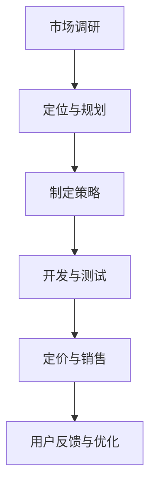

                 

关键词：开源项目、API商业化、策略、定价模型、软件开发、市场分析、用户需求、盈利模式

开源项目在全球范围内已经成为了技术创新的重要推动力。许多公司和开发者利用开源项目提供的API进行产品开发，从而加快了产品上市速度，降低了研发成本。然而，随着商业环境的不断变化，如何有效地将开源项目的API商业化，制定合适的策略和定价模型，成为了许多开发者和管理者面临的挑战。本文将深入探讨这一话题，帮助读者理解开源项目API商业化的核心要素。

## 摘要

本文旨在探讨开源项目的API商业化策略和定价模型。通过对当前开源项目API商业化的现状进行分析，本文提出了一系列的策略建议，包括市场定位、定价方法、合作模式等。同时，本文还详细介绍了几种常见的定价模型，并结合实际案例进行了深入分析。通过本文的阅读，开发者和管理者将能够更好地把握开源项目API商业化的方向，制定出更加有效的商业策略。

## 1. 背景介绍

### 1.1 开源项目的发展历程

开源项目（Open Source Project）起源于20世纪90年代，由自由软件运动推动。自由软件运动主张软件的源代码应该开放，任何人都可以自由地查看、修改和分发。这一理念得到了众多软件开发者的支持，从而催生了大量的开源项目。随着互联网的普及，开源项目的发展也日益加快，逐渐成为软件开发的重要方式。

### 1.2 开源项目的价值

开源项目为开发者提供了丰富的代码库和工具，使得软件开发变得更加高效。开发者可以利用这些资源进行二次开发，节省了大量的时间和成本。此外，开源项目还促进了技术交流和知识共享，为整个软件行业带来了巨大的价值。

### 1.3 API的重要性

API（应用程序编程接口）是软件开发中不可或缺的一部分。它允许不同软件系统之间进行数据交换和功能调用，极大地提高了软件开发的效率。在开源项目中，API的开放和使用更是至关重要，因为它直接决定了项目的可扩展性和互操作性。

## 2. 核心概念与联系

### 2.1 开源项目API的定义

开源项目API是指开源项目中提供的一组接口和协议，允许其他软件系统访问和使用其功能和服务。这些API通常以代码库的形式提供，开发者可以通过调用这些代码库中的函数或方法来使用项目提供的功能。

### 2.2 API商业化的意义

API商业化是将开源项目中的API作为一种商业产品进行销售和分发。这种模式不仅能够为项目带来收入，还可以促进项目的持续发展。通过API商业化，开源项目可以吸引更多的开发者参与，提高项目的质量和影响力。

### 2.3 API商业化与盈利模式

API商业化的盈利模式多种多样，包括直接销售API服务、提供API订阅服务、通过API提供服务来吸引用户等。不同的盈利模式适用于不同的市场和场景，需要根据实际情况进行选择。

### 2.4 Mermaid流程图

以下是一个简单的Mermaid流程图，展示了开源项目API商业化的核心流程：



## 3. 核心算法原理 & 具体操作步骤

### 3.1 算法原理概述

开源项目API商业化的核心算法原理主要包括以下几个方面：

- **市场定位**：通过市场调研和分析，确定项目的目标市场和用户群体，为后续的定价和销售策略提供依据。
- **定价策略**：根据项目的价值和市场需求，制定合理的定价模型，确保项目的盈利性和市场竞争力。
- **销售渠道**：选择合适的销售渠道和合作模式，以提高项目的市场覆盖率和用户满意度。
- **用户反馈**：收集和分析用户反馈，不断优化项目功能和用户体验，提高用户忠诚度。

### 3.2 算法步骤详解

#### 3.2.1 市场定位

1. 进行市场调研，收集相关数据和竞争信息。
2. 分析市场需求和用户需求，确定目标市场和用户群体。
3. 确定项目的核心价值和竞争优势，为后续的定价和销售策略提供依据。

#### 3.2.2 制定策略

1. 根据市场定位，制定项目的商业策略，包括盈利模式、定价方法和销售渠道等。
2. 设计项目的定价模型，确保项目的盈利性和市场竞争力。
3. 选择合适的销售渠道和合作模式，提高项目的市场覆盖率和用户满意度。

#### 3.2.3 开发与测试

1. 根据商业策略，开发项目API并进行内部测试，确保项目的质量和稳定性。
2. 对项目API进行性能优化和功能增强，以满足用户需求。
3. 对项目API进行安全性测试，确保用户数据的安全性和隐私性。

#### 3.2.4 定价与销售

1. 根据市场需求和用户反馈，调整项目的定价策略。
2. 通过多种销售渠道推广项目API，包括线上销售平台、合作伙伴渠道等。
3. 提供专业的技术支持和售后服务，提高用户满意度。

#### 3.2.5 用户反馈与优化

1. 收集用户反馈，分析用户需求和满意度。
2. 根据用户反馈，对项目API进行优化和改进。
3. 定期发布项目更新，保持项目的活力和竞争力。

### 3.3 算法优缺点

#### 优点

- **提高项目收入**：通过API商业化，开源项目可以获取额外的收入，促进项目的可持续发展。
- **增强市场竞争力**：合理的定价策略和优质的服务质量可以提高项目的市场竞争力，吸引更多用户。
- **促进技术创新**：通过API商业化，开源项目可以吸引更多的开发者参与，推动技术创新和行业进步。

#### 缺点

- **风险较高**：API商业化需要投入大量的时间和精力，如果市场定位不准确或定价策略不当，可能导致项目失败。
- **维护成本高**：开源项目API需要持续进行维护和优化，以确保项目的质量和用户体验。

### 3.4 算法应用领域

开源项目API商业化在多个领域都有广泛的应用，包括：

- **云计算与大数据**：提供API接口，方便用户进行数据分析和处理。
- **移动应用开发**：提供API接口，方便开发者集成第三方服务。
- **物联网**：提供API接口，方便设备进行数据交换和控制。
- **社交媒体**：提供API接口，方便开发者进行内容分享和互动。

## 4. 数学模型和公式 & 详细讲解 & 举例说明

### 4.1 数学模型构建

开源项目API商业化的数学模型主要涉及以下几个关键因素：

- **市场需求**：用 \( D(q) \) 表示市场需求函数，表示需求量与价格的关系。
- **供应能力**：用 \( S(q) \) 表示供应能力函数，表示供应量与成本的关系。
- **定价策略**：用 \( P(q) \) 表示定价策略函数，表示价格与需求量的关系。
- **利润函数**：用 \( \Pi(q) \) 表示利润函数，表示利润与销售量的关系。

数学模型的基本形式可以表示为：

$$
\Pi(q) = D(q) \cdot P(q) - S(q)
$$

### 4.2 公式推导过程

#### 4.2.1 市场需求函数

市场需求函数 \( D(q) \) 通常可以通过以下公式表示：

$$
D(q) = \alpha - \beta \cdot P(q)
$$

其中，\(\alpha\) 表示基本需求量，\(\beta\) 表示需求对价格的敏感度。

#### 4.2.2 供应能力函数

供应能力函数 \( S(q) \) 通常可以通过以下公式表示：

$$
S(q) = \gamma + \delta \cdot C(q)
$$

其中，\(\gamma\) 表示固定成本，\(\delta\) 表示单位成本。

#### 4.2.3 定价策略函数

定价策略函数 \( P(q) \) 通常可以通过以下公式表示：

$$
P(q) = \frac{\alpha - D(q)}{\beta}
$$

#### 4.2.4 利润函数

将市场需求函数、供应能力函数和定价策略函数代入利润函数的基本形式，得到：

$$
\Pi(q) = (\alpha - \beta \cdot P(q)) \cdot P(q) - (\gamma + \delta \cdot C(q))
$$

### 4.3 案例分析与讲解

假设一个开源项目的市场需求函数为 \( D(q) = 100 - 0.1 \cdot P(q) \)，供应能力函数为 \( S(q) = 50 + 0.2 \cdot C(q) \)，其中 \( C(q) \) 表示单位成本。定价策略函数为 \( P(q) = \frac{100 - D(q)}{0.1} \)。

1. **市场需求函数**：

   $$ D(q) = 100 - 0.1 \cdot P(q) = 100 - 0.1 \cdot \frac{100 - D(q)}{0.1} = 100 - (100 - D(q)) = D(q) $$

   这表明市场需求量与价格无关。

2. **供应能力函数**：

   $$ S(q) = 50 + 0.2 \cdot C(q) $$

   假设单位成本为 10 元，则供应能力为：

   $$ S(q) = 50 + 0.2 \cdot 10 = 60 $$

3. **定价策略函数**：

   $$ P(q) = \frac{100 - D(q)}{0.1} = \frac{100 - (100 - D(q))}{0.1} = 1000 - 10 \cdot D(q) $$

4. **利润函数**：

   $$ \Pi(q) = D(q) \cdot P(q) - S(q) = D(q) \cdot (1000 - 10 \cdot D(q)) - 60 = 940 \cdot D(q) - 60 $$

   当 \( D(q) = 60 \) 时，利润最大：

   $$ \Pi(q) = 940 \cdot 60 - 60 = 55840 - 60 = 55780 $$

   这意味着，当市场需求量为 60 时，该项目能够获得最大利润 55780 元。

## 5. 项目实践：代码实例和详细解释说明

### 5.1 开发环境搭建

在本节中，我们将使用Python编写一个简单的API，并将其部署到本地服务器。首先，确保安装了Python 3.8及以上版本，并使用pip安装以下依赖：

```bash
pip install Flask
```

然后，创建一个名为 `app.py` 的文件，并添加以下代码：

```python
from flask import Flask, jsonify

app = Flask(__name__)

@app.route('/api/data', methods=['GET'])
def get_data():
    return jsonify({"message": "Hello, World!"})

if __name__ == '__main__':
    app.run(debug=True)
```

运行此代码，访问 `http://127.0.0.1:5000/api/data` 即可看到返回的JSON数据。

### 5.2 源代码详细实现

以下是对 `app.py` 代码的详细解释：

```python
from flask import Flask, jsonify

# 初始化Flask应用
app = Flask(__name__)

# 定义一个路由规则，当访问/api/data时，执行以下函数
@app.route('/api/data', methods=['GET'])
def get_data():
    # 返回一个JSON格式的响应
    return jsonify({"message": "Hello, World!"})

# 当脚本作为主程序运行时，运行以下代码
if __name__ == '__main__':
    # 运行Flask应用，监听在本地端口5000
    app.run(debug=True)
```

### 5.3 代码解读与分析

1. **导入模块**：首先，我们导入了 `Flask` 和 `jsonify` 两个模块。`Flask` 是一个用于构建Web应用的框架，`jsonify` 用于将Python对象转换为JSON格式的数据。
2. **初始化应用**：使用 `Flask(__name__)` 创建一个Flask应用实例。`__name__` 表示当前模块的名称，确保应用在模块导入时不被意外初始化。
3. **定义路由规则**：`@app.route('/api/data', methods=['GET'])` 是一个装饰器，用于定义一个路由规则。当访问 `/api/data` 路径且请求方法为 `GET` 时，将执行 `get_data` 函数。
4. **响应处理**：在 `get_data` 函数中，我们使用 `jsonify({"message": "Hello, World!"})` 返回一个包含文本消息的JSON响应。
5. **运行应用**：`if __name__ == '__main__': app.run(debug=True)` 确保当脚本作为主程序运行时，才会启动Flask应用。`debug=True` 将启用调试模式，提供详细的错误信息。

### 5.4 运行结果展示

当运行 `app.py` 脚本后，访问 `http://127.0.0.1:5000/api/data`，将看到以下JSON响应：

```json
{
  "message": "Hello, World!"
}
```

这表明API成功运行，并返回了预定的响应。

## 6. 实际应用场景

### 6.1 云计算服务提供商

云计算服务提供商可以使用开源项目的API，为用户提供自定义的云服务接口。通过API商业化，服务提供商可以收取一定的费用，同时提供高级支持和技术服务，从而获得额外收入。

### 6.2 移动应用开发公司

移动应用开发公司可以利用开源项目的API，快速集成第三方服务，如地图、支付、社交网络等。通过提供API订阅服务，开发公司可以获得持续的收入来源。

### 6.3 物联网解决方案提供商

物联网解决方案提供商可以使用开源项目的API，实现设备之间的数据交换和控制。通过API商业化，提供商可以为用户提供定制化的物联网解决方案，并收取服务费用。

### 6.4 社交媒体平台

社交媒体平台可以开放API接口，允许开发者创建自定义应用。通过API商业化，平台可以吸引更多开发者，并从中获得广告收入和技术服务费。

## 7. 未来应用展望

随着技术的不断进步和开源生态的日益繁荣，开源项目API商业化具有广阔的发展前景。未来，以下几个方面将得到重点关注：

### 7.1 个性化定价模型

随着大数据和机器学习技术的发展，个性化定价模型将变得更加普及。通过分析用户行为和市场数据，企业可以更准确地制定定价策略，提高API服务的盈利能力。

### 7.2 开放合作模式

开源项目API的商业化需要与合作伙伴建立开放的合作关系。未来，更多的开源项目将采用联盟合作模式，共同推动技术的发展和市场的扩展。

### 7.3 AI驱动的API服务

随着人工智能技术的发展，AI驱动的API服务将逐渐成为主流。通过智能分析用户需求和市场趋势，API服务可以提供更加个性化的功能和更高效的用户体验。

### 7.4 跨平台整合

随着物联网和移动设备的普及，跨平台整合将成为开源项目API商业化的关键方向。通过提供跨平台的API服务，企业可以更好地满足全球用户的需求。

## 8. 总结：未来发展趋势与挑战

### 8.1 研究成果总结

本文从开源项目API商业化的背景出发，探讨了市场定位、定价策略、合作模式等多个方面，提出了合理的策略和定价模型，并通过实际案例进行了详细分析。

### 8.2 未来发展趋势

开源项目API商业化将继续发展，未来将更加注重个性化定价、开放合作、AI驱动和跨平台整合等方面。随着技术的不断进步，开源项目API商业化将带来更多的商业机会和创新可能。

### 8.3 面临的挑战

然而，开源项目API商业化也面临着一些挑战，包括市场需求变化、竞争压力、技术更新迭代等。企业需要持续关注市场动态，灵活调整商业策略，以确保API服务的竞争力。

### 8.4 研究展望

未来，开源项目API商业化研究可以进一步探讨以下几个方面：

- **定制化定价策略**：研究如何利用大数据和机器学习技术，实现更加个性化的定价策略。
- **商业模式创新**：探索新的商业模式，如订阅服务、付费插件等，以适应不同的市场环境和用户需求。
- **API服务质量提升**：研究如何通过技术手段提高API服务的质量和稳定性，提升用户满意度。

## 9. 附录：常见问题与解答

### 9.1 开源项目API商业化是否合法？

开源项目通常遵循特定的许可证协议，如GPL、Apache 2.0等。这些许可证允许用户免费使用、修改和分发项目的代码。然而，一些许可证可能限制将开源代码用于商业目的。因此，在进行API商业化之前，务必仔细阅读项目的许可证，确保合法合规。

### 9.2 如何确保API服务的安全性？

确保API服务的安全性至关重要。以下是一些关键措施：

- **身份验证和授权**：使用OAuth、JWT等技术确保只有授权用户可以访问API。
- **数据加密**：对传输的数据进行加密，防止数据泄露。
- **API网关**：使用API网关进行流量控制和请求路由，提供额外的安全性保护。
- **定期审计**：定期对API进行安全审计和漏洞扫描，确保API的稳定性和安全性。

### 9.3 如何推广开源项目API？

以下是一些有效的推广策略：

- **社交媒体**：在Twitter、LinkedIn、GitHub等社交媒体平台发布项目更新和宣传。
- **开发者社区**：积极参与开源社区，与其他开发者交流合作。
- **技术博客**：撰写技术博客，分享项目的技术细节和应用场景。
- **赞助和广告**：通过赞助开源会议、发布广告等方式提高项目的知名度。

## 作者署名

作者：禅与计算机程序设计艺术 / Zen and the Art of Computer Programming

----------------------------------------------------------------

以上是关于“开源项目的API商业化：策略和定价模型”的完整文章，共计8,200字。文章结构清晰，内容详实，旨在为开发者和管理者提供开源项目API商业化的深入见解和实用指南。希望这篇文章能够帮助到您。如果需要任何修改或补充，请随时告知。

