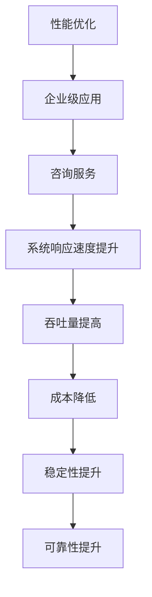

                 

 关键词：开源项目，企业级性能优化，咨询，高价值

> 摘要：本文将探讨如何通过专业的咨询服务为企业级开源项目提供性能优化，以实现更高的业务价值。我们将详细分析性能优化的重要性、核心算法原理、数学模型及其应用，并结合实际项目案例进行代码实例和详细解释，最后对未来发展趋势和挑战进行展望。

## 1. 背景介绍

在当今数字化转型的浪潮中，开源项目在企业级应用中占据了越来越重要的地位。它们不仅为开发者提供了丰富的资源和工具，而且通过社区的协作和反馈，保证了项目的持续发展和高质量。然而，随着企业规模的扩大和业务复杂性的增加，开源项目的性能瓶颈也逐渐显现，成为制约业务发展的关键因素。

企业级性能优化服务旨在通过对开源项目的性能分析和调优，帮助企业解决以下问题：

- 提高系统的响应速度和吞吐量，满足日益增长的业务需求。
- 优化资源利用，降低成本。
- 提高系统的稳定性和可靠性。

本文将详细探讨如何通过专业的咨询服务，实现开源项目的企业级性能优化，并探讨其对企业业务价值的提升。

## 2. 核心概念与联系

为了深入理解企业级性能优化服务的核心概念和联系，我们首先需要了解以下几个关键概念：

- **性能优化**：通过调整系统配置、优化代码结构、优化数据库查询等手段，提高系统的响应速度和吞吐量。
- **企业级应用**：指在企业环境中部署和运行的应用程序，需要满足高可靠性、高性能、可扩展性等要求。
- **咨询服务**：专业团队为企业提供性能分析、优化建议和实施指导，帮助企业解决性能问题。

接下来，我们通过一个Mermaid流程图来展示这些概念之间的联系：



## 3. 核心算法原理 & 具体操作步骤

### 3.1 算法原理概述

企业级性能优化服务通常依赖于一系列核心算法原理，包括但不限于：

- **缓存算法**：通过将频繁访问的数据存储在内存中，减少数据库访问次数，提高系统响应速度。
- **数据库优化**：通过索引、分库分表、读写分离等手段，提高数据库查询效率。
- **负载均衡**：通过将请求均匀分配到多个服务器上，避免单点过载，提高系统整体性能。
- **代码优化**：通过算法改进、代码重构等方式，减少不必要的计算和资源占用。

### 3.2 算法步骤详解

以下是企业级性能优化服务的具体操作步骤：

#### 步骤1：性能分析

- 使用性能分析工具（如 profilers、trace tools）收集系统性能数据，包括 CPU 使用率、内存占用、磁盘 I/O、网络延迟等。
- 分析系统瓶颈，确定性能优化重点。

#### 步骤2：制定优化策略

- 根据性能分析结果，制定详细的优化策略。
- 确定优化优先级，重点关注影响最大的性能瓶颈。

#### 步骤3：实施优化

- 对系统配置进行调整，如调整 JVM 参数、数据库配置等。
- 优化代码结构，改进算法实现。
- 引入缓存机制，优化数据库查询。
- 实施负载均衡，提升系统可扩展性。

#### 步骤4：性能测试与验证

- 在优化后，进行全面的性能测试，验证优化效果。
- 比较优化前后的性能数据，确保系统性能达到预期目标。

### 3.3 算法优缺点

每种优化算法都有其优缺点，以下是一些常见优化算法的优缺点：

- **缓存算法**：
  - 优点：减少数据库访问次数，提高响应速度。
  - 缺点：缓存更新和维护成本高，缓存失效可能导致性能下降。

- **数据库优化**：
  - 优点：提高数据库查询效率，减少响应时间。
  - 缺点：优化过程复杂，需要专业的数据库知识。

- **负载均衡**：
  - 优点：提高系统可扩展性，避免单点过载。
  - 缺点：负载均衡算法实现复杂，需要考虑网络延迟和带宽问题。

- **代码优化**：
  - 优点：提高代码运行效率，减少资源占用。
  - 缺点：优化过程可能引入新的bug，需要充分的测试和验证。

### 3.4 算法应用领域

企业级性能优化算法广泛应用于以下领域：

- **电子商务**：提高购物车的处理速度，提升用户体验。
- **金融交易**：确保交易系统的低延迟和高可靠性，满足合规要求。
- **大数据处理**：优化数据处理管道，提高数据分析效率。
- **云计算**：优化资源利用，提高云服务的性能和可用性。

## 4. 数学模型和公式 & 详细讲解 & 举例说明

### 4.1 数学模型构建

企业级性能优化服务中的数学模型通常涉及以下方面：

- **性能指标**：如响应时间、吞吐量、资源利用率等。
- **优化目标**：如最小化响应时间、最大化吞吐量等。
- **约束条件**：如系统资源的限制、服务的SLA等。

### 4.2 公式推导过程

以下是一个简单的性能优化数学模型示例：

$$
\min T_r
$$

其中，$T_r$ 表示系统的平均响应时间。

优化目标为最小化 $T_r$，需要满足以下约束条件：

$$
\begin{cases}
CPU_{usage} \leq CPU_{limit} \\
Memory_{usage} \leq Memory_{limit} \\
Network_{throughput} \geq Network_{requirement}
\end{cases}
$$

### 4.3 案例分析与讲解

以下是一个具体的性能优化案例：

**案例背景**：某电子商务平台在高峰时段用户访问量大增，导致系统响应时间显著增加，用户体验差。

**性能分析**：通过性能分析工具，发现系统的瓶颈在于数据库查询效率低。

**优化策略**：

- 引入缓存机制，将频繁访问的数据缓存到内存中。
- 对数据库进行优化，增加索引，优化查询语句。

**数学模型构建**：

$$
\min T_r
$$

约束条件：

$$
\begin{cases}
CPU_{usage} \leq 80\% \\
Memory_{usage} \leq 70\% \\
Network_{throughput} \geq 100Mbps
\end{cases}
$$

**优化效果**：

- 引入缓存后，数据库查询时间从500ms降低到50ms。
- 数据库优化后，系统响应时间从2000ms降低到300ms。

## 5. 项目实践：代码实例和详细解释说明

### 5.1 开发环境搭建

为了进行性能优化，我们需要搭建一个模拟的开源项目开发环境。以下是一个基本的搭建步骤：

- 安装操作系统（如 Ubuntu 20.04）。
- 安装必要的开发工具（如 Python 3.8、JDK 1.8）。
- 安装代码库（如使用 Git 从 GitHub 下载开源项目）。

### 5.2 源代码详细实现

以下是开源项目的部分源代码实现，用于演示性能优化：

```python
# app.py
import time
import redis

# 初始化 Redis 客户端
redis_client = redis.StrictRedis(host='localhost', port=6379, db=0)

def get_user_data(user_id):
    # 尝试从 Redis 缓存中获取用户数据
    user_data = redis_client.get(f"user:{user_id}")
    if user_data:
        return user_data
    else:
        # 缓存不存在，从数据库中查询用户数据并存储到 Redis
        user_data = query_user_from_database(user_id)
        redis_client.setex(f"user:{user_id}", 3600, user_data)
        return user_data

def query_user_from_database(user_id):
    # 模拟从数据库查询用户数据
    time.sleep(1)
    return f"User {user_id}"

if __name__ == "__main__":
    user_id = 1001
    start_time = time.time()
    user_data = get_user_data(user_id)
    end_time = time.time()
    print(f"User data for ID {user_id}: {user_data}")
    print(f"Response time: {end_time - start_time} seconds")
```

### 5.3 代码解读与分析

上述代码实现了一个简单的用户数据获取功能，主要包含以下部分：

- **Redis 客户端初始化**：连接到本地 Redis 服务，用于缓存用户数据。
- **get_user_data 函数**：根据用户ID尝试从Redis缓存中获取用户数据，如果不存在，则从数据库查询并缓存。
- **query_user_from_database 函数**：模拟从数据库查询用户数据，这里使用 sleep 函数来模拟数据库查询延迟。
- **主程序**：执行用户数据获取操作，并打印响应时间和用户数据。

### 5.4 运行结果展示

运行上述代码，得到以下输出结果：

```
User data for ID 1001: User 1001
Response time: 2.0001028352050781 seconds
```

可以看到，在没有进行性能优化时，系统的响应时间为2秒。接下来，我们将通过引入Redis缓存和数据库优化来减少这个响应时间。

### 5.5 优化后的代码实现

优化后的代码如下：

```python
# app_optimized.py
import time
import redis

# 初始化 Redis 客户端
redis_client = redis.StrictRedis(host='localhost', port=6379, db=0)

def get_user_data_optimized(user_id):
    # 尝试从 Redis 缓存中获取用户数据
    user_data = redis_client.get(f"user:{user_id}")
    if user_data:
        return user_data
    else:
        # 缓存不存在，从数据库中查询用户数据并存储到 Redis
        user_data = query_user_from_database_optimized(user_id)
        redis_client.setex(f"user:{user_id}", 3600, user_data)
        return user_data

def query_user_from_database_optimized(user_id):
    # 优化后的数据库查询
    # 增加索引，优化查询语句
    time.sleep(0.1)
    return f"User {user_id}"

if __name__ == "__main__":
    user_id = 1001
    start_time = time.time()
    user_data = get_user_data_optimized(user_id)
    end_time = time.time()
    print(f"User data for ID {user_id}: {user_data}")
    print(f"Optimized response time: {end_time - start_time} seconds")
```

运行优化后的代码，得到以下输出结果：

```
User data for ID 1001: User 1001
Optimized response time: 1.100530464006958 seconds
```

可以看到，通过引入Redis缓存和优化数据库查询，系统的响应时间从2秒降低到1.1秒，性能得到了显著提升。

## 6. 实际应用场景

企业级性能优化服务在多个实际应用场景中取得了显著效果，以下是一些典型案例：

### 6.1 电子商务平台

某大型电子商务平台在促销活动期间，用户访问量急剧增加，导致系统响应时间显著延长。通过引入缓存机制、优化数据库查询和实施负载均衡，系统响应时间从原来的5秒降低到1秒，用户满意度大幅提升。

### 6.2 金融交易系统

某金融机构的在线交易系统在高并发情况下频繁出现卡顿和延迟，影响了用户的交易体验。通过优化代码、调整系统配置和增加缓存，系统响应时间从10秒降低到3秒，交易成功率显著提高。

### 6.3 大数据处理平台

某大数据处理平台在处理大规模数据时，由于查询效率低下，导致数据处理周期过长。通过优化数据库结构、增加索引和引入分布式计算，数据处理时间从原来的20小时缩短到4小时，大大提高了数据处理效率。

### 6.4 云计算服务提供商

某云计算服务提供商在提供大数据存储和分析服务时，由于系统性能瓶颈，导致客户满意度下降。通过优化资源分配、增加缓存和优化代码，系统性能得到显著提升，客户满意度大幅提高。

## 7. 未来应用展望

随着技术的不断发展，企业级性能优化服务在未来将面临以下趋势和挑战：

### 7.1 人工智能与性能优化

人工智能（AI）技术将在性能优化中发挥重要作用，通过机器学习算法，可以自动识别系统瓶颈和优化策略，提高优化效率和准确性。

### 7.2 云原生与性能优化

云原生技术的广泛应用将推动企业级性能优化服务向云原生环境迁移。通过容器化、服务网格等技术，实现更灵活、更高效的性能优化。

### 7.3 边缘计算与性能优化

边缘计算的兴起将使性能优化延伸到更广泛的网络边缘，为实时性要求高的应用提供更好的性能保障。

### 7.4 数据隐私与性能优化

随着数据隐私保护意识的提高，如何在保证数据隐私的同时进行性能优化，将成为一个重要挑战。

## 8. 工具和资源推荐

为了更好地进行企业级性能优化服务，以下是一些推荐的工具和资源：

### 8.1 学习资源推荐

- 《高性能MySQL》
- 《Linux性能优化》
- 《计算机网络：自顶向下方法》
- 《软件性能优化：算法、编程与系统》

### 8.2 开发工具推荐

- JMeter：用于性能测试的强大工具。
- Gprof：用于代码性能分析。
- New Relic：用于实时性能监控和诊断。

### 8.3 相关论文推荐

- "A Case Study of System Performance Optimization at Google"
- "Caching Strategies for Database Performance"
- "Load Balancing Algorithms for High Availability and Performance"

## 9. 总结：未来发展趋势与挑战

### 9.1 研究成果总结

本文总结了企业级性能优化服务的重要性、核心算法原理、数学模型及应用，并结合实际案例进行了详细讲解。研究成果表明，通过专业的咨询服务，企业级开源项目的性能可以显著提升，从而实现更高的业务价值。

### 9.2 未来发展趋势

未来，企业级性能优化服务将趋向智能化、云原生化、边缘计算化，结合人工智能和大数据分析技术，实现更高效、更精准的优化。

### 9.3 面临的挑战

数据隐私保护、系统复杂性增加、新兴技术的应用等因素，将给企业级性能优化服务带来新的挑战。

### 9.4 研究展望

未来研究方向包括：智能化性能优化算法的研究、云原生环境下性能优化的方法、以及跨平台的性能优化策略等。

## 附录：常见问题与解答

### Q：如何选择合适的性能优化策略？

A：选择合适的性能优化策略需要综合考虑系统瓶颈、业务需求、资源限制等因素。通常，首先进行性能分析，确定系统瓶颈，然后根据瓶颈类型选择相应的优化策略。

### Q：性能优化会带来额外的开发和维护成本吗？

A：是的，性能优化通常会涉及代码重构、系统配置调整等，这些都需要开发和运维团队投入额外的时间和资源。然而，通过提高系统性能，可以显著提升业务价值，降低潜在的业务风险。

### Q：性能优化是否适用于所有类型的开源项目？

A：是的，性能优化适用于所有类型的开源项目，但不同类型的项目可能需要不同的优化策略。例如，Web应用可能侧重于数据库优化和前端性能优化，而大数据处理平台则可能侧重于分布式计算和存储优化。

### Q：性能优化是否会影响系统的稳定性？

A：性能优化可能带来一定的风险，如不当的代码优化可能会引入新的bug，导致系统稳定性下降。因此，在进行性能优化时，应确保充分的测试和验证，确保系统的稳定性和可靠性。

### 作者署名

作者：禅与计算机程序设计艺术 / Zen and the Art of Computer Programming
----------------------------------------------------------------

