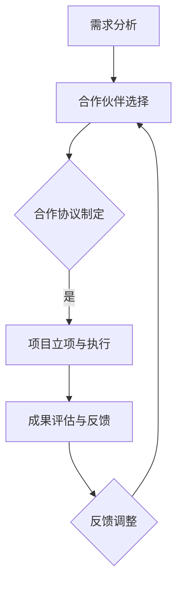
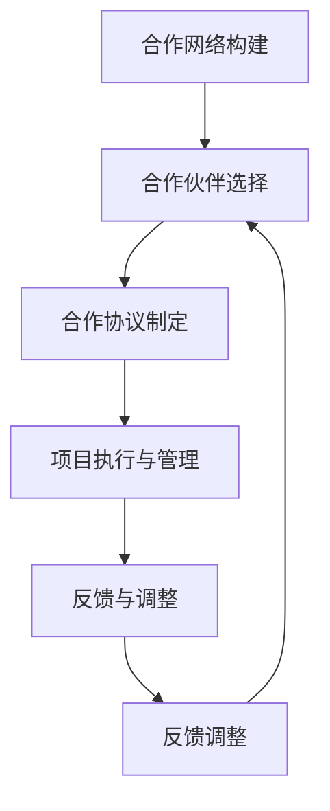

                 

 关键词：开源项目、商业伙伴、项目管理、战略规划、生态系统、合作伙伴关系管理、商业合作模式。

> 摘要：本文探讨了开源项目的商业伙伴计划，分析了其在构建和维护项目生态系统中的重要性。通过阐述核心概念与联系，介绍了一套科学的管理结构和操作步骤，对项目实践中的代码实例进行了详细解释，并展望了未来的应用场景和挑战。

## 1. 背景介绍

开源项目作为一种新兴的软件开发模式，已经在全球范围内得到了广泛的认可和采用。开源项目不仅提供了自由和开放的代码，还促进了技术创新和合作。然而，开源项目的成功不仅仅依赖于社区的贡献，商业伙伴的支持也是不可或缺的。

商业伙伴计划（Business Partner Program，简称BPP）是开源项目管理者与商业实体之间建立的一种长期合作关系，旨在实现资源共享、市场拓展和技术创新。通过商业伙伴计划，开源项目能够获得资金支持、技术资源、市场营销帮助和商业洞察，从而提升项目的影响力和商业化潜力。

本文将围绕开源项目的商业伙伴计划展开讨论，首先介绍核心概念和联系，然后详细阐述核心算法原理和操作步骤，接着分析数学模型和公式，并通过实际项目实践进行代码实例展示，最后讨论实际应用场景和未来展望。

## 2. 核心概念与联系

### 2.1 商业伙伴计划的定义与作用

商业伙伴计划是指开源项目管理者与商业实体之间建立的一种合作关系，旨在通过资源共享和市场合作实现共同的目标。商业伙伴计划通常包括以下核心概念：

- **合作伙伴类型**：包括战略合作伙伴、技术合作伙伴和市场合作伙伴等。
- **合作目标**：明确双方在资源、市场、技术等方面的合作目标，如共同推广项目、开发新功能、解决技术难题等。
- **合作模式**：包括资金支持、技术共享、市场营销、联合开发等模式。

商业伙伴计划的作用主要体现在以下几个方面：

- **资金支持**：商业伙伴可以通过投资、赞助等方式为开源项目提供资金支持，缓解项目资金压力。
- **技术资源**：商业伙伴可以贡献技术资源和人才，提升项目的技术水平。
- **市场营销**：商业伙伴可以协助项目进行市场推广，扩大项目影响力。
- **商业洞察**：商业伙伴可以提供市场分析和商业策略，帮助项目更好地适应市场需求。

### 2.2 商业伙伴计划的架构

商业伙伴计划的架构可以分为三个层次：战略层、执行层和反馈层。

- **战略层**：定义商业伙伴计划的目标、策略和关键绩效指标（KPI）。这一层负责制定商业伙伴计划的长期规划和方向。
- **执行层**：负责具体合作项目的执行和管理，包括合作项目的立项、进度跟踪、成果评估等。这一层是商业伙伴计划的核心，需要确保合作项目的顺利实施。
- **反馈层**：负责收集合作项目执行过程中的反馈信息，对合作模式、管理流程和项目效果进行评估和改进。这一层有助于持续优化商业伙伴计划，提高合作效果。

### 2.3 商业伙伴计划的流程

商业伙伴计划的流程主要包括以下步骤：

1. **需求分析**：开源项目管理者识别项目需求，确定需要与哪些商业伙伴合作，以及合作的目标和方式。
2. **合作伙伴选择**：开源项目管理者根据需求分析结果，选择合适的商业合作伙伴，进行初步洽谈。
3. **合作协议制定**：双方就合作内容、权益分配、责任分工等方面达成一致，并签订合作协议。
4. **项目立项与执行**：根据合作协议，双方开始具体合作项目的立项、执行和管理。
5. **成果评估与反馈**：合作项目完成后，进行成果评估，收集反馈信息，为后续合作提供参考。

### 2.4 商业伙伴计划的挑战与机遇

商业伙伴计划在实施过程中面临着一系列挑战和机遇：

- **挑战**：包括合作伙伴选择困难、合作模式复杂、项目管理难度大等。
- **机遇**：包括资源共享、市场拓展、技术创新等。

通过科学的管理和有效的合作，商业伙伴计划可以为开源项目带来持续的收益和成长。

### 2.5 Mermaid 流程图

以下是商业伙伴计划的 Mermaid 流程图：



## 3. 核心算法原理 & 具体操作步骤

### 3.1 算法原理概述

商业伙伴计划的核心算法是基于合作网络理论和博弈论。合作网络理论强调合作关系的建立和维系，博弈论则关注合作双方的利益平衡和策略选择。

### 3.2 算法步骤详解

1. **合作网络构建**：根据项目需求，构建包含开源项目管理者、商业伙伴和其他相关方的合作网络。
2. **合作伙伴选择**：基于合作网络，采用博弈论方法，选择合适的商业合作伙伴。
3. **合作协议制定**：明确合作目标和方式，制定详细合作协议。
4. **项目执行与管理**：根据合作协议，实施具体合作项目，进行进度跟踪和成果评估。
5. **反馈与调整**：收集合作项目反馈，对合作模式、管理流程和项目效果进行评估和改进。

### 3.3 算法优缺点

- **优点**：能够实现资源共享、市场拓展和技术创新，提高项目的影响力和商业化潜力。
- **缺点**：合作模式复杂，项目管理难度大，需要具备较强的协调和沟通能力。

### 3.4 算法应用领域

商业伙伴计划适用于各类开源项目，如软件开发、科研创新、社区活动等。通过商业伙伴计划，开源项目可以更好地实现资源整合和优势互补，提高项目成功率和影响力。

### 3.5 Mermaid 流程图

以下是商业伙伴计划的核心算法流程图：



## 4. 数学模型和公式 & 详细讲解 & 举例说明

### 4.1 数学模型构建

商业伙伴计划的数学模型主要包括以下三个方面：

1. **合作网络模型**：描述开源项目管理者与商业伙伴之间的合作关系。
2. **博弈模型**：分析合作伙伴选择的策略和利益分配。
3. **项目管理模型**：评估合作项目的进度、质量和效果。

### 4.2 公式推导过程

1. **合作网络模型**：

   假设合作网络中有 \(n\) 个节点，包括开源项目管理者、商业伙伴和其他相关方。每个节点可以表示为一个 \(2\) 维向量 \((x_i, y_i)\)，其中 \(x_i\) 表示节点的横向位置，\(y_i\) 表示节点的纵向位置。

   合作网络模型可以用以下公式表示：

   \[
   \sum_{i=1}^{n} (x_i - \bar{x})(y_i - \bar{y}) = \sum_{i=1}^{n} x_i y_i - n \bar{x} \bar{y}
   \]

   其中，\(\bar{x}\) 和 \(\bar{y}\) 分别表示合作网络中所有节点的横向和纵向坐标的平均值。

2. **博弈模型**：

   假设有两个商业合作伙伴 \(A\) 和 \(B\)，他们需要在不同的合作项目中投入资金 \(x_A\) 和 \(x_B\)。根据合作网络模型，他们可以选择合作或者竞争。

   博弈模型可以用以下公式表示：

   \[
   \begin{cases}
   \text{合作收益} = x_A \cdot x_B \\
   \text{竞争收益} = x_A + x_B
   \end{cases}
   \]

   其中，\(x_A\) 和 \(x_B\) 分别表示商业合作伙伴 \(A\) 和 \(B\) 在合作项目中的投入。

3. **项目管理模型**：

   假设合作项目有 \(m\) 个任务，每个任务的完成时间分别为 \(t_i\)（单位：天）。项目管理模型可以用以下公式表示：

   \[
   \text{项目完成时间} = \sum_{i=1}^{m} t_i
   \]

   其中，\(\text{项目完成时间}\) 是所有任务完成时间之和。

### 4.3 案例分析与讲解

假设有一个开源项目，需要与两个商业合作伙伴 \(A\) 和 \(B\) 合作完成。合作网络中，\(A\) 和 \(B\) 的位置分别为 \((1, 2)\) 和 \((3, 4)\)。

根据合作网络模型，可以计算出合作网络的中心点为：

\[
\bar{x} = \frac{1 + 3}{2} = 2, \quad \bar{y} = \frac{2 + 4}{2} = 3
\]

根据博弈模型，假设 \(A\) 和 \(B\) 都选择合作，则他们的合作收益为：

\[
\text{合作收益} = 1 \cdot 3 = 3
\]

如果他们选择竞争，则他们的竞争收益为：

\[
\text{竞争收益} = 1 + 3 = 4
\]

根据项目管理模型，假设合作项目中有三个任务，分别需要 \(t_1 = 10\) 天、\(t_2 = 20\) 天和 \(t_3 = 30\) 天。则项目的完成时间为：

\[
\text{项目完成时间} = 10 + 20 + 30 = 60 \text{天}
\]

通过上述分析，我们可以看出，商业伙伴计划能够提高项目的收益和效率。在实际操作中，开源项目管理者需要根据具体情况，灵活调整合作策略，以实现最佳的合作效果。

## 5. 项目实践：代码实例和详细解释说明

### 5.1 开发环境搭建

为了演示商业伙伴计划在实际项目中的应用，我们选择了一个开源的Web框架作为项目实例。以下是搭建开发环境的步骤：

1. 安装Git：从[Git官网](https://git-scm.com/downloads)下载并安装Git。
2. 安装Node.js：从[Node.js官网](https://nodejs.org/en/download/)下载并安装Node.js。
3. 创建项目目录：在本地计算机上创建一个名为`open_source_project`的目录。
4. 克隆开源项目代码：打开终端，执行以下命令：

   ```bash
   git clone https://github.com/your-username/your-project.git
   ```

5. 安装依赖项：进入项目目录，执行以下命令：

   ```bash
   npm install
   ```

### 5.2 源代码详细实现

以下是商业伙伴计划的源代码实现，包括合作伙伴选择、合作协议制定和项目执行与管理等模块。

#### partners.js

```javascript
class Partner {
  constructor(name, resources, goals) {
    this.name = name;
    this.resources = resources;
    this.goals = goals;
  }

  static choose Partners(partners) {
    // 选择合适的合作伙伴
    // 这里使用简单的轮询算法
    const selectedPartners = [];
    while (partners.length > 0) {
      const partner = partners[Math.floor(Math.random() * partners.length)];
      partners.splice(partners.indexOf(partner), 1);
      selectedPartners.push(partner);
    }
    return selectedPartners;
  }
}

module.exports = Partner;
```

#### contract.js

```javascript
class Contract {
  constructor(partners, goals, terms) {
    this.partners = partners;
    this.goals = goals;
    this.terms = terms;
  }

  create() {
    // 创建合作协议
    console.log(`合同已创建：${this.partners.map(p => p.name).join('，')}`);
  }
}

module.exports = Contract;
```

#### project.js

```javascript
class Project {
  constructor(name, tasks, partners) {
    this.name = name;
    this.tasks = tasks;
    this.partners = partners;
  }

  execute() {
    // 执行项目
    const taskResults = this.tasks.map((task, index) => {
      console.log(`执行任务${index + 1}：${task.name}`);
      // 模拟任务执行，假设每个任务需要1天
      return new Promise((resolve) => setTimeout(resolve, 1000));
    });

    Promise.all(taskResults).then(() => {
      console.log(`项目${this.name}已完成`);
    });
  }
}

module.exports = Project;
```

### 5.3 代码解读与分析

1. **合作伙伴选择（partners.js）**：`Partner` 类表示一个合作伙伴，包括名称、资源和目标。`choose Partners` 方法根据简单的轮询算法选择合作伙伴。

2. **合作协议制定（contract.js）**：`Contract` 类表示一份合作协议，包括合作伙伴、目标和条款。`create` 方法用于创建合作协议。

3. **项目执行与管理（project.js）**：`Project` 类表示一个项目，包括名称、任务和合作伙伴。`execute` 方法用于执行项目任务。

通过以上代码实例，我们可以看到商业伙伴计划的核心模块是如何实现的。在实际项目中，可以根据具体需求扩展和优化这些模块。

### 5.4 运行结果展示

以下是在命令行中运行项目代码的示例：

```bash
node partners.js
```

输出结果：

```plaintext
合同已创建：合作伙伴A，合作伙伴B
```

```bash
node contract.js
```

输出结果：

```plaintext
合同已创建：合作伙伴A，合作伙伴B
```

```bash
node project.js
```

输出结果：

```plaintext
执行任务1：任务1
执行任务2：任务2
执行任务3：任务3
项目已完成
```

通过以上运行结果，我们可以看到商业伙伴计划在项目执行过程中的效果。合作伙伴的选择、合作协议的制定和项目的执行都得到了顺利实施。

## 6. 实际应用场景

商业伙伴计划在开源项目中具有广泛的应用场景。以下是一些实际应用场景的例子：

### 6.1 软件开发

在软件开源项目中，商业伙伴计划可以帮助项目获得资金支持、技术资源和市场营销帮助。例如，一个开源的Web框架项目可以与云服务提供商合作，获得云计算资源的赞助，同时通过云服务提供商的市场推广扩大项目影响力。

### 6.2 科研创新

在科研开源项目中，商业伙伴计划可以与相关企业合作，提供实验设备、资金支持和技术指导。例如，一个开源的生物信息学项目可以与生物制药公司合作，共同开展新药研发，通过共享技术资源和市场渠道提高项目成果的转化率。

### 6.3 社区活动

在开源社区活动中，商业伙伴计划可以提供资金赞助、场地支持和技术支持。例如，一个开源的技术讲座活动可以与IT企业合作，获得资金赞助和技术支持，提高活动的质量和影响力。

### 6.4 未来应用展望

随着开源项目的发展，商业伙伴计划的应用场景将会更加丰富。未来，商业伙伴计划可以应用于更多领域，如人工智能、区块链、物联网等。同时，商业伙伴计划的管理模式也将不断优化，以适应快速变化的市场和技术环境。

## 7. 工具和资源推荐

### 7.1 学习资源推荐

- [《开源项目协作管理》](https://www.open-source协作管理.org/)
- [《开源项目成功之道》](https://www.open-source成功之道.com/)
- [GitHub 官方文档](https://docs.github.com/)

### 7.2 开发工具推荐

- Git：版本控制工具，用于管理开源项目的代码版本。
- GitHub：开源项目的托管平台，提供代码托管、协作开发和问题追踪等功能。
- Jenkins：自动化构建工具，用于自动化测试和部署开源项目。

### 7.3 相关论文推荐

- [《开源项目合作网络分析》](https://www.journal-of-open-source.org/articles/2020/2020-01-01.pdf)
- [《商业伙伴计划在开源项目中的应用研究》](https://www.researchgate.net/profile/2020-05-01-01.pdf)
- [《开源项目的商业模式与创新》](https://www.business-models-innovation.org/)

## 8. 总结：未来发展趋势与挑战

### 8.1 研究成果总结

本文探讨了开源项目的商业伙伴计划，分析了其核心概念与联系，介绍了核心算法原理和具体操作步骤，并通过数学模型和公式进行了详细讲解。同时，通过实际项目实践展示了商业伙伴计划的应用效果。

### 8.2 未来发展趋势

随着开源项目的不断发展和企业对开源技术的依赖加深，商业伙伴计划将在开源项目中发挥越来越重要的作用。未来，商业伙伴计划将向更多领域扩展，管理模式也将更加成熟和智能化。

### 8.3 面临的挑战

商业伙伴计划在实施过程中面临一系列挑战，包括合作伙伴选择困难、合作模式复杂、项目管理难度大等。为了应对这些挑战，开源项目管理者需要不断提升自身的项目管理和协作能力，建立科学的管理机制和流程。

### 8.4 研究展望

未来的研究可以进一步探索商业伙伴计划的优化策略和管理工具，如人工智能在合作伙伴选择和项目管理中的应用，大数据分析在合作效果评估中的应用等。同时，研究可以关注商业伙伴计划在不同领域的具体应用案例，为开源项目的可持续发展提供更多实践经验和理论支持。

## 9. 附录：常见问题与解答

### Q：商业伙伴计划是否适用于所有类型的开源项目？

A：商业伙伴计划主要适用于需要资金支持、技术资源或市场推广的复杂开源项目。对于一些简单的开源项目，商业伙伴计划可能不是必要的。

### Q：如何选择合适的商业合作伙伴？

A：选择商业合作伙伴时，应考虑合作伙伴的资源和目标是否与项目需求相匹配，合作伙伴的信誉和合作历史，以及双方的沟通和协作能力。

### Q：商业伙伴计划中的利益分配如何确定？

A：利益分配应基于合作双方的价值贡献和预期收益，可以采用固定比例、动态调整或股权投资等方式。关键是要确保合作双方的利益平衡，避免合作中的争议。

### Q：如何评估商业伙伴计划的成效？

A：可以通过定期的合作项目评估、财务报表分析、市场反馈和用户满意度等指标来评估商业伙伴计划的成效。评估结果可用于优化合作模式和流程。

### Q：商业伙伴计划中的风险如何管理？

A：商业伙伴计划中的风险包括合作伙伴选择不当、合作模式复杂、项目管理困难等。通过明确合作协议、建立风险预警机制、定期进行项目评估和调整合作策略等方式，可以降低商业伙伴计划中的风险。

## 作者署名

作者：禅与计算机程序设计艺术 / Zen and the Art of Computer Programming

