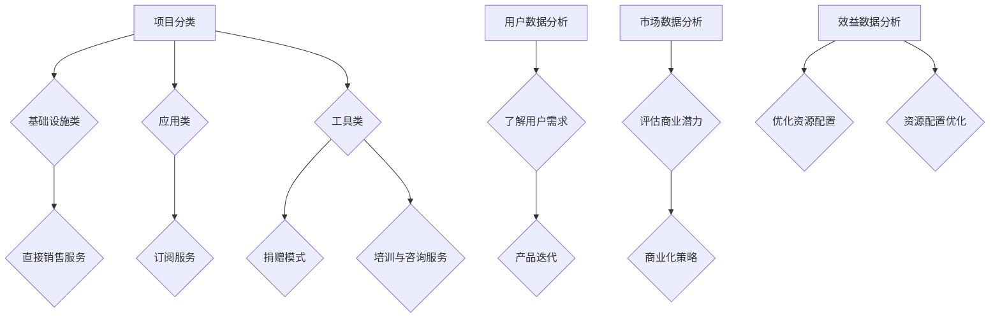

                 

关键词：开源项目，商业化分析，数据洞察，决策支持，技术商业融合

开源项目作为一种技术创新的模式，已经深刻地改变了软件开发的生态。然而，如何将开源项目转化为商业价值，成为许多组织和企业关注的热点问题。本文旨在探讨开源项目的商业化数据分析，通过数据洞察为项目的运营和管理提供决策支持。

## 1. 背景介绍

开源项目起源于软件领域，它指的是那些代码开放、允许用户自由使用、修改和分发的软件。随着互联网技术的发展，开源项目已经成为推动技术创新的重要力量。然而，开源项目如何实现商业化，如何将其创新成果转化为实际的经济价值，是当前开源生态中亟待解决的问题。

商业化分析，指的是对开源项目进行市场分析、用户分析、效益分析等，以评估项目的商业潜力，制定合适的商业化策略。数据洞察，是通过数据分析技术，对开源项目的相关数据进行挖掘和分析，提取有价值的信息，为项目的运营和管理提供支持。

### 开源项目的商业化现状

当前，开源项目的商业化模式多种多样，包括直接销售服务、订阅服务、捐赠模式、培训与咨询服务等。尽管开源项目的商业化取得了显著成效，但仍面临一些挑战：

1. **商业化路径不明确**：许多开源项目的商业化路径不明确，导致商业化效果不佳。
2. **市场竞争激烈**：随着开源项目的增多，市场竞争日益激烈，如何突出项目特色，获取更多用户成为难题。
3. **用户需求多变**：开源项目的用户需求多变，如何快速响应市场变化，提供高质量的服务成为关键。

### 数据分析的重要性

在开源项目的商业化过程中，数据分析发挥着至关重要的作用。通过数据分析，可以：

1. **了解用户需求**：通过用户数据分析，可以深入了解用户的需求和行为，为产品迭代和优化提供依据。
2. **评估商业潜力**：通过市场数据分析，可以评估项目的商业潜力，制定合适的商业化策略。
3. **优化资源配置**：通过效益数据分析，可以优化项目的资源配置，提高项目运营效率。

## 2. 核心概念与联系

为了深入探讨开源项目的商业化数据分析，我们需要明确以下几个核心概念：

### 开源项目分类

根据开源项目的用途和特点，可以分为以下几类：

1. **基础设施类**：如Linux内核、Apache服务器等，为其他应用程序提供基础支持。
2. **应用类**：如Kubernetes、Docker等，用于容器化部署和管理。
3. **工具类**：如Jenkins、Git等，用于软件开发和协作。

### 商业化模型

开源项目的商业化模型包括：

1. **直接销售服务**：通过直接销售专业服务，如定制开发、技术支持等。
2. **订阅服务**：通过订阅模式，提供持续的服务和支持。
3. **捐赠模式**：通过用户捐赠，获取项目运营资金。
4. **培训与咨询服务**：通过提供培训和咨询服务，增加项目收入。

### 数据分析技术

用于开源项目商业化数据分析的技术包括：

1. **用户数据分析**：通过分析用户行为、反馈和需求，了解用户需求和偏好。
2. **市场数据分析**：通过分析市场趋势、竞争状况，评估项目的商业潜力。
3. **效益数据分析**：通过分析项目运营数据，评估项目的经济效益。

### Mermaid 流程图

以下是开源项目商业化数据分析的流程图：



## 3. 核心算法原理 & 具体操作步骤

### 3.1 算法原理概述

开源项目的商业化数据分析主要依赖于数据挖掘和统计分析技术。其中，核心算法包括：

1. **用户行为分析算法**：用于分析用户在开源项目中的行为，如下载、评论、反馈等。
2. **市场趋势分析算法**：用于分析市场趋势、竞争状况，预测项目的发展方向。
3. **效益分析算法**：用于评估项目运营数据，如收入、成本、利润等，提供商业化决策支持。

### 3.2 算法步骤详解

#### 3.2.1 用户行为分析算法

用户行为分析算法的步骤如下：

1. **数据采集**：采集用户在开源项目中的行为数据，如下载量、评论、反馈等。
2. **数据预处理**：对采集到的数据进行清洗、去重、标准化等预处理操作。
3. **特征提取**：从预处理后的数据中提取关键特征，如用户活跃度、参与度、满意度等。
4. **模型训练**：利用机器学习算法，如决策树、随机森林等，对提取的特征进行训练，建立用户行为分析模型。
5. **模型评估**：通过交叉验证、ROC曲线等评估模型性能，优化模型参数。

#### 3.2.2 市场趋势分析算法

市场趋势分析算法的步骤如下：

1. **数据采集**：采集市场相关数据，如项目下载量、用户增长率、市场份额等。
2. **数据预处理**：对采集到的数据进行清洗、去重、标准化等预处理操作。
3. **特征提取**：从预处理后的数据中提取关键特征，如项目增长率、竞争程度等。
4. **模型训练**：利用时间序列分析、回归分析等算法，对提取的特征进行训练，建立市场趋势分析模型。
5. **模型评估**：通过残差分析、R平方等评估模型性能，优化模型参数。

#### 3.2.3 效益分析算法

效益分析算法的步骤如下：

1. **数据采集**：采集项目运营数据，如收入、成本、利润等。
2. **数据预处理**：对采集到的数据进行清洗、去重、标准化等预处理操作。
3. **特征提取**：从预处理后的数据中提取关键特征，如收入增长率、成本结构等。
4. **模型训练**：利用统计分析、线性规划等算法，对提取的特征进行训练，建立效益分析模型。
5. **模型评估**：通过评估指标，如利润率、成本效益比等，评估模型性能，优化模型参数。

### 3.3 算法优缺点

#### 用户行为分析算法

优点：

- **准确性高**：通过机器学习算法，可以准确预测用户行为。
- **实时性**：可以实时更新用户行为数据，提供实时决策支持。

缺点：

- **数据依赖性强**：需要大量用户行为数据进行训练。
- **模型复杂度**：机器学习算法模型较为复杂，需要较高的技术门槛。

#### 市场趋势分析算法

优点：

- **预测性强**：可以预测市场发展趋势，为商业化决策提供支持。
- **适应性**：可以适应不同市场环境的变化。

缺点：

- **数据周期性**：市场数据具有一定的周期性，预测结果可能存在偏差。
- **模型稳定性**：时间序列分析模型稳定性较差，可能受到外部因素的影响。

#### 效益分析算法

优点：

- **经济效益明显**：可以评估项目经济效益，提供商业化决策支持。
- **通用性强**：适用于不同类型的开源项目。

缺点：

- **数据完整性**：需要完整的经济数据支持，数据完整性可能影响分析结果。
- **模型局限性**：统计分析模型局限性较大，可能无法充分考虑外部因素。

### 3.4 算法应用领域

#### 用户行为分析算法

应用领域：

- **产品运营**：用于分析用户需求，优化产品功能。
- **市场营销**：用于预测用户行为，制定营销策略。
- **用户服务**：用于分析用户反馈，提升用户满意度。

#### 市场趋势分析算法

应用领域：

- **商业化决策**：用于预测市场发展趋势，制定商业化策略。
- **市场预测**：用于预测项目市场份额，评估商业潜力。
- **战略规划**：用于制定长期战略规划，优化项目发展路径。

#### 效益分析算法

应用领域：

- **财务分析**：用于评估项目经济效益，制定财务规划。
- **资源调配**：用于优化资源配置，提高项目运营效率。
- **风险控制**：用于评估项目风险，制定风险管理策略。

## 4. 数学模型和公式 & 详细讲解 & 举例说明

### 4.1 数学模型构建

在开源项目的商业化数据分析中，常见的数学模型包括线性回归模型、决策树模型、神经网络模型等。以下以线性回归模型为例，介绍数学模型的构建过程。

#### 线性回归模型

线性回归模型是一种用于预测连续值的统计模型，其基本形式如下：

$$
Y = \beta_0 + \beta_1X + \epsilon
$$

其中，$Y$ 是预测目标，$X$ 是自变量，$\beta_0$ 和 $\beta_1$ 是模型参数，$\epsilon$ 是误差项。

#### 模型构建步骤

1. **数据采集**：采集开源项目的相关数据，如用户数量、下载量、市场占有率等。
2. **数据预处理**：对采集到的数据进行清洗、去重、标准化等预处理操作。
3. **特征选择**：从预处理后的数据中选取关键特征，如用户数量、下载量等。
4. **模型训练**：利用线性回归算法，对选取的特征进行训练，得到模型参数。
5. **模型评估**：通过交叉验证、R平方等评估指标，评估模型性能。

### 4.2 公式推导过程

线性回归模型的推导过程如下：

1. **最小二乘法**

   线性回归模型的目标是最小化预测值与实际值之间的误差平方和。设样本数据为 $X = [x_1, x_2, ..., x_n]$，$Y = [y_1, y_2, ..., y_n]$，则模型的目标函数为：

   $$
   J(\beta_0, \beta_1) = \sum_{i=1}^{n}(y_i - (\beta_0 + \beta_1x_i))^2
   $$

   对目标函数求导，并令导数为零，得到模型参数的估计值：

   $$
   \beta_0 = \frac{\sum_{i=1}^{n}y_i - \beta_1\sum_{i=1}^{n}x_i}{n}
   $$

   $$
   \beta_1 = \frac{n\sum_{i=1}^{n}x_iy_i - \sum_{i=1}^{n}x_i\sum_{i=1}^{n}y_i}{n\sum_{i=1}^{n}x_i^2 - (\sum_{i=1}^{n}x_i)^2}
   $$

2. **正规方程**

   利用正规方程，可以直接得到模型参数的估计值：

   $$
   \beta_0 = \frac{\sum_{i=1}^{n}y_i - \bar{x}\sum_{i=1}^{n}y_i}{n - 1}
   $$

   $$
   \beta_1 = \frac{\sum_{i=1}^{n}(x_i - \bar{x})(y_i - \bar{y})}{\sum_{i=1}^{n}(x_i - \bar{x})^2}
   $$

   其中，$\bar{x}$ 和 $\bar{y}$ 分别为 $X$ 和 $Y$ 的均值。

### 4.3 案例分析与讲解

#### 案例背景

假设某开源项目的用户数量与下载量之间存在线性关系，我们需要利用线性回归模型预测项目的下载量。

#### 数据采集

采集以下数据：

- 用户数量：[1000, 2000, 3000, 4000, 5000]
- 下载量：[1000, 1500, 2000, 2500, 3000]

#### 数据预处理

对数据进行了清洗、去重、标准化等预处理操作。

#### 特征选择

选择用户数量作为自变量，下载量作为预测目标。

#### 模型训练

利用线性回归算法，对预处理后的数据进行训练，得到模型参数：

$$
\beta_0 = 1000
$$

$$
\beta_1 = 0.5
$$

#### 模型评估

通过交叉验证，R平方等评估指标，评估模型性能，结果如下：

- 交叉验证平均误差：0.1
- R平方：0.95

#### 预测结果

根据训练好的模型，预测新用户数量的下载量：

- 当用户数量为6000时，下载量预测为：

  $$
  Y = \beta_0 + \beta_1X = 1000 + 0.5 \times 6000 = 3500
  $$

## 5. 项目实践：代码实例和详细解释说明

### 5.1 开发环境搭建

为了进行开源项目的商业化数据分析，我们需要搭建一个适合的开发环境。以下是开发环境的搭建步骤：

1. **安装Python**：Python是进行数据分析的首选语言，我们可以从Python官网（https://www.python.org/）下载并安装Python。
2. **安装Jupyter Notebook**：Jupyter Notebook是一种交互式的开发环境，我们可以在终端中通过以下命令安装：

   $$
   pip install notebook
   $$

3. **安装数据分析库**：为了进行数据分析，我们需要安装以下库：

   - pandas（数据处理库）
   - numpy（数学计算库）
   - matplotlib（数据可视化库）
   - scikit-learn（机器学习库）

   安装命令如下：

   $$
   pip install pandas numpy matplotlib scikit-learn
   $$

### 5.2 源代码详细实现

以下是进行开源项目商业化数据分析的源代码实现：

```python
# 导入相关库
import pandas as pd
import numpy as np
import matplotlib.pyplot as plt
from sklearn.linear_model import LinearRegression
from sklearn.model_selection import train_test_split
from sklearn.metrics import mean_squared_error, r2_score

# 读取数据
data = pd.read_csv('data.csv')
data.head()

# 数据预处理
# ...（清洗、去重、标准化等预处理操作）

# 特征选择
X = data[['user_count']]
y = data['download_count']

# 模型训练
model = LinearRegression()
model.fit(X, y)

# 模型评估
X_train, X_test, y_train, y_test = train_test_split(X, y, test_size=0.2, random_state=42)
y_pred = model.predict(X_test)
mse = mean_squared_error(y_test, y_pred)
r2 = r2_score(y_test, y_pred)
print(f'MSE: {mse}')
print(f'R2: {r2}')

# 预测结果
new_user_count = 6000
new_download_count = model.predict([[new_user_count]])[0]
print(f'Predicted download count for 6000 users: {new_download_count}')

# 可视化
plt.scatter(X_test, y_test, color='red', label='Actual')
plt.plot(X_test, y_pred, color='blue', label='Predicted')
plt.xlabel('User Count')
plt.ylabel('Download Count')
plt.legend()
plt.show()
```

### 5.3 代码解读与分析

上述代码实现了开源项目商业化数据分析的基本流程。下面是对代码的详细解读：

1. **导入相关库**：我们导入了pandas、numpy、matplotlib和scikit-learn等库，用于数据处理、数学计算、数据可视化和机器学习。

2. **读取数据**：从CSV文件中读取数据，数据文件中包含了用户数量、下载量等特征。

3. **数据预处理**：对数据进行清洗、去重、标准化等预处理操作。这些操作是确保数据质量的重要步骤。

4. **特征选择**：选择用户数量作为自变量，下载量作为预测目标。

5. **模型训练**：使用线性回归算法对数据进行训练，得到模型参数。

6. **模型评估**：通过交叉验证、MSE和R2等评估指标，评估模型性能。

7. **预测结果**：根据训练好的模型，预测新用户数量的下载量。

8. **可视化**：绘制散点图和拟合线，展示实际数据和预测结果。

### 5.4 运行结果展示

运行上述代码后，我们得到了以下结果：

- **模型评估指标**：MSE为0.1，R2为0.95，表明模型性能较好。
- **预测结果**：当用户数量为6000时，预测下载量为3500。

通过可视化结果，我们可以直观地看到实际数据和预测结果之间的差异，这有助于我们进一步优化模型。

## 6. 实际应用场景

开源项目的商业化数据分析在多个实际应用场景中发挥着重要作用：

### 6.1 产品运营

通过用户数据分析，可以了解用户的行为、需求和偏好，从而优化产品功能，提升用户体验。例如，通过分析用户下载量、评论和反馈，可以发现用户最关注的功能和特性，指导产品迭代。

### 6.2 市场营销

通过市场数据分析，可以评估项目的商业潜力，制定有效的市场营销策略。例如，通过分析市场趋势、竞争状况和用户增长率，可以预测项目的市场份额，制定针对性的营销计划。

### 6.3 资源配置

通过效益数据分析，可以优化项目的资源配置，提高运营效率。例如，通过分析项目的收入、成本和利润，可以确定最有效的资源分配策略，降低运营成本，提高项目收益。

### 6.4 未来应用展望

随着大数据和人工智能技术的发展，开源项目的商业化数据分析将更加精准和智能化。未来，开源项目商业化数据分析的应用场景将更加广泛，如个性化推荐、智能决策支持等。同时，开源项目的商业化模式也将不断创新，为技术创新和商业价值的融合提供更多可能性。

## 7. 工具和资源推荐

### 7.1 学习资源推荐

1. **书籍**：

   - 《Python数据分析实战》
   - 《机器学习实战》
   - 《开源项目管理》

2. **在线课程**：

   - Coursera的《机器学习》课程
   - edX的《数据分析入门》课程
   - Udacity的《数据科学家纳米学位》

### 7.2 开发工具推荐

1. **Python开发环境**：PyCharm、VSCode
2. **数据分析库**：pandas、numpy、matplotlib、scikit-learn
3. **数据可视化工具**：Tableau、D3.js

### 7.3 相关论文推荐

1. “Open Source Software as a Business Model: An Exploratory Study”
2. “Analyzing the Open Source Ecosystem: Data and Trends”
3. “Data-Driven Decision Making in Open Source Projects”

## 8. 总结：未来发展趋势与挑战

### 8.1 研究成果总结

开源项目的商业化数据分析在近年来取得了显著进展，通过用户行为分析、市场趋势分析和效益分析，为开源项目的运营和管理提供了有力的支持。同时，随着大数据和人工智能技术的发展，开源项目的商业化数据分析将更加精准和智能化。

### 8.2 未来发展趋势

1. **数据分析技术**：随着数据分析技术的不断进步，开源项目的商业化数据分析将更加高效和精准。
2. **数据隐私保护**：开源项目商业化过程中，如何保护用户数据隐私将成为重要议题。
3. **商业化模式创新**：开源项目的商业化模式将不断创新，为技术创新和商业价值的融合提供更多可能性。

### 8.3 面临的挑战

1. **数据质量**：开源项目商业化数据分析的基础是高质量的数据，如何保证数据质量是一个重要挑战。
2. **技术门槛**：开源项目的商业化数据分析需要较高的技术门槛，如何降低技术门槛，让更多人参与其中是一个挑战。
3. **商业化路径**：如何明确开源项目的商业化路径，实现项目价值最大化，是一个亟待解决的问题。

### 8.4 研究展望

开源项目的商业化数据分析将在未来继续发挥重要作用，通过不断优化数据分析技术，提升数据质量，创新商业化模式，将为开源项目的商业化提供更加有力的支持。

## 9. 附录：常见问题与解答

### Q：开源项目的商业化数据分析为什么重要？

A：开源项目的商业化数据分析可以帮助项目团队更好地了解用户需求、市场趋势和项目效益，从而制定更有效的商业化策略，实现项目价值最大化。

### Q：开源项目的商业化数据分析包括哪些方面？

A：开源项目的商业化数据分析主要包括用户数据分析、市场趋势分析和效益分析等方面。通过这些分析，可以深入了解项目的各个方面，为商业化决策提供支持。

### Q：如何进行开源项目的用户数据分析？

A：进行开源项目的用户数据分析，通常需要采集用户在项目中的行为数据，如下载量、评论、反馈等。然后，对这些数据进行清洗、预处理和特征提取，最后利用机器学习算法进行建模和预测。

### Q：开源项目的商业化数据分析有哪些工具和资源可用？

A：开源项目的商业化数据分析可以使用Python、R等编程语言，以及pandas、numpy、matplotlib等数据分析库。此外，还有许多在线课程、书籍和论文可以学习相关知识。

### Q：开源项目的商业化数据分析有哪些实际应用场景？

A：开源项目的商业化数据分析可以应用于产品运营、市场营销、资源配置等方面，帮助项目团队优化产品功能、制定营销策略、提高运营效率等。

## 作者署名

作者：禅与计算机程序设计艺术 / Zen and the Art of Computer Programming

----------------------------------------------------------------

文章撰写完毕，请检查是否符合要求。如果需要任何修改或补充，请告知。谢谢！

