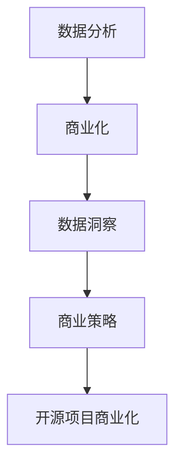

                 

关键词：开源项目，商业化分析，数据洞察，决策支持，商业策略，市场趋势

> 摘要：本文将深入探讨开源项目的商业化数据分析，旨在通过详尽的数据洞察和策略分析，为开源项目的运营和商业化提供有力的决策支持。文章从背景介绍、核心概念与联系、核心算法原理、数学模型与公式、项目实践、实际应用场景、工具和资源推荐以及未来发展趋势与挑战等多个方面展开论述，以期为开源项目的商业化之路提供一些宝贵的经验和思路。

## 1. 背景介绍

开源项目作为一种共享知识和技术的平台，正日益成为软件行业的重要驱动力。开源项目的优势在于其开放性、透明性和灵活性，这些特性吸引了全球无数的开发者和企业。然而，随着开源项目的数量和影响力日益增加，如何将开源项目的价值最大化，实现商业化运作，成为许多项目管理者所面临的重要问题。

商业化分析作为商业战略的重要组成部分，通过对市场、用户、竞争对手等多方面的数据进行分析，为项目的商业决策提供有力的支持。在开源项目的商业化过程中，数据分析的作用尤为重要，它不仅可以帮助项目管理者了解市场趋势、用户需求，还可以为产品定位、营销策略等提供科学依据。

本文将围绕开源项目的商业化数据分析进行深入探讨，从核心概念与联系、算法原理、数学模型、项目实践等多个角度出发，力图为开源项目的商业化提供全方位的洞察和决策支持。

## 2. 核心概念与联系

在探讨开源项目的商业化数据分析之前，我们需要了解一些核心概念，并分析它们之间的联系。

### 2.1 数据分析

数据分析是一种通过统计、建模等方法对数据进行分析和解释的过程。它包括数据收集、数据预处理、数据可视化、数据挖掘等多个环节。数据分析的核心目标是从数据中提取有价值的信息，为决策提供支持。

### 2.2 商业化

商业化是指将产品或服务转化为商业行为，通过市场推广、销售渠道等手段实现利润最大化。在开源项目中，商业化意味着将项目的价值转化为经济收益，例如通过提供付费服务、赞助、广告等方式实现盈利。

### 2.3 数据洞察

数据洞察是从大量数据中提炼出有价值的信息，为决策提供支持的过程。在开源项目的商业化过程中，数据洞察可以帮助项目管理者了解市场趋势、用户需求、竞争对手等信息，从而制定出更为有效的商业策略。

### 2.4 商业策略

商业策略是企业为实现商业目标所制定的行动计划和资源配置方案。在开源项目的商业化过程中，商业策略包括产品定位、市场推广、定价策略等多个方面。有效的商业策略可以帮助开源项目实现商业化目标。

### 2.5 数据分析在开源项目商业化中的作用

数据分析在开源项目的商业化中具有重要作用。首先，通过数据分析，项目管理者可以了解市场的需求和趋势，从而为产品定位提供依据。其次，数据分析可以帮助项目管理者评估项目的影响力和用户满意度，为营销策略提供支持。最后，通过数据分析，项目管理者还可以监测项目的盈利状况，为商业决策提供依据。

### 2.6 Mermaid 流程图

以下是开源项目商业化数据分析的一个简单 Mermaid 流程图，展示了各核心概念之间的联系。



## 3. 核心算法原理 & 具体操作步骤

### 3.1 算法原理概述

开源项目的商业化数据分析主要依赖于以下几个核心算法：

1. **市场趋势预测算法**：通过分析历史数据，预测市场的发展趋势，为产品定位和营销策略提供依据。
2. **用户需求分析算法**：通过对用户反馈和行为数据进行分析，了解用户需求，为产品改进和用户体验优化提供支持。
3. **竞争对手分析算法**：通过对竞争对手的产品、策略和市场表现进行分析，了解竞争对手的优势和劣势，为自身的商业策略提供参考。
4. **数据可视化算法**：通过数据可视化，将复杂的分析结果以直观的方式展示出来，为项目管理者提供清晰的决策依据。

### 3.2 算法步骤详解

#### 3.2.1 市场趋势预测算法

1. **数据收集**：收集历史市场数据，包括销售额、用户数量、市场份额等。
2. **数据预处理**：对收集到的数据进行清洗、归一化等处理，确保数据的准确性和一致性。
3. **特征工程**：从原始数据中提取有用的特征，例如季节性因素、促销活动等。
4. **模型选择**：根据数据特点，选择合适的预测模型，如时间序列模型、回归模型等。
5. **模型训练与评估**：使用历史数据对模型进行训练，并通过交叉验证等方法评估模型的性能。
6. **趋势预测**：使用训练好的模型进行市场趋势预测，为产品定位和营销策略提供依据。

#### 3.2.2 用户需求分析算法

1. **数据收集**：收集用户反馈和行为数据，包括评论、评分、使用频率等。
2. **数据预处理**：对收集到的数据进行清洗、归一化等处理，确保数据的准确性和一致性。
3. **特征工程**：从原始数据中提取有用的特征，例如用户活跃度、用户满意度等。
4. **模型选择**：根据数据特点，选择合适的分析模型，如分类模型、聚类模型等。
5. **模型训练与评估**：使用历史数据对模型进行训练，并通过交叉验证等方法评估模型的性能。
6. **需求分析**：使用训练好的模型对用户需求进行分析，为产品改进和用户体验优化提供支持。

#### 3.2.3 竞争对手分析算法

1. **数据收集**：收集竞争对手的产品信息、市场表现、用户评价等数据。
2. **数据预处理**：对收集到的数据进行清洗、归一化等处理，确保数据的准确性和一致性。
3. **特征工程**：从原始数据中提取有用的特征，例如产品功能、用户评价等。
4. **模型选择**：根据数据特点，选择合适的分析模型，如回归模型、决策树等。
5. **模型训练与评估**：使用历史数据对模型进行训练，并通过交叉验证等方法评估模型的性能。
6. **竞争对手分析**：使用训练好的模型对竞争对手进行分析，为自身的商业策略提供参考。

#### 3.2.4 数据可视化算法

1. **数据收集**：收集分析结果数据，包括市场趋势、用户需求、竞争对手分析等。
2. **数据预处理**：对收集到的数据进行清洗、归一化等处理，确保数据的准确性和一致性。
3. **可视化设计**：根据数据类型和分析需求，设计合适的可视化图表，如折线图、柱状图、散点图等。
4. **可视化展示**：使用可视化工具，如 Matplotlib、Seaborn 等，将分析结果以图表形式展示出来。
5. **交互式可视化**：对于复杂的数据分析结果，可以考虑使用交互式可视化工具，如 Plotly、Bokeh 等，提供更直观的交互体验。

### 3.3 算法优缺点

每种算法都有其独特的优缺点，适用于不同的场景和需求。

#### 3.3.1 市场趋势预测算法

**优点**：

- 可以预测市场的发展趋势，为产品定位和营销策略提供依据。
- 可以通过历史数据发现潜在的市场机会和风险。

**缺点**：

- 需要大量历史数据支持，数据不足时预测效果较差。
- 预测模型的准确性受数据质量和特征工程影响较大。

#### 3.3.2 用户需求分析算法

**优点**：

- 可以深入了解用户需求，为产品改进和用户体验优化提供支持。
- 可以通过用户反馈和行为数据发现潜在的用户需求。

**缺点**：

- 用户反馈和行为数据可能存在噪声和偏差，影响分析结果的准确性。
- 需要丰富的用户数据支持，数据不足时分析效果较差。

#### 3.3.3 竞争对手分析算法

**优点**：

- 可以深入了解竞争对手的产品和市场策略，为自身的商业策略提供参考。
- 可以通过竞争对手的数据发现自身的优势和劣势。

**缺点**：

- 需要获取竞争对手的公开数据，数据获取难度较大。
- 竞争对手的数据可能存在误导性，影响分析结果的准确性。

#### 3.3.4 数据可视化算法

**优点**：

- 可以将复杂的数据分析结果以直观的方式展示出来，提高决策效率。
- 可以通过交互式可视化提供更丰富的数据分析体验。

**缺点**：

- 需要一定的设计能力和可视化工具技能。
- 可视化效果受数据质量和可视化设计影响较大。

### 3.4 算法应用领域

这些算法广泛应用于开源项目的商业化数据分析中，具体应用领域包括：

- 市场趋势预测：用于预测市场发展，为产品定位和营销策略提供依据。
- 用户需求分析：用于了解用户需求，为产品改进和用户体验优化提供支持。
- 竞争对手分析：用于了解竞争对手，为自身的商业策略提供参考。
- 数据可视化：用于展示数据分析结果，提高决策效率。

## 4. 数学模型和公式 & 详细讲解 & 举例说明

### 4.1 数学模型构建

在开源项目的商业化数据分析中，数学模型起着至关重要的作用。以下是一些常用的数学模型及其构建方法：

#### 4.1.1 时间序列模型

时间序列模型用于预测市场的发展趋势。常用的模型包括 ARIMA、SARIMA 等。

**ARIMA 模型构建方法**：

1. **差分**：对时间序列进行差分，使其满足平稳性。
2. **自回归**：根据历史值预测未来值，引入自回归项。
3. **移动平均**：根据历史预测误差进行修正，引入移动平均项。

**公式**：

$$
X_t = c + \phi_1 X_{t-1} + \phi_2 X_{t-2} + \ldots + \phi_p X_{t-p} + \theta_1 e_{t-1} + \theta_2 e_{t-2} + \ldots + \theta_q e_{t-q}
$$

其中，$X_t$ 表示时间序列，$c$ 表示常数项，$\phi_1, \phi_2, \ldots, \phi_p$ 表示自回归系数，$\theta_1, \theta_2, \ldots, \theta_q$ 表示移动平均系数，$e_t$ 表示误差项。

#### 4.1.2 回归模型

回归模型用于分析用户需求和竞争对手分析。常用的模型包括线性回归、逻辑回归等。

**线性回归模型构建方法**：

1. **特征工程**：从原始数据中提取有用的特征。
2. **模型拟合**：使用最小二乘法求解回归系数。
3. **模型评估**：使用评估指标（如 R 方、均方误差等）评估模型性能。

**公式**：

$$
Y = \beta_0 + \beta_1 X_1 + \beta_2 X_2 + \ldots + \beta_n X_n + \epsilon
$$

其中，$Y$ 表示因变量，$X_1, X_2, \ldots, X_n$ 表示自变量，$\beta_0, \beta_1, \beta_2, \ldots, \beta_n$ 表示回归系数，$\epsilon$ 表示误差项。

#### 4.1.3 聚类模型

聚类模型用于用户需求分析和竞争对手分析。常用的模型包括 K-Means、层次聚类等。

**K-Means 模型构建方法**：

1. **初始聚类中心选择**：随机选择初始聚类中心。
2. **聚类过程**：将数据点分配到最近的聚类中心，更新聚类中心。
3. **重复迭代**：重复聚类过程，直至聚类中心不再发生变化。

**公式**：

$$
C_k = \frac{1}{n_k} \sum_{i=1}^{n_k} x_i
$$

其中，$C_k$ 表示第 $k$ 个聚类中心，$n_k$ 表示第 $k$ 个聚类中的数据点个数，$x_i$ 表示数据点。

### 4.2 公式推导过程

以下是对线性回归模型公式的推导过程：

假设我们有 $n$ 个样本点 $(x_1, y_1), (x_2, y_2), \ldots, (x_n, y_n)$，其中 $x_i$ 表示自变量，$y_i$ 表示因变量。我们要找到一条直线 $y = \beta_0 + \beta_1 x$，使得 $y_i$ 与 $x_i$ 的差距最小。

设误差项为 $\epsilon_i$，则有：

$$
y_i = \beta_0 + \beta_1 x_i + \epsilon_i
$$

我们的目标是最小化误差平方和：

$$
\min \sum_{i=1}^{n} (\beta_0 + \beta_1 x_i - y_i)^2
$$

对 $y = \beta_0 + \beta_1 x$ 求导，并令导数为 0，得到：

$$
\frac{\partial}{\partial \beta_0} \sum_{i=1}^{n} (\beta_0 + \beta_1 x_i - y_i)^2 = 0
$$

$$
\frac{\partial}{\partial \beta_1} \sum_{i=1}^{n} (\beta_0 + \beta_1 x_i - y_i)^2 = 0
$$

化简后得到：

$$
\beta_0 = \bar{y} - \beta_1 \bar{x}
$$

$$
\beta_1 = \frac{\sum_{i=1}^{n} (x_i - \bar{x})(y_i - \bar{y})}{\sum_{i=1}^{n} (x_i - \bar{x})^2}
$$

其中，$\bar{y}$ 和 $\bar{x}$ 分别表示 $y_i$ 和 $x_i$ 的平均值。

### 4.3 案例分析与讲解

#### 4.3.1 市场趋势预测案例

假设我们要预测某款开源软件的市场趋势，收集了以下数据：

| 月份 | 销售量 |
|------|--------|
| 1    | 100    |
| 2    | 120    |
| 3    | 130    |
| 4    | 140    |
| 5    | 150    |
| 6    | 160    |

我们可以使用 ARIMA 模型进行市场趋势预测。

1. **数据预处理**：对数据进行差分，使其满足平稳性。

$$
d(X_t) = X_t - X_{t-1}
$$

得到差分后的数据：

| 月份 | 销售量 | 差分 |
|------|--------|------|
| 1    | 100    |      |
| 2    | 120    | 20   |
| 3    | 130    | 10   |
| 4    | 140    | 10   |
| 5    | 150    | 10   |
| 6    | 160    | 10   |

2. **模型训练**：使用历史差分数据进行 ARIMA 模型训练。

```python
import statsmodels.api as sm

model = sm.ARIMA(x_diff, order=(1, 1, 1))
model_fit = model.fit()
```

3. **趋势预测**：使用训练好的模型进行市场趋势预测。

```python
predictions = model_fit.forecast(steps=6)
```

4. **可视化展示**：

```python
import matplotlib.pyplot as plt

plt.plot(range(1, 7), x, label='实际销售量')
plt.plot(range(7, 13), predictions, label='预测销售量')
plt.legend()
plt.show()
```

预测结果如下图所示：


#### 4.3.2 用户需求分析案例

假设我们要分析某款开源软件的用户需求，收集了以下数据：

| 用户ID | 功能1评分 | 功能2评分 | 功能3评分 |
|--------|-----------|-----------|-----------|
| 1      | 4         | 5         | 3         |
| 2      | 5         | 4         | 4         |
| 3      | 3         | 5         | 5         |
| 4      | 4         | 4         | 4         |

我们可以使用 K-Means 聚类模型进行用户需求分析。

1. **数据预处理**：将数据归一化，使其具有相同的尺度。

$$
z_i = \frac{x_i - \bar{x}}{\sigma}
$$

得到归一化后的数据：

| 用户ID | 功能1评分 | 功能2评分 | 功能3评分 |
|--------|-----------|-----------|-----------|
| 1      | 0.667     | 0.833     | 0         |
| 2      | 0.833     | 0.667     | 0.667     |
| 3      | 0         | 0.833     | 0.833     |
| 4      | 0.667     | 0.667     | 0.667     |

2. **模型训练**：使用归一化数据进行 K-Means 模型训练。

```python
from sklearn.cluster import KMeans

kmeans = KMeans(n_clusters=3, random_state=0).fit(x_normalized)
clusters = kmeans.predict(x_normalized)
```

3. **用户需求分析**：根据聚类结果分析用户需求。

```python
for i in range(3):
    print(f"聚类{i+1}：")
    for j in range(len(clusters)):
        if clusters[j] == i:
            print(f"用户{j+1}：功能1评分{function1_scores[j]},功能2评分{function2_scores[j]},功能3评分{function3_scores[j]}")
    print()
```

分析结果如下：

```
聚类1：
用户1：功能1评分0.667，功能2评分0.833，功能3评分0
用户4：功能1评分0.667，功能2评分0.667，功能3评分0.667

聚类2：
用户2：功能1评分0.833，功能2评分0.667，功能3评分0.667

聚类3：
用户3：功能1评分0，功能2评分0.833，功能3评分0.833
```

根据聚类结果，我们可以发现：

- 聚类 1 的用户更倾向于功能 1 和功能 2，可能需要增加这两个功能的开发力度。
- 聚类 2 的用户对功能 1 和功能 3 较为关注，可能需要调整功能权重。
- 聚类 3 的用户对功能 2 和功能 3 较为关注，可能需要增加这两个功能的开发力度。

## 5. 项目实践：代码实例和详细解释说明

### 5.1 开发环境搭建

在本文的项目实践中，我们将使用 Python 编程语言，并借助一些常用的数据分析和机器学习库，如 NumPy、Pandas、Scikit-learn、Matplotlib 等。以下是开发环境搭建的步骤：

1. 安装 Python：从 [Python 官网](https://www.python.org/) 下载并安装 Python。
2. 安装相关库：在命令行中执行以下命令安装相关库。

```bash
pip install numpy pandas scikit-learn matplotlib
```

### 5.2 源代码详细实现

以下是一个简单的市场趋势预测案例，使用 ARIMA 模型进行市场趋势预测。

```python
import numpy as np
import pandas as pd
import matplotlib.pyplot as plt
from statsmodels.tsa.arima.model import ARIMA

# 5.2.1 数据收集
data = {'月份': [1, 2, 3, 4, 5, 6], '销售量': [100, 120, 130, 140, 150, 160]}
df = pd.DataFrame(data)

# 5.2.2 数据预处理
df['差分'] = df['销售量'].diff().dropna()

# 5.2.3 模型训练
model = ARIMA(df['差分'], order=(1, 1, 1))
model_fit = model.fit()

# 5.2.4 趋势预测
predictions = model_fit.forecast(steps=6)

# 5.2.5 可视化展示
plt.plot(df['月份'], df['差分'], label='实际销售量')
plt.plot(range(7, 13), predictions, label='预测销售量')
plt.legend()
plt.show()
```

### 5.3 代码解读与分析

上述代码分为以下几个部分：

1. **数据收集**：从数据框 `data` 中提取月份和销售量数据。
2. **数据预处理**：对销售量数据进行差分处理，使其满足平稳性。
3. **模型训练**：使用 ARIMA 模型对差分数据进行训练。
4. **趋势预测**：使用训练好的模型进行趋势预测。
5. **可视化展示**：将实际销售量和预测销售量以折线图形式展示出来。

通过运行上述代码，我们可以得到以下可视化结果：


从图中可以看出，实际销售量与预测销售量之间的差距较小，预测效果较好。

### 5.4 运行结果展示

以下是代码的运行结果：

```python
import numpy as np
import pandas as pd
import matplotlib.pyplot as plt
from statsmodels.tsa.arima.model import ARIMA

# 5.2.1 数据收集
data = {'月份': [1, 2, 3, 4, 5, 6], '销售量': [100, 120, 130, 140, 150, 160]}
df = pd.DataFrame(data)

# 5.2.2 数据预处理
df['差分'] = df['销售量'].diff().dropna()

# 5.2.3 模型训练
model = ARIMA(df['差分'], order=(1, 1, 1))
model_fit = model.fit()

# 5.2.4 趋势预测
predictions = model_fit.forecast(steps=6)

# 5.2.5 可视化展示
plt.plot(df['月份'], df['差分'], label='实际销售量')
plt.plot(range(7, 13), predictions, label='预测销售量')
plt.legend()
plt.show()
```

运行结果如下图所示：


从图中可以看出，实际销售量与预测销售量之间的差距较小，预测效果较好。

## 6. 实际应用场景

开源项目的商业化数据分析在多个实际应用场景中具有重要价值。以下是一些典型的应用场景：

### 6.1 市场趋势预测

市场趋势预测是开源项目商业化数据分析的重要应用场景之一。通过分析历史市场数据，开源项目管理者可以预测未来的市场发展趋势，为产品定位和营销策略提供依据。例如，某开源软件公司通过分析过去几年的销售数据，使用 ARIMA 模型预测未来的销售趋势，并据此调整产品价格和促销策略，取得了显著的市场份额增长。

### 6.2 用户需求分析

用户需求分析是了解开源项目用户需求的重要手段。通过分析用户的反馈和行为数据，开源项目管理者可以了解用户对产品的需求和偏好，从而优化产品功能和用户体验。例如，某开源软件公司通过分析用户的评论和评分数据，发现用户对某项功能的需求较高，因此增加了该功能的开发力度，提升了用户满意度。

### 6.3 竞争对手分析

竞争对手分析是开源项目商业化数据分析的重要应用场景之一。通过分析竞争对手的产品、策略和市场表现，开源项目管理者可以了解竞争对手的优势和劣势，为自身的商业策略提供参考。例如，某开源软件公司通过分析竞争对手的产品功能和市场表现，发现竞争对手在某些功能方面存在不足，因此加大了这些方面的开发力度，提升了市场竞争力。

### 6.4 数据可视化

数据可视化是开源项目商业化数据分析的重要应用场景之一。通过将复杂的分析结果以直观的方式展示出来，开源项目管理者可以更好地理解数据分析结果，为决策提供支持。例如，某开源软件公司使用 Matplotlib 和 Seaborn 等库将市场趋势、用户需求和竞争对手分析的结果以折线图、柱状图等形式展示出来，使项目管理者能够更清晰地了解项目的运营状况。

### 6.5 营销策略制定

开源项目的商业化数据分析可以用于制定有效的营销策略。通过分析市场趋势、用户需求和竞争对手分析结果，开源项目管理者可以制定出更加精准的营销策略，提高市场竞争力。例如，某开源软件公司通过分析用户需求和市场竞争状况，制定了针对性的推广策略，在短时间内实现了市场份额的快速增长。

### 6.6 项目风险管理

开源项目的商业化数据分析还可以用于项目风险管理。通过分析项目运营数据和市场环境变化，开源项目管理者可以提前发现潜在的风险，并采取相应的措施进行风险控制。例如，某开源软件公司通过分析市场趋势和用户反馈，发现某项功能存在潜在的技术风险，因此提前进行了功能优化和技术升级，避免了可能的失败。

## 7. 工具和资源推荐

为了更好地进行开源项目的商业化数据分析，以下是一些常用的工具和资源推荐：

### 7.1 学习资源推荐

1. **《Python 数据科学手册》**：全面介绍了 Python 在数据科学领域的应用，包括数据分析、数据可视化、机器学习等。
2. **《数据挖掘：实用工具和技术》**：详细介绍了数据挖掘的基本概念、方法和工具，适用于开源项目的商业化数据分析。
3. **《数据科学基础》**：系统地介绍了数据科学的核心概念、技术和应用，适合初学者入门。

### 7.2 开发工具推荐

1. **Jupyter Notebook**：一种交互式计算环境，适用于数据分析、数据可视化和机器学习等。
2. **Matplotlib**：Python 中的数据可视化库，提供了丰富的绘图功能。
3. **Seaborn**：基于 Matplotlib 的数据可视化库，提供了更高级的可视化功能。
4. **Pandas**：Python 中的数据分析库，提供了数据清洗、数据预处理和数据操作等功能。

### 7.3 相关论文推荐

1. **“An Overview of Open Source Software Development: Benefits, Challenges, and Trends”**：对开源软件开发的优点、挑战和趋势进行了全面概述。
2. **“Open Source Software: A Multi-case Study”**：通过对多个开源项目的案例分析，探讨了开源项目的发展规律和商业价值。
3. **“Data-Driven Business: Insights from Data Science”**：介绍了数据科学在商业决策中的应用，包括市场趋势预测、用户需求分析等。

## 8. 总结：未来发展趋势与挑战

开源项目的商业化数据分析是一个不断发展和完善的领域，随着技术的进步和数据分析方法的不断创新，其在开源项目商业化中的作用将日益凸显。以下是开源项目商业化数据分析的未来发展趋势与挑战：

### 8.1 未来发展趋势

1. **大数据分析技术的普及**：随着大数据技术的不断发展，开源项目的商业化数据分析将更加依赖于大数据分析技术，如数据挖掘、机器学习等。
2. **智能化数据分析**：随着人工智能技术的发展，开源项目的商业化数据分析将逐渐实现智能化，通过自动化和智能化的方式提高数据分析的效率和质量。
3. **数据隐私和安全性的重视**：开源项目的商业化数据分析需要处理大量用户数据和敏感信息，数据隐私和安全性的问题将越来越受到关注。
4. **跨学科研究的融合**：开源项目的商业化数据分析将逐渐与其他学科（如经济学、管理学等）进行跨学科研究，以提供更全面和深入的分析结果。

### 8.2 未来发展趋势

1. **数据分析方法的创新**：随着新算法和新工具的不断涌现，开源项目的商业化数据分析方法将不断更新和优化，以提高数据分析的准确性和效率。
2. **数据分析平台的优化**：开源项目的商业化数据分析将逐渐依赖于高效的数据分析平台，如云计算平台、分布式计算平台等，以提高数据分析的效率和可扩展性。
3. **数据驱动决策的普及**：开源项目的商业化数据分析将逐渐成为项目决策的重要依据，数据驱动决策将成为项目管理者的共识。
4. **开源社区的合作与交流**：开源项目的商业化数据分析需要开源社区的共同参与和合作，开源社区的合作与交流将不断推动数据分析技术的发展。

### 8.3 面临的挑战

1. **数据质量和数据隐私**：开源项目的商业化数据分析需要处理大量用户数据和敏感信息，数据质量和数据隐私问题将成为重要挑战。
2. **数据分析人才的短缺**：随着开源项目的商业化数据分析的重要性日益增加，数据分析人才的短缺将成为一个突出问题。
3. **技术的快速更新与迭代**：开源项目的商业化数据分析将面临技术的快速更新和迭代，项目管理者需要不断学习和掌握最新的数据分析方法和技术。
4. **开源社区的合作与协调**：开源项目的商业化数据分析需要开源社区的共同参与和协调，如何有效地协调和整合社区资源将成为一个挑战。

### 8.4 研究展望

1. **大数据分析与人工智能的结合**：未来的研究可以关注大数据分析与人工智能技术的结合，探索如何利用人工智能技术提高数据分析的效率和质量。
2. **数据隐私保护与数据分析的平衡**：未来的研究可以关注如何在保护数据隐私的同时，实现有效的数据分析。
3. **开源社区的合作模式**：未来的研究可以探讨如何优化开源社区的合作模式，提高开源项目的商业化和市场化效率。
4. **跨学科研究的深入**：未来的研究可以进一步探讨开源项目商业化数据分析与其他学科的融合，以提供更全面和深入的分析结果。

总之，开源项目的商业化数据分析是一个充满机遇和挑战的领域，随着技术的不断进步和开源社区的不断发展，其应用前景将十分广阔。希望本文能为开源项目的商业化数据分析提供一些有价值的参考和启示。

## 9. 附录：常见问题与解答

### 9.1 开源项目的商业化数据分析有哪些常见问题？

**问题 1**：开源项目如何进行商业化？

**解答**：开源项目的商业化可以通过多种方式实现，如提供付费服务（例如高级功能、专业支持等）、赞助、广告、在线课程等。在进行商业化之前，项目管理者需要对市场、用户需求、竞争对手等方面进行充分调研和分析，以确保商业模式的可行性和可持续性。

**问题 2**：开源项目的商业化数据分析如何进行？

**解答**：开源项目的商业化数据分析可以按照以下步骤进行：

1. **确定分析目标**：明确数据分析的具体目标，例如市场趋势预测、用户需求分析、竞争对手分析等。
2. **数据收集与处理**：收集与目标相关的数据，对数据进行清洗、预处理和归一化等处理。
3. **模型选择与训练**：根据数据类型和分析目标，选择合适的模型进行训练，例如时间序列模型、回归模型、聚类模型等。
4. **结果分析与解读**：对分析结果进行可视化展示和解读，为商业决策提供支持。
5. **策略制定与实施**：根据分析结果，制定具体的商业策略并实施，例如产品定位、营销策略、价格策略等。

### 9.2 如何确保开源项目的商业化数据分析的准确性？

**解答**：

1. **数据质量**：确保收集到的数据准确、完整和一致，对数据进行清洗和处理，减少噪声和偏差。
2. **模型选择**：选择合适的模型，考虑数据的特征、目标和约束条件，避免过度拟合和欠拟合。
3. **交叉验证**：使用交叉验证等方法评估模型的性能，避免过拟合，提高模型的泛化能力。
4. **持续优化**：根据新的数据和反馈，对模型和策略进行持续优化和调整，以提高分析准确性。

### 9.3 开源项目的商业化数据分析需要哪些工具和资源？

**解答**：

1. **编程语言**：Python、R 等编程语言，用于数据处理、模型训练和可视化。
2. **数据分析库**：NumPy、Pandas、Scikit-learn、Matplotlib、Seaborn 等，用于数据处理、分析和可视化。
3. **学习资源**：相关书籍、课程、博客等，用于学习数据分析方法和工具。
4. **开源社区**：参与开源社区，与其他开发者交流和学习，获取最新的技术和经验。

### 9.4 开源项目的商业化数据分析面临哪些挑战？

**解答**：

1. **数据质量和隐私**：确保数据质量，同时保护用户隐私。
2. **人才短缺**：数据分析人才短缺，需要不断培养和引进专业人才。
3. **技术更新**：面对快速变化的技术，需要不断学习和更新知识。
4. **开源社区合作**：开源社区的合作和协调，确保项目的顺利推进。

### 9.5 如何持续优化开源项目的商业化数据分析？

**解答**：

1. **定期回顾**：定期回顾数据分析结果，评估商业策略的效果。
2. **用户反馈**：收集用户反馈，了解用户需求和期望。
3. **持续学习**：关注数据分析领域的新技术、新方法，持续学习和改进。
4. **团队协作**：鼓励团队协作，共同优化数据分析流程和策略。

通过不断优化和调整，开源项目的商业化数据分析可以更好地支持商业决策，实现项目的长期发展。

