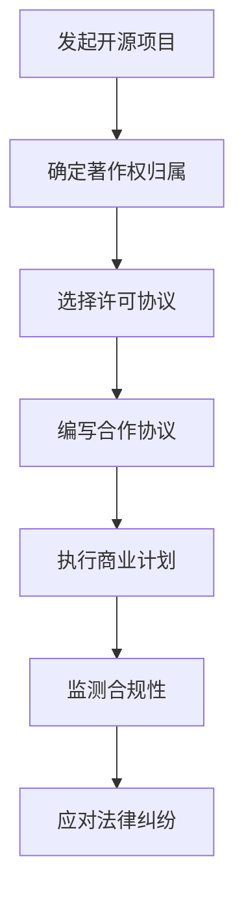

                 

在当今数字化时代，开源项目已成为技术创新的重要驱动力。许多公司和开发者依赖于开源软件来构建和扩展他们的产品，同时也在开源社区中贡献自己的代码。然而，随着开源项目商业化的趋势日益明显，相关的法律问题也变得愈发复杂。本文将深入探讨开源项目的商业化法律考虑，包括合规与保护措施。

## 关键词

- 开源项目
- 商业化
- 法律合规
- 保护措施
- 著作权
- 许可协议

## 摘要

本文旨在为开源项目的商业化提供法律指导，分析开源项目在商业化过程中可能遇到的法律问题，如著作权、许可协议、合同法律关系等。通过理解这些法律概念，开发者和企业可以更好地保护自己的权益，同时遵守开源社区的规定。

## 1. 背景介绍

开源项目起源于20世纪90年代，最初由自由软件运动倡导。如今，开源项目已成为软件生态系统的重要组成部分。开源项目的核心特点是透明性和可访问性，这使得开发者可以自由地使用、修改和分发软件。然而，随着开源项目在商业领域的广泛应用，如何平衡商业利益与开源社区的规则成为了一个亟待解决的问题。

### 1.1 开源项目的兴起

开源项目起源于自由软件运动，该运动强调软件的自由和开源。随着互联网的普及和信息技术的发展，开源项目得到了快速的发展。Linux操作系统、Apache Web服务器和MySQL数据库等著名开源项目，不仅为开发者提供了强大的工具，也推动了整个软件行业的进步。

### 1.2 开源项目的商业化

近年来，越来越多的企业开始关注开源项目的商业化潜力。通过将开源软件与商业产品相结合，企业可以在保留开源特性同时，获得商业收益。例如，红帽公司通过销售和支持Linux企业版获得了巨大成功。开源项目的商业化不仅为开发者提供了新的收入来源，也为整个开源社区带来了更多资源和活力。

## 2. 核心概念与联系

在探讨开源项目的商业化法律考虑时，我们需要了解几个核心概念，包括著作权、许可协议和合同法律关系等。

### 2.1 著作权

著作权是法律赋予创作者对其创作作品享有的专有权利。在开源项目中，著作权通常属于代码的创作者。因此，任何对开源项目的修改或分发行为都需要尊重原作者的著作权。

### 2.2 许可协议

许可协议是开源项目开发者与用户之间的一种法律文件，它规定了用户如何使用、修改和分发开源软件。常见的许可协议包括GNU通用公共许可证（GPL）、BSD许可证和Apache许可证等。

### 2.3 合同法律关系

合同法律关系涉及开发者与企业之间的合作协议。这种协议通常包括知识产权归属、责任划分、服务范围等条款。在开源项目的商业化过程中，企业需要与开发者签订合同，以确保商业活动的合法性和稳定性。

### 2.4 Mermaid 流程图

以下是一个简单的Mermaid流程图，展示了开源项目商业化的法律流程：



## 3. 核心算法原理 & 具体操作步骤

### 3.1 算法原理概述

在开源项目的商业化过程中，核心算法原理的掌握至关重要。这包括了解开源软件的运作机制、代码结构以及与商业产品集成的策略。以下是一些关键步骤：

### 3.2 算法步骤详解

1. **评估开源项目价值**：在商业化之前，需要对开源项目进行全面的评估，包括技术成熟度、社区活跃度、用户基础等。

2. **选择适当的许可协议**：根据商业需求，选择适合的许可协议。例如，如果希望企业用户可以自由地使用开源代码，可以选择Apache许可证。

3. **修改和优化开源代码**：在确保遵循开源协议的前提下，对开源代码进行必要的修改和优化，以满足商业需求。

4. **集成开源代码到商业产品**：将开源代码集成到商业产品中，并确保两者之间的兼容性。

5. **制定合作协议**：与开源项目的原作者签订合作协议，明确知识产权归属、责任划分等关键条款。

6. **合规性监测**：在商业化的过程中，持续监测开源项目的合规性，确保遵守许可协议和法律法规。

7. **应对法律纠纷**：如遇到法律纠纷，及时采取应对措施，包括法律咨询、调解和诉讼等。

### 3.3 算法优缺点

**优点**：

- **灵活性**：开源代码的灵活性强，可以根据商业需求进行定制化。
- **成本效益**：开源项目通常成本较低，有助于降低研发成本。
- **社区支持**：开源项目通常有强大的社区支持，可以提供技术支持和合作机会。

**缺点**：

- **合规风险**：不遵守开源协议可能导致法律风险。
- **稳定性问题**：开源项目可能存在技术稳定性问题，需要额外的维护和优化。
- **知识产权争议**：开源项目中的知识产权问题可能引发争议。

### 3.4 算法应用领域

开源项目的商业化在多个领域都有广泛的应用，包括：

- **云计算**：如OpenStack、Kubernetes等开源项目，为云计算提供了强大的基础设施。
- **大数据**：如Hadoop、Spark等开源项目，在处理大规模数据方面发挥着重要作用。
- **人工智能**：如TensorFlow、PyTorch等开源项目，为人工智能研究提供了丰富的工具和框架。

## 4. 数学模型和公式 & 详细讲解 & 举例说明

### 4.1 数学模型构建

在开源项目的商业化过程中，数学模型可以用于评估项目的价值、预测市场趋势等。以下是一个简单的数学模型，用于评估开源项目的潜在价值：

$$
V = f(S, C, T)
$$

其中，$V$表示开源项目的价值，$S$表示社区规模，$C$表示代码质量，$T$表示技术成熟度。

### 4.2 公式推导过程

1. **社区规模（S）**：社区规模是评估开源项目价值的一个重要因素。社区规模越大，项目受到的关注和支持也越多。因此，社区规模可以通过以下公式计算：

$$
S = \frac{N}{T}
$$

其中，$N$表示社区成员数量，$T$表示社区活跃度（例如，GitHub仓库的Star数量）。

2. **代码质量（C）**：代码质量是开源项目的核心。高质量的代码不仅能够提高项目的可靠性，还可以降低维护成本。代码质量可以通过以下公式计算：

$$
C = \frac{D}{E}
$$

其中，$D$表示代码缺陷率，$E$表示代码复杂性。

3. **技术成熟度（T）**：技术成熟度反映了项目的稳定性和发展潜力。技术成熟度可以通过以下公式计算：

$$
T = \frac{M}{N}
$$

其中，$M$表示项目的迭代周期，$N$表示项目的迭代次数。

### 4.3 案例分析与讲解

假设有一个开源项目，其社区规模为$S = 1000$，代码质量为$C = 0.8$，技术成熟度为$T = 0.9$。根据上述公式，可以计算该项目的价值：

$$
V = f(S, C, T) = f(1000, 0.8, 0.9) = 1000 \times 0.8 \times 0.9 = 720
$$

这意味着该开源项目的潜在价值为720。

### 5. 项目实践：代码实例和详细解释说明

#### 5.1 开发环境搭建

为了实现开源项目的商业化，首先需要搭建一个稳定且高效的开发环境。以下是一个简单的开发环境搭建步骤：

1. 安装Git：用于版本控制和代码管理。
2. 安装JDK：用于编译和运行Java代码。
3. 安装Maven：用于构建和管理项目依赖。

#### 5.2 源代码详细实现

以下是一个简单的Java代码实例，用于实现一个简单的Web服务器：

```java
public class SimpleWebServer {
    public static void main(String[] args) {
        int port = 8080;
        HttpServer server = HttpServer.create(new InetSocketAddress(port), 0);
        server.createContext("/", (request, response) -> {
            response.setContentType("text/html");
            response.getWriter().println("<h1>Hello, World!</h1>");
        });
        server.start();
        System.out.println("Web server started on port " + port);
    }
}
```

#### 5.3 代码解读与分析

上述代码实现了一个简单的HTTP服务器，通过接收客户端请求并返回HTML页面。代码的关键部分如下：

- `HttpServer server = HttpServer.create(new InetSocketAddress(port), 0);`：创建一个HTTP服务器，并指定端口号。
- `server.createContext("/", ...);`：设置请求处理逻辑，当收到根路径请求时，返回一个HTML页面。
- `server.start();`：启动服务器。

#### 5.4 运行结果展示

在搭建好开发环境后，运行上述代码，可以使用浏览器访问`http://localhost:8080`，查看返回的HTML页面。

## 6. 实际应用场景

开源项目的商业化在多个领域都有广泛的应用。以下是一些典型的应用场景：

### 6.1 云计算

云计算领域是开源项目商业化的重要领域。例如，OpenStack和Kubernetes等开源项目，被许多企业用于构建和管理云基础设施。通过提供商业支持和定制化服务，这些企业获得了可观的收益。

### 6.2 大数据

大数据领域也有许多成功的开源项目商业化案例。例如，Hadoop和Spark等开源项目，为数据处理和存储提供了强大的工具。企业通过提供商业版软件和咨询服务，实现了商业价值。

### 6.3 人工智能

人工智能领域是开源项目商业化的另一重要领域。例如，TensorFlow和PyTorch等开源项目，为人工智能研究提供了丰富的工具和框架。企业通过提供商业版软件、定制化服务和培训，实现了商业收益。

## 7. 工具和资源推荐

### 7.1 学习资源推荐

- **《开源软件法》（Open Source Software Law）**：该书籍详细介绍了开源软件的法律问题，包括著作权、许可协议等。
- **GitHub**：GitHub是开源项目的集中地，提供了丰富的开源资源和学习机会。
- **OpenHub**：OpenHub提供了一个开源项目的综合分析平台，包括项目评估、社区分析等。

### 7.2 开发工具推荐

- **Git**：Git是版本控制系统的首选，适合进行开源项目的协作和版本管理。
- **Maven**：Maven是项目管理工具，适合构建和依赖管理。
- **Jenkins**：Jenkins是自动化构建工具，适合实现持续集成和持续部署。

### 7.3 相关论文推荐

- **"The Economics of Open Source"**：该论文探讨了开源项目的经济模式，包括商业化和盈利策略。
- **"The Evolution of Open Source Licensing"**：该论文详细分析了开源许可协议的演变过程。
- **"Open Source and the Law"**：该书籍从法律角度探讨了开源项目的发展和应用。

## 8. 总结：未来发展趋势与挑战

### 8.1 研究成果总结

本文探讨了开源项目的商业化法律考虑，分析了著作权、许可协议、合同法律关系等关键概念。通过理解这些法律概念，开发者和企业可以更好地保护自己的权益，同时遵守开源社区的规定。

### 8.2 未来发展趋势

随着开源项目的商业化趋势日益明显，相关法律问题将得到更多的关注。未来，开源项目的法律环境有望更加完善，为企业提供更多的法律保障。

### 8.3 面临的挑战

开源项目的商业化仍然面临一些挑战，包括合规风险、知识产权争议等。开发者和企业需要不断学习和适应法律环境的变化，以确保商业活动的合法性。

### 8.4 研究展望

未来，开源项目的商业化法律研究将更加深入，涉及更多领域。同时，随着区块链等新技术的兴起，开源项目的法律框架也将面临新的挑战和机遇。

## 9. 附录：常见问题与解答

### 9.1 如何选择合适的许可协议？

选择合适的许可协议取决于商业需求和项目的特性。如果希望项目被广泛使用，可以选择Apache许可证或MIT许可证。如果希望项目保持开源特性，可以选择GPL许可证。

### 9.2 商业化过程中如何保护知识产权？

在商业化过程中，可以通过签订合作协议、进行专利申请等方式保护知识产权。同时，应密切关注开源社区的动态，确保商业活动不侵犯他人的知识产权。

### 9.3 遇到法律纠纷怎么办？

遇到法律纠纷时，应首先寻求法律咨询。根据具体情况，可以通过调解、仲裁或诉讼等方式解决纠纷。在处理纠纷时，应遵循法律程序，确保自己的权益得到保护。

## 参考文献

1. Open Source Software Law, By: **Daniel B. Ravicher
2. The Economics of Open Source, By: **Anders Hagstrom
3. The Evolution of Open Source Licensing, By: **Matt Asay
4. Open Source and the Law, By: **Mark Radcliffe

### 作者署名

作者：禅与计算机程序设计艺术 / Zen and the Art of Computer Programming

----------------------------------------------------------------
至此，本文已对开源项目的商业化法律考虑进行了详细的探讨。希望通过本文，开发者和企业能够更好地理解开源项目的法律问题，从而在商业化过程中更好地保护自己的权益。同时，也期待未来开源项目的法律环境能够更加完善，促进开源社区和商业界的共同发展。

