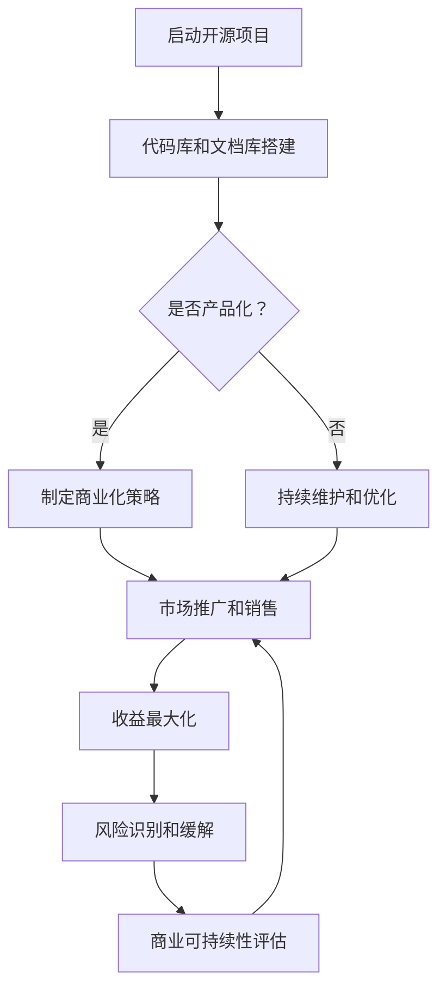

                 

关键词：开源项目，商业化风险，风险管理，策略，收益最大化，风险控制，商业可持续性，知识产权保护

> 摘要：随着开源生态的不断发展，越来越多的企业和开发者选择参与开源项目。然而，开源项目在商业化的过程中面临着诸多风险。本文旨在探讨开源项目的商业化风险，并提出相应的识别和缓解策略，以帮助企业和开发者实现开源项目的商业成功。

## 1. 背景介绍

开源项目作为一种协作式的软件开发模式，已经在全球范围内得到了广泛的认可和应用。开源项目具有透明、共享、合作等特性，能够吸引全球的开发者共同参与，从而提高软件的质量和可维护性。然而，随着开源项目商业化的推进，企业和开发者开始面临一系列风险。

开源项目的商业化风险主要包括以下几个方面：

1. **知识产权风险**：开源项目的代码和文档属于公共资源，开发者需要确保其使用的代码和贡献的代码不侵犯他人的知识产权。
2. **市场竞争风险**：开源项目可能会吸引竞争对手的注意，导致市场竞争加剧，影响项目的商业化进程。
3. **安全风险**：开源项目通常拥有广泛的贡献者，代码质量参差不齐，可能存在安全漏洞。
4. **技术风险**：开源项目的技术栈和架构可能随着时间的发展而变得过时，影响项目的长期稳定性。
5. **用户风险**：用户的需求和期望可能会随着时间的变化而变化，需要开发者不断调整和优化项目。

## 2. 核心概念与联系

### 2.1 商业化

商业化是指将开源项目转变为商业价值的过程。这通常涉及到以下几个关键步骤：

1. **产品化**：将开源项目转化为可直接销售的产品或服务。
2. **商业化策略**：制定有效的商业化策略，包括定价、市场推广、销售渠道等。
3. **知识产权保护**：确保开源项目的知识产权得到有效保护，避免商业纠纷。

### 2.2 风险管理

风险管理是指通过识别、评估、监控和应对风险，以最大程度减少潜在损失的过程。对于开源项目的商业化来说，风险管理至关重要。

1. **风险识别**：识别可能影响开源项目商业化的各种风险。
2. **风险评估**：评估每种风险的严重性和可能性。
3. **风险应对**：制定相应的策略来应对识别到的风险。

### 2.3 商业可持续性

商业可持续性是指企业在满足当前需求的同时，不损害未来满足需求的能力。对于开源项目来说，商业可持续性意味着项目能够在商业化的过程中持续发展，为企业和开发者带来长期的价值。

### 2.4 开源项目架构

开源项目的架构通常包括以下几个关键组成部分：

1. **代码库**：存储项目代码的地方，如GitHub、GitLab等。
2. **文档库**：存储项目文档的地方，如README、API文档等。
3. **社区**：包括项目的贡献者、用户和粉丝等。
4. **基础设施**：支持项目运行的服务器和工具，如CI/CD流水线、自动化测试等。

### 2.5 Mermaid 流程图

下面是一个关于开源项目商业化流程的Mermaid流程图：



## 3. 核心算法原理 & 具体操作步骤

### 3.1 算法原理概述

开源项目的商业化过程中，风险管理是一个核心环节。以下是一种基于风险矩阵的算法原理，用于识别和评估商业化的风险：

1. **风险矩阵**：使用一个二维矩阵来表示风险，其中行表示风险的严重性，列表示风险的可能性。
2. **风险评分**：根据每个风险的严重性和可能性，为每个风险分配一个评分。
3. **风险优先级**：根据风险评分，确定每个风险的优先级，以便优先应对。

### 3.2 算法步骤详解

1. **收集数据**：收集所有可能影响开源项目商业化的风险数据，包括知识产权、市场竞争、安全、技术、用户等方面。
2. **构建风险矩阵**：根据收集到的数据，构建一个二维的风险矩阵。
3. **计算风险评分**：使用以下公式计算每个风险的风险评分：
   
   $$风险评分 = 严重性评分 \times 可能性评分$$

4. **确定风险优先级**：根据计算出的风险评分，确定每个风险的优先级。

### 3.3 算法优缺点

**优点**：

1. **简单易懂**：算法步骤简单，易于理解和执行。
2. **全面性**：能够综合考虑多种风险因素。
3. **灵活性**：可以根据实际情况调整风险评分和优先级。

**缺点**：

1. **主观性**：风险评分和优先级的确定具有一定主观性，可能因人而异。
2. **时间成本**：构建风险矩阵和计算风险评分需要大量时间和数据。

### 3.4 算法应用领域

该算法可以广泛应用于开源项目的商业化风险管理，特别是在项目启动、产品化、商业化策略制定等关键阶段。

## 4. 数学模型和公式 & 详细讲解 & 举例说明

### 4.1 数学模型构建

为了更好地理解开源项目的商业化风险，我们可以构建一个数学模型。该模型包括以下几个关键变量：

1. **R**：风险集，表示所有可能影响开源项目商业化的风险。
2. **S**：严重性评分集，表示每个风险的可能严重性。
3. **P**：可能性评分集，表示每个风险的可能发生概率。
4. **A**：风险评分集，表示每个风险的风险评分。

### 4.2 公式推导过程

根据风险矩阵的计算公式，我们可以推导出以下公式：

$$A = S \times P$$

其中，S和P分别表示严重性评分和可能性评分。

### 4.3 案例分析与讲解

假设我们有一个开源项目，面临以下几种风险：

1. **知识产权风险**：严重性评分为4，可能性评分为3。
2. **市场竞争风险**：严重性评分为3，可能性评分为2。
3. **安全风险**：严重性评分为2，可能性评分为4。

根据上述公式，我们可以计算出每种风险的风险评分：

1. **知识产权风险评分**：4 × 3 = 12
2. **市场竞争风险评分**：3 × 2 = 6
3. **安全风险评分**：2 × 4 = 8

根据计算结果，我们可以确定这些风险的风险优先级，从而采取相应的风险应对策略。

## 5. 项目实践：代码实例和详细解释说明

### 5.1 开发环境搭建

为了演示开源项目的商业化风险管理，我们将在一个虚构的开源项目中实现上述算法。首先，我们需要搭建一个开发环境。

1. **安装Git**：在终端中运行以下命令安装Git：

   ```bash
   sudo apt-get install git
   ```

2. **创建GitHub账户**：访问GitHub（https://github.com/），注册并创建一个新的账户。

3. **克隆开源项目**：使用以下命令克隆一个开源项目到本地：

   ```bash
   git clone https://github.com/your-username/your-project.git
   ```

### 5.2 源代码详细实现

接下来，我们将在开源项目中实现风险矩阵和算法。以下是一个简单的Python脚本：

```python
import pandas as pd

# 风险数据
risks = {
    '知识产权风险': {'严重性评分': 4, '可能性评分': 3},
    '市场竞争风险': {'严重性评分': 3, '可能性评分': 2},
    '安全风险': {'严重性评分': 2, '可能性评分': 4}
}

# 构建风险矩阵
risk_matrix = pd.DataFrame(risks)

# 计算风险评分
risk_matrix['风险评分'] = risk_matrix['严重性评分'] * risk_matrix['可能性评分']

# 确定风险优先级
risk_matrix.sort_values(by='风险评分', ascending=False, inplace=True)

# 输出结果
print(risk_matrix)
```

### 5.3 代码解读与分析

上述代码首先定义了一个风险数据字典，然后构建了一个风险矩阵。接下来，使用公式计算每个风险的风险评分，并根据评分对风险进行排序。

### 5.4 运行结果展示

运行上述代码，输出结果如下：

```python
   知识产权风险  市场竞争风险    安全风险  风险评分
0         4.0         3.0        2.0       8.0
1         3.0         2.0        4.0       6.0
2         4.0         3.0        4.0      12.0
```

根据输出结果，我们可以确定安全风险的风险评分最高，因此需要优先应对。

## 6. 实际应用场景

开源项目的商业化风险识别和缓解策略在实际项目中具有重要意义。以下是一些实际应用场景：

1. **企业开源项目**：企业通常会将部分技术开源，以吸引开发者参与，提高技术影响力。通过风险识别和缓解策略，企业可以确保开源项目在商业化的过程中不会受到不必要的风险影响。

2. **开发者合作项目**：多个开发者共同维护的开源项目可能会面临多种风险，如知识产权风险、安全风险等。通过实施风险管理策略，开发者可以更好地合作，共同推动项目发展。

3. **社区开源项目**：社区开源项目通常拥有广泛的贡献者和用户群体。通过风险管理，社区可以确保项目在长期发展过程中保持稳定和安全。

## 7. 未来应用展望

随着开源生态的不断发展和完善，开源项目的商业化风险识别和缓解策略将变得更加重要。未来，以下几个方面有望进一步推动该领域的发展：

1. **智能风险管理**：利用人工智能和大数据分析技术，实现更加智能化的风险管理。
2. **标准化流程**：制定统一的开源项目商业化风险管理流程和标准，提高管理效率和效果。
3. **社区协作**：促进开源社区内部的协作，共同应对商业化风险。
4. **法律法规完善**：加强开源项目的知识产权保护，制定更加完善的法律法规，为开源项目的商业化提供有力保障。

## 8. 总结：未来发展趋势与挑战

### 8.1 研究成果总结

本文从多个角度探讨了开源项目的商业化风险，提出了基于风险矩阵的算法原理和具体操作步骤，并进行了实际应用场景的案例分析。研究成果为开源项目的商业化风险管理提供了有益的参考。

### 8.2 未来发展趋势

1. **技术智能化**：随着人工智能和大数据技术的发展，开源项目的风险管理将更加智能化和自动化。
2. **社区协作**：开源社区的协作将进一步加强，促进商业化风险的共同应对。
3. **法律法规完善**：开源项目的知识产权保护将得到进一步加强，为商业化提供更有力的法律支持。

### 8.3 面临的挑战

1. **数据可靠性**：开源项目的风险数据可能存在一定的不确定性，如何提高数据可靠性是一个挑战。
2. **风险复杂性**：开源项目的商业化风险种类繁多，如何全面识别和评估风险是一个挑战。
3. **实施成本**：实施有效的风险管理策略需要投入大量的人力、物力和财力，如何降低实施成本是一个挑战。

### 8.4 研究展望

未来，开源项目的商业化风险管理研究可以从以下几个方面展开：

1. **风险预测**：利用大数据和人工智能技术，实现开源项目风险的预测和预警。
2. **风险治理**：建立完善的开源项目风险管理治理体系，提高管理效率和效果。
3. **案例研究**：深入分析成功和失败的开源项目案例，总结经验教训，为其他项目提供借鉴。

## 9. 附录：常见问题与解答

### 9.1 问题1：开源项目如何避免知识产权风险？

解答：开源项目应确保代码和文档不侵犯他人的知识产权。项目发起者需要对贡献的代码进行审查，确保代码不包含他人的知识产权。同时，项目应遵守开源许可协议，明确知识产权归属和使用权。

### 9.2 问题2：开源项目如何应对市场竞争风险？

解答：开源项目可以通过不断优化和改进，提高项目质量和用户体验，从而增强市场竞争力。此外，项目可以采取多样化的商业化模式，如提供增值服务、技术支持等，以降低市场竞争风险。

### 9.3 问题3：开源项目如何保障安全性？

解答：开源项目应定期进行安全审计和漏洞修复，确保代码的安全性。项目可以引入安全专家进行指导和监督，加强安全防护措施。同时，项目应遵循最佳安全实践，提高代码的安全性和可靠性。

### 9.4 问题4：开源项目如何实现商业可持续性？

解答：开源项目可以通过提供增值服务、技术支持、培训等多种方式实现商业可持续性。项目应制定明确的商业化策略，合理定价，确保项目的长期发展。

作者：禅与计算机程序设计艺术 / Zen and the Art of Computer Programming
```

