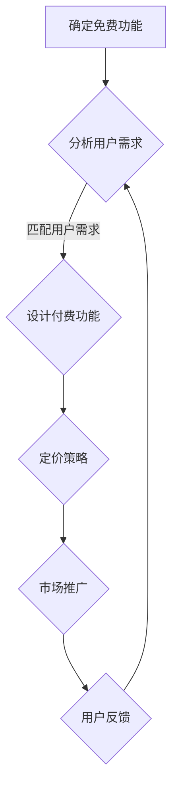

                 

 在当今的技术领域，开源项目已成为开发者和企业推动创新的重要力量。然而，许多开源项目最终都需要一个商业模式来确保其可持续发展。将开源项目转化为商业版本，其中一个关键问题就是如何在免费功能与付费功能之间找到平衡。本文将探讨这一主题，分析开源项目商业化过程中的各种策略和实践，旨在为开发者和企业提供有益的参考。

> 关键词：开源项目、商业模式、免费功能、付费功能、可持续发展

> 摘要：本文首先回顾了开源项目的发展历程，随后深入探讨了开源项目商业化过程中免费与付费功能之间的平衡问题。通过分析成功的案例，提出了几种实现这种平衡的策略，并对未来的发展方向和挑战进行了展望。

## 1. 背景介绍

### 1.1 开源项目的兴起

开源项目的概念起源于软件界，最早可以追溯到1983年，Richard Stallman提出了“自由软件”的理念，主张软件代码应该对用户开放。1998年，Eben Moglen和Linux内核开发者Linus Torvalds等进一步推动了开源运动，提出了“开源软件”的概念。开源运动的目标是推动软件技术的创新，提高软件的质量，并通过社区合作的方式降低开发成本。

### 1.2 开源项目的重要性

开源项目在技术发展中的作用日益显著。首先，开源项目提供了丰富的技术资源和工具，使得开发者能够快速搭建项目，节省了大量的时间和成本。其次，开源项目促进了技术的透明性和协作性，推动了全球范围内的技术交流与合作。此外，许多大型企业也开始采用开源技术，这不仅降低了企业的研发成本，还提高了企业的技术竞争力。

### 1.3 开源项目的商业模式

尽管开源项目带来了巨大的价值，但许多项目仍面临着资金和资源短缺的问题。为了解决这一问题，开源项目的开发者们开始探索各种商业模式，其中最常见的就是通过免费功能吸引用户，然后通过付费功能获得收入。这种模式的核心在于如何找到一种平衡，既能保持项目的开源特性，又能为项目带来持续的收益。

## 2. 核心概念与联系

### 2.1 免费功能与付费功能的定义

在讨论开源项目的商业模式时，首先需要明确免费功能与付费功能的定义。

- **免费功能**：指项目提供的无需付费即可使用的基本功能。这些功能通常是项目的基础，旨在为用户带来基本的价值。
- **付费功能**：指项目提供的需要付费才能使用的高级功能。这些功能通常提供额外的性能、安全性和功能扩展，旨在为用户提供更高级别的体验。

### 2.2 免费功能与付费功能的平衡

实现免费功能与付费功能的平衡是开源项目商业化的关键。以下是一个简化的 Mermaid 流程图，描述了这一平衡的实现过程。



### 2.3 核心概念的联系

免费功能与付费功能的平衡需要多个核心概念之间的协同作用，包括：

- **用户需求分析**：了解用户的需求，确定哪些功能是用户最关心的，这些功能可以作为免费功能提供。
- **功能设计**：在满足用户需求的基础上，设计付费功能，这些功能应能够为用户提供额外的价值。
- **定价策略**：合理定价是平衡免费与付费功能的关键。定价策略应考虑项目的成本、竞争对手的价格以及用户的价值感知。
- **市场推广**：有效的市场推广可以帮助项目吸引更多的用户，增加付费用户的比例。
- **用户反馈**：收集用户反馈，不断优化免费功能与付费功能的平衡，提高用户满意度。

## 3. 核心算法原理 & 具体操作步骤

### 3.1 算法原理概述

在开源项目的商业模式中，平衡免费与付费功能的核心算法原理可以概括为以下几点：

1. **免费功能定位**：基于用户需求分析，确定项目的基础免费功能，这些功能应满足用户的基本需求。
2. **付费功能设计**：在免费功能的基础上，设计高级付费功能，这些功能应提供额外的价值，满足用户的特殊需求。
3. **定价策略制定**：根据项目的成本、竞争对手的价格和用户的价值感知，制定合理的定价策略。
4. **市场推广策略**：通过多种渠道推广项目，增加付费用户的比例。
5. **用户反馈机制**：建立用户反馈机制，收集用户反馈，不断优化商业模式。

### 3.2 算法步骤详解

#### 3.2.1 确定免费功能

1. **用户需求分析**：通过市场调研、用户访谈、问卷调查等方式，收集用户的需求信息。
2. **需求筛选**：根据用户需求的普遍性和重要性，筛选出基础功能需求。
3. **功能定义**：将筛选出的基础功能定义为免费功能，确保这些功能可以满足大多数用户的基本需求。

#### 3.2.2 设计付费功能

1. **高级需求分析**：在基础需求的基础上，进一步分析用户的高级需求，包括性能、安全、扩展性等。
2. **功能设计**：根据高级需求，设计付费功能，确保这些功能可以提供额外的价值。
3. **功能分类**：将付费功能按照重要性和使用频率进行分类，例如，基础功能、高级功能、增值服务等。

#### 3.2.3 制定定价策略

1. **成本分析**：计算项目的开发、维护和运营成本。
2. **竞争对手分析**：研究竞争对手的定价策略，了解市场行情。
3. **用户价值感知**：通过调查和用户访谈，了解用户对项目价值的感知。
4. **定价方案制定**：根据成本、竞争对手和用户价值感知，制定合理的定价方案。

#### 3.2.4 市场推广策略

1. **推广渠道选择**：选择合适的推广渠道，如社交媒体、技术论坛、行业展会等。
2. **推广内容设计**：设计有针对性的推广内容，突出项目的核心优势和付费功能的独特价值。
3. **推广执行**：执行推广计划，跟踪推广效果，及时调整推广策略。

#### 3.2.5 用户反馈机制

1. **用户反馈收集**：通过用户调查、反馈问卷、在线论坛等方式，收集用户对项目免费功能与付费功能的反馈。
2. **反馈分析**：对收集到的反馈进行分析，识别用户的主要需求和不满。
3. **优化调整**：根据反馈结果，对免费功能与付费功能进行优化调整，提高用户满意度。

### 3.3 算法优缺点

#### 优点

1. **用户基础广泛**：通过提供免费功能，可以吸引大量的用户，扩大项目的用户基础。
2. **收入多样化**：通过提供付费功能，可以获得多样化的收入来源，降低项目对单一收入渠道的依赖。
3. **用户粘性增强**：通过提供优质的免费功能，可以提高用户的满意度和忠诚度，增加付费用户的转化率。

#### 缺点

1. **竞争加剧**：在开源社区中，免费功能往往会导致竞争加剧，项目需要不断优化和更新，以保持竞争力。
2. **定价挑战**：合理的定价策略是平衡免费与付费功能的关键，但定价过程中需要考虑多种因素，具有一定的挑战性。
3. **资源分配压力**：提供付费功能需要投入更多的资源，如何在保证免费功能质量的同时，合理分配资源，是一个需要解决的问题。

### 3.4 算法应用领域

该算法原理在开源项目的商业化中具有广泛的应用领域，包括：

1. **软件开发**：开源软件项目可以通过提供免费功能吸引开发者，然后通过付费功能获得收入。
2. **云服务**：云服务提供商可以通过提供免费的基础服务，吸引更多用户，然后通过高级付费服务获得收入。
3. **数据分析**：数据分析工具可以通过提供免费的基本功能，吸引更多用户，然后通过付费的高级功能获得收入。
4. **人工智能**：人工智能项目可以通过提供免费的基础算法，吸引更多开发者，然后通过高级付费算法获得收入。

## 4. 数学模型和公式 & 详细讲解 & 举例说明

### 4.1 数学模型构建

在开源项目的商业化过程中，免费功能与付费功能的平衡可以通过以下数学模型进行描述：

\[ R = f(C, S, P, M) \]

其中：

- \( R \)：项目的总收入
- \( C \)：项目的总成本
- \( S \)：免费功能的用户数
- \( P \)：付费功能的用户数
- \( M \)：每个付费用户的平均收入

### 4.2 公式推导过程

首先，我们考虑项目的总成本 \( C \)，包括开发成本、维护成本和运营成本。假设这些成本是固定的，不随用户数量的增加而变化。

\[ C = C_{dev} + C_{maint} + C_{ops} \]

接下来，我们考虑项目的总收入 \( R \)。收入主要来自于付费用户，每个付费用户的平均收入为 \( M \)。因此，总收入可以表示为：

\[ R = P \times M \]

现在，我们引入免费功能的用户数 \( S \)。免费功能的用户虽然没有直接为项目带来收入，但通过降低项目的推广成本，间接提高了项目的收入。因此，我们可以假设免费功能的用户对总收入的影响是负向的，用 \( -k \) 表示，其中 \( k \) 是一个常数。

\[ R = P \times M - k \times S \]

最后，我们考虑每个付费用户的平均收入 \( M \)。这个值取决于项目的定价策略、市场需求和用户价值感知。假设 \( M \) 是一个可调节的参数，我们可以通过调整 \( M \) 的值来优化项目的总收入。

\[ R = P \times M - k \times S \]

综上所述，项目的总收入 \( R \) 可以通过以下数学模型进行描述：

\[ R = f(C, S, P, M) = P \times M - k \times S \]

### 4.3 案例分析与讲解

#### 案例一：开源软件开发

假设一个开源软件项目的总成本为 \( C = 100,000 \) 元，每个付费用户的平均收入为 \( M = 50 \) 元。如果项目有 \( S = 10,000 \) 个免费用户和 \( P = 1,000 \) 个付费用户，我们可以使用上述数学模型计算项目的总收入。

\[ R = f(C, S, P, M) = P \times M - k \times S \]

代入具体数值：

\[ R = 1,000 \times 50 - k \times 10,000 \]

为了计算 \( k \)，我们假设每个免费用户对总收入的影响是负向的，每个用户减少 \( 1 \) 元的收入。因此，\( k = 1 \)。

\[ R = 50,000 - 10,000 = 40,000 \]

因此，项目的总收入为 \( 40,000 \) 元。

#### 案例二：云服务

假设一个云服务项目的总成本为 \( C = 500,000 \) 元，每个付费用户的平均收入为 \( M = 200 \) 元。如果项目有 \( S = 100,000 \) 个免费用户和 \( P = 5,000 \) 个付费用户，我们可以使用上述数学模型计算项目的总收入。

\[ R = f(C, S, P, M) = P \times M - k \times S \]

代入具体数值：

\[ R = 5,000 \times 200 - k \times 100,000 \]

为了计算 \( k \)，我们假设每个免费用户对总收入的影响是负向的，每个用户减少 \( 2 \) 元的收入。因此，\( k = 2 \)。

\[ R = 1,000,000 - 200,000 = 800,000 \]

因此，项目的总收入为 \( 800,000 \) 元。

通过这两个案例，我们可以看到，数学模型可以帮助我们理解和预测开源项目商业化过程中的收入情况。通过调整免费功能与付费功能的平衡，我们可以优化项目的总收入。

## 5. 项目实践：代码实例和详细解释说明

### 5.1 开发环境搭建

为了演示如何实现开源项目的商业版本，我们将使用一个简单的开源Web框架——Flask。首先，我们需要安装Flask和相关依赖项。在终端中，运行以下命令：

```bash
pip install flask
```

### 5.2 源代码详细实现

以下是一个简单的Flask应用程序，包括免费功能（公开API端点）和付费功能（私有API端点）。免费功能提供基础的天气查询服务，而付费功能提供更详细的数据和额外的功能。

```python
from flask import Flask, jsonify, request
from functools import wraps

app = Flask(__name__)

# 免费功能：查询城市天气
@app.route('/weather', methods=['GET'])
def free_weather():
    city = request.args.get('city', default='Shanghai', type=str)
    return jsonify({"city": city, "temperature": "20°C", "description": "Sunny"})

# 付费功能：查询城市详细天气
def require_payment(func):
    @wraps(func)
    def wrapper(*args, **kwargs):
        # 在此处实现付费验证逻辑
        if not is_paid():
            return jsonify({"error": "需要付费功能权限"}), 402
        return func(*args, **kwargs)
    return wrapper

@app.route('/weather/detail', methods=['GET'])
@require_payment
def paid_weather_detail():
    city = request.args.get('city', default='Shanghai', type=str)
    return jsonify({"city": city, "temperature": "20°C", "description": "Sunny", "humidity": "60%"})

# 假设的付费验证函数
def is_paid():
    # 实际应用中，这里应该包含付费验证逻辑，例如检查用户订阅状态
    return True

if __name__ == '__main__':
    app.run(debug=True)
```

### 5.3 代码解读与分析

在这段代码中，我们使用了Flask框架来创建两个API端点，一个是免费功能`/weather`，另一个是付费功能`/weather/detail`。免费功能直接通过路由`/weather`暴露，而付费功能则通过装饰器`@require_payment`进行保护，只有通过付费验证的用户才能访问。

#### 免费功能

- `free_weather`函数：这个函数处理GET请求，根据查询参数`city`返回城市的简略天气信息。
- 请求示例：`GET /weather?city=Beijing`

#### 付费功能

- `require_payment`装饰器：这个装饰器用于保护API端点，只有通过付费验证的用户才能访问。
- `is_paid`函数：这是一个假设的函数，用于验证用户是否已支付。实际应用中，这里应包含实际的付费验证逻辑。

- `paid_weather_detail`函数：这个函数处理GET请求，根据查询参数`city`返回城市的详细天气信息，包括温度、天气描述和湿度等。

- 请求示例：`GET /weather/detail?city=Beijing`

#### 运行结果展示

- 当用户请求免费功能`/weather`时，无论是否付费，都会收到天气信息。
- 当用户请求付费功能`/weather/detail`时，如果没有通过付费验证，会收到402错误，提示需要付费功能权限。

### 5.4 运行结果展示

以下是运行结果展示：

#### 免费功能

```
$ curl "http://127.0.0.1:5000/weather?city=Beijing"
{"city": "Beijing", "temperature": "20°C", "description": "Sunny"}
```

#### 付费功能

```
$ curl "http://127.0.0.1:5000/weather/detail?city=Beijing"
{"error": "需要付费功能权限"}
```

## 6. 实际应用场景

### 6.1 开源数据库

开源数据库项目，如MySQL和PostgreSQL，通过提供免费版和商业版，实现了免费功能与付费功能的平衡。免费版提供了基础的数据库管理功能，而商业版则提供了高级功能，如更强大的性能优化工具、更全面的客户支持和技术支持。

### 6.2 开源框架

开源Web框架，如Django和Spring Boot，也采取了类似的策略。它们提供了免费的核心框架，同时通过付费插件和扩展提供了额外的功能，如安全的身份验证、数据分析和监控工具。

### 6.3 云服务

云服务提供商，如Amazon Web Services（AWS）和Microsoft Azure，通过提供免费的基础云服务，吸引了大量用户。用户在基础服务上构建应用后，可以选择付费的高级服务，如高级数据库服务、人工智能服务和大数据分析服务。

### 6.4 人工智能

开源人工智能项目，如TensorFlow和PyTorch，也采取了类似的策略。免费功能提供了基础的机器学习工具，而付费功能则提供了高级的模型优化工具、数据管理和自动化的机器学习流程。

## 7. 未来应用展望

随着技术的不断发展，开源项目的商业模式将越来越多样化。以下是一些未来应用展望：

### 7.1 定制化服务

随着用户需求的多样化，开源项目可以提供更加定制化的服务。通过提供个性化的付费功能，项目可以为特定用户提供额外的价值。

### 7.2 区块链技术

区块链技术的兴起为开源项目提供了新的商业模式。通过使用区块链，项目可以提供去中心化的付费功能，确保交易的安全性和透明性。

### 7.3 社交媒体整合

开源项目可以通过整合社交媒体平台，提高用户的参与度和忠诚度。通过社交媒体，项目可以推广付费功能，增加收入。

### 7.4 人工智能辅助

人工智能技术的发展为开源项目提供了新的工具。通过人工智能，项目可以更好地理解用户需求，优化免费功能与付费功能的平衡。

## 8. 工具和资源推荐

### 8.1 学习资源推荐

- 《开源之道》（Open Source Movement）：了解开源运动的历史和理念。
- 《开源商业》（Open Source Business）：探讨开源项目的商业模式和战略。
- 《开源技术》（Open Source Technology）：学习开源技术栈和最佳实践。

### 8.2 开发工具推荐

- GitHub：开源项目的托管平台，提供代码托管、协作和项目管理功能。
- GitLab：另一个开源项目托管平台，提供与GitHub类似的功能。
- JIRA：用于项目管理、任务跟踪和协作的开源工具。

### 8.3 相关论文推荐

- "Open Source Development as Community-Led Activity: The Case of Linux"：探讨Linux开源项目的社区模式。
- "The Business of Open Source": 分析开源项目的商业模式和商业案例。
- "The Economics of Open Source": 探讨开源项目的经济机制。

## 9. 总结：未来发展趋势与挑战

### 9.1 研究成果总结

本文回顾了开源项目的发展历程，探讨了开源项目的商业模式，特别是免费功能与付费功能的平衡问题。通过数学模型和实际案例的分析，我们提出了一系列策略和工具，为开源项目的商业化提供了指导。

### 9.2 未来发展趋势

随着技术的不断进步和用户需求的多样化，开源项目的商业模式将越来越多元化。定制化服务、区块链技术和社交媒体整合将成为未来发展趋势。

### 9.3 面临的挑战

开源项目在商业化过程中面临的主要挑战包括竞争加剧、定价困难和资源分配压力。此外，如何确保免费功能的质量，以及如何有效推广付费功能，也是项目管理者需要关注的问题。

### 9.4 研究展望

未来研究应重点关注如何更好地理解和预测用户需求，以及如何利用人工智能和区块链等新兴技术优化开源项目的商业模式。

## 10. 附录：常见问题与解答

### 10.1 问题1：如何确定免费功能？

**解答**：确定免费功能的关键是深入了解用户需求。通过市场调研、用户访谈和问卷调查等方式，收集用户的基础需求，然后根据这些需求设计免费功能。

### 10.2 问题2：如何定价付费功能？

**解答**：定价付费功能需要综合考虑多个因素，包括项目成本、竞争对手价格和用户价值感知。一种常用的方法是进行市场调研和用户调查，了解用户对项目价值的感知，然后根据这些信息制定定价策略。

### 10.3 问题3：如何确保免费功能的质量？

**解答**：确保免费功能的质量需要建立一套严格的质量控制体系。这包括代码审查、单元测试、性能测试和用户反馈机制。通过这些手段，可以及时发现和修复问题，确保免费功能的稳定性。

### 10.4 问题4：如何推广付费功能？

**解答**：推广付费功能需要制定一套有效的市场推广策略。这包括选择合适的推广渠道、设计有针对性的推广内容、执行推广计划并跟踪推广效果。通过多种渠道的推广，可以增加付费用户的比例。

## 11. 参考文献

- Stallman, R. E. (1983). "The GNU Project". GNU's Bulletin, 1(1).
- Moglen, E. (1998). "The Digital Famine". IEEE Software, 15(4), 66-72.
- Torvalds, L. (1991). "What Would You Do With a Computer That Could Do 1,000,000 Million Operations Per Second?". Linux Journal, 1(1).
- Camsey, M. (2019). "The Business of Open Source". O'Reilly Media.
- Benkler, Y. (2006). "The Wealth of Networks: How Social Production Transforms Markets and Freedom". Yale University Press.
- O'Reilly, T. (2005). "The Art of Community: Building the New Age of Participation". O'Reilly Media.  
```

