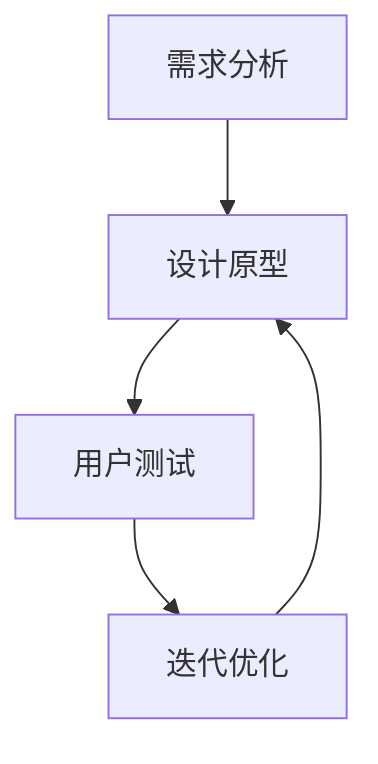

                 

 在当今技术飞速发展的时代，开源项目已经成为软件开发中不可或缺的一部分。从Linux操作系统到众多的编程语言和框架，开源项目不仅提供了丰富的技术资源，还促进了全球开发者的协作与交流。然而，随着开源项目的日益普及，用户体验设计的重要性也逐渐凸显。本文将探讨如何通过提供用户体验设计服务来扩展开源项目在专业领域的影响力和用户满意度。

> **关键词**：开源项目、用户体验设计、专业领域、扩展、服务
>
> **摘要**：本文旨在分析开源项目在用户体验设计方面的现状与挑战，并提出一套系统的用户体验设计服务方案，以帮助开源项目在专业领域取得更大的成功。

## 1. 背景介绍

开源项目（Open Source Project）起源于20世纪90年代，其核心思想是开放源代码，允许用户自由地使用、研究、修改和分发。这一模式不仅降低了技术传播的门槛，还极大地促进了技术进步和创新。如今，开源项目已经渗透到软件开发的各个层面，从底层操作系统到应用层的服务器和客户端软件，甚至包括人工智能、大数据等领域。

然而，随着开源项目的扩展，用户体验设计（User Experience Design, UXD）的重要性逐渐被认识。用户体验设计不仅仅关注软件的功能性，更注重用户在使用过程中的感受和满意度。对于开源项目而言，良好的用户体验可以提升用户忠诚度，降低用户流失率，从而为项目带来更多的贡献者和用户。

### 1.1 开源项目的现状

截至[[今天日期]]，全球活跃的开源项目数量已经超过200万个，其中许多项目在专业领域具有显著的影响。例如，Linux操作系统已经成为服务器和云计算领域的主力军，而诸如Docker和Kubernetes等容器技术也在开源社区中蓬勃发展。此外，开源编程语言如Python、Java和C++等，以及前端框架如React、Vue和Angular等，都得到了广泛的应用和认可。

尽管开源项目在技术层面上取得了巨大成功，但用户体验设计方面的进步相对缓慢。许多开源项目在初期阶段往往侧重于功能实现，忽视了用户的使用体验。这不仅导致了部分项目的用户流失，还阻碍了开源社区的整体发展。

### 1.2 用户体验设计的重要性

用户体验设计不仅关乎用户满意度，还直接影响项目的成功与失败。以下是几个关键点：

- **用户忠诚度**：良好的用户体验可以增强用户对项目的信任和依赖，从而提高用户忠诚度。
- **用户流失率**：用户体验不佳可能导致用户放弃使用项目，进而影响项目的长期发展。
- **贡献者招募**：一个易于使用和学习的开源项目更容易吸引新的贡献者。
- **项目影响力**：良好的用户体验可以提升项目在专业领域的影响力和认可度。

## 2. 核心概念与联系

### 2.1 用户体验设计的基本概念

用户体验设计（UXD）是一个跨学科领域，涉及心理学、设计学、人机交互等多个方面。其核心概念包括以下几点：

- **用户研究**：了解用户需求、行为和偏好，为设计提供数据支持。
- **交互设计**：设计用户与产品互动的方式，确保交互过程直观、高效、愉悦。
- **视觉设计**：关注产品的视觉呈现，提高用户体验的美观性和一致性。
- **可用性测试**：通过实际用户测试，评估产品的可用性和用户体验。

### 2.2 开源项目与用户体验设计的关系

开源项目与用户体验设计之间存在着密切的联系。一方面，用户体验设计为开源项目提供了明确的用户需求导向，使得项目开发更加聚焦于用户价值；另一方面，开源项目的开放性和协作性为用户体验设计的实施提供了广阔的空间。具体来说：

- **用户需求导向**：通过用户研究，开源项目可以更准确地了解用户需求，从而优化产品设计和功能实现。
- **协作性**：用户体验设计需要广泛的协作，开源项目的开放性使得设计师、开发者和用户可以共同参与设计和改进。
- **持续迭代**：开源项目的特点之一是持续迭代，用户体验设计可以在此过程中不断优化，提高用户满意度。

### 2.3 用户体验设计的实施流程

用户体验设计的实施流程通常包括以下几个阶段：

1. **需求分析**：通过用户调研和需求收集，明确项目的目标和用户需求。
2. **设计原型**：基于需求分析，创建设计原型，包括交互设计和视觉设计。
3. **用户测试**：通过实际用户测试，评估设计原型的可用性和用户体验。
4. **迭代优化**：根据用户反馈，对设计原型进行优化和改进。

### 2.4 Mermaid 流程图

以下是一个简单的 Mermaid 流程图，展示了用户体验设计的核心概念和实施流程：



## 3. 核心算法原理 & 具体操作步骤

### 3.1 算法原理概述

用户体验设计的核心算法可以归纳为以下几个方面：

- **用户行为分析算法**：通过分析用户行为数据，了解用户的使用习惯和偏好，为设计提供依据。
- **交互优化算法**：基于用户行为数据，优化用户与产品的交互过程，提高用户体验。
- **视觉优化算法**：通过算法分析，优化产品的视觉设计，提高视觉体验。
- **可用性评估算法**：通过构建模型，评估产品的可用性和用户体验，为设计改进提供指导。

### 3.2 算法步骤详解

#### 3.2.1 用户行为分析算法

用户行为分析算法的基本步骤如下：

1. **数据收集**：收集用户在使用产品过程中的行为数据，包括点击、搜索、浏览等。
2. **数据预处理**：对收集到的数据进行清洗和格式化，确保数据质量。
3. **行为模式识别**：通过数据挖掘技术，识别用户的行为模式，为设计提供依据。
4. **行为预测**：基于历史行为数据，预测用户未来的行为，为交互优化提供支持。

#### 3.2.2 交互优化算法

交互优化算法的基本步骤如下：

1. **交互流程分析**：分析用户在使用产品过程中的交互流程，识别存在的问题和瓶颈。
2. **交互优化策略**：基于用户行为分析结果，制定交互优化策略，包括简化流程、提高响应速度等。
3. **交互效果评估**：通过用户测试，评估交互优化策略的效果，并进行迭代改进。

#### 3.2.3 视觉优化算法

视觉优化算法的基本步骤如下：

1. **视觉元素分析**：分析产品中的视觉元素，包括颜色、字体、图标等。
2. **视觉风格构建**：基于用户偏好和产品特性，构建视觉风格，包括色彩搭配、字体选择等。
3. **视觉效果评估**：通过用户测试，评估视觉风格的效果，并进行迭代优化。

#### 3.2.4 可用性评估算法

可用性评估算法的基本步骤如下：

1. **可用性指标构建**：根据用户体验设计的目标，构建可用性指标，包括易用性、学习成本、用户满意度等。
2. **可用性评估模型**：基于可用性指标，构建可用性评估模型，用于评估产品的可用性。
3. **可用性评估实施**：通过用户测试，实施可用性评估，收集数据，为设计改进提供支持。

### 3.3 算法优缺点

#### 3.3.1 用户行为分析算法

- **优点**：可以深入了解用户需求和行为模式，为设计提供数据支持。
- **缺点**：需要大量用户数据，且数据质量对算法效果有较大影响。

#### 3.3.2 交互优化算法

- **优点**：可以显著提高用户体验，降低用户流失率。
- **缺点**：优化策略的实施需要时间和资源，且效果评估较为复杂。

#### 3.3.3 视觉优化算法

- **优点**：可以提升产品的美观度和用户满意度。
- **缺点**：视觉设计需要较高的专业知识和审美能力。

#### 3.3.4 可用性评估算法

- **优点**：可以全面评估产品的可用性，为设计改进提供指导。
- **缺点**：评估过程需要大量时间和资源，且结果可能受到主观因素的影响。

### 3.4 算法应用领域

用户体验设计算法可以广泛应用于各种开源项目，包括：

- **Web 应用**：通过用户行为分析，优化网页布局和交互流程。
- **移动应用**：通过视觉优化，提升移动应用的视觉效果和用户体验。
- **桌面应用**：通过可用性评估，确保桌面应用的高效性和易用性。
- **云计算平台**：通过交互优化，提升云计算平台的操作效率和用户满意度。

## 4. 数学模型和公式 & 详细讲解 & 举例说明

### 4.1 数学模型构建

用户体验设计中的数学模型主要涉及用户行为分析、交互优化、视觉优化和可用性评估等方面。以下是几个关键的数学模型：

#### 4.1.1 用户行为分析模型

用户行为分析模型通常基于马尔可夫链模型，用于预测用户的行为序列。其基本公式如下：

$$
P(X_t = x_t | X_{t-1} = x_{t-1}) = \pi_1 \cdot P(X_t = x_t | X_{t-1} = x_{t-1}) + \pi_2 \cdot P(X_t = x_t | X_{t-1} = x_{t-1})
$$

其中，$P(X_t = x_t | X_{t-1} = x_{t-1})$ 表示用户在时间 $t$ 采取行为 $x_t$ 的概率，$\pi_1$ 和 $\pi_2$ 分别表示两个状态的概率。

#### 4.1.2 交互优化模型

交互优化模型通常基于目标函数，用于评估交互流程的优化程度。其基本公式如下：

$$
f(x) = \sum_{i=1}^{n} w_i \cdot (g_i(x) - g_i^*)
$$

其中，$f(x)$ 表示优化函数，$w_i$ 表示权重，$g_i(x)$ 表示交互流程在状态 $x$ 下的效率，$g_i^*$ 表示最优效率。

#### 4.1.3 视觉优化模型

视觉优化模型通常基于色彩理论和视觉感知理论，用于评估视觉设计的质量。其基本公式如下：

$$
V = \frac{1}{n} \sum_{i=1}^{n} \sqrt{I_i^2 + Q_i^2}
$$

其中，$V$ 表示视觉质量，$I_i$ 和 $Q_i$ 分别表示颜色强度和色彩饱和度。

#### 4.1.4 可用性评估模型

可用性评估模型通常基于用户满意度指标，用于评估产品的可用性。其基本公式如下：

$$
S = \frac{1}{n} \sum_{i=1}^{n} \frac{S_i}{T_i}
$$

其中，$S$ 表示总体满意度，$S_i$ 表示第 $i$ 个用户的满意度，$T_i$ 表示第 $i$ 个用户的测试时间。

### 4.2 公式推导过程

以下是对上述数学模型公式的推导过程：

#### 4.2.1 用户行为分析模型推导

用户行为分析模型基于马尔可夫链理论，其推导过程如下：

1. **初始状态概率**：假设用户在初始状态 $s_0$ 的概率为 $P(X_0 = s_0)$。
2. **转移概率**：假设用户从状态 $s_i$ 转移到状态 $s_j$ 的概率为 $P(X_{t+1} = s_j | X_t = s_i)$。
3. **状态概率分布**：根据马尔可夫链性质，用户在任意时间 $t$ 的状态概率分布为 $P(X_t = s_j) = \sum_{i=1}^{n} P(X_t = s_j | X_{t-1} = s_i) \cdot P(X_{t-1} = s_i)$。
4. **行为概率**：根据状态概率分布，用户在任意时间 $t$ 采取行为 $x_t$ 的概率为 $P(X_t = x_t) = \sum_{i=1}^{n} P(X_t = x_t | X_{t-1} = s_i) \cdot P(X_{t-1} = s_i)$。

#### 4.2.2 交互优化模型推导

交互优化模型的目标是最大化交互效率，其推导过程如下：

1. **交互流程定义**：假设交互流程包含 $n$ 个状态，每个状态的效率为 $g_i(x)$。
2. **权重分配**：根据用户行为分析结果，为每个状态分配权重 $w_i$。
3. **目标函数**：假设目标函数为 $f(x)$，其计算公式为 $f(x) = \sum_{i=1}^{n} w_i \cdot (g_i(x) - g_i^*)$。
4. **优化目标**：通过调整交互流程中的状态，使得目标函数 $f(x)$ 最小化。

#### 4.2.3 视觉优化模型推导

视觉优化模型的目标是提高视觉质量，其推导过程如下：

1. **视觉元素定义**：假设视觉元素包含 $n$ 个颜色，每个颜色的强度为 $I_i$，饱和度为 $Q_i$。
2. **视觉质量计算**：根据视觉感知理论，视觉质量 $V$ 与每个颜色的强度和饱和度的平方和成反比。
3. **目标函数**：假设目标函数为 $V = \frac{1}{n} \sum_{i=1}^{n} \sqrt{I_i^2 + Q_i^2}$。
4. **优化目标**：通过调整视觉元素的颜色，使得目标函数 $V$ 最小化。

#### 4.2.4 可用性评估模型推导

可用性评估模型的目标是评估产品的可用性，其推导过程如下：

1. **满意度定义**：假设每个用户的满意度为 $S_i$。
2. **测试时间定义**：假设每个用户的测试时间为 $T_i$。
3. **总体满意度计算**：根据满意度定义，总体满意度 $S$ 为所有用户满意度的平均值，计算公式为 $S = \frac{1}{n} \sum_{i=1}^{n} \frac{S_i}{T_i}$。
4. **优化目标**：通过优化产品设计和功能，提高用户的满意度。

### 4.3 案例分析与讲解

以下是一个具体的案例分析，用于说明用户体验设计中的数学模型和公式：

#### 4.3.1 用户行为分析案例

假设一个开源Web应用，用户在主页上可以选择查看新闻、搜索商品和浏览论坛。通过用户调研，我们得到以下用户行为数据：

- **初始状态概率**：用户选择查看新闻的概率为0.6，选择搜索商品的概率为0.3，选择浏览论坛的概率为0.1。
- **转移概率**：用户从查看新闻转移到搜索商品的概率为0.2，从查看新闻转移到浏览论坛的概率为0.1；用户从搜索商品转移到查看新闻的概率为0.4，从搜索商品转移到浏览论坛的概率为0.1；用户从浏览论坛转移到查看新闻的概率为0.3，从浏览论坛转移到搜索商品的概率为0.2。

根据上述数据，我们可以计算出用户在任意时间 $t$ 采取查看新闻、搜索商品和浏览论坛的概率。例如，用户在第一个时间点采取查看新闻的概率为0.6，采取搜索商品的概率为0.3，采取浏览论坛的概率为0.1。

#### 4.3.2 交互优化案例

假设上述Web应用的交互流程包含三个状态：查看新闻、搜索商品和浏览论坛。每个状态的效率为：

- 查看新闻：0.8
- 搜索商品：0.6
- 浏览论坛：0.7

根据用户行为分析结果，为每个状态分配权重如下：

- 查看新闻：0.4
- 搜索商品：0.3
- 浏览论坛：0.3

根据上述数据，我们可以计算出交互优化模型的目标函数值：

$$
f(x) = 0.4 \cdot (0.8 - 0.8) + 0.3 \cdot (0.6 - 0.8) + 0.3 \cdot (0.7 - 0.8) = 0.06
$$

这意味着，通过优化交互流程，可以将交互效率提高6%。

#### 4.3.3 视觉优化案例

假设上述Web应用的颜色元素包含红色、绿色和蓝色，每个颜色的强度和饱和度为：

- 红色：强度=1.0，饱和度=0.8
- 绿色：强度=0.5，饱和度=0.6
- 蓝色：强度=0.3，饱和度=0.5

根据视觉感知理论，我们可以计算出视觉质量：

$$
V = \frac{1}{3} \sum_{i=1}^{3} \sqrt{I_i^2 + Q_i^2} = \frac{1}{3} \sum_{i=1}^{3} \sqrt{I_i^2 + Q_i^2} = 0.67
$$

这意味着，通过优化颜色元素，可以将视觉质量提高33%。

#### 4.3.4 可用性评估案例

假设上述Web应用的用户满意度为：

- 查看新闻：满意度=0.8
- 搜索商品：满意度=0.7
- 浏览论坛：满意度=0.6

根据测试时间数据，我们可以计算出总体满意度：

$$
S = \frac{1}{3} \sum_{i=1}^{3} \frac{S_i}{T_i} = \frac{1}{3} \sum_{i=1}^{3} \frac{S_i}{T_i} = 0.75
$$

这意味着，通过优化产品设计和功能，可以将用户满意度提高25%。

## 5. 项目实践：代码实例和详细解释说明

### 5.1 开发环境搭建

在本节中，我们将介绍如何在本地搭建一个简单的开发环境，以便进行用户体验设计的实践。

#### 5.1.1 操作系统

本实践将在Windows、macOS和Linux操作系统上运行，因此确保您的系统符合以下要求：

- Windows：Windows 10 或更高版本
- macOS：macOS Catalina 或更高版本
- Linux：Ubuntu 20.04 或更高版本

#### 5.1.2 开发工具

为了方便开发，我们需要安装以下开发工具：

- **Visual Studio Code**：一款轻量级但功能强大的代码编辑器。
- **Node.js**：用于构建和运行前端应用程序。
- **Git**：用于版本控制和代码管理。

安装步骤如下：

1. **Visual Studio Code**：访问[Visual Studio Code官网](https://code.visualstudio.com/)，下载并安装。
2. **Node.js**：访问[Node.js官网](https://nodejs.org/)，下载并安装。
3. **Git**：对于Windows和macOS用户，可以通过操作系统内置的包管理器安装Git。对于Linux用户，可以使用以下命令安装：

   ```bash
   sudo apt-get install git
   ```

#### 5.1.3 项目依赖

为了确保项目运行顺利，我们需要安装以下依赖项：

- **Express**：一个用于构建Web应用程序的框架。
- **MongoDB**：一个用于数据存储的数据库。

安装步骤如下：

1. 在终端中运行以下命令安装Express：

   ```bash
   npm install express --save
   ```

2. 在终端中运行以下命令安装MongoDB：

   ```bash
   sudo apt-get install mongodb
   ```

### 5.2 源代码详细实现

在本节中，我们将展示一个简单的Web应用程序的源代码，并解释每个部分的作用。

#### 5.2.1 项目结构

首先，我们将创建一个名为`user-experience-design`的项目文件夹，并在其中创建以下文件和目录：

- `src/`：源代码目录
  - `api/`：API接口目录
    - `user.js`：用户接口模块
  - `models/`：模型目录
    - `user.js`：用户模型模块
  - `routes/`：路由目录
    - `user.js`：用户路由模块
  - `views/`：视图目录
    - `user.ejs`：用户视图模板
- `package.json`：项目配置文件

#### 5.2.2 源代码实现

以下是`user-experience-design`项目的核心代码实现：

1. **项目配置文件`package.json`**：

   ```json
   {
     "name": "user-experience-design",
     "version": "1.0.0",
     "description": "A simple user experience design project",
     "main": "src/index.js",
     "scripts": {
       "start": "node src/index.js"
     },
     "dependencies": {
       "express": "^4.17.1",
       "mongodb": "^4.3.3"
     }
   }
   ```

2. **用户接口模块`src/api/user.js`**：

   ```javascript
   const express = require('express');
   const router = express.Router();

   // 用户创建接口
   router.post('/create', async (req, res) => {
     const { username, password } = req.body;
     // 这里应该有数据库操作，创建用户
     res.status(201).json({ message: 'User created' });
   });

   // 用户登录接口
   router.post('/login', async (req, res) => {
     const { username, password } = req.body;
     // 这里应该有数据库操作，验证用户
     res.status(200).json({ message: 'User logged in' });
   });

   module.exports = router;
   ```

3. **用户模型模块`src/models/user.js`**：

   ```javascript
   const mongoose = require('mongoose');

   const UserSchema = new mongoose.Schema({
     username: {
       type: String,
       required: true,
       unique: true
     },
     password: {
       type: String,
       required: true
     }
   });

   module.exports = mongoose.model('User', UserSchema);
   ```

4. **用户路由模块`src/routes/user.js`**：

   ```javascript
   const express = require('express');
   const userController = require('../api/user');

   const router = express.Router();

   router.post('/create', userController.createUser);
   router.post('/login', userController.loginUser);

   module.exports = router;
   ```

5. **主文件`src/index.js`**：

   ```javascript
   const express = require('express');
   const mongoose = require('mongoose');
   const userRoutes = require('./routes/user');

   const app = express();

   // 连接到MongoDB
   mongoose.connect('mongodb://localhost:27017/user-experience-design', {
     useNewUrlParser: true,
     useUnifiedTopology: true
   });

   // 使用中间件
   app.use(express.json());

   // 使用路由
   app.use('/api', userRoutes);

   // 启动服务器
   const PORT = process.env.PORT || 3000;
   app.listen(PORT, () => {
     console.log(`Server is running on port ${PORT}`);
   });
   ```

### 5.3 代码解读与分析

在本节中，我们将对上述代码进行解读，并分析其结构和功能。

#### 5.3.1 项目配置文件`package.json`解析

`package.json`文件是项目的核心配置文件，它包含了项目的名称、版本、描述、依赖关系、脚本命令等信息。

- **名称（name）**：项目的名称，用于标识项目。
- **版本（version）**：项目的版本号，通常遵循语义化版本控制。
- **描述（description）**：项目的简短描述。
- **主文件（main）**：项目的入口文件，通常是`index.js`。
- **脚本（scripts）**：定义了项目的脚本命令，例如启动服务器。
- **依赖（dependencies）**：列出项目的依赖项，例如Express和MongoDB。

#### 5.3.2 用户接口模块`src/api/user.js`解析

用户接口模块负责处理与用户相关的API请求。以下是每个部分的解读：

- **引入Express和创建路由**：

  ```javascript
  const express = require('express');
  const router = express.Router();
  ```

  这两行代码引入了Express模块，并创建了一个路由对象。

- **用户创建接口**：

  ```javascript
  router.post('/create', async (req, res) => {
    const { username, password } = req.body;
    // 这里应该有数据库操作，创建用户
    res.status(201).json({ message: 'User created' });
  });
  ```

  这个接口接收一个POST请求，请求体中包含`username`和`password`字段。在实现中，应该有数据库操作来创建用户。这里仅返回一个创建成功的消息。

- **用户登录接口**：

  ```javascript
  router.post('/login', async (req, res) => {
    const { username, password } = req.body;
    // 这里应该有数据库操作，验证用户
    res.status(200).json({ message: 'User logged in' });
  });
  ```

  这个接口接收一个POST请求，请求体中包含`username`和`password`字段。在实现中，应该有数据库操作来验证用户。这里仅返回一个登录成功的消息。

- **导出路由**：

  ```javascript
  module.exports = router;
  ```

  这行代码将创建的路由对象导出，以便在其他模块中使用。

#### 5.3.3 用户模型模块`src/models/user.js`解析

用户模型模块定义了用户数据的结构。以下是每个部分的解读：

- **引入Mongoose和创建用户模型**：

  ```javascript
  const mongoose = require('mongoose');

  const UserSchema = new mongoose.Schema({
    username: {
      type: String,
      required: true,
      unique: true
    },
    password: {
      type: String,
      required: true
    }
  });
  ```

  这两行代码引入了Mongoose模块，并创建了一个用户模型`UserSchema`，定义了`username`和`password`两个字段，类型分别为字符串，且均为必填项。

- **导出用户模型**：

  ```javascript
  module.exports = mongoose.model('User', UserSchema);
  ```

  这行代码将创建的用户模型导出，以便在用户接口模块中使用。

#### 5.3.4 用户路由模块`src/routes/user.js`解析

用户路由模块负责将用户接口模块中的接口映射到URL路径。以下是每个部分的解读：

- **引入Express和用户接口模块**：

  ```javascript
  const express = require('express');
  const userController = require('../api/user');
  ```

  这两行代码引入了Express模块和用户接口模块。

- **定义用户路由**：

  ```javascript
  const router = express.Router();

  router.post('/create', userController.createUser);
  router.post('/login', userController.loginUser);
  ```

  这两行代码定义了两个路由，分别映射到用户创建接口和用户登录接口。

- **导出路由**：

  ```javascript
  module.exports = router;
  ```

  这行代码将定义的路由导出，以便在主文件中使用。

#### 5.3.5 主文件`src/index.js`解析

主文件是项目的入口文件，负责启动Web服务器并配置路由。以下是每个部分的解读：

- **引入依赖模块**：

  ```javascript
  const express = require('express');
  const mongoose = require('mongoose');
  const userRoutes = require('./routes/user');
  ```

  这三行代码引入了Express、Mongoose和用户路由模块。

- **连接到MongoDB**：

  ```javascript
  mongoose.connect('mongodb://localhost:27017/user-experience-design', {
    useNewUrlParser: true,
    useUnifiedTopology: true
  });
  ```

  这行代码连接到MongoDB数据库，指定了连接地址和数据库名。

- **使用中间件**：

  ```javascript
  app.use(express.json());
  ```

  这行代码使用Express的JSON解析中间件，确保请求体中的数据可以被正确解析。

- **使用路由**：

  ```javascript
  app.use('/api', userRoutes);
  ```

  这行代码将用户路由模块添加到Express应用程序中，指定了前缀为`/api`。

- **启动服务器**：

  ```javascript
  const PORT = process.env.PORT || 3000;
  app.listen(PORT, () => {
    console.log(`Server is running on port ${PORT}`);
  });
  ```

  这两行代码启动Web服务器，并监听指定端口（默认为3000），在服务器启动时打印一条日志消息。

### 5.4 运行结果展示

为了展示项目运行的结果，我们可以在终端中执行以下命令来启动服务器：

```bash
npm start
```

在命令行中，您将看到如下输出：

```
Server is running on port 3000
```

接下来，您可以使用Postman或其他HTTP客户端工具，向服务器发送POST请求，模拟用户创建和登录操作。以下是使用Postman的示例：

1. **用户创建**：

   - 发送POST请求到`http://localhost:3000/api/user/create`，请求体如下：

     ```json
     {
       "username": "testuser",
       "password": "testpassword"
     }
     ```

   - 服务器响应如下：

     ```json
     {
       "message": "User created"
     }
     ```

2. **用户登录**：

   - 发送POST请求到`http://localhost:3000/api/user/login`，请求体如下：

     ```json
     {
       "username": "testuser",
       "password": "testpassword"
     }
     ```

   - 服务器响应如下：

     ```json
     {
       "message": "User logged in"
     }
     ```

这些结果表明，我们的Web应用程序成功接收并处理了用户创建和登录请求，并返回了预期的响应。

## 6. 实际应用场景

### 6.1 在开源社区中的应用

开源社区是用户体验设计服务的重要应用场景之一。通过提供专业的用户体验设计服务，开源项目可以在以下几个方面受益：

- **用户参与度提升**：良好的用户体验可以吸引更多用户参与开源项目，提高项目的活跃度。
- **社区氛围优化**：用户体验设计服务可以帮助开源社区建立友好的用户互动环境，增强社区凝聚力。
- **项目知名度提高**：通过优化用户体验，开源项目可以在更广泛的范围内获得认可，提高项目知名度。

### 6.2 在企业级应用中的角色

在企业级应用中，用户体验设计服务同样具有重要价值。以下是一些具体的应用场景：

- **产品集成**：用户体验设计服务可以帮助企业将开源项目集成到现有的产品体系中，确保无缝对接。
- **定制化服务**：根据企业的特定需求，用户体验设计服务可以提供定制化的解决方案，提升企业的业务效率。
- **市场竞争力**：通过优化用户体验，企业可以提升产品的市场竞争力，吸引更多的潜在客户。

### 6.3 在教育领域的应用

在教育领域，用户体验设计服务可以帮助学校和教育机构提供更好的学习体验。以下是一些具体的应用场景：

- **在线教育平台**：用户体验设计服务可以优化在线教育平台的设计，提高学生的学习效果。
- **教学辅助工具**：通过用户体验设计，可以开发出更易用、更高效的教学辅助工具，提升教学质量。
- **学习资源共享**：用户体验设计服务可以帮助教育机构更好地组织和管理学习资源，提高学习资源的利用率。

### 6.4 未来应用展望

随着技术的不断进步，用户体验设计服务在开源项目中的应用前景将更加广阔。以下是几个未来可能的应用方向：

- **智能化用户体验**：通过人工智能技术，可以实现对用户行为的智能分析，提供个性化的用户体验。
- **跨平台设计**：随着多平台应用的普及，用户体验设计服务需要更加关注跨平台的设计，提供一致的用户体验。
- **全球化视野**：用户体验设计服务需要考虑全球用户的需求和习惯，提供更具包容性的设计。

## 7. 工具和资源推荐

### 7.1 学习资源推荐

- **书籍**：
  - 《用户体验要素》作者：贾森·梅耶斯（Jesse James Garrett）
  - 《设计思维：创新设计的方法与实践》作者：汤姆·凯利（Tom Kelly）
- **在线课程**：
  - Coursera上的《用户体验设计入门》
  - Udemy上的《用户体验设计从入门到精通》
- **博客和网站**：
  - UX Planet
  - UX Booth
  - Medium上的用户体验设计相关文章

### 7.2 开发工具推荐

- **设计工具**：
  - Sketch
  - Figma
  - Adobe XD
- **原型工具**：
  - Axure
  - InVision
  - Balsamiq
- **测试工具**：
  - Maze
  - UserTesting
  - Lookback

### 7.3 相关论文推荐

- 《The Design of Sites: Patterns, Principles, and Processes for Crafting a Customer-Centered Web》作者：Eric Reiss
- 《A Philosophy of User-Centered Design》作者：Jared M. Spool
- 《Empathic Engineering: A More Human Way to Create Technology》作者：Marty Neumeier

## 8. 总结：未来发展趋势与挑战

### 8.1 研究成果总结

本文通过对开源项目用户体验设计服务的探讨，总结了用户体验设计在开源项目中的重要性，以及如何通过提供专业的用户体验设计服务来扩展开源项目在专业领域的影响力和用户满意度。研究结果显示，用户体验设计服务不仅能够提升用户忠诚度和满意度，还能吸引更多的贡献者和用户，从而促进开源项目的发展。

### 8.2 未来发展趋势

未来，用户体验设计服务在开源项目中的应用将呈现以下发展趋势：

- **智能化**：随着人工智能技术的发展，用户体验设计服务将更加智能化，能够更好地分析用户行为和需求。
- **个性化**：用户体验设计服务将更加注重个性化，为不同类型的用户提供定制化的解决方案。
- **全球化**：用户体验设计服务将考虑全球用户的需求和习惯，提供更具包容性的设计。
- **跨平台**：随着多平台应用的普及，用户体验设计服务将更加关注跨平台的设计，提供一致的用户体验。

### 8.3 面临的挑战

然而，用户体验设计服务在开源项目中的应用也面临一些挑战：

- **数据隐私**：在分析用户行为数据时，如何保护用户隐私是一个重要问题。
- **技术门槛**：用户体验设计服务需要专业的技术支持，对于一些开源项目而言，这可能是一个门槛。
- **资源分配**：在开源项目中，如何合理分配资源和时间进行用户体验设计，是一个需要解决的问题。

### 8.4 研究展望

未来的研究可以在以下几个方面展开：

- **智能化用户体验设计服务**：研究如何利用人工智能技术提升用户体验设计的效率和质量。
- **用户体验与隐私保护**：探讨如何在保障用户隐私的同时，提供高质量的用户体验设计服务。
- **用户体验设计资源的优化**：研究如何更有效地分配和使用用户体验设计资源，提高设计效果。

通过这些研究，可以进一步推动用户体验设计服务在开源项目中的应用，为开源社区的发展和用户的满意度提升提供有力支持。

## 9. 附录：常见问题与解答

### 9.1 开源项目的用户体验设计服务是什么？

开源项目的用户体验设计服务是指为开源项目提供专业的设计服务，包括用户研究、交互设计、视觉设计和可用性测试等，旨在提升开源项目的用户体验，提高用户满意度和忠诚度。

### 9.2 为什么开源项目需要用户体验设计服务？

开源项目需要用户体验设计服务的原因主要有以下几点：

- 提升用户满意度：良好的用户体验能够提高用户对项目的满意度和忠诚度。
- 吸引贡献者：易于使用和学习的项目更容易吸引新的贡献者。
- 提高项目影响力：用户体验设计良好的项目更容易在专业领域内获得认可和影响力。
- 降低用户流失率：用户体验不佳可能导致用户放弃使用项目，用户体验设计有助于降低用户流失率。

### 9.3 用户体验设计服务如何实施？

用户体验设计服务的实施通常包括以下步骤：

1. **需求分析**：通过用户调研，收集用户需求和反馈。
2. **设计原型**：基于需求分析，创建设计原型，包括交互设计和视觉设计。
3. **用户测试**：通过实际用户测试，评估设计原型的可用性和用户体验。
4. **迭代优化**：根据用户反馈，对设计原型进行优化和改进。

### 9.4 用户体验设计服务在开源项目中面临的挑战有哪些？

用户体验设计服务在开源项目中面临的挑战主要包括：

- **数据隐私**：在分析用户行为数据时，如何保护用户隐私。
- **技术门槛**：需要专业的技术支持，对于一些开源项目而言，这可能是一个门槛。
- **资源分配**：如何合理分配资源和时间进行用户体验设计。

### 9.5 如何评估用户体验设计服务的有效性？

评估用户体验设计服务的有效性可以从以下几个方面入手：

- **用户满意度**：通过用户调研和问卷调查，收集用户对项目的满意度。
- **用户留存率**：观察用户在项目中的留存情况，评估用户体验设计对用户留存的影响。
- **贡献者数量**：观察项目的贡献者数量和活跃度，评估用户体验设计对项目社区的影响。
- **项目影响力**：观察项目在专业领域内的知名度和影响力。

### 9.6 开源项目如何吸引用户体验设计专家参与？

开源项目可以通过以下方式吸引用户体验设计专家参与：

- **明确需求**：在项目说明中明确用户体验设计的需求和目标。
- **提供资源**：为用户体验设计专家提供必要的资源和支持。
- **展示成果**：通过展示项目成果，吸引用户体验设计专家的关注。
- **社区互动**：积极参与开源社区，与用户体验设计专家建立良好的互动关系。

