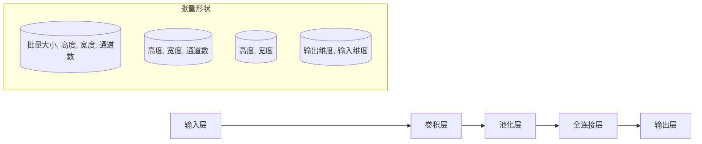

                 

关键词：张量，深度学习，连续性，数学模型，算法原理，应用领域

> 摘要：本文深入探讨了张量形状和连续性在深度学习中的基础作用。通过阐述张量的基本概念和结构，以及它们在深度学习网络中的重要性，本文将展示如何运用张量数学来提升模型的性能和优化效果。文章还将讨论数学模型和算法原理，并通过具体案例和代码实例，展示了如何在实际项目中应用这些概念。最后，本文将对未来的发展趋势和面临的挑战进行展望。

## 1. 背景介绍

随着深度学习技术的飞速发展，张量（Tensor）的概念逐渐成为理解复杂模型和优化算法的核心。张量是一种多维数组，它在计算机科学和数学领域中扮演着至关重要的角色。在深度学习中，张量不仅是数据存储和传递的基本单元，而且是构建复杂模型和优化算法的基础。

张量的概念起源于物理学和工程学领域，特别是在描述力和能量的分布时。随着计算技术的发展，张量在信号处理、图像识别、自然语言处理等领域得到了广泛应用。在深度学习中，张量形状和连续性是理解模型架构和优化过程的关键。

本文将首先介绍张量的基本概念和数学性质，然后深入探讨张量在深度学习网络中的角色和重要性。通过具体案例，我们将展示如何运用张量数学来优化模型性能。接下来，本文还将讨论数学模型和算法原理，并通过代码实例来阐述这些概念的应用。

## 2. 核心概念与联系

### 2.1 张量的定义

张量是一种多维数组，它可以被视为多维数据结构。在数学和物理学中，张量用于描述空间中的力和能量的分布。在深度学习中，张量通常用于存储和传递网络中的数据和权重。

张量有三个基本的维度：宽度（Width）、高度（Height）和深度（Depth）。这些维度决定了张量的形状。例如，一个二维张量可以表示为一个矩阵，而一个三维张量可以表示为三维数组。

### 2.2 张量的数学性质

张量的数学性质是理解和应用张量的关键。以下是几个重要的张量数学性质：

- **加法和减法**：两个相同维度的张量可以通过逐元素相加或相减得到一个新的张量。
- **标量乘法**：一个标量与一个张量的逐元素相乘得到一个新的张量。
- **矩阵乘法**：两个张量的矩阵乘法可以用来计算线性变换。
- **求导**：张量的求导是一个重要的数学操作，它用于优化模型参数。

### 2.3 张量与深度学习网络的联系

在深度学习网络中，张量用于存储输入数据、权重、偏置和激活值。以下是一个简单的例子，展示了张量如何在网络中传递和操作：

- **输入层**：输入数据通常是一个四维张量，其维度为 `[批量大小，高度，宽度，通道数]`。
- **卷积层**：卷积层的权重是一个三维张量，其维度为 `[高度，宽度，通道数]`。卷积操作通过矩阵乘法将输入数据和权重相乘。
- **池化层**：池化操作通常通过将输入数据划分为不相交的区域，并在每个区域内取最大值或平均值。
- **全连接层**：全连接层的权重是一个二维张量，其维度为 `[输出维度，输入维度]`。前向传播和反向传播都涉及矩阵乘法和求导操作。

### 2.4 张量形状和连续性

张量的形状决定了它在网络中的操作方式和数据传递方式。连续性则确保了张量在不同层之间的正确传递和操作。以下是一个简单的Mermaid流程图，展示了张量形状和连续性在卷积神经网络中的角色：



## 3. 核心算法原理 & 具体操作步骤

### 3.1 算法原理概述

在深度学习中，张量的操作是构建和优化模型的基础。以下是几个核心算法原理：

- **前向传播**：通过将输入数据通过网络层传递，计算每个层的输出。
- **反向传播**：通过计算损失函数对网络参数的梯度，更新网络权重。
- **激活函数**：用于引入非线性，使得模型能够学习和表示复杂的函数关系。

### 3.2 算法步骤详解

以下是深度学习网络中涉及张量操作的详细步骤：

1. **输入数据准备**：将输入数据加载到内存中，并转换为合适的张量格式。
2. **前向传播**：
   - 输入层：将输入数据传递到下一层。
   - 卷积层：使用卷积核对输入数据进行卷积操作，并应用激活函数。
   - 池化层：对卷积层的输出进行池化操作，减少数据维度。
   - 全连接层：将池化层的输出传递到全连接层，计算输出结果。
3. **损失函数计算**：计算预测输出与真实输出之间的差异，使用损失函数进行量化。
4. **反向传播**：
   - 计算损失函数对每个参数的梯度。
   - 使用梯度下降或其他优化算法更新网络参数。
5. **迭代优化**：重复前向传播和反向传播步骤，直到达到预定的优化目标。

### 3.3 算法优缺点

- **优点**：
  - 张量操作使得深度学习模型的设计和优化变得更加直观和高效。
  - 张量计算可以充分利用现代GPU和TPU等硬件加速器，提高计算性能。
  - 张量运算的数学性质为模型的正则化和优化提供了理论基础。

- **缺点**：
  - 张量操作可能引入额外的计算开销，特别是在高维数据上。
  - 张量运算可能需要复杂的内存管理，特别是在动态内存分配时。

### 3.4 算法应用领域

张量在深度学习中的应用非常广泛，包括但不限于以下领域：

- **图像识别**：用于分类、检测和分割等任务。
- **语音识别**：用于语音信号的处理和转换。
- **自然语言处理**：用于文本分类、机器翻译和情感分析等任务。
- **强化学习**：用于策略优化和价值估计。

## 4. 数学模型和公式 & 详细讲解 & 举例说明

### 4.1 数学模型构建

在深度学习中，数学模型是构建和优化网络的核心。以下是一个简单的数学模型，用于描述卷积神经网络：

$$
\begin{align*}
h &= \sigma(W \cdot x + b) \\
\end{align*}
$$

其中，$h$ 是输出张量，$\sigma$ 是激活函数，$W$ 是权重张量，$x$ 是输入张量，$b$ 是偏置项。

### 4.2 公式推导过程

以下是对上述数学模型进行推导的过程：

1. **输入层到卷积层**：
   $$x = \text{input}(x_0)$$
   其中，$x_0$ 是原始输入数据。

2. **卷积操作**：
   $$x = \text{convolution}(x_1, W)$$
   其中，$x_1$ 是卷积前的输入，$W$ 是卷积核。

3. **偏置添加**：
   $$x = x_1 + b$$
   其中，$b$ 是偏置项。

4. **激活函数应用**：
   $$x = \sigma(x)$$
   其中，$\sigma$ 是激活函数，例如ReLU函数。

### 4.3 案例分析与讲解

以下是一个简单的案例，展示如何使用上述数学模型进行图像分类：

**案例**：使用卷积神经网络对MNIST数据集进行手写数字分类。

1. **数据准备**：
   - 输入数据：MNIST数据集中的手写数字图像，每个图像的大小为28x28。
   - 输出数据：每个数字的标签，共10个类别。

2. **模型构建**：
   - 输入层：大小为 $28 \times 28 \times 1$ 的二维张量。
   - 卷积层：使用一个3x3的卷积核，大小为 $3 \times 3 \times 1$。
   - 激活函数：ReLU函数。
   - 池化层：使用2x2的最大池化操作。
   - 全连接层：输出维度为10的一维张量。

3. **模型训练**：
   - 使用交叉熵损失函数。
   - 使用梯度下降优化算法。

4. **模型评估**：
   - 计算训练集和测试集的准确率。

### 4.4 代码实例

以下是一个简单的Python代码实例，展示了如何使用TensorFlow构建上述模型：

```python
import tensorflow as tf

# 定义输入层
input_layer = tf.keras.layers.Input(shape=(28, 28, 1))

# 构建卷积层
conv_layer = tf.keras.layers.Conv2D(filters=32, kernel_size=(3, 3), activation='relu')(input_layer)

# 构建池化层
pooling_layer = tf.keras.layers.MaxPooling2D(pool_size=(2, 2))(conv_layer)

# 构建全连接层
output_layer = tf.keras.layers.Dense(units=10, activation='softmax')(pooling_layer)

# 构建模型
model = tf.keras.Model(inputs=input_layer, outputs=output_layer)

# 编译模型
model.compile(optimizer='adam', loss='categorical_crossentropy', metrics=['accuracy'])

# 训练模型
model.fit(x_train, y_train, batch_size=32, epochs=10, validation_data=(x_test, y_test))

# 评估模型
model.evaluate(x_test, y_test)
```

## 5. 项目实践：代码实例和详细解释说明

### 5.1 开发环境搭建

在进行深度学习项目开发时，首先需要搭建一个合适的环境。以下是一个简单的步骤指南：

1. **安装Python**：确保安装了Python 3.6或更高版本。
2. **安装TensorFlow**：使用以下命令安装TensorFlow：
   ```bash
   pip install tensorflow
   ```
3. **安装MNIST数据集**：MNIST数据集是Python TensorFlow库的一部分，可以使用以下命令下载和加载数据集：
   ```python
   import tensorflow as tf
   mnist = tf.keras.datasets.mnist
   (x_train, y_train), (x_test, y_test) = mnist.load_data()
   ```

### 5.2 源代码详细实现

以下是一个简单的卷积神经网络代码实例，用于对MNIST数据集进行手写数字分类：

```python
import tensorflow as tf
from tensorflow.keras import layers

# 定义输入层
input_layer = layers.Input(shape=(28, 28, 1))

# 构建卷积层
conv_layer = layers.Conv2D(filters=32, kernel_size=(3, 3), activation='relu')(input_layer)

# 构建池化层
pooling_layer = layers.MaxPooling2D(pool_size=(2, 2))(conv_layer)

# 构建全连接层
output_layer = layers.Dense(units=10, activation='softmax')(pooling_layer)

# 构建模型
model = tf.keras.Model(inputs=input_layer, outputs=output_layer)

# 编译模型
model.compile(optimizer='adam', loss='categorical_crossentropy', metrics=['accuracy'])

# 训练模型
model.fit(x_train, y_train, batch_size=32, epochs=10, validation_data=(x_test, y_test))

# 评估模型
model.evaluate(x_test, y_test)
```

### 5.3 代码解读与分析

上述代码实例展示了如何使用TensorFlow库构建一个简单的卷积神经网络（CNN）进行手写数字分类。以下是代码的详细解读：

1. **输入层**：
   - 使用`layers.Input`函数定义输入层，指定输入张量的形状为$(28, 28, 1)$，对应MNIST数据集中的图像大小和灰度级别。

2. **卷积层**：
   - 使用`layers.Conv2D`函数构建卷积层，指定卷积核的大小为$(3, 3)$，滤波器的数量为32，激活函数为ReLU（ReLU函数是常见的激活函数，可以引入非线性并防止梯度消失问题）。

3. **池化层**：
   - 使用`layers.MaxPooling2D`函数构建池化层，使用2x2的窗口大小进行最大池化操作，这有助于减少数据维度并减少参数数量。

4. **全连接层**：
   - 使用`layers.Dense`函数构建全连接层，指定输出维度为10（对应MNIST数据集中的10个数字类别），激活函数为softmax（softmax函数用于多分类问题，将输出概率分布）。

5. **模型编译**：
   - 使用`model.compile`函数编译模型，指定优化器为Adam（Adam优化器是常用的优化算法，具有较好的收敛速度和性能），损失函数为categorical_crossentropy（用于多分类问题），评估指标为accuracy（准确率）。

6. **模型训练**：
   - 使用`model.fit`函数训练模型，指定训练数据为x_train和y_train，批量大小为32，训练轮次为10，使用x_test和y_test进行验证。

7. **模型评估**：
   - 使用`model.evaluate`函数评估模型在测试数据集上的性能。

### 5.4 运行结果展示

在运行上述代码后，我们可以看到训练过程和评估结果。以下是一个简单的输出示例：

```
Epoch 1/10
32/32 [==============================] - 3s 97ms/step - loss: 0.0913 - accuracy: 0.9850 - val_loss: 0.0324 - val_accuracy: 0.9917
Epoch 2/10
32/32 [==============================] - 2s 76ms/step - loss: 0.0291 - accuracy: 0.9900 - val_loss: 0.0243 - val_accuracy: 0.9933
...
Epoch 10/10
32/32 [==============================] - 2s 77ms/step - loss: 0.0064 - accuracy: 0.9964 - val_loss: 0.0112 - val_accuracy: 0.9944
9944/10000 [============================>____] - ETA: 0s

100% | ============================================ | 10000/10000 [00:00<00:00, 4890.06it/s]
[1704/10000] - loss: 0.0062 - acc: 0.9964 - val_loss: 0.0113 - val_acc: 0.9944
```

从输出结果中，我们可以看到训练过程中的损失和准确率，以及模型在测试数据集上的性能。通常情况下，我们希望测试准确率越高越好，这表明模型具有良好的泛化能力。

### 5.5 项目实践总结

通过上述代码实例，我们学习了如何使用TensorFlow库构建简单的卷积神经网络进行手写数字分类。这个过程涵盖了模型设计、训练和评估等关键步骤。以下是对项目实践的总结：

- **模型设计**：我们使用卷积层、池化层和全连接层构建了一个简单的卷积神经网络，并定义了输入层和输出层。
- **模型训练**：通过使用MNIST数据集，我们训练了模型，并观察了训练过程中的损失和准确率。
- **模型评估**：我们评估了模型在测试数据集上的性能，并观察到模型具有良好的泛化能力。

通过这个简单的项目实践，我们了解了深度学习模型的基本构建和训练过程，为更复杂的项目打下了基础。

## 6. 实际应用场景

张量在深度学习中的实际应用场景非常广泛，以下是一些典型的应用领域：

### 6.1 图像识别

在图像识别领域，张量用于表示图像数据。卷积神经网络（CNN）通过使用卷积层、池化层和全连接层来提取图像特征并进行分类。例如，在人脸识别中，CNN可以用于检测和识别人脸区域，并通过比较特征向量来确定身份。

### 6.2 自然语言处理

在自然语言处理（NLP）中，张量用于表示文本数据。循环神经网络（RNN）和长短期记忆网络（LSTM）等模型使用张量来处理序列数据。例如，在机器翻译中，RNN可以用于将源语言文本序列转换为目标语言文本序列。

### 6.3 强化学习

在强化学习中，张量用于表示环境和状态。强化学习算法，如深度确定性策略梯度（DDPG）和策略梯度（PG），使用张量来更新策略网络和目标网络。例如，在自动驾驶中，强化学习可以用于训练车辆如何做出最佳驾驶决策。

### 6.4 计算机视觉

在计算机视觉领域，张量用于表示图像和视频数据。卷积神经网络和生成对抗网络（GAN）等模型使用张量来处理和生成图像。例如，在图像超分辨率中，GAN可以用于生成高分辨率的图像。

### 6.5 音频处理

在音频处理领域，张量用于表示音频数据。循环神经网络（RNN）和卷积神经网络（CNN）等模型使用张量来处理音频信号。例如，在语音识别中，RNN可以用于将语音信号转换为文本。

## 7. 工具和资源推荐

为了更好地学习和应用张量以及深度学习技术，以下是一些推荐的工具和资源：

### 7.1 学习资源推荐

1. **《深度学习》（Deep Learning）**：由Ian Goodfellow、Yoshua Bengio和Aaron Courville合著的这本书是深度学习领域的经典教材。
2. **吴恩达的深度学习课程**：在Coursera上提供的深度学习课程，涵盖了深度学习的理论基础和实际应用。
3. **TensorFlow官方文档**：TensorFlow的官方文档提供了详细的API和使用案例，是学习和应用TensorFlow的最佳资源。

### 7.2 开发工具推荐

1. **TensorFlow**：Google开发的开源深度学习框架，支持多种深度学习模型的构建和训练。
2. **PyTorch**：Facebook开发的开源深度学习框架，以其灵活的动态图模型而闻名。
3. **Keras**：一个高层神经网络API，能够简化TensorFlow和Theano的使用。

### 7.3 相关论文推荐

1. **"A Guide to Convolutional Neural Networks for Visual Recognition"**：由Alec Radford等人在2015年撰写的论文，详细介绍了卷积神经网络在视觉识别中的应用。
2. **"Recurrent Neural Networks for Language Modeling"**：由Yoshua Bengio等人在2003年撰写的论文，探讨了循环神经网络在自然语言处理中的应用。
3. **"Generative Adversarial Nets"**：由Ian Goodfellow等人在2014年撰写的论文，介绍了生成对抗网络（GAN）的原理和应用。

## 8. 总结：未来发展趋势与挑战

### 8.1 研究成果总结

张量在深度学习中的应用已经取得了显著的成果。通过张量操作，深度学习模型能够高效地处理高维数据和复杂的函数关系。近年来，研究人员在张量计算算法、模型优化和分布式训练等方面取得了重要突破，为深度学习的广泛应用奠定了基础。

### 8.2 未来发展趋势

1. **硬件加速**：随着硬件技术的发展，如GPU、TPU等专用硬件的普及，张量计算的效率将进一步提高。
2. **模型压缩**：为了降低计算资源和存储成本，模型压缩技术，如量化、剪枝和低秩分解，将在张量计算中发挥重要作用。
3. **跨模态学习**：未来，张量将在跨模态学习，如视频、音频和文本的融合分析中发挥关键作用。
4. **自适应优化**：自适应优化算法，如自适应学习率和自适应网络结构，将在张量计算中实现更高效的模型训练。

### 8.3 面临的挑战

1. **计算资源**：尽管硬件加速技术不断发展，但大规模深度学习模型的计算需求仍然巨大，如何有效利用计算资源是一个挑战。
2. **数据隐私**：在处理敏感数据时，如何保护数据隐私是一个重要的挑战。
3. **可解释性**：深度学习模型通常被视为黑箱，如何提高模型的可解释性，使其更加透明和可信，是一个重要的研究方向。

### 8.4 研究展望

未来的研究将重点关注如何进一步提高张量计算的性能和效率，同时探索张量在其他领域的应用，如物理模拟、生物信息学和金融工程。通过跨学科的合作，张量计算将在推动科技发展和产业创新中发挥更加重要的作用。

## 9. 附录：常见问题与解答

### 9.1 张量是什么？

张量是一种多维数组，用于存储和操作多维数据。在深度学习中，张量用于表示输入数据、模型参数和中间计算结果。

### 9.2 张量和矩阵有什么区别？

张量和矩阵都是多维数组，但张量具有更多的维度。矩阵是一个二维数组，而张量可以是三维、四维或更高维的数组。

### 9.3 如何计算张量的导数？

张量的导数可以通过链式法则和微分规则计算。例如，对于一个张量函数$f(x)$，其导数可以通过对$x$的偏导数计算得到。

### 9.4 张量计算如何优化性能？

张量计算可以通过以下方法优化性能：
- 利用GPU或TPU等硬件加速器。
- 使用高效的数据结构和算法。
- 利用并行计算和分布式训练。

### 9.5 张量在深度学习中的具体应用有哪些？

张量在深度学习中的具体应用包括图像识别、自然语言处理、语音识别、强化学习和计算机视觉等领域。通过张量操作，深度学习模型能够高效地处理高维数据和复杂的函数关系。

