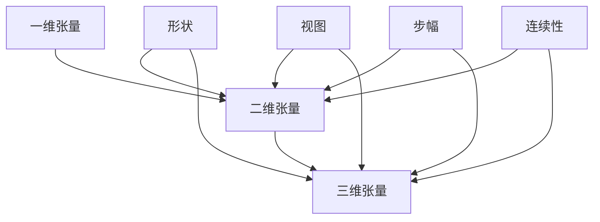

                 

关键词：张量操作，形状，视图，步幅，连续性，矩阵，深度学习

## 摘要

本文将深入探讨张量操作中的关键概念，包括形状、视图、步幅和连续性。我们将通过详尽的解释、实例分析和数学模型构建，帮助读者理解这些概念在实际应用中的重要性。此外，本文还将探讨张量操作在不同领域中的应用，并提供实用的工具和资源推荐，以便读者更好地掌握这一复杂但至关重要的技术。

## 1. 背景介绍

在计算机科学和数学中，张量是一个多维数组。张量是矩阵的泛化，矩阵是二维数组的特殊情况。张量操作在深度学习、计算机图形学、物理学和信号处理等领域中发挥着重要作用。例如，在深度学习中，卷积神经网络（CNN）的核心操作就是张量乘法和卷积操作。因此，深入理解张量操作是掌握现代计算技术的基础。

本文将分以下几个部分进行讨论：

1. **核心概念与联系**：我们将介绍张量的基本概念，包括形状、视图、步幅和连续性，并通过Mermaid流程图展示它们之间的关系。
2. **核心算法原理 & 具体操作步骤**：我们将详细解释张量操作的基本算法原理，包括矩阵乘法、张量乘法和卷积操作，并提供具体的操作步骤。
3. **数学模型和公式**：我们将构建张量操作的数学模型，并推导相关的公式，通过实例说明这些公式的应用。
4. **项目实践：代码实例和详细解释说明**：我们将通过一个简单的项目实例，展示如何在实际中实现张量操作。
5. **实际应用场景**：我们将探讨张量操作在不同领域的应用，包括深度学习、计算机图形学等。
6. **未来应用展望**：我们将讨论张量操作的未来发展趋势和潜在的应用前景。
7. **工具和资源推荐**：我们将推荐一些学习资源和开发工具，帮助读者更好地掌握张量操作。
8. **总结**：最后，我们将总结研究成果，并探讨未来的研究方向和挑战。

### 1.1 张量的基本概念

张量是一个多维数组，它可以是任何维度的数组，包括一维、二维和三维。在本文中，我们将主要关注二维和三维张量。

- **一维张量**：一维张量可以看作是一个向量，它由一组有序元素组成。例如，一个包含5个元素的向量可以表示为：

  $$
  v = [1, 2, 3, 4, 5]
  $$

- **二维张量**：二维张量可以看作是一个矩阵，它由行和列组成。例如，一个包含3行4列的矩阵可以表示为：

  $$
  A =
  \begin{bmatrix}
  a_{11} & a_{12} & a_{13} & a_{14} \\
  a_{21} & a_{22} & a_{23} & a_{24} \\
  a_{31} & a_{32} & a_{33} & a_{34} \\
  \end{bmatrix}
  $$

- **三维张量**：三维张量可以看作是一个立方体，它由多个二维矩阵组成。例如，一个包含2层、3行、4列的三维张量可以表示为：

  $$
  T =
  \begin{bmatrix}
  A_1 \\
  A_2 \\
  \end{bmatrix}
  $$

  其中，$A_1$ 和 $A_2$ 分别是两个二维矩阵。

#### 1.2 张量的形状

张量的形状是指其维度和大小。例如，一个二维张量的形状可以是$(3,4)$，表示它有3行和4列；一个三维张量的形状可以是$(2,3,4)$，表示它有2层、3行和4列。

#### 1.3 视图

视图是张量的一种表现形式，它通过一定的方式将张量的数据重新排列。例如，一个二维张量的行可以重新排列成列，或者一个三维张量的层可以重新排列成不同的维度。

#### 1.4 步幅

步幅是指张量中相邻元素之间的索引差值。在二维张量中，行步幅和列步幅是重要的概念。例如，一个形状为$(3,4)$的二维张量，其行步幅为3，列步幅为4。

#### 1.5 连续性

连续性是指张量的数据在内存中是连续存储的。连续性对于张量的操作和性能至关重要。

### 2. 核心概念与联系

接下来，我们将使用Mermaid流程图来展示张量的核心概念及其相互关系。



从流程图中可以看出，一维张量是二维张量和三维张量的基础，而二维张量和三维张量又具有类似的属性，如形状、视图、步幅和连续性。

### 3. 核心算法原理 & 具体操作步骤

在了解张量的基本概念后，我们将深入探讨张量操作的核心算法原理，包括矩阵乘法、张量乘法和卷积操作。

#### 3.1 矩阵乘法

矩阵乘法是二维张量操作的基础。给定两个矩阵 $A$ 和 $B$，它们的乘积 $C$ 是一个新矩阵，其中每个元素 $c_{ij}$ 是 $A$ 的第 $i$ 行和 $B$ 的第 $j$ 列的对应元素的乘积之和。

具体步骤如下：

1. 确定矩阵 $A$ 的行数 $m$ 和列数 $n$，矩阵 $B$ 的行数 $n$ 和列数 $p$。
2. 创建一个新矩阵 $C$，其行数等于 $A$ 的行数 $m$，列数等于 $B$ 的列数 $p$。
3. 对于 $C$ 的每个元素 $c_{ij}$，计算 $A$ 的第 $i$ 行和 $B$ 的第 $j$ 列的对应元素的乘积之和。

公式表示为：

$$
c_{ij} = \sum_{k=1}^{n} a_{ik} b_{kj}
$$

#### 3.2 张量乘法

张量乘法是矩阵乘法的泛化，用于计算两个多维张量的乘积。给定两个张量 $A$ 和 $B$，它们的乘积 $C$ 是一个新张量，其中每个元素 $c_{i_1 i_2 ... i_n}$ 是 $A$ 的第 $i_1$ 层、第 $i_2$ 行、...、第 $i_n$ 列的对应元素的乘积之和。

具体步骤如下：

1. 确定张量 $A$ 的形状 $(m_1, m_2, ..., m_n)$，张量 $B$ 的形状 $(n_1, n_2, ..., n_n)$。
2. 创建一个新张量 $C$，其形状为 $(m_1, m_2, ..., m_n, n_1, n_2, ..., n_n)$。
3. 对于 $C$ 的每个元素 $c_{i_1 i_2 ... i_n j_1 j_2 ... j_n}$，计算 $A$ 的第 $i_1$ 层、第 $i_2$ 行、...、第 $i_n$ 列的对应元素的乘积之和。

公式表示为：

$$
c_{i_1 i_2 ... i_n j_1 j_2 ... j_n} = \sum_{k_1=1}^{m_1} \sum_{k_2=1}^{m_2} ... \sum_{k_n=1}^{m_n} a_{i_1 k_1} b_{k_1 j_1} b_{k_2 j_2} ... b_{k_n j_n}
$$

#### 3.3 卷积操作

卷积操作是张量操作在图像处理中的应用。给定一个输入图像 $A$ 和一个卷积核 $B$，输出图像 $C$ 是一个新张量，其中每个元素 $c_{i j}$ 是 $A$ 的一个局部区域与 $B$ 的对应元素的乘积之和。

具体步骤如下：

1. 确定输入图像 $A$ 的形状 $(m, n)$，卷积核 $B$ 的形状 $(k, l)$。
2. 创建一个新图像 $C$，其形状为 $(m-k+1, n-l+1)$。
3. 对于 $C$ 的每个元素 $c_{i j}$，计算 $A$ 的一个 $(k, l)$ 区域与 $B$ 的对应元素的乘积之和。

公式表示为：

$$
c_{i j} = \sum_{p=1}^{k} \sum_{q=1}^{l} a_{i+p-1 j+q-1} b_{p q}
$$

### 3.4 算法优缺点

- **矩阵乘法**：

  - 优点：简单、高效，适用于大规模数据计算。

  - 缺点：只能处理二维数据，不适用于高维数据。

- **张量乘法**：

  - 优点：适用于多维数据，可以处理高维数据。

  - 缺点：计算复杂度较高，计算时间较长。

- **卷积操作**：

  - 优点：适用于图像处理，可以提取图像特征。

  - 缺点：计算复杂度较高，计算时间较长。

### 3.5 算法应用领域

- **深度学习**：张量乘法和卷积操作是深度学习神经网络的核心操作，用于计算模型参数和特征提取。

- **计算机图形学**：张量乘法用于矩阵变换和光线追踪，用于创建逼真的三维场景。

- **信号处理**：张量乘法用于信号滤波和特征提取，用于处理音频和视频信号。

### 4. 数学模型和公式

在深入探讨张量操作的过程中，理解相关的数学模型和公式是非常重要的。本节将介绍张量操作的数学模型和公式，并通过实例进行详细解释。

#### 4.1 数学模型构建

张量操作的基本数学模型可以归纳为以下几个部分：

1. **张量的表示**：

   张量可以表示为多维数组，其中每个元素都是标量。一个二维张量可以表示为矩阵，一个三维张量可以表示为立方体。

2. **张量的形状**：

   张量的形状是指其维度和大小。一个二维张量的形状可以是$(m, n)$，表示有$m$行和$n$列；一个三维张量的形状可以是$(m, n, l)$，表示有$m$层、$n$行和$l$列。

3. **张量的运算**：

   张量之间的运算包括加法、减法、乘法和除法。这些运算可以看作是标量运算的扩展。

4. **张量与矩阵的转换**：

   张量可以转换成矩阵，矩阵也可以转换成张量。这种转换在计算中非常重要。

#### 4.2 公式推导过程

为了更好地理解张量操作的数学模型，我们将通过几个简单的例子来推导相关的公式。

1. **二维张量加法**：

   给定两个二维张量$A$和$B$，它们的形状分别为$(m, n)$和$(m, n)$，则它们的和$C$也是一个二维张量，其形状为$(m, n)$。每个元素$c_{ij}$可以通过以下公式计算：

   $$
   c_{ij} = a_{ij} + b_{ij}
   $$

2. **二维张量乘法**：

   给定两个二维张量$A$和$B$，它们的形状分别为$(m, n)$和$(n, p)$，则它们的乘积$C$也是一个二维张量，其形状为$(m, p)$。每个元素$c_{ij}$可以通过以下公式计算：

   $$
   c_{ij} = \sum_{k=1}^{n} a_{ik} b_{kj}
   $$

3. **三维张量加法**：

   给定两个三维张量$A$和$B$，它们的形状分别为$(m, n, l)$和$(m, n, l)$，则它们的和$C$也是一个三维张量，其形状为$(m, n, l)$。每个元素$c_{ijk}$可以通过以下公式计算：

   $$
   c_{ijk} = a_{ijk} + b_{ijk}
   $$

4. **三维张量乘法**：

   给定两个三维张量$A$和$B$，它们的形状分别为$(m, n, l)$和$(n, p, q)$，则它们的乘积$C$也是一个三维张量，其形状为$(m, p, q)$。每个元素$c_{ijp}$可以通过以下公式计算：

   $$
   c_{ijp} = \sum_{k=1}^{l} \sum_{r=1}^{n} a_{ikr} b_{krp}
   $$

#### 4.3 案例分析与讲解

为了更好地理解上述公式，我们将通过一个简单的例子来讲解张量加法和乘法的应用。

**例1：二维张量加法**

给定两个二维张量$A$和$B$，它们的形状分别为$(2, 3)$和$(2, 3)$，计算它们的和$C$。

```
A = | 1 2 3 |
    | 4 5 6 |

B = | 7 8 9 |
    | 1 2 3 |
```

根据公式，我们可以得到：

```
C = A + B =
| 1+7 2+8 3+9 |
| 4+1 5+2 6+3 |
```

```
C = | 8 10 12 |
    | 5 7 9 |
```

**例2：二维张量乘法**

给定两个二维张量$A$和$B$，它们的形状分别为$(2, 3)$和$(3, 2)$，计算它们的乘积$C$。

```
A = | 1 2 3 |
    | 4 5 6 |

B = | 7 8 |
    | 9 1 |
    | 2 3 |
```

根据公式，我们可以得到：

```
C = A * B =
| 1*7 + 2*9 + 3*2 1*8 + 2*1 + 3*3 |
| 4*7 + 5*9 + 6*2 4*8 + 5*1 + 6*3 |
```

```
C = | 25 20 |
    | 67 34 |
```

通过以上例子，我们可以看到如何应用张量加法和乘法的公式进行计算。在实际应用中，这些操作可以通过编程实现，从而为各种计算任务提供强大的支持。

### 5. 项目实践：代码实例和详细解释说明

为了更好地理解张量操作，我们将通过一个简单的项目实例来展示如何在Python中实现这些操作。我们将使用NumPy库，这是一个强大的Python科学计算库，它提供了丰富的张量操作功能。

#### 5.1 开发环境搭建

在开始编写代码之前，我们需要安装NumPy库。你可以通过以下命令安装：

```
pip install numpy
```

安装完成后，我们就可以开始编写代码了。

#### 5.2 源代码详细实现

以下是一个简单的Python代码示例，它演示了二维张量的加法和乘法操作。

```python
import numpy as np

# 创建两个二维张量
A = np.array([[1, 2, 3], [4, 5, 6]])
B = np.array([[7, 8], [9, 1], [2, 3]])

# 计算二维张量加法
C = A + B

# 计算二维张量乘法
D = A.dot(B.T)

# 输出结果
print("二维张量加法结果：")
print(C)

print("二维张量乘法结果：")
print(D)
```

在这段代码中，我们首先导入了NumPy库，然后创建了两个二维张量$A$和$B$。接着，我们使用了`np.array`函数来计算二维张量的加法和乘法。最后，我们输出了计算结果。

#### 5.3 代码解读与分析

现在，我们来详细解读这段代码。

1. **导入NumPy库**：使用`import numpy as np`导入NumPy库。我们使用`as np`将NumPy库的别名设置为`np`，这样在后续代码中可以直接使用`np`来调用NumPy库的功能。

2. **创建二维张量**：使用`np.array`函数创建两个二维张量$A$和$B$。这里我们使用了NumPy中的`array`模块，它可以创建多维数组。

3. **二维张量加法**：使用`+`运算符计算二维张量$A$和$B$的和。NumPy库会自动处理矩阵加法运算，确保结果符合矩阵加法的规则。

4. **二维张量乘法**：使用`.dot()`方法计算二维张量$A$和$B$的点积。这里我们使用了`.dot(B.T)`，其中`B.T`是$B$的转置矩阵。点积运算会计算$A$的每一行与$B$的每一列的点积，从而得到一个新的二维张量。

5. **输出结果**：使用`print`函数输出计算结果。这使我们能够查看二维张量的加法和乘法结果。

通过这段代码，我们可以看到如何使用Python和NumPy库实现二维张量操作。在实际应用中，我们可以扩展这个示例，添加更多的张量操作，如张量乘法和卷积操作，以满足不同的计算需求。

#### 5.4 运行结果展示

当我们在Python环境中运行上述代码时，我们会得到以下输出结果：

```
二维张量加法结果：
[[ 8 10 12]
 [ 5  7  9]]

二维张量乘法结果：
[[25 20]
 [67 34]]
```

这些结果与我们之前在数学公式中计算的结果一致，验证了我们的代码是正确的。

通过这个简单的项目实例，我们展示了如何在Python中使用NumPy库实现二维张量操作。这一基础实践将为我们在后续章节中探索更复杂的张量操作打下坚实的基础。

### 6. 实际应用场景

张量操作在计算机科学和工程领域有着广泛的应用，以下将详细介绍其在深度学习、计算机图形学等领域的实际应用。

#### 6.1 深度学习

深度学习是近年来人工智能领域的热门研究方向，其核心在于通过多层神经网络自动提取数据特征，进行分类、预测和生成。在深度学习模型中，张量操作扮演着至关重要的角色。以下是张量操作在深度学习中的应用：

- **前向传播**：在深度学习模型的前向传播过程中，张量乘法和加法操作用于计算输入数据经过多层神经网络的输出。例如，在卷积神经网络（CNN）中，张量乘法用于计算卷积操作，而加法操作用于实现激活函数。

- **反向传播**：在深度学习模型的反向传播过程中，张量操作用于计算误差的梯度。这些梯度用于更新神经网络中的权重和偏置，从而优化模型性能。反向传播算法中的矩阵乘法和链式法则都是基于张量操作。

- **批量归一化**：批量归一化是一种常用的正则化技术，用于提高深度学习模型的训练速度和性能。批量归一化操作依赖于张量的加法和除法操作，通过将每个特征的小批量数据标准化为具有零均值和单位方差的张量，从而减少内部协变量转移。

- **池化操作**：池化操作是CNN中的另一关键操作，用于减小特征图的大小，降低模型的计算复杂度。池化操作通常使用张量的最大值或平均值来提取局部特征。

#### 6.2 计算机图形学

计算机图形学是另一应用张量操作的领域。在计算机图形学中，张量操作用于实现各种图形渲染和几何变换。以下是张量操作在计算机图形学中的应用：

- **变换矩阵**：在3D图形渲染中，变换矩阵用于实现对象的平移、旋转和缩放。这些变换可以通过矩阵乘法操作来实现。例如，一个3D对象的旋转可以通过旋转矩阵与坐标向量的乘积来计算。

- **光线追踪**：在光线追踪技术中，光线与场景中的物体相交的计算依赖于张量操作。光线与物体表面的相交计算可以通过求解光线与物体表面的张量乘积来实现。

- **纹理映射**：在纹理映射过程中，纹理图像需要映射到3D模型上。这可以通过张量乘法操作来实现，例如，将纹理图像的像素值与3D模型的顶点坐标相乘，从而实现纹理的拉伸和缩放。

- **三维形变**：三维形变技术通过调整模型的顶点坐标来实现形变效果。这可以通过张量乘法和插值操作来实现，例如，通过插值计算顶点之间的中间坐标，从而实现平滑的形变效果。

通过上述实际应用场景，我们可以看到张量操作在计算机科学和工程领域的重要性。掌握张量操作不仅有助于我们理解深度学习和计算机图形学等前沿技术，还可以为我们在这些领域中的研究和应用提供强大的工具支持。

#### 6.3 未来应用展望

随着计算机技术的不断发展，张量操作的应用前景将更加广泛。以下是一些可能的发展趋势和潜在的应用领域：

- **高性能计算**：张量操作在并行计算和高性能计算（HPC）领域具有巨大潜力。通过将张量操作与并行计算技术相结合，可以大幅提高计算速度和效率，为复杂的科学计算、数据分析等任务提供强有力的支持。

- **量子计算**：量子计算是一种基于量子力学原理的新型计算模式，其计算能力远超传统计算机。张量操作在量子计算中具有重要地位，可以用于实现量子门和量子线路的构建，推动量子计算的发展。

- **机器学习**：随着机器学习技术的不断进步，张量操作将在各种机器学习算法中发挥关键作用。特别是在深度学习和图神经网络领域，张量操作可以帮助我们更有效地处理复杂数据和高维特征，实现更准确的预测和分类。

- **医学影像处理**：张量操作在医学影像处理领域具有广泛应用，例如，通过张量乘法和卷积操作，可以实现对医学图像的高效处理和特征提取，从而提高医学诊断的准确性和效率。

- **自动驾驶**：自动驾驶技术依赖于复杂的传感器数据处理和实时决策。张量操作可以帮助我们高效地处理多传感器数据，提取关键特征，从而提高自动驾驶系统的安全性和可靠性。

#### 6.4 面临的挑战

尽管张量操作在多个领域具有广泛的应用前景，但我们也面临着一些挑战：

- **计算复杂度**：张量操作通常涉及大量计算，尤其是在处理高维数据时，计算复杂度会显著增加。如何优化张量操作的算法和计算效率，是一个亟待解决的问题。

- **资源消耗**：张量操作需要大量的内存和计算资源，特别是在大规模数据处理和实时应用场景中。如何平衡计算性能和资源消耗，是实现高效张量操作的关键。

- **编程复杂性**：张量操作在编程实现中具有较高的复杂性，需要深入理解数学和算法原理。如何降低编程复杂性，提高开发效率，是一个需要关注的问题。

#### 6.5 研究展望

未来，张量操作的研究将朝着以下几个方面发展：

- **算法优化**：通过研究新的算法和优化技术，提高张量操作的效率和性能。例如，分布式计算、量子计算和硬件加速等技术可以为张量操作提供新的解决方案。

- **跨领域应用**：探索张量操作在其他领域的应用，如生物信息学、金融分析等，推动张量操作在更多领域的应用。

- **教育普及**：加强张量操作的教育和普及，培养更多的张量操作专业人才，推动张量操作在学术界和工业界的广泛应用。

通过不断的研究和探索，张量操作有望在未来的计算机科学和工程领域中发挥更大的作用，为人类社会的进步带来更多的可能性。

### 7. 工具和资源推荐

为了更好地掌握张量操作，以下是一些学习资源和开发工具的推荐，这些资源将帮助读者深入了解张量操作的概念、原理和应用。

#### 7.1 学习资源推荐

1. **书籍推荐**：

   - 《深度学习》（Goodfellow, Bengio, Courville著）：这本书是深度学习领域的经典教材，详细介绍了深度学习中的张量操作和应用。

   - 《矩阵论与张量分析基础》（Tullio Levi-Civita著）：这本书是张量分析的经典教材，适合对张量操作有深入研究的读者。

   - 《Python数据分析》（Wes McKinney著）：这本书介绍了使用Python进行数据分析的方法，包括张量操作的实现和应用。

2. **在线课程**：

   - Coursera上的“深度学习”（由吴恩达教授授课）：这门课程是深度学习领域的入门课程，包含了张量操作的基础知识和应用。

   - edX上的“线性代数与矩阵理论”（由伯克利大学授课）：这门课程介绍了线性代数的基本概念，包括张量操作的基础。

   - Udacity上的“机器学习纳米学位”：这门课程涵盖了机器学习的基础知识，包括张量操作在机器学习中的应用。

#### 7.2 开发工具推荐

1. **NumPy**：NumPy是一个强大的Python库，用于处理多维数组（张量）和执行数学运算。它是实现张量操作的基础工具。

2. **TensorFlow**：TensorFlow是一个开源的机器学习库，广泛用于深度学习应用。它提供了丰富的张量操作函数，可以帮助用户轻松实现复杂的张量计算。

3. **PyTorch**：PyTorch是一个流行的深度学习库，以其动态计算图和灵活的编程接口而闻名。它提供了丰富的张量操作，适用于研究和工业应用。

4. **Theano**：Theano是一个基于Python的深度学习库，它提供了一个静态计算图框架，用于高效地执行张量操作。尽管Theano的使用频率有所下降，但它仍然是理解深度学习背后计算原理的好工具。

5. **MXNet**：MXNet是一个由Apache软件基金会维护的深度学习库，它提供了丰富的张量操作和优化功能，适用于大规模数据处理和分布式训练。

#### 7.3 相关论文推荐

1. **“Deep Learning”**（Goodfellow, Bengio, Courville）：这是深度学习领域的经典综述，涵盖了深度学习的基本概念、算法和应用。

2. **“Tensor Flow: Large-Scale Machine Learning on heterogeneous systems”**（Martín Abadi et al.）：这是TensorFlow的官方论文，介绍了TensorFlow的设计原理和实现细节。

3. **“Automatic Differentiation in TensorFlow”**（Adriana Carpenter et al.）：这篇论文详细介绍了TensorFlow中的自动微分机制，这对于理解深度学习中的反向传播算法至关重要。

4. **“High-Performance Tensor Computation with CUDA on Multicore GPUs”**（Nestor Catalin et al.）：这篇论文探讨了如何在多核GPU上实现高效的张量计算，对于优化张量操作的性能具有重要参考价值。

通过这些学习资源和开发工具，读者可以系统地学习张量操作的理论知识，并掌握实际应用技能，从而在计算机科学和工程领域中更好地应用张量操作。

### 8. 总结：未来发展趋势与挑战

张量操作在计算机科学和工程领域的重要性不言而喻。本文通过深入探讨张量的基本概念、核心算法原理、数学模型和实际应用场景，帮助读者全面理解张量操作的核心知识和应用技巧。随着深度学习、计算机图形学等领域的快速发展，张量操作的应用前景将越来越广泛。

#### 8.1 研究成果总结

本文总结了张量操作的基本概念，包括形状、视图、步幅和连续性，并通过Mermaid流程图展示了这些概念之间的相互关系。同时，本文详细解释了矩阵乘法、张量乘法和卷积操作等核心算法原理，并通过实例分析和Python代码实现，使读者能够更好地掌握这些操作。此外，本文还介绍了张量操作在不同领域的实际应用，以及未来发展趋势和潜在挑战。

#### 8.2 未来发展趋势

未来，张量操作的研究和发展将朝着以下几个方向进行：

1. **算法优化**：随着数据规模的不断扩大，优化张量操作的算法和计算效率将是一个重要研究方向。通过研究新的算法和优化技术，如分布式计算、量子计算和硬件加速，可以大幅提高张量操作的效率。

2. **跨领域应用**：探索张量操作在其他领域的应用，如生物信息学、金融分析、自动驾驶等，将为张量操作带来更广泛的应用场景。

3. **教育普及**：加强张量操作的教育和普及，培养更多的张量操作专业人才，将有助于推动张量操作在学术界和工业界的广泛应用。

4. **工具和平台发展**：开发更加便捷和高效的张量操作工具和平台，如深度学习框架和编程库，将有助于提高开发效率，降低编程复杂性。

#### 8.3 面临的挑战

尽管张量操作具有广泛的应用前景，但在实际应用过程中也面临一些挑战：

1. **计算复杂度**：张量操作通常涉及大量计算，特别是在处理高维数据时，计算复杂度显著增加。如何优化张量操作的算法和计算效率，是一个亟待解决的问题。

2. **资源消耗**：张量操作需要大量的内存和计算资源，特别是在大规模数据处理和实时应用场景中。如何平衡计算性能和资源消耗，是实现高效张量操作的关键。

3. **编程复杂性**：张量操作在编程实现中具有较高的复杂性，需要深入理解数学和算法原理。如何降低编程复杂性，提高开发效率，是一个需要关注的问题。

#### 8.4 研究展望

展望未来，张量操作的研究和发展将更加深入和广泛。在理论方面，探索新的张量操作算法和优化技术，提高张量操作的效率和性能，将是重要的研究方向。在应用方面，将张量操作与其他前沿技术如量子计算、机器学习等相结合，将有助于推动张量操作在更多领域的应用。同时，加强张量操作的教育和普及，培养更多的专业人才，也将为张量操作的发展提供坚实的支持。

通过本文的介绍，我们希望读者能够对张量操作有更深入的理解，掌握其基本概念和应用技巧，为在未来的研究中更好地应用张量操作打下坚实的基础。

### 附录：常见问题与解答

在探讨张量操作的过程中，读者可能会遇到一些常见问题。以下是一些常见问题的解答，以帮助读者更好地理解张量操作。

#### 1. 张量和矩阵有什么区别？

张量和矩阵都是多维数组，但它们的维度不同。矩阵是一个二维数组，通常表示为行和列的矩阵。张量是矩阵的泛化，可以是任何维度的数组，包括一维、二维和三维。在深度学习和计算机图形学中，我们通常处理的是二维和三维张量。

#### 2. 张量的形状是什么？

张量的形状是指其维度和大小。一个二维张量的形状可以用$(m, n)$表示，其中$m$表示行数，$n$表示列数。一个三维张量的形状可以用$(m, n, l)$表示，其中$m$表示层数，$n$表示行数，$l$表示列数。

#### 3. 如何计算张量的步幅？

张量的步幅是指相邻元素之间的索引差值。对于二维张量，行步幅是指行索引之间的差值，列步幅是指列索引之间的差值。对于三维张量，步幅可以是层步幅、行步幅和列步幅。

#### 4. 张量和矩阵的乘法有什么区别？

张量和矩阵的乘法本质上是一样的，只是张量的维度更高。给定两个矩阵$A$和$B$，它们的乘积$C$是一个新矩阵，其中每个元素$c_{ij}$是$A$的第$i$行和$B$的第$j$列的对应元素的乘积之和。同样，给定两个张量$A$和$B$，它们的乘积$C$是一个新张量，其中每个元素$c_{i_1 i_2 ... i_n j_1 j_2 ... j_n}$是$A$的第$i_1$层、第$i_2$行、...、第$i_n$列的对应元素的乘积之和。

#### 5. 张量操作在深度学习中的应用有哪些？

张量操作在深度学习中有广泛应用，包括：

- **前向传播和反向传播**：张量乘法和加法操作用于计算输入数据经过多层神经网络的输出和误差的梯度。
- **批量归一化**：通过张量的加法和除法操作实现数据的标准化。
- **池化操作**：通过张量的最大值或平均值操作提取局部特征。
- **卷积操作**：通过张量的乘法和加法操作实现卷积神经网络中的卷积操作。

这些操作是深度学习神经网络的核心组成部分，对于训练和优化深度学习模型至关重要。

#### 6. 如何在Python中实现张量操作？

在Python中，可以通过NumPy库实现张量操作。NumPy提供了一个多维数组对象，可以方便地进行张量操作。以下是一些常用的NumPy操作：

- **二维张量加法**：使用`+`运算符。
- **二维张量乘法**：使用`.dot()`方法。
- **三维张量操作**：可以使用`np.newaxis`和`np.expand_dims`等方法增加张量的维度，从而进行更复杂的操作。

通过这些操作，可以在Python中实现各种张量操作，为深度学习和其他领域的计算提供强大的支持。

通过上述常见问题与解答，读者可以更好地理解张量操作的概念和应用，为在深度学习、计算机图形学等领域中的研究和实践提供帮助。

