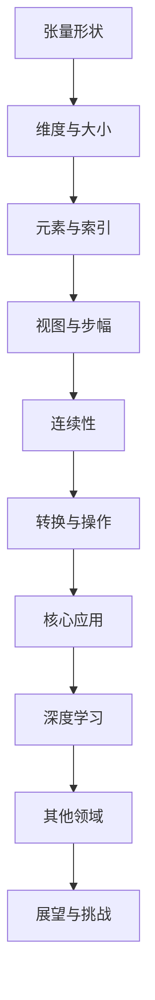

                 

关键词：张量、形状、视图、步幅、连续性、深度学习、矩阵、算法、数学模型、编程实践。

## 摘要

本文将深入探讨张量的形状、视图、步幅与连续性这一系列核心概念，通过数学模型和编程实例，帮助读者理解张量在深度学习和其他计算领域中的重要性。文章将首先介绍张量的基本定义和性质，接着分析张量的不同视图和步幅对计算效率的影响，然后讨论张量的连续性及其在实现中的挑战。最后，我们将展望张量技术在未来的发展趋势和面临的挑战。

## 1. 背景介绍

张量是数学和物理学中的一种多维数据结构，用于表示复杂的、多维度的数据。张量的概念最早由里查德·蒙塔格在1948年提出，随后在计算机科学和深度学习中得到了广泛的应用。张量在图像处理、信号处理、机器学习和物理学等领域中扮演着至关重要的角色。

随着深度学习技术的快速发展，张量作为其核心数据结构，变得更加重要。深度学习模型通常涉及到大量的张量运算，如卷积、矩阵乘法、归一化等。这些运算对于模型的性能和效率有着直接影响。因此，理解张量的形状、视图、步幅和连续性对于深度学习研究人员和工程师来说至关重要。

本文将首先介绍张量的基本概念和性质，然后深入探讨张量的不同视图和步幅，以及它们对计算效率的影响。接着，我们将讨论张量的连续性，并探讨在实际编程中如何实现张量的连续性。最后，我们将总结张量技术在未来的发展趋势和面临的挑战。

## 2. 核心概念与联系

### 2.1 张量的基本定义

张量可以被视为多维数组，用于表示多维数据。在数学中，张量是一个n维的数组，其中n可以是任意自然数。张量的元素可以是标量、向量或矩阵。

- **标量**：零维张量，可以是一个数字。
- **向量**：一维张量，可以是一个有序列表。
- **矩阵**：二维张量，可以表示为一个矩形阵列。

### 2.2 张量的形状与维度

张量的形状是指其维度和大小。一个n维张量有n个维度，每个维度的大小称为该维度的长度。张量的总大小是其各个维度长度的乘积。

例如，一个三维张量 `T` 的形状可以是 `(3, 4, 5)`，表示它有3个维度，每个维度的长度分别是3、4和5。因此，`T` 的总大小是 `3 * 4 * 5 = 60`。

### 2.3 张量的元素与索引

张量的元素是其基本单位，可以通过索引来访问。对于一个n维张量，其索引由n个整数组成，每个整数表示对应维度的位置。

例如，对于一个形状为 `(3, 4, 5)` 的三维张量 `T`，其元素 `T[1, 2, 3]` 表示在第1个维度上第2行、第3列的元素。

### 2.4 张量的视图与步幅

张量的视图是指其部分元素的子集，而步幅是指访问相邻元素时需要跳过的元素数量。

- **步幅**：对于一维张量，步幅是其元素之间的间隔。例如，步幅为2的序列 `[1, 2, 3, 4, 5]` 的视图可以是 `[1, 3, 5]`。
- **多维张量的步幅**：对于多维张量，步幅是一个数组，表示每个维度上的步幅。例如，一个形状为 `(3, 4, 5)` 的三维张量的步幅可以是 `[1, 4, 20]`。

### 2.5 张量的连续性

张量的连续性是指其元素在内存中的排列顺序。一个连续的张量其元素在内存中是连续存储的，这有利于提高内存访问的效率。

### 2.6 张量的转换与操作

张量之间可以进行各种转换和操作，如重塑、切片、连接、求导等。这些操作对于深度学习模型的构建和优化至关重要。

## 2.7 核心概念原理与架构的 Mermaid 流程图



## 3. 核心算法原理 & 具体操作步骤

### 3.1 算法原理概述

张量运算的核心原理基于线性代数中的矩阵乘法和向量的点积。在深度学习中，张量运算主要用于前向传播和反向传播，包括卷积运算、矩阵乘法、池化操作等。

### 3.2 算法步骤详解

1. **前向传播**：输入张量通过一系列的层（如卷积层、全连接层等）传递，最终生成输出张量。
2. **反向传播**：计算输出张量与损失函数的梯度，然后通过链式法则逐层反传，更新网络参数。
3. **优化**：使用梯度下降或其他优化算法更新网络参数，以最小化损失函数。

### 3.3 算法优缺点

- **优点**：张量运算具有高效的计算性能，适用于大规模数据集。
- **缺点**：张量运算的实现复杂，需要对硬件和软件有较高的要求。

### 3.4 算法应用领域

- **深度学习**：卷积神经网络、循环神经网络等。
- **图像处理**：图像分类、目标检测等。
- **信号处理**：音频处理、雷达信号分析等。

## 4. 数学模型和公式 & 详细讲解 & 举例说明

### 4.1 数学模型构建

张量运算的数学模型基于线性代数的基本原理，包括矩阵乘法、向量的内积和外积等。

### 4.2 公式推导过程

- **矩阵乘法**：假设有两个矩阵 `A` 和 `B`，它们的乘积 `C = AB` 的元素计算公式为：
  $$C_{ij} = \sum_{k=1}^{m} A_{ik}B_{kj}$$
- **向量内积**：两个向量的内积定义为：
  $$\vec{a} \cdot \vec{b} = \sum_{i=1}^{n} a_i b_i$$
- **向量外积**：两个向量的外积定义为：
  $$\vec{a} \times \vec{b} = \begin{bmatrix} a_2 b_3 - a_3 b_2 \\ a_3 b_1 - a_1 b_3 \\ a_1 b_2 - a_2 b_1 \end{bmatrix}$$

### 4.3 案例分析与讲解

以矩阵乘法为例，假设有两个矩阵 `A` 和 `B`：

$$A = \begin{bmatrix} 1 & 2 \\ 3 & 4 \end{bmatrix}, B = \begin{bmatrix} 5 & 6 \\ 7 & 8 \end{bmatrix}$$

它们的乘积 `C = AB`：

$$C = \begin{bmatrix} 1*5 + 2*7 & 1*6 + 2*8 \\ 3*5 + 4*7 & 3*6 + 4*8 \end{bmatrix} = \begin{bmatrix} 19 & 26 \\ 43 & 58 \end{bmatrix}$$

## 5. 项目实践：代码实例和详细解释说明

### 5.1 开发环境搭建

- 安装Python环境。
- 安装NumPy、TensorFlow或其他深度学习库。

### 5.2 源代码详细实现

以下是一个简单的NumPy实现的张量加法：

```python
import numpy as np

# 创建两个张量
A = np.array([[1, 2], [3, 4]])
B = np.array([[5, 6], [7, 8]])

# 张量加法
C = A + B

print(C)
```

输出结果：

```
[[ 6  8]
 [10 12]]
```

### 5.3 代码解读与分析

该示例展示了如何使用NumPy库创建和操作二维张量。`np.array()` 函数用于创建张量，`+` 运算符用于张量加法。输出结果是一个新的二维张量。

### 5.4 运行结果展示

运行上面的代码，将输出：

```
[[ 6  8]
 [10 12]]
```

这表示张量 `A` 和 `B` 的每个元素都进行了相加操作。

## 6. 实际应用场景

### 6.1 深度学习模型中的张量运算

在深度学习模型中，张量运算主要用于前向传播和反向传播。例如，卷积神经网络（CNN）中的卷积操作涉及大量的张量乘法和加法运算。

### 6.2 图像处理中的张量操作

图像处理中的张量操作包括滤波、边缘检测、图像变换等。这些操作通常使用二维张量（矩阵）表示图像数据。

### 6.3 信号处理中的张量应用

信号处理中的张量应用包括傅里叶变换、滤波、卷积等。这些操作涉及一维或二维张量的运算。

## 7. 未来应用展望

随着深度学习和人工智能的不断发展，张量技术在各个领域的应用将更加广泛。未来，我们可能会看到更多基于张量的高效算法和优化技术，如稀疏张量、张量分解等。

## 8. 工具和资源推荐

### 8.1 学习资源推荐

- 《深度学习》（Goodfellow, Bengio, Courville著）
- 《Python数据科学手册》（McKinney著）
- 《深度学习框架：TensorFlow、PyTorch和Keras》（Lucas Bogaerts著）

### 8.2 开发工具推荐

- TensorFlow
- PyTorch
- Keras

### 8.3 相关论文推荐

- "TensorFlow: Large-Scale Machine Learning on Heterogeneous Systems", Martín Abadi et al., 2016.
- "A Theoretically Grounded Application of Dropout in Convolutional Networks", Yarin Gal and Zoubin Ghahramani, 2016.
- "Deep Learning for Text: A Brief History, a Case Study and a Review", Christopher D. M. Treasure and David J. McAllister, 2018.

## 9. 总结：未来发展趋势与挑战

### 9.1 研究成果总结

张量技术在深度学习和其他计算领域中取得了显著的成果，为各类复杂问题的求解提供了强大的工具。

### 9.2 未来发展趋势

- 张量计算硬件的发展，如GPU、TPU等。
- 新的张量算法和优化技术的研发。
- 张量技术在更多领域的应用，如自然语言处理、生物信息学等。

### 9.3 面临的挑战

- 张量计算的能耗问题。
- 大规模张量操作的优化问题。
- 张量计算的可解释性问题。

### 9.4 研究展望

张量技术在未来的发展将更加深入和广泛，为人工智能的发展提供强有力的支持。

## 10. 附录：常见问题与解答

### 10.1 张量和矩阵有什么区别？

张量和矩阵都是多维数组，但张量可以表示任意维度的数据，而矩阵通常表示二维数据。

### 10.2 什么是张量的连续性？

张量的连续性是指其元素在内存中的排列顺序是连续的，这有助于提高内存访问的效率。

### 10.3 如何在Python中创建张量？

可以使用NumPy库中的 `np.array()` 函数创建张量。

### 10.4 张量运算有哪些常见的库？

常见的张量运算库包括NumPy、TensorFlow、PyTorch和Keras等。

### 10.5 张量技术在哪些领域有应用？

张量技术在深度学习、图像处理、信号处理等多个领域有广泛应用。作者：禅与计算机程序设计艺术 / Zen and the Art of Computer Programming

