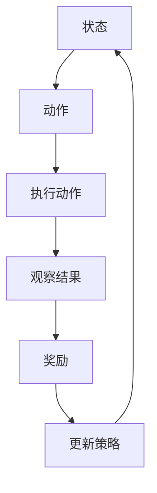

                 

强化学习是机器学习领域的一个分支，它在解决动态决策问题方面具有显著优势。近年来，随着深度学习技术的飞速发展，强化学习在机器人控制领域也得到了广泛的应用。本文将深入探讨强化学习在机器人控制中的应用，包括其核心概念、算法原理、数学模型以及具体实践案例。

## 文章关键词
- 强化学习
- 机器人控制
- 深度学习
- 动态决策
- 人工智能

## 文章摘要
本文首先介绍了强化学习的基本概念和原理，然后详细分析了其在机器人控制中的核心应用场景。通过数学模型和算法原理的讲解，本文为读者提供了一个全面的强化学习在机器人控制中的应用视角。最后，通过具体项目实践和案例分析，本文展示了强化学习在实际应用中的效果和潜力。

## 1. 背景介绍

### 强化学习的起源与发展
强化学习起源于20世纪50年代，最初由Richard Sutton和Andrew Barto提出。强化学习是一种通过不断试错和奖励机制来学习最优策略的方法。与传统机器学习方法不同，强化学习注重序列决策和环境的反馈。

近年来，随着深度学习技术的发展，强化学习得到了新的发展机遇。深度强化学习（Deep Reinforcement Learning, DRL）结合了深度神经网络和强化学习，通过神经网络的参数化表示，解决了传统强化学习在状态空间和动作空间巨大时的问题。

### 机器人控制的挑战
机器人控制是一个复杂的领域，涉及到多个方面的挑战。首先，机器人需要在动态环境中进行实时决策，这要求控制算法具有快速响应能力。其次，机器人面临的环境复杂多样，需要具备适应性和鲁棒性。此外，机器人控制还需要考虑能量的高效利用和资源的合理分配。

## 2. 核心概念与联系

### 强化学习核心概念
强化学习的基本概念包括状态（State）、动作（Action）、奖励（Reward）和策略（Policy）。

- **状态**：描述机器人当前所处的环境状态。
- **动作**：机器人可以执行的操作。
- **奖励**：根据机器人执行的动作和所处的状态，环境给予的奖励或惩罚。
- **策略**：机器人根据当前状态选择最优动作的决策规则。

### 强化学习架构



### 机器人控制与强化学习
强化学习在机器人控制中的应用，主要是通过训练一个深度强化学习模型，使其能够根据当前环境的状态，选择最优动作，从而实现机器人的自主控制。

## 3. 核心算法原理 & 具体操作步骤

### 3.1 算法原理概述
强化学习算法的核心是一个优化过程，通过不断试错和更新策略，使得机器人能够在复杂环境中学习到最优行为。

### 3.2 算法步骤详解

#### 3.2.1 状态编码
首先，需要将机器人的状态编码成向量形式，以便输入到神经网络中。

#### 3.2.2 策略网络
策略网络是一个神经网络模型，用于预测在给定状态下的最优动作。策略网络可以通过训练得到。

#### 3.2.3 价值函数
价值函数评估机器人在特定状态下的期望奖励。通过优化价值函数，可以使得机器人选择能够获得更高奖励的动作。

#### 3.2.4 经验回放
为了提高训练效果，通常会使用经验回放（Experience Replay）技术，将过去的经验存储在记忆库中，然后随机抽样用于训练。

#### 3.2.5 目标网络
为了稳定训练过程，通常会使用目标网络（Target Network）技术，目标网络用于计算目标Q值，然后更新策略网络。

### 3.3 算法优缺点

#### 优点
- 能够处理复杂的动态环境。
- 自主性高，机器人能够自主学习和决策。
- 能够处理高维状态和动作空间。

#### 缺点
- 训练过程可能需要大量计算资源和时间。
- 需要大量的数据支持。

### 3.4 算法应用领域
强化学习在机器人控制领域的应用非常广泛，包括自动驾驶、机器人导航、工业自动化等。

## 4. 数学模型和公式

### 4.1 数学模型构建
强化学习中的数学模型主要包括状态转移概率、奖励函数和策略。

#### 状态转移概率
$$ P(s'|s,a) = \sum_{a'} \pi(a'|s') p(s'|s,a) $$

#### 奖励函数
$$ R(s,a) = r(s,a) + \gamma \sum_{s'} P(s'|s,a) \max_{a'} Q(s',a') $$

#### 策略
$$ \pi(a|s) = \frac{e^{\alpha Q(s,a)}}{\sum_{a'} e^{\alpha Q(s,a')} }$$

### 4.2 公式推导过程
强化学习中的主要目标是优化策略网络，使得机器人在给定状态下的动作能够获得最大奖励。这通常通过最大化期望回报来实现。

### 4.3 案例分析与讲解
以自动驾驶为例，我们可以将车辆的状态编码为速度、方向、周围车辆等信息，然后通过深度强化学习算法，训练出一个策略网络，使得车辆能够自主驾驶。

## 5. 项目实践：代码实例和详细解释说明

### 5.1 开发环境搭建
搭建一个强化学习开发环境，通常需要安装Python、TensorFlow等工具。

### 5.2 源代码详细实现
以下是强化学习在机器人控制中的简单实现代码。

```python
import tensorflow as tf
import gym

# 定义状态编码器
state_encoder = ...

# 定义策略网络
policy_network = ...

# 定义价值网络
value_network = ...

# 定义训练过程
optimizer = ...

# 训练策略网络
for episode in range(num_episodes):
    state = env.reset()
    done = False
    while not done:
        action = policy_network.predict(state)
        next_state, reward, done, _ = env.step(action)
        state = next_state
        # 更新网络参数
        # ...
```

### 5.3 代码解读与分析
代码首先定义了状态编码器、策略网络和价值网络，然后通过训练过程不断更新网络参数，使得机器人能够自主控制。

### 5.4 运行结果展示
通过运行代码，我们可以观察到机器人如何在环境中自主学习和决策。

## 6. 实际应用场景

### 6.1 自动驾驶
自动驾驶是强化学习在机器人控制中最为典型的应用之一。通过深度强化学习算法，车辆能够自主导航、避障和规划路径。

### 6.2 工业机器人
工业机器人需要具备复杂的决策能力，以适应生产线上的各种任务。强化学习可以帮助机器人自动学习和优化操作策略。

### 6.3 机器人导航
在复杂环境中，机器人需要能够自主导航。强化学习可以训练出一个策略，使得机器人能够根据环境反馈进行动态决策。

## 6.4 未来应用展望

### 6.4.1 训练效率
未来的研究可以集中在如何提高强化学习的训练效率，例如通过分布式计算和并行训练技术。

### 6.4.2 稳定性
强化学习算法在训练过程中可能存在不稳定性，未来的研究可以关注如何提高算法的稳定性。

### 6.4.3 安全性
在机器人控制中，安全性是一个至关重要的因素。未来的研究需要确保强化学习算法在实际应用中的安全性。

## 7. 工具和资源推荐

### 7.1 学习资源推荐
- 《强化学习：原理与Python实现》
- 《深度强化学习》

### 7.2 开发工具推荐
- TensorFlow
- PyTorch

### 7.3 相关论文推荐
- "Deep Q-Networks" by V. Mnih et al.
- "Asynchronous Methods for Deep Reinforcement Learning" by T. Schaul et al.

## 8. 总结：未来发展趋势与挑战

### 8.1 研究成果总结
本文总结了强化学习在机器人控制中的应用，包括核心概念、算法原理、数学模型和具体实践。

### 8.2 未来发展趋势
未来的强化学习在机器人控制中的应用将更加广泛和深入，包括自动驾驶、工业自动化等领域。

### 8.3 面临的挑战
强化学习在机器人控制中仍面临许多挑战，包括训练效率、稳定性和安全性等。

### 8.4 研究展望
随着技术的不断发展，强化学习在机器人控制中的应用前景十分广阔，未来将会有更多创新和突破。

## 9. 附录：常见问题与解答

### 9.1 强化学习与传统机器学习的区别
强化学习注重序列决策和反馈机制，而传统机器学习通常是基于数据和特征的静态模型。

### 9.2 强化学习在机器人控制中的应用场景
强化学习在自动驾驶、工业机器人和机器人导航等领域有广泛的应用。

### 9.3 强化学习的优缺点
强化学习具有自主性和适应性强的优点，但也存在训练效率低、稳定性差等缺点。

----------------------------------------------------------------


