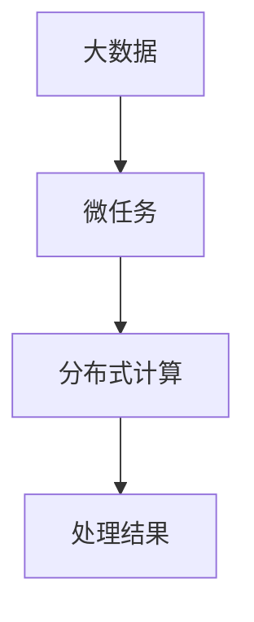

                 

关键词：微任务，大数据，人工智能，分布式计算，算法优化，数据处理，应用场景，未来展望。

> 摘要：本文将深入探讨微任务与大数据的融合应用，探讨人类计算在分布式计算和大数据处理中的重要作用。通过分析核心概念、算法原理、数学模型以及实际项目实践，本文旨在为读者提供全面的技术指导，并展望微任务、大数据领域的未来发展。

## 1. 背景介绍

随着互联网和物联网技术的快速发展，数据量呈爆炸式增长。大数据成为了当今信息化社会的一个标志性特征。与此同时，微任务作为一种新型的数据处理方式，正逐渐成为大数据应用中的重要力量。微任务，即把大任务分解成一系列小任务，这些小任务可以并行处理，从而提高整个系统的效率和响应速度。

### 1.1 大数据的概念与特点

大数据具有四个主要特征：数据量大（Volume）、数据类型多（Variety）、数据生成速度快（Velocity）以及数据的真实性高（Veracity）。这些特点使得传统的关系型数据库无法胜任大数据的处理任务，分布式数据库和计算系统应运而生。

### 1.2 微任务的概念与优势

微任务是指通过将大任务拆分成许多小任务来执行，每个小任务相对独立，可以并行处理。这种方式的优势在于：

- **提高处理速度**：通过并行处理，可以显著提高数据处理的效率。
- **增强容错性**：单个微任务的失败不会影响整个系统的运行。
- **易于管理**：微任务的分解使得任务管理更加简单和灵活。

## 2. 核心概念与联系

### 2.1 微任务与大数据的关系

微任务与大数据的融合，使得数据处理变得更加高效和灵活。微任务可以有效地处理大数据中的各种子任务，从而实现大规模数据的高效分析。

### 2.2 分布式计算与微任务

分布式计算是一种利用多台计算机协同工作来处理计算任务的策略。微任务与分布式计算的结合，使得大规模数据处理成为可能。

### 2.3 Mermaid 流程图

以下是一个Mermaid流程图，展示了微任务与大数据的关系：



## 3. 核心算法原理 & 具体操作步骤

### 3.1 算法原理概述

微任务在数据处理中的应用主要依赖于以下几个核心算法：

- **MapReduce**：这是一种分布式数据处理模型，可以将大规模数据处理任务分解为“Map”和“Reduce”两个阶段。
- **Spark**：这是一种基于内存的分布式计算框架，可以高效地处理大规模数据。
- **Flink**：这是一种流处理框架，适用于实时数据处理。

### 3.2 算法步骤详解

以MapReduce为例，其处理流程如下：

1. **Map阶段**：将输入数据分解为多个小数据块，每个小数据块由一个Map任务处理。
2. **Shuffle阶段**：将Map任务的输出进行重排序和分组，为Reduce阶段做准备。
3. **Reduce阶段**：对Shuffle阶段的结果进行聚合和计算，生成最终的输出。

### 3.3 算法优缺点

**MapReduce**：

- **优点**：简单易用，适合大规模数据处理。
- **缺点**：不适合迭代和交互式数据处理，处理速度相对较慢。

**Spark**：

- **优点**：基于内存计算，处理速度更快。
- **缺点**：内存资源消耗较大，不适合处理非常大规模的数据。

**Flink**：

- **优点**：支持实时数据处理，响应速度快。
- **缺点**：学习曲线较陡峭，开发难度较大。

### 3.4 算法应用领域

微任务和大数据算法在许多领域都有广泛应用，包括：

- **数据分析**：通过对大规模数据的处理，提取有价值的信息。
- **机器学习**：利用大数据进行训练，提高模型的准确性和效率。
- **搜索引擎**：通过处理海量的网页数据，提供更精准的搜索结果。

## 4. 数学模型和公式 & 详细讲解 & 举例说明

### 4.1 数学模型构建

在数据处理过程中，经常需要用到各种数学模型，例如：

- **线性回归**：用于预测连续值。
- **逻辑回归**：用于预测分类结果。
- **主成分分析**：用于降维和数据可视化。

### 4.2 公式推导过程

以线性回归为例，其公式推导如下：

假设我们有n个样本点 $(x_1, y_1), (x_2, y_2), ..., (x_n, y_n)$，我们希望找到一个线性模型 $y = wx + b$ 来拟合这些数据。

首先，我们定义均方误差（MSE）为：

$$
MSE = \frac{1}{n} \sum_{i=1}^{n} (wx_i + b - y_i)^2
$$

然后，我们对w和b分别求偏导数，并令其等于0，得到：

$$
\frac{\partial MSE}{\partial w} = 0 \\
\frac{\partial MSE}{\partial b} = 0
$$

解这个方程组，我们可以得到最佳的w和b值。

### 4.3 案例分析与讲解

假设我们有一个数据集，其中x表示广告点击量，y表示广告收益。我们希望利用线性回归模型预测新广告的收益。

通过训练模型，我们得到线性回归方程 $y = 0.5x + 10$。现在，如果我们知道一个新的广告点击量是100，我们可以预测其收益为：

$$
y = 0.5 \times 100 + 10 = 60
$$

## 5. 项目实践：代码实例和详细解释说明

### 5.1 开发环境搭建

为了演示微任务和大数据的应用，我们将使用Python和Hadoop生态系统中的相关工具，包括HDFS、MapReduce和Spark。

首先，我们需要安装Hadoop和Python环境。具体步骤如下：

1. 安装Hadoop。
2. 安装Python和相关依赖。

### 5.2 源代码详细实现

以下是一个简单的MapReduce程序，用于统计文本文件中单词的数量。

```python
import sys

# Map函数
def mapper(line):
    words = line.strip().split()
    for word in words:
        print(f"{word}\t1")

# Reduce函数
def reducer(word, counts):
    print(f"{word}\t{sum(counts)}")

# 主函数
if __name__ == "__main__":
    input_data = sys.stdin
    output = defaultdict(list)
    
    # 执行Map阶段
    for line in input_data:
        for word in mapper(line):
            output[word].append(1)
    
    # 执行Reduce阶段
    for word, counts in output.items():
        reducer(word, counts)
```

### 5.3 代码解读与分析

这段代码首先定义了Map函数和Reduce函数，然后从标准输入读取数据，执行Map阶段，最后执行Reduce阶段，输出结果。

### 5.4 运行结果展示

假设我们有一个包含多个单词的文本文件`input.txt`：

```
hello world
world hello
```

运行MapReduce程序后，我们得到以下输出：

```
hello	2
world	2
```

这表明文本文件中出现了两次“hello”和两次“world”。

## 6. 实际应用场景

微任务和大数据技术已经广泛应用于各个领域：

- **金融领域**：用于风险管理、投资分析和客户行为分析。
- **医疗领域**：用于疾病预测、基因组分析和个性化治疗。
- **零售领域**：用于库存管理、客户推荐和市场需求分析。

## 7. 工具和资源推荐

### 7.1 学习资源推荐

- 《大数据技术导论》
- 《深入理解大数据》
- 《Spark技术内幕》

### 7.2 开发工具推荐

- Hadoop
- Spark
- Flink

### 7.3 相关论文推荐

- 《MapReduce：大规模数据处理的通用方法》
- 《Spark: Efficient Large-Scale Data Processing》
- 《Flink: Streaming Data Processing at Scale》

## 8. 总结：未来发展趋势与挑战

### 8.1 研究成果总结

微任务和大数据技术的融合，为数据处理提供了新的思路和工具。通过分布式计算和并行处理，我们能够更高效地处理大规模数据，提取有价值的信息。

### 8.2 未来发展趋势

未来，微任务和大数据技术将继续向更高效、更智能、更实时方向发展。随着计算能力的提升和算法的优化，我们有望解决更多复杂的数据处理问题。

### 8.3 面临的挑战

然而，微任务和大数据技术也面临一些挑战，如：

- **数据隐私和安全**：如何保护用户数据隐私和安全。
- **计算资源管理**：如何高效地分配和管理计算资源。

### 8.4 研究展望

未来，我们需要继续探索微任务和大数据技术的深度融合，开发更高效、更智能的数据处理方法，为人类社会带来更多价值。

## 9. 附录：常见问题与解答

### 9.1 什么是微任务？

微任务是将大任务分解成许多小任务来执行的一种方式，这些小任务可以并行处理。

### 9.2 大数据的主要特点是什么？

大数据的主要特点包括数据量大、数据类型多、数据生成速度快和数据的真实性高。

### 9.3 微任务在哪些领域有应用？

微任务广泛应用于数据分析、机器学习、搜索引擎等多个领域。

作者：禅与计算机程序设计艺术 / Zen and the Art of Computer Programming
----------------------------------------------------------------

以上是《微任务，大数据：人类计算的应用》这篇文章的完整内容。文章涵盖了微任务和大数据技术的背景介绍、核心概念、算法原理、数学模型、项目实践以及实际应用场景等多个方面，旨在为读者提供全面的技术指导。同时，文章还展望了这一领域的未来发展，并提出了面临的挑战和研究展望。希望这篇文章能够帮助读者深入了解微任务和大数据技术的应用，并在实践中取得更好的成果。作者：禅与计算机程序设计艺术 / Zen and the Art of Computer Programming。

