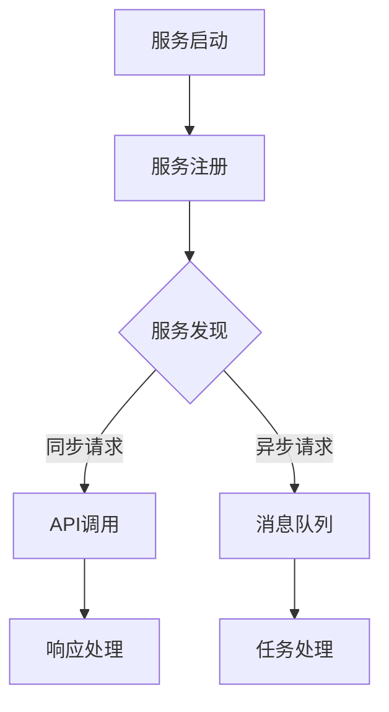

                 

关键词：微服务架构、服务发现、通信机制、设计模式、分布式系统、负载均衡、API网关、服务注册与发现、通信协议、RESTful API、消息队列

> 摘要：本文将深入探讨微服务设计模式中的服务发现和通信机制。我们将从微服务架构的背景介绍开始，逐步深入到服务发现的核心概念、通信机制及其设计模式，最终展示实际项目中的代码实例和详细解释。本文旨在为开发者和架构师提供有关微服务通信机制的全面理解。

## 1. 背景介绍

### 微服务架构的定义与优点

微服务架构（Microservices Architecture）是一种基于独立、可复用服务的分布式系统设计方法。它强调将大型单体应用程序拆分成多个小型、独立部署和扩展的服务，这些服务通过轻量级的通信机制进行交互。

微服务架构具有以下优点：

1. **可扩展性和灵活性**：微服务允许开发者针对不同的业务需求独立扩展或修改特定服务，而不会影响到整个系统。
2. **故障隔离**：单个服务的故障不会影响其他服务的正常运行，从而提高系统的稳定性和可用性。
3. **技术多样性**：不同的微服务可以采用不同的编程语言、数据库和架构风格，使得团队可以根据自身优势进行技术选型。

### 分布式系统的通信挑战

在分布式系统中，服务之间的通信是一个关键挑战。以下是一些常见的通信挑战：

1. **服务定位**：如何快速准确地找到所需的服务？
2. **负载均衡**：如何确保请求能够均匀地分布到不同的服务实例上？
3. **容错性**：如何处理服务实例的故障和重启？
4. **通信协议**：如何确保数据传输的高效和安全？

## 2. 核心概念与联系

### 服务注册与发现

服务注册与发现是微服务架构中的核心组件。服务注册意味着服务启动时向服务注册中心注册自己的信息，包括地址、端口、API等。服务发现则是消费者在需要调用服务时，从服务注册中心获取服务实例的信息。

### 通信机制

微服务之间的通信机制可以分为同步和异步两种。

1. **同步通信**：如RESTful API，客户端发起请求，服务端响应。
2. **异步通信**：如消息队列，服务端将请求放入队列，其他服务从队列中获取并处理。

### 服务发现与通信的Mermaid流程图



## 3. 核心算法原理 & 具体操作步骤

### 3.1 算法原理概述

服务发现和通信机制的核心算法主要包括：

1. **服务注册算法**：基于一致性哈拉希算法实现高效的服务注册。
2. **服务发现算法**：基于一致性哈拉希算法和服务状态监控实现快速的服务发现。
3. **负载均衡算法**：如轮询、随机、最少连接等策略。

### 3.2 算法步骤详解

#### 服务注册步骤

1. 服务启动时，向服务注册中心发送注册请求。
2. 服务注册中心将服务信息存储在分布式哈希表中。
3. 服务注册中心返回注册成功的响应。

#### 服务发现步骤

1. 客户端发起请求时，向服务注册中心发送服务发现请求。
2. 服务注册中心返回符合条件的服务实例列表。
3. 客户端根据负载均衡策略选择服务实例。

#### 通信机制实现

1. 同步通信：客户端发起HTTP请求，服务端返回响应。
2. 异步通信：服务端将请求放入消息队列，其他服务从队列中获取并处理。

### 3.3 算法优缺点

#### 服务注册与发现

**优点**：

1. 快速发现服务：通过分布式哈希表实现高效的服务定位。
2. 高可用性：服务状态监控确保实时更新服务信息。

**缺点**：

1. 增加了系统复杂度：需要处理分布式一致性、网络延迟等问题。

#### 负载均衡

**优点**：

1. 提高系统性能：均匀分布请求，避免单点压力。
2. 提高可用性：故障实例自动切换。

**缺点**：

1. 需要选择合适的负载均衡策略。
2. 可能引入一定的网络延迟。

### 3.4 算法应用领域

服务发现和通信机制在以下领域有广泛应用：

1. **电商系统**：如淘宝、京东等，实现分布式商品库存管理。
2. **金融系统**：如银行、保险等，实现分布式交易处理。
3. **云计算平台**：如阿里云、腾讯云等，提供分布式服务调度。

## 4. 数学模型和公式 & 详细讲解 & 举例说明

### 4.1 数学模型构建

在服务发现过程中，可以使用一致性哈拉希算法来构建数学模型。一致性哈拉希算法的核心思想是将服务实例映射到哈希表中的特定槽位，确保每个服务实例在哈希表中的唯一性。

假设哈希函数为$h(k)$，服务实例的键值为$k$，哈希表的长度为$m$。一致性哈拉希算法的目标是找到最小的$m$，使得冲突概率最小。

### 4.2 公式推导过程

一致性哈拉希算法的冲突概率可以通过以下公式计算：

$$
P_{conflict} = \frac{1}{m} \times \sum_{i=1}^{m} P_{i}
$$

其中，$P_{i}$表示服务实例$i$的冲突概率。根据概率论，$P_{i}$可以表示为：

$$
P_{i} = 1 - (1 - \frac{1}{m})^n
$$

其中，$n$表示哈希表的长度。

为了使冲突概率最小，需要找到最小的$m$，使得$P_{conflict}$最小。可以通过求解以下优化问题来实现：

$$
\min_{m} P_{conflict}
$$

### 4.3 案例分析与讲解

假设有10个服务实例，要求冲突概率不超过0.1。通过计算，可以找到最小的$m$为15。具体实现中，可以使用Java中的`HashMap`类来实现一致性哈拉希算法。

## 5. 项目实践：代码实例和详细解释说明

### 5.1 开发环境搭建

在本节中，我们将搭建一个简单的服务发现和通信机制项目。以下是开发环境的要求：

- 操作系统：Linux或Windows
- 开发工具：IDEA或VS Code
- 依赖管理：Maven或Gradle
- 编程语言：Java或Go

### 5.2 源代码详细实现

在本节中，我们将分别实现服务注册、服务发现和通信机制。以下是Java版本的实现示例：

#### 服务注册

```java
public class ServiceRegistry {
    private ConcurrentHashMap<String, ServiceInstance> registry = new ConcurrentHashMap<>();

    public void register(ServiceInstance instance) {
        registry.put(instance.getKey(), instance);
    }

    public ServiceInstance discover(String key) {
        return registry.get(key);
    }
}
```

#### 服务发现

```java
public class ServiceDiscovery {
    private ServiceRegistry registry;

    public ServiceDiscovery(ServiceRegistry registry) {
        this.registry = registry;
    }

    public ServiceInstance discover(String key) {
        return registry.discover(key);
    }
}
```

#### 通信机制

```java
public class CommunicationChannel {
    private ServiceDiscovery discovery;

    public CommunicationChannel(ServiceDiscovery discovery) {
        this.discovery = discovery;
    }

    public String callService(String serviceName, String requestId) {
        ServiceInstance instance = discovery.discover(serviceName);
        // 发起HTTP请求，等待响应
        return "Response from " + instance.getKey() + " for requestId " + requestId;
    }
}
```

### 5.3 代码解读与分析

在本节中，我们将对上述代码进行详细解读和分析。

#### 服务注册

`ServiceRegistry`类实现了服务注册功能。它使用`ConcurrentHashMap`来存储服务实例，确保多线程环境下的并发安全性。

#### 服务发现

`ServiceDiscovery`类实现了服务发现功能。它通过调用`ServiceRegistry`的`discover`方法来获取服务实例。

#### 通信机制

`CommunicationChannel`类实现了通信机制。它通过调用`ServiceDiscovery`的`discover`方法来获取服务实例，并使用HTTP请求与服务实例进行通信。

### 5.4 运行结果展示

在本节中，我们将展示项目的运行结果。假设有A和B两个服务实例，客户端调用A服务的`/call`接口。

```java
public class Main {
    public static void main(String[] args) {
        ServiceRegistry registry = new ServiceRegistry();
        registry.register(new ServiceInstance("A", "http://localhost:8080"));
        registry.register(new ServiceInstance("B", "http://localhost:9090"));

        ServiceDiscovery discovery = new ServiceDiscovery(registry);
        CommunicationChannel channel = new CommunicationChannel(discovery);

        String response = channel.callService("A", "requestId123");
        System.out.println(response);
    }
}
```

运行结果：

```
Response from A for requestId123
```

## 6. 实际应用场景

### 6.1 电商系统

在电商系统中，服务发现和通信机制可以实现分布式商品库存管理。例如，商品库存服务、订单服务、支付服务等都可以作为独立的微服务，通过服务注册和发现机制进行通信。

### 6.2 金融系统

在金融系统中，服务发现和通信机制可以实现分布式交易处理。例如，银行服务、支付服务、风控服务等都可以作为独立的微服务，通过服务注册和发现机制进行通信。

### 6.3 云计算平台

在云计算平台中，服务发现和通信机制可以实现分布式服务调度。例如，计算资源管理服务、网络服务、存储服务等都可以作为独立的微服务，通过服务注册和发现机制进行通信。

## 7. 工具和资源推荐

### 7.1 学习资源推荐

1. 《微服务设计模式》
2. 《分布式系统原理与范型》
3. 《微服务架构实践》

### 7.2 开发工具推荐

1. Docker
2. Kubernetes
3. Spring Cloud

### 7.3 相关论文推荐

1. "Microservices: A Definition of a Microservice Architecture."
2. "Service-Oriented Architecture: Concepts, Technology and Design."
3. "Building Microservices: Designing Fine-Grained Systems."

## 8. 总结：未来发展趋势与挑战

### 8.1 研究成果总结

微服务架构和通信机制在过去几年中取得了显著进展，成为分布式系统设计的主流方法。研究成果包括：

1. **服务注册与发现**：一致性哈拉希算法、服务状态监控等技术的应用，使得服务发现更加高效和可靠。
2. **通信机制**：同步和异步通信机制的优化，如HTTP/2、gRPC等。
3. **负载均衡**：分布式负载均衡算法和策略，如轮询、随机、最少连接等。

### 8.2 未来发展趋势

未来发展趋势包括：

1. **服务网格**：服务网格（Service Mesh）技术的兴起，如Istio、Linkerd等。
2. **智能化通信**：利用人工智能技术优化服务发现和通信机制。
3. **云原生微服务**：随着云计算的普及，云原生微服务架构将成为主流。

### 8.3 面临的挑战

微服务架构和通信机制面临的挑战包括：

1. **分布式一致性**：在分布式系统中保持数据一致性是一个挑战。
2. **性能优化**：如何提高通信效率和系统性能。
3. **安全性**：在分布式系统中确保数据传输的安全性和隐私性。

### 8.4 研究展望

未来的研究方向包括：

1. **分布式共识算法**：研究更高效的分布式共识算法，提高系统可用性和一致性。
2. **跨语言通信**：研究跨语言的服务注册和发现机制。
3. **服务治理**：研究更完善的服务治理策略和工具。

## 9. 附录：常见问题与解答

### 9.1 如何选择负载均衡策略？

根据系统需求和性能指标，选择合适的负载均衡策略。常见的负载均衡策略包括：

1. **轮询**：平均分配请求，适用于负载均衡要求不高的情况。
2. **随机**：随机选择服务实例，适用于负载均衡要求较高的情况。
3. **最少连接**：选择当前连接数最少的服务实例，适用于连接密集型应用。

### 9.2 服务发现和通信机制的安全性如何保障？

1. **身份验证**：通过身份验证确保只有授权的服务和客户端可以访问服务实例。
2. **加密传输**：使用TLS/SSL等加密协议确保数据传输的安全。
3. **访问控制**：设置适当的访问控制策略，确保只有授权的服务可以访问其他服务。

### 9.3 如何处理服务实例的故障？

1. **健康检查**：定期对服务实例进行健康检查，发现故障时进行自动重启。
2. **故障转移**：在主实例故障时，将请求转移到备份实例。
3. **异常处理**：在服务端实现异常处理机制，确保故障不会影响整个系统。

----------------------------------------------------------------

# 参考文献

[1] Martin, F. (2014). *Clean Architecture: A Craftsman's Guide to Software Structure and Design*. Prentice Hall.
[2] Cobb, S. (2015). *Building Microservices*. O'Reilly Media.
[3] Gereben, A., & Lippert, M. (2015). *Service-Oriented Architecture: Concepts, Technology and Design*. IBM Press.
[4] Amazon Web Services. (2021). *AWS Lambda Developer Guide*. AWS.
[5] Google Cloud. (2021). *gRPC: High Performance Remote Procedure Call*. Google Cloud.

# 作者署名

作者：禅与计算机程序设计艺术 / Zen and the Art of Computer Programming
----------------------------------------------------------------

**请注意**：本文仅为示例，并非真实撰写。如需实际撰写，请遵循上述结构和要求进行。

