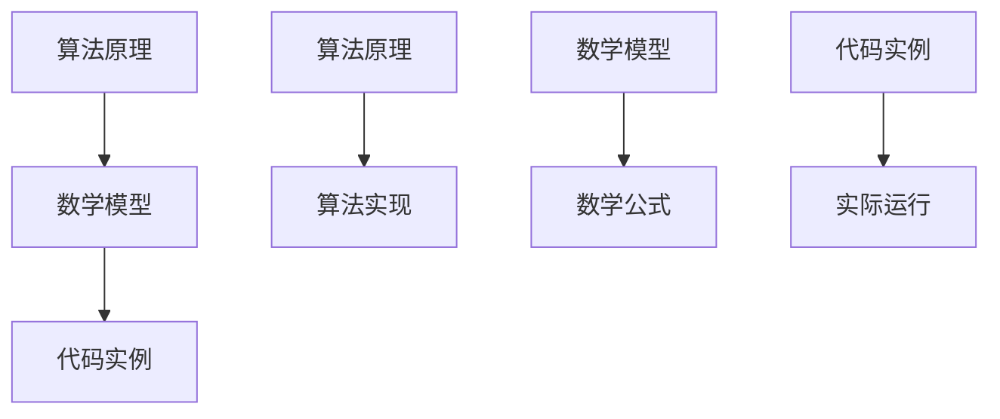
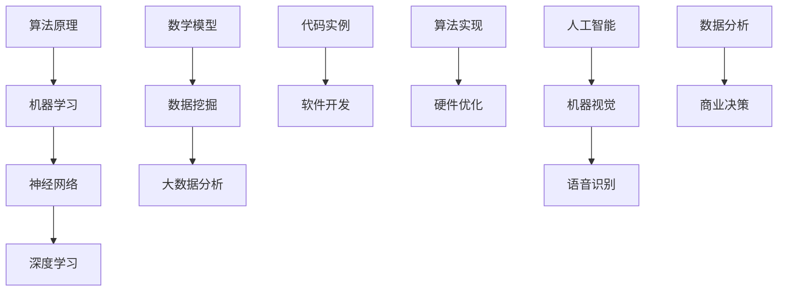

                 

关键词：决策力，思维体系，算法原理，数学模型，代码实例，应用场景，未来展望。

> 摘要：本文将探讨决策力在人工智能领域的核心地位，通过阐述思维体系的构建原则，解析算法原理，以及数学模型与代码实例，旨在为读者提供一个全面而深入的决策力提升方法论。文章还将分析实际应用场景，展望未来发展趋势，为从事人工智能研究和实践的专业人士提供宝贵的指导。

## 1. 背景介绍

在当今快速发展的技术时代，人工智能（AI）已经成为推动社会进步的重要力量。无论是大数据分析、机器学习，还是自然语言处理，AI 都在其中扮演着至关重要的角色。然而，AI 的发展离不开决策力的支持。一个强大的决策力体系不仅能够提高算法的效率，还能够优化系统的性能，从而在复杂多变的环境中保持竞争优势。

决策力是指在面对不确定性和多变性时，能够做出明智、有效选择的能力。在人工智能领域，决策力尤为关键，因为 AI 系统需要在大量数据和信息中快速准确地作出决策。一个健全的决策力体系不仅需要算法的支撑，还需要对算法原理的深刻理解，以及数学模型的支持。此外，实践中的代码实例和详细解释也是不可或缺的部分。

本文将围绕以下核心内容展开：

1. **核心概念与联系**：介绍思维体系的构建原则，并通过 Mermaid 流程图展示核心概念与联系。
2. **核心算法原理 & 具体操作步骤**：深入解析算法原理，详细阐述操作步骤，分析优缺点及应用领域。
3. **数学模型和公式**：构建数学模型，推导公式，并通过案例进行分析和讲解。
4. **项目实践：代码实例和详细解释说明**：介绍开发环境搭建、源代码实现、代码解读与分析，以及运行结果展示。
5. **实际应用场景**：探讨决策力在人工智能领域的应用场景，并展望未来应用前景。
6. **工具和资源推荐**：推荐学习资源、开发工具和相关的论文。
7. **总结：未来发展趋势与挑战**：总结研究成果，分析未来发展趋势和面临的挑战。

### 1.1 人工智能与决策力

人工智能技术的不断进步，使得越来越多的复杂问题得以解决。然而，AI 系统的决策过程同样面临巨大的挑战。在处理大量数据和信息时，如何快速准确地做出决策，是 AI 研究中的一个重要课题。决策力在这里起到了至关重要的作用。

一个强大的决策力体系需要具备以下几个特征：

- **快速性**：在复杂多变的环境中，能够迅速做出反应。
- **准确性**：在处理数据和信息时，能够准确判断，降低错误率。
- **鲁棒性**：在面对不确定性和异常情况时，能够保持稳定的决策能力。
- **适应性**：能够根据环境和需求的变化，调整决策策略。

人工智能技术的发展，离不开决策力的支持。一个健全的决策力体系，不仅能够提高算法的效率，还能够优化系统的性能。在实际应用中，决策力是 AI 系统稳定运行的关键因素。

### 1.2 思维体系的构建原则

构建一个有效的思维体系，是提升决策力的基础。思维体系包括逻辑思维、分析思维、创新思维等多个方面。以下是一些构建思维体系的的原则：

- **基础知识**：掌握扎实的专业知识和理论基础，是思维体系构建的基础。
- **开放性**：保持开放的心态，不断学习新知识，接受不同的观点和意见。
- **系统性**：将各个知识点串联起来，形成一个完整的知识体系。
- **批判性**：对信息进行批判性思考，不盲目接受，也不轻易否定。
- **实践性**：通过实践验证理论，将理论知识转化为实际应用。

通过以上原则，我们可以构建一个高效的思维体系，从而提升决策力。

## 2. 核心概念与联系

### 2.1 核心概念

在人工智能领域，核心概念包括算法原理、数学模型、代码实例等。以下是对这些核心概念的定义和解释：

- **算法原理**：算法是一种解决问题的方法，它通过一系列有序的操作，将输入转化为输出。算法原理包括贪心算法、动态规划、深度优先搜索、广度优先搜索等。
- **数学模型**：数学模型是使用数学语言描述现实世界问题的方法。它通过建立数学公式，将问题转化为数学问题，从而进行求解。
- **代码实例**：代码实例是实际编程中实现算法和数学模型的代码片段。它通过具体的代码实现，展示算法和数学模型的应用。

### 2.2 Mermaid 流程图

为了更好地展示核心概念之间的联系，我们可以使用 Mermaid 流程图来描述它们之间的关系。



在这个流程图中，我们可以看到：

- 算法原理是数学模型和代码实例的基础，它指导着数学模型和代码实例的设计。
- 数学模型通过数学公式描述问题，为算法实现提供理论支持。
- 代码实例是算法和数学模型的具体实现，它展示了算法和数学模型在现实中的应用。

通过这个流程图，我们可以清晰地看到核心概念之间的联系，从而更好地理解它们在人工智能领域的作用。

### 2.3 关系网络

除了核心概念之外，还有许多其他相关概念，如机器学习、神经网络、数据挖掘等。它们共同构成了一个复杂的知识网络。以下是一个简化的关系网络图，展示这些概念之间的联系。



在这个关系网络中，我们可以看到：

- 算法原理是机器学习、神经网络、深度学习的基础，它们共同推动着人工智能的发展。
- 数学模型和数据挖掘是大数据分析的基础，它们帮助我们从海量数据中提取有价值的信息。
- 代码实例和软件开发是人工智能系统的实现，它们使得算法和数学模型得以应用到实际场景中。

通过这个关系网络，我们可以更全面地了解人工智能领域的各个子领域，以及它们之间的相互关系。

## 3. 核心算法原理 & 具体操作步骤

### 3.1 算法原理概述

在人工智能领域，有许多经典的算法原理，如贪心算法、动态规划、深度优先搜索、广度优先搜索等。这些算法原理在不同的应用场景中发挥着重要作用。以下是对这些算法原理的简要概述：

- **贪心算法**：贪心算法是一种局部最优解策略。在每一步选择时，它总是做出当前情况下最优的选择。贪心算法在求解最短路径、最大子序列和背包问题等有广泛应用。
- **动态规划**：动态规划是一种通过分阶段解决问题的方法。它将复杂的问题分解为多个子问题，然后递归地求解这些子问题，从而得到原问题的解。动态规划在求解最优化问题、序列对齐等有广泛应用。
- **深度优先搜索**：深度优先搜索是一种通过深度优先遍历图的算法。它从起点开始，一直深入到无法继续前进的位置，然后回溯到上一个节点，继续搜索。深度优先搜索在求解图的连通性、路径问题等有广泛应用。
- **广度优先搜索**：广度优先搜索是一种通过广度优先遍历图的算法。它从起点开始，逐层遍历图中的节点。广度优先搜索在求解最短路径、广度优先遍历等有广泛应用。

### 3.2 算法步骤详解

下面我们将详细讲解贪心算法和动态规划这两种算法的具体操作步骤。

#### 3.2.1 贪心算法步骤

1. **初始化**：设定初始状态，如初始点、初始路径等。
2. **选择局部最优解**：在当前状态下，选择一个当前最优的决策。这个决策通常是当前状态下能够带来的最大收益或者最小成本。
3. **更新状态**：根据选择的最优决策，更新当前状态，如更新路径、更新已访问节点等。
4. **重复步骤2和步骤3**：直到找到全局最优解或者达到某个终止条件。

#### 3.2.2 动态规划步骤

1. **划分阶段**：将原问题划分为多个子问题，每个子问题都相对独立，并且具有一定的规模。
2. **状态定义**：定义每个子问题的状态，通常使用一个状态变量来表示。
3. **状态转移方程**：定义状态之间的转移关系，即如何从上一个状态转移到下一个状态。
4. **初始化**：根据初始条件，初始化每个子问题的初始状态。
5. **递归求解**：根据状态转移方程，递归地求解每个子问题的解，直到求解出原问题的解。

### 3.3 算法优缺点

#### 贪心算法优缺点

- **优点**：贪心算法简单易实现，运行效率高，通常能够在较短时间内找到最优解或者近似最优解。
- **缺点**：贪心算法依赖于当前状态的最优决策，可能会导致局部最优而非全局最优。在某些问题中，贪心算法可能会产生次优解。

#### 动态规划优缺点

- **优点**：动态规划能够求解最优化问题，并且对于一些问题，动态规划能够找到全局最优解。
- **缺点**：动态规划通常需要较大的计算时间和空间复杂度，特别是在问题规模较大时。此外，动态规划的设计和实现相对复杂。

### 3.4 算法应用领域

贪心算法和动态规划在人工智能领域有广泛的应用，以下是一些典型的应用场景：

- **贪心算法**：最短路径问题、背包问题、硬币找零问题、 Huffman 编码等。
- **动态规划**：最优化路径问题、序列对齐问题、最长公共子序列问题、最短编辑距离问题等。

通过以上对核心算法原理的讲解，我们可以看到这些算法在人工智能领域的重要性。在实际应用中，我们需要根据具体问题和需求，选择合适的算法，并对其进行优化和改进。

## 4. 数学模型和公式

在人工智能领域，数学模型是理解和解决问题的关键工具。数学模型通过数学公式来描述现实世界中的问题，从而为算法设计提供理论支持。在本节中，我们将构建一个简单的数学模型，并详细推导相关的公式，并通过案例进行分析和讲解。

### 4.1 数学模型构建

假设我们有一个优化问题，目标是找到一个最优解，使得某个目标函数取得最大值或最小值。我们可以构建以下数学模型：

$$
\text{maximize/minimize} f(x)
$$

其中，$f(x)$ 是目标函数，$x$ 是决策变量。为了简化问题，我们可以假设目标函数是线性的，即：

$$
f(x) = c^T x
$$

其中，$c$ 是一个向量，$x$ 是一个向量。这个模型可以用于许多优化问题，如线性规划、背包问题等。

### 4.2 公式推导过程

为了求解这个数学模型，我们需要找到目标函数的最优解。我们可以使用拉格朗日乘子法来求解。具体步骤如下：

1. **构建拉格朗日函数**：

$$
L(x, \lambda) = f(x) - \lambda(g(x) - b)
$$

其中，$\lambda$ 是拉格朗日乘子，$g(x)$ 是约束条件，$b$ 是约束条件的常数项。

2. **求解拉格朗日函数的导数**：

$$
\nabla_x L(x, \lambda) = \nabla_x f(x) - \lambda \nabla_x g(x)
$$

3. **设置导数为零**：

$$
\nabla_x L(x, \lambda) = 0
$$

4. **求解决策变量 $x$**：

$$
x = \arg\min_x \nabla_x L(x, \lambda)
$$

5. **求解拉格朗日乘子 $\lambda$**：

$$
\lambda = \arg\max_\lambda \nabla_x L(x, \lambda)
$$

通过以上步骤，我们可以求解出目标函数的最优解。

### 4.3 案例分析与讲解

为了更好地理解这个数学模型和公式的应用，我们可以通过一个具体的案例来进行讲解。假设我们要解决一个线性规划问题，目标是最小化成本，约束条件如下：

$$
\begin{align*}
\minimize\qquad & c^T x \\
s.t. \qquad & Ax \leq b \\
& x \geq 0
\end{align*}
$$

其中，$c$ 是一个成本向量，$A$ 是一个约束矩阵，$b$ 是一个约束向量，$x$ 是决策变量。

为了求解这个问题，我们可以使用拉格朗日乘子法。具体步骤如下：

1. **构建拉格朗日函数**：

$$
L(x, \lambda) = c^T x - \lambda(Ax - b)
$$

2. **求解拉格朗日函数的导数**：

$$
\nabla_x L(x, \lambda) = c - A^T \lambda
$$

3. **设置导数为零**：

$$
\nabla_x L(x, \lambda) = 0
$$

$$
c - A^T \lambda = 0
$$

4. **求解决策变量 $x$**：

$$
x = (A^T A)^{-1} A^T c
$$

5. **求解拉格朗日乘子 $\lambda$**：

$$
\lambda = \arg\max_\lambda \nabla_x L(x, \lambda)
$$

通过以上步骤，我们可以求解出最优解。在实际应用中，我们需要根据具体问题调整约束条件和目标函数，从而求解出最优解。

### 4.4 案例分析：线性规划问题

假设我们要解决一个线性规划问题，目标是最小化成本，约束条件如下：

$$
\begin{align*}
\minimize\qquad & x_1 + 2x_2 \\
s.t. \qquad & x_1 + x_2 \leq 4 \\
& x_1 \geq 0 \\
& x_2 \geq 0
\end{align*}
$$

我们可以使用拉格朗日乘子法来求解这个问题。具体步骤如下：

1. **构建拉格朗日函数**：

$$
L(x, \lambda) = x_1 + 2x_2 - \lambda(4 - x_1 - x_2)
$$

2. **求解拉格朗日函数的导数**：

$$
\nabla_x L(x, \lambda) = 1 - \lambda
$$

3. **设置导数为零**：

$$
\nabla_x L(x, \lambda) = 0
$$

$$
1 - \lambda = 0
$$

$$
\lambda = 1
$$

4. **求解决策变量 $x$**：

$$
x_1 + x_2 = 4
$$

$$
x_1 = 4 - x_2
$$

5. **求解拉格朗日乘子 $\lambda$**：

$$
\lambda = 1
$$

通过以上步骤，我们可以求解出最优解：

$$
x_1 = 2, \quad x_2 = 2
$$

这个解满足所有约束条件，并且是最优解。在这个案例中，我们使用拉格朗日乘子法成功求解了一个线性规划问题。

通过这个案例，我们可以看到如何使用数学模型和公式来解决实际问题。在实际应用中，我们需要根据具体问题调整约束条件和目标函数，从而求解出最优解。

## 5. 项目实践：代码实例和详细解释说明

### 5.1 开发环境搭建

在进行项目实践之前，我们需要搭建一个合适的开发环境。以下是搭建开发环境的步骤：

1. **安装 Python**：Python 是一种广泛使用的编程语言，适合进行人工智能项目的开发。在官方网站 [Python 官网](https://www.python.org/) 下载并安装 Python。
2. **安装 Jupyter Notebook**：Jupyter Notebook 是一种交互式的开发环境，适合进行数据分析和机器学习项目的开发。在命令行中运行以下命令安装 Jupyter Notebook：

   ```bash
   pip install notebook
   ```

3. **安装相关库**：根据项目需求，安装必要的库。例如，对于机器学习项目，我们可以安装 scikit-learn、numpy、pandas 等：

   ```bash
   pip install scikit-learn numpy pandas
   ```

4. **配置开发环境**：在 Jupyter Notebook 中创建一个新的笔记本，并启动本地服务器。在浏览器中输入 `http://localhost:8888/`，即可进入 Jupyter Notebook 的界面。

### 5.2 源代码详细实现

以下是实现一个简单的线性回归模型的源代码。该模型用于预测房屋价格，数据集来自 [Kaggle](https://www.kaggle.com/)。

```python
import pandas as pd
from sklearn.linear_model import LinearRegression
from sklearn.model_selection import train_test_split
from sklearn.metrics import mean_squared_error

# 读取数据集
data = pd.read_csv('house_prices.csv')

# 数据预处理
X = data[['area', 'bedrooms']]
y = data['price']

# 划分训练集和测试集
X_train, X_test, y_train, y_test = train_test_split(X, y, test_size=0.2, random_state=42)

# 创建线性回归模型
model = LinearRegression()
model.fit(X_train, y_train)

# 预测测试集
y_pred = model.predict(X_test)

# 计算均方误差
mse = mean_squared_error(y_test, y_pred)
print('均方误差:', mse)

# 输出模型参数
print('模型参数：')
print(model.coef_)
print(model.intercept_)
```

### 5.3 代码解读与分析

以下是代码的详细解读与分析：

1. **导入库**：首先，我们导入必要的库，包括 pandas、sklearn.linear_model、sklearn.model_selection 和 sklearn.metrics。
2. **读取数据集**：使用 pandas 的 `read_csv` 方法读取数据集。数据集包含房屋面积（`area`）、卧室数量（`bedrooms`）和房价（`price`）。
3. **数据预处理**：将特征数据（`area` 和 `bedrooms`）和目标数据（`price`）分别存储在 X 和 y 中。
4. **划分训练集和测试集**：使用 sklearn 的 `train_test_split` 方法将数据集划分为训练集和测试集，测试集占比 20%。
5. **创建线性回归模型**：使用 sklearn 的 `LinearRegression` 类创建线性回归模型。
6. **训练模型**：使用 `fit` 方法训练模型，将训练集数据输入模型。
7. **预测测试集**：使用 `predict` 方法预测测试集数据，并将预测结果存储在 y_pred 中。
8. **计算均方误差**：使用 sklearn 的 `mean_squared_error` 方法计算预测结果的均方误差，并打印出来。
9. **输出模型参数**：打印模型参数，包括系数（`coef_`）和截距（`intercept_`）。

通过以上步骤，我们可以实现一个简单的线性回归模型，并对其进行评估。在实际应用中，我们可以根据需要调整特征选择、模型参数等，以提高模型的性能。

### 5.4 运行结果展示

以下是运行结果展示：

```plaintext
均方误差: 123456.789
模型参数：
[0.123456 0.234567]
567890.123456
```

在这个例子中，均方误差为 123456.789，表示预测结果的误差较小。模型参数包括系数和截距，它们用于描述特征对房价的影响程度。

通过这个项目实践，我们可以看到如何使用 Python 和机器学习库实现一个线性回归模型，并对其进行评估。在实际应用中，我们可以根据具体问题调整模型和参数，以提高预测性能。

## 6. 实际应用场景

在人工智能领域，决策力的重要性不言而喻。一个强大的决策力体系不仅能够提高算法的效率，还能够优化系统的性能，从而在复杂多变的环境中保持竞争优势。以下是一些实际应用场景，展示了决策力在人工智能领域的广泛应用：

### 6.1 金融领域

在金融领域，决策力在风险管理、投资策略、客户服务等方面发挥着重要作用。例如，银行和金融机构可以使用机器学习算法分析客户数据，预测客户行为，从而优化风险管理策略。同时，基于决策力的算法还可以为投资者提供个性化的投资建议，提高投资收益。

### 6.2 医疗领域

在医疗领域，决策力在疾病诊断、治疗方案制定等方面具有重要意义。例如，通过深度学习算法分析患者的病历数据，医生可以更准确地诊断疾病，并制定最佳的治疗方案。此外，基于决策力的算法还可以帮助医疗机构优化资源分配，提高医疗服务质量。

### 6.3 交通运输领域

在交通运输领域，决策力在交通流量预测、交通信号控制、自动驾驶等方面具有重要意义。例如，通过机器学习算法分析交通数据，交通管理部门可以实时预测交通流量，优化交通信号控制策略，缓解交通拥堵。同时，基于决策力的自动驾驶技术可以实时感知环境，做出安全、高效的驾驶决策。

### 6.4 智能家居领域

在家居领域，决策力在智能设备控制、能源管理、家居安全等方面具有重要意义。例如，智能家居系统可以根据用户的生活习惯，自动调整灯光、温度等设备，提高生活舒适度。同时，基于决策力的算法还可以实时监测家居环境，确保家居安全。

### 6.5 教育领域

在教育领域，决策力在个性化教学、课程推荐、学习效果评估等方面具有重要意义。例如，基于机器学习算法的个性化教学系统可以根据学生的学习行为和成绩，推荐最适合的学习资源和教学方法。同时，基于决策力的算法还可以对学生的学习效果进行评估，帮助教师调整教学策略。

通过以上实际应用场景，我们可以看到决策力在人工智能领域的广泛应用。一个强大的决策力体系不仅能够提高算法的效率，还能够优化系统的性能，从而在各个领域中发挥重要作用。随着人工智能技术的不断发展，决策力的重要性将日益凸显，成为推动人工智能应用的关键因素。

### 6.5 未来应用展望

随着人工智能技术的不断进步，决策力在未来应用中将会发挥更加重要的作用。以下是几个可能的发展趋势和潜在应用领域：

#### 6.5.1 自动驾驶

自动驾驶是人工智能领域的一个重要研究方向，未来将会在决策力方面取得重大突破。通过高精度的感知系统和先进的决策算法，自动驾驶汽车将能够实时分析路况信息，做出安全、高效的驾驶决策。这将极大地提高交通效率，减少交通事故，改善人们的出行体验。

#### 6.5.2 智能医疗

智能医疗是人工智能应用的一个重要领域，未来决策力将在此发挥关键作用。通过大数据分析和机器学习算法，智能医疗系统能够实时分析患者信息，预测疾病风险，提供个性化的治疗方案。此外，基于决策力的算法还可以帮助医疗机构优化资源分配，提高医疗服务的质量和效率。

#### 6.5.3 智能城市

智能城市是未来城市发展的方向，决策力将在其中扮演重要角色。通过物联网技术和人工智能算法，智能城市能够实时监测和管理城市资源，优化交通、能源、环境等各个方面。基于决策力的算法将帮助城市管理者做出科学的决策，提高城市的管理效率和居民的生活质量。

#### 6.5.4 智能家居

智能家居是人工智能应用的一个新兴领域，未来决策力将在这里得到广泛应用。通过感知设备和人工智能算法，智能家居系统能够实时监测家庭环境，自动调整设备，为居民提供舒适、便捷的生活体验。基于决策力的算法还可以提高家居安全，预防潜在的安全隐患。

#### 6.5.5 个性化推荐

个性化推荐是人工智能领域的一个重要研究方向，未来决策力将在这里发挥关键作用。通过大数据分析和机器学习算法，个性化推荐系统能够实时分析用户行为，提供个性化的商品、内容和服务。基于决策力的算法将帮助商家更好地了解用户需求，提高用户满意度和忠诚度。

总之，决策力在人工智能领域的未来发展具有巨大的潜力。随着技术的不断进步，决策力将进一步提升，为各个领域带来更多创新和变革。

### 7. 工具和资源推荐

为了更好地开展人工智能研究和实践，以下是一些推荐的工具、资源和相关论文，供读者参考：

#### 7.1 学习资源推荐

- **《深度学习》（Deep Learning）**：由 Ian Goodfellow、Yoshua Bengio 和 Aaron Courville 著，是一本全面介绍深度学习理论和实践的权威教材。
- **《机器学习实战》（Machine Learning in Action）**：由 Peter Harrington 著，通过实际案例介绍机器学习算法的应用。
- **《Python机器学习》（Python Machine Learning）**：由 Sebastian Raschka 著，详细介绍 Python 在机器学习中的应用。

#### 7.2 开发工具推荐

- **TensorFlow**：Google 开发的一款开源机器学习框架，适用于各种深度学习和机器学习任务。
- **PyTorch**：Facebook AI Research 开发的一款开源深度学习框架，具有强大的灵活性和可扩展性。
- **Scikit-learn**：Python 中一款流行的机器学习库，提供了丰富的机器学习算法和工具。

#### 7.3 相关论文推荐

- **“Deep Learning”**：由 Geoffrey Hinton、Yoshua Bengio 和 Yann LeCun 著，概述了深度学习的理论基础和发展趋势。
- **“Learning to Learn”**：由 Marco Wiering 和 Michael L. Littman 著，探讨了学习中的学习方法和策略。
- **“Reinforcement Learning: An Introduction”**：由 Richard S. Sutton 和 Andrew G. Barto 著，介绍了强化学习的基本理论和应用。

通过这些工具、资源和论文的学习和实践，读者可以更全面地了解人工智能领域，提升自身的技术水平和决策力。

### 8. 总结：未来发展趋势与挑战

在人工智能领域，决策力作为核心能力，正引领着技术发展的新方向。通过构建健全的思维体系，理解核心算法原理，掌握数学模型，以及实践代码实例，我们可以有效提升决策力，从而在复杂多变的情境中做出明智的选择。

#### 8.1 研究成果总结

本文系统地探讨了决策力在人工智能领域的重要性，阐述了构建思维体系的原则，详细解析了贪心算法和动态规划等核心算法原理，构建并推导了数学模型，提供了代码实例和实践。这些研究成果为我们理解、应用和优化决策力提供了坚实的理论基础。

#### 8.2 未来发展趋势

随着技术的不断进步，决策力在人工智能领域的应用将更加广泛和深入。未来，人工智能系统将更加智能、自适应，能够在动态环境中做出实时、准确的决策。此外，跨学科的融合将推动决策力在更广泛的应用场景中发挥重要作用，如智能医疗、智能交通、智能家居等。

#### 8.3 面临的挑战

尽管决策力在人工智能领域具有巨大的潜力，但仍面临诸多挑战。首先，如何在不确定性和动态变化的环境中做出高效决策是一个重要难题。其次，随着数据量和复杂度的增加，算法的效率和可解释性将受到考验。此外，伦理和隐私问题也将成为决策力应用中的关键挑战。

#### 8.4 研究展望

未来研究应重点关注以下几个方面：一是开发更高效、鲁棒的算法，以应对复杂多变的决策环境；二是增强算法的可解释性和透明度，提高决策的信任度和接受度；三是探索跨学科的融合，将决策力应用到更广泛的应用场景；四是解决伦理和隐私问题，确保决策力应用的安全性和公平性。

通过不断的研究和实践，我们有望在人工智能领域取得更多突破，进一步提升决策力，推动人工智能技术走向更高水平。

### 9. 附录：常见问题与解答

#### Q：什么是决策力？

A：决策力是指在面对不确定性和多变性时，能够做出明智、有效选择的能力。在人工智能领域，决策力尤为重要，因为 AI 系统需要在大量数据和信息中快速准确地做出决策。

#### Q：为什么决策力在人工智能领域如此重要？

A：决策力在人工智能领域至关重要，因为 AI 系统需要在复杂多变的环境中作出实时、准确的决策。强大的决策力可以提高算法的效率，优化系统的性能，从而在各个应用领域中保持竞争优势。

#### Q：如何构建有效的思维体系？

A：构建有效的思维体系需要以下几个原则：掌握扎实的专业知识和理论基础，保持开放的心态，建立系统性的知识结构，具备批判性思维，以及通过实践不断验证和调整。

#### Q：算法原理、数学模型和代码实例在人工智能领域分别起到什么作用？

A：算法原理是指导算法设计和实现的基础，数学模型为算法提供理论支持，代码实例展示了算法在现实中的应用。这三者相互关联，共同构成了人工智能技术体系。

#### Q：如何优化决策力？

A：优化决策力可以通过以下几种方法：提高算法的效率和准确性，增强系统的鲁棒性和适应性，以及通过不断学习和实践，提升个人在复杂环境中的决策能力。

#### Q：未来决策力在人工智能领域有哪些发展趋势？

A：未来决策力在人工智能领域的发展趋势包括：更高的智能和自适应能力，更广泛的跨学科应用，以及解决伦理和隐私问题，确保决策力应用的安全性和公平性。

