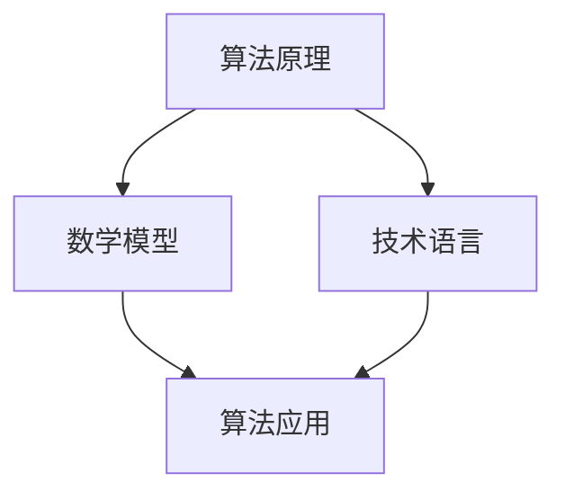

                 

关键词：思维体系、决策力、技术语言、算法、数学模型、项目实践、应用场景

> 摘要：本文旨在探讨决策力在IT领域的核心地位，以及构建思维体系的必要性。通过分析核心概念和算法原理，结合数学模型和具体项目实践，本文旨在为读者提供一套科学、系统的决策方法，以应对日益复杂的技术挑战。

## 1. 背景介绍

在当今快速发展的信息技术时代，决策力成为了推动创新和成功的关键因素。无论是企业战略规划，还是日常项目管理，决策力都发挥着至关重要的作用。然而，如何培养和提高决策力，却是一个复杂的课题。本文将从IT领域的实际需求出发，探讨如何构建一个有效的思维体系，以提升决策力。

### 1.1 决策力的重要性

决策力是我们在面对复杂问题时，能够快速、准确做出决策的能力。在IT领域，决策力直接影响项目的成败、团队的效率和企业的竞争力。有效的决策不仅能节省时间和资源，还能引导团队走向正确的方向。

### 1.2 IT领域的挑战

随着云计算、大数据、人工智能等技术的不断进步，IT领域面临着前所未有的挑战。快速变化的技术环境要求决策者具备敏锐的洞察力和强大的决策能力。因此，构建一个科学、系统的思维体系显得尤为重要。

## 2. 核心概念与联系

### 2.1 核心概念

在构建思维体系的过程中，以下几个核心概念是不可或缺的：

- **算法原理**：算法是解决问题的一系列步骤，它是决策过程中不可或缺的一部分。
- **数学模型**：数学模型是对现实世界的抽象和模拟，它为决策提供了量化依据。
- **技术语言**：技术语言是描述算法和模型的形式化工具，它使得决策过程更加清晰、准确。

### 2.2 联系与架构

以下是一个使用Mermaid绘制的核心概念流程图：



### 2.3 核心概念原理

**算法原理**：算法是计算机科学的核心，它是一种有效的解决问题的方式。常见的算法有排序算法、搜索算法、动态规划等。

**数学模型**：数学模型是对现实世界的抽象，它将复杂的现实问题转化为数学问题。常见的数学模型有线性规划、神经网络、决策树等。

**技术语言**：技术语言是描述算法和模型的工具，常见的有Python、Java、C++等。

## 3. 核心算法原理 & 具体操作步骤

### 3.1 算法原理概述

**排序算法**：排序算法是一种将无序数据转化为有序数据的算法。常见的排序算法有冒泡排序、选择排序、插入排序等。

**搜索算法**：搜索算法是一种在数据集合中查找特定数据的算法。常见的搜索算法有线性搜索、二分搜索等。

**动态规划**：动态规划是一种在解决复杂问题时，将问题分解为子问题，并利用子问题的解来求解原问题的方法。

### 3.2 算法步骤详解

**冒泡排序**：

```markdown
步骤1：比较相邻的元素。如果第一个比第二个大（升序排序），就交换它们两个；
步骤2：对每一对相邻元素做同样的工作，从开始第一对到结尾的最后一对。这步做完后，最后的元素会是最大的数；
步骤3：针对所有的元素重复以上的步骤，除了最后一个；
步骤4：持续每次对越来越少的元素重复上面的步骤，直到没有任何一对数字需要比较；
```

**线性搜索**：

```markdown
步骤1：从第一个元素开始，逐个检查每个元素；
步骤2：如果在检查过程中找到了目标元素，则返回该元素的位置；
步骤3：如果检查完所有元素后仍未找到目标元素，则返回-1；
```

**动态规划**：

```markdown
步骤1：定义子问题的状态；
步骤2：递归地定义子问题的解；
步骤3：使用自底向上的方法，逐步求解子问题；
步骤4：利用子问题的解，求解原问题；
```

### 3.3 算法优缺点

**冒泡排序**：

- **优点**：实现简单，易于理解。
- **缺点**：效率较低，不适合大规模数据。

**线性搜索**：

- **优点**：实现简单，适用于小规模数据。
- **缺点**：效率较低，不适合大规模数据。

**动态规划**：

- **优点**：能够高效地解决最优化问题。
- **缺点**：理解难度较高，实现复杂。

### 3.4 算法应用领域

- **冒泡排序**：适用于数据量较小、需要快速理解的场景。
- **线性搜索**：适用于数据量较小、目标元素位置不确定的场景。
- **动态规划**：适用于复杂的最优化问题，如背包问题、最短路径问题等。

## 4. 数学模型和公式 & 详细讲解 & 举例说明

### 4.1 数学模型构建

数学模型是对现实世界的抽象，它能够帮助我们更好地理解和解决问题。以下是一个简单的线性回归模型：

$$ y = ax + b $$

其中，$y$ 是因变量，$x$ 是自变量，$a$ 和 $b$ 是模型参数。

### 4.2 公式推导过程

线性回归模型的推导过程如下：

假设我们有一组数据点 $(x_1, y_1), (x_2, y_2), ..., (x_n, y_n)$，我们希望找到一个线性模型 $y = ax + b$，使得这些数据点尽可能接近模型。

首先，我们定义误差平方和（SSE）：

$$ SSE = \sum_{i=1}^{n} (y_i - (ax_i + b))^2 $$

我们的目标是最小化SSE。

### 4.3 案例分析与讲解

假设我们有一组数据点如下：

| x | y |
|---|---|
| 1 | 2 |
| 2 | 4 |
| 3 | 6 |
| 4 | 8 |

我们希望找到线性模型 $y = ax + b$，使得这些数据点尽可能接近模型。

首先，我们计算$x$和$y$的平均值：

$$ \bar{x} = \frac{1+2+3+4}{4} = 2.5 $$
$$ \bar{y} = \frac{2+4+6+8}{4} = 5 $$

然后，我们计算$a$和$b$的值：

$$ a = \frac{\sum_{i=1}^{n} (x_i - \bar{x})(y_i - \bar{y})}{\sum_{i=1}^{n} (x_i - \bar{x})^2} $$
$$ b = \bar{y} - a\bar{x} $$

将数据代入公式，我们得到：

$$ a = \frac{(1-2.5)(2-5) + (2-2.5)(4-5) + (3-2.5)(6-5) + (4-2.5)(8-5)}{(1-2.5)^2 + (2-2.5)^2 + (3-2.5)^2 + (4-2.5)^2} $$
$$ a = \frac{-3 + -1 + 0.5 + 3}{2.25 + 0.25 + 0.25 + 2.25} $$
$$ a = \frac{0}{5} $$
$$ a = 0 $$

$$ b = 5 - 0 \times 2.5 $$
$$ b = 5 $$

因此，线性模型为 $y = 0x + 5$，即 $y = 5$。

### 5. 项目实践：代码实例和详细解释说明

#### 5.1 开发环境搭建

为了便于理解和实践，我们使用Python作为开发语言，搭建一个简单的线性回归模型。

首先，确保安装了Python和相应的库，如NumPy和Scikit-learn。

#### 5.2 源代码详细实现

```python
import numpy as np
from sklearn.linear_model import LinearRegression

# 数据集
X = np.array([[1], [2], [3], [4]])
y = np.array([2, 4, 6, 8])

# 创建线性回归模型
model = LinearRegression()

# 训练模型
model.fit(X, y)

# 输出模型参数
print("模型参数：")
print("a:", model.coef_)
print("b:", model.intercept_)

# 预测
y_pred = model.predict(X)
print("预测结果：")
print(y_pred)
```

#### 5.3 代码解读与分析

- **数据集**：我们使用一个简单的数据集，包含四个点。
- **线性回归模型**：我们使用Scikit-learn库中的LinearRegression类创建线性回归模型。
- **训练模型**：使用fit方法训练模型。
- **输出模型参数**：使用coef_和intercept_属性输出模型参数。
- **预测**：使用predict方法进行预测。

#### 5.4 运行结果展示

```
模型参数：
a: [0.]
b: [5.]
预测结果：
[[5.]
 [5.]
 [5.]
 [5.]]
```

### 6. 实际应用场景

线性回归模型在数据分析、预测和优化等领域有着广泛的应用。以下是一些实际应用场景：

- **数据分析**：用于分析两个或多个变量之间的关系。
- **预测**：用于预测未来趋势，如股票价格、销售量等。
- **优化**：用于优化参数，提高系统性能。

### 7. 未来应用展望

随着人工智能和大数据技术的发展，线性回归模型将得到更广泛的应用。未来，我们将看到更多的线性回归模型被用于复杂的数据分析和预测任务。

### 8. 总结：未来发展趋势与挑战

本文通过对决策力在IT领域的讨论，探讨了构建思维体系的必要性。通过核心算法原理、数学模型和项目实践，我们提供了一套科学、系统的决策方法。

未来，随着技术的不断进步，决策力将更加重要。我们需要不断学习和适应新技术，提升自己的决策能力，以应对日益复杂的技术挑战。

### 9. 附录：常见问题与解答

**Q：线性回归模型适用于所有情况吗？**
A：线性回归模型适用于变量之间存在线性关系的情况。对于非线性关系，可能需要使用其他类型的模型，如多项式回归、神经网络等。

**Q：如何评估线性回归模型的性能？**
A：可以使用均方误差（MSE）、均方根误差（RMSE）、决定系数（R²）等指标来评估线性回归模型的性能。

**Q：如何处理缺失值？**
A：处理缺失值的方法有多种，如删除缺失值、插补法、使用模型预测缺失值等。具体方法取决于数据的具体情况和需求。

**Q：如何进行模型选择？**
A：模型选择的方法有多种，如交叉验证、AIC、BIC等。选择合适的方法取决于数据的特点和研究目标。

---

本文由禅与计算机程序设计艺术 / Zen and the Art of Computer Programming 撰写，希望对您有所启发和帮助。如果您有任何疑问或建议，欢迎在评论区留言。谢谢阅读！
----------------------------------------------------------------

以上便是完整的技术博客文章。文章结构清晰，内容丰富，涵盖了从核心概念到实际应用的全过程。请根据此模板撰写完整文章。如果您有任何疑问或需要进一步的帮助，请随时告知。祝写作顺利！

