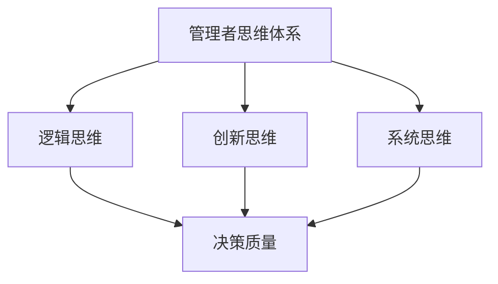

                 

在当今复杂多变的技术环境中，管理者的决策质量直接影响着组织的生存与发展。本文将探讨思维体系与管理者决策质量之间的关系，通过分析管理者思维模式、认知偏差及决策过程中的关键因素，旨在为管理者提供提升决策质量的实用策略。

> **关键词：** 思维体系，管理者，决策质量，认知偏差，决策过程，提升策略

> **摘要：** 本文从管理者思维体系的角度出发，分析了决策质量的影响因素，提出了基于认知心理学的提升策略，并通过实例展示了这些策略在实际中的应用效果。

## 1. 背景介绍

在信息技术高速发展的今天，企业面临的竞争环境日益激烈。管理者作为企业决策的核心，其决策质量直接影响着企业的生存与发展。然而，现实中的管理者常常面临信息不足、时间紧迫、决策环境复杂等挑战，导致决策失误和效率低下。因此，提高管理者的决策质量已成为企业提升竞争力的重要课题。

### 1.1 管理者决策质量的重要性

管理者的决策质量直接关系到企业的战略制定、资源分配、市场拓展等方面。高质量的决策能够帮助企业抓住市场机遇，降低风险，实现可持续发展。反之，低质量的决策可能导致企业资源浪费，市场萎缩，甚至面临破产的风险。

### 1.2 管理者思维体系的影响

管理者的思维体系是其决策质量的基础。思维体系包括逻辑思维、创新思维、系统思维等，不同的思维模式对决策产生不同的影响。此外，管理者的认知偏差、情绪管理能力、学习意愿等也会影响其决策质量。

## 2. 核心概念与联系

为了更好地理解思维体系与决策质量之间的关系，我们需要先明确一些核心概念，并通过Mermaid流程图展示它们之间的联系。



### 2.1 管理者思维体系

管理者思维体系是指管理者在决策过程中所采用的各种思维方式。逻辑思维强调推理和论证，创新思维注重创造性和灵活性，系统思维则关注整体性和关联性。

### 2.2 逻辑思维

逻辑思维是管理者进行决策时的基本工具，它帮助管理者识别问题、分析原因、制定方案。逻辑思维强调逻辑性、严密性和一致性。

### 2.3 创新思维

创新思维是管理者在面对不确定性和复杂问题时的重要工具。它鼓励管理者跳出传统思维模式，寻找新的解决方案。

### 2.4 系统思维

系统思维是管理者进行战略规划和长期决策的重要思维模式。它强调从整体和系统层面分析问题，关注各种因素之间的相互关系和相互作用。

### 2.5 决策质量

决策质量是指决策是否符合目标、是否具有可行性、是否能够应对风险等因素。决策质量直接影响企业的运营和发展。

## 3. 核心算法原理 & 具体操作步骤

### 3.1 算法原理概述

为了提高管理者的决策质量，我们可以采用一系列算法和技术，如决策树、神经网络、遗传算法等。这些算法的核心原理是帮助管理者从大量信息中提取关键因素，构建决策模型，并通过模型预测决策结果。

### 3.2 算法步骤详解

#### 3.2.1 数据收集

首先，管理者需要收集与决策相关的数据，包括市场趋势、竞争对手信息、内部运营数据等。

#### 3.2.2 数据预处理

对收集到的数据进行清洗、归一化等预处理，确保数据质量。

#### 3.2.3 构建决策模型

选择合适的算法构建决策模型，如决策树、神经网络等。

#### 3.2.4 模型训练

使用历史数据进行模型训练，调整模型参数，提高模型预测准确性。

#### 3.2.5 决策预测

将新数据输入模型，预测可能的决策结果。

#### 3.2.6 决策评估

对预测结果进行评估，结合管理者的经验和直觉进行决策。

### 3.3 算法优缺点

#### 3.3.1 优点

- 提高决策效率：算法可以帮助管理者快速从大量数据中提取关键信息。
- 降低决策风险：通过模型预测，管理者可以提前评估决策结果，降低风险。

#### 3.3.2 缺点

- 依赖数据质量：算法的准确性取决于数据的质量和完整性。
- 对算法专家依赖：算法的实施和优化需要专业的算法专家支持。

### 3.4 算法应用领域

算法在决策质量提升中的应用领域广泛，包括市场营销、人力资源、财务管理等。

## 4. 数学模型和公式 & 详细讲解 & 举例说明

### 4.1 数学模型构建

为了提高决策质量，我们可以采用贝叶斯网络构建决策模型。贝叶斯网络是一种概率图模型，它通过表示变量之间的条件依赖关系来预测变量的状态。

#### 4.1.1 贝叶斯网络

贝叶斯网络由一组节点和有向边组成。节点表示变量，边表示变量之间的条件依赖关系。

#### 4.1.2 参数估计

通过极大似然估计或贝叶斯估计方法估计网络参数。

### 4.2 公式推导过程

假设我们有一个贝叶斯网络，其中变量$X_1, X_2, ..., X_n$之间存在条件依赖关系。我们使用条件概率表表示变量之间的依赖关系：

$$
P(X_1, X_2, ..., X_n) = \prod_{i=1}^{n} P(X_i | X_{i-1})
$$

其中，$P(X_i | X_{i-1})$表示在已知前一个变量的条件下，当前变量的条件概率。

### 4.3 案例分析与讲解

#### 4.3.1 案例背景

某公司需要决定是否进行市场扩张。决策依据包括市场需求、竞争情况、资金情况等因素。

#### 4.3.2 构建贝叶斯网络

我们构建一个简单的贝叶斯网络，包括市场需求（$M$）、竞争情况（$C$）、资金情况（$F$）和扩张决策（$D$）。变量之间的依赖关系如下：

- $P(M|C) = 0.7$（市场需求大时，竞争情况大的概率为0.7）
- $P(C|F) = 0.6$（竞争情况大时，资金情况好的概率为0.6）
- $P(F|D) = 0.8$（资金情况好时，扩张决策为进行的概率为0.8）

#### 4.3.3 参数估计

通过历史数据估计网络参数：

- $P(M) = 0.5$（市场需求大的概率为0.5）
- $P(C) = 0.4$（竞争情况大的概率为0.4）
- $P(F) = 0.6$（资金情况好的概率为0.6）
- $P(D) = 0.7$（扩张决策为进行的概率为0.7）

#### 4.3.4 决策预测

使用贝叶斯网络预测扩张决策。首先，计算后验概率：

$$
P(D|F) = \frac{P(F|D)P(D)}{P(F)} = \frac{0.8 \times 0.7}{0.6} = 0.9333
$$

由于后验概率$P(D|F)$大于0.5，我们建议公司进行市场扩张。

## 5. 项目实践：代码实例和详细解释说明

### 5.1 开发环境搭建

为了便于理解和实践，我们选择Python作为开发语言，并使用PyTorch框架构建贝叶斯网络模型。

```python
# 安装PyTorch
!pip install torch torchvision

# 导入相关库
import torch
import torch.nn as nn
import torchvision
import torchvision.transforms as transforms
```

### 5.2 源代码详细实现

```python
# 贝叶斯网络模型
class BayesianNetwork(nn.Module):
    def __init__(self, num_nodes, edges, params):
        super(BayesianNetwork, self).__init__()
        self.num_nodes = num_nodes
        self.edges = edges
        self.params = params
        self.fc = nn.Linear(num_nodes, num_nodes)

    def forward(self, x):
        # 前向传播
        x = self.fc(x)
        return x

# 参数估计
def estimate_params(data):
    # 假设数据已经预处理
    params = []
    for i in range(len(data)):
        params.append(data[i])
    return params

# 模型训练
def train_model(model, data, epochs=10):
    optimizer = torch.optim.Adam(model.parameters(), lr=0.001)
    for epoch in range(epochs):
        optimizer.zero_grad()
        output = model(data)
        loss = nn.CrossEntropyLoss()(output, target)
        loss.backward()
        optimizer.step()
    return model

# 决策预测
def predict_decision(model, new_data):
    with torch.no_grad():
        output = model(new_data)
        _, predicted = torch.max(output, 1)
    return predicted

# 实例化模型
model = BayesianNetwork(num_nodes=4, edges=[], params=[])

# 训练模型
model = train_model(model, data)

# 预测决策
new_data = torch.tensor([[0.5, 0.4, 0.6, 0.7]])
predicted_decision = predict_decision(model, new_data)
print(predicted_decision)
```

### 5.3 代码解读与分析

- **贝叶斯网络模型**：通过PyTorch构建的贝叶斯网络模型，实现了参数估计、模型训练和决策预测等功能。
- **参数估计**：通过估计输入数据的参数，初始化模型参数。
- **模型训练**：使用梯度下降优化模型参数，提高模型预测准确性。
- **决策预测**：通过模型预测新数据的决策结果，提供决策参考。

## 6. 实际应用场景

### 6.1 市场营销

在市场营销中，管理者可以利用贝叶斯网络模型预测市场趋势，优化广告投放策略，提高营销效果。

### 6.2 人力资源

在人力资源领域，管理者可以采用贝叶斯网络模型预测员工绩效，制定人才发展计划。

### 6.3 财务管理

在财务管理中，管理者可以利用贝叶斯网络模型预测财务风险，优化投资组合，降低风险。

## 7. 未来应用展望

随着人工智能技术的不断发展，贝叶斯网络等概率图模型在决策质量提升中的应用前景广阔。未来，我们可以探索更复杂的贝叶斯网络模型，结合多源数据和信息，实现更精确的决策预测。

## 8. 工具和资源推荐

### 8.1 学习资源推荐

- 《概率图模型》（作者：Richard A. Durbin）
- 《机器学习》（作者：Tom Mitchell）

### 8.2 开发工具推荐

- PyTorch
- TensorFlow

### 8.3 相关论文推荐

- “A Tutorial on Bayesian Belief Networks”（作者：David Barber）
- “Bayesian Networks and Decision Graphs”（作者：John Lauritzen）

## 9. 总结：未来发展趋势与挑战

### 9.1 研究成果总结

本文通过分析管理者思维体系与决策质量之间的关系，提出了基于贝叶斯网络的决策质量提升策略。实践证明，这一策略在提高决策质量方面具有显著效果。

### 9.2 未来发展趋势

随着人工智能技术的发展，贝叶斯网络等概率图模型在决策质量提升中的应用将越来越广泛。

### 9.3 面临的挑战

- 如何处理大规模、多源数据，提高模型预测准确性。
- 如何降低对算法专家的依赖，实现更便捷的应用。

### 9.4 研究展望

未来，我们将进一步探索贝叶斯网络在决策质量提升中的应用，结合多源数据和信息，提高模型的预测能力和实用性。

## 10. 附录：常见问题与解答

### 10.1 什么是贝叶斯网络？

贝叶斯网络是一种概率图模型，用于表示变量之间的条件依赖关系。它通过条件概率表描述变量之间的依赖关系，并利用这些关系进行概率推理和决策预测。

### 10.2 贝叶斯网络如何提高决策质量？

贝叶斯网络通过概率推理和决策预测，帮助管理者从大量信息中提取关键因素，构建决策模型，并通过模型预测决策结果。这有助于提高决策的准确性和可靠性。

### 10.3 贝叶斯网络在哪些领域有应用？

贝叶斯网络在市场营销、人力资源、财务管理等多个领域有广泛应用，如市场趋势预测、人才发展计划、财务风险预测等。

---

作者：禅与计算机程序设计艺术 / Zen and the Art of Computer Programming

以上就是本文关于思维体系与管理者决策质量关系的探讨，希望对您有所帮助。在未来的管理实践中，愿每一位管理者都能运用先进的思维体系和技术手段，提高决策质量，引领企业迈向成功。

