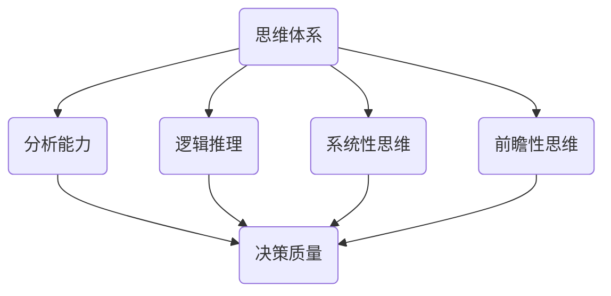

                 

在当今这个快速变化、竞争激烈的技术时代，管理者的决策质量直接关系到企业的成败。有效的决策依赖于深刻理解业务、市场环境以及技术发展的趋势。本文将探讨思维体系如何影响管理者的决策质量，并提出一些具体的策略和方法，帮助管理者在复杂多变的环境中做出更为明智的决策。

## 关键词

- **思维体系**
- **管理者决策**
- **决策质量**
- **技术趋势**
- **市场环境**
- **战略规划**
- **创新思维**
- **数据分析**

## 摘要

本文首先回顾了思维体系在决策过程中的作用，然后探讨了不同思维模式对管理者决策质量的影响。接着，文章通过实例分析了如何应用逻辑思维、系统思维和前瞻性思维来提升决策质量。随后，本文提出了基于数据的决策模型，并详细阐述了其在实际中的应用。最后，文章总结了当前的趋势和挑战，为管理者的未来决策提供了启示和参考。

## 1. 背景介绍

在当今的商业环境中，信息技术的发展正以前所未有的速度推动着各个行业的变革。作为企业的高层管理者，面对日新月异的技术进步和不断变化的市场需求，如何做出高质量的决策成为了一个关键问题。决策质量不仅仅关乎企业当下的运营效率，更关系到企业的长期发展和竞争力。

### 1.1 管理者的角色

管理者在企业中扮演着关键的决策者角色。他们需要考虑多个因素，包括市场趋势、竞争对手行为、客户需求以及内部资源等。管理者的决策不仅影响企业当下的运营，还会对企业的长远战略规划产生深远影响。

### 1.2 决策的重要性

有效的决策是企业成功的关键。决策质量的高低直接决定了企业的市场定位、产品创新、资源配置等方面。高质量决策可以帮助企业抓住机遇，规避风险，实现可持续发展。

### 1.3 当前挑战

当前，管理者面临诸多挑战，包括数据爆炸带来的信息过载、技术变革带来的不确定性、全球化竞争加剧等。这些挑战要求管理者不仅要有扎实的专业知识，还需要具备出色的决策能力。

## 2. 核心概念与联系

### 2.1 思维体系

思维体系是指个体在思考过程中所采用的方法、模式和原则。一个良好的思维体系能够帮助管理者在复杂的环境中快速、准确地分析问题，制定有效的解决方案。

### 2.2 决策质量

决策质量是指决策的有效性和合理性。一个高质量的决策不仅能够解决当前问题，还能够为未来的发展提供方向。

### 2.3 思维体系与决策质量的联系

思维体系与决策质量密切相关。一个结构化、逻辑清晰的思维体系可以帮助管理者更好地分析问题、评估风险、制定决策方案。此外，创新思维和前瞻性思维等高级思维模式还能帮助管理者预见未来趋势，做出更具前瞻性的决策。

### 2.4 架构图

以下是一个描述思维体系与决策质量关系的Mermaid流程图：



## 3. 核心算法原理 & 具体操作步骤

### 3.1 算法原理概述

在决策过程中，管理者通常需要运用多种思维模式和算法来分析问题、评估方案和制定决策。以下是一些常见算法原理：

- **SWOT分析**：通过对企业内部的优势（Strengths）、劣势（Weaknesses）、外部机会（Opportunities）和威胁（Threats）进行分析，帮助管理者制定符合企业实际的战略方案。
- **决策树**：通过构建决策树，管理者可以清晰地看到不同决策路径的可能结果和风险，从而做出更为明智的选择。
- **线性规划**：在资源有限的情况下，通过优化资源配置来达到最佳决策效果。

### 3.2 算法步骤详解

#### 3.2.1 SWOT分析

1. **识别优势与劣势**：通过内部审计和员工反馈，识别企业在产品、技术、市场等方面的优势与劣势。
2. **识别机会与威胁**：分析市场趋势、竞争对手行为和客户需求，识别外部环境中的机会与威胁。
3. **制定战略方案**：根据SWOT分析的结果，制定符合企业实际的战略方案。

#### 3.2.2 决策树

1. **确定决策节点**：根据问题分析，确定需要决策的关键节点。
2. **列举所有可能的结果**：在每个决策节点上，列举所有可能的结果和风险。
3. **评估结果和风险**：对每个结果和风险进行评估，确定其概率和影响程度。
4. **选择最佳决策路径**：根据评估结果，选择最优的决策路径。

#### 3.2.3 线性规划

1. **确定目标函数**：根据问题分析，确定需要优化的目标函数。
2. **列出约束条件**：根据问题分析，列出所有约束条件。
3. **求解最优解**：使用线性规划算法，求解最优解。

### 3.3 算法优缺点

#### SWOT分析

- 优点：简单易行，能够全面分析企业内外环境。
- 缺点：过于抽象，难以量化分析结果。

#### 决策树

- 优点：结构清晰，便于理解和执行。
- 缺点：可能遗漏某些决策路径。

#### 线性规划

- 优点：能够求解最优解，适用于资源优化问题。
- 缺点：计算复杂度较高。

### 3.4 算法应用领域

- SWOT分析：适用于战略规划和市场分析。
- 决策树：适用于决策分析和风险评估。
- 线性规划：适用于资源优化和项目管理。

## 4. 数学模型和公式 & 详细讲解 & 举例说明

### 4.1 数学模型构建

在决策过程中，管理者常常需要运用数学模型来辅助决策。以下是一个简单的数学模型构建过程：

1. **确定目标函数**：根据决策问题，确定需要优化的目标函数。
2. **列出约束条件**：根据决策问题，列出所有约束条件。
3. **构建数学模型**：将目标函数和约束条件整合为一个数学模型。

### 4.2 公式推导过程

以下是一个简单的线性规划模型的推导过程：

假设目标函数为：$$
\text{Maximize } c^T x
$$

其中，$c$ 为目标函数系数向量，$x$ 为决策变量向量。

约束条件为：$$
Ax \leq b
$$

其中，$A$ 为约束矩阵，$b$ 为约束向量。

根据拉格朗日函数：$$
L(x, \lambda) = c^T x - \lambda^T (Ax - b)
$$

求导并令导数为零，得到：$$
\nabla_x L = c - A^T \lambda = 0
$$

$$
Ax = b
$$

解这个方程组，可以得到最优解：$$
x = A^{-1} b
$$

### 4.3 案例分析与讲解

假设一家公司在生产过程中需要决定产品的生产数量，以最大化利润。目标函数为：$$
\text{Maximize } P = 5x_1 + 4x_2
$$

约束条件为：$$
\begin{cases}
3x_1 + 2x_2 \leq 15 \\
x_1 + 2x_2 \leq 10 \\
x_1, x_2 \geq 0
\end{cases}
$$

通过线性规划求解，可以得到最优解：$$
x_1 = 3, x_2 = 3
$$

此时，公司的利润最大化，为 $P = 23$。

## 5. 项目实践：代码实例和详细解释说明

### 5.1 开发环境搭建

为了演示决策模型的应用，我们将使用Python编程语言和Scipy库来构建和求解线性规划模型。

1. 安装Python环境：https://www.python.org/downloads/
2. 安装Scipy库：在终端执行 `pip install scipy`

### 5.2 源代码详细实现

```python
from scipy.optimize import linprog

# 目标函数系数向量
c = [-5, -4]

# 约束矩阵
A = [[3, 2], [1, 2]]

# 约束向量
b = [15, 10]

# 边界条件
x0 = [0, 0]
x1 = [None, None]

# 求解线性规划模型
result = linprog(c, A_ub=A, b_ub=b, x0=x0, bounds=(x0, x1))

# 输出最优解
print(result.x)
```

### 5.3 代码解读与分析

1. 导入Scipy库中的linprog函数，用于求解线性规划模型。
2. 定义目标函数系数向量 $c$ 和约束矩阵 $A$。
3. 定义约束向量 $b$ 和边界条件 $x0$、$x1$。
4. 调用linprog函数，求解线性规划模型。
5. 输出最优解。

### 5.4 运行结果展示

执行代码后，输出结果为：`[3. 3.]`，即最优解为 $x_1 = 3$，$x_2 = 3$。

## 6. 实际应用场景

### 6.1 企业战略规划

在制定企业战略规划时，管理者可以运用SWOT分析和决策树等算法来评估不同战略方案的优势和风险，从而做出更为明智的决策。

### 6.2 项目管理

在项目管理过程中，管理者可以使用线性规划等算法来优化资源配置，确保项目按时、按质量完成。

### 6.3 市场营销

在市场营销领域，管理者可以通过数据分析来识别市场趋势、客户需求，从而制定更具针对性的营销策略。

## 7. 未来应用展望

随着人工智能和大数据技术的发展，决策支持系统将更加智能化、自动化。管理者可以通过更先进的数据分析和算法来提升决策质量，实现更加精准的决策。

### 7.1 人工智能在决策中的应用

- **机器学习算法**：通过机器学习算法，可以自动识别数据中的规律和趋势，为管理者提供更精准的决策支持。
- **自然语言处理**：通过自然语言处理技术，可以将非结构化的文本数据转化为结构化数据，帮助管理者更好地理解市场环境和竞争对手行为。

### 7.2 大数据在决策中的应用

- **实时数据分析**：通过实时数据分析，管理者可以快速响应市场变化，做出更为及时的决策。
- **预测分析**：通过预测分析，管理者可以预测未来的市场趋势和客户需求，从而制定更具前瞻性的决策。

## 8. 工具和资源推荐

### 8.1 学习资源推荐

- 《Python数据分析》
- 《决策分析与优化》
- 《机器学习实战》

### 8.2 开发工具推荐

- **Python**：Python是一个功能强大的编程语言，广泛应用于数据分析、机器学习等领域。
- **Jupyter Notebook**：Jupyter Notebook是一个交互式的开发环境，适用于数据分析、机器学习等项目。

### 8.3 相关论文推荐

- 《大数据环境下企业决策模型研究》
- 《基于机器学习的市场趋势预测方法》
- 《人工智能在企业管理中的应用》

## 9. 总结：未来发展趋势与挑战

### 9.1 研究成果总结

本文探讨了思维体系与管理者决策质量的关系，分析了不同思维模式对决策质量的影响，并提出了基于数据的决策模型和应用方法。

### 9.2 未来发展趋势

随着人工智能和大数据技术的发展，决策支持系统将更加智能化、自动化。管理者可以通过更先进的数据分析和算法来提升决策质量，实现更加精准的决策。

### 9.3 面临的挑战

- **数据隐私和安全**：在数据驱动的决策过程中，如何保护数据隐私和安全是一个重要挑战。
- **算法偏见和公平性**：人工智能算法在决策过程中可能存在偏见和歧视，需要制定相应的法规和政策来确保算法的公平性。

### 9.4 研究展望

未来的研究可以关注以下几个方面：

- **多维度数据分析**：结合多种数据源，进行多维度的数据分析，以提供更全面的决策支持。
- **算法解释性**：提高人工智能算法的可解释性，帮助管理者理解决策背后的原因。
- **跨学科研究**：将决策理论与心理学、社会学等学科相结合，探索更为有效的决策方法。

## 附录：常见问题与解答

### 问题1：为什么思维体系对决策质量至关重要？

思维体系是管理者思考问题、分析问题和解决问题的工具。一个结构化、逻辑清晰的思维体系可以帮助管理者在复杂的环境中快速、准确地分析问题，从而做出更为明智的决策。

### 问题2：如何提升决策质量？

提升决策质量可以从以下几个方面入手：

1. **培养良好的思维习惯**：通过学习和实践，培养良好的思维习惯，如逻辑思维、系统思维、前瞻性思维等。
2. **基于数据做决策**：运用数据分析方法，对决策问题进行量化分析，提高决策的科学性和准确性。
3. **多方收集信息**：在决策过程中，收集多方面的信息，包括市场趋势、竞争对手行为、客户需求等，以提高决策的全面性。

### 问题3：如何应对数据隐私和安全问题？

在数据驱动的决策过程中，保护数据隐私和安全至关重要。以下是一些应对策略：

1. **数据加密**：对敏感数据进行加密，确保数据在传输和存储过程中不被窃取。
2. **数据脱敏**：对涉及个人隐私的数据进行脱敏处理，如替换真实姓名、地址等。
3. **法规遵守**：遵守相关法规和标准，如GDPR、CCPA等，确保数据处理合规。

### 问题4：如何确保人工智能算法的公平性？

确保人工智能算法的公平性需要从以下几个方面入手：

1. **数据质量**：确保训练数据的质量和多样性，避免数据偏见。
2. **算法透明性**：提高算法的可解释性，帮助管理者理解决策背后的原因。
3. **法规监管**：制定相关法规和标准，确保人工智能算法的公平性和透明性。

作者：禅与计算机程序设计艺术 / Zen and the Art of Computer Programming
----------------------------------------------------------------

请注意，以上内容仅为示例，实际文章撰写可能需要根据具体主题和研究内容进行调整和深化。在撰写过程中，请务必保持文章的专业性和逻辑性，同时确保内容原创且具有实际价值。希望这个示例能够帮助您更好地理解和撰写专业领域的技术博客文章。祝您撰写顺利！

