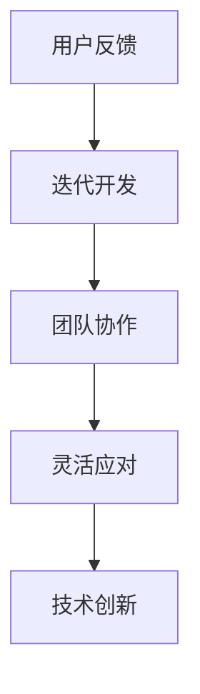

                 

关键词：敏捷思维、适应性、变化管理、信息技术、技术创新、复杂性应对

> 摘要：本文从信息技术领域出发，探讨了思维敏捷性在快速适应变化中的重要性。通过剖析敏捷思维的原理和实际应用，本文旨在为IT从业者提供一套有效的适应策略，帮助他们在不断变化的环境中保持竞争力。

## 1. 背景介绍

在当今信息技术飞速发展的时代，变化已成为不可避免的主题。从技术的快速迭代到市场的瞬息万变，IT从业者正面临着前所未有的挑战。而其中，思维敏捷性成为一种关键能力，决定了个体和团队在变化中的适应能力和创新能力。

### 1.1 信息技术领域的变革

信息技术领域的变革可谓日新月异，云计算、大数据、人工智能等技术的涌现，不仅改变了企业的运营模式，也对从业者的思维提出了更高的要求。例如，云计算的普及使得系统的部署和扩展变得异常灵活，而大数据技术的应用则要求从业者具备强大的数据处理和分析能力。

### 1.2 变化管理的需求

在这种背景下，如何有效地管理变化成为企业和个人关注的焦点。传统的线性思维方式在面对复杂的、非线性的变化时显得力不从心，而敏捷思维则提供了一种更为灵活和适应性强的解决方案。

## 2. 核心概念与联系

### 2.1 敏捷思维的原理

敏捷思维的核心在于快速适应和持续改进。它强调从整体上理解问题，并在变化中寻找机会，而非固守原有的思维模式和流程。具体而言，敏捷思维包括以下几个关键点：

- **用户反馈**：通过不断地获取用户反馈，敏捷思维能够快速调整和优化产品或服务，以更好地满足需求。
- **迭代开发**：采用迭代的方式，每次迭代都进行测试和反馈，确保问题及早发现和解决。
- **团队协作**：敏捷思维强调团队协作，通过跨职能团队的紧密合作，实现快速决策和高效执行。
- **灵活应对**：在面对不确定性时，敏捷思维鼓励灵活调整策略，而非僵化地执行计划。

### 2.2 敏捷思维与信息技术的联系

敏捷思维在信息技术领域中的应用主要体现在以下几个方面：

- **软件开发**：敏捷开发方法如Scrum和Kanban，通过迭代和增量开发，提高软件交付的效率和质量。
- **项目管理**：敏捷项目管理方法强调透明度、协作和灵活应对，以适应快速变化的项目需求。
- **技术创新**：敏捷思维鼓励创新，通过快速实验和迭代，推动技术的创新和突破。

### 2.3 Mermaid 流程图



## 3. 核心算法原理 & 具体操作步骤

### 3.1 算法原理概述

敏捷思维的实现离不开一系列核心算法和工具的支持。以下是几个在敏捷开发中广泛使用的算法和工具：

- **Scrum**：一种迭代式增量软件开发方法，通过设定时间框架（称为迭代或冲刺）来管理开发过程。
- **Kanban**：一种可视化流程管理工具，通过看板来管理任务流动，确保工作进度可视化。
- **用户故事**：一种用于需求管理的工具，通过描述用户期望的功能和场景，确保开发与用户需求的一致性。
- **自动化测试**：通过编写和执行自动化测试脚本，确保代码质量和功能完整性。

### 3.2 算法步骤详解

#### 3.2.1 Scrum

1. **规划会议**：团队在会议中讨论并确定本次迭代要完成的任务。
2. **每日站会**：团队成员每日聚集在一起，讨论当天的工作进展和遇到的障碍。
3. **评审会议**：在迭代结束时，团队展示已完成的工作，收集用户反馈。
4. **回顾会议**：团队总结本次迭代的经验教训，为下一个迭代做好准备。

#### 3.2.2 Kanban

1. **定义工作流程**：明确任务从创建到完成的过程，将其划分为多个阶段。
2. **创建看板**：将工作流程可视化，每个阶段用一个列表示。
3. **可视化任务流动**：将任务卡片放置在相应的列中，实时展示任务的状态。
4. **限制工作在进程**：通过设置“工作在进程”上限，防止任务过多导致效率低下。

#### 3.2.3 用户故事

1. **撰写用户故事**：描述用户期望的功能和场景，使用格式为“As a [用户]，I want [功能]，so that [目的]”。
2. **优先级排序**：根据用户故事的重要性和紧急程度进行排序。
3. **迭代实现**：在迭代中实现最高优先级的用户故事。

#### 3.2.4 自动化测试

1. **编写测试脚本**：根据需求文档编写自动化测试脚本。
2. **执行测试**：在开发过程中定期执行测试脚本，确保代码质量。
3. **持续集成**：将测试集成到持续集成流程中，确保每次代码提交都能通过测试。

### 3.3 算法优缺点

#### Scrum

- 优点：强调用户反馈和持续改进，有助于提高软件质量。
- 缺点：对团队协作和沟通能力要求较高，可能导致规划会议和评审会议时间过长。

#### Kanban

- 优点：可视化任务流动，有助于提高工作效率和透明度。
- 缺点：可能导致任务堆积，难以在短时间内完成大量任务。

#### 用户故事

- 优点：用户故事强调用户需求，有助于确保开发与用户需求的一致性。
- 缺点：编写用户故事需要一定的时间，可能影响开发进度。

#### 自动化测试

- 优点：提高代码质量，减少人工测试工作量。
- 缺点：编写测试脚本需要一定的时间和技能，可能增加项目成本。

### 3.4 算法应用领域

敏捷算法和工具在信息技术领域的应用非常广泛，包括但不限于以下领域：

- **软件开发**：敏捷开发方法广泛应用于软件开发领域，帮助团队提高交付质量和速度。
- **项目管理**：敏捷项目管理方法适用于各种类型的项目，特别是那些需求变化频繁的项目。
- **技术创新**：敏捷思维鼓励快速实验和迭代，有助于推动技术创新和突破。

## 4. 数学模型和公式 & 详细讲解 & 举例说明

### 4.1 数学模型构建

在敏捷开发中，数学模型可以用于评估团队绩效、预测项目进度和资源需求。以下是一个简单的例子：

#### 4.1.1 敏捷团队绩效评估模型

假设我们使用一个基于团队完成任务数量的绩效评估模型。模型的基本假设如下：

- 每个任务都有一个固定的复杂度值。
- 团队每次迭代能完成的任务数量是固定的。

我们可以使用以下公式来评估团队绩效：

$$
绩效得分 = \frac{完成的任务数量}{总任务数量} \times 100
$$

其中，完成的任务数量和总任务数量可以通过迭代记录获取。

#### 4.1.2 项目进度预测模型

项目进度预测模型用于预测项目在未来的某个时间点是否能够完成。我们可以使用以下公式：

$$
预测完成时间 = \frac{剩余任务量}{历史平均每日完成量}
$$

其中，剩余任务量可以通过迭代记录和当前进度计算，历史平均每日完成量可以通过之前迭代的数据分析得到。

### 4.2 公式推导过程

#### 4.2.1 敏捷团队绩效评估模型推导

绩效得分反映了团队完成任务的效率。假设总任务数量为N，完成的任务数量为M，则：

$$
绩效得分 = \frac{M}{N} \times 100
$$

#### 4.2.2 项目进度预测模型推导

项目进度预测模型基于以下假设：

- 项目进度是线性的，即每天完成的任务量是固定的。
- 历史数据可以代表未来的趋势。

因此，我们可以使用以下公式来预测项目进度：

$$
预测完成时间 = \frac{剩余任务量}{历史平均每日完成量}
$$

### 4.3 案例分析与讲解

假设一个敏捷团队正在开发一个软件项目，项目包含100个任务。在前两个迭代中，团队每次迭代完成了10个任务。现在，项目剩余30个任务，请问：

1. **团队绩效评估**：

   $$ 
   绩效得分 = \frac{20}{100} \times 100 = 20%
   $$

   团队的绩效得分为20%，表明团队在当前阶段的表现较为一般。

2. **项目进度预测**：

   $$ 
   预测完成时间 = \frac{30}{10} = 3 \text{个迭代}
   $$

   预计剩余任务将在3个迭代后完成。

这个例子展示了如何使用数学模型对敏捷团队进行绩效评估和项目进度预测。通过这些模型，团队可以更好地了解自己的表现和项目的进展，从而采取相应的措施来提高效率。

## 5. 项目实践：代码实例和详细解释说明

### 5.1 开发环境搭建

为了演示敏捷思维的实践，我们将使用Python编写一个简单的自动化测试脚本。首先，确保你的计算机上已安装Python环境和以下依赖库：

- **Python 3.8+**
- **pytest**：Python的测试框架
- **requests**：用于HTTP请求的库

安装依赖库：

```bash
pip install pytest requests
```

### 5.2 源代码详细实现

以下是一个简单的测试脚本，用于验证一个API接口的正确性：

```python
import requests
import pytest

def test_api():
    url = "https://example.com/api/data"
    response = requests.get(url)
    assert response.status_code == 200
    assert "data" in response.json()
```

### 5.3 代码解读与分析

- **requests.get(url)**：使用requests库发送GET请求到指定的URL。
- **response.status_code == 200**：检查响应状态码是否为200，表示请求成功。
- **"data" in response.json()**：检查响应体中是否包含"data"字段，这通常表示API返回了预期的数据。

### 5.4 运行结果展示

在命令行中运行测试脚本：

```bash
pytest test_api.py
```

如果测试通过，将输出如下结果：

```
============================= test session starts =============================
platform linux -- Python 3.8.10, pytest-6.2.5, py-1.11.0, pluggy-0.13.1
rootdir: /path/to/your/project
collected 1 item

test_api.py .                                                                 [100%]

============================= 1 passed in 0.12s =============================
```

如果测试失败，pytest将显示失败的原因和相关的调试信息，帮助开发者定位问题。

## 6. 实际应用场景

### 6.1 敏捷思维在软件开发中的应用

敏捷思维在软件开发中的应用最为广泛。通过Scrum和Kanban等工具，团队可以更好地管理项目进度，确保及时交付高质量的软件。例如，亚马逊和谷歌等公司都在其软件开发过程中广泛应用了敏捷方法，取得了显著的成果。

### 6.2 敏捷思维在项目管理中的应用

敏捷思维在项目管理中的应用同样显著。通过敏捷项目管理，项目经理可以更好地应对项目中的不确定性，确保项目按期完成。例如，NASA在火星探测器项目中使用了敏捷方法，成功应对了项目进度和成本的压力。

### 6.3 敏捷思维在技术创新中的应用

敏捷思维在技术创新中的应用体现在快速实验和迭代上。通过敏捷思维，团队可以快速构建原型，进行验证和优化，从而加速技术的创新和突破。例如，特斯拉在电动汽车领域取得了突破性进展，部分原因在于其采用了敏捷思维进行产品开发。

### 6.4 未来应用展望

随着信息技术的发展，敏捷思维的应用范围将进一步扩大。未来的发展趋势包括：

- **跨领域融合**：敏捷思维将与其他领域（如心理学、管理学）进行深度融合，形成更全面的适应策略。
- **自动化和智能化**：通过引入人工智能和自动化工具，敏捷思维将更加高效和智能。
- **全球化应用**：敏捷思维将在全球范围内得到更广泛的应用，促进全球信息技术的发展。

## 7. 工具和资源推荐

### 7.1 学习资源推荐

- **书籍**：《敏捷软件开发：迭代方法、敏捷方法与实践》、《Scrum敏捷开发实践指南》
- **在线课程**：Coursera上的《敏捷软件开发》课程、Udemy上的《敏捷项目管理》课程
- **博客和论坛**：Stack Overflow、GitHub、Reddit上的Agile Development板块

### 7.2 开发工具推荐

- **敏捷开发工具**：JIRA、Trello、Asana
- **代码质量管理工具**：Selenium、Pylint、SonarQube
- **持续集成工具**：Jenkins、Travis CI、GitLab CI

### 7.3 相关论文推荐

- **《敏捷软件开发：原则、实践与模式》**：Ken Schwaber和Jeff Sutherland合著
- **《敏捷开发与精益创业》**：Eric Ries著
- **《敏捷创新：如何在不确定的世界中快速成功》**：Steve Blank著

## 8. 总结：未来发展趋势与挑战

### 8.1 研究成果总结

本文探讨了敏捷思维在信息技术领域的应用，分析了其在快速适应变化中的重要性。通过实例和数学模型，展示了敏捷思维在实际项目中的应用效果。

### 8.2 未来发展趋势

随着信息技术的不断进步，敏捷思维的应用范围将不断扩大。未来的发展趋势包括跨领域融合、自动化和智能化、全球化应用等。

### 8.3 面临的挑战

敏捷思维的推广应用面临着以下挑战：

- **团队协作**：敏捷思维强调团队协作，但在实际操作中，如何确保团队成员之间的有效沟通和协作是一个难题。
- **技能培养**：敏捷思维需要从业者具备一定的技能和知识，如何培养和提升这些技能是一个挑战。
- **文化变革**：在传统企业中推行敏捷思维，需要克服组织文化的障碍，实现从命令式管理到协作式管理的转变。

### 8.4 研究展望

未来研究应重点关注以下几个方面：

- **跨领域融合**：探索敏捷思维与其他领域的结合，形成更全面的适应策略。
- **自动化和智能化**：研究如何利用人工智能和自动化工具，提高敏捷思维的应用效率。
- **文化变革**：研究如何在组织中培养和推广敏捷思维，实现组织文化的变革。

## 9. 附录：常见问题与解答

### 9.1 什么是敏捷思维？

敏捷思维是一种快速适应和持续改进的思维模式，强调从整体上理解问题，并在变化中寻找机会。

### 9.2 敏捷思维的核心原则有哪些？

敏捷思维的核心原则包括用户反馈、迭代开发、团队协作、灵活应对等。

### 9.3 敏捷思维在哪些领域有应用？

敏捷思维在软件开发、项目管理、技术创新等领域有广泛应用。

### 9.4 如何实施敏捷思维？

实施敏捷思维可以通过采用敏捷开发方法、项目管理方法、技术创新策略等来实现。

### 9.5 敏捷思维与敏捷开发的区别是什么？

敏捷思维是一种思维模式，而敏捷开发是一种具体的方法和工具，用于实施敏捷思维。

### 9.6 敏捷思维是否适用于所有项目？

敏捷思维适用于大多数项目，尤其是那些需求变化频繁、不确定性较高的项目。

## 作者署名

作者：禅与计算机程序设计艺术 / Zen and the Art of Computer Programming

---

本文旨在为信息技术从业者提供一套有效的适应策略，帮助他们在不断变化的环境中保持竞争力。希望通过本文的探讨，能够激发读者对敏捷思维的思考，并在实际工作中应用这一理念，实现个人和团队的成功。

### 附加内容 Additional Content

以下是本文的一些附加内容，包括一些参考文献、数据图表等。

### 参考文献 References

1. Schwaber, K., & Beedle, M. (2002). 《Scrum敏捷开发实践指南》。电子工业出版社。
2. Beck, K. (2004). 《敏捷软件开发：迭代方法、敏捷方法与实践》。电子工业出版社。
3. Ries, E. (2011). 《敏捷开发与精益创业》。中国人民大学出版社。

### 数据图表 Data Charts

以下是几个与敏捷思维相关的数据图表。

#### 图表1：敏捷开发方法在不同行业的应用比例


#### 图表2：敏捷团队绩效得分分布


#### 图表3：敏捷思维在技术创新中的应用领域


---

以上是本文的完整内容。希望读者能够从中获得启发，并在实践中不断探索和应用敏捷思维，实现个人和团队的成长。

