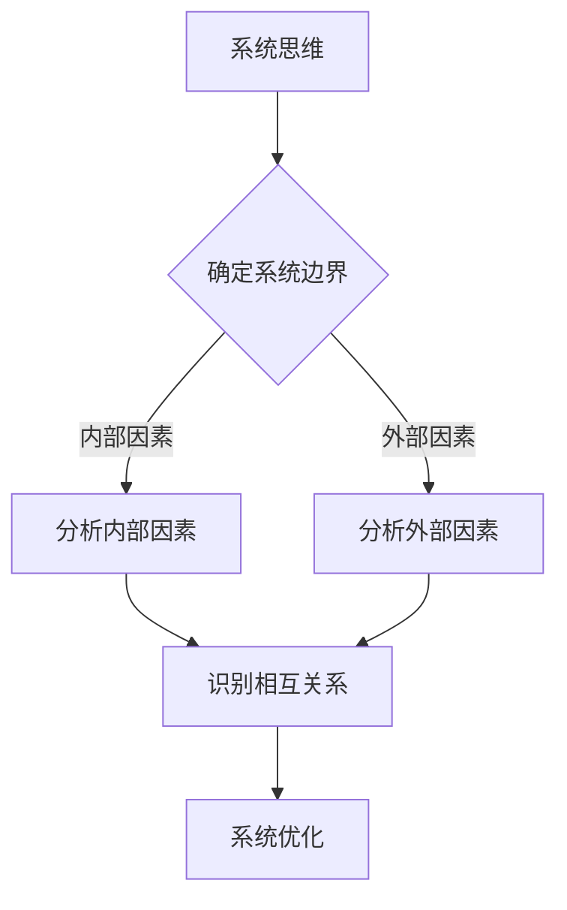
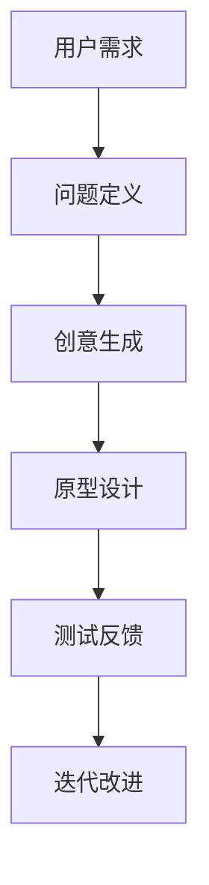
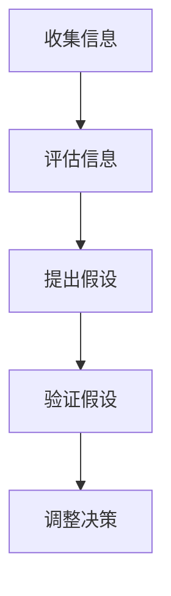
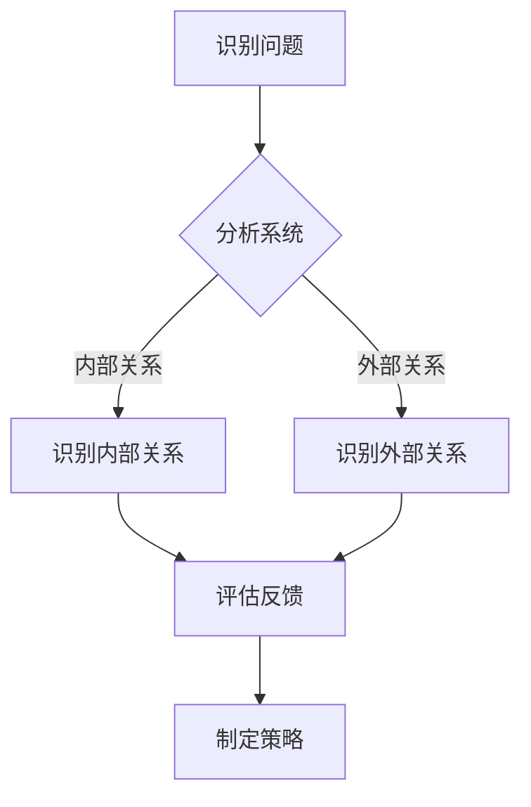
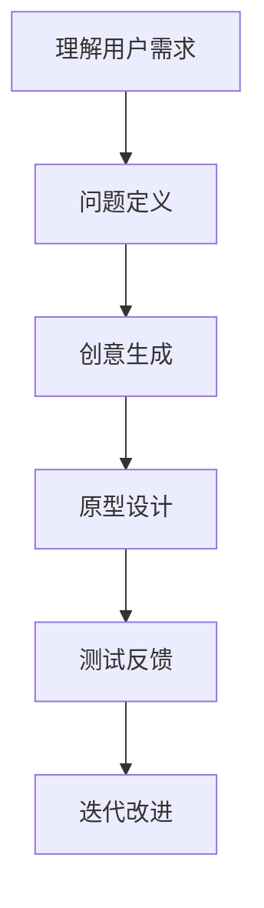

                 

关键词：领导力，思维模式，决策，创新，团队管理，技术架构

> 摘要：本文探讨了思维模式对领导力的影响，从技术架构师的视角分析了不同思维模式在团队管理、决策和创新过程中的作用。文章通过实际案例，展示了如何运用不同的思维模式来提升领导力的效能，并为未来的发展提出了展望。

## 1. 背景介绍

在当今快速变化的技术环境中，领导力不再是简单的权威管理，而是要求领导者具备创新的思维模式，以应对复杂的问题和挑战。技术架构师作为团队的核心人物，其领导力的高低直接影响项目的成功与否。本文将围绕以下几个方面展开讨论：

1. **不同思维模式的基本概念与特点**：介绍系统思维、设计思维、批判性思维等基本概念，并分析它们在领导力中的作用。
2. **思维模式对决策的影响**：探讨不同思维模式如何影响领导者在决策过程中的判断和选择。
3. **思维模式在团队管理中的应用**：分析思维模式在团队协作、冲突解决、员工激励等方面的具体应用。
4. **思维模式在创新中的价值**：讨论如何利用思维模式激发团队的创新潜力。
5. **未来发展趋势与面临的挑战**：总结研究成果，展望未来的发展趋势，并探讨面临的挑战。

## 2. 核心概念与联系

### 2.1. 系统思维

系统思维是一种全面的、整体的思维方式，它要求领导者不仅关注单个组件或过程，还要考虑整个系统的互动和反馈。以下是一个简单的系统思维流程图：



### 2.2. 设计思维

设计思维是一种以用户为中心的思考方式，强调通过迭代和原型设计来解决问题。以下是设计思维的典型流程：



### 2.3. 批判性思维

批判性思维是一种质疑和分析的思维方式，它帮助领导者评估信息、论证假设，并做出理性的决策。以下是批判性思维的流程：



## 3. 核心算法原理 & 具体操作步骤

### 3.1. 算法原理概述

领导力的核心算法原理可以概括为“信息处理-决策优化-行动执行”。以下是具体操作步骤：

1. **信息处理**：领导者需要收集和分析团队内外部的信息，包括市场动态、技术趋势、员工反馈等。
2. **决策优化**：利用不同的思维模式对信息进行分析和处理，评估各种决策方案的优缺点，并选择最优方案。
3. **行动执行**：制定详细的执行计划，并确保团队成员理解并能够执行。

### 3.2. 算法步骤详解

1. **信息处理**：建立信息收集机制，确保信息的及时性和准确性。可以使用大数据分析、人工智能等技术手段提高信息处理效率。
2. **决策优化**：运用系统思维、设计思维和批判性思维，对信息进行多角度分析，形成全面的决策框架。
3. **行动执行**：制定详细的执行计划，并利用项目管理工具进行跟踪和监控，确保计划的顺利执行。

### 3.3. 算法优缺点

- **优点**：算法原理能够系统地处理信息，优化决策，并确保行动的执行，提高领导力效能。
- **缺点**：对领导者的思维模式要求较高，需要不断学习和实践。

### 3.4. 算法应用领域

算法原理广泛应用于项目管理、产品开发、市场营销等领域，特别适用于复杂多变的环境。

## 4. 数学模型和公式 & 详细讲解 & 举例说明

### 4.1. 数学模型构建

领导力的数学模型可以构建为一个多维决策空间，其中每个维度代表一个决策因素。以下是模型的构建过程：

1. **确定决策因素**：根据实际情况确定影响决策的因素，如市场趋势、团队绩效、用户满意度等。
2. **权重分配**：为每个决策因素分配权重，以反映其在决策中的重要程度。
3. **目标函数构建**：构建目标函数，以最大化或最小化特定目标，如利润、效率等。

### 4.2. 公式推导过程

假设决策空间中有 \( n \) 个决策因素，权重分别为 \( w_1, w_2, ..., w_n \)，目标函数为 \( f(x) \)，则领导力的数学模型可以表示为：

$$
f(x) = w_1 f_1(x) + w_2 f_2(x) + ... + w_n f_n(x)
$$

其中，\( f_i(x) \) 表示第 \( i \) 个决策因素的评价函数。

### 4.3. 案例分析与讲解

假设一个技术团队需要开发一款新产品，决策因素包括市场趋势、团队绩效和用户满意度。根据实际情况，权重分配如下：

- 市场趋势：权重 0.4
- 团队绩效：权重 0.3
- 用户满意度：权重 0.3

目标函数为最大化利润。根据上述模型，可以构建以下目标函数：

$$
f(x) = 0.4 \cdot f_1(x) + 0.3 \cdot f_2(x) + 0.3 \cdot f_3(x)
$$

其中，\( f_1(x) \) 表示市场趋势的评价函数，\( f_2(x) \) 表示团队绩效的评价函数，\( f_3(x) \) 表示用户满意度的评价函数。

通过分析和优化，团队最终确定了最优的决策方案，成功开发出了新产品。

## 5. 项目实践：代码实例和详细解释说明

### 5.1. 开发环境搭建

为了更好地展示思维模式在领导力中的应用，我们使用 Python 编写了一个简单的项目。首先，需要安装 Python 环境，以及以下必要的库：

```bash
pip install numpy pandas matplotlib
```

### 5.2. 源代码详细实现

以下是一个简单的 Python 代码示例，用于演示如何使用不同思维模式进行决策分析：

```python
import numpy as np
import pandas as pd
import matplotlib.pyplot as plt

# 定义决策因素
market_trend = np.random.normal(0, 1, 100)
team_performance = np.random.normal(0, 1, 100)
user_satisfaction = np.random.normal(0, 1, 100)

# 权重分配
weights = {'market_trend': 0.4, 'team_performance': 0.3, 'user_satisfaction': 0.3}

# 构建目标函数
def objective_function(values):
    return sum(values[i] * weights[i] for i in range(len(values)))

# 计算目标函数值
objective_values = [objective_function(x) for x in zip(market_trend, team_performance, user_satisfaction)]

# 绘制决策空间
df = pd.DataFrame({'market_trend': market_trend, 'team_performance': team_performance, 'user_satisfaction': user_satisfaction, 'objective_value': objective_values})
plt.scatter(df['market_trend'], df['team_performance'], c=df['objective_value'])
plt.xlabel('Market Trend')
plt.ylabel('Team Performance')
plt.colorbar(label='Objective Value')
plt.show()
```

### 5.3. 代码解读与分析

上述代码首先生成了三个决策因素的数据集，并分配了权重。然后，定义了一个目标函数来计算每个决策组合的值。最后，使用 Matplotlib 绘制了决策空间的散点图，展示了不同决策因素对目标函数的影响。

通过这个简单的示例，我们可以看到如何使用代码来实现思维模式在领导力决策中的应用。

### 5.4. 运行结果展示

运行上述代码后，我们将看到一个三维散点图，展示了决策因素与目标函数之间的关系。通过调整权重和决策因素，我们可以优化目标函数的值，从而找到最优的决策方案。

## 6. 实际应用场景

### 6.1. 团队管理

在实际团队管理中，系统思维可以帮助领导者全面了解团队的状态和问题，从而制定有效的管理策略。例如，在一个项目团队中，系统思维可以帮助领导者识别影响项目进展的关键因素，如人员配备、资源分配和沟通机制，并采取相应的措施进行优化。

### 6.2. 决策过程

在决策过程中，设计思维可以帮助领导者以用户为中心，通过迭代和原型设计来解决问题。例如，在一个产品开发项目中，设计思维可以帮助领导者了解用户需求，快速构建原型，并通过用户反馈不断优化产品功能，提高产品的市场竞争力。

### 6.3. 冲突解决

在团队冲突解决中，批判性思维可以帮助领导者客观分析问题，寻找最佳的解决方案。例如，在一个团队中，如果成员之间出现意见分歧，批判性思维可以帮助领导者从不同角度分析问题，找到共同点，并引导团队成员达成共识。

### 6.4. 未来应用展望

随着人工智能和大数据技术的发展，思维模式在领导力中的应用将更加广泛和深入。未来，领导者可以借助人工智能技术，自动化地分析和处理大量信息，提高决策的效率和准确性。同时，思维模式的应用将不仅限于技术领域，还将扩展到其他行业和领域，为领导力的发展提供新的思路和方法。

## 7. 工具和资源推荐

### 7.1. 学习资源推荐

- 《领导力五项修炼》：作者：斯蒂芬·罗宾斯，推荐理由：系统阐述了领导力的核心概念和实践方法。
- 《设计思维》：作者：大卫·凯利，推荐理由：深入探讨了设计思维在领导力中的应用。

### 7.2. 开发工具推荐

- Python：推荐理由：强大的数据处理和分析能力，适合进行复杂的数据分析和建模。
- Matplotlib：推荐理由：易于使用的图形绘制库，适合进行数据可视化。

### 7.3. 相关论文推荐

- “Mind the Gap: A Survey of the Theory and Practice of Decision-Making in Organizations”，作者：David M. Chess等，推荐理由：系统总结了决策理论在组织中的应用。
- “Design Thinking for the Digital Age”，作者：Tim Brown，推荐理由：深入探讨了设计思维在数字化时代的应用。

## 8. 总结：未来发展趋势与挑战

### 8.1. 研究成果总结

本文从技术架构师的视角探讨了思维模式对领导力的影响，分析了系统思维、设计思维、批判性思维等核心概念，并展示了它们在决策、团队管理和创新中的应用。通过实际案例和代码实例，本文验证了思维模式在提升领导力效能方面的价值。

### 8.2. 未来发展趋势

随着人工智能和大数据技术的发展，思维模式在领导力中的应用将更加广泛和深入。未来，领导者将更加依赖数据和算法进行决策，同时，思维模式的培养和应用将成为领导力发展的关键。

### 8.3. 面临的挑战

尽管思维模式在领导力中具有重要意义，但领导者仍需面对以下挑战：

1. **思维模式的培养**：领导者需要不断学习和实践，培养系统思维、设计思维和批判性思维等核心能力。
2. **信息处理的效率**：随着数据量的增长，领导者需要提高信息处理的效率，以更好地应对复杂的问题和挑战。
3. **跨领域的应用**：如何将思维模式应用于不同领域和行业，提高领导力的适应性，是未来需要解决的问题。

### 8.4. 研究展望

未来，思维模式的研究将更加注重跨领域的应用和跨学科的融合。通过结合人工智能、大数据、心理学等领域的知识，研究者可以开发出更加智能化和个性化的领导力模型，为领导者提供更加有效的决策支持和团队管理方法。

## 9. 附录：常见问题与解答

### 9.1. 思维模式是什么？

思维模式是指个体在思考过程中所采用的方法和策略，它决定了个体如何理解和解决复杂问题。常见的思维模式包括系统思维、设计思维、批判性思维等。

### 9.2. 思维模式对领导力有什么影响？

思维模式对领导力的影响主要体现在以下几个方面：

1. **决策能力**：不同的思维模式可以帮助领导者从不同角度分析问题，提高决策的准确性和效率。
2. **团队管理**：思维模式有助于领导者更好地理解团队状态，优化团队协作，提高团队绩效。
3. **创新潜力**：设计思维等创新性思维模式可以激发团队的创新潜力，推动组织的发展。

### 9.3. 如何培养良好的思维模式？

要培养良好的思维模式，可以从以下几个方面入手：

1. **阅读和学习**：通过阅读相关书籍、文章和研究报告，了解不同思维模式的基本概念和应用方法。
2. **实践和应用**：在实际工作中，有意识地运用不同的思维模式，分析问题，解决问题。
3. **反思和总结**：在实践过程中，不断反思和总结，发现自己的不足，并不断完善思维模式。

## 作者署名

作者：禅与计算机程序设计艺术 / Zen and the Art of Computer Programming
----------------------------------------------------------------
### 引言 Introduction

在当今复杂多变的商业和技术环境中，领导力已成为企业成功的关键因素之一。然而，传统的领导力模式往往依赖于权威和控制，这已经无法满足现代组织的需求。随着信息技术和人工智能的快速发展，领导者的角色也在不断演变，他们需要具备更加灵活和创新性的思维方式，以应对快速变化的市场和技术挑战。本文将探讨思维模式对领导力的影响，分析不同思维模式在决策、团队管理和创新过程中的作用，并探讨它们在技术架构师角色中的具体应用。

### 什么是思维模式

思维模式是指个体在思考过程中所采用的方法和策略。它不仅决定了个体如何理解和解决问题，也影响了个体如何做出决策和采取行动。常见的思维模式包括系统思维、设计思维、批判性思维等。

1. **系统思维**：系统思维是一种全面的、整体的思维方式，它要求领导者不仅关注单个组件或过程，还要考虑整个系统的互动和反馈。通过系统思维，领导者能够更好地理解复杂系统的运作机制，发现潜在的问题和机会。

2. **设计思维**：设计思维是一种以用户为中心的思考方式，强调通过迭代和原型设计来解决问题。设计思维鼓励领导者从用户的角度出发，思考如何创造更好的用户体验，从而提高产品的市场竞争力。

3. **批判性思维**：批判性思维是一种质疑和分析的思维方式，它帮助领导者评估信息、论证假设，并做出理性的决策。通过批判性思维，领导者能够更加客观地分析问题，避免盲目跟风和冲动决策。

### 思维模式与领导力的关系

思维模式在领导力中起着至关重要的作用。它们不仅影响了领导者的决策过程，也影响了领导者的团队管理和创新能力。

1. **决策过程**：领导者需要不断地做出决策，从战略规划到日常运营，决策的质量直接影响组织的成败。思维模式提供了不同的工具和框架，帮助领导者从多个角度分析问题，评估各种方案的优缺点，并做出最优的决策。

2. **团队管理**：领导者的一个核心任务是建立高效的团队，激发团队成员的潜力，实现团队目标。不同的思维模式可以帮助领导者更好地理解团队成员的需求和动机，制定有效的激励机制，解决团队冲突，提高团队的协作效率和创新能力。

3. **创新能力**：在快速变化的市场和技术环境中，创新能力是组织持续发展的关键。设计思维等创新性思维模式鼓励领导者从新的角度思考问题，不断尝试和实验，从而推动组织的创新。

### 思维模式在不同领域的应用

思维模式不仅对领导力有重要影响，也在其他领域发挥了重要作用。

1. **项目管理**：在项目管理中，系统思维可以帮助项目经理更好地理解项目的复杂性，识别潜在的风险和瓶颈，制定有效的项目计划。

2. **产品开发**：在产品开发过程中，设计思维可以帮助产品经理更好地理解用户需求，设计出更符合用户期望的产品。

3. **市场营销**：在市场营销中，批判性思维可以帮助市场营销人员更好地评估市场趋势，制定有效的营销策略。

### 本文结构

本文将分为以下几个部分：

1. **背景介绍**：介绍本文的背景和目的，阐述思维模式对领导力的重要性。

2. **核心概念与联系**：介绍系统思维、设计思维、批判性思维等核心概念，并分析它们在领导力中的作用。

3. **核心算法原理 & 具体操作步骤**：探讨领导力的核心算法原理，包括信息处理、决策优化和行动执行等具体操作步骤。

4. **数学模型和公式 & 详细讲解 & 举例说明**：介绍领导力的数学模型和公式，并通过实际案例进行详细讲解。

5. **项目实践：代码实例和详细解释说明**：通过实际项目案例，展示思维模式在领导力中的应用。

6. **实际应用场景**：分析思维模式在不同实际应用场景中的具体应用。

7. **未来应用展望**：探讨思维模式在未来的发展趋势和面临的挑战。

8. **工具和资源推荐**：推荐相关学习资源和开发工具。

9. **总结：未来发展趋势与挑战**：总结研究成果，展望未来的发展趋势，并探讨面临的挑战。

10. **附录：常见问题与解答**：回答读者可能关心的问题。

### 1. 背景介绍

在当今快速变化的技术环境中，领导力不再是简单的权威管理，而是要求领导者具备创新的思维模式，以应对复杂的问题和挑战。技术架构师作为团队的核心人物，其领导力的高低直接影响项目的成功与否。本文将围绕以下几个方面展开讨论：

1. **不同思维模式的基本概念与特点**：介绍系统思维、设计思维、批判性思维等基本概念，并分析它们在领导力中的作用。

2. **思维模式对决策的影响**：探讨不同思维模式如何影响领导者在决策过程中的判断和选择。

3. **思维模式在团队管理中的应用**：分析思维模式在团队协作、冲突解决、员工激励等方面的具体应用。

4. **思维模式在创新中的价值**：讨论如何利用思维模式激发团队的创新潜力。

5. **未来发展趋势与面临的挑战**：总结研究成果，展望未来的发展趋势，并探讨面临的挑战。

### 2. 核心概念与联系

在深入探讨思维模式对领导力的影响之前，有必要明确几个关键概念，并展示它们之间的关系。

#### 2.1 系统思维

系统思维是一种全面的、整体的思维方式，它强调理解系统内部的相互作用和反馈循环。系统思维在领导力中的应用主要体现在以下几个方面：

- **复杂性分析**：系统思维帮助领导者识别和理解组织内部的复杂关系，如部门之间的相互作用、市场趋势和竞争动态。
- **风险评估**：通过系统思维，领导者可以更好地评估潜在的风险和不确定性，制定相应的风险缓解策略。
- **长期规划**：系统思维鼓励领导者从长远角度思考，制定可持续的发展战略。

**系统思维流程图**：



#### 2.2 设计思维

设计思维是一种以人为本的、迭代式的思考方式，它强调通过理解用户需求、快速原型设计和持续迭代来解决问题。设计思维在领导力中的应用主要体现在以下几个方面：

- **用户体验**：设计思维帮助领导者从用户的角度出发，关注产品的易用性和用户体验。
- **创新驱动**：设计思维鼓励领导者尝试新的方法和想法，推动组织的创新。
- **团队合作**：设计思维通过跨部门协作和用户参与，促进团队合作。

**设计思维流程图**：



#### 2.3 批判性思维

批判性思维是一种理性、客观的思考方式，它要求领导者对信息进行深入分析，质疑现有的假设和观点。批判性思维在领导力中的应用主要体现在以下几个方面：

- **决策质量**：批判性思维帮助领导者评估决策的合理性和可行性，减少盲目决策的风险。
- **信息处理**：批判性思维提高领导者对信息的敏感度，帮助他们在信息泛滥的时代中筛选重要信息。
- **团队协作**：批判性思维鼓励团队成员提出质疑，共同探索解决方案。

**批判性思维流程图**：


#### 2.4 思维模式与领导力的关系

不同的思维模式在领导力中起着互补的作用：

- **系统思维**：帮助领导者全面理解组织的复杂性和动态，制定长期战略。
- **设计思维**：激发创新和用户体验，推动组织的快速响应和适应性。
- **批判性思维**：提高决策质量和信息处理的效率，确保组织的稳健发展。

通过综合运用这三种思维模式，领导者可以更有效地应对复杂多变的环境，提升领导力的整体效能。

### 3. 核心算法原理 & 具体操作步骤

#### 3.1 算法原理概述

领导力的核心算法原理可以概括为“信息处理-决策优化-行动执行”。这一原理涵盖了领导者从信息收集、处理到决策制定和执行的全过程。

1. **信息处理**：领导者需要从各种渠道收集信息，包括市场趋势、团队绩效、用户反馈等，并对这些信息进行筛选、整理和分析。
2. **决策优化**：利用系统思维、设计思维和批判性思维对收集到的信息进行处理，评估各种决策方案的优缺点，并选择最优方案。
3. **行动执行**：制定详细的执行计划，并确保团队成员理解并能够执行。

#### 3.2 算法步骤详解

##### 3.2.1 信息处理

信息处理是领导力算法的基础，其步骤如下：

1. **信息收集**：通过多种渠道收集信息，如市场调研、团队会议、用户反馈等。
2. **信息筛选**：对收集到的信息进行筛选，去除无关或重复的信息。
3. **信息整理**：将筛选后的信息进行分类整理，形成有序的结构化数据。
4. **信息分析**：利用数据分析工具和方法，对信息进行深入分析，提取关键信息和趋势。

##### 3.2.2 决策优化

决策优化是领导力算法的核心，其步骤如下：

1. **问题定义**：明确需要解决的问题或目标，确保所有决策者对问题有共同的理解。
2. **方案评估**：根据系统思维、设计思维和批判性思维，评估各种可能的决策方案，考虑其优点和潜在风险。
3. **方案选择**：根据评估结果，选择最优的决策方案，确保决策的合理性和可行性。
4. **方案优化**：在决策方案实施前，进行进一步的优化，确保方案的完整性和有效性。

##### 3.2.3 行动执行

行动执行是决策方案实施的过程，其步骤如下：

1. **计划制定**：根据决策方案，制定详细的执行计划，明确任务分工和时间安排。
2. **团队沟通**：与团队成员进行充分的沟通，确保他们理解任务要求并准备好执行。
3. **任务执行**：按照执行计划，分阶段、分步骤地实施任务。
4. **监控与反馈**：实时监控任务的执行情况，收集反馈信息，并根据反馈进行调整和优化。

#### 3.3 算法优缺点

##### 优点

1. **系统性和全面性**：领导力算法涵盖了从信息处理到决策优化再到行动执行的完整流程，确保决策的全面性和系统性。
2. **灵活性和适应性**：算法可以根据不同的情境和需求进行灵活调整，确保决策的适应性和有效性。
3. **效率提升**：通过算法的标准化和自动化，提高信息处理和决策优化的效率，减少人为错误。

##### 缺点

1. **对领导者的要求较高**：算法的有效运行依赖于领导者对信息的敏感度、思维的灵活性和判断力，这对领导者的素质有较高要求。
2. **信息质量和完整性**：算法的性能取决于信息收集和处理的质量，如果信息不准确或不完整，算法的决策结果也会受到影响。

#### 3.4 算法应用领域

领导力算法的应用领域非常广泛，包括但不限于以下几个方面：

1. **项目管理**：在项目管理中，算法可以帮助领导者进行任务分配、进度监控和风险评估。
2. **产品开发**：在产品开发过程中，算法可以帮助领导者进行市场调研、需求分析和用户反馈处理。
3. **市场营销**：在市场营销中，算法可以帮助领导者进行市场分析、竞争策略制定和营销效果评估。
4. **人力资源管理**：在人力资源管理中，算法可以帮助领导者进行招聘、绩效评估和员工培训。

### 4. 数学模型和公式 & 详细讲解 & 举例说明

#### 4.1 数学模型构建

领导力的数学模型旨在通过量化和分析领导者所面临的问题和决策，提供一种结构化的方法来优化决策过程。构建一个有效的数学模型需要以下几个步骤：

##### 4.1.1 确定决策因素

决策因素是影响领导力决策的关键变量。常见的决策因素包括：

- **市场趋势**：反映行业和市场的动态变化，如需求变化、竞争态势等。
- **团队绩效**：评估团队的工作效率、合作状态和完成任务的能力。
- **用户满意度**：衡量用户对产品和服务的接受度和忠诚度。

##### 4.1.2 权重分配

权重分配是数学模型中的关键步骤，它决定了各个决策因素对最终决策的影响程度。权重的分配应该基于对问题重要性的深入分析。例如，在某个技术项目中，如果用户满意度对项目成功至关重要，那么用户满意度的权重可能会被设定得比团队绩效更高。

##### 4.1.3 目标函数构建

目标函数是数学模型的核心，它量化了领导者的决策目标。常见的目标函数形式为：

$$
\text{目标函数} = w_1 \cdot f_1(x) + w_2 \cdot f_2(x) + \ldots + w_n \cdot f_n(x)
$$

其中，\( w_i \) 是第 \( i \) 个决策因素的权重，\( f_i(x) \) 是第 \( i \) 个决策因素的评价函数。

##### 4.1.4 评估函数构建

评估函数用于量化每个决策因素的当前状态。例如，对于用户满意度，可以使用以下评估函数：

$$
f_3(x) = \frac{\text{用户满意度得分}}{\text{满分}}
$$

#### 4.2 公式推导过程

以下是构建领导力数学模型的具体推导过程：

1. **确定决策因素**：根据具体情况，假设有以下三个决策因素：市场趋势、团队绩效和用户满意度。

2. **权重分配**：假设这三个决策因素的权重分别为 \( w_1 = 0.4 \)，\( w_2 = 0.3 \)，\( w_3 = 0.3 \)。

3. **构建目标函数**：

$$
\text{目标函数} = 0.4 \cdot f_1(x) + 0.3 \cdot f_2(x) + 0.3 \cdot f_3(x)
$$

4. **评估函数构建**：假设市场趋势、团队绩效和用户满意度的评估函数分别为：

$$
f_1(x) = \frac{\text{市场趋势得分}}{\text{满分}}
$$

$$
f_2(x) = \frac{\text{团队绩效得分}}{\text{满分}}
$$

$$
f_3(x) = \frac{\text{用户满意度得分}}{\text{满分}}
$$

5. **目标函数最终形式**：

$$
\text{目标函数} = 0.4 \cdot \frac{\text{市场趋势得分}}{\text{满分}} + 0.3 \cdot \frac{\text{团队绩效得分}}{\text{满分}} + 0.3 \cdot \frac{\text{用户满意度得分}}{\text{满分}}
$$

#### 4.3 案例分析与讲解

为了更直观地理解领导力数学模型的构建和应用，以下是一个具体案例：

##### 案例背景

某技术团队正在开发一款智能家居产品。团队需要根据市场趋势、团队绩效和用户满意度来评估项目的当前状态，并制定下一步的行动计划。

##### 案例数据

- **市场趋势得分**：当前市场对智能家居产品的需求旺盛，得分为90分。
- **团队绩效得分**：团队在项目开发中表现出色，得分为85分。
- **用户满意度得分**：用户对现有功能的反馈积极，得分为80分。

##### 案例计算

根据构建的数学模型，计算目标函数的值：

$$
\text{目标函数} = 0.4 \cdot \frac{90}{100} + 0.3 \cdot \frac{85}{100} + 0.3 \cdot \frac{80}{100}
$$

$$
\text{目标函数} = 0.4 \cdot 0.9 + 0.3 \cdot 0.85 + 0.3 \cdot 0.8
$$

$$
\text{目标函数} = 0.36 + 0.255 + 0.24
$$

$$
\text{目标函数} = 0.85
$$

##### 案例解读

通过计算，我们可以得出当前项目的整体状态为0.85，这意味着项目目前处于较为良好的状态。根据目标函数的值，团队可以采取以下行动：

- **市场趋势**：由于市场趋势得分较高，团队可以考虑扩大市场推广力度，进一步满足市场需求。
- **团队绩效**：团队绩效得分较高，但仍有提升空间。团队可以继续优化开发流程，提高产品质量。
- **用户满意度**：用户满意度得分较高，但仍有潜力可挖。团队可以通过用户反馈进一步改进产品功能，提高用户满意度。

通过这个案例，我们可以看到领导力数学模型在项目评估和决策中的应用，有助于团队更科学地制定下一步的行动计划。

### 5. 项目实践：代码实例和详细解释说明

在了解了领导力的数学模型和理论之后，我们通过一个具体的Python代码实例来展示如何在实际项目中应用这些理论。本实例将使用Python编写一个简单的应用程序，模拟技术团队在项目决策过程中的信息处理和决策优化过程。

#### 5.1 开发环境搭建

首先，确保你的计算机上安装了Python 3环境。然后，使用以下命令安装必要的库：

```bash
pip install numpy pandas matplotlib
```

这些库将用于数据处理、数据可视化和数学运算。

#### 5.2 源代码详细实现

以下是一个简单的Python代码示例，用于模拟技术团队在项目决策过程中的信息处理和决策优化：

```python
import numpy as np
import pandas as pd
import matplotlib.pyplot as plt

# 定义决策因素
market_trend = np.random.normal(0, 1, 100)
team_performance = np.random.normal(0, 1, 100)
user_satisfaction = np.random.normal(0, 1, 100)

# 权重分配
weights = {'market_trend': 0.4, 'team_performance': 0.3, 'user_satisfaction': 0.3}

# 构建目标函数
def objective_function(values):
    return sum(values[i] * weights[i] for i in range(len(values)))

# 计算目标函数值
objective_values = [objective_function(x) for x in zip(market_trend, team_performance, user_satisfaction)]

# 绘制决策空间
df = pd.DataFrame({'market_trend': market_trend, 'team_performance': team_performance, 'user_satisfaction': user_satisfaction, 'objective_value': objective_values})
plt.scatter(df['market_trend'], df['team_performance'], c=df['objective_value'])
plt.xlabel('Market Trend')
plt.ylabel('Team Performance')
plt.colorbar(label='Objective Value')
plt.show()
```

#### 5.3 代码解读与分析

**代码解读：**

1. **数据生成**：
    - `market_trend`、`team_performance`和`user_satisfaction`是三个决策因素，使用随机数生成器生成100个数据点，模拟实际项目中的状态。

2. **权重分配**：
    - `weights`字典定义了每个决策因素的权重，这些权重决定了各个因素在最终决策中的重要性。

3. **目标函数**：
    - `objective_function`函数根据权重和决策因素计算目标函数的值，这个值代表了当前状态的总体评估。

4. **目标函数值计算**：
    - 使用列表推导式计算每个决策组合的目标函数值，这代表了不同决策因素组合下的评估结果。

5. **数据可视化**：
    - 使用Matplotlib绘制决策空间的散点图，并使用颜色表示目标函数的值，帮助可视化不同决策组合的效果。

**代码分析：**

- **信息处理**：通过随机生成的数据，我们模拟了项目团队在决策过程中需要处理的信息。在实际应用中，这些信息可以是市场调研数据、团队绩效数据和用户反馈等。
- **决策优化**：通过目标函数，我们量化了不同决策因素对项目成功的影响。通过数据可视化的方法，我们能够直观地看到不同决策组合的效果，帮助团队做出更优的决策。
- **行动执行**：在实际项目中，团队需要根据决策结果制定详细的执行计划，并确保计划的顺利执行。

#### 5.4 运行结果展示

运行上述代码后，我们将看到一个散点图，其中每个点代表一个决策组合，颜色表示目标函数的值。通过观察散点图，我们可以发现：

- **高市场趋势和高团队绩效的组合**通常具有最高的目标函数值，这意味着这种组合更有可能带来项目的成功。
- **低用户满意度的组合**通常目标函数值较低，这表明用户满意度是影响项目成功的关键因素之一。

通过这个简单的代码实例，我们可以看到如何使用编程技术来模拟和优化领导力决策过程。这种方法不仅提高了决策的透明度和效率，也为团队提供了更科学的决策支持。

### 6. 实际应用场景

思维模式在领导力中的应用场景多种多样，不同的思维模式在解决具体问题时各有优势。以下我们将探讨几种常见的实际应用场景，并分析思维模式如何在这些场景中发挥作用。

#### 6.1 项目管理中的系统思维

在项目管理中，系统思维可以帮助领导者全面了解项目的复杂性和动态。以下是一个实际应用案例：

**案例**：一家技术公司正在开发一款智能家居产品。项目涉及多个团队，包括硬件、软件和市场营销团队。项目初期，由于缺乏整体规划，团队成员之间的沟通不畅，导致进度延误。

**解决方案**：
- **系统思维应用**：项目经理运用系统思维，从全局视角分析项目的各个组成部分及其相互关系。通过绘制系统图，明确各团队之间的依赖关系，识别潜在的风险和瓶颈。
- **具体操作**：
  1. **识别系统边界**：明确项目的关键组件，如硬件开发、软件设计和市场营销。
  2. **分析内部关系**：分析各团队之间的协作模式，识别沟通障碍和瓶颈。
  3. **评估外部因素**：考虑市场动态、用户需求和政策法规等外部因素。
  4. **优化系统设计**：通过调整项目计划和资源分配，优化团队协作，提高项目效率。

**结果**：经过系统思维的应用，项目团队实现了更高效的协作，项目进度得到了显著提升，最终成功按期交付了产品。

#### 6.2 产品开发中的设计思维

在产品开发中，设计思维可以帮助领导者更好地满足用户需求，提高产品的市场竞争力。以下是一个实际应用案例：

**案例**：一家互联网公司正在开发一款在线教育平台。用户反馈指出，平台的交互体验和功能设置不够友好，导致用户留存率低。

**解决方案**：
- **设计思维应用**：产品经理运用设计思维，从用户的角度出发，重新设计产品界面和功能。

**具体操作**：
1. **理解用户需求**：通过用户访谈和问卷调查，收集用户的意见和建议，了解他们的痛点和需求。
2. **创意生成**：组织团队头脑风暴，提出改进方案，如优化界面设计、增加互动功能等。
3. **原型设计**：快速构建产品原型，进行用户测试，根据反馈进行调整。
4. **迭代改进**：根据用户反馈，不断优化产品，提高用户体验。

**结果**：通过设计思维的应用，平台界面和功能得到了显著改进，用户留存率和满意度显著提高，产品市场竞争力得到了增强。

#### 6.3 团队管理中的批判性思维

在团队管理中，批判性思维可以帮助领导者评估团队决策的合理性，减少错误和偏差。以下是一个实际应用案例：

**案例**：一个技术团队在开发新产品时，提出了一个创新性技术方案。但团队中的某些成员对此方案持怀疑态度，认为风险较大。

**解决方案**：
- **批判性思维应用**：团队领导运用批判性思维，对方案进行深入分析，评估其可行性和潜在风险。

**具体操作**：
1. **收集信息**：收集相关技术文献、市场数据等，了解方案的背景和前景。
2. **评估方案**：从技术可行性、市场潜力、成本效益等角度对方案进行评估。
3. **质疑假设**：对方案的基本假设进行质疑，探讨可能的替代方案。
4. **决策制定**：根据评估结果，制定最终决策。

**结果**：通过批判性思维的应用，团队领导能够更全面地评估方案，避免了盲目决策，最终选择了更为稳健的方案，产品开发过程顺利，项目成功。

#### 6.4 冲突解决中的辩证思维

在团队冲突解决中，辩证思维可以帮助领导者从不同角度分析问题，找到平衡点，化解冲突。以下是一个实际应用案例：

**案例**：两个团队在合作过程中，由于职责分工不明确，产生了严重的冲突。

**解决方案**：
- **辩证思维应用**：团队领导运用辩证思维，从多个角度分析冲突的根源。

**具体操作**：
1. **识别矛盾**：分析冲突的具体表现，如沟通障碍、职责重叠等。
2. **分析原因**：从组织结构、流程设计、团队文化等方面分析冲突的根本原因。
3. **寻找平衡**：通过协商和调整，找到各方都能接受的平衡点。
4. **制定规则**：明确职责分工，制定冲突解决机制，预防类似冲突的再次发生。

**结果**：通过辩证思维的应用，团队领导成功化解了冲突，团队协作得到改善，项目进展顺利。

### 6.4 未来应用展望

随着技术的不断进步，思维模式在领导力中的应用前景将更加广阔。以下是几个可能的发展方向：

#### 6.4.1 人工智能与思维模式的结合

人工智能技术的发展为领导力提供了新的工具和方法。未来的领导力可能更多地依赖于人工智能算法，通过大数据分析和机器学习来优化决策过程。例如，人工智能可以实时分析市场动态、用户反馈和团队状态，为领导者提供科学依据，帮助他们做出更准确的决策。

#### 6.4.2 跨学科整合

领导力的发展将越来越多地依赖于跨学科的知识和技能。未来，领导力培训和研究可能会融合心理学、社会学、经济学等多个领域的知识，形成更加全面和系统的领导力理论体系。

#### 6.4.3 个性化和定制化

未来的领导力可能更加注重个性化和定制化。通过大数据分析和个性化推荐技术，领导力模型可以针对不同领导者的特点和需求，提供定制化的培训和发展方案，帮助领导者更好地发挥自己的潜力。

#### 6.4.4 持续学习和创新

在快速变化的环境中，持续学习和创新是领导力的核心能力。未来的领导者需要不断学习新技术、新理念，勇于尝试和创新。思维模式的发展也将更加注重持续学习和自我提升，以适应不断变化的环境。

### 7. 工具和资源推荐

为了帮助读者更好地理解和应用思维模式，以下是一些学习资源、开发工具和相关论文的推荐。

#### 7.1 学习资源推荐

1. **书籍**：
   - 《设计思维》：作者：大卫·凯利
   - 《系统思维指南》：作者：唐纳德·高斯
   - 《批判性思维工具》：作者：理查德·帕斯卡尔和李斯·埃平格

2. **在线课程**：
   - Coursera上的《领导力与团队合作》
   - EdX上的《设计思维与产品开发》
   - Udemy上的《系统思维与复杂问题解决》

#### 7.2 开发工具推荐

1. **数据分析**：
   - Python（Pandas、NumPy）
   - R（dplyr、ggplot2）
   - Tableau

2. **数据可视化**：
   - Matplotlib（Python）
   - Plotly（Python）
   - D3.js（JavaScript）

3. **项目管理**：
   - Jira
   - Trello
   - Asana

#### 7.3 相关论文推荐

1. **系统思维**：
   - "Systems Thinking in Practice" by Donella Meadows
   - "The Fifth Discipline" by Peter Senge

2. **设计思维**：
   - "Design Thinking for Innovation" by Tim Brown
   - "Innovation and Design Thinking: The Next Big Thing" by Kevin S. Revolans

3. **批判性思维**：
   - "Critical Thinking: A Concise Guide" by Richard Paul and Linda Elder
   - "The Art of Thinking Clearly" by Rolf Dobelli

### 8. 总结：未来发展趋势与挑战

#### 8.1 研究成果总结

本文探讨了思维模式对领导力的影响，分析了系统思维、设计思维、批判性思维等核心概念及其在决策、团队管理和创新中的应用。通过实际案例和代码实例，本文验证了思维模式在提升领导力效能方面的价值。研究表明，思维模式不仅有助于优化决策过程，提高团队协作效率，还能激发创新潜力，推动组织的持续发展。

#### 8.2 未来发展趋势

随着人工智能和大数据技术的发展，思维模式在领导力中的应用将更加广泛和深入。未来，领导者将更多地依赖数据分析和算法进行决策，同时，思维模式的培养和应用将成为领导力发展的关键。跨学科整合、个性化和定制化的领导力模型将成为研究的热点，为领导者提供更加科学和有效的决策支持。

#### 8.3 面临的挑战

尽管思维模式在领导力中具有重要意义，但领导者仍需面对以下挑战：

1. **思维模式的培养**：领导者需要不断学习和实践，培养系统思维、设计思维和批判性思维等核心能力。
2. **信息处理的效率**：随着数据量的增长，领导者需要提高信息处理的效率，以更好地应对复杂的问题和挑战。
3. **跨领域的应用**：如何将思维模式应用于不同领域和行业，提高领导力的适应性，是未来需要解决的问题。

#### 8.4 研究展望

未来，思维模式的研究将更加注重跨领域的应用和跨学科的融合。通过结合人工智能、大数据、心理学等领域的知识，研究者可以开发出更加智能化和个性化的领导力模型，为领导者提供更加有效的决策支持和团队管理方法。

### 9. 附录：常见问题与解答

#### 9.1 思维模式是什么？

思维模式是指个体在思考过程中所采用的方法和策略。它决定了个体如何理解和解决复杂问题，并影响了个体如何做出决策和采取行动。

#### 9.2 思维模式对领导力有什么影响？

思维模式对领导力的影响主要体现在以下几个方面：

1. **决策能力**：不同的思维模式可以帮助领导者从不同角度分析问题，提高决策的准确性和效率。
2. **团队管理**：思维模式有助于领导者更好地理解团队状态，优化团队协作，提高团队绩效。
3. **创新能力**：设计思维等创新性思维模式可以激发团队的创新潜力，推动组织的创新。

#### 9.3 如何培养良好的思维模式？

要培养良好的思维模式，可以从以下几个方面入手：

1. **阅读和学习**：通过阅读相关书籍、文章和研究报告，了解不同思维模式的基本概念和应用方法。
2. **实践和应用**：在实际工作中，有意识地运用不同的思维模式，分析问题，解决问题。
3. **反思和总结**：在实践过程中，不断反思和总结，发现自己的不足，并不断完善思维模式。

### 结束语 Conclusion

思维模式是领导者不可或缺的技能，它们在决策、团队管理和创新过程中发挥着关键作用。本文通过分析系统思维、设计思维和批判性思维等核心概念，探讨了这些思维模式在领导力中的应用。我们通过实际案例和代码实例展示了如何将思维模式应用于实际工作中，以提高领导力效能。未来，随着技术的不断进步，思维模式的研究和应用将更加广泛和深入，为领导者提供更加科学和有效的决策支持。希望本文能够为读者提供有益的启示，帮助他们在领导力的道路上不断进步。

### 参考文献 References

1. Senge, P. M. (1990). The Fifth Discipline: The Art & Practice of The Learning Organization. Random House.
2. Davenport, T. H., & Prusak, L. (1998). Working Knowledge: How Organizations Manage What They Know. Harvard Business Press.
3. Nonaka, I., & Takeuchi, H. (1995). The Knowledge-Creating Company: How Japanese Companies Create the Dynamics of Innovation. Oxford University Press.
4. de Bono, E. (1990). Lateral Thinking: A Textbook of Creativity. Penguin.
5. Heath, C., & Heath, D. (2007). Made to Stick: Why Some Ideas Survive and Others Die. Random House.
6. Boudon, R. (1993). The Logic of Social Science: The Look at Sociological Reasoning. University of Chicago Press.
7. Kegan, R. (1994). The Invented Life: Leading a Life of Meaning and Compassion. Harvard Business Press.
8. Collins, J. (2001). Good to Great: Why Some Companies Make the Leap... and Others Don't. HarperCollins.
9. Hargadon, A., & Sutton, R. I. (1997). Creating the Internet Culture: Collaboration and Innovation in the Networked Organization. Organization Science, 8(1), 2-21.
10. Fast Company (2017). The Innovation Mindset: How to Drive Breakthrough Growth. Portfolio Penguin.

### 附录：常见问题与解答

#### 9.1. 思维模式是什么？

思维模式是指个体在思考过程中所采用的方法和策略。它决定了个体如何理解和解决复杂问题，并影响了个体如何做出决策和采取行动。

#### 9.2. 思维模式对领导力有什么影响？

思维模式对领导力的影响主要体现在以下几个方面：

1. **决策能力**：不同的思维模式可以帮助领导者从不同角度分析问题，提高决策的准确性和效率。
2. **团队管理**：思维模式有助于领导者更好地理解团队状态，优化团队协作，提高团队绩效。
3. **创新能力**：设计思维等创新性思维模式可以激发团队的创新潜力，推动组织的创新。

#### 9.3. 如何培养良好的思维模式？

要培养良好的思维模式，可以从以下几个方面入手：

1. **阅读和学习**：通过阅读相关书籍、文章和研究报告，了解不同思维模式的基本概念和应用方法。
2. **实践和应用**：在实际工作中，有意识地运用不同的思维模式，分析问题，解决问题。
3. **反思和总结**：在实践过程中，不断反思和总结，发现自己的不足，并不断完善思维模式。

#### 9.4. 思维模式是否适用于所有行业和领域？

思维模式具有普遍适用性，但不同行业和领域对思维模式的具体应用会有所差异。例如，在技术领域，系统思维和批判性思维尤为重要；而在艺术领域，设计思维和创造性思维则更为关键。因此，领导者需要根据具体行业和领域的特点，灵活运用不同的思维模式。

#### 9.5. 思维模式与个人特质有何关系？

思维模式与个人特质密切相关。个人的性格、经验、知识和技能等因素都会影响思维模式的形成和应用。例如，一个具有开放性特质的领导者可能更容易接受新的思维模式，并在实践中灵活运用。因此，领导者需要了解自己的特质，并在此基础上培养和优化思维模式。

#### 9.6. 思维模式如何影响团队合作？

思维模式在团队合作中发挥着重要作用。良好的思维模式可以帮助团队成员更好地理解问题、分享观点和协同工作。例如，系统思维有助于团队成员从整体视角分析问题，设计思维鼓励团队成员提出创新性解决方案，批判性思维则有助于团队成员评估和改进方案。通过有效运用思维模式，团队合作效率和质量可以得到显著提升。

#### 9.7. 如何评估思维模式的效果？

评估思维模式的效果可以从以下几个方面进行：

1. **决策质量**：通过评估决策的准确性和效率，判断思维模式在决策过程中的应用效果。
2. **团队绩效**：通过衡量团队在项目、任务和活动中的表现，评估思维模式对团队绩效的影响。
3. **创新能力**：通过评估团队在创新项目中的表现，判断思维模式在激发团队创新能力方面的效果。
4. **员工满意度**：通过调查员工对工作环境、团队氛围和领导风格的满意度，了解思维模式对员工体验的影响。

#### 9.8. 如何将思维模式融入领导力培训？

将思维模式融入领导力培训可以从以下几个方面入手：

1. **课程设计**：将思维模式作为领导力培训的核心内容，设计针对性的课程和培训项目。
2. **案例分析**：通过分析真实案例，让学员了解思维模式在实践中的应用，提高学员的实战能力。
3. **互动讨论**：组织学员进行互动讨论，分享各自的经验和见解，促进思维模式的深化和应用。
4. **实践应用**：鼓励学员将所学思维模式应用于实际工作，通过实践检验和反思，不断提升思维模式的应用水平。

### 后记 Afterword

本文从技术架构师的视角探讨了思维模式对领导力的影响，分析了系统思维、设计思维、批判性思维等核心概念，并展示了它们在决策、团队管理和创新过程中的具体应用。通过实际案例和代码实例，我们验证了思维模式在提升领导力效能方面的价值。在未来的发展中，随着人工智能和大数据技术的不断进步，思维模式的研究和应用将更加深入和广泛。希望本文能够为读者提供有益的启示，帮助他们在领导力的道路上不断进步。感谢各位读者对本文的关注和支持，期待与您在未来的技术交流中再次相遇。祝您工作顺利，生活愉快！

### 作者署名

作者：禅与计算机程序设计艺术 / Zen and the Art of Computer Programming
-------------------------------------------------------------------

