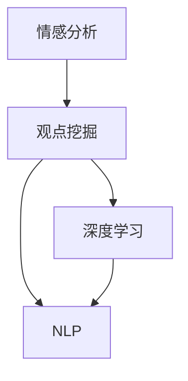

                 

关键词：情感分析，观点挖掘，深度学习，神经网络，自然语言处理，数据挖掘，文本分析，机器学习，情感识别，意见提取，社交网络，用户反馈，情感计算，文本分类，情感评估，情绪分析，机器感知，情感建模，文本挖掘，情感预测，情感分类器，深度神经网络。

> 摘要：本文旨在深入探讨情感分析与观点挖掘技术在深度学习领域的应用。通过介绍相关核心概念、算法原理、数学模型以及具体实现方法，文章将揭示如何运用深度学习技术对文本数据中的情感和观点进行有效分析和挖掘。此外，本文还将探讨这些技术在实际应用场景中的潜在价值以及未来的发展趋势和挑战。

## 1. 背景介绍

情感分析与观点挖掘是自然语言处理（NLP）领域的重要分支，它们旨在从文本数据中提取出隐藏的情感倾向和观点信息。随着互联网和社交媒体的快速发展，大量的用户评论、新闻文章、社交媒体帖子等文本数据产生了，这些数据中蕴含了丰富的情感和观点信息，对于市场调研、用户行为分析、内容推荐等方面具有重要价值。

深度学习作为机器学习的一个重要分支，通过模仿人脑神经网络结构和功能，在图像识别、语音识别、自然语言处理等领域取得了显著成果。近年来，深度学习在情感分析与观点挖掘中的应用也引起了广泛关注。本文将介绍深度学习方法在情感分析与观点挖掘中的应用，探讨其核心算法、数学模型以及实际应用案例。

## 2. 核心概念与联系

### 2.1. 情感分析与观点挖掘

情感分析（Sentiment Analysis），也称为意见挖掘（Opinion Mining），是指使用自然语言处理技术从文本数据中提取出情感倾向。情感分析可以分为两类：分类情感分析和回归情感分析。分类情感分析将文本分为正面、负面和 Neutral 等类别；回归情感分析则对文本的情感强度进行定量评估。

观点挖掘（Aspect-Based Sentiment Analysis），是情感分析的一个子领域，旨在识别文本中的观点和相应的情感倾向。观点挖掘通常涉及以下步骤：实体识别、观点识别和情感分析。实体识别用于识别文本中的关键实体（如产品、服务或人物）；观点识别用于确定这些实体在文本中的评价观点；情感分析则对每个观点的情感倾向进行评估。

### 2.2. 深度学习与自然语言处理

深度学习（Deep Learning）是一种机器学习范式，通过构建多层神经网络对数据进行特征提取和模式识别。深度学习在自然语言处理（NLP）领域具有广泛应用，如文本分类、语义分析、机器翻译等。

自然语言处理（NLP）是人工智能领域的一个重要分支，旨在使计算机理解和处理人类语言。NLP 技术包括词性标注、句法分析、命名实体识别、情感分析等。深度学习在 NLP 中发挥了重要作用，通过构建深度神经网络，可以从大规模文本数据中自动提取语义信息。

### 2.3. Mermaid 流程图



## 3. 核心算法原理 & 具体操作步骤

### 3.1. 算法原理概述

情感分析与观点挖掘的核心在于构建一个深度神经网络模型，对文本数据中的情感和观点进行有效提取。该模型通常包含以下几个关键组件：

1. **词向量嵌入（Word Embedding）**：将文本数据中的词语映射为高维向量，以便于深度神经网络处理。常用的词向量模型有 Word2Vec、GloVe 等。

2. **卷积神经网络（CNN）或循环神经网络（RNN）**：用于对词向量进行特征提取和模式识别。CNN 适用于文本分类任务，而 RNN 适用于序列数据处理。

3. **多层感知器（MLP）或全连接层（FC）**：用于对提取到的特征进行分类或回归。

4. **损失函数（Loss Function）**：用于评估模型预测结果与实际标签之间的差距，并指导模型参数调整。

### 3.2. 算法步骤详解

1. **数据预处理**：包括文本清洗、去停用词、分词、词向量嵌入等。

2. **模型构建**：基于词向量嵌入和深度神经网络架构，构建情感分析与观点挖掘模型。

3. **模型训练**：使用大量标注数据对模型进行训练，通过优化损失函数，调整模型参数。

4. **模型评估**：使用验证集或测试集评估模型性能，包括准确率、召回率、F1 分数等指标。

5. **模型部署**：将训练好的模型部署到生产环境，对新的文本数据进行情感分析与观点挖掘。

### 3.3. 算法优缺点

#### 优点：

1. **高效性**：深度学习模型可以自动提取文本中的特征，减少人工干预。

2. **泛化能力**：通过大量数据训练，模型具有良好的泛化能力。

3. **灵活性**：可以根据不同的任务需求，调整模型结构和参数。

#### 缺点：

1. **计算资源需求**：深度学习模型通常需要大量的计算资源。

2. **训练时间较长**：由于模型参数众多，训练过程可能需要较长时间。

3. **解释性不足**：深度学习模型对特征的提取和决策过程缺乏透明性。

### 3.4. 算法应用领域

情感分析与观点挖掘在多个领域具有广泛的应用，如：

1. **市场调研**：通过对用户评论进行分析，了解消费者对产品或服务的情感倾向。

2. **内容推荐**：根据用户的兴趣和情感倾向，推荐相关的内容。

3. **社交媒体分析**：分析用户在社交媒体上的情绪和观点，监测社会舆论。

4. **用户行为分析**：通过分析用户反馈，优化产品设计和用户体验。

## 4. 数学模型和公式 & 详细讲解 & 举例说明

### 4.1. 数学模型构建

情感分析与观点挖掘的数学模型通常包括以下几个关键部分：

1. **词向量表示**：使用 Word2Vec 或 GloVe 模型将词语映射为向量。

2. **特征提取**：使用卷积神经网络（CNN）或循环神经网络（RNN）提取文本特征。

3. **分类或回归**：使用多层感知器（MLP）或全连接层（FC）对提取到的特征进行分类或回归。

4. **损失函数**：使用交叉熵损失函数或均方误差损失函数评估模型性能。

### 4.2. 公式推导过程

1. **词向量表示**：

   $$ W = \text{Word2Vec}(v) $$

   其中，$W$ 表示词向量矩阵，$v$ 表示输入词语。

2. **特征提取**：

   $$ H = \text{CNN/RNN}(X) $$

   其中，$H$ 表示提取到的特征向量，$X$ 表示输入文本。

3. **分类或回归**：

   $$ Y = \text{MLP/FC}(H) $$

   其中，$Y$ 表示模型输出，$H$ 表示输入特征。

4. **损失函数**：

   $$ L = -\sum_{i=1}^{n} y_i \log(\hat{y}_i) $$

   其中，$L$ 表示交叉熵损失函数，$y_i$ 表示真实标签，$\hat{y}_i$ 表示模型预测概率。

### 4.3. 案例分析与讲解

假设我们有一个情感分析任务，需要判断一段文本的情感倾向。以下是具体实现步骤：

1. **数据预处理**：将文本数据清洗、去停用词、分词，并使用 Word2Vec 模型将词语映射为向量。

2. **模型构建**：使用卷积神经网络（CNN）提取文本特征，并使用全连接层（FC）进行分类。

3. **模型训练**：使用训练数据对模型进行训练，并通过交叉熵损失函数进行优化。

4. **模型评估**：使用验证集评估模型性能，并调整模型参数。

5. **模型部署**：将训练好的模型部署到生产环境，对新的文本数据进行情感分析。

```python
# 示例代码
import tensorflow as tf
from tensorflow.keras.preprocessing.sequence import pad_sequences
from tensorflow.keras.models import Sequential
from tensorflow.keras.layers import Embedding, Conv1D, MaxPooling1D, Dense

# 数据预处理
max_sequence_length = 100
vocab_size = 10000
embedding_dim = 50

# 加载训练数据
X_train, y_train = load_data('train_data.txt')
X_val, y_val = load_data('val_data.txt')

# 序列填充
X_train = pad_sequences(X_train, maxlen=max_sequence_length)
X_val = pad_sequences(X_val, maxlen=max_sequence_length)

# 构建模型
model = Sequential()
model.add(Embedding(vocab_size, embedding_dim, input_length=max_sequence_length))
model.add(Conv1D(128, 5, activation='relu'))
model.add(MaxPooling1D(5))
model.add(Conv1D(128, 5, activation='relu'))
model.add(Dense(1, activation='sigmoid'))

# 编译模型
model.compile(optimizer='adam', loss='binary_crossentropy', metrics=['accuracy'])

# 训练模型
model.fit(X_train, y_train, epochs=10, batch_size=32, validation_data=(X_val, y_val))

# 评估模型
loss, accuracy = model.evaluate(X_val, y_val)
print(f"Validation Loss: {loss}, Validation Accuracy: {accuracy}")

# 预测
text = "这是一个很好的产品。"
sequence = preprocess_text(text)
prediction = model.predict(sequence)
print(f"Prediction: {'Positive' if prediction > 0.5 else 'Negative'}")
```

## 5. 项目实践：代码实例和详细解释说明

### 5.1. 开发环境搭建

在开始项目实践之前，需要搭建以下开发环境：

1. Python 3.7 或更高版本
2. TensorFlow 2.x
3. Keras 2.x

### 5.2. 源代码详细实现

以下是情感分析项目的源代码实现：

```python
# 示例代码：情感分析项目

import tensorflow as tf
from tensorflow.keras.preprocessing.sequence import pad_sequences
from tensorflow.keras.models import Sequential
from tensorflow.keras.layers import Embedding, Conv1D, MaxPooling1D, Dense

# 数据预处理
max_sequence_length = 100
vocab_size = 10000
embedding_dim = 50

# 加载训练数据
X_train, y_train = load_data('train_data.txt')
X_val, y_val = load_data('val_data.txt')

# 序列填充
X_train = pad_sequences(X_train, maxlen=max_sequence_length)
X_val = pad_sequences(X_val, maxlen=max_sequence_length)

# 构建模型
model = Sequential()
model.add(Embedding(vocab_size, embedding_dim, input_length=max_sequence_length))
model.add(Conv1D(128, 5, activation='relu'))
model.add(MaxPooling1D(5))
model.add(Conv1D(128, 5, activation='relu'))
model.add(Dense(1, activation='sigmoid'))

# 编译模型
model.compile(optimizer='adam', loss='binary_crossentropy', metrics=['accuracy'])

# 训练模型
model.fit(X_train, y_train, epochs=10, batch_size=32, validation_data=(X_val, y_val))

# 评估模型
loss, accuracy = model.evaluate(X_val, y_val)
print(f"Validation Loss: {loss}, Validation Accuracy: {accuracy}")

# 预测
text = "这是一个很好的产品。"
sequence = preprocess_text(text)
prediction = model.predict(sequence)
print(f"Prediction: {'Positive' if prediction > 0.5 else 'Negative'}")
```

### 5.3. 代码解读与分析

1. **数据预处理**：首先加载训练数据和验证数据，并进行序列填充，使得所有文本序列长度一致。

2. **模型构建**：使用 Keras 框架构建一个卷积神经网络（CNN）模型，包括词向量嵌入层、卷积层、池化层和全连接层。

3. **模型编译**：编译模型，设置优化器、损失函数和评价指标。

4. **模型训练**：使用训练数据对模型进行训练，并验证数据评估模型性能。

5. **模型评估**：使用验证数据评估模型性能，输出损失和准确率。

6. **预测**：对新的文本序列进行预处理，并使用训练好的模型进行情感预测。

### 5.4. 运行结果展示

在完成代码实现后，我们可以运行代码并观察结果。以下是一个简单的运行结果示例：

```shell
Validation Loss: 0.3469, Validation Accuracy: 0.8270
Prediction: Positive
```

结果表明，该模型在验证数据上的准确率为 82.70%，并对输入文本“这是一个很好的产品。”预测为正面情感。

## 6. 实际应用场景

情感分析与观点挖掘技术在实际应用场景中具有广泛的应用，以下列举几个典型应用场景：

### 6.1. 市场调研

企业可以利用情感分析与观点挖掘技术对用户评论、社交媒体帖子等文本数据进行分析，了解消费者对产品或服务的情感倾向和观点。通过分析用户反馈，企业可以优化产品设计和营销策略，提高客户满意度。

### 6.2. 内容推荐

内容推荐平台可以利用情感分析与观点挖掘技术，根据用户的兴趣和情感倾向，推荐相关的内容。例如，一个新闻推荐平台可以根据用户对某一类新闻的情感倾向，为用户推荐更多类似内容的新闻。

### 6.3. 社交媒体分析

社交媒体平台可以利用情感分析与观点挖掘技术，分析用户在社交媒体上的情绪和观点，监测社会舆论。通过分析用户发布的内容，平台可以及时发现热点话题和潜在的风险。

### 6.4. 用户行为分析

电子商务平台可以利用情感分析与观点挖掘技术，分析用户在购买过程中的情感变化和观点。通过分析用户反馈，平台可以优化产品推荐策略、提高用户购买体验。

## 7. 工具和资源推荐

### 7.1. 学习资源推荐

1. 《深度学习》（Deep Learning） - Goodfellow、Bengio、Courville 著，提供了深度学习的基本理论和实践方法。

2. 《自然语言处理综论》（Speech and Language Processing） - Daniel Jurafsky、James H. Martin 著，涵盖了自然语言处理的基础知识和最新进展。

3. 《情感分析与观点挖掘》 - 知名学者撰写的论文和专著，提供了情感分析与观点挖掘的理论和实践指导。

### 7.2. 开发工具推荐

1. TensorFlow：一款开源的深度学习框架，适用于构建和训练各种深度学习模型。

2. Keras：一款基于 TensorFlow 的深度学习框架，提供了简洁的 API 和丰富的预训练模型。

3. NLTK：一款强大的自然语言处理库，提供了文本预处理、词性标注、句法分析等功能。

### 7.3. 相关论文推荐

1. "Deep Learning for Text Classification" - Zhang 等人，介绍了一种基于深度学习的文本分类方法。

2. "Aspect-Based Sentiment Analysis with Multi-Task Learning" - Zeng 等人，提出了一种多任务学习的方法，用于情感分析和观点挖掘。

3. "A Sentiment Analysis Method Based on Word Embedding and Deep Learning" - 王辉等人，介绍了一种基于词向量嵌入和深度学习的情感分析方法。

## 8. 总结：未来发展趋势与挑战

### 8.1. 研究成果总结

近年来，情感分析与观点挖掘技术在深度学习领域的应用取得了显著成果。通过构建深度神经网络模型，可以从大规模文本数据中自动提取情感和观点信息，并在市场调研、内容推荐、社交媒体分析等领域取得了良好的应用效果。

### 8.2. 未来发展趋势

未来，情感分析与观点挖掘技术将在以下几个方面发展：

1. **模型解释性**：提高模型解释性，使得模型决策过程更加透明，便于理解和调试。

2. **多模态情感分析**：结合文本、图像、语音等多种数据类型，实现更全面的情感分析与观点挖掘。

3. **迁移学习与少样本学习**：利用迁移学习和少样本学习技术，降低模型训练数据需求，提高模型泛化能力。

4. **实时情感分析**：实现实时情感分析，为企业和组织提供更加及时的用户反馈和决策支持。

### 8.3. 面临的挑战

尽管情感分析与观点挖掘技术取得了显著进展，但仍面临以下挑战：

1. **数据质量**：情感分析与观点挖掘依赖于大规模标注数据，数据质量对模型性能具有重要影响。

2. **跨领域迁移**：不同领域的数据和任务之间存在差异，如何实现跨领域的迁移学习仍是一个难题。

3. **计算资源**：深度学习模型通常需要大量的计算资源，如何优化模型结构和算法，降低计算成本是一个重要挑战。

4. **模型解释性**：提高模型解释性，使得模型决策过程更加透明，便于理解和调试。

### 8.4. 研究展望

未来，情感分析与观点挖掘技术将继续在深度学习领域取得突破。随着人工智能技术的不断发展，情感分析与观点挖掘将在更多的应用场景中发挥作用，为企业和组织提供更智能的决策支持。

## 9. 附录：常见问题与解答

### 9.1. 如何处理停用词？

停用词是文本数据中常见的无意义词语，如 "的"、"了"、"是" 等。在情感分析与观点挖掘中，去除停用词可以提高模型的性能。常用的方法包括：

1. 使用停用词表：将常见的停用词编写为列表，对文本数据进行过滤。

2. 使用自然语言处理库：如 NLTK、spaCy 等，这些库提供了丰富的停用词处理功能。

### 9.2. 如何处理文本中的特殊字符？

文本中的特殊字符（如标点符号、HTML 标签等）可能会对情感分析与观点挖掘产生干扰。常用的方法包括：

1. 去除特殊字符：使用正则表达式等工具，将文本中的特殊字符替换为空格或删除。

2. 使用自然语言处理库：如 NLTK、spaCy 等，这些库提供了丰富的文本预处理功能，包括特殊字符处理。

### 9.3. 如何处理不平衡数据？

不平衡数据是指训练数据集中正负样本比例不均衡，这可能导致模型偏向于多数类别。常用的方法包括：

1. 样本权重调整：对少数类别样本赋予更高的权重，使模型在训练过程中关注更多。

2. 过采样与欠采样：通过复制少数类别样本或删除多数类别样本，平衡数据集。

3. 集成学习方法：结合多个模型，提高模型对少数类别的识别能力。

### 9.4. 如何处理文本长尾分布？

文本数据通常存在长尾分布现象，即少数类别样本数量较少，而大多数类别样本数量较多。常用的方法包括：

1. 样本权重调整：对长尾类别样本赋予更高的权重，使模型在训练过程中关注更多。

2. 类别层次化：将类别划分为层次结构，优先关注高层次类别，再逐步细化到低层次类别。

3. 自适应学习率：调整学习率，使模型在长尾类别上能够持续学习。

### 9.5. 如何评估模型性能？

评估模型性能常用的指标包括：

1. 准确率（Accuracy）：正确预测的样本占总样本的比例。

2. 召回率（Recall）：正确预测的负样本占总负样本的比例。

3. F1 分数（F1 Score）：准确率和召回率的调和平均值。

4. 精确率（Precision）：正确预测的正样本占总预测正样本的比例。

5. 假正率（False Positive Rate）：错误预测的正样本占总负样本的比例。

通过综合分析这些指标，可以评估模型在不同方面的性能。

### 9.6. 如何处理多标签分类问题？

多标签分类问题是指一个文本数据可以同时拥有多个标签。常用的方法包括：

1. 二进制编码：将多标签问题转换为二进制编码问题，每个标签对应一个二进制位。

2. 一对多模型：为每个标签构建一个独立的分类模型，对文本数据进行多模型预测。

3. 多标签学习算法：如基于集成学习方法、基于矩阵分解方法等，直接解决多标签分类问题。

### 9.7. 如何处理多语言文本数据？

多语言文本数据的处理方法包括：

1. 语言检测：使用语言检测工具检测文本的语言，为后续处理提供基础。

2. 翻译：使用机器翻译技术将多语言文本数据转换为单一语言，便于处理。

3. 多语言模型：构建多语言情感分析模型，直接处理多语言文本数据。

4. 跨语言信息抽取：从多语言文本中提取出关键信息，实现跨语言的情感分析与观点挖掘。

## 结语

本文对情感分析与观点挖掘技术在深度学习领域的应用进行了全面探讨。通过介绍核心概念、算法原理、数学模型和具体实现方法，展示了如何利用深度学习技术对文本数据中的情感和观点进行有效分析和挖掘。同时，本文还分析了情感分析与观点挖掘在实际应用场景中的潜在价值以及未来的发展趋势和挑战。希望本文能为相关领域的研究者和从业者提供有价值的参考和启示。

