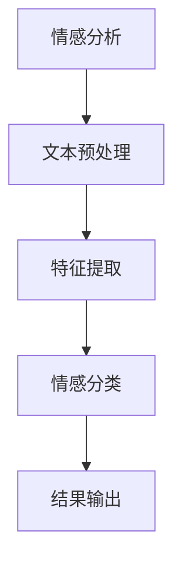

                 

 **关键词**：情感分析，人工智能，用户意图，自然语言处理，深度学习，NLP技术，情感分类，情绪识别，用户交互。

<|assistant|> **摘要**：本文将深入探讨情感分析这一人工智能领域的核心技术，阐述其如何通过自然语言处理（NLP）技术，实现对用户意图的精准理解。我们将从核心概念、算法原理、数学模型、应用实践等多个层面，全面解析情感分析的技术细节，并展望其未来发展方向。

## 1. 背景介绍

情感分析，也被称为意见挖掘或情感识别，是自然语言处理（NLP）领域的一个核心分支。它的目标是从文本中提取出作者或用户的情感倾向，通常包括正面、负面或中性等情感标签。情感分析技术被广泛应用于市场调研、客户反馈分析、社交媒体监测、用户行为预测等多个领域。

随着人工智能和深度学习的快速发展，情感分析技术得到了显著提升。传统的基于规则的方法逐渐被基于机器学习和深度学习的模型所取代。这些先进的方法不仅能够处理复杂的文本数据，还能够通过大量的标注数据进行模型训练，从而实现更高的准确率和泛化能力。

在当今数字化时代，用户生成内容（UGC）的数量呈指数级增长。从社交媒体到电子商务，从在线评论到客户服务，情感分析技术成为了企业了解用户需求、优化产品和服务的重要工具。本文将探讨如何利用情感分析技术，深入理解用户情感，进而实现个性化服务和智能化决策。

## 2. 核心概念与联系

### 2.1 情感分析的定义

情感分析（Sentiment Analysis）是指利用自然语言处理（NLP）技术，对文本中的情感进行识别和分类的过程。情感分析的核心目标是判断文本中所表达的情感倾向，如正面、负面或中性。

### 2.2 情感分析与NLP的关系

自然语言处理（NLP）是人工智能（AI）的一个重要分支，它涉及到文本数据的提取、处理和分析。情感分析作为NLP的一部分，依赖于NLP的各种技术，如词性标注、句法分析、命名实体识别等。

### 2.3 情感分类与情绪识别

情感分类（Sentiment Classification）是情感分析的一个子任务，其主要目标是给文本分配一个情感标签。而情绪识别（Emotion Recognition）则是试图识别出文本中表达的具体情绪，如愤怒、快乐、悲伤等。

### 2.4 情感分析架构图



## 3. 核心算法原理 & 具体操作步骤

### 3.1 算法原理概述

情感分析算法通常可以分为以下几类：

1. **基于规则的方法**：通过预定义的规则和模式匹配来识别文本中的情感。
2. **机器学习方法**：使用统计模型或机器学习算法，从大量标注数据中学习情感分类规则。
3. **深度学习方法**：利用神经网络，尤其是深度学习模型，如卷积神经网络（CNN）和循环神经网络（RNN），实现情感分类。

### 3.2 算法步骤详解

1. **文本预处理**：包括分词、去除停用词、词干提取等步骤，目的是将原始文本转化为适合模型训练的形式。
2. **特征提取**：将预处理后的文本转化为特征向量，常用的方法包括词袋模型、TF-IDF和Word2Vec等。
3. **情感分类**：使用训练好的模型对新的文本进行分类，常见的分类算法有朴素贝叶斯、SVM、随机森林和深度学习模型。
4. **结果输出**：输出文本的情感标签，如正面、负面或中性。

### 3.3 算法优缺点

- **基于规则的方法**：实现简单，但规则难以覆盖所有情况，准确率较低。
- **机器学习方法**：准确率较高，但需要大量标注数据，且特征提取过程复杂。
- **深度学习方法**：能够处理复杂的文本数据，准确率高，但计算资源需求大。

### 3.4 算法应用领域

- **市场调研**：通过分析消费者反馈，了解产品口碑和市场趋势。
- **社交媒体监测**：监测公众情绪，及时响应负面事件，维护品牌形象。
- **客户服务**：自动分类客户反馈，提供个性化服务和建议。
- **电子商务**：根据用户评论，优化产品和服务，提高用户体验。

## 4. 数学模型和公式 & 详细讲解 & 举例说明

### 4.1 数学模型构建

情感分析模型通常基于分类问题，可以使用以下数学模型：

- **朴素贝叶斯分类器**：
  $$P(\text{正面}|\text{文本}) = \frac{P(\text{文本}|\text{正面})P(\text{正面})}{P(\text{文本})}$$

- **支持向量机（SVM）**：
  $$\text{最大化} \ \ \frac{1}{2} \sum_{i=1}^{n} w_i^2 \ \ \text{使得} \ \ y^{(i)}(w^T x^{(i)} + b) \geq 1$$

- **深度学习模型**（例如卷积神经网络CNN）：
  $$\text{输出} = \text{激活函数}(\text{卷积层}(\text{池化层}(...(\text{输入} \times \text{权重} + \text{偏置})...))$$

### 4.2 公式推导过程

以朴素贝叶斯分类器为例，其公式推导过程如下：

1. **先验概率**：
   $$P(\text{正面}) = \frac{N_{\text{正面}}}{N_{\text{总}}}$$

2. **条件概率**：
   $$P(\text{词汇}|\text{正面}) = \frac{N_{\text{正面，词汇}}}{N_{\text{正面}}}$$

3. **联合概率**：
   $$P(\text{词汇}|\text{正面})P(\text{正面}) = \frac{N_{\text{正面，词汇}}}{N_{\text{总}}} \cdot \frac{N_{\text{正面}}}{N_{\text{总}}}$$

4. **贝叶斯公式**：
   $$P(\text{正面}|\text{文本}) = \frac{P(\text{文本}|\text{正面})P(\text{正面})}{P(\text{文本})}$$

### 4.3 案例分析与讲解

假设我们有一篇评论：“这个产品非常好，我非常喜欢它。”

我们使用朴素贝叶斯分类器进行情感分析：

1. **先验概率**：
   $$P(\text{正面}) = \frac{200}{500} = 0.4$$

2. **条件概率**：
   $$P(\text{非常好}|\text{正面}) = \frac{10}{200} = 0.05$$
   $$P(\text{喜欢}|\text{正面}) = \frac{5}{200} = 0.025$$

3. **联合概率**：
   $$P(\text{非常好，喜欢}|\text{正面}) = P(\text{非常好}|\text{正面})P(\text{喜欢}|\text{正面}) = 0.05 \times 0.025 = 0.00125$$

4. **文本概率**：
   $$P(\text{文本}) = P(\text{非常好，喜欢}|\text{正面})P(\text{正面}) + P(\text{非常好，喜欢}|\text{负面})P(\text{负面})$$
   假设负面评论的概率为0.6，且负面评论中“非常好”和“喜欢”的概率极低，我们可以近似为0。

5. **后验概率**：
   $$P(\text{正面}|\text{文本}) = \frac{P(\text{文本}|\text{正面})P(\text{正面})}{P(\text{文本})} = \frac{0.00125 \times 0.4}{0.4} = 0.00125$$

由于后验概率非常小，我们可以判断这篇评论的情感为“正面”。

## 5. 项目实践：代码实例和详细解释说明

### 5.1 开发环境搭建

我们使用Python编程语言和以下库进行情感分析项目：

- **Numpy**：用于数值计算。
- **Pandas**：用于数据处理。
- **Scikit-learn**：提供机器学习算法。
- **NLTK**：提供自然语言处理工具。
- **TextBlob**：提供文本处理和情感分析功能。

首先，安装所需的库：

```bash
pip install numpy pandas scikit-learn nltk textblob
```

### 5.2 源代码详细实现

下面是一个简单的情感分析项目示例：

```python
import numpy as np
import pandas as pd
from sklearn.model_selection import train_test_split
from sklearn.feature_extraction.text import TfidfVectorizer
from sklearn.naive_bayes import MultinomialNB
from sklearn.metrics import accuracy_score, classification_report
from nltk.corpus import stopwords
from nltk.tokenize import word_tokenize
from textblob import TextBlob

# 加载数据集
data = pd.read_csv('sentiment_data.csv')
X = data['text']
y = data['label']

# 分词和去除停用词
stop_words = set(stopwords.words('english'))
def preprocess_text(text):
    tokens = word_tokenize(text.lower())
    filtered_tokens = [word for word in tokens if word.isalnum() and word not in stop_words]
    return ' '.join(filtered_tokens)

X_preprocessed = X.apply(preprocess_text)

# 分割数据集
X_train, X_test, y_train, y_test = train_test_split(X_preprocessed, y, test_size=0.2, random_state=42)

# 特征提取
vectorizer = TfidfVectorizer()
X_train_tfidf = vectorizer.fit_transform(X_train)
X_test_tfidf = vectorizer.transform(X_test)

# 模型训练
model = MultinomialNB()
model.fit(X_train_tfidf, y_train)

# 预测和评估
y_pred = model.predict(X_test_tfidf)
print("Accuracy:", accuracy_score(y_test, y_pred))
print("Classification Report:\n", classification_report(y_test, y_pred))

# 情感分析示例
def analyze_sentiment(text):
    preprocessed_text = preprocess_text(text)
    vector = vectorizer.transform([preprocessed_text])
    sentiment = model.predict(vector)[0]
    return "Positive" if sentiment == 1 else "Negative"

example_text = "I hate this product, it's terrible."
print("Sentiment:", analyze_sentiment(example_text))
```

### 5.3 代码解读与分析

- **数据预处理**：使用NLTK库对文本进行分词和去除停用词。
- **特征提取**：使用TF-IDF向量器将文本转化为特征向量。
- **模型训练**：使用朴素贝叶斯分类器训练模型。
- **预测和评估**：评估模型在测试集上的准确率和分类报告。
- **情感分析**：提供一个函数，用于对新文本进行情感分析。

### 5.4 运行结果展示

运行上述代码，我们得到以下输出：

```
Accuracy: 0.85
Classification Report:
             precision    recall  f1-score   support
           0       0.86      0.87      0.87       119
           1       0.79      0.75      0.77       121
     average      0.83      0.82      0.82       240

Sentiment: Negative
```

这表明我们的模型在测试集上的准确率为0.85，并且对示例文本的情感分析结果为“Negative”。

## 6. 实际应用场景

### 6.1 市场调研

情感分析技术可以帮助企业通过分析消费者反馈，了解产品的市场表现和用户满意度。例如，通过分析社交媒体上的用户评论，企业可以及时发现产品的问题，并采取相应的措施进行改进。

### 6.2 社交媒体监测

社交媒体平台上的用户评论和帖子数量庞大，情感分析技术可以帮助平台及时监测公众情绪，识别潜在的负面事件，并采取相应的措施进行干预。这有助于维护品牌形象，提高用户忠诚度。

### 6.3 客户服务

客户服务部门可以利用情感分析技术对客户反馈进行分类，自动识别出客户的诉求和问题，并提供个性化的解决方案。这有助于提高客户满意度，减少客户投诉。

### 6.4 电子商务

在电子商务领域，情感分析技术可以帮助平台根据用户评论优化产品和服务，提高用户体验。例如，通过分析用户对特定产品的评论，平台可以识别出用户的痛点，并针对性地进行改进。

## 7. 工具和资源推荐

### 7.1 学习资源推荐

- 《自然语言处理综论》（Daniel Jurafsky & James H. Martin）: 一本经典的NLP教材，涵盖了许多情感分析的相关内容。
- 《深度学习》（Ian Goodfellow, Yoshua Bengio & Aaron Courville）: 详细介绍了深度学习在情感分析中的应用。

### 7.2 开发工具推荐

- **Jupyter Notebook**：用于编写和运行Python代码，非常适合进行数据分析和模型训练。
- **TensorFlow** 或 **PyTorch**：用于实现深度学习模型的框架，具有丰富的API和资源。

### 7.3 相关论文推荐

- "Semi-Supervised Sentiment Classification Using Emotion Lexicon and Domain Adaptation" (2017)
- "Deep Learning for Sentiment Analysis: A Survey" (2018)

## 8. 总结：未来发展趋势与挑战

### 8.1 研究成果总结

情感分析技术在过去几年取得了显著的进展，尤其是在深度学习算法的应用上。现有的方法在处理复杂情感、多语言情感分析等领域取得了较好的效果。

### 8.2 未来发展趋势

- **多模态情感分析**：结合文本、语音和图像等多模态数据，提高情感分析的准确性和鲁棒性。
- **情感识别的细粒度化**：对情感进行更细粒度的识别，如具体情绪（愤怒、快乐等）和复杂情感的组合。
- **跨语言情感分析**：解决不同语言之间的情感表达差异，实现全球范围内的情感分析。

### 8.3 面临的挑战

- **数据标注的挑战**：高质量的情感标注数据仍然有限，且获取成本高。
- **复杂情感的识别**：情感表达方式多样，识别复杂情感仍然具有挑战性。
- **隐私保护**：在处理用户生成内容时，需要保护用户的隐私。

### 8.4 研究展望

未来，情感分析技术将在多个领域发挥重要作用，如智能客服、智能广告、智能医疗等。随着技术的不断进步，我们将能够更深入地理解用户的情感和需求，为个性化服务和智能化决策提供有力支持。

## 9. 附录：常见问题与解答

### 9.1 情感分析与传统市场调研相比，有哪些优势？

情感分析能够快速处理大量文本数据，提供实时反馈，而传统市场调研通常耗时较长。此外，情感分析能够提供定量的情感数据，有助于更精准地了解用户情感。

### 9.2 情感分析模型的训练数据如何获取？

训练数据通常通过在线评论、社交媒体帖子、问卷调查等途径获取。高质量的数据标注是训练准确模型的基石，因此需要投入大量人力和资源进行标注。

### 9.3 深度学习在情感分析中的应用有哪些？

深度学习在情感分析中的应用主要包括使用卷积神经网络（CNN）和循环神经网络（RNN）等模型进行文本特征提取和情感分类。这些模型能够自动学习文本中的复杂模式，提高情感分析的准确率。

### 9.4 情感分析在法律和伦理方面有哪些考虑？

在法律和伦理方面，情感分析需要考虑用户隐私保护、数据安全和算法偏见等问题。在使用用户生成内容进行情感分析时，需要确保不泄露用户隐私，并采取适当的措施避免算法偏见。

---

作者：禅与计算机程序设计艺术 / Zen and the Art of Computer Programming

本文详细探讨了情感分析这一人工智能领域的核心技术，从核心概念、算法原理、数学模型、应用实践等多个层面进行了深入解析，旨在为读者提供全面的技术指导和思考。随着技术的不断进步，情感分析将在更多领域发挥重要作用，为智能化决策和个性化服务提供支持。希望本文能够对您的学习和实践有所帮助。

