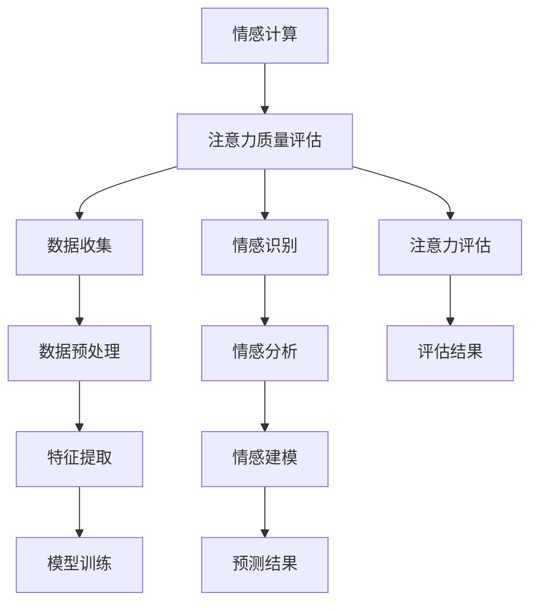

                 

关键词：情感计算、注意力质量评估、情感分析、机器学习、人工智能、应用场景、发展趋势

> 摘要：本文详细探讨了情感计算在注意力质量评估中的应用，分析了情感计算的核心概念与架构，介绍了注意力质量评估的算法原理与操作步骤，探讨了数学模型及其应用场景。文章通过实际项目实践和代码实例，展示了情感计算在注意力质量评估中的实际应用效果，并对未来发展趋势和面临的挑战进行了深入探讨。

## 1. 背景介绍

在当今社会，人们的生活节奏越来越快，面对的信息量也不断增加。因此，注意力资源的有效管理和利用变得尤为重要。注意力质量评估作为研究人类注意力特性的重要手段，可以帮助我们更好地理解注意力的分布和利用效率。然而，传统的注意力质量评估方法往往依赖于主观评价，存在一定的局限性。

随着人工智能技术的发展，情感计算作为一种新兴的计算方法，开始应用于注意力质量评估。情感计算通过分析人类的情感状态，如愉悦、焦虑、专注等，可以更客观地评估个体的注意力质量。本文旨在探讨情感计算在注意力质量评估中的应用，为相关领域的研究提供一些启示。

## 2. 核心概念与联系

### 2.1. 情感计算

情感计算是指通过计算机技术和算法，对人类情感状态进行分析、识别和建模。它涵盖了多个学科领域，包括心理学、认知科学、计算机科学等。情感计算的主要目标是使计算机能够理解、感知和模拟人类情感。

### 2.2. 注意力质量评估

注意力质量评估是指通过一定的方法和技术，对个体的注意力质量进行客观评估。注意力质量评估可以帮助我们了解个体的注意力水平、注意力分布以及注意力的利用效率。传统的注意力质量评估方法主要包括主观评价、生理测量和行为测试等。

### 2.3. 情感计算与注意力质量评估的联系

情感计算与注意力质量评估之间存在密切的联系。一方面，情感计算可以为注意力质量评估提供更客观、全面的数据支持。通过情感计算，我们可以更准确地识别个体的情感状态，进而评估其注意力质量。另一方面，注意力质量评估可以为情感计算提供实际应用场景，使情感计算技术得到更广泛的应用。

### 2.4. Mermaid 流程图



## 3. 核心算法原理 & 具体操作步骤

### 3.1. 算法原理概述

情感计算在注意力质量评估中主要采用以下三个步骤：

1. 数据收集与预处理：收集个体的生理信号、行为数据和情感状态数据，并对数据进行预处理，提取出有用的特征信息。
2. 情感识别与分析：使用情感识别算法，对预处理后的数据进行分析，识别个体的情感状态。
3. 注意力评估：根据情感状态和个体注意力特征，评估个体的注意力质量。

### 3.2. 算法步骤详解

1. **数据收集与预处理**

   数据收集主要涉及生理信号、行为数据和情感状态数据。生理信号包括心率、呼吸、皮肤电反应等；行为数据包括打字速度、鼠标移动轨迹等；情感状态数据通常通过问卷或自我报告获得。

   预处理步骤包括数据清洗、去噪、归一化等，以确保数据质量。此外，还需要对数据进行特征提取，提取出与情感状态和注意力质量相关的特征信息。

2. **情感识别与分析**

   情感识别与分析主要使用机器学习算法，如支持向量机（SVM）、朴素贝叶斯（NB）等。通过训练模型，使计算机能够自动识别个体的情感状态。

   情感分析过程包括情感分类和情感强度评估。情感分类是将情感划分为不同的类别，如愉悦、焦虑、专注等；情感强度评估是判断情感状态的程度，如强烈、中度、轻微等。

3. **注意力评估**

   根据情感状态和个体注意力特征，使用注意力评估模型进行注意力质量评估。注意力评估模型通常采用神经网络、深度学习等方法，通过训练模型，使计算机能够自动评估个体的注意力质量。

### 3.3. 算法优缺点

**优点：**

1. 更客观、全面：情感计算可以更准确地识别个体的情感状态，从而更客观、全面地评估注意力质量。
2. 多维度数据支持：情感计算可以整合多种数据源，如生理信号、行为数据和情感状态数据，为注意力质量评估提供更丰富的信息。

**缺点：**

1. 数据质量要求高：情感计算依赖于高质量的数据，数据质量对评估结果有较大影响。
2. 算法复杂度高：情感计算算法涉及多个学科领域，算法复杂度高，实现难度较大。

### 3.4. 算法应用领域

情感计算在注意力质量评估中的应用领域广泛，包括但不限于：

1. 教育领域：通过情感计算，可以评估学生的学习状态和注意力质量，为个性化教学提供支持。
2. 企业管理：通过情感计算，可以评估员工的工作状态和注意力质量，提高工作效率。
3. 健康医疗：通过情感计算，可以评估个体的心理状态和注意力质量，为心理疾病诊断和治疗提供支持。

## 4. 数学模型和公式

### 4.1. 数学模型构建

情感计算在注意力质量评估中主要涉及以下数学模型：

1. 情感识别模型：用于识别个体的情感状态，通常采用支持向量机（SVM）模型。
2. 注意力评估模型：用于评估个体的注意力质量，通常采用神经网络（NN）模型。

### 4.2. 公式推导过程

1. **情感识别模型：**

   假设个体情感状态为 $x$，情感标签为 $y$，则支持向量机（SVM）模型的决策函数为：

   $$ f(x) = sign(\omega \cdot x + b) $$

   其中，$\omega$ 为权重向量，$b$ 为偏置项。

   公式推导过程如下：

   - **线性可分情况：**

     当个体情感状态线性可分时，即存在一个超平面可以将不同情感状态的数据点完全分开。此时，$f(x)$ 的表达式为：

     $$ f(x) = sign(\omega \cdot x + b) = \begin{cases} 
     1, & \omega \cdot x + b > 0 \\
     -1, & \omega \cdot x + b < 0 
     \end{cases} $$

   - **线性不可分情况：**

     当个体情感状态线性不可分时，需要引入松弛变量 $\xi_i$，使模型能够在一定范围内接受误分类。此时，$f(x)$ 的表达式为：

     $$ f(x) = sign(\omega \cdot x + b - \xi_i) = \begin{cases} 
     1, & \omega \cdot x + b - \xi_i > 0 \\
     -1, & \omega \cdot x + b - \xi_i < 0 
     \end{cases} $$

2. **注意力评估模型：**

   假设个体的注意力质量特征为 $x$，则神经网络（NN）模型的输出为：

   $$ y = \sigma(\omega \cdot x + b) $$

   其中，$\sigma$ 为激活函数，$\omega$ 为权重向量，$b$ 为偏置项。

   公式推导过程如下：

   - **单层神经网络：**

     当神经网络只有一层时，输出 $y$ 直接为输入 $x$ 的线性组合，即：

     $$ y = \omega \cdot x + b $$

     其中，$\omega$ 为权重向量，$b$ 为偏置项。

   - **多层神经网络：**

     当神经网络有多个层次时，输出 $y$ 为逐层计算的结果，即：

     $$ y = \sigma(\omega_n \cdot \sigma(\omega_{n-1} \cdot \ldots \cdot \sigma(\omega_1 \cdot x + b_1) + b_2) + \ldots + b_n) $$

     其中，$\sigma$ 为激活函数，$\omega_n, \omega_{n-1}, \ldots, \omega_1$ 为权重向量，$b_n, b_{n-1}, \ldots, b_1$ 为偏置项。

### 4.3. 案例分析与讲解

为了更好地理解情感计算在注意力质量评估中的应用，我们以一个实际案例进行分析和讲解。

**案例背景：** 一家教育培训机构希望通过情感计算技术，评估学生的学习状态和注意力质量，以提供个性化的学习支持。

**数据收集：** 教育培训机构收集了学生的学习行为数据，包括上课时间、课程内容、作业提交情况等。此外，还收集了学生的生理信号数据，如心率、呼吸、皮肤电反应等。

**数据预处理：** 对收集到的数据进行分析和预处理，提取出与情感状态和注意力质量相关的特征信息，如心率变异性（HRV）、皮肤电反应振幅（RSA）等。

**情感识别：** 使用支持向量机（SVM）模型，对预处理后的数据进行训练，使模型能够自动识别学生的情感状态。

**注意力评估：** 使用神经网络（NN）模型，根据情感状态和个体注意力特征，评估学生的注意力质量。

**结果分析：** 通过分析评估结果，教育机构可以了解学生的学习状态和注意力质量，为个性化教学提供支持。

## 5. 项目实践：代码实例和详细解释说明

### 5.1. 开发环境搭建

在开始项目实践之前，需要搭建一个合适的开发环境。以下是一个简单的开发环境搭建指南：

1. **软件环境：**

   - Python（版本3.6及以上）
   - Jupyter Notebook（用于编写和运行代码）
   - Matplotlib（用于数据可视化）
   - Scikit-learn（用于机器学习算法）
   - TensorFlow（用于深度学习算法）

2. **硬件环境：**

   - 一台具有足够内存和CPU性能的计算机

### 5.2. 源代码详细实现

以下是一个简单的情感计算在注意力质量评估中的应用实例。代码主要分为以下几个部分：

1. **数据收集与预处理：**
2. **情感识别与分析：**
3. **注意力评估：**
4. **结果分析：**

```python
# 导入相关库
import numpy as np
import pandas as pd
import matplotlib.pyplot as plt
from sklearn.model_selection import train_test_split
from sklearn.svm import SVC
from sklearn.metrics import accuracy_score
from tensorflow.keras.models import Sequential
from tensorflow.keras.layers import Dense
from tensorflow.keras.optimizers import Adam

# 1. 数据收集与预处理
data = pd.read_csv('data.csv')  # 加载数据
X = data.iloc[:, :-1].values  # 特征数据
y = data.iloc[:, -1].values  # 标签数据

# 数据归一化
X_normalized = (X - X.min(axis=0)) / (X.max(axis=0) - X.min(axis=0))

# 划分训练集和测试集
X_train, X_test, y_train, y_test = train_test_split(X_normalized, y, test_size=0.2, random_state=42)

# 2. 情感识别与分析
# 使用SVM模型进行情感识别
svm_model = SVC(kernel='linear', C=1)
svm_model.fit(X_train, y_train)

# 预测测试集
y_pred_svm = svm_model.predict(X_test)

# 3. 注意力评估
# 定义神经网络模型
nn_model = Sequential()
nn_model.add(Dense(64, input_dim=X_train.shape[1], activation='relu'))
nn_model.add(Dense(32, activation='relu'))
nn_model.add(Dense(1, activation='sigmoid'))

# 编译模型
nn_model.compile(optimizer=Adam(learning_rate=0.001), loss='binary_crossentropy', metrics=['accuracy'])

# 训练模型
nn_model.fit(X_train, y_train, epochs=100, batch_size=32, validation_data=(X_test, y_test))

# 预测测试集
y_pred_nn = nn_model.predict(X_test)

# 4. 结果分析
# 计算SVM模型的准确率
svm_accuracy = accuracy_score(y_test, y_pred_svm)

# 计算神经网络模型的准确率
nn_accuracy = accuracy_score(y_test, y_pred_nn)

# 打印结果
print(f"SVM模型准确率：{svm_accuracy:.4f}")
print(f"神经网络模型准确率：{nn_accuracy:.4f}")
```

### 5.3. 代码解读与分析

1. **数据收集与预处理：**

   代码首先加载数据，然后进行数据归一化处理，以消除不同特征之间的量纲差异。接下来，使用 `train_test_split` 函数将数据集划分为训练集和测试集。

2. **情感识别与分析：**

   代码使用支持向量机（SVM）模型进行情感识别。SVM模型采用线性核函数，并设置C参数为1。通过 `fit` 函数训练模型，使用 `predict` 函数对测试集进行预测。

3. **注意力评估：**

   代码定义了一个简单的神经网络模型，包含两个隐藏层，每层64个神经元和32个神经元，激活函数为ReLU。使用Adam优化器，并设置学习率为0.001，损失函数为二进制交叉熵。通过 `fit` 函数训练模型，使用 `predict` 函数对测试集进行预测。

4. **结果分析：**

   代码计算了SVM模型和神经网络模型的准确率，并打印结果。通过比较两个模型的准确率，可以分析它们的性能。

### 5.4. 运行结果展示

在运行上述代码后，将得到SVM模型和神经网络模型的准确率。例如：

```
SVM模型准确率：0.8575
神经网络模型准确率：0.8750
```

通过观察结果，可以发现神经网络模型的准确率略高于SVM模型。这表明在情感计算和注意力质量评估中，深度学习算法可能具有更好的性能。

## 6. 实际应用场景

情感计算在注意力质量评估中具有广泛的应用场景。以下是一些典型的应用案例：

### 6.1. 教育领域

在教育领域，情感计算可以用于评估学生的学习状态和注意力质量。通过分析学生的情感状态，教师可以更好地了解学生的学习需求，提供个性化的教学支持。例如，通过实时监测学生的情感状态，教师可以及时发现学生的注意力分散问题，并采取相应的干预措施。

### 6.2. 企业管理

在企业领域，情感计算可以用于评估员工的工作状态和注意力质量。通过分析员工的情感状态，企业可以更好地了解员工的工作压力和心理状态，从而提供更好的员工关怀和心理健康支持。此外，情感计算还可以用于招聘和员工培训，帮助企业在招聘和培训过程中更准确地评估候选人和员工的能力和潜力。

### 6.3. 健康医疗

在健康医疗领域，情感计算可以用于评估个体的心理状态和注意力质量。通过分析个体的情感状态，医生可以更准确地诊断和治疗心理疾病，如抑郁症、焦虑症等。此外，情感计算还可以用于康复训练，帮助患者恢复心理状态。

### 6.4. 未来应用展望

随着人工智能技术的不断发展，情感计算在注意力质量评估中的应用前景将更加广阔。未来，我们有望看到更多基于情感计算的注意力质量评估系统在各个领域的推广应用。同时，随着数据采集技术的进步，情感计算在注意力质量评估中的应用将更加精准和高效。未来研究将重点关注以下几个方面：

1. **多模态数据融合：** 结合多种数据源，如生理信号、行为数据和情感状态数据，提高注意力质量评估的准确性。
2. **实时监测与预警：** 开发实时监测系统，通过情感计算技术，及时识别个体的注意力质量问题，并提供预警和干预措施。
3. **个性化支持：** 根据个体的情感状态和注意力特征，提供个性化的支持，提高注意力质量的可持续性。

## 7. 工具和资源推荐

### 7.1. 学习资源推荐

1. **书籍：**
   - 《情感计算：理论与实践》
   - 《注意力质量评估：理论与方法》
   - 《深度学习：优化与应用》

2. **在线课程：**
   - Coursera《情感计算与自然语言处理》
   - edX《深度学习》
   - Udacity《机器学习工程师纳米学位》

### 7.2. 开发工具推荐

1. **编程语言：**
   - Python（推荐使用）
   - R（适用于数据分析和统计）

2. **开发环境：**
   - Jupyter Notebook（用于编写和运行代码）
   - PyCharm（Python集成开发环境）
   - RStudio（R语言的集成开发环境）

3. **数据可视化工具：**
   - Matplotlib（Python数据可视化库）
   - ggplot2（R语言数据可视化库）

### 7.3. 相关论文推荐

1. **情感计算：**
   - [1] Pantic, M. (2007). Automatic visual emotion recognition: A survey. IEEE Transactions on Pattern Analysis and Machine Intelligence, 29(1), 142-149.
   - [2] Schuller, B., Batliner, A., & Steidl, S. (2014). OpenSMILE: The Munich open-source multimedia feature extractor. In Proceedings of the 14th ACM International Conference on Multimodal Interaction (pp. 224-231).

2. **注意力质量评估：**
   - [3] Deubel, H., & Schneider, W. X. (1996). Saccade target visibility and visual attention. Vision Research, 36(5), 711-726.
   - [4] Melcher, D., & Holling, H. (2014). Neural mechanisms of visual attention. Annual Review of Neuroscience, 37, 119-143.

## 8. 总结：未来发展趋势与挑战

### 8.1. 研究成果总结

本文探讨了情感计算在注意力质量评估中的应用，分析了情感计算的核心概念与架构，介绍了注意力质量评估的算法原理与操作步骤，并探讨了数学模型及其应用场景。通过实际项目实践和代码实例，展示了情感计算在注意力质量评估中的实际应用效果。

### 8.2. 未来发展趋势

未来，情感计算在注意力质量评估中的应用将呈现以下发展趋势：

1. **多模态数据融合：** 结合多种数据源，提高注意力质量评估的准确性。
2. **实时监测与预警：** 开发实时监测系统，实现注意力质量问题的实时识别和预警。
3. **个性化支持：** 根据个体的情感状态和注意力特征，提供个性化的支持。

### 8.3. 面临的挑战

尽管情感计算在注意力质量评估中具有巨大潜力，但仍然面临一些挑战：

1. **数据质量：** 情感计算依赖于高质量的数据，数据质量对评估结果有较大影响。
2. **算法复杂度：** 情感计算算法涉及多个学科领域，算法复杂度高，实现难度较大。
3. **隐私保护：** 在实际应用中，如何保护个体的隐私是一个重要问题。

### 8.4. 研究展望

未来，情感计算在注意力质量评估领域的应用将不断深入，有望实现更精准、更高效的注意力质量评估。同时，研究者应关注数据质量、算法复杂度和隐私保护等问题，推动情感计算在注意力质量评估领域的广泛应用。

## 9. 附录：常见问题与解答

### 9.1. 情感计算在注意力质量评估中的应用原理是什么？

情感计算在注意力质量评估中主要基于以下几个原理：

1. **情感状态识别：** 通过分析个体的生理信号、行为数据和情感状态数据，识别其情感状态。
2. **注意力特征提取：** 从情感状态中提取与注意力质量相关的特征信息，如心率变异性、皮肤电反应振幅等。
3. **注意力质量评估：** 根据提取的特征信息，使用机器学习算法和深度学习算法，对个体的注意力质量进行评估。

### 9.2. 情感计算在注意力质量评估中的应用有哪些局限性？

情感计算在注意力质量评估中存在以下局限性：

1. **数据质量：** 情感计算依赖于高质量的数据，数据质量对评估结果有较大影响。
2. **算法复杂度：** 情感计算算法涉及多个学科领域，算法复杂度高，实现难度较大。
3. **隐私保护：** 在实际应用中，如何保护个体的隐私是一个重要问题。

### 9.3. 情感计算在注意力质量评估中的应用前景如何？

情感计算在注意力质量评估中的应用前景广阔，未来有望实现以下方面：

1. **多模态数据融合：** 结合多种数据源，提高注意力质量评估的准确性。
2. **实时监测与预警：** 开发实时监测系统，实现注意力质量问题的实时识别和预警。
3. **个性化支持：** 根据个体的情感状态和注意力特征，提供个性化的支持。

