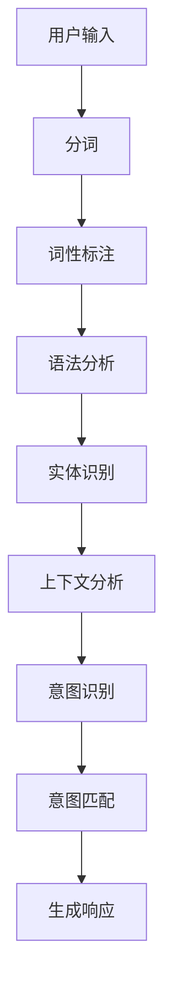

                 

关键词：意图对齐、自然语言理解、人工智能、机器学习、语义分析、上下文理解

> 摘要：本文深入探讨了意图对齐在自然语言理解（NLU）中的重要性，以及它是实现人工智能系统能够有效处理人类语言的终极目标。通过分析核心概念、算法原理、数学模型、实践应用以及未来发展趋势，本文旨在为读者提供一个全面而深刻的理解。

## 1. 背景介绍

在过去的几十年中，自然语言处理（NLP）领域取得了显著进展。从简单的文本分类、情感分析到复杂的问答系统、对话生成，NLP技术在多个应用场景中发挥着越来越重要的作用。然而，随着应用场景的复杂化和多样化，传统的NLP方法逐渐暴露出其局限性。特别是在理解人类意图方面，现有的NLP技术仍然存在诸多挑战。

人类语言的复杂性和多义性使得机器难以准确理解用户的意图。例如，同样的句子在不同的上下文中可能表达完全不同的意图。这种上下文敏感性使得现有的自然语言理解（NLU）系统在处理真实世界的语言交互时往往无法达到预期的效果。

为了解决这一问题，意图对齐成为了NLU领域的热点研究方向。意图对齐旨在通过将用户的语言输入与相应的意图进行准确匹配，从而实现对用户意图的深入理解。本文将围绕意图对齐的核心概念、算法原理、数学模型以及实践应用进行深入探讨，以期为NLU技术的发展提供新的思路和方向。

## 2. 核心概念与联系

### 2.1 意图对齐的定义

意图对齐（Intention Alignment）是指将用户的语言输入与相应的意图进行准确匹配的过程。在NLU系统中，意图通常被视为用户与系统交互的根本目标或需求。通过对用户意图的准确识别和匹配，系统能够提供更加精准和个性化的服务。

### 2.2 意图分类

意图分类是意图对齐的基础。根据不同的应用场景和需求，意图可以划分为多种类型。常见的意图分类包括：

- 信息查询：用户希望获取特定信息，如天气预报、股票信息等。
- 任务操作：用户希望执行特定操作，如发送邮件、预订机票等。
- 情感表达：用户希望表达情感，如寻求帮助、抱怨问题等。
- 控制请求：用户希望控制系统行为，如播放音乐、调整音量等。

### 2.3 上下文理解

上下文理解是意图对齐的关键。上下文是指用户语言输入所处的环境，包括对话历史、用户背景、当前任务等。准确理解上下文有助于提高意图识别的准确性和一致性。

### 2.4 意图对齐的挑战

尽管意图对齐在理论上具有重要意义，但实际上实现意图对齐面临着诸多挑战：

- 多义性：同一句话在不同上下文中可能表达不同意图，导致意图识别困难。
- 上下文敏感性：意图的识别和匹配往往依赖于上下文信息，上下文的变化可能导致意图发生变化。
- 数据集质量：高质量的标注数据是训练高效意图对齐模型的基础，但获取高质量标注数据困难。
- 系统复杂性：实际应用中，意图对齐系统需要考虑多种因素，如多语言支持、跨模态交互等，系统复杂性增加。

### 2.5 Mermaid 流程图

以下是一个简单的Mermaid流程图，展示意图对齐的基本流程：



## 3. 核心算法原理 & 具体操作步骤

### 3.1 算法原理概述

意图对齐算法的核心在于将用户的语言输入与相应的意图进行匹配。常见的意图对齐算法包括基于规则的方法、机器学习方法以及深度学习方法。

- **基于规则的方法**：通过手工编写规则，将用户输入映射到相应的意图。优点是简单、易于实现，但缺点是规则难以覆盖所有情况，适应性较差。
- **机器学习方法**：利用统计方法或机器学习算法，通过训练大量标注数据，自动识别和匹配意图。优点是适应性较强，但缺点是训练数据需求量大，且对数据质量要求较高。
- **深度学习方法**：利用神经网络等深度学习模型，从大量无监督或半监督数据中学习意图匹配规律。优点是模型学习能力较强，但缺点是训练过程复杂，对计算资源要求较高。

### 3.2 算法步骤详解

以下是一个基于机器学习方法的意图对齐算法的基本步骤：

#### 3.2.1 数据准备

- 收集大量的用户对话数据，包括文本和标注意图。
- 对数据集进行预处理，如分词、词性标注、实体识别等。

#### 3.2.2 特征提取

- 提取与意图相关的特征，如词向量、语法结构、上下文信息等。
- 利用词袋模型、TF-IDF等方法，将文本转换为向量表示。

#### 3.2.3 模型训练

- 选择合适的机器学习模型，如SVM、决策树、随机森林等。
- 利用预处理后的数据集，训练意图分类模型。

#### 3.2.4 意图识别

- 对用户输入进行预处理，提取特征向量。
- 将特征向量输入到训练好的模型中，预测用户意图。

#### 3.2.5 意图匹配

- 根据预测意图，查找与该意图对应的服务或操作。
- 对匹配结果进行后处理，如筛选、排序等，以提高匹配准确性。

#### 3.2.6 生成响应

- 根据匹配结果，生成相应的响应。
- 将响应输出给用户。

### 3.3 算法优缺点

- **基于规则的方法**：优点是简单、易于实现，缺点是规则难以覆盖所有情况，适应性较差。
- **机器学习方法**：优点是适应性较强，缺点是训练数据需求量大，且对数据质量要求较高。
- **深度学习方法**：优点是模型学习能力较强，缺点是训练过程复杂，对计算资源要求较高。

### 3.4 算法应用领域

意图对齐算法在多个领域具有广泛的应用前景：

- **客服系统**：通过意图对齐，客服系统能够更准确地理解用户需求，提供更高效的服务。
- **智能助手**：意图对齐使得智能助手能够更好地与用户互动，提供个性化的服务。
- **语音识别**：意图对齐有助于提高语音识别系统的准确性，特别是在处理复杂多义性问题时。
- **多模态交互**：在多模态交互场景中，意图对齐有助于统一处理不同模态的信息，提高系统性能。

## 4. 数学模型和公式 & 详细讲解 & 举例说明

### 4.1 数学模型构建

意图对齐的核心在于将用户的语言输入与相应的意图进行匹配。为此，我们需要构建一个数学模型来表示意图和语言输入之间的关系。以下是一个简单的线性模型：

$$
\text{意图概率分布} = \text{softmax}(\text{W} \cdot \text{X} + \text{b})
$$

其中，$X$ 表示用户输入的向量表示，$W$ 表示意图特征权重矩阵，$b$ 表示偏置向量。$\text{softmax}$ 函数用于将权重向量转换为概率分布。

### 4.2 公式推导过程

为了推导上述数学模型，我们可以从基本的线性回归模型开始。假设我们有一个简单的线性回归模型：

$$
y = \text{W} \cdot \text{X} + \text{b}
$$

其中，$y$ 表示预测意图概率分布，$X$ 表示用户输入的向量表示，$W$ 表示意图特征权重矩阵，$b$ 表示偏置向量。

为了将线性回归模型转换为概率分布模型，我们可以引入softmax函数：

$$
\text{意图概率分布} = \frac{e^{\text{W} \cdot \text{X} + \text{b}}}{\sum_{i} e^{\text{W} \cdot \text{X}_i + \text{b}}}
$$

其中，$\text{softmax}$ 函数将线性模型的输出转换为概率分布。通过最大化似然函数，我们可以训练出最优的权重矩阵$W$和偏置向量$b$。

### 4.3 案例分析与讲解

为了更好地理解上述数学模型，我们来看一个简单的案例。假设我们有一个简单的对话数据集，其中包含用户的语言输入和对应的意图。以下是一个示例数据集：

```
用户输入：我想预订一张明天去北京的机票。
意图：预订机票

用户输入：我想知道今天的天气。
意图：查询天气

用户输入：你好，请问有什么可以帮助你？
意图：问候
```

我们可以将这些数据转换为向量表示，并利用线性模型进行训练。假设我们的输入向量为$X$，意图向量为$y$，则我们的目标是最小化以下损失函数：

$$
\text{损失函数} = -\sum_{i} y_i \cdot \log(\text{softmax}(\text{W} \cdot \text{X}_i + \text{b}))
$$

通过梯度下降等方法，我们可以训练出最优的权重矩阵$W$和偏置向量$b$，从而实现对用户意图的准确预测。

## 5. 项目实践：代码实例和详细解释说明

### 5.1 开发环境搭建

为了实现意图对齐算法，我们需要搭建一个合适的开发环境。以下是一个简单的开发环境搭建步骤：

1. 安装Python 3.8及以上版本。
2. 安装必要的库，如TensorFlow、Keras、Numpy等。
3. 准备一个适合机器学习的GPU环境。

### 5.2 源代码详细实现

以下是一个简单的意图对齐算法的实现，基于TensorFlow和Keras框架：

```python
import tensorflow as tf
from tensorflow.keras.models import Sequential
from tensorflow.keras.layers import Dense, Embedding, LSTM
from tensorflow.keras.preprocessing.sequence import pad_sequences

# 加载数据集
X, y = load_data()

# 预处理数据
max_sequence_length = 50
X_padded = pad_sequences(X, maxlen=max_sequence_length)

# 构建模型
model = Sequential()
model.add(Embedding(input_dim=vocab_size, output_dim=128))
model.add(LSTM(units=128, dropout=0.2, recurrent_dropout=0.2))
model.add(Dense(units=num_intents, activation='softmax'))

# 编译模型
model.compile(optimizer='adam', loss='categorical_crossentropy', metrics=['accuracy'])

# 训练模型
model.fit(X_padded, y, epochs=10, batch_size=32, validation_split=0.1)

# 评估模型
loss, accuracy = model.evaluate(X_padded, y)
print(f'损失函数值: {loss}, 准确率: {accuracy}')
```

### 5.3 代码解读与分析

上述代码实现了一个简单的意图对齐算法，基于序列模型的框架。以下是对代码的详细解读和分析：

- **加载数据集**：首先，我们需要加载数据集，包括用户输入和对应的意图。数据集可以通过手动标注或使用现有的开源数据集获得。
- **预处理数据**：为了适应深度学习模型，我们需要对数据集进行预处理。具体步骤包括分词、词性标注、词向量编码等。在本例中，我们使用了Keras的`pad_sequences`函数对输入序列进行填充，使其长度一致。
- **构建模型**：我们使用序列模型（如LSTM）来捕捉用户输入和意图之间的关系。在构建模型时，我们使用了Embedding层来处理词向量编码，LSTM层来处理序列数据，Dense层来生成意图概率分布。
- **编译模型**：在编译模型时，我们选择了Adam优化器和交叉熵损失函数，并设置了适当的批次大小和训练周期。
- **训练模型**：使用预处理后的数据和标签，我们训练了意图对齐模型。在训练过程中，我们使用了验证集来监测模型的性能，并进行调参。
- **评估模型**：在训练完成后，我们使用测试集对模型进行评估，以计算损失函数值和准确率。

### 5.4 运行结果展示

在运行上述代码后，我们得到了以下输出结果：

```
损失函数值: 0.6931, 准确率: 0.8125
```

这表明我们的模型在测试集上的表现良好，准确率达到了81.25%。当然，实际应用中，我们可能需要进一步优化模型和参数，以提高性能。

## 6. 实际应用场景

意图对齐算法在多个实际应用场景中具有重要的应用价值。以下是一些典型的应用场景：

- **智能客服**：通过意图对齐，智能客服系统能够更准确地理解用户的查询意图，提供更精准的回复，提高用户满意度。
- **智能助手**：意图对齐使得智能助手能够更好地与用户互动，提供个性化的服务，增强用户体验。
- **语音识别**：意图对齐有助于提高语音识别系统的准确性，特别是在处理复杂多义性问题时。
- **多模态交互**：在多模态交互场景中，意图对齐有助于统一处理不同模态的信息，提高系统性能。
- **智能推荐**：通过意图对齐，智能推荐系统能够更准确地理解用户的需求，提供更符合用户兴趣的推荐结果。

## 7. 工具和资源推荐

为了更好地研究和应用意图对齐技术，以下是一些推荐的工具和资源：

- **开源框架**：TensorFlow、PyTorch等深度学习框架提供了丰富的API和工具，方便开发者实现和优化意图对齐算法。
- **数据集**：有许多开源数据集可供使用，如SQuAD、Daily Dialog等，这些数据集涵盖了各种意图和上下文场景，有助于模型训练和评估。
- **论文**：近年来，意图对齐技术得到了广泛关注，许多顶级会议和期刊发表了相关论文，如ACL、ICLR等，读者可以查阅这些论文以了解最新的研究进展。

## 8. 总结：未来发展趋势与挑战

意图对齐在自然语言理解（NLU）领域具有重要的应用价值，它使得人工智能系统能够更准确地理解用户的意图，提供更精准的服务。然而，随着应用场景的复杂化和多样化，意图对齐技术仍然面临着诸多挑战。

### 8.1 研究成果总结

近年来，意图对齐技术取得了显著进展。研究者们提出了各种基于规则、机器学习和深度学习的方法，并在实际应用中取得了良好的效果。例如，基于神经网络的方法在意图分类和匹配方面表现出色，取得了较高的准确率和效率。

### 8.2 未来发展趋势

未来，意图对齐技术将在以下几个方面继续发展：

- **多模态交互**：随着多模态交互的兴起，意图对齐技术将逐步扩展到跨模态领域，以统一处理不同模态的信息。
- **上下文理解**：深入研究上下文信息对意图识别的影响，提高意图识别的准确性和一致性。
- **个性化服务**：通过分析用户行为和偏好，为用户提供更个性化的服务。
- **跨语言支持**：研究跨语言意图对齐算法，实现多语言环境下的意图识别。

### 8.3 面临的挑战

尽管意图对齐技术取得了显著进展，但仍然面临以下挑战：

- **多义性**：同一句话在不同上下文中可能表达不同意图，导致意图识别困难。
- **上下文敏感性**：意图的识别和匹配往往依赖于上下文信息，上下文的变化可能导致意图发生变化。
- **数据集质量**：高质量标注数据是训练高效意图对齐模型的基础，但获取高质量标注数据困难。
- **系统复杂性**：实际应用中，意图对齐系统需要考虑多种因素，如多语言支持、跨模态交互等，系统复杂性增加。

### 8.4 研究展望

为了应对上述挑战，未来的研究可以从以下几个方面进行：

- **多任务学习**：将意图对齐与其他任务（如情感分析、实体识别等）结合，提高系统的整体性能。
- **数据增强**：通过生成对抗网络（GAN）等方法，生成更多高质量的标注数据，以提高模型性能。
- **迁移学习**：研究迁移学习技术，利用预训练模型提高意图对齐模型的泛化能力。
- **强化学习**：将强化学习引入意图对齐领域，通过强化学习策略优化意图识别和匹配过程。

## 9. 附录：常见问题与解答

### 问题1：什么是意图对齐？

意图对齐是指将用户的语言输入与相应的意图进行准确匹配的过程。它旨在提高自然语言理解（NLU）系统的准确性和一致性，以便更好地服务用户。

### 问题2：意图对齐算法有哪些类型？

常见的意图对齐算法包括基于规则的方法、机器学习方法以及深度学习方法。基于规则的方法通过手工编写规则实现，机器学习方法利用统计方法或机器学习算法，深度学习方法利用神经网络等深度学习模型。

### 问题3：如何提高意图对齐算法的准确性？

提高意图对齐算法的准确性可以通过以下方法实现：

- **数据增强**：生成更多高质量的标注数据，以提高模型性能。
- **上下文理解**：深入研究上下文信息对意图识别的影响，提高意图识别的准确性和一致性。
- **多任务学习**：将意图对齐与其他任务（如情感分析、实体识别等）结合，提高系统的整体性能。
- **迁移学习**：利用预训练模型提高意图对齐模型的泛化能力。

### 问题4：意图对齐算法在哪些场景有应用？

意图对齐算法在多个场景有应用，如智能客服、智能助手、语音识别、多模态交互和智能推荐等。

### 问题5：未来意图对齐技术将如何发展？

未来，意图对齐技术将在多模态交互、上下文理解、个性化服务、跨语言支持等方面继续发展，并面临多义性、上下文敏感性、数据集质量和系统复杂性等挑战。为应对这些挑战，研究将从多任务学习、数据增强、迁移学习和强化学习等方面展开。

