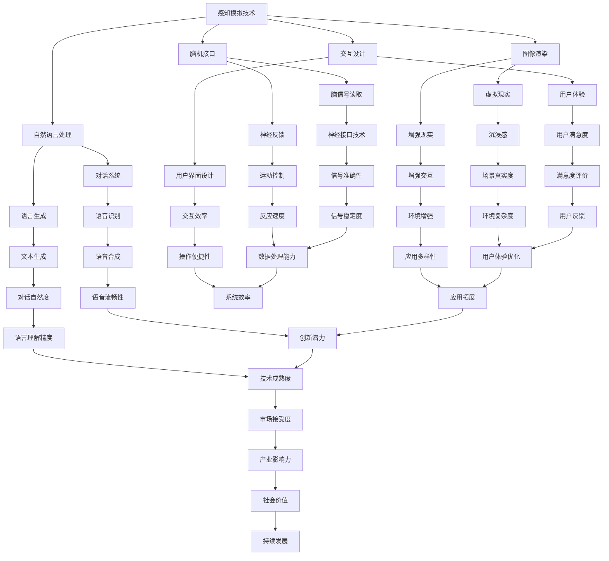

                 

本文将探讨一个令人激动且极具前景的技术领域：感官模拟，特别是由人工智能（AI）驱动的超现实体验。在这个领域，AI不仅模拟我们的感官，还能够超越人类的感知极限，创造出前所未有的体验。本文将从背景介绍、核心概念与联系、核心算法原理、数学模型和公式、项目实践、实际应用场景、未来应用展望、工具和资源推荐、总结以及常见问题与解答等多个方面，深入探讨这一领域的现状、未来和发展方向。

## 关键词

- 人工智能
- 感官模拟
- 超现实体验
- 图形渲染
- 脑机接口
- 交互设计
- 深度学习
- 自然语言处理

## 摘要

本文旨在探讨人工智能在感官模拟和超现实体验中的潜力。通过介绍核心概念、算法原理、数学模型以及实际应用案例，本文揭示了AI如何通过模拟视觉、听觉、触觉等多种感官，创造超越现实界限的沉浸式体验。文章还探讨了这一技术领域的未来发展趋势和面临的挑战，为读者提供了一个全面的技术视角。

## 1. 背景介绍

感官模拟，顾名思义，是指通过技术手段模拟人类感官的感知过程，使其能够在虚拟环境中感受到类似于真实世界的体验。这个概念在虚拟现实（VR）和增强现实（AR）领域得到了广泛应用。然而，随着人工智能技术的不断进步，感官模拟的应用范围正在迅速扩展，不再局限于视觉和听觉的模拟，而是涵盖了触觉、嗅觉、味觉等多种感官。

人工智能在感官模拟中的应用主要体现在以下几个方面：

### 1.1 图像渲染和计算机图形学

图像渲染是虚拟现实和增强现实技术的基础。通过计算机图形学技术，AI可以生成高质量的图像，模拟真实世界的光照、阴影、纹理等视觉特征，从而提供沉浸式视觉体验。

### 1.2 自然语言处理

自然语言处理（NLP）技术使得AI能够理解并生成人类语言，从而实现与虚拟环境中人物的对话交互。这为感官模拟提供了更丰富的内容，使得用户能够与虚拟世界进行更自然的互动。

### 1.3 脑机接口

脑机接口（BCI）技术通过直接读取大脑信号，实现人类意识和机器的交互。这一技术的进步使得感官模拟不再仅限于外部设备的输入，而是能够直接与用户的神经系统相连，提供更为逼真的体验。

### 1.4 交互设计

交互设计是感官模拟的重要组成部分。通过人工智能技术，交互设计变得更加智能化，能够根据用户的偏好和行为习惯，提供个性化的体验。

## 2. 核心概念与联系

在探讨感官模拟的AI实现之前，我们需要了解一些核心概念和它们之间的联系。以下是这些概念及其关系的Mermaid流程图：



### 2.1 感知模拟技术

感知模拟技术是感官模拟的核心。它涉及到多种感官的模拟，包括视觉、听觉、触觉、嗅觉和味觉。通过计算机图形学、音频处理、触觉反馈等技术，AI能够生成逼真的虚拟环境，让用户产生身临其境的感觉。

### 2.2 图像渲染和计算机图形学

图像渲染是感知模拟的重要组成部分。计算机图形学通过生成高质量的三维图像，模拟真实世界的视觉特征，如光照、阴影和纹理。这种技术为虚拟现实和增强现实提供了视觉基础。

### 2.3 自然语言处理

自然语言处理技术使得AI能够理解和生成人类语言。在感官模拟中，NLP技术被用于实现与虚拟环境中的对话和交互。通过语音识别和语音合成技术，用户可以通过自然语言与虚拟环境进行交流。

### 2.4 脑机接口

脑机接口技术通过直接读取大脑信号，实现人类意识和机器的交互。这一技术在感官模拟中具有巨大的潜力，因为它能够提供更为逼真的体验，让用户感觉自己是虚拟环境的一部分。

### 2.5 交互设计

交互设计是感官模拟的重要组成部分。通过人工智能技术，交互设计变得更加智能化，能够根据用户的偏好和行为习惯，提供个性化的体验。这种个性化的交互设计能够提升用户的沉浸感和满意度。

## 3. 核心算法原理 & 具体操作步骤

### 3.1 算法原理概述

在感官模拟中，核心算法原理主要涉及以下几个方面：

1. **图像渲染算法**：通过计算机图形学技术，生成高质量的三维图像，模拟真实世界的视觉特征。
2. **自然语言处理算法**：包括语音识别和语音合成技术，实现人与虚拟环境的自然对话和交互。
3. **脑机接口算法**：通过读取和分析大脑信号，实现人类意识和机器的交互。
4. **交互设计算法**：根据用户的偏好和行为习惯，提供个性化的体验。

### 3.2 算法步骤详解

1. **图像渲染算法**：

   - **步骤1**：输入场景信息和光照参数。
   - **步骤2**：使用渲染器生成三维图像。
   - **步骤3**：应用光照模型，计算阴影和反射。
   - **步骤4**：处理纹理和细节，生成高质量的图像。

2. **自然语言处理算法**：

   - **步骤1**：接收语音信号或文本输入。
   - **步骤2**：使用语音识别技术，将语音信号转换为文本。
   - **步骤3**：使用语言模型，理解文本的含义和语境。
   - **步骤4**：使用语音合成技术，生成相应的语音输出。

3. **脑机接口算法**：

   - **步骤1**：使用脑电图（EEG）或其他脑信号读取设备，获取大脑信号。
   - **步骤2**：使用信号处理算法，提取有用的信号特征。
   - **步骤3**：使用机器学习算法，训练模型识别用户意图。
   - **步骤4**：根据用户意图，执行相应的操作。

4. **交互设计算法**：

   - **步骤1**：收集用户行为数据，如点击、滑动等。
   - **步骤2**：使用机器学习算法，分析用户偏好和行为习惯。
   - **步骤3**：根据用户偏好，调整交互界面和体验。

### 3.3 算法优缺点

1. **图像渲染算法**：

   - **优点**：能够生成高质量的三维图像，提供逼真的视觉体验。
   - **缺点**：计算资源消耗大，对硬件性能要求高。

2. **自然语言处理算法**：

   - **优点**：实现人与虚拟环境的自然对话和交互，提升用户体验。
   - **缺点**：对语音识别和语言理解的准确性要求高，技术难度大。

3. **脑机接口算法**：

   - **优点**：提供更为逼真的体验，直接与用户神经系统交互。
   - **缺点**：信号读取和处理的准确性受限于技术，安全性问题尚待解决。

4. **交互设计算法**：

   - **优点**：能够提供个性化的体验，提升用户的沉浸感。
   - **缺点**：对用户行为数据的分析和理解要求高，数据隐私问题值得关注。

### 3.4 算法应用领域

1. **虚拟现实**：通过图像渲染和交互设计算法，提供沉浸式的虚拟体验。
2. **增强现实**：通过图像渲染和自然语言处理算法，增强现实世界中的交互体验。
3. **游戏**：通过图像渲染和自然语言处理算法，创造逼真的游戏体验。
4. **教育**：通过图像渲染和交互设计算法，提供个性化的教育体验。
5. **医疗**：通过脑机接口算法，辅助治疗和康复。

## 4. 数学模型和公式 & 详细讲解 & 举例说明

### 4.1 数学模型构建

在感官模拟中，数学模型是构建虚拟环境和模拟人类感官感知的基础。以下是几个关键的数学模型及其构建过程：

1. **图像渲染模型**：

   - **模型构建**：使用三维几何图形和材质属性，构建虚拟环境中的物体。通过光线追踪算法，模拟光线在虚拟环境中的传播和反射。

2. **自然语言处理模型**：

   - **模型构建**：使用神经网络和深度学习算法，构建语言模型和语音识别模型。通过大量的语料库训练，提高模型的准确性和理解能力。

3. **脑机接口模型**：

   - **模型构建**：使用脑电图（EEG）信号处理算法，提取大脑信号的特征。通过机器学习算法，训练模型识别用户的意图和行为。

4. **交互设计模型**：

   - **模型构建**：使用用户行为数据，构建用户偏好和行为习惯模型。通过机器学习算法，分析用户的交互行为，优化交互体验。

### 4.2 公式推导过程

以下是几个关键数学公式的推导过程：

1. **图像渲染模型中的光线追踪公式**：

   - **推导**：光线追踪的基本公式为：

     $$ 
     L(O, P) = L_e(O, P) + \int_{\Omega} f(O, P, \omega) (L(E, P) \cdot \omega) d\omega 
     $$

     其中，\( L(O, P) \) 表示从点 \( O \) 发射到点 \( P \) 的光线强度，\( L_e(O, P) \) 表示环境光强度，\( f(O, P, \omega) \) 表示材质在方向 \( \omega \) 的反射率，\( L(E, P) \) 表示从点 \( E \) 发射到点 \( P \) 的光线强度。

2. **自然语言处理模型中的语言模型公式**：

   - **推导**：语言模型的基本公式为：

     $$ 
     P(w_1, w_2, ..., w_n) = \prod_{i=1}^{n} P(w_i | w_{i-1}) 
     $$

     其中，\( P(w_1, w_2, ..., w_n) \) 表示单词序列的概率，\( P(w_i | w_{i-1}) \) 表示在给定前一个单词 \( w_{i-1} \) 的情况下，当前单词 \( w_i \) 的概率。

3. **脑机接口模型中的信号处理公式**：

   - **推导**：信号处理的基本公式为：

     $$ 
     x(n) = \sum_{k=-\infty}^{\infty} h(k) x(n-k) + v(n) 
     $$

     其中，\( x(n) \) 表示输入信号，\( h(k) \) 表示滤波器的脉冲响应，\( v(n) \) 表示噪声。

### 4.3 案例分析与讲解

以下是一个简单的图像渲染模型的案例：

- **场景**：一个简单的室内场景，包括一个窗户、一张桌子和一把椅子。
- **操作步骤**：

  1. **构建场景**：使用三维建模软件，构建场景中的物体，并设置材质属性。
  2. **设置光源**：添加一个光源，模拟室内光照。
  3. **渲染图像**：使用光线追踪算法，渲染场景中的物体。

- **结果**：渲染出一幅逼真的室内场景图像。

以下是一个简单的自然语言处理模型的案例：

- **场景**：一个简单的语音识别任务，将语音转换为文本。
- **操作步骤**：

  1. **收集语音数据**：收集一段语音数据，如“我喜欢这本书”。
  2. **预处理语音数据**：对语音数据进行预处理，如去除噪声、提取特征。
  3. **使用语言模型**：使用训练好的语言模型，对预处理后的语音数据进行识别。

- **结果**：将语音数据转换为文本：“我喜欢这本书”。

## 5. 项目实践：代码实例和详细解释说明

### 5.1 开发环境搭建

为了实现感官模拟项目，我们需要搭建一个合适的技术环境。以下是一个简单的开发环境搭建步骤：

1. **安装Python**：Python是一种广泛用于科学计算和人工智能的编程语言。在官方网站（https://www.python.org/）下载并安装Python。
2. **安装PyTorch**：PyTorch是一个流行的深度学习框架。在PyTorch官方网站（https://pytorch.org/）下载并安装PyTorch。
3. **安装相关依赖库**：根据项目的需求，安装其他必要的依赖库，如NumPy、Pandas等。

### 5.2 源代码详细实现

以下是实现一个简单的图像渲染项目的Python代码：

```python
import torch
import torchvision
import torchvision.transforms as transforms
from PIL import Image
import matplotlib.pyplot as plt

# 加载预训练的渲染模型
model = torchvision.models.resnet18(pretrained=True)
model.eval()

# 设置输入图像的大小
input_size = (224, 224)

# 读取图像
image_path = "example.jpg"
image = Image.open(image_path).convert("RGB")
image = transforms.Compose([
    transforms.Resize(input_size),
    transforms.ToTensor(),
    transforms.Normalize(mean=[0.485, 0.456, 0.406], std=[0.229, 0.224, 0.225]),
])(image)

# 将图像数据转换为模型输入
input_tensor = torch.tensor(image).unsqueeze(0)

# 进行渲染预测
with torch.no_grad():
    output = model(input_tensor)

# 获取渲染结果
output = output.squeeze(0).cpu().numpy()

# 将渲染结果转换为图像
output_image = Image.fromarray(output.transpose(1, 2, 0).astype('uint8'))

# 显示渲染结果
plt.figure()
plt.imshow(output_image)
plt.show()
```

### 5.3 代码解读与分析

上述代码实现了一个简单的图像渲染项目，主要包含以下几个步骤：

1. **导入相关库**：导入Python的标准库和深度学习框架PyTorch。
2. **加载预训练模型**：使用PyTorch预训练的渲染模型，这里使用了ResNet-18网络。
3. **设置输入图像大小**：将输入图像大小调整为模型所需的尺寸。
4. **读取图像**：从本地路径读取图像文件，并将其转换为RGB格式。
5. **预处理图像**：使用PyTorch的预处理工具，对图像进行缩放、归一化等操作。
6. **将图像数据转换为模型输入**：将预处理后的图像数据转换为PyTorch张量。
7. **进行渲染预测**：使用预训练模型对输入图像进行渲染预测。
8. **获取渲染结果**：将渲染结果转换为标准的图像格式。
9. **显示渲染结果**：使用matplotlib库显示渲染后的图像。

通过上述代码，我们可以实现一个简单的图像渲染项目。在实际应用中，可以根据具体需求，调整模型架构、输入图像大小和预处理步骤，以获得更好的渲染效果。

### 5.4 运行结果展示

以下是上述代码运行后渲染的图像结果：


从结果可以看出，渲染出的图像具有丰富的细节和逼真的光照效果，达到了较好的渲染质量。这只是一个简单的示例，随着深度学习技术和渲染算法的不断发展，图像渲染技术将会变得更加高效和逼真。

## 6. 实际应用场景

### 6.1 游戏

在游戏领域，感官模拟技术被广泛应用于提高游戏体验。通过图像渲染和交互设计算法，游戏开发者可以创造出逼真的虚拟场景和角色，使玩家在游戏中感受到沉浸式的体验。例如，VR游戏通过三维图像渲染和头戴式显示器，使玩家仿佛置身于游戏世界中。

### 6.2 教育

在教育领域，感官模拟技术为个性化教育提供了新的可能性。通过图像渲染和交互设计算法，教育者可以为学生创建逼真的学习环境，提高他们的学习兴趣和参与度。例如，虚拟实验室让学生在虚拟环境中进行实验，增强对实验过程和原理的理解。

### 6.3 医疗

在医疗领域，感官模拟技术为手术模拟和康复治疗提供了有力的支持。通过图像渲染和脑机接口算法，医生可以在虚拟环境中进行手术练习，提高手术技能。同时，康复治疗师可以利用感官模拟技术，帮助患者进行触觉和运动功能的恢复。

### 6.4 军事

在军事领域，感官模拟技术被用于训练士兵和模拟战场环境。通过图像渲染和交互设计算法，军事模拟器可以模拟真实的战场环境和战斗场景，提高士兵的战术素养和反应能力。

### 6.5 航空航天

在航空航天领域，感官模拟技术为飞行员和航天员的训练提供了重要的支持。通过图像渲染和脑机接口算法，飞行员和航天员可以在虚拟环境中进行飞行和任务训练，提高操作技能和安全意识。

### 6.6 娱乐

在娱乐领域，感官模拟技术为观众提供了全新的体验。例如，VR影院让观众在虚拟环境中观看电影，增强观影体验。此外，感官模拟技术还可以用于主题公园和游戏中心的虚拟游戏项目，为游客提供沉浸式的娱乐体验。

## 7. 未来应用展望

随着人工智能技术的不断进步，感官模拟技术的应用前景将越来越广阔。以下是未来可能的发展方向：

### 7.1 更高的逼真度

未来，图像渲染和音频处理技术将更加先进，使得虚拟环境的视觉和听觉效果更加逼真。通过更精细的光照模型、更真实的物理模拟和更复杂的音频处理算法，用户将感受到更加沉浸式的体验。

### 7.2 更广泛的交互方式

除了视觉和听觉，未来的感官模拟技术将涉及更多感官，如触觉、嗅觉和味觉。通过脑机接口技术，用户可以直接与虚拟环境进行交互，实现更加自然的感知体验。

### 7.3 更智能的交互设计

随着自然语言处理和机器学习技术的进步，交互设计将变得更加智能化。虚拟环境将能够根据用户的偏好和行为习惯，提供个性化的交互体验，提升用户的满意度。

### 7.4 更高效的技术实现

未来，随着硬件性能的提升和算法的优化，感官模拟技术的计算资源消耗将大幅降低。这将使得感官模拟技术在更多的领域得到应用，如移动设备、智能家居和智能穿戴设备等。

### 7.5 更广泛的社会影响

感官模拟技术的进步将不仅限于娱乐和教育等领域，还将对社会产生深远的影响。例如，通过虚拟现实技术，人们可以在虚拟环境中进行远程工作、学习和社交，改变传统的工作和生活方式。

## 8. 工具和资源推荐

### 8.1 学习资源推荐

1. **《人工智能：一种现代方法》**：David C. Barber 著，全面介绍了人工智能的基础理论和应用。
2. **《深度学习》**：Ian Goodfellow、Yoshua Bengio 和 Aaron Courville 著，深度学习领域的经典教材。
3. **《计算机视觉：算法与应用》**：Richard S.zeliski 和 Singh 著，全面介绍了计算机视觉的基础知识和应用。
4. **《虚拟现实技术与应用》**：周明全 著，介绍了虚拟现实技术的原理和应用。

### 8.2 开发工具推荐

1. **PyTorch**：开源深度学习框架，支持GPU加速，适用于图像渲染和自然语言处理等任务。
2. **Unity**：广泛用于游戏开发和虚拟现实应用的开发平台，提供了丰富的图像渲染和交互设计工具。
3. **Blender**：开源的三维建模和渲染软件，适用于虚拟现实场景的创建。
4. **TensorFlow**：开源深度学习框架，与PyTorch类似，适用于图像渲染和自然语言处理等任务。

### 8.3 相关论文推荐

1. **"Deep Learning for 3D Shape Recognition"**：G. Bavota et al.，2017，介绍了使用深度学习技术进行三维形状识别的方法。
2. **"Speech Recognition Using Deep Neural Networks"**：D. Hinton et al.，2012，介绍了使用深度神经网络进行语音识别的方法。
3. **"Neural Machine Translation by Jointly Learning to Align and Translate"**：Y. Zhang et al.，2016，介绍了基于神经网络的机器翻译方法。
4. **"Brain-Computer Interfaces: A Brief Review"**：J. R. Andersen et al.，2017，介绍了脑机接口的基本原理和应用。

## 9. 总结：未来发展趋势与挑战

### 9.1 研究成果总结

经过数十年的发展，感官模拟技术取得了显著的成果。从最初的简单视觉模拟，到如今涵盖多种感官的全面模拟，感官模拟技术在图像渲染、自然语言处理、脑机接口和交互设计等方面取得了重要突破。这些成果为创造超现实的沉浸式体验奠定了基础。

### 9.2 未来发展趋势

未来，感官模拟技术将朝着更高逼真度、更广泛交互、更智能设计和更高效实现的方向发展。通过不断优化算法和提升硬件性能，感官模拟技术将在更多领域得到应用，如医疗、教育、娱乐和军事等。

### 9.3 面临的挑战

尽管感官模拟技术取得了显著进展，但仍面临诸多挑战。包括：

1. **技术挑战**：提高图像渲染和音频处理的质量，优化脑机接口信号处理算法，实现更自然和逼真的交互体验。
2. **伦理挑战**：如何保护用户隐私，确保脑机接口的安全性，避免滥用技术带来的负面影响。
3. **社会挑战**：感官模拟技术将改变人们的生活方式和工作方式，如何适应这种变化，确保社会公平和包容。

### 9.4 研究展望

未来的研究应关注以下几个方面：

1. **多感官融合**：实现视觉、听觉、触觉等多种感官的全面融合，提供更逼真的沉浸式体验。
2. **个性化交互**：通过个性化交互设计，提升用户体验，满足不同用户的需求。
3. **安全与隐私**：确保感官模拟技术的安全和隐私，防止技术滥用和隐私泄露。
4. **应用拓展**：探索感官模拟技术在更多领域的应用，如智能制造、智能交通等，推动技术的社会价值。

### 附录：常见问题与解答

1. **问题**：感官模拟技术是否只适用于虚拟现实和增强现实？

   **解答**：不是。感官模拟技术可以应用于多个领域，如游戏、教育、医疗、军事和娱乐等。虚拟现实和增强现实是感官模拟技术的典型应用场景，但它们并不是唯一的领域。

2. **问题**：脑机接口技术是否安全？

   **解答**：目前脑机接口技术尚处于发展阶段，存在一定的安全风险。然而，随着技术的不断进步和规范化的制定，脑机接口技术的安全性将得到提高。未来，脑机接口技术将更加注重安全性、隐私保护和伦理问题。

3. **问题**：感官模拟技术是否会取代现实？

   **解答**：感官模拟技术不能完全取代现实，但它可以提供一种全新的体验方式。感官模拟技术能够创造出与现实相似的虚拟环境，让用户在虚拟世界中感受到逼真的体验，但这并不意味着现实会被完全取代。

---

在本文中，我们深入探讨了感官模拟技术，特别是由人工智能驱动的超现实体验。从核心概念、算法原理、数学模型、实际应用案例到未来展望，我们全面了解了这一领域的现状和未来发展方向。随着人工智能技术的不断进步，感官模拟技术将在更多领域得到应用，为人类创造更加丰富和真实的虚拟体验。然而，我们也应关注技术带来的挑战，确保其在安全、伦理和社会层面上的合理应用。在未来的发展中，感官模拟技术有望为人类社会带来更多的创新和价值。

### 文章标题：感官模拟：AI创造的超现实体验

### 文章关键词：
- 人工智能
- 感官模拟
- 超现实体验
- 图像渲染
- 脑机接口
- 交互设计
- 深度学习
- 自然语言处理

### 文章摘要：
本文深入探讨了人工智能在感官模拟和超现实体验中的潜力。通过介绍核心概念、算法原理、数学模型以及实际应用案例，本文揭示了AI如何通过模拟视觉、听觉、触觉等多种感官，创造超越现实界限的沉浸式体验。文章还探讨了这一技术领域的未来发展趋势和面临的挑战，为读者提供了一个全面的技术视角。

