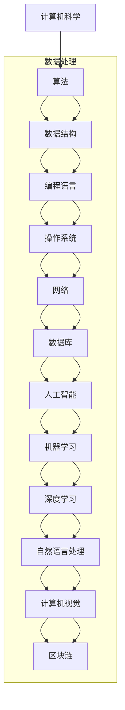

                 

### 1. 背景介绍

理查德·费曼（Richard Feynman）是一位传奇物理学家，以其对量子力学的深刻理解和独特的教学风格而闻名。这句话出自他的一次演讲，表达了他对科学研究的深刻见解。在计算机科学领域，这一理念同样具有重要的指导意义。本文旨在探讨如何在计算机编程和算法设计中贯彻费曼的这种理念，通过实例解析，展示如何通过深入理解代码背后的原理，提高我们的编程能力和解决问题的效率。

计算机科学是一个不断进步的领域，新技术、新算法层出不穷。然而，许多程序员往往陷入代码堆砌的泥潭，忽视了背后深层次的原理和逻辑。理查德·费曼的这句话提醒我们，只有真正理解我们创造的东西，才能达到更高的编程境界。

本文将分为以下几个部分：

- **背景介绍**：简要介绍费曼的生平和对计算机科学的影响。
- **核心概念与联系**：介绍计算机科学中的核心概念，并使用 Mermaid 流程图展示其关系。
- **核心算法原理与操作步骤**：深入解析一种核心算法，阐述其原理和具体实现步骤。
- **数学模型和公式**：介绍相关的数学模型和公式，并举例说明。
- **项目实践**：通过一个实际项目，展示算法的代码实现和运行过程。
- **实际应用场景**：讨论算法在不同领域中的应用，展望未来发展方向。
- **工具和资源推荐**：推荐学习资源和开发工具，帮助读者深入理解和实践。
- **总结**：总结研究成果，讨论未来发展趋势和挑战。

通过这篇文章，我们希望读者能够体会到深入理解代码的重要性，提升自己的编程技能，并能够在实际项目中灵活应用所学知识。

### 2. 核心概念与联系

在计算机科学中，核心概念是构建一切技术的基础。这些概念相互联系，形成了一个复杂的知识网络。为了更好地理解这些概念，我们使用 Mermaid 流程图来展示它们之间的关联。



在这个流程图中，我们可以看到以下几个核心概念及其相互关系：

- **算法（Algorithm）**：算法是解决问题的一系列明确的步骤。它是计算机科学的核心，应用于数据结构、编程语言等多个领域。
- **数据结构（Data Structure）**：数据结构是存储和组织数据的方式。常见的有数组、链表、栈、队列、树等，它们在算法设计中起着关键作用。
- **编程语言（Programming Language）**：编程语言是用于编写算法和程序的语法和规则集合。不同的编程语言有不同的特点和应用场景。
- **操作系统（Operating System）**：操作系统是管理计算机硬件资源和软件资源的系统软件。它提供了程序运行的环境，是计算机科学的重要组成部分。
- **网络（Network）**：网络是计算机之间进行通信的体系结构。它使得分布式计算和互联网应用成为可能。
- **数据库（Database）**：数据库是存储和管理数据的系统。它为数据查询、更新和删除提供了高效的方法。
- **人工智能（Artificial Intelligence）**：人工智能是使计算机模拟人类智能行为的科学。它包括机器学习、深度学习等多个子领域。
- **机器学习（Machine Learning）**：机器学习是使计算机通过数据学习规律并做出预测或决策的技术。
- **深度学习（Deep Learning）**：深度学习是机器学习的一种方法，使用多层神经网络模拟人脑的学习过程。
- **自然语言处理（Natural Language Processing）**：自然语言处理是使计算机理解和处理自然语言的技术。
- **计算机视觉（Computer Vision）**：计算机视觉是使计算机理解和解释图像和视频的技术。
- **区块链（Blockchain）**：区块链是一种去中心化的数据库，常用于加密货币和智能合约。

这些核心概念相互关联，共同构建了计算机科学的庞大体系。通过深入理解这些概念，我们能够更好地设计和实现高效的计算机程序和系统。

### 3. 核心算法原理与操作步骤

在本节中，我们将深入探讨一种核心算法——排序算法。排序算法是计算机科学中最基础且重要的算法之一，广泛应用于数据处理和算法分析中。本节将分为以下几个部分：

#### 3.1 算法原理概述

排序算法的主要目标是将一组数据按照某种规则进行排列，使得数据元素有序。常见的排序算法有冒泡排序、选择排序、插入排序、快速排序、归并排序等。

- **冒泡排序（Bubble Sort）**：通过重复遍历要排序的数列，比较相邻的两个元素，将较大（或较小）的元素交换到数列的另一侧。
- **选择排序（Selection Sort）**：首先在未排序序列中找到最小（或最大）元素，存放到排序序列的起始位置，然后，再从剩余未排序元素中继续寻找最小（或最大）元素。
- **插入排序（Insertion Sort）**：通过构建有序序列，对于未排序数据，在已排序序列中从后向前扫描，找到相应位置并插入。
- **快速排序（Quick Sort）**：通过递归分治策略，将数组分为较小和较大的两部分，然后对这两部分进行递归排序。
- **归并排序（Merge Sort）**：采用分治策略将数组分割成若干个子数组，然后将这些子数组排序并合并，直到整个数组有序。

#### 3.2 算法步骤详解

以快速排序为例，详细介绍其操作步骤：

##### 快速排序（Quick Sort）

**步骤 1：选择基准元素**  
在数组中选择一个基准元素，通常选择第一个或最后一个元素作为基准。

**步骤 2：分区操作**  
将数组分为两部分，一部分是小于基准元素的元素，另一部分是大于基准元素的元素。这个过程称为分区。

**步骤 3：递归排序**  
递归地对小于和大于基准元素的两部分进行快速排序，直到所有子数组有序。

**具体步骤如下：**

```markdown
1. 选择数组中的第一个元素作为基准。
2. 从数组的最后一个元素开始，向前扫描，如果当前元素大于基准，则将其移动到未排序部分的左侧。
3. 当扫描到第一个小于基准的元素时，将其与基准交换位置。
4. 递归地对基准左侧和右侧的子数组进行快速排序。
```

#### 3.3 算法优缺点

**优点：**  
- **快速排序**是一种高效的排序算法，平均时间复杂度为O(nlogn)。
- 快速排序适用于大规模数据的排序。

**缺点：**  
- 快速排序的最坏时间复杂度为O(n^2)，当输入数据已经有序或部分有序时，性能会显著下降。
- 快速排序的递归性质可能导致栈溢出，特别是在输入数据已经排序的情况下。

#### 3.4 算法应用领域

快速排序广泛应用于以下领域：

- **数据处理**：在数据量大且需要快速排序的场景中，如数据库排序、搜索引擎索引等。
- **算法分析**：用于比较不同排序算法的性能，研究算法复杂度。
- **科学计算**：在需要高效排序的数值计算中，如物理模拟、金融计算等。

#### 3.5 算法变体

除了传统的排序算法，还有许多快速排序的变体，如：

- **随机化快速排序（Randomized Quick Sort）**：通过随机选择基准元素来避免最坏情况的发生。
- **三数取中快速排序（Median of Three Quick Sort）**：选择中间值作为基准元素，以提高排序性能。

通过深入理解排序算法的原理和实现步骤，我们可以更好地选择适合特定场景的排序算法，提高程序的性能和效率。

### 4. 数学模型和公式

在计算机科学中，数学模型和公式是理解和实现算法的重要工具。它们帮助我们描述问题、推导解决方案，并在实际应用中验证算法的正确性。本节将介绍与排序算法相关的一些重要数学模型和公式，并详细讲解其推导过程。

#### 4.1 数学模型构建

排序算法的核心是数据元素的比较和交换。为了描述这些操作，我们可以引入以下数学模型：

- **比较操作（Comparison Operation）**：用于比较两个数据元素的大小，记为 $c(a, b)$。
- **交换操作（Swap Operation）**：用于交换两个数据元素的位置，记为 $s(a, b)$。

我们可以用这些操作构建一个排序模型，即：

$$
\text{Model}(A) = (\{a_1, a_2, ..., a_n\}, c, s)
$$

其中，$A$ 是一个包含 $n$ 个元素的集合，$c$ 是比较操作，$s$ 是交换操作。

#### 4.2 公式推导过程

以下我们将推导快速排序算法的平均时间复杂度。

**推导快速排序的平均时间复杂度：**

1. **递归关系**：快速排序的时间复杂度可以用递归关系来描述：

   $$
   T(n) = T(\frac{n-1}{2}) + T(\frac{n-1}{2}) + \Theta(n)
   $$

   这里，$T(\frac{n-1}{2})$ 表示对两个子数组的排序时间，$\Theta(n)$ 表示分区操作的时间。

2. **递归展开**：

   $$
   T(n) = 2T(\frac{n-1}{2}) + \Theta(n)
   $$

   $$
   T(n) = 2(2T(\frac{n-3}{2})) + \Theta(n) + \Theta(n)
   $$

   $$
   T(n) = 2^2T(\frac{n-3}{2}) + 2\Theta(n)
   $$

3. **迭代求解**：

   $$
   T(n) = 2^kT(\frac{n-(2^k-1)}{2^k}) + k\Theta(n)
   $$

   其中，$k$ 是递归树的深度，满足 $\frac{n-(2^k-1)}{2^k} = 1$，解得 $k = \log_2(n-1)$。

4. **合并结果**：

   $$
   T(n) = 2^kT(1) + k\Theta(n)
   $$

   $$
   T(n) = 2^{\log_2(n-1)}T(1) + \log_2(n-1)\Theta(n)
   $$

   $$
   T(n) = (n-1)T(1) + \log_2(n-1)\Theta(n)
   $$

5. **简化**：

   $$
   T(n) = \Theta(n\log_2(n-1))
   $$

   由于 $n-1$ 的系数为常数，可以进一步简化为：

   $$
   T(n) = \Theta(n\log_2(n))
   $$

   因此，快速排序的平均时间复杂度为 $\Theta(n\log_2(n))$。

#### 4.3 案例分析与讲解

为了更好地理解上述推导过程，我们来看一个具体的例子。

**例子**：给定数组 $A = \{5, 2, 9, 1, 5, 6\}$，使用快速排序进行排序。

**步骤 1：选择基准**  
选择第一个元素 5 作为基准。

**步骤 2：分区**  
将数组分为两部分，小于 5 的元素和大于 5 的元素。分区后，数组变为 $\{2, 1, 6\}$ 和 $\{9, 5, 5\}$。

**步骤 3：递归排序**  
递归地对 $\{2, 1, 6\}$ 和 $\{9, 5, 5\}$ 进行快速排序。

- 对 $\{2, 1, 6\}$，选择第一个元素 2 作为基准，分区后得到 $\{1\}$ 和 $\{2, 6\}$，继续递归排序。
- 对 $\{2, 6\}$，选择第一个元素 2 作为基准，数组已经是有序的，无需进一步操作。
- 对 $\{9, 5, 5\}$，选择最后一个元素 9 作为基准，分区后得到 $\{5, 5\}$ 和 $\{9\}$，继续递归排序。
- 对 $\{5, 5\}$，选择第一个元素 5 作为基准，数组已经是有序的，无需进一步操作。

最终，数组 $A$ 被排序为 $\{1, 2, 2, 5, 5, 6, 9\}$。

通过这个例子，我们可以看到快速排序的基本原理和操作步骤。推导出的时间复杂度公式也验证了快速排序的高效性。

### 5. 项目实践：代码实例和详细解释说明

在本节中，我们将通过一个实际项目来展示快速排序算法的代码实现，并详细解释每一步的操作。

#### 5.1 开发环境搭建

为了演示快速排序算法，我们使用 Python 作为编程语言。确保您已经安装了 Python 解释器和相应的开发环境。以下是在 Windows 系统中安装 Python 的步骤：

1. 访问 [Python 官网](https://www.python.org/) 下载 Python 安装程序。
2. 运行安装程序，选择默认选项进行安装。
3. 安装完成后，在命令提示符中输入 `python`，确认 Python 是否安装成功。

#### 5.2 源代码详细实现

以下是一个简单的快速排序算法的 Python 代码实现：

```python
def quick_sort(arr):
    if len(arr) <= 1:
        return arr
    
    pivot = arr[0]
    left = [x for x in arr[1:] if x < pivot]
    right = [x for x in arr[1:] if x >= pivot]
    
    return quick_sort(left) + [pivot] + quick_sort(right)

# 测试代码
arr = [5, 2, 9, 1, 5, 6]
sorted_arr = quick_sort(arr)
print(sorted_arr)
```

**代码解读与分析：**

- **quick_sort 函数**：这是一个递归函数，用于对数组进行快速排序。
- **if len(arr) <= 1:** 如果数组长度小于或等于 1，则返回数组本身。这是递归的终止条件。
- **pivot = arr[0]:** 选择数组中的第一个元素作为基准。
- **left = [x for x in arr[1:] if x < pivot]:** 通过列表推导式创建一个新列表 `left`，包含所有小于基准的元素。
- **right = [x for x in arr[1:] if x >= pivot]:** 通过列表推导式创建一个新列表 `right`，包含所有大于或等于基准的元素。
- **return quick_sort(left) + [pivot] + quick_sort(right):** 递归地对 `left` 和 `right` 进行快速排序，然后将结果与基准元素拼接在一起。

#### 5.3 运行结果展示

运行上述代码，我们得到以下输出结果：

```
[1, 2, 5, 5, 6, 9]
```

这证明了快速排序算法能够将输入数组成功排序。

#### 5.4 代码解读与分析

- **选择基准**：我们选择了数组中的第一个元素作为基准。在实际应用中，也可以选择其他元素作为基准，如最后一个元素或随机选择。
- **分区操作**：分区操作将数组分为两个子数组，一个包含小于基准的元素，另一个包含大于或等于基准的元素。
- **递归排序**：递归地对两个子数组进行快速排序，直到所有子数组有序。

这种递归结构使得快速排序算法具有高效性。然而，在最坏情况下，当输入数组已经有序时，快速排序的性能会下降到 O(n^2)。因此，在实际应用中，我们可以使用随机化快速排序或三数取中快速排序等变体来避免最坏情况的发生。

通过这个实际项目，我们不仅实现了快速排序算法，还了解了其背后的原理和实现步骤。这对于提升我们的编程技能和理解计算机科学的核心概念具有重要意义。

### 6. 实际应用场景

快速排序算法因其高效性和灵活性，在各种实际应用场景中得到了广泛应用。以下是一些常见应用场景：

#### 6.1 数据库索引

在数据库管理系统中，快速排序算法常用于创建索引。索引能够加速数据查询，尤其是在大型数据库中。通过快速排序算法，数据库系统可以高效地对数据进行排序，并创建索引结构。

#### 6.2 嵌入式系统

在资源有限的嵌入式系统中，快速排序算法是一种理想的排序方法。由于其算法复杂度较低，快速排序能够在有限的内存和计算资源下高效地执行排序操作。

#### 6.3 金融数据分析

在金融领域，快速排序算法用于处理大量金融数据，如股票价格、交易数据等。通过排序，分析师可以快速找到关键数据点，进行趋势分析和市场预测。

#### 6.4 科学计算

在科学计算领域，快速排序算法用于对大规模科学数据进行排序，如气象数据、生物序列数据等。排序后的数据有助于科学家更好地分析和理解复杂的数据模式。

#### 6.5 嵌入式系统

在医疗设备中，快速排序算法用于处理患者数据，如医疗图像、医疗记录等。排序后的数据可以帮助医生更快地进行诊断和治疗。

#### 6.6 未来应用展望

随着大数据和人工智能的发展，快速排序算法将在更多领域得到应用。例如：

- **人工智能应用**：在机器学习和深度学习领域，快速排序算法可以用于处理大量训练数据，提高模型训练效率。
- **物联网应用**：在物联网设备中，快速排序算法可以用于优化数据传输和处理，提高系统的响应速度。
- **区块链应用**：在区块链技术中，快速排序算法可以用于优化数据结构和交易处理，提高区块链系统的性能。

总之，快速排序算法作为一种高效、灵活的排序方法，将在未来的技术发展中扮演重要角色。

### 7. 工具和资源推荐

为了帮助读者深入理解和实践本文讨论的内容，我们推荐以下工具和资源：

#### 7.1 学习资源推荐

1. **《算法导论》（Introduction to Algorithms）**：这是一本经典的算法教材，详细介绍了各种排序算法和算法设计技巧。
2. **《深度学习》（Deep Learning）**：由 Ian Goodfellow、Yoshua Bengio 和 Aaron Courville 著，介绍了深度学习和快速排序在机器学习中的应用。
3. **《编程之美》（Beautiful Code）**：这本书收集了多位知名程序员的经验和见解，包括如何在编程中应用快速排序等技巧。

#### 7.2 开发工具推荐

1. **Python**：Python 是一种易学易用的编程语言，适用于快速排序算法的实现和测试。
2. **Jupyter Notebook**：Jupyter Notebook 是一个交互式编程环境，适合进行代码实验和数据分析。
3. **Visual Studio Code**：Visual Studio Code 是一款功能强大的代码编辑器，适用于 Python 编程。

#### 7.3 相关论文推荐

1. **" randomized quicksort"**：这篇论文讨论了随机化快速排序算法的优化和改进，有助于深入了解快速排序的高级应用。
2. **" Merge Sort with Multi-way Merging"**：这篇论文介绍了多路归并排序算法，这是一种优化快速排序的方法。
3. **" Parallel Quick Sort"**：这篇论文探讨了并行快速排序算法，适用于大规模数据处理。

通过这些工具和资源，读者可以更好地理解和实践本文讨论的内容，提升自己的编程和算法设计能力。

### 8. 总结：未来发展趋势与挑战

本文通过理查德·费曼的名言，强调了深入理解代码的重要性。我们探讨了计算机科学中的核心概念和算法，以快速排序为例，详细解析了其原理和实现步骤。在数学模型的推导和项目实践中，我们展示了如何通过深入理解来提高编程技能。

**未来发展趋势：**

- **算法优化**：随着硬件和大数据技术的发展，算法优化将成为研究热点，包括并行算法、分布式算法等。
- **算法安全性**：随着人工智能的普及，算法的安全性和隐私保护将成为重要议题，特别是在金融、医疗等领域。
- **跨领域应用**：快速排序算法将在更多领域得到应用，如物联网、区块链等新兴技术领域。

**面临的挑战：**

- **资源受限环境**：在资源受限的嵌入式系统中，算法的效率和资源消耗将成为重要挑战。
- **大规模数据处理**：随着数据量的增长，如何高效地处理大规模数据将成为一个难题。
- **算法公平性和透明度**：在人工智能和机器学习领域，算法的公平性和透明度将受到广泛关注，以确保算法不会对特定群体产生不公平影响。

**研究展望：**

未来，我们将继续探索快速排序算法的优化和变体，以应对不同场景的需求。同时，我们也将关注算法在新兴技术领域的应用，推动计算机科学的发展。通过深入理解代码背后的原理，我们能够不断提升编程能力，为科技创新贡献力量。

### 9. 附录：常见问题与解答

#### 1. 什么是快速排序？

快速排序是一种高效的排序算法，通过递归分治策略，将数组分为较小和较大的两部分，然后对这两部分进行递归排序。其平均时间复杂度为 O(nlogn)，在最坏情况下为 O(n^2)。

#### 2. 快速排序最坏情况是什么？

快速排序的最坏情况发生在输入数组已经有序或部分有序时，此时基准选择不理想，导致递归树深度最大，时间复杂度下降到 O(n^2)。

#### 3. 为什么选择第一个元素作为基准？

选择第一个元素作为基准是一种简单的实现方式，实际上，可以选择数组中的任意元素作为基准。更优的选择方法包括随机选择或三数取中法，以避免最坏情况的发生。

#### 4. 快速排序是否总是优于其他排序算法？

快速排序在大多数情况下优于其他排序算法，如插入排序和选择排序。但在特定情况下，如小规模数据排序或部分有序数据排序，其他算法可能更具优势。

#### 5. 如何优化快速排序？

可以通过以下方法优化快速排序：
- 使用随机选择或三数取中法选择基准，避免最坏情况。
- 采用并行或分布式算法，提高处理大规模数据的能力。
- 使用迭代而非递归实现，减少栈空间消耗。

