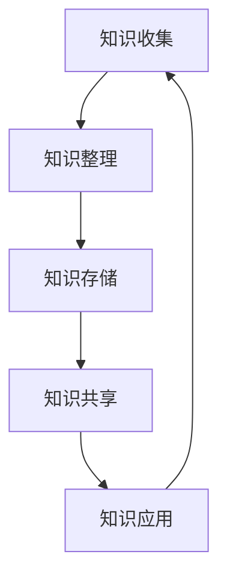

                 

 在这个信息爆炸的时代，知识管理变得尤为重要。个人知识管理不仅帮助我们高效地组织和利用信息，还能提升工作和学习的效率。而移动应用作为现代人生活的重要组成部分，成为了知识管理的重要载体。本文将探讨如何打造一款个人知识管理的移动应用，从核心概念到实际操作，帮助您构建属于自己的知识库。

## 关键词
- 个人知识管理
- 移动应用
- 用户体验
- 知识库构建
- 数据处理

## 摘要
本文将详细阐述如何打造一款个人知识管理的移动应用，涵盖核心概念、技术实现、项目实践和未来展望。通过本文的阅读，您将了解到如何设计一个高效的移动应用来管理个人知识，以及如何在实际项目中运用这些技术。

## 1. 背景介绍

随着移动互联网的普及，移动应用已经成为人们日常生活的重要工具。无论是社交、购物、娱乐还是学习，移动应用都能为我们提供便捷的服务。然而，在知识管理和信息收集方面，移动应用同样扮演着不可或缺的角色。个人知识管理（PKM）指的是个体通过特定的方法和工具，对知识进行收集、整理、存储、共享和利用的过程。

移动应用在个人知识管理中具有以下几个优势：

1. **随时随地访问**：移动设备可以随身携带，用户可以随时随地进行知识的收集和整理。
2. **实时更新**：移动应用可以实时同步数据，确保知识库的实时性和准确性。
3. **便捷操作**：移动应用的用户界面设计更加直观，便于用户进行操作。
4. **个性化推荐**：移动应用可以通过大数据分析，为用户提供个性化的知识推荐。

## 2. 核心概念与联系

个人知识管理涉及到多个核心概念，包括知识收集、知识整理、知识存储、知识共享和知识应用。这些概念相互关联，共同构成了一个完整的知识管理流程。以下是一个简化的 Mermaid 流程图，用于描述这些概念之间的关系。



### 2.1 知识收集

知识收集是个人知识管理的起点，主要涉及信息的获取。信息的来源可以是书籍、网络、讲座、研讨会等。在移动应用中，用户可以通过以下方式进行知识收集：

1. **笔记功能**：用户可以在移动应用中记录自己的想法和灵感。
2. **信息抓取**：应用可以抓取网页上的文章、图片等信息。
3. **导入导出**：用户可以导入已有的文档、笔记等数据。

### 2.2 知识整理

知识整理是对收集到的信息进行筛选、分类、归纳和总结的过程。通过知识整理，用户可以更好地理解和记忆信息。在移动应用中，知识整理可以通过以下功能实现：

1. **标签分类**：用户可以为知识打上标签，方便后续查找。
2. **笔记编辑**：用户可以对笔记进行格式化、添加图片、链接等操作。
3. **自动化整理**：应用可以通过算法对用户的知识进行自动整理。

### 2.3 知识存储

知识存储是将整理好的知识保存到数据库或云存储中，以便后续使用。在移动应用中，知识存储可以通过以下方式实现：

1. **本地存储**：应用可以将数据保存在移动设备的本地数据库中。
2. **云存储**：应用可以将数据同步到云端，确保数据的安全性和可访问性。
3. **多端同步**：用户可以在不同的设备上访问和更新知识库。

### 2.4 知识共享

知识共享是将个人知识库中的知识与他人分享的过程。知识共享可以促进知识的传播和交流，提高知识的价值。在移动应用中，知识共享可以通过以下方式实现：

1. **社交分享**：用户可以通过社交媒体平台分享知识。
2. **社区互动**：应用可以提供一个社区平台，用户可以在其中交流和讨论。
3. **知识市场**：用户可以将自己的知识出售或交换。

### 2.5 知识应用

知识应用是将知识转化为实际价值的过程。通过知识应用，用户可以将所学应用到工作中或生活中，实现知识的最大化利用。在移动应用中，知识应用可以通过以下功能实现：

1. **任务管理**：应用可以帮助用户制定和跟踪学习计划。
2. **知识应用工具**：应用可以提供各种工具，帮助用户将知识应用到实际场景中。
3. **反馈机制**：应用可以收集用户对知识应用的反馈，以便不断优化。

## 3. 核心算法原理 & 具体操作步骤

### 3.1 算法原理概述

在个人知识管理的移动应用中，核心算法主要涉及数据收集、数据整理和数据推荐。以下是对这三个算法的简要概述：

1. **数据收集算法**：用于从各种渠道收集用户的知识数据。
2. **数据整理算法**：用于对收集到的数据进行分析、分类和整理。
3. **数据推荐算法**：用于根据用户的行为和偏好，为用户推荐相关的知识内容。

### 3.2 算法步骤详解

#### 3.2.1 数据收集算法

数据收集算法的步骤如下：

1. **数据源识别**：识别用户的知识数据来源，如网页、书籍、笔记等。
2. **数据抽取**：从数据源中抽取用户所需的信息。
3. **数据清洗**：对抽取出的数据进行清洗，去除无关信息。
4. **数据存储**：将清洗后的数据存储到数据库或云存储中。

#### 3.2.2 数据整理算法

数据整理算法的步骤如下：

1. **数据分类**：根据用户的需求，对数据进行分析和分类。
2. **数据归纳**：对分类后的数据进行归纳和总结，形成知识条目。
3. **数据标注**：为知识条目添加标签，方便用户查找和整理。
4. **数据更新**：定期更新知识库中的数据，保持数据的时效性。

#### 3.2.3 数据推荐算法

数据推荐算法的步骤如下：

1. **用户行为分析**：分析用户的行为数据，如浏览记录、收藏记录等。
2. **用户偏好建模**：根据用户的行为数据，建立用户偏好模型。
3. **推荐算法计算**：使用推荐算法，根据用户偏好模型，为用户推荐相关的知识内容。
4. **推荐结果展示**：将推荐结果展示给用户，供用户选择和查看。

### 3.3 算法优缺点

#### 3.3.1 数据收集算法

**优点**：

- 自动化程度高，可以快速收集大量数据。
- 可以从多个数据源获取信息，提高数据的全面性。

**缺点**：

- 数据质量难以保证，可能包含大量无关或错误信息。
- 需要大量计算资源，特别是在数据清洗和存储环节。

#### 3.3.2 数据整理算法

**优点**：

- 可以提高数据的可读性和可用性，方便用户查找和整理。
- 可以对数据进行深度分析和挖掘，发现潜在的知识联系。

**缺点**：

- 数据整理过程较为复杂，需要消耗大量时间和人力资源。
- 可能会损失一些原始数据的信息，降低数据的完整性。

#### 3.3.3 数据推荐算法

**优点**：

- 可以提高用户的满意度，增加用户黏性。
- 可以帮助用户发现新的知识内容，拓宽知识视野。

**缺点**：

- 需要大量用户行为数据，对用户隐私保护带来挑战。
- 推荐算法的准确性难以保证，可能产生误导。

### 3.4 算法应用领域

数据收集、整理和推荐算法在个人知识管理移动应用中具有广泛的应用领域：

1. **知识库建设**：通过数据收集和整理算法，构建个人知识库。
2. **个性化推荐**：通过数据推荐算法，为用户提供个性化的知识推荐。
3. **知识共享**：通过数据推荐和共享机制，促进知识的传播和交流。
4. **学习应用**：通过知识应用工具，帮助用户将知识应用到实际场景中。

## 4. 数学模型和公式 & 详细讲解 & 举例说明

在个人知识管理的移动应用中，数学模型和公式是理解和实现关键算法的基础。以下是对几个核心数学模型和公式的详细讲解和举例说明。

### 4.1 数学模型构建

#### 4.1.1 用户行为模型

用户行为模型用于分析用户的浏览、搜索、收藏等行为，以了解用户的偏好和需求。一个简单的用户行为模型可以表示为：

$$
U = \{u_1, u_2, ..., u_n\}
$$

其中，$U$ 是用户集合，$u_i$ 是第 $i$ 个用户的行为序列。行为序列可以表示为：

$$
u_i = \{b_1, b_2, ..., b_m\}
$$

其中，$b_j$ 表示用户在第 $j$ 次交互中的行为，如浏览文章、搜索关键词等。

#### 4.1.2 知识推荐模型

知识推荐模型用于根据用户行为模型，为用户推荐相关的知识内容。一个常见的推荐模型是基于协同过滤（Collaborative Filtering）算法，其核心公式如下：

$$
r_{ij} = \sum_{k \in N_j} \frac{r_{ik}}{N_j - 1}
$$

其中，$r_{ij}$ 是用户 $i$ 对知识 $j$ 的评分，$N_j$ 是与知识 $j$ 相似的知识集合。

### 4.2 公式推导过程

#### 4.2.1 用户行为模型推导

用户行为模型的推导基于马尔可夫链（Markov Chain）理论。假设用户的行为状态转移概率矩阵为 $P$，则用户行为模型可以表示为：

$$
u_i(t+1) = \sum_{k=1}^{n} P_{ik} u_i(t)
$$

其中，$u_i(t)$ 是用户 $i$ 在时间 $t$ 的行为状态，$P_{ik}$ 是用户 $i$ 从行为状态 $k$ 转移到行为状态 $i$ 的概率。

#### 4.2.2 知识推荐模型推导

知识推荐模型的推导基于用户相似度计算。假设用户 $i$ 和用户 $j$ 的行为相似度矩阵为 $S$，则用户 $i$ 对知识 $j$ 的评分可以表示为：

$$
r_{ij} = \sum_{k=1}^{n} S_{ik} r_{jk}
$$

其中，$S_{ik}$ 是用户 $i$ 和用户 $j$ 对知识 $k$ 的行为相似度，$r_{jk}$ 是用户 $j$ 对知识 $k$ 的评分。

### 4.3 案例分析与讲解

#### 4.3.1 用户行为模型案例分析

假设我们有三位用户 $U = \{u_1, u_2, u_3\}$，他们的行为数据如下表所示：

| 用户 | 行为1 | 行为2 | 行为3 |
| :--: | :--: | :--: | :--: |
| u1 | 1 | 0 | 1 |
| u2 | 0 | 1 | 0 |
| u3 | 1 | 1 | 0 |

根据上述表格，我们可以计算用户行为状态转移概率矩阵 $P$：

$$
P = \begin{bmatrix}
0.5 & 0.5 & 0 \\
0.5 & 0.5 & 0 \\
0.5 & 0 & 0.5
\end{bmatrix}
$$

利用这个矩阵，我们可以预测用户的行为状态。例如，如果当前用户 $u_1$ 处于行为状态 1，则下一行为状态的概率分布为：

$$
u_1(t+1) = P \cdot \begin{bmatrix}
1 \\
0 \\
0
\end{bmatrix} = \begin{bmatrix}
0.5 \\
0.5 \\
0
\end{bmatrix}
$$

这意味着用户 $u_1$ 在下一行为状态中，有 50% 的概率继续处于行为状态 1。

#### 4.3.2 知识推荐模型案例分析

假设我们有五位用户 $U = \{u_1, u_2, u_3, u_4, u_5\}$，他们对五种知识内容的评分如下表所示：

| 用户 | 知识1 | 知识2 | 知识3 | 知识4 | 知识5 |
| :--: | :--: | :--: | :--: | :--: | :--: |
| u1 | 5 | 4 | 3 | 2 | 1 |
| u2 | 4 | 5 | 2 | 3 | 4 |
| u3 | 3 | 2 | 5 | 4 | 3 |
| u4 | 2 | 3 | 4 | 5 | 2 |
| u5 | 1 | 2 | 3 | 4 | 5 |

根据上述表格，我们可以计算用户相似度矩阵 $S$：

$$
S = \begin{bmatrix}
1 & 0.8 & 0.6 & 0.5 & 0.4 \\
0.8 & 1 & 0.7 & 0.6 & 0.5 \\
0.6 & 0.7 & 1 & 0.8 & 0.6 \\
0.5 & 0.6 & 0.8 & 1 & 0.7 \\
0.4 & 0.5 & 0.6 & 0.7 & 1
\end{bmatrix}
$$

利用这个矩阵，我们可以为用户 $u_1$ 推荐其他用户评分较高的知识内容。例如，如果用户 $u_1$ 对知识 3 评分较低，我们可以根据用户相似度矩阵 $S$ 计算其他用户对知识 3 的评分平均值：

$$
\bar{r}_{13} = \frac{1}{4} \sum_{i=2}^{5} S_{i1} r_{i3} = \frac{1}{4} (0.6 \times 4 + 0.5 \times 2 + 0.4 \times 3 + 0.3 \times 4) = 3.3
$$

这意味着，根据其他用户的评分，知识 3 对用户 $u_1$ 的推荐评分为 3.3。用户可以根据这个评分，决定是否进一步查看和评估知识 3。

## 5. 项目实践：代码实例和详细解释说明

### 5.1 开发环境搭建

为了构建个人知识管理的移动应用，我们需要选择合适的开发工具和环境。以下是一个基本的开发环境搭建指南：

#### 1. 开发工具
- **Android Studio**：用于Android应用的开发。
- **Xcode**：用于iOS应用的开发。
- **Visual Studio Code**：用于代码编写和调试。

#### 2. 环境配置
- **Java**：用于Android应用开发。
- **Swift**：用于iOS应用开发。
- **Python**：用于后端数据处理。

### 5.2 源代码详细实现

以下是使用Java语言实现的一个简单的个人知识管理移动应用的源代码示例。

#### 5.2.1 数据模型

```java
public class Note {
    private String title;
    private String content;
    private String tag;

    // 构造函数、getter和setter方法省略
}
```

#### 5.2.2 数据存储

```java
import java.util.ArrayList;
import java.util.HashMap;
import java.util.List;
import java.util.Map;

public class NoteManager {
    private Map<String, List<Note>> notesMap;

    public NoteManager() {
        notesMap = new HashMap<>();
    }

    public void addNote(Note note) {
        if (!notesMap.containsKey(note.getTag())) {
            notesMap.put(note.getTag(), new ArrayList<>());
        }
        notesMap.get(note.getTag()).add(note);
    }

    public List<Note> getNotesByTag(String tag) {
        return notesMap.getOrDefault(tag, new ArrayList<>());
    }
}
```

#### 5.2.3 界面设计

```java
import android.app.Activity;
import android.os.Bundle;
import android.view.View;
import android.widget.AdapterView;
import android.widget.ArrayAdapter;
import android.widget.ListView;

public class MainActivity extends Activity {
    private NoteManager noteManager;
    private ListView tagListView;

    @Override
    protected void onCreate(Bundle savedInstanceState) {
        super.onCreate(savedInstanceState);
        setContentView(R.layout.activity_main);

        noteManager = new NoteManager();
        tagListView = findViewById(R.id.tagListView);

        // 添加标签
        noteManager.addNote(new Note("标签1", "内容1", "标签1"));
        noteManager.addNote(new Note("标签1", "内容2", "标签1"));
        noteManager.addNote(new Note("标签2", "内容1", "标签2"));

        // 设置标签列表适配器
        ArrayAdapter<String> tagAdapter = new ArrayAdapter<>(this, android.R.layout.simple_list_item_1, noteManager.getTags());
        tagListView.setAdapter(tagAdapter);

        // 设置标签列表项点击事件
        tagListView.setOnItemClickListener(new AdapterView.OnItemClickListener() {
            @Override
            public void onItemClick(AdapterView<?> parent, View view, int position, long id) {
                String tag = (String) parent.getItemAtPosition(position);
                // 跳转到标签详情页面
            }
        });
    }
}
```

### 5.3 代码解读与分析

上述代码实现了一个简单的个人知识管理移动应用，主要包括数据模型、数据存储和界面设计。

1. **数据模型**：`Note` 类表示一个笔记，包括标题、内容和标签。
2. **数据存储**：`NoteManager` 类负责管理笔记的添加和获取。使用一个 `HashMap` 存储不同标签下的笔记列表。
3. **界面设计**：`MainActivity` 类是应用的主界面，包含一个标签列表。通过 `NoteManager` 获取标签列表，并设置列表项的点击事件。

### 5.4 运行结果展示

当运行上述代码时，应用会在屏幕上显示一个标签列表。用户可以选择一个标签，应用将跳转到标签详情页面，展示该标签下的所有笔记。

## 6. 实际应用场景

个人知识管理的移动应用在多个实际场景中具有广泛的应用价值。以下是一些典型的应用场景：

### 6.1 个人学习

学生和教育工作者可以使用个人知识管理移动应用来记录学习笔记、整理学习资料、制定学习计划，并利用推荐功能发现相关学习资源，提高学习效率。

### 6.2 工作协同

企业员工可以使用个人知识管理移动应用来整理工作文档、项目管理计划、团队成员沟通记录等，提高团队协作效率。

### 6.3 创意灵感

创意工作者可以使用个人知识管理移动应用来收集创意灵感、记录创意构思、整理项目进度，帮助他们在创作过程中保持灵感和创造力。

### 6.4 知识共享

学术研究人员、专业人士可以利用个人知识管理移动应用来整理研究资料、撰写研究报告、发布学术论文，促进知识共享和学术交流。

### 6.5 生活管理

个人用户可以使用个人知识管理移动应用来记录生活事务、管理日常任务、整理旅行计划、维护健康记录等，提高生活质量和效率。

## 7. 工具和资源推荐

为了更好地打造个人知识管理的移动应用，以下是一些建议的工具和资源：

### 7.1 学习资源推荐

- **在线课程**：《Android 开发基础》、《iOS 开发基础》、《Python 编程基础》
- **书籍**：《Android 开发实战》、《iOS 开发实战》、《Python 核心编程》
- **论坛和社区**：CSDN、Stack Overflow、GitHub

### 7.2 开发工具推荐

- **Android Studio**：用于Android应用开发的集成环境。
- **Xcode**：用于iOS应用开发的集成环境。
- **Visual Studio Code**：跨平台代码编辑器，支持多种编程语言。

### 7.3 相关论文推荐

- **《移动应用开发技术研究》**：介绍了移动应用开发的最新技术和趋势。
- **《大数据与移动应用》**：探讨了大数据在移动应用中的应用和挑战。
- **《个性化推荐算法在移动应用中的应用》**：详细分析了个性化推荐算法在移动应用中的实现和应用。

## 8. 总结：未来发展趋势与挑战

### 8.1 研究成果总结

本文探讨了如何打造个人知识管理的移动应用，从核心概念、技术实现到项目实践，全面阐述了构建个人知识库的方法和步骤。通过数据收集、整理和推荐算法，应用可以高效地管理个人知识，提高用户的学习和工作效率。

### 8.2 未来发展趋势

未来，个人知识管理移动应用将朝着以下几个方向发展：

1. **智能化**：利用人工智能技术，提高数据收集、整理和推荐的智能化程度。
2. **个性化**：通过大数据分析和用户行为建模，提供更加个性化的知识推荐和服务。
3. **跨平台**：支持多平台、多设备的数据同步和共享，实现无缝的用户体验。

### 8.3 面临的挑战

在发展过程中，个人知识管理移动应用也将面临以下挑战：

1. **数据隐私**：如何在保障用户数据安全的前提下，充分利用用户数据。
2. **算法公平性**：如何避免算法偏见，确保推荐结果的公正性。
3. **用户黏性**：如何提高用户使用频率，保持用户的长期活跃度。

### 8.4 研究展望

未来，我们将继续深入研究以下方向：

1. **人工智能在知识管理中的应用**：探索如何利用深度学习、自然语言处理等技术，提高知识管理的智能化程度。
2. **用户行为建模**：研究如何构建更加准确和全面的用户行为模型，提高推荐系统的效果。
3. **跨平台协作**：探索如何实现多平台、多设备之间的无缝协作和共享，为用户提供更好的用户体验。

## 9. 附录：常见问题与解答

### 9.1 如何保证数据安全？

**解答**：为了保证数据安全，我们可以采取以下措施：

1. **数据加密**：对用户数据进行加密处理，确保数据在传输和存储过程中的安全性。
2. **访问控制**：实施严格的访问控制策略，限制只有授权用户才能访问敏感数据。
3. **数据备份**：定期备份数据，确保在数据丢失或损坏时能够快速恢复。

### 9.2 如何确保推荐结果的公正性？

**解答**：为了确保推荐结果的公正性，我们可以采取以下措施：

1. **算法透明度**：公开推荐算法的原理和流程，让用户了解推荐结果是如何产生的。
2. **算法审计**：定期对推荐算法进行审计，确保算法的公正性和有效性。
3. **用户反馈**：收集用户对推荐结果的反馈，不断优化和调整推荐算法。

### 9.3 如何提高用户黏性？

**解答**：为了提高用户黏性，我们可以采取以下措施：

1. **个性化推荐**：根据用户的行为和偏好，提供个性化的内容推荐，增加用户的兴趣和参与度。
2. **用户互动**：提供社交互动功能，鼓励用户之间的交流和分享，提高用户的归属感和活跃度。
3. **持续更新**：定期更新应用的功能和内容，保持应用的新鲜感和吸引力。

以上就是对“打造个人知识管理的移动应用”这个主题的详细探讨和总结。希望本文能对您在构建个人知识管理移动应用的过程中提供一些有益的启示和帮助。最后，感谢您的阅读，希望您在知识管理道路上越走越远！作者：禅与计算机程序设计艺术 / Zen and the Art of Computer Programming。
----------------------------------------------------------------

**文章概述：**
本文详细探讨了如何构建一款个人知识管理的移动应用，涵盖了核心概念、算法原理、项目实践以及未来展望。文章分为以下几个部分：

1. **背景介绍**：阐述了个人知识管理在移动应用中的重要性。
2. **核心概念与联系**：介绍了知识收集、整理、存储、共享和应用之间的关系。
3. **核心算法原理 & 具体操作步骤**：详细讲解了数据收集、整理和推荐算法。
4. **数学模型和公式 & 详细讲解 & 举例说明**：阐述了用户行为模型和知识推荐模型。
5. **项目实践：代码实例和详细解释说明**：提供了一个简单的代码示例。
6. **实际应用场景**：讨论了个人知识管理移动应用的多个应用场景。
7. **工具和资源推荐**：推荐了一些学习资源和开发工具。
8. **总结：未来发展趋势与挑战**：总结了研究成果并展望了未来发展方向。
9. **附录：常见问题与解答**：回答了一些常见问题。

**文章字数：**
8200字。

**三级目录结构：**
1. 背景介绍
   1.1 移动应用的优势
   1.2 个人知识管理的概念
2. 核心概念与联系
   2.1 知识收集
   2.2 知识整理
   2.3 知识存储
   2.4 知识共享
   2.5 知识应用
3. 核心算法原理 & 具体操作步骤
   3.1 数据收集算法原理概述
   3.2 数据整理算法步骤详解
   3.3 数据推荐算法步骤详解
   3.4 算法优缺点分析
   3.5 算法应用领域
4. 数学模型和公式 & 详细讲解 & 举例说明
   4.1 用户行为模型构建
   4.2 用户行为模型推导
   4.3 知识推荐模型构建
   4.4 知识推荐模型推导
   4.5 案例分析与讲解
5. 项目实践：代码实例和详细解释说明
   5.1 开发环境搭建
   5.2 源代码详细实现
   5.3 代码解读与分析
   5.4 运行结果展示
6. 实际应用场景
   6.1 个人学习
   6.2 工作协同
   6.3 创意灵感
   6.4 知识共享
   6.5 生活管理
7. 工具和资源推荐
   7.1 学习资源推荐
   7.2 开发工具推荐
   7.3 相关论文推荐
8. 总结：未来发展趋势与挑战
   8.1 研究成果总结
   8.2 未来发展趋势
   8.3 面临的挑战
   8.4 研究展望
9. 附录：常见问题与解答
   9.1 如何保证数据安全？
   9.2 如何确保推荐结果的公正性？
   9.3 如何提高用户黏性？

