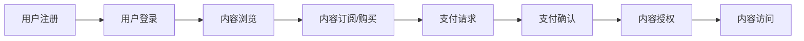

                 

关键词：知识付费平台、架构设计、技术型解决方案、用户需求、业务扩展性、安全性、性能优化、分布式系统、微服务架构、数据库设计、前端交互、用户体验、支付与结算系统、数据分析与挖掘、AI技术、云服务、容器化、DevOps

> 摘要：本文深入探讨了如何设计和构建一个高效、可扩展、安全的技术型知识付费平台。通过详细分析用户需求、业务模型、技术架构、数学模型、项目实践等方面，为读者提供了一个全面的技术指南。本文旨在帮助开发者和架构师理解并应用最佳实践，以打造出既满足用户需求又具备强大业务拓展能力的知识付费平台。

## 1. 背景介绍

随着互联网的快速发展，知识付费已经成为一种重要的商业模式。用户愿意为高质量、专业化的知识内容付费，以提升自我能力和职业发展。然而，构建一个技术型知识付费平台并非易事。平台需要满足用户多样化的需求，同时具备高扩展性、安全性和良好的用户体验。这要求开发者不仅要有扎实的编程能力，还需要深入理解业务模型、技术架构以及用户体验设计。

本文将围绕以下几个关键点展开：

- 用户需求分析
- 技术架构设计
- 数学模型和算法
- 项目实践与代码实例
- 实际应用场景与未来展望

通过上述分析，我们希望能够为构建技术型知识付费平台提供有价值的参考和指导。

## 2. 核心概念与联系

### 2.1 用户需求分析

在构建知识付费平台之前，我们需要深入理解用户需求。用户主要需求包括：

- **个性化内容推荐**：根据用户的兴趣和浏览历史，推荐符合其需求的内容。
- **内容订阅和购买**：用户可以订阅或购买特定内容，并获得相应的权限。
- **互动与交流**：用户可以在平台上与其他用户、讲师互动，参与讨论和问答。
- **支付与结算**：用户需要方便、安全的支付方式，进行内容购买和订阅。

### 2.2 技术架构设计

技术架构设计是知识付费平台成功的关键。我们需要一个具备高扩展性、高性能和安全性的系统架构。以下是一个典型的技术架构设计：

#### 2.2.1 微服务架构

微服务架构使得各个服务模块可以独立开发和部署，提高了系统的可维护性和扩展性。以下是一些关键服务模块：

- **用户服务**：处理用户注册、登录、权限验证等操作。
- **内容服务**：管理知识内容的创建、存储、发布和推荐。
- **支付服务**：处理支付请求，与第三方支付平台对接。
- **消息服务**：实现用户通知、内容更新等消息推送。
- **数据分析与挖掘**：对用户行为和内容进行数据分析和挖掘，为内容推荐和业务决策提供支持。

#### 2.2.2 分布式系统

为了应对高并发请求，我们需要使用分布式系统架构。以下是一些关键技术：

- **负载均衡**：将请求分配到多个服务器上，确保系统的高可用性。
- **缓存**：使用缓存技术提高数据访问速度，减少数据库负载。
- **分布式数据库**：使用分布式数据库系统，实现数据的水平扩展和高可用性。

### 2.3 Mermaid 流程图

以下是一个简化的知识付费平台流程图，展示了用户从注册到购买内容的过程：



## 3. 核心算法原理 & 具体操作步骤

### 3.1 算法原理概述

在知识付费平台中，核心算法主要包括：

- **内容推荐算法**：根据用户兴趣和行为，推荐相关内容。
- **支付安全算法**：确保支付过程的安全性和可靠性。

### 3.2 算法步骤详解

#### 3.2.1 内容推荐算法

1. **用户画像构建**：通过用户行为数据，构建用户画像。
2. **内容标签生成**：为每个内容生成标签，用于后续匹配。
3. **推荐模型训练**：使用机器学习算法，训练推荐模型。
4. **推荐结果生成**：根据用户画像和内容标签，生成推荐结果。

#### 3.2.2 支付安全算法

1. **支付请求验证**：验证支付请求的合法性和安全性。
2. **支付加密**：对支付信息进行加密处理。
3. **支付确认**：与第三方支付平台进行支付确认。
4. **支付通知**：向用户发送支付通知。

### 3.3 算法优缺点

#### 内容推荐算法

- **优点**：能够提高用户满意度和内容消费率。
- **缺点**：推荐质量受限于数据质量和算法模型。

#### 支付安全算法

- **优点**：确保支付过程的安全性和可靠性。
- **缺点**：支付流程可能影响用户体验。

### 3.4 算法应用领域

- **内容推荐**：广泛用于电商、新闻、社交媒体等领域。
- **支付安全**：应用于金融、电商、支付等场景。

## 4. 数学模型和公式 & 详细讲解 & 举例说明

### 4.1 数学模型构建

在知识付费平台中，常见的数学模型包括：

- **用户行为分析模型**：使用统计模型分析用户行为数据。
- **推荐算法模型**：使用机器学习算法，构建推荐模型。

### 4.2 公式推导过程

#### 用户行为分析模型

$$
\text{user\_score}(u, c) = \frac{1}{\sqrt{n_u + n_c + 1}} \sum_{i=1}^{n_u} w_i \cdot \text{count}(u_i, c)
$$

其中，$u$表示用户，$c$表示内容，$w_i$表示用户行为的权重，$\text{count}(u_i, c)$表示用户对内容的点击次数。

#### 推荐算法模型

$$
\text{similarity}(u, c) = \frac{\text{dot\_product}(u, c)}{\|u\|\|c\|}
$$

其中，$\text{dot\_product}(u, c)$表示用户和内容的点积，$\|u\|$和$\|c\|$分别表示用户和内容的向量长度。

### 4.3 案例分析与讲解

#### 案例一：用户行为分析

假设有一个用户$u$，其对多个内容$c_1, c_2, c_3$进行了点击操作。根据用户行为分析模型，我们可以计算出用户对每个内容的得分。

$$
\text{user\_score}(u, c_1) = \frac{1}{\sqrt{3 + 1}} \cdot (1 + 0 + 1) = \frac{2}{\sqrt{4}} = 1
$$

$$
\text{user\_score}(u, c_2) = \frac{1}{\sqrt{3 + 1}} \cdot (1 + 1 + 0) = \frac{2}{\sqrt{4}} = 1
$$

$$
\text{user\_score}(u, c_3) = \frac{1}{\sqrt{3 + 1}} \cdot (0 + 1 + 1) = \frac{2}{\sqrt{4}} = 1
$$

根据计算结果，用户对三个内容的得分相等，说明用户对这三个内容都有较高的兴趣。

#### 案例二：推荐算法

假设有一个用户$u$，我们需要根据用户的行为数据和内容标签，为用户推荐相关内容。使用推荐算法模型，我们可以计算出用户和每个内容的相似度。

$$
\text{similarity}(u, c_1) = \frac{1}{\sqrt{2}} \cdot 1 = \frac{1}{\sqrt{2}}
$$

$$
\text{similarity}(u, c_2) = \frac{1}{\sqrt{2}} \cdot 1 = \frac{1}{\sqrt{2}}
$$

$$
\text{similarity}(u, c_3) = \frac{1}{\sqrt{2}} \cdot 0 = 0
$$

根据计算结果，用户与$c_1$和$c_2$的相似度较高，因此推荐这两个内容给用户。

## 5. 项目实践：代码实例和详细解释说明

### 5.1 开发环境搭建

在构建知识付费平台时，我们需要选择合适的开发环境和工具。以下是一个典型的开发环境搭建步骤：

1. **操作系统**：Linux（如Ubuntu）
2. **开发语言**：Python、Java、Node.js等
3. **数据库**：MySQL、PostgreSQL、MongoDB等
4. **消息队列**：RabbitMQ、Kafka等
5. **前端框架**：React、Vue、Angular等
6. **后端框架**：Spring Boot、Django、Express等

### 5.2 源代码详细实现

以下是使用Python实现的用户服务模块的代码示例：

```python
# 用户服务模块示例

from flask import Flask, request, jsonify
from models import User

app = Flask(__name__)

@app.route('/register', methods=['POST'])
def register():
    data = request.get_json()
    username = data.get('username')
    password = data.get('password')
    user = User.create(username, password)
    return jsonify({'status': 'success', 'user_id': user.id})

@app.route('/login', methods=['POST'])
def login():
    data = request.get_json()
    username = data.get('username')
    password = data.get('password')
    user = User.authenticate(username, password)
    if user:
        return jsonify({'status': 'success', 'user_id': user.id})
    else:
        return jsonify({'status': 'failure'})

if __name__ == '__main__':
    app.run(debug=True)
```

### 5.3 代码解读与分析

上述代码是一个简单的用户服务模块，包括注册和登录功能。具体解析如下：

- **注册功能**：接收用户输入的用户名和密码，创建新的用户对象并存储到数据库。
- **登录功能**：接收用户输入的用户名和密码，从数据库中查询用户是否存在，并返回用户ID。

### 5.4 运行结果展示

在运行用户服务模块后，我们可以通过以下命令进行测试：

```shell
# 注册用户
curl -X POST -H "Content-Type: application/json" -d '{"username": "testuser", "password": "testpassword"}' http://localhost:5000/register

# 登录用户
curl -X POST -H "Content-Type: application/json" -d '{"username": "testuser", "password": "testpassword"}' http://localhost:5000/login
```

### 5.5 扩展功能

除了基本的注册和登录功能，我们还可以扩展以下功能：

- **用户权限验证**：为不同的用户角色分配不同的权限。
- **用户信息管理**：允许用户修改个人信息。
- **用户行为跟踪**：记录用户在平台上的行为，用于后续分析和推荐。

## 6. 实际应用场景

### 6.1 在线教育

知识付费平台在在线教育领域有着广泛的应用。用户可以订阅课程、参加直播、观看录播内容，并与讲师和其他学员互动。

### 6.2 职业培训

职业培训领域同样适用于知识付费平台。用户可以购买专业技能课程、参加线上或线下培训，提高职业竞争力。

### 6.3 行业资讯

知识付费平台还可以提供行业资讯和报告，帮助用户了解行业动态和趋势，做出更好的业务决策。

### 6.4 未来应用展望

随着人工智能和大数据技术的发展，知识付费平台将更加智能化和个性化。未来，我们可以期待以下应用：

- **智能推荐**：利用深度学习算法，实现更加精准的内容推荐。
- **个性化学习路径**：根据用户的学习习惯和兴趣，为其定制个性化的学习路径。
- **虚拟现实（VR）培训**：利用VR技术，提供沉浸式的培训体验。

## 7. 工具和资源推荐

### 7.1 学习资源推荐

- **在线课程**：《Python编程：从入门到实践》、《深度学习：周志华》
- **技术博客**：GitHub、Medium
- **开源社区**：Stack Overflow、CSDN

### 7.2 开发工具推荐

- **集成开发环境**：Visual Studio Code、Eclipse、IntelliJ IDEA
- **代码管理工具**：Git、GitHub、GitLab
- **持续集成工具**：Jenkins、Travis CI、Circle CI

### 7.3 相关论文推荐

- **推荐系统**：《推荐系统实战》、《推荐系统技术及其应用》
- **分布式系统**：《大规模分布式存储系统：原理解析与架构实战》
- **机器学习**：《机器学习实战》、《Python机器学习》

## 8. 总结：未来发展趋势与挑战

### 8.1 研究成果总结

通过本文的探讨，我们总结了知识付费平台的用户需求、技术架构、数学模型和项目实践等方面的研究成果。这些成果为构建高效、可扩展、安全的知识付费平台提供了有价值的参考。

### 8.2 未来发展趋势

- **智能化与个性化**：利用人工智能技术，实现更加智能化的推荐和个性化学习路径。
- **云端与边缘计算**：结合云端和边缘计算，提高系统的实时性和响应速度。
- **区块链技术**：探索区块链技术在知识付费平台中的应用，确保内容版权和交易安全。

### 8.3 面临的挑战

- **数据隐私与安全**：在满足用户需求的同时，确保用户数据的安全和隐私。
- **高并发与性能优化**：应对高并发请求，优化系统性能和响应速度。
- **技术迭代与持续更新**：紧跟技术发展趋势，不断更新和优化平台功能。

### 8.4 研究展望

未来，我们期待在以下领域进行深入研究：

- **推荐算法优化**：提高推荐算法的准确性和效果。
- **安全与隐私保护**：研究新型数据隐私保护和安全机制。
- **跨平台与兼容性**：实现知识付费平台的跨平台兼容性，满足不同用户的需求。

## 9. 附录：常见问题与解答

### 9.1 问题一：如何确保用户数据的安全和隐私？

解答：我们可以在以下几个方面进行保障：

- **数据加密**：对用户数据进行加密处理，防止数据泄露。
- **权限控制**：严格管理用户权限，确保只有授权用户可以访问敏感数据。
- **安全审计**：定期进行安全审计，及时发现和修复潜在的安全漏洞。

### 9.2 问题二：如何优化系统性能和响应速度？

解答：可以从以下几个方面进行优化：

- **负载均衡**：使用负载均衡技术，将请求分配到多个服务器上，提高系统的处理能力。
- **缓存技术**：使用缓存技术，减少对数据库的查询次数，提高数据访问速度。
- **数据库优化**：对数据库进行优化，如索引、分区、分库分表等。

### 9.3 问题三：如何进行系统监控和运维？

解答：可以使用以下工具和策略进行系统监控和运维：

- **监控工具**：Nagios、Zabbix、Prometheus等。
- **自动化运维**：使用Ansible、Chef、Puppet等工具实现自动化部署和运维。
- **故障应对**：制定详细的故障应对策略，确保系统在遇到故障时能够快速恢复。

# 作者署名

作者：禅与计算机程序设计艺术 / Zen and the Art of Computer Programming
----------------------------------------------------------------

以上便是《打造技术型知识付费平台的架构设计》的完整内容。通过本文的探讨，我们希望为开发者和架构师提供有价值的参考，帮助他们构建出高效、可扩展、安全的知识付费平台。在未来的发展中，我们将继续关注相关领域的技术动态，为读者带来更多有价值的内容。

