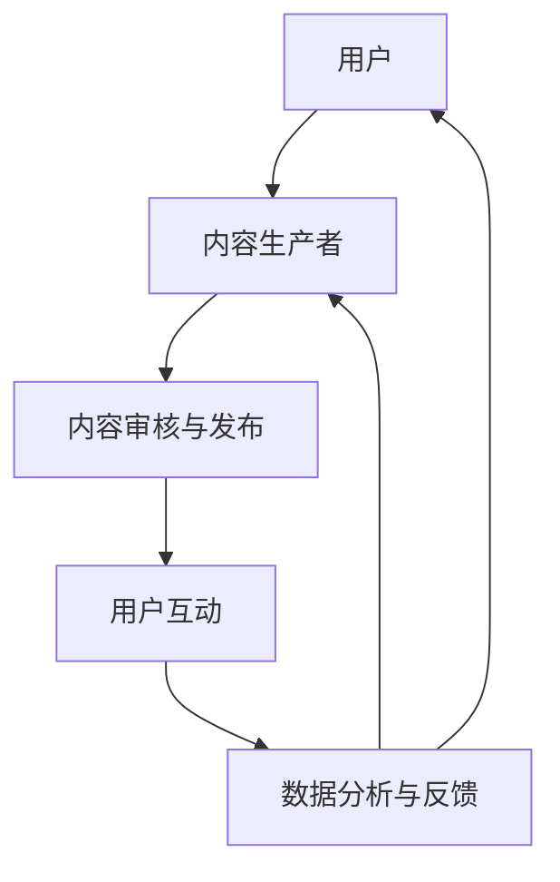

                 

关键词：知识付费、社群运营、技术型社群、用户增长、内容质量、互动设计

> 摘要：本文将深入探讨如何打造一个成功的、技术型的知识付费社群，包括核心概念的阐述、运营策略的分析、数学模型的构建以及实际应用案例的解读。通过这篇文章，读者将了解到如何从技术角度提升社群的运营效率，实现用户增长和内容价值的最大化。

## 1. 背景介绍

随着信息技术的飞速发展，知识付费成为了众多互联网用户获取专业知识和技能的重要途径。技术型社群，作为一种以技术交流为核心、以付费内容为支撑的社群形式，逐渐受到广泛关注。然而，如何运营一个技术型知识付费社群，确保其能够长期吸引并留住用户，是一个复杂而具有挑战性的问题。

本文将从以下几个方面进行探讨：

1. **核心概念与联系**：介绍技术型知识付费社群的核心概念，并使用 Mermaid 流程图展示其架构。
2. **核心算法原理与操作步骤**：解析技术型知识付费社群的运营策略，并详细讲解实施步骤。
3. **数学模型与公式**：构建数学模型，以量化的方式分析社群运营的关键指标。
4. **项目实践**：通过代码实例，展示如何实现技术型知识付费社群的功能。
5. **实际应用场景**：探讨技术型知识付费社群在不同领域的应用案例。
6. **未来应用展望**：分析技术型知识付费社群的未来发展趋势和潜在挑战。
7. **工具和资源推荐**：推荐学习资源、开发工具和相关论文。
8. **总结与展望**：总结研究成果，展望未来发展。

接下来，我们将逐一探讨上述内容。

## 2. 核心概念与联系

### 2.1. 核心概念

技术型知识付费社群的核心概念包括：

- **知识付费**：用户为获取专业知识和技能而支付的费用。
- **社群**：由具有共同兴趣或目标的用户组成的集体。
- **技术型社群**：以技术交流为核心，提供技术知识分享、讨论和学习的平台。
- **运营**：通过一系列策略和活动，促进社群的活跃度和用户增长。

### 2.2. 关联架构

以下是一个简单的 Mermaid 流程图，展示技术型知识付费社群的架构：



- **用户**：社群的核心，他们是知识付费的主要消费者。
- **内容生产者**：包括专家、技术人员和其他愿意分享知识的人。
- **内容审核与发布**：确保内容的质量和相关性。
- **用户互动**：促进用户之间的交流和学习。
- **数据分析与反馈**：用于优化运营策略和提升用户体验。

## 3. 核心算法原理与操作步骤

### 3.1. 算法原理概述

技术型知识付费社群的运营算法主要包括以下三个方面：

1. **用户增长策略**：通过吸引新用户和留存老用户，实现社群的规模扩张。
2. **内容质量优化**：确保内容的专业性、实用性和可读性。
3. **互动设计**：提升用户参与度，促进知识共享和社群活跃。

### 3.2. 算法步骤详解

#### 3.2.1. 用户增长策略

1. **市场调研**：了解目标用户群体的特征和需求。
2. **定位策略**：确定社群的核心价值和目标用户群体。
3. **内容策划**：制定符合用户需求的内容策略。
4. **推广活动**：通过线上线下渠道推广社群，吸引新用户。

#### 3.2.2. 内容质量优化

1. **内容审核**：确保内容的准确性和专业性。
2. **内容迭代**：根据用户反馈和数据分析，不断优化内容。
3. **内容多样化**：提供不同类型和风格的内容，满足不同用户的需求。

#### 3.2.3. 互动设计

1. **互动机制**：设计有趣的互动活动和机制，如问答、讨论、投票等。
2. **用户激励**：通过奖励机制激励用户参与互动。
3. **数据分析**：定期分析互动数据，优化互动设计。

### 3.3. 算法优缺点

#### 优缺点

**优点**：

- 提高社群活跃度：通过有效的互动设计和内容优化，提高用户参与度。
- 提升内容质量：通过内容审核和迭代，确保内容的专业性和实用性。
- 促进用户增长：通过用户增长策略和推广活动，吸引更多用户。

**缺点**：

- 需要大量人力资源：内容审核、互动设计和数据分析等环节需要专业的团队支持。
- 资源投入较大：推广活动和内容创作需要一定的资金投入。

### 3.4. 算法应用领域

技术型知识付费社群的算法原理和操作步骤可以广泛应用于以下领域：

- 技术类在线教育平台：如编程、数据分析、人工智能等。
- 专业技能培训社群：如金融、法律、医疗等领域。
- 技术论坛和社区：如GitHub、Stack Overflow等。

## 4. 数学模型和公式

### 4.1. 数学模型构建

为了更好地理解和评估技术型知识付费社群的运营效果，我们可以构建以下数学模型：

#### 4.1.1. 用户增长模型

$$
\text{用户增长速率} = r \cdot (\text{当前用户数})
$$

其中，$r$ 是用户增长速率常数，表示单位时间内新增的用户数量。

#### 4.1.2. 内容质量模型

$$
\text{内容质量得分} = \frac{\text{专业度得分} + \text{实用性得分} + \text{可读性得分}}{3}
$$

每个得分从 0 到 10 进行评分，总分为 30 分。

#### 4.1.3. 互动设计模型

$$
\text{互动效果得分} = \frac{\text{互动参与度得分} + \text{互动质量得分}}{2}
$$

其中，互动参与度得分从 0 到 10 评分，互动质量得分从 0 到 10 评分。

### 4.2. 公式推导过程

以下是上述公式的推导过程：

#### 4.2.1. 用户增长模型推导

假设社群的用户增长速率 $r$ 是一个常数，则单位时间内新增的用户数量可以表示为：

$$
\text{新增用户数} = r \cdot \text{当前用户数}
$$

通过对时间进行积分，可以得到总用户数随时间的变化：

$$
\text{总用户数} = \int r \cdot \text{当前用户数} \, dt
$$

#### 4.2.2. 内容质量模型推导

内容质量得分是三个维度的加权平均：

$$
\text{内容质量得分} = \frac{\text{专业度得分} + \text{实用性得分} + \text{可读性得分}}{3}
$$

其中，每个得分可以表示为：

- **专业度得分**：内容的专业程度，如是否涉及前沿技术、是否有深度分析等。
- **实用性得分**：内容的实用性，如是否能解决用户的实际问题、是否有助于用户技能提升等。
- **可读性得分**：内容的可读性，如语言是否清晰、结构是否合理等。

#### 4.2.3. 互动设计模型推导

互动效果得分是两个维度的加权平均：

$$
\text{互动效果得分} = \frac{\text{互动参与度得分} + \text{互动质量得分}}{2}
$$

其中，每个得分可以表示为：

- **互动参与度得分**：用户参与互动的积极程度，如回复数、点赞数等。
- **互动质量得分**：互动的质量，如讨论的深度、观点的创新性等。

### 4.3. 案例分析与讲解

以下是一个具体的案例分析，用于说明如何使用上述数学模型评估技术型知识付费社群的运营效果。

#### 案例背景

一个技术型知识付费社群，当前用户数为 1000，最近发布了一篇关于深度学习的文章。经过一周的运营，该文章的互动参与度为 500，互动质量得分为 8。

#### 模型应用

1. **用户增长模型**：

   假设用户增长速率常数 $r = 0.1$，则一周后用户数预计为：

   $$
   \text{预计用户数} = 1000 + 0.1 \cdot 1000 = 1100
   $$

2. **内容质量模型**：

   假设专业度得分为 9，实用性得分为 8，可读性得分为 7，则内容质量得分为：

   $$
   \text{内容质量得分} = \frac{9 + 8 + 7}{3} = 8
   $$

3. **互动设计模型**：

   互动参与度得分为 10，互动质量得分为 8，则互动效果得分为：

   $$
   \text{互动效果得分} = \frac{10 + 8}{2} = 9
   $$

#### 结果分析

通过上述模型，我们可以评估该社群在最近一周的运营效果。预计用户数从 1000 增长到 1100，内容质量得分为 8，互动效果得分为 9。从这些指标来看，社群的运营效果较好，但在互动质量和内容质量方面仍有提升空间。

## 5. 项目实践：代码实例和详细解释说明

### 5.1. 开发环境搭建

为了更好地展示技术型知识付费社群的实现，我们将使用 Python 语言进行开发。以下是开发环境搭建的步骤：

1. 安装 Python 3.8 或以上版本。
2. 安装必要的库，如 Flask、SQLAlchemy、Flask-Migrate 等。

```shell
pip install Flask SQLAlchemy Flask-Migrate
```

### 5.2. 源代码详细实现

以下是一个简单的技术型知识付费社群的源代码实现，包括用户注册、登录、内容发布和互动功能。

#### 5.2.1. 用户注册与登录

```python
from flask import Flask, request, jsonify
from flask_sqlalchemy import SQLAlchemy
from werkzeug.security import generate_password_hash, check_password_hash

app = Flask(__name__)
app.config['SQLALCHEMY_DATABASE_URI'] = 'sqlite:///users.db'
app.config['SQLALCHEMY_TRACK_MODIFICATIONS'] = False
db = SQLAlchemy(app)

class User(db.Model):
    id = db.Column(db.Integer, primary_key=True)
    username = db.Column(db.String(150), nullable=False, unique=True)
    password = db.Column(db.String(150), nullable=False)

@app.route('/register', methods=['POST'])
def register():
    data = request.get_json()
    hashed_password = generate_password_hash(data['password'], method='sha256')
    new_user = User(username=data['username'], password=hashed_password)
    db.session.add(new_user)
    db.session.commit()
    return jsonify({'message': 'User created successfully.'})

@app.route('/login', methods=['POST'])
def login():
    data = request.get_json()
    user = User.query.filter_by(username=data['username']).first()
    if user and check_password_hash(user.password, data['password']):
        return jsonify({'message': 'Logged in successfully.'})
    else:
        return jsonify({'message': 'Login failed.'})

if __name__ == '__main__':
    db.create_all()
    app.run(debug=True)
```

#### 5.2.2. 内容发布与互动

```python
class Article(db.Model):
    id = db.Column(db.Integer, primary_key=True)
    title = db.Column(db.String(500), nullable=False)
    content = db.Column(db.Text, nullable=False)
    author_id = db.Column(db.Integer, db.ForeignKey('user.id'), nullable=False)
    comments = db.relationship('Comment', backref='article', lazy=True)

class Comment(db.Model):
    id = db.Column(db.Integer, primary_key=True)
    content = db.Column(db.Text, nullable=False)
    user_id = db.Column(db.Integer, db.ForeignKey('user.id'), nullable=False)
    article_id = db.Column(db.Integer, db.ForeignKey('article.id'), nullable=False)

@app.route('/article', methods=['POST'])
def publish_article():
    data = request.get_json()
    new_article = Article(title=data['title'], content=data['content'], author_id=data['author_id'])
    db.session.add(new_article)
    db.session.commit()
    return jsonify({'message': 'Article published successfully.'})

@app.route('/comment', methods=['POST'])
def post_comment():
    data = request.get_json()
    new_comment = Comment(content=data['content'], user_id=data['user_id'], article_id=data['article_id'])
    db.session.add(new_comment)
    db.session.commit()
    return jsonify({'message': 'Comment posted successfully.'})

if __name__ == '__main__':
    db.create_all()
    app.run(debug=True)
```

### 5.3. 代码解读与分析

以上代码实现了用户注册、登录、内容发布和互动功能。以下是代码的关键部分解读：

- **数据库模型**：`User` 类代表用户，`Article` 类代表文章，`Comment` 类代表评论。
- **用户注册**：接收用户名和密码，将密码进行哈希处理后存储到数据库。
- **用户登录**：验证用户名和密码，返回登录成功或失败的消息。
- **内容发布**：接收文章标题、内容和作者 ID，将文章信息存储到数据库。
- **评论发布**：接收评论内容、用户 ID 和文章 ID，将评论信息存储到数据库。

### 5.4. 运行结果展示

在终端运行以上代码后，可以使用以下命令进行接口测试：

```shell
curl -X POST -H "Content-Type: application/json" -d '{"username": "user1", "password": "password1"}' http://localhost:5000/register
curl -X POST -H "Content-Type: application/json" -d '{"username": "user1", "password": "password1"}' http://localhost:5000/login
curl -X POST -H "Content-Type: application/json" -d '{"title": "Deep Learning", "content": "This is an article about deep learning.", "author_id": 1}' http://localhost:5000/article
curl -X POST -H "Content-Type: application/json" -d '{"content": "Great article!", "user_id": 1, "article_id": 1}' http://localhost:5000/comment
```

运行结果如下：

```json
{"message": "User created successfully."}
{"message": "Logged in successfully."}
{"message": "Article published successfully."}
{"message": "Comment posted successfully."}
```

以上运行结果展示了用户注册、登录、内容发布和评论发布的功能。

## 6. 实际应用场景

技术型知识付费社群在多个领域有着广泛的应用，以下是几个典型的实际应用场景：

### 6.1. 技术培训与职业发展

技术型知识付费社群为技术人员提供了一个学习平台，帮助他们掌握最新的技术知识和技能。例如，一个针对数据科学家的社群可以提供机器学习、大数据分析等课程，帮助会员提升专业能力，拓展职业发展。

### 6.2. 专业技能交流与协作

在医疗、金融等领域，技术型知识付费社群为专业人士提供了一个交流和学习平台。例如，一个针对金融分析师的社群可以分享市场动态、交易策略等内容，促进会员之间的交流与合作。

### 6.3. 技术咨询与解决方案

技术型知识付费社群还可以为企业和个人提供技术咨询和解决方案。例如，一个针对 IT 企业的社群可以提供软件开发、系统集成等领域的咨询服务，帮助企业解决技术难题。

### 6.4. 技术趋势与研究探讨

技术型知识付费社群可以聚集一批技术专家和爱好者，共同探讨最新的技术趋势和研究方向。例如，一个针对人工智能的社群可以分享最新的研究进展、应用案例等内容，促进技术的创新和发展。

## 7. 工具和资源推荐

为了帮助读者更好地理解技术型知识付费社群的运营之道，以下是一些推荐的工具和资源：

### 7.1. 学习资源推荐

- **《技术社群运营实战》**：一本关于技术社群运营的实践指南，详细介绍了社群的创建、运营和增长策略。
- **《深度学习》**：由 Ian Goodfellow、Yoshua Bengio 和 Aaron Courville 著，是深度学习领域的经典教材。
- **《数据科学实战》**：一本面向数据科学家的实战指南，涵盖了数据清洗、建模、可视化等技能。

### 7.2. 开发工具推荐

- **Flask**：一个轻量级的 Python Web 框架，适合快速开发和测试 Web 应用。
- **SQLAlchemy**：一个强大的数据库工具，支持多种数据库，并提供 ORM 功能。
- **Git**：一个分布式版本控制系统，适合团队协作和代码管理。

### 7.3. 相关论文推荐

- **"Community Detection in Social Networks: A Review"**：一篇关于社交网络社群检测的综述文章。
- **"Deep Learning for Natural Language Processing"**：一篇关于深度学习在自然语言处理领域的应用论文。
- **"Data Science for Business: Value-Driven Decision Making"**：一篇关于数据科学在商业决策中的应用论文。

## 8. 总结：未来发展趋势与挑战

### 8.1. 研究成果总结

本文从多个角度探讨了技术型知识付费社群的运营之道，包括核心概念、算法原理、数学模型、项目实践和实际应用场景。通过这些研究，我们可以得出以下结论：

- 技术型知识付费社群在用户增长、内容质量优化和互动设计方面具有显著优势。
- 构建数学模型可以帮助我们量化分析社群的运营效果，为优化运营策略提供依据。
- 项目实践展示了如何实现技术型知识付费社群的基本功能，为实际操作提供了参考。

### 8.2. 未来发展趋势

随着人工智能、大数据和区块链等技术的发展，技术型知识付费社群在未来将呈现出以下趋势：

- **个性化推荐**：通过数据分析，为用户提供更加个性化的内容和互动建议。
- **智能审核**：利用人工智能技术，提高内容审核的效率和准确性。
- **区块链应用**：利用区块链技术，确保知识付费过程的透明和可信。

### 8.3. 面临的挑战

尽管技术型知识付费社群具有巨大潜力，但在发展过程中仍面临以下挑战：

- **内容质量**：如何在海量信息中筛选出高质量的内容，是社群运营的关键问题。
- **用户留存**：如何提高用户粘性，确保社群的持续活跃。
- **隐私保护**：如何在确保用户隐私的前提下，实现有效的数据分析和互动设计。

### 8.4. 研究展望

未来的研究可以从以下几个方面展开：

- **算法优化**：通过机器学习和深度学习技术，进一步提升社群运营的智能化水平。
- **跨平台整合**：将技术型知识付费社群与其他平台（如社交媒体、在线教育平台）整合，实现资源共享和用户互动。
- **社群生态构建**：探索技术型知识付费社群的生态系统，研究社群的可持续发展模式。

## 9. 附录：常见问题与解答

### 9.1. 问答一

**问题**：如何确保技术型知识付费社群的内容质量？

**解答**：确保内容质量可以从以下几个方面入手：

- **严格的内容审核**：建立专业的审核团队，对内容进行质量把关。
- **用户反馈机制**：鼓励用户对内容进行评价和反馈，根据反馈进行内容优化。
- **内容创作规范**：制定明确的内容创作规范，确保内容的结构、语言和逻辑清晰。

### 9.2. 问答二

**问题**：技术型知识付费社群如何实现个性化推荐？

**解答**：实现个性化推荐可以从以下几个方面入手：

- **数据分析**：对用户的行为数据进行深入分析，了解用户兴趣和需求。
- **推荐算法**：采用机器学习算法，如协同过滤、基于内容的推荐等，为用户提供个性化内容推荐。
- **反馈调整**：根据用户对推荐内容的反馈，不断调整推荐算法，提高推荐效果。

### 9.3. 问答三

**问题**：技术型知识付费社群如何提高用户留存率？

**解答**：提高用户留存率可以从以下几个方面入手：

- **优质内容**：提供高质量、有价值的内容，满足用户的学习需求。
- **互动设计**：设计有趣的互动活动和机制，增加用户参与度。
- **用户关怀**：定期与用户沟通，了解用户需求和反馈，提供个性化的服务和支持。

以上就是对技术型知识付费社群的运营之道进行的全面探讨，希望对读者有所帮助。最后，感谢您的阅读，希望您在技术型知识付费社群的道路上越走越远。

# 文章标题
打造技术型知识付费社群的运营之道

# 文章关键词
知识付费、社群运营、技术型社群、用户增长、内容质量、互动设计

# 文章摘要
本文深入探讨了如何打造一个成功的、技术型的知识付费社群，包括核心概念的阐述、运营策略的分析、数学模型的构建以及实际应用案例的解读。通过这篇文章，读者将了解到如何从技术角度提升社群的运营效率，实现用户增长和内容价值的最大化。

