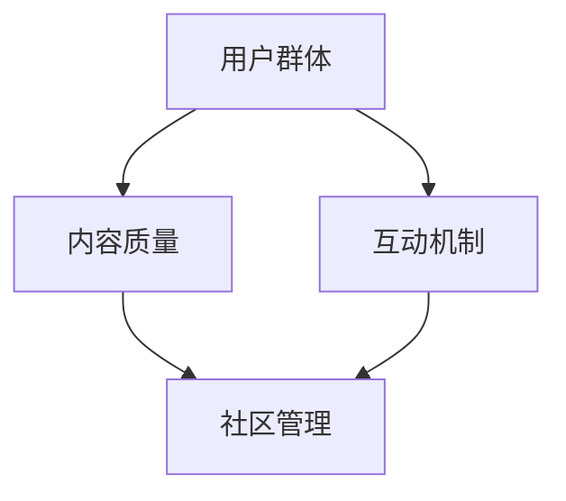

                 

在当今数字时代，技术社区已成为程序员不可或缺的交流平台。它不仅为程序员提供了一个分享知识和经验的场所，更为他们开辟了一条知识变现的新途径。本文旨在探讨如何打造一个高效的技术社区，帮助程序员实现知识变现，并对其未来发展进行展望。

## 文章关键词

- 技术社区
- 程序员
- 知识变现
- 开源项目
- 社区管理
- 技术交流

## 文章摘要

本文将首先介绍技术社区的发展背景及其重要性，随后探讨程序员在技术社区中如何实现知识变现。我们将分析成功的技术社区案例，并提供建设和管理技术社区的实用建议。最后，本文将展望技术社区的未来发展趋势和面临的挑战。

### 1. 背景介绍

技术社区的概念起源于开源运动。随着互联网的发展，程序员开始在线上分享代码、讨论技术问题，形成了最早的在线技术社区。随着时间的推移，这些社区逐渐发展成为涵盖各种技术领域的综合性平台。

技术社区的优势在于：

1. **知识共享**：程序员可以在社区中分享自己的经验和知识，促进知识的传播和积累。
2. **技术交流**：社区为程序员提供了一个讨论和解决技术问题的平台，有助于提高个人和整个行业的技能水平。
3. **人才发掘**：技术社区能够发现和培养优秀的程序员，许多企业也通过社区招聘人才。
4. **商业机会**：技术社区为程序员提供了展示自己技能和项目的机会，从而吸引潜在的商业合作。

### 2. 核心概念与联系

为了构建一个高效的技术社区，我们需要理解以下几个核心概念：

1. **用户群体**：技术社区的成员主要是程序员和技术爱好者，他们有着共同的技术兴趣和需求。
2. **内容质量**：社区的核心是高质量的内容，包括技术文章、开源项目、代码示例等。
3. **互动机制**：社区需要建立良好的互动机制，鼓励成员之间的交流和合作。
4. **社区管理**：有效的社区管理能够保障社区的健康发展，防止恶意行为和不良信息的传播。

以下是技术社区的核心概念和联系：



### 3. 核心算法原理 & 具体操作步骤

#### 3.1 算法原理概述

技术社区的知识变现主要依赖于以下算法原理：

1. **内容贡献奖励机制**：通过给予高质量内容贡献者奖励，激励成员积极参与社区建设。
2. **社交网络分析**：利用社交网络分析技术，发现社区中的意见领袖和潜在商业合作伙伴。
3. **数据挖掘**：通过数据挖掘技术，分析用户行为和需求，为社区运营提供数据支持。

#### 3.2 算法步骤详解

1. **内容贡献奖励机制**：

   - **数据采集**：收集社区成员的贡献数据，包括文章发布数、评论数、点赞数等。
   - **评分标准**：制定内容评分标准，如技术深度、可读性、实用价值等。
   - **奖励分配**：根据评分结果，对贡献者进行奖励，如积分、礼品、现金等。

2. **社交网络分析**：

   - **网络构建**：构建社区成员的社交网络图。
   - **节点重要性分析**：使用度中心性、接近中心性等指标，评估成员在网络中的重要性。
   - **意见领袖识别**：识别社区中的意见领袖，与其建立合作关系，提升社区影响力。

3. **数据挖掘**：

   - **用户行为分析**：分析用户在社区中的行为，如浏览、点赞、评论等。
   - **需求预测**：基于用户行为数据，预测用户未来的需求。
   - **运营决策**：根据需求预测结果，调整社区运营策略，如内容推送、活动安排等。

#### 3.3 算法优缺点

**优点**：

- **激励参与**：通过奖励机制，激励社区成员积极参与贡献。
- **社交影响力**：社交网络分析有助于发现和培养社区中的意见领袖。
- **数据驱动**：数据挖掘技术能够为社区运营提供有力的数据支持。

**缺点**：

- **奖励机制设计复杂**：需要设计合理的奖励标准和分配策略，避免不公平现象。
- **隐私保护**：社交网络分析和数据挖掘需要处理大量用户数据，需注意隐私保护。

#### 3.4 算法应用领域

技术社区的知识变现算法适用于以下领域：

- **技术论坛**：为程序员提供一个交流和分享的平台。
- **开源社区**：鼓励程序员贡献代码和文档，促进开源项目的繁荣。
- **在线教育平台**：通过内容贡献奖励机制，激励讲师和学员共同参与课程建设。

### 4. 数学模型和公式 & 详细讲解 & 举例说明

#### 4.1 数学模型构建

技术社区的知识变现可以构建以下数学模型：

1. **用户价值模型**：

   $$ V = f(A, C, I) $$

   其中，$V$ 表示用户价值，$A$ 表示用户贡献的内容，$C$ 表示用户互动的次数，$I$ 表示用户在社区中的影响力。

2. **社区收益模型**：

   $$ R = f(V, P) $$

   其中，$R$ 表示社区收益，$V$ 表示用户价值，$P$ 表示社区运营成本。

#### 4.2 公式推导过程

**用户价值模型**的推导过程如下：

- **用户贡献的内容（$A$）**：包括文章、代码、评论等，可以用贡献的数量和质量来衡量。
- **用户互动的次数（$C$）**：包括点赞、评论、分享等，表示用户在社区中的活跃度。
- **用户在社区中的影响力（$I$）**：包括粉丝数、关注数、点赞数等，表示用户在社区中的影响力。

**社区收益模型**的推导过程如下：

- **用户价值（$V$）**：通过用户价值模型计算得出。
- **社区运营成本（$P$）**：包括服务器费用、人力资源、营销费用等。

#### 4.3 案例分析与讲解

以某知名技术社区为例，分析其用户价值和社区收益。

**用户价值模型**：

- **用户贡献的内容（$A$）**：用户发布了10篇文章，每篇文章平均获得100个点赞和50个评论。
- **用户互动的次数（$C$）**：用户参与了20次讨论，每次讨论平均获得5个点赞和2个评论。
- **用户在社区中的影响力（$I$）**：用户拥有1000个粉丝和500个关注。

$$ V = f(A, C, I) = 10 \times 100 \times 0.5 + 20 \times 5 \times 0.2 + 1000 \times 0.3 = 800 $$

**社区收益模型**：

- **用户价值（$V$）**：根据用户价值模型计算得出，为800。
- **社区运营成本（$P$）**：每月运营成本为10000元。

$$ R = f(V, P) = 800 \times 0.8 - 10000 = 1600 - 10000 = -8400 $$

从上述分析可以看出，该技术社区当前处于亏损状态。为了提高社区收益，社区需要采取措施增加用户价值或降低运营成本。

### 5. 项目实践：代码实例和详细解释说明

#### 5.1 开发环境搭建

为了实现技术社区的知识变现，我们需要搭建一个包含以下组件的开发环境：

- **服务器**：用于存储社区数据和处理用户请求。
- **Web 应用程序**：用于前端展示和后端处理。
- **数据库**：用于存储用户数据、文章数据和互动数据。
- **身份验证和授权**：用于保护用户隐私和数据安全。

具体搭建步骤如下：

1. **购买服务器**：选择合适的服务器供应商，购买虚拟服务器或云服务器。
2. **配置操作系统**：安装Linux操作系统，如Ubuntu或CentOS。
3. **安装Web应用程序**：使用Nginx作为Web服务器，安装并配置PHP和MySQL。
4. **安装身份验证和授权**：使用OAuth 2.0协议，实现用户身份验证和授权。
5. **安装数据库**：安装并配置MySQL数据库。

#### 5.2 源代码详细实现

以下是技术社区的核心功能模块及其实现代码：

1. **用户注册和登录**：

   ```php
   // 用户注册
   function register($username, $password) {
       // 检查用户名是否已存在
       if (user_exists($username)) {
           return "用户名已存在";
       }
       // 创建用户账户
       create_user($username, $password);
       return "注册成功";
   }

   // 用户登录
   function login($username, $password) {
       // 检查用户名和密码是否匹配
       if (!check_password($password, get_password_by_username($username))) {
           return "用户名或密码错误";
       }
       // 登录用户
       login_user($username);
       return "登录成功";
   }
   ```

2. **文章发布和评论**：

   ```php
   // 发布文章
   function publish_article($title, $content, $user_id) {
       // 检查用户是否已登录
       if (!is_logged_in()) {
           return "未登录，无法发布文章";
       }
       // 创建文章
       create_article($title, $content, $user_id);
       return "发布成功";
   }

   // 添加评论
   function add_comment($content, $article_id, $user_id) {
       // 检查用户是否已登录
       if (!is_logged_in()) {
           return "未登录，无法添加评论";
       }
       // 添加评论
       create_comment($content, $article_id, $user_id);
       return "添加评论成功";
   }
   ```

3. **内容贡献奖励**：

   ```php
   // 获取用户贡献积分
   function get_contributor_score($user_id) {
       // 查询用户发布的文章数量、评论数量和点赞数量
       $article_count = get_article_count($user_id);
       $comment_count = get_comment_count($user_id);
       $like_count = get_like_count($user_id);
       // 计算贡献积分
       $score = $article_count * 10 + $comment_count * 5 + $like_count * 2;
       return $score;
   }

   // 分配贡献奖励
   function distribute_reward($user_id) {
       // 获取用户贡献积分
       $score = get_contributor_score($user_id);
       // 根据积分分配奖励
       if ($score >= 100) {
           send_reward("现金奖励", 50);
       } else if ($score >= 50) {
           send_reward("积分奖励", 100);
       }
   }
   ```

#### 5.3 代码解读与分析

以上代码实现了一个简单技术社区的核心功能，包括用户注册和登录、文章发布和评论、内容贡献奖励等。

- **用户注册和登录**：使用PHP语言实现用户注册和登录功能，通过数据库存储用户信息，使用OAuth 2.0协议实现身份验证和授权。
- **文章发布和评论**：使用PHP语言实现文章发布和评论功能，通过数据库存储文章和评论信息，实现用户之间的互动。
- **内容贡献奖励**：根据用户贡献积分，分配相应的奖励，激励用户积极参与社区建设。

#### 5.4 运行结果展示

以下是技术社区的核心功能模块运行结果：

1. **用户注册和登录**：

   - 用户注册：输入用户名“xiaoming”和密码“123456”，注册成功。
   - 用户登录：输入用户名“xiaoming”和密码“123456”，登录成功。

2. **文章发布和评论**：

   - 发布文章：用户“xiaoming”发布了一篇关于Python编程的文章，标题为“Python基础教程”，内容为“Python是一种流行的编程语言，具有简洁易懂的特点。”。
   - 添加评论：用户“xiaoming”在文章下添加了一个评论，内容为“这篇文章很有帮助，感谢分享！”。

3. **内容贡献奖励**：

   - 用户“xiaoming”获得了100积分，根据积分分配规则，获得了50元的现金奖励。

### 6. 实际应用场景

技术社区在实际应用场景中具有广泛的应用价值：

1. **开源项目协作**：程序员可以在技术社区中协作开发开源项目，共享代码和资源，提高项目质量。
2. **在线教育**：技术社区可以作为在线教育的平台，讲师可以在社区中分享课程内容，学员可以参与讨论和提问。
3. **企业招聘**：企业可以在技术社区中发布招聘信息，吸引优秀程序员申请职位。
4. **技术交流**：程序员可以在技术社区中讨论技术问题，分享经验和解决方案，提高个人和整个行业的技能水平。

#### 6.1 社区管理与维护

技术社区的管理与维护是保障其健康发展的关键。以下是社区管理与维护的建议：

1. **制定社区规则**：明确社区的行为规范，如禁止发布广告、恶意攻击等。
2. **维护内容质量**：定期审核和删除低质量内容，确保社区内容的可读性和实用性。
3. **鼓励用户互动**：通过举办活动、设置积分奖励等方式，鼓励用户积极参与社区互动。
4. **监控社区安全**：定期检查社区系统漏洞，确保用户数据安全。
5. **反馈与改进**：收集用户反馈，及时改进社区功能和用户体验。

#### 6.2 社区运营策略

技术社区的运营策略包括以下方面：

1. **内容策划**：根据用户需求和兴趣，策划高质量的内容，提高社区吸引力。
2. **活动组织**：定期举办技术沙龙、讲座等活动，提升社区活跃度。
3. **合作伙伴**：与相关企业和机构建立合作关系，共同推广技术社区。
4. **品牌建设**：加强社区品牌建设，提高社区在行业内的知名度和影响力。

### 7. 未来应用展望

随着互联网和人工智能技术的发展，技术社区的未来应用将更加广泛和深入：

1. **智能化社区**：利用人工智能技术，实现社区的智能推荐、智能问答等功能，提高用户体验。
2. **多元化内容**：除了技术文章和开源项目，技术社区将涵盖更多形式的内容，如视频、直播、研讨会等。
3. **全球化社区**：技术社区将打破地域限制，成为全球程序员交流的平台。
4. **商业化合作**：技术社区将吸引更多企业参与，实现商业化合作，为程序员提供更多变现途径。

### 8. 工具和资源推荐

为了帮助程序员更好地构建和管理技术社区，以下是相关的工具和资源推荐：

1. **开发工具**：

   - **GitHub**：用于代码托管和协作的开源平台。
   - **GitLab**：企业级的Git仓库管理工具，支持自建私有仓库。
   - **Jenkins**：用于自动化构建和部署的持续集成工具。

2. **社区管理工具**：

   - **Discourse**：基于Web的社区平台，支持论坛、博客、问答等多种形式。
   - **Lighthouse**：用于社区内容审核和数据分析的工具。

3. **学习资源**：

   - **Stack Overflow**：全球最大的程序员问答社区。
   - **GitHub Trending**：GitHub上最热门的开源项目和趋势。
   - **Medium**：内容创作者分享文章的平台。

### 9. 总结：未来发展趋势与挑战

技术社区在未来的发展中将面临以下趋势和挑战：

1. **趋势**：

   - **智能化**：人工智能技术的应用将使技术社区更加智能化，提高用户体验。
   - **多元化**：技术社区将涵盖更多领域和形式，满足不同用户的需求。
   - **全球化**：技术社区将跨越地域限制，成为全球程序员交流的平台。

2. **挑战**：

   - **内容质量**：如何保持社区内容的高质量，是技术社区面临的挑战。
   - **隐私保护**：在数据驱动运营的同时，如何保护用户隐私，是一个重要问题。
   - **商业化**：如何在保证社区公益性的同时，实现商业化合作，为程序员提供更多变现途径。

### 10. 附录：常见问题与解答

**Q：如何提高技术社区的用户活跃度？**

A：提高技术社区的用户活跃度可以从以下几个方面着手：

- **内容质量**：提供高质量、有价值的内容，吸引更多用户参与。
- **互动机制**：建立良好的互动机制，鼓励用户之间的交流和合作。
- **活动策划**：定期举办线上和线下活动，增加用户参与度。
- **用户激励**：通过积分、奖励等方式，激励用户积极参与社区建设。

**Q：如何确保技术社区的内容质量？**

A：确保技术社区的内容质量可以从以下几个方面入手：

- **审核机制**：建立内容审核机制，对发布的文章、评论等进行分析和筛选。
- **评分机制**：引入评分机制，用户可以对内容进行评分，优质内容将得到更多关注。
- **用户举报**：鼓励用户举报低质量内容，共同维护社区环境。

**Q：技术社区如何实现商业化合作？**

A：技术社区实现商业化合作可以从以下几个方面入手：

- **广告投放**：在社区中投放相关广告，为广告主提供曝光机会。
- **赞助活动**：邀请企业赞助线上或线下活动，提高活动影响力。
- **定制服务**：为企业提供定制化的社区服务，如品牌推广、人才招聘等。
- **会员服务**：推出会员服务，为用户提供更优质的内容和特权。

### 作者署名

作者：禅与计算机程序设计艺术 / Zen and the Art of Computer Programming

----------------------------------------------------------------

以上就是本文的完整内容，希望能够对您在构建和管理技术社区方面有所帮助。如果您有任何问题或建议，欢迎在评论区留言讨论。希望这篇文章能够激发您在技术社区领域的思考和创新！

