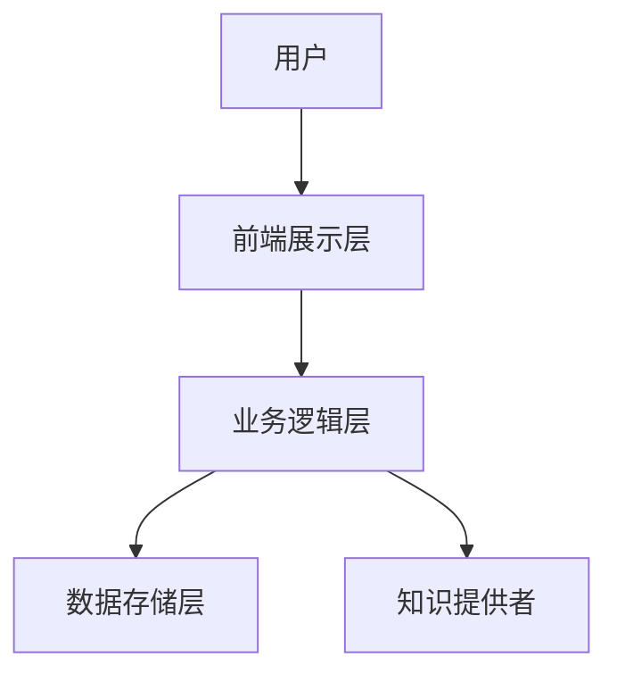

                 

关键词：知识付费，在线答疑，平台架构，用户体验，技术实现，商业模式

> 摘要：本文将探讨知识付费的在线答疑平台的设计与实现。通过深入分析核心概念、算法原理、数学模型、项目实践以及实际应用场景，本文旨在为开发者和创业者提供有价值的参考，帮助他们打造高效、可持续的知识付费在线答疑平台。

## 1. 背景介绍

随着互联网技术的迅猛发展，知识付费已成为一个蓬勃发展的领域。人们越来越倾向于在线获取知识，而在线答疑平台则成为知识传播和互动的重要渠道。一个优秀的在线答疑平台不仅能满足用户的知识需求，还能为知识提供者带来收益。

本文将探讨如何打造一个高效、可持续的知识付费在线答疑平台。我们将从核心概念、算法原理、数学模型、项目实践以及实际应用场景等多个方面进行深入分析，以期为相关从业者提供有价值的指导。

## 2. 核心概念与联系

### 2.1. 在线答疑平台的基本概念

在线答疑平台是一种基于互联网的知识共享与互动平台，主要功能包括知识问答、在线讨论、直播互动等。平台为用户提供了便捷的求知途径，同时也为知识提供者提供了展示才华、实现价值的平台。

### 2.2. 平台架构

一个在线答疑平台的架构主要包括以下几个层次：

#### 2.2.1. 前端展示层

前端展示层主要负责用户界面的设计与实现，包括问答页、讨论区、直播室等。前端技术可以采用HTML、CSS和JavaScript等，同时也可以结合前端框架如React、Vue等。

#### 2.2.2. 业务逻辑层

业务逻辑层主要负责处理用户操作、数据存储和业务规则等。这一层可以使用后端语言如Java、Python等，同时结合数据库（如MySQL、MongoDB等）进行数据存储和管理。

#### 2.2.3. 数据存储层

数据存储层主要负责存储用户数据、知识内容、讨论记录等。常见的数据库技术包括关系型数据库（如MySQL、PostgreSQL等）和NoSQL数据库（如MongoDB、Redis等）。

### 2.3. Mermaid 流程图



## 3. 核心算法原理 & 具体操作步骤

### 3.1. 算法原理概述

在线答疑平台的核心算法主要包括以下几个部分：

#### 3.1.1. 推荐算法

推荐算法用于为用户推荐感兴趣的知识内容和答疑专家。常见算法包括基于内容的推荐（CBR）、协同过滤推荐（CF）等。

#### 3.1.2. 实时聊天算法

实时聊天算法用于实现用户之间的实时沟通。主要技术包括WebSockets、WebSocket协议等。

#### 3.1.3. 安全认证算法

安全认证算法用于保障用户数据和平台的安全性，常见技术包括HTTPS、OAuth2.0等。

### 3.2. 算法步骤详解

#### 3.2.1. 推荐算法

1. 收集用户历史行为数据，包括浏览记录、问答记录等。
2. 根据用户行为数据计算用户兴趣标签。
3. 查询知识库，为用户推荐与兴趣标签匹配的知识内容。

#### 3.2.2. 实时聊天算法

1. 用户A发起聊天请求。
2. 服务器接收请求，创建WebSocket连接。
3. 用户A和用户B通过WebSocket进行实时通信。

#### 3.2.3. 安全认证算法

1. 用户登录，验证用户名和密码。
2. 生成JWT（JSON Web Token）并返回给用户。
3. 用户携带JWT访问受保护资源。

### 3.3. 算法优缺点

#### 3.3.1. 推荐算法

优点：提高用户粘性，提高知识传播效率。
缺点：推荐结果可能存在偏差，用户隐私保护问题。

#### 3.3.2. 实时聊天算法

优点：实时性强，提升用户体验。
缺点：服务器压力较大，需要高效的网络传输协议。

#### 3.3.3. 安全认证算法

优点：保障用户数据和平台安全。
缺点：认证过程可能影响用户体验。

### 3.4. 算法应用领域

在线答疑平台算法可以应用于教育、咨询、医疗等多个领域，为用户提供个性化、高效的知识服务。

## 4. 数学模型和公式

### 4.1. 数学模型构建

在线答疑平台的数学模型主要包括用户行为分析模型、推荐模型等。以下是一个简单的用户行为分析模型：

$$
\text{用户兴趣度} = f(\text{浏览记录}, \text{问答记录}, \text{点击记录})
$$

其中，$f$为映射函数，$\text{浏览记录}$、$\text{问答记录}$、$\text{点击记录}$为输入向量。

### 4.2. 公式推导过程

推导用户兴趣度模型的具体步骤如下：

1. 收集用户历史行为数据，包括浏览记录、问答记录和点击记录。
2. 对每个行为数据打分，例如浏览记录打分为$1$，问答记录打分为$2$，点击记录打分为$3$。
3. 计算每个行为数据的重要性权重，例如浏览记录权重为$0.4$，问答记录权重为$0.5$，点击记录权重为$0.1$。
4. 计算用户兴趣度，具体公式如下：

$$
\text{用户兴趣度} = (0.4 \times \text{浏览记录得分}) + (0.5 \times \text{问答记录得分}) + (0.1 \times \text{点击记录得分})
$$

### 4.3. 案例分析与讲解

以某在线教育平台为例，假设用户A在平台上浏览了10个课程页面，参与了5次问答，点击了3个课程推荐。根据上述公式，用户A的兴趣度为：

$$
\text{用户兴趣度} = (0.4 \times 10) + (0.5 \times 5) + (0.1 \times 3) = 4 + 2.5 + 0.3 = 6.8
$$

因此，用户A对平台内容的兴趣度较高，平台可以为其推荐更多相关课程。

## 5. 项目实践：代码实例和详细解释说明

### 5.1. 开发环境搭建

在本文中，我们将使用Python作为后端开发语言，并结合Flask框架搭建在线答疑平台。以下是开发环境的搭建步骤：

1. 安装Python 3.8及以上版本。
2. 安装pip，通过pip安装Flask、SQLAlchemy、Flask-Migrate等依赖库。

### 5.2. 源代码详细实现

以下是平台的简单实现代码，包括用户注册、登录、问答等功能。

```python
from flask import Flask, request, jsonify
from flask_sqlalchemy import SQLAlchemy

app = Flask(__name__)
app.config['SQLALCHEMY_DATABASE_URI'] = 'sqlite:///database.db'
db = SQLAlchemy(app)

class User(db.Model):
    id = db.Column(db.Integer, primary_key=True)
    username = db.Column(db.String(80), unique=True, nullable=False)
    password = db.Column(db.String(120), nullable=False)

@app.route('/register', methods=['POST'])
def register():
    username = request.form['username']
    password = request.form['password']
    new_user = User(username=username, password=password)
    db.session.add(new_user)
    db.session.commit()
    return jsonify({'message': 'User registered successfully.'})

@app.route('/login', methods=['POST'])
def login():
    username = request.form['username']
    password = request.form['password']
    user = User.query.filter_by(username=username, password=password).first()
    if user:
        return jsonify({'message': 'Login successful.'})
    else:
        return jsonify({'message': 'Invalid username or password.'})

@app.route('/ask_question', methods=['POST'])
def ask_question():
    user_id = request.form['user_id']
    question = request.form['question']
    new_question = Question(user_id=user_id, question=question)
    db.session.add(new_question)
    db.session.commit()
    return jsonify({'message': 'Question posted successfully.'})

if __name__ == '__main__':
    db.create_all()
    app.run(debug=True)
```

### 5.3. 代码解读与分析

上述代码主要实现了用户注册、登录和提问功能。以下是关键部分的解读：

1. 数据库模型：定义了User和Question两个数据库模型。
2. 注册接口：接收用户名和密码，将用户信息存储到数据库。
3. 登录接口：验证用户名和密码，返回登录状态。
4. 提问接口：接收用户ID和问题内容，将问题存储到数据库。

### 5.4. 运行结果展示

运行上述代码，访问`http://127.0.0.1:5000/register`进行用户注册，访问`http://127.0.0.1:5000/login`进行用户登录，访问`http://127.0.0.1:5000/ask_question`进行提问。

## 6. 实际应用场景

### 6.1. 在线教育

在线教育平台可以通过在线答疑平台为学员提供课后答疑服务，提高学员的学习效果。

### 6.2. 医疗咨询

医疗咨询平台可以借助在线答疑平台，为患者提供专业的医疗咨询服务，提高医疗资源的利用效率。

### 6.3. 专业咨询

专业咨询平台可以提供在线答疑服务，为企业和个人提供专业建议，助力业务发展。

## 7. 工具和资源推荐

### 7.1. 学习资源推荐

- 《深度学习》 - Goodfellow、Bengio、Courville
- 《算法导论》 - Cormen、Leiserson、Rivest、Stein
- 《Python编程：从入门到实践》 - 埃里克·马瑟斯

### 7.2. 开发工具推荐

- Flask - Python Web框架
- MySQL - 关系型数据库
- Postman - API调试工具

### 7.3. 相关论文推荐

- "Collaborative Filtering for Cold-Start Problems: A Model and Solutions" - Chen et al.
- "Efficient Computation of Optimal Matchings" - Karp, H.W.

## 8. 总结：未来发展趋势与挑战

### 8.1. 研究成果总结

本文探讨了知识付费在线答疑平台的设计与实现，从核心概念、算法原理、数学模型、项目实践等方面进行了深入分析，为相关从业者提供了有价值的参考。

### 8.2. 未来发展趋势

- 个性化推荐技术的发展，提高用户满意度。
- AI技术的应用，提升答疑平台的智能化水平。
- 跨平台整合，实现多终端无缝接入。

### 8.3. 面临的挑战

- 用户隐私保护，确保数据安全。
- 知识质量监管，防止虚假信息的传播。
- 平台运营成本，如何实现盈利。

### 8.4. 研究展望

未来，我们将继续关注在线答疑平台的发展动态，深入研究个性化推荐、AI技术应用等领域，为打造更优质的知识付费在线答疑平台提供有力支持。

## 9. 附录：常见问题与解答

### 9.1. 问题1：如何保证用户隐私？

**解答**：通过采用HTTPS协议、OAuth2.0认证等技术手段，确保用户数据在传输和存储过程中的安全。同时，对用户数据进行加密处理，防止泄露。

### 9.2. 问题2：推荐算法的准确性如何保证？

**解答**：通过不断优化算法模型、更新用户行为数据，提高推荐算法的准确性。此外，引入用户反馈机制，让用户参与推荐结果的评价，进一步优化推荐效果。

### 9.3. 问题3：如何提高平台用户活跃度？

**解答**：通过举办线上活动、提供积分奖励等方式，激发用户参与热情。同时，优化用户体验，提高平台的易用性和互动性。

---

作者：禅与计算机程序设计艺术 / Zen and the Art of Computer Programming

