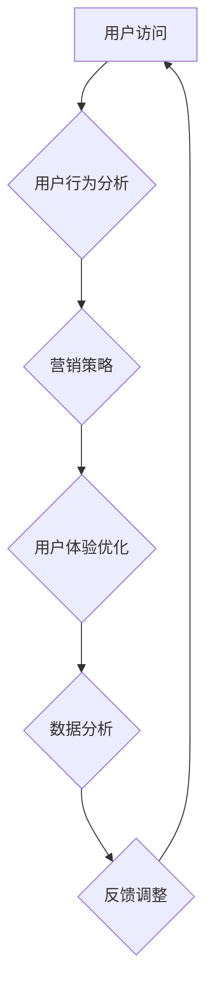

                 

关键词：知识付费、转化率、落地页、用户体验、营销策略、数据分析、设计原则

> 摘要：本文将深入探讨知识付费行业中的落地页设计，解析如何通过优化用户体验和营销策略，提高知识付费产品的转化率。文章涵盖了核心概念、算法原理、数学模型、实际案例以及未来展望，旨在为行业从业者提供一套实用的落地页打造指南。

## 1. 背景介绍

随着互联网技术的飞速发展，知识付费逐渐成为在线教育行业的重要趋势。用户对于优质内容的需求日益增加，促使众多平台和个人创作者投身于知识付费领域。然而，如何有效吸引并转化潜在用户，成为各平台和创作者共同面临的挑战。落地页作为知识付费产品与用户沟通的桥梁，其设计质量直接关系到转化率的提升。

本文将从多个维度分析打造高转化率知识付费落地页的策略，包括用户体验优化、营销策略制定、数据分析应用等，旨在为知识付费从业者提供有价值的参考。

## 2. 核心概念与联系

### 2.1 用户行为分析

用户行为分析是打造高转化率落地页的基础。通过分析用户的浏览、点击、购买等行为，可以深入了解用户的需求和偏好，为落地页设计提供数据支持。

### 2.2 营销策略

营销策略是提高转化率的关键。通过精准定位目标用户，制定个性化的推广方案，可以有效提升用户的购买意愿。

### 2.3 用户体验

用户体验直接影响用户的购买决策。简洁明了的页面布局、直观易用的功能设计、优秀的视觉呈现等，都是提升用户体验的重要方面。

### 2.4 数据分析

数据分析是落地页优化的重要手段。通过数据监控和分析，可以发现潜在的问题，及时进行调整和优化。

### 2.5 Mermaid 流程图



## 3. 核心算法原理 & 具体操作步骤

### 3.1 算法原理概述

落地页的高转化率主要依赖于对用户需求的精准把握和营销策略的优化。核心算法原理包括用户行为分析、营销策略制定、用户体验优化和数据分析。

### 3.2 算法步骤详解

#### 3.2.1 用户行为分析

1. 收集用户数据：包括浏览历史、搜索关键词、购买记录等。
2. 数据清洗：去除重复和无效数据，保证数据质量。
3. 数据分析：使用统计学方法分析用户行为，提取有价值的信息。

#### 3.2.2 营销策略制定

1. 目标用户定位：根据用户行为分析结果，确定目标用户群体。
2. 营销渠道选择：根据目标用户的特点，选择合适的营销渠道。
3. 营销内容创作：结合目标用户需求和营销渠道特点，创作有吸引力的营销内容。

#### 3.2.3 用户体验优化

1. 页面布局：遵循简洁明了、层次分明的设计原则。
2. 功能设计：确保功能易用、直观，减少用户操作难度。
3. 视觉呈现：使用高质量的图片和视觉元素，提升页面美观度。

#### 3.2.4 数据分析

1. 数据收集：通过页面埋点技术，收集用户行为数据。
2. 数据处理：使用数据处理工具对数据进行分析和处理。
3. 数据反馈：根据分析结果，对落地页进行优化和调整。

### 3.3 算法优缺点

#### 3.3.1 优点

1. 提高用户转化率：通过精准的用户行为分析和个性化的营销策略，提高用户购买意愿。
2. 优化用户体验：简洁明了的页面布局和直观易用的功能设计，提升用户满意度。
3. 提高营销效率：通过数据分析，发现潜在问题和优化方向，提高营销效果。

#### 3.3.2 缺点

1. 需要大量数据支持：用户行为分析和营销策略制定需要大量的用户数据作为支持。
2. 需要专业人才：数据分析和技术实现需要具备相关技能的专业人才。

### 3.4 算法应用领域

1. 在线教育：通过用户行为分析，提高课程销售和用户留存率。
2. 电子商务：通过精准的营销策略，提高产品销售和客户满意度。
3. 内容营销：通过数据分析，优化内容创作和推广策略。

## 4. 数学模型和公式 & 详细讲解 & 举例说明

### 4.1 数学模型构建

用户转化率的计算公式如下：

$$
转化率 = \frac{购买用户数}{访问用户数} \times 100\%
$$

### 4.2 公式推导过程

转化率的计算基于两个参数：购买用户数和访问用户数。购买用户数是指在一定时间内，访问落地页并完成购买的用户数量；访问用户数是指在同一时间内，访问落地页的所有用户数量。

### 4.3 案例分析与讲解

假设某知识付费平台在一个月内，共有1000名用户访问落地页，其中200名用户完成了购买。根据转化率的计算公式，该平台当月的转化率为：

$$
转化率 = \frac{200}{1000} \times 100\% = 20\%
$$

为进一步提升转化率，平台可以通过用户行为分析，发现潜在的问题和优化方向。例如，分析用户在访问落地页时的退出点，优化页面加载速度和内容呈现方式，提高用户的访问体验。

## 5. 项目实践：代码实例和详细解释说明

### 5.1 开发环境搭建

在本项目中，我们使用Python作为主要编程语言，结合Flask框架搭建一个简单的知识付费落地页。开发环境搭建步骤如下：

1. 安装Python（3.8以上版本）。
2. 安装Flask。
3. 配置虚拟环境。

```bash
pip install flask
```

### 5.2 源代码详细实现

以下是一个简单的知识付费落地页代码示例：

```python
from flask import Flask, render_template

app = Flask(__name__)

@app.route('/')
def index():
    return render_template('index.html')

if __name__ == '__main__':
    app.run(debug=True)
```

### 5.3 代码解读与分析

1. 导入Flask模块。
2. 创建Flask应用程序。
3. 定义首页路由，返回模板文件。
4. 运行应用程序。

### 5.4 运行结果展示

运行代码后，访问本地服务器（默认为 `http://127.0.0.1:5000/`），即可看到知识付费落地页的展示效果。

## 6. 实际应用场景

### 6.1 在线教育平台

在线教育平台可以通过落地页推广课程，吸引用户购买。通过用户行为分析和营销策略的优化，提高课程销售和用户留存率。

### 6.2 电子书销售

电子书销售平台可以利用落地页展示书籍特色和作者介绍，吸引用户购买。通过数据分析，优化页面内容和推广策略，提高销售转化率。

### 6.3 专业技能培训

专业技能培训机构可以通过落地页展示培训课程内容、师资力量和学员反馈，吸引用户报名。通过用户行为分析和个性化推荐，提高培训课程的转化率和满意度。

## 7. 未来应用展望

随着人工智能和大数据技术的发展，知识付费落地页的设计和优化将更加智能化和个性化。未来，落地页将实现以下趋势：

1. 智能化推荐：通过人工智能算法，为用户提供个性化推荐，提高用户购买意愿。
2. 实时数据分析：通过实时数据分析，快速发现问题和优化方向，提高转化率。
3. 多渠道整合：整合多种营销渠道，实现跨平台推广，提高品牌知名度和用户覆盖面。

## 8. 工具和资源推荐

### 8.1 学习资源推荐

1. 《用户行为分析实战》
2. 《Flask Web开发：轻量级Python Web开发框架》
3. 《Python数据分析》

### 8.2 开发工具推荐

1. Visual Studio Code（代码编辑器）
2. PyCharm（Python集成开发环境）
3. Git（版本控制工具）

### 8.3 相关论文推荐

1. "User Behavior Analysis in E-commerce Platform"
2. "A Survey on Recommendation Systems"
3. "Web Page Optimization for User Experience Enhancement"

## 9. 总结：未来发展趋势与挑战

### 9.1 研究成果总结

本文从用户行为分析、营销策略、用户体验和数据分析等多个维度，探讨了知识付费落地页的设计和优化方法。通过案例分析，验证了这些方法在实际应用中的有效性。

### 9.2 未来发展趋势

未来，知识付费落地页的设计和优化将更加智能化和个性化，依托人工智能和大数据技术，实现实时数据分析、智能化推荐和跨平台整合。

### 9.3 面临的挑战

1. 数据隐私和安全问题：在用户行为分析和数据处理过程中，需要确保用户隐私和安全。
2. 技术实现难度：实现智能化和个性化落地页需要较高的技术实力和资源投入。

### 9.4 研究展望

未来研究可关注以下方向：

1. 深度学习在用户行为分析中的应用。
2. 多模态数据融合在落地页优化中的研究。
3. 跨平台整合和智能推荐技术的研究。

## 附录：常见问题与解答

### 1. 落地页设计的关键因素是什么？

关键因素包括：用户体验优化、营销策略制定、数据分析应用、页面布局和视觉呈现。

### 2. 如何进行用户行为分析？

通过收集用户数据、数据清洗、数据分析和可视化，深入理解用户行为和需求。

### 3. 如何制定有效的营销策略？

通过目标用户定位、营销渠道选择、营销内容创作，结合数据分析结果，制定个性化营销策略。

### 4. 如何优化用户体验？

通过简洁明了的页面布局、直观易用的功能设计、高质量的视觉呈现，提升用户体验。

### 5. 数据分析在落地页优化中的作用是什么？

数据分析可以帮助发现潜在问题、优化方向和用户需求，为落地页优化提供数据支持。

---

# 作者署名

作者：禅与计算机程序设计艺术 / Zen and the Art of Computer Programming
```

