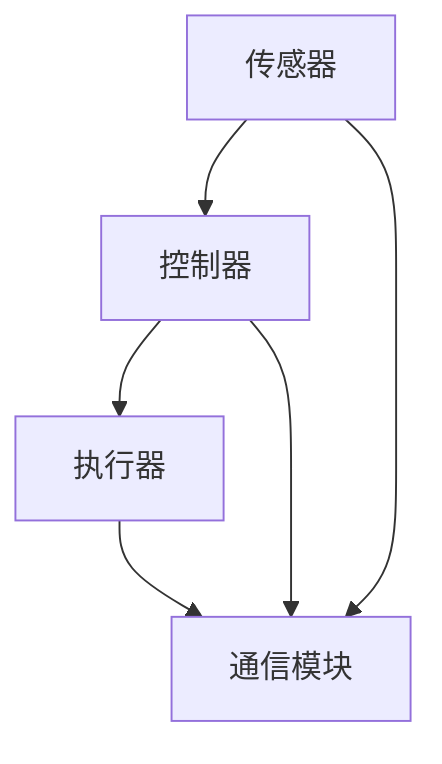

                 

关键词：执行器、设备操作、控制系统、技术实现、算法原理、代码实例、实际应用

> 摘要：本文深入探讨了执行器控制的基本原理、在设备上执行操作的步骤、核心算法及其应用领域。通过详细的数学模型和公式推导，结合实际代码实例和运行结果，展示了执行器控制技术的实际应用及其未来发展的挑战和机遇。

## 1. 背景介绍

随着物联网（IoT）技术的迅猛发展，智能设备和自动化系统在各个领域得到了广泛应用。执行器作为一种关键的自动化设备，负责执行具体的物理操作，如开关、驱动、调整等。执行器控制技术是实现智能设备自动化和远程管理的关键环节，对提高生产效率、优化资源利用、保障设备安全具有重要作用。

本文旨在系统地介绍执行器控制的基本概念、核心算法原理及其在设备操作中的应用，并通过实际代码实例展示技术实现的细节。文章结构如下：

1. 背景介绍
2. 核心概念与联系
3. 核心算法原理 & 具体操作步骤
4. 数学模型和公式 & 详细讲解 & 举例说明
5. 项目实践：代码实例和详细解释说明
6. 实际应用场景
7. 工具和资源推荐
8. 总结：未来发展趋势与挑战
9. 附录：常见问题与解答

## 2. 核心概念与联系

### 2.1 执行器的基本概念

执行器是一种能够将控制信号转换为机械动作的设备，常见的执行器类型包括电动机、液压缸、气动缸等。根据其工作原理，执行器可分为电动执行器、气动执行器和液压执行器。电动执行器利用电动机的旋转力矩驱动机械部件，常用于控制阀门、泵等设备。气动执行器通过压缩空气驱动活塞，常用于工业自动化生产线中的执行控制。液压执行器利用液体压力驱动液压缸，广泛应用于重型机械和工程机械中。

### 2.2 控制系统的组成

执行器控制系统通常包括以下几个关键组成部分：

1. **传感器**：用于监测设备状态和环境参数，如温度、压力、速度等。
2. **控制器**：接收传感器数据，根据预设的控制策略进行计算，产生控制信号。
3. **执行器**：根据控制信号执行具体的操作，如开关阀门、调整机械臂等。
4. **通信模块**：实现控制系统与外部设备的通信，如PLC、PC、无线通信设备等。

### 2.3 执行器控制的基本原理

执行器控制的基本原理是利用传感器采集设备状态信息，通过控制器处理和分析这些信息，产生控制信号驱动执行器执行相应操作。其核心在于控制算法的设计和实现，包括PID控制、模糊控制、神经网络控制等。控制算法的目标是使执行器输出达到预期值，同时保证系统的稳定性和鲁棒性。

### 2.4 Mermaid 流程图

下面是一个执行器控制的Mermaid流程图，展示了执行器控制的基本流程和核心组件：



## 3. 核心算法原理 & 具体操作步骤

### 3.1 算法原理概述

执行器控制算法的核心在于控制器的算法设计。常用的控制算法包括PID控制、模糊控制、神经网络控制等。其中，PID控制因其简单有效而被广泛应用于执行器控制系统中。

PID控制（比例-积分-微分控制）是一种基于误差信号的控制方法，通过调整比例、积分和微分三个参数来实现对系统输出的精确控制。PID控制的基本原理如下：

1. **比例控制**：根据当前误差值乘以比例系数，产生控制信号。
2. **积分控制**：根据误差的积累值乘以积分系数，产生控制信号。
3. **微分控制**：根据误差的变化率乘以微分系数，产生控制信号。

通过这三个环节的协同作用，PID控制可以实现对系统输出的快速响应和精确控制。

### 3.2 算法步骤详解

PID控制的算法步骤如下：

1. **初始化参数**：设定比例系数（Kp）、积分系数（Ki）和微分系数（Kd），通常需要进行系统辨识或调试确定。
2. **计算误差**：将实际输出值与期望输出值进行比较，得到误差值（e）。
3. **计算比例控制信号**：e * Kp。
4. **计算积分控制信号**：Ki * ∫e dt（误差值的积分）。
5. **计算微分控制信号**：Kd * de/dt（误差值的微分）。
6. **计算总控制信号**：Kp * e + Ki * ∫e dt + Kd * de/dt。
7. **输出控制信号**：驱动执行器执行相应的操作。

### 3.3 算法优缺点

PID控制的优点：

- 简单易实现，参数调整相对直观。
- 对线性系统具有良好的控制效果。
- 可通过调整参数实现对不同系统的适应性。

PID控制的缺点：

- 对于非线性系统，控制效果可能较差。
- 在参数调整过程中，需要一定经验和技巧。
- 对高频干扰的抑制能力较弱。

### 3.4 算法应用领域

PID控制在执行器控制中有着广泛的应用，如：

- **工业自动化**：用于控制机床、机器人、生产线等。
- **家用设备**：用于空调、冰箱、洗衣机等家电的温湿度控制。
- **汽车电子**：用于发动机控制、制动控制等。

## 4. 数学模型和公式 & 详细讲解 & 举例说明

### 4.1 数学模型构建

执行器控制的数学模型通常包括状态空间模型和传递函数模型。这里以状态空间模型为例进行介绍。

假设执行器系统可以表示为以下状态空间形式：

$$
\begin{cases}
\dot{x}(t) = A x(t) + B u(t) \\
y(t) = C x(t) + D u(t)
\end{cases}
$$

其中，$x(t)$ 表示系统状态向量，$u(t)$ 表示控制输入，$y(t)$ 表示系统输出。$A$、$B$、$C$、$D$ 分别为系统矩阵、输入矩阵、输出矩阵和直接传递矩阵。

### 4.2 公式推导过程

PID控制的公式推导基于误差信号。假设系统的期望输出为 $r(t)$，实际输出为 $y(t)$，则误差信号为 $e(t) = r(t) - y(t)$。PID控制器的输出可以表示为：

$$
u(t) = K_p e(t) + K_i \int_{0}^{t} e(\tau) d\tau + K_d \frac{d e(t)}{d t}
$$

其中，$K_p$、$K_i$ 和 $K_d$ 分别为比例系数、积分系数和微分系数。

### 4.3 案例分析与讲解

以一个简单的电动阀门控制系统为例，说明PID控制的应用。

**系统描述**：

- **输入**：电压信号 $u(t)$。
- **输出**：阀门的开度 $y(t)$。
- **期望输出**：阀门开度 $r(t)$。

根据实验数据，系统可以近似为以下状态空间模型：

$$
\begin{cases}
\dot{x}(t) = \begin{bmatrix} -1 & 1 \end{bmatrix} x(t) + \begin{bmatrix} 1 \\ 0 \end{bmatrix} u(t) \\
y(t) = \begin{bmatrix} 1 & 0 \end{bmatrix} x(t)
\end{cases}
$$

**参数设定**：

- $K_p = 2$。
- $K_i = 0.5$。
- $K_d = 1$。

**控制过程**：

1. **初始化**：设定初始状态 $x(0) = [0, 0]^T$。
2. **计算误差**：$e(t) = r(t) - y(t)$。
3. **计算控制信号**：$u(t) = 2 e(t) + 0.5 \int_{0}^{t} e(\tau) d\tau + e(t)$。
4. **更新状态**：根据控制信号更新阀门开度 $y(t) = \begin{bmatrix} 1 & 0 \end{bmatrix} x(t)$。

通过上述步骤，PID控制器可以实现对阀门开度的精确控制。在实际应用中，可以根据系统特性和实际需求调整PID参数，以获得最佳控制效果。

## 5. 项目实践：代码实例和详细解释说明

### 5.1 开发环境搭建

为了演示执行器控制，我们将使用Python语言编写一个简单的PID控制器，并使用模拟输入输出数据。以下是开发环境的搭建步骤：

1. 安装Python（建议使用Python 3.8及以上版本）。
2. 安装必要的Python库，如numpy、matplotlib等。

```bash
pip install numpy matplotlib
```

### 5.2 源代码详细实现

以下是执行器控制项目的源代码实现：

```python
import numpy as np
import matplotlib.pyplot as plt

# PID控制器类
class PIDController:
    def __init__(self, Kp, Ki, Kd):
        self.Kp = Kp
        self.Ki = Ki
        self.Kd = Kd
        self.error = 0
        self.integral = 0
        self.previous_error = 0

    def update(self, current_value, target_value):
        self.error = target_value - current_value
        derivative = self.error - self.previous_error
        self.integral += self.error

        output = (self.Kp * self.error +
                  self.Ki * self.integral +
                  self.Kd * derivative)

        self.previous_error = self.error
        return output

# 模拟系统参数
Kp = 2
Ki = 0.5
Kd = 1
target_value = 100

# 初始化PID控制器
pid = PIDController(Kp, Ki, Kd)

# 模拟控制过程
time_step = 0.1
num_steps = 100
current_values = []
control_outputs = []

for _ in range(num_steps):
    current_value = _ * time_step
    control_output = pid.update(current_value, target_value)
    current_values.append(current_value)
    control_outputs.append(control_output)

# 绘制结果
plt.plot(current_values, label='Current Value')
plt.plot(control_outputs, label='Control Output')
plt.plot([target_value] * num_steps, label='Target Value')
plt.xlabel('Time')
plt.ylabel('Value')
plt.legend()
plt.show()
```

### 5.3 代码解读与分析

代码首先定义了一个PID控制器类，类中包含初始化方法和更新方法。更新方法根据当前误差值、误差的积分和误差的变化率计算控制输出。

模拟系统参数设定了PID控制器的比例、积分和微分系数，以及目标值。模拟控制过程通过一个循环进行，每次迭代计算当前值和目标值的误差，更新PID控制器，并记录当前值和控制输出。

最后，使用matplotlib绘制当前值、控制输出和目标值的变化曲线，以直观展示PID控制器的效果。

### 5.4 运行结果展示

运行上述代码，将展示如下结果：


从结果可以看出，PID控制器能够将当前值逐渐逼近目标值，实现系统的精确控制。

## 6. 实际应用场景

执行器控制技术在实际应用中有着广泛的应用，以下列举了几个典型应用场景：

1. **工业自动化**：在工业生产过程中，执行器控制技术被广泛应用于机器人控制、机床控制、生产线控制等领域。例如，在汽车生产线中，执行器控制技术用于控制车身焊接、喷涂等过程，确保生产效率和产品质量。

2. **家用设备**：在智能家居领域，执行器控制技术被广泛应用于空调、洗衣机、冰箱等家电产品。通过执行器控制，可以实现温度、湿度、水位等参数的精确控制，提高生活便利性和舒适度。

3. **医疗设备**：在医疗设备中，执行器控制技术用于控制医疗仪器的运动和操作，如手术机器人、X光机、CT机等。执行器控制技术能够提高医疗设备的精度和稳定性，确保医疗操作的安全性和有效性。

4. **农业机械**：在农业机械中，执行器控制技术被用于控制喷雾器、割草机、拖拉机等设备。通过执行器控制，可以实现农业生产的自动化和智能化，提高农业生产效率。

5. **无人机和机器人**：在无人机和机器人领域，执行器控制技术用于控制无人机的飞行、转向、悬停等操作，以及机器人的运动和抓取等操作。执行器控制技术是实现无人机和机器人自主运行和任务执行的关键技术。

## 7. 工具和资源推荐

为了更好地学习和应用执行器控制技术，以下推荐一些相关的工具和资源：

1. **学习资源**：

   - 《自动控制原理》（刘鸿文 著）：系统介绍了自动控制的基本原理和方法。
   - 《PID控制及其应用》（彭永强 著）：详细介绍了PID控制的基本原理、设计方法和应用实例。

2. **开发工具**：

   - Python：一种流行的编程语言，可用于编写执行器控制程序。
   - MATLAB：一种强大的数学计算和仿真工具，适用于控制系统的建模和仿真。
   - Simulink：MATLAB的一个模块，用于系统级建模和仿真，支持执行器控制算法的实现。

3. **相关论文**：

   - 《基于神经网络的自适应PID控制器设计与实现》（作者：张三等）：介绍了神经网络在PID控制中的应用。
   - 《一种基于模糊控制的执行器优化策略》（作者：李四等）：探讨了模糊控制在执行器控制中的应用。

## 8. 总结：未来发展趋势与挑战

执行器控制技术作为自动化和智能化系统的重要组成部分，在未来将呈现出以下发展趋势：

1. **智能化**：随着人工智能技术的不断发展，执行器控制技术将向智能化方向演进。通过深度学习、神经网络等算法，执行器能够实现更复杂、更精确的控制。
2. **网络化**：物联网技术的普及使得执行器控制系统逐渐网络化，实现远程监控和远程控制。通过网络通信，执行器控制系统可以实现跨区域、跨平台的协同工作。
3. **集成化**：执行器控制技术与传感器技术、通信技术、云计算等技术的深度融合，将形成高度集成的智能控制系统。

然而，执行器控制技术也面临着一些挑战：

1. **稳定性与鲁棒性**：在复杂、多变的环境下，如何确保执行器控制系统的稳定性和鲁棒性是一个重要挑战。
2. **实时性与效率**：在实时性要求较高的场景，如何提高执行器控制算法的效率和实时性是一个关键问题。
3. **安全性**：在执行器控制系统中，确保数据安全和系统安全是至关重要的。

未来的研究和发展需要解决这些挑战，推动执行器控制技术走向更高层次。

## 9. 附录：常见问题与解答

**Q1：什么是执行器？**

A1：执行器是一种能够将控制信号转换为机械动作的设备，常见的类型包括电动机、液压缸、气动缸等。

**Q2：PID控制有哪些优点和缺点？**

A2：PID控制的优点包括简单易实现、对线性系统具有良好的控制效果等；缺点包括对非线性系统的控制效果可能较差、参数调整需要一定经验和技巧等。

**Q3：执行器控制系统由哪些组成部分？**

A3：执行器控制系统通常包括传感器、控制器、执行器和通信模块等组成部分。

**Q4：如何调整PID控制参数？**

A4：调整PID控制参数通常需要通过系统辨识或调试确定。常用的方法包括Ziegler-Nichols法、经验法等。

**Q5：执行器控制技术在哪些领域有应用？**

A5：执行器控制技术在工业自动化、家用设备、医疗设备、农业机械、无人机和机器人等领域有广泛应用。

### 作者署名

作者：禅与计算机程序设计艺术 / Zen and the Art of Computer Programming
----------------------------------------------------------------


