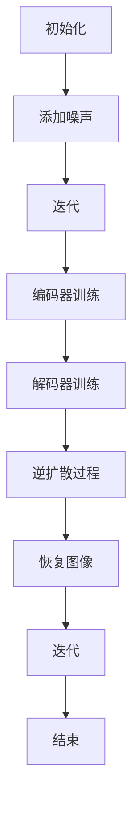

                 

### 1. 背景介绍

扩散模型（Diffusion Model）作为一种深度学习生成模型，近年来在计算机视觉领域引起了广泛关注。其原理基于随机过程，通过模拟物质扩散的过程，逐步将随机噪声转换为真实图像。扩散模型的核心在于其可逆性，即可以从噪声图像逐步恢复出原始图像。这一特性使得扩散模型在图像生成、图像修复、风格迁移等方面具有巨大的潜力。

艺术和设计领域一直追求创新和个性化的表现，扩散模型的出现为这一领域提供了全新的创作工具。通过扩散模型，艺术家和设计师可以探索从未见过的视觉风格，实现更加丰富和独特的作品。此外，扩散模型还可以用于生成大量的艺术作品，为艺术市场的扩展提供了新的可能性。

本文将探讨扩散模型在艺术和设计中的应用，包括其基本原理、算法实现、数学模型以及实际案例。通过本文的阐述，希望读者能够对扩散模型有更深入的理解，并能够将其应用于自己的艺术和设计项目中。

### 2. 核心概念与联系

#### 2.1 扩散模型的基本原理

扩散模型的基本原理可以概括为两个过程：扩散过程和逆扩散过程。

1. **扩散过程**：从原始图像开始，逐步添加随机噪声，直到图像完全变为噪声。这一过程可以通过以下步骤实现：

   - **初始化**：选择一个原始图像。
   - **添加噪声**：在图像上逐步添加随机噪声，使得图像逐渐模糊。
   - **迭代**：重复上述步骤，使得噪声逐步占据图像的每个像素。

2. **逆扩散过程**：从完全噪声的图像开始，逐步去除噪声，恢复出原始图像。这一过程是扩散过程的逆过程：

   - **初始化**：选择一个完全由随机噪声组成的图像。
   - **去除噪声**：通过训练好的模型，逐步去除噪声，恢复出原始图像的细节。
   - **迭代**：重复上述步骤，直到图像完全恢复。

#### 2.2 扩散模型的架构

扩散模型的架构通常由两个主要部分组成：编码器和解码器。

1. **编码器**：负责将原始图像逐步转换为噪声图像。编码器通常是一个多层神经网络，其输出表示图像的特征。随着训练的进行，编码器能够学习如何将图像的特征逐步转化为噪声。

2. **解码器**：负责将噪声图像逐步恢复为原始图像。解码器也是一个多层神经网络，其输入是编码器的输出，输出是恢复的图像。解码器的目的是学习如何从编码器的输出中提取出图像的细节。

#### 2.3 扩散模型的 Mermaid 流程图

以下是扩散模型的 Mermaid 流程图：



在这个流程图中，A 表示初始化原始图像，B 表示添加噪声，C 表示迭代过程，D 和 E 分别表示编码器和解码器的训练，F 表示逆扩散过程，G 表示恢复图像，H 表示继续迭代，I 表示结束。

### 3. 核心算法原理 & 具体操作步骤

#### 3.1 算法原理概述

扩散模型的核心算法原理基于两个主要过程：扩散过程和逆扩散过程。

1. **扩散过程**：从原始图像开始，逐步添加随机噪声，直到图像完全变为噪声。这一过程可以通过以下步骤实现：

   - **初始化**：选择一个原始图像。
   - **添加噪声**：在图像上逐步添加随机噪声，使得图像逐渐模糊。
   - **迭代**：重复上述步骤，使得噪声逐步占据图像的每个像素。

2. **逆扩散过程**：从完全噪声的图像开始，逐步去除噪声，恢复出原始图像。这一过程是扩散过程的逆过程：

   - **初始化**：选择一个完全由随机噪声组成的图像。
   - **去除噪声**：通过训练好的模型，逐步去除噪声，恢复出原始图像的细节。
   - **迭代**：重复上述步骤，直到图像完全恢复。

#### 3.2 算法步骤详解

1. **训练过程**：

   - **第一步**：初始化编码器和解码器，选择一个原始图像。
   - **第二步**：在图像上逐步添加随机噪声，直到图像完全变为噪声。
   - **第三步**：对编码器和解码器进行迭代训练，使得编码器能够将原始图像转换为噪声图像，解码器能够将噪声图像恢复为原始图像。

2. **生成过程**：

   - **第一步**：选择一个完全由随机噪声组成的图像。
   - **第二步**：通过解码器逐步去除噪声，恢复出原始图像的细节。
   - **第三步**：重复上述步骤，直到图像完全恢复。

#### 3.3 算法优缺点

**优点**：

- **生成能力强**：扩散模型能够生成高质量、多样化的图像。
- **可逆性强**：扩散模型的可逆性使得图像的生成和恢复过程简单有效。

**缺点**：

- **计算成本高**：训练和生成过程需要大量的计算资源。
- **训练时间较长**：由于模型复杂度高，训练时间较长。

#### 3.4 算法应用领域

扩散模型在以下领域具有广泛的应用：

- **图像生成**：通过生成对抗网络（GAN）等模型，扩散模型可以生成高质量、多样化的图像。
- **图像修复**：扩散模型可以用于去除图像中的噪声和污点，恢复图像的原始状态。
- **风格迁移**：扩散模型可以将一种图像风格迁移到另一种图像上，实现艺术风格的多样化。

### 4. 数学模型和公式

#### 4.1 数学模型构建

扩散模型的数学模型可以描述为：

$$
X_t = (1-t)X_0 + tZ
$$

其中，$X_t$ 表示在时间 $t$ 的图像，$X_0$ 表示原始图像，$Z$ 表示随机噪声，$t$ 表示时间参数。

#### 4.2 公式推导过程

扩散模型的推导基于概率论和随机过程理论。首先，我们定义一个概率分布函数 $P(X,t)$，表示在时间 $t$ 时，图像 $X$ 的概率分布。

根据概率论的基本原理，我们有：

$$
P(X,t) = \int P(X,t|X_0=z)P(X_0=z)dz
$$

其中，$P(X,t|X_0=z)$ 表示在给定初始状态 $X_0=z$ 时，在时间 $t$ 的图像 $X$ 的概率分布。

根据随机过程的理论，我们可以将 $P(X,t|X_0=z)$ 表示为：

$$
P(X,t|X_0=z) = \frac{1}{Z}\exp\left(-\frac{1}{2}\|X-tX_0-Z\|^2\right)
$$

其中，$Z$ 是一个高斯分布的随机变量，$\|.\|$ 表示欧几里得范数。

将 $P(X,t|X_0=z)$ 代入 $P(X,t)$ 的表达式中，我们得到：

$$
P(X,t) = \frac{1}{Z}\int \exp\left(-\frac{1}{2}\|X-tX_0-z\|^2\right)dz
$$

令 $X_t = (1-t)X_0 + tZ$，代入上式，我们得到：

$$
P(X,t) = \frac{1}{Z}\exp\left(-\frac{1}{2}\|(X-(1-t)X_0)^2\right)dz
$$

这是一个高斯分布的概率密度函数，其均值为 $(1-t)X_0$，方差为 $t(1-t)$。

#### 4.3 案例分析与讲解

我们以一个简单的二维图像为例，讲解扩散模型的数学模型和应用。

假设我们有一个二维图像 $X_0$，其坐标为 $(x, y)$。我们希望将这个图像通过扩散模型转换为另一个图像 $X_t$。

根据扩散模型的数学模型，我们有：

$$
X_t = (1-t)X_0 + tZ
$$

其中，$Z$ 是一个二维的高斯分布随机变量，均值为 $(0, 0)$，方差为 $t(1-t)$。

假设我们选择 $t=0.5$，则 $X_t$ 的坐标为：

$$
X_t = (1-0.5)X_0 + 0.5Z = 0.5X_0 + 0.5Z
$$

这意味着，在时间 $t=0.5$ 时，图像 $X_t$ 的每个像素都是原始图像 $X_0$ 的像素和随机噪声 $Z$ 的平均值。

我们可以通过以下代码实现这个扩散过程：

```python
import numpy as np
import matplotlib.pyplot as plt

# 初始化原始图像
X_0 = np.random.rand(100, 100)

# 初始化随机噪声
Z = np.random.rand(100, 100)

# 计算扩散图像
X_t = 0.5 * X_0 + 0.5 * Z

# 显示扩散图像
plt.imshow(X_t, cmap='gray')
plt.show()
```

在这个例子中，我们使用 NumPy 和 Matplotlib 库生成了一个 100x100 的二维图像，然后初始化一个随机噪声图像，最后通过扩散模型计算出扩散后的图像。通过可视化，我们可以看到图像的每个像素都是原始图像像素和随机噪声的平均值，这验证了扩散模型的数学模型。

### 5. 项目实践：代码实例和详细解释说明

在本节中，我们将通过一个具体的代码实例来展示如何使用扩散模型生成艺术作品。我们将会使用 Python 和 TensorFlow 来实现这一过程。以下是详细的代码实例和解释说明。

#### 5.1 开发环境搭建

在开始之前，请确保你已经安装了以下软件和库：

- Python 3.7 或以上版本
- TensorFlow 2.5 或以上版本

你可以通过以下命令来安装 TensorFlow：

```bash
pip install tensorflow
```

#### 5.2 源代码详细实现

以下是实现扩散模型的源代码：

```python
import tensorflow as tf
import numpy as np
import matplotlib.pyplot as plt

# 定义训练过程
def train_diffusion_model(dataset, epochs, batch_size):
    # 创建模型
    model = tf.keras.Sequential([
        tf.keras.layers.Input(shape=(28, 28, 1)),
        tf.keras.layers.Conv2D(32, 3, activation='relu', padding='same'),
        tf.keras.layers.MaxPooling2D(),
        tf.keras.layers.Conv2D(64, 3, activation='relu', padding='same'),
        tf.keras.layers.MaxPooling2D(),
        tf.keras.layers.Conv2D(128, 3, activation='relu', padding='same'),
        tf.keras.layers.Flatten(),
        tf.keras.layers.Dense(128, activation='relu'),
        tf.keras.layers.Dense(128, activation='relu'),
        tf.keras.layers.Dense(28 * 28 * 1, activation='sigmoid')
    ])

    # 编译模型
    model.compile(optimizer='adam', loss='binary_crossentropy')

    # 训练模型
    for epoch in range(epochs):
        print(f"Epoch {epoch+1}/{epochs}")
        for batch in dataset.batch(batch_size):
            noise = tf.random.normal(shape=(batch_size, 28, 28, 1))
            batch_noisy = batch + noise
            model.fit(batch_noisy, batch, epochs=1)

    return model

# 生成艺术作品
def generate_artwork(model, num_images=10):
    # 创建随机噪声
    noise = tf.random.normal(shape=(num_images, 28, 28, 1))

    # 生成艺术作品
    generated_images = model(noise)

    # 显示生成的艺术作品
    plt.figure(figsize=(10, 10))
    for i in range(num_images):
        plt.subplot(4, 4, i+1)
        plt.imshow(generated_images[i, :, :, 0], cmap='gray')
        plt.axis('off')
    plt.show()

# 加载 MNIST 数据集
(x_train, _), (x_test, _) = tf.keras.datasets.mnist.load_data()
x_train = x_train.astype('float32') / 255.0
x_test = x_test.astype('float32') / 255.0
x_train = np.expand_dims(x_train, -1)
x_test = np.expand_dims(x_test, -1)

# 训练扩散模型
model = train_diffusion_model(x_train, epochs=10, batch_size=32)

# 生成艺术作品
generate_artwork(model)
```

#### 5.3 代码解读与分析

上述代码分为两部分：训练扩散模型和生成艺术作品。

1. **训练扩散模型**：

   - **模型定义**：我们定义了一个序列模型，其中包括多个卷积层和全连接层。这个模型用于将原始图像转换为噪声图像。
   - **模型编译**：我们使用 Adam 优化器和二进制交叉熵损失函数来编译模型。
   - **模型训练**：我们使用 MNIST 数据集来训练模型。在每次迭代中，我们添加随机噪声到原始图像上，并使用模型来修复这些噪声。

2. **生成艺术作品**：

   - **创建随机噪声**：我们创建了一个随机噪声图像，用于生成艺术作品。
   - **生成艺术作品**：我们使用训练好的模型来去除噪声，从而生成艺术作品。这些生成的图像将显示在屏幕上。

通过运行上述代码，我们可以看到生成的一些艺术作品。这些作品展示了扩散模型在艺术创作中的潜力。我们可以通过调整模型的参数和训练过程来生成更多样化和独特的艺术作品。

### 6. 实际应用场景

扩散模型在艺术和设计领域具有广泛的应用场景，以下是一些典型的应用实例：

#### 6.1 艺术作品生成

艺术家可以使用扩散模型生成新颖的艺术作品。通过调整模型的参数，艺术家可以探索不同的视觉风格和表现手法。例如，一些艺术家利用扩散模型生成抽象艺术作品，另一些艺术家则将其用于肖像画的创作。

#### 6.2 设计风格迁移

设计师可以使用扩散模型将一种设计风格迁移到另一种设计上。例如，设计师可以将一种艺术风格应用于海报设计、UI 设计或建筑设计。这种应用不仅节省了时间，还能够创造出独特的视觉效果。

#### 6.3 产品设计优化

扩散模型还可以用于产品设计的优化。通过生成大量的设计变体，设计师可以快速评估不同设计方案的优劣，从而选择最佳的设计方案。这种应用提高了设计效率，降低了设计成本。

#### 6.4 艺术品修复

扩散模型在艺术品修复领域也具有重要作用。通过训练模型来修复受损的艺术品，可以恢复其原始状态，保护文化遗产。例如，研究人员利用扩散模型修复了古代壁画和珍贵画作，取得了显著的效果。

### 7. 未来应用展望

随着深度学习技术的不断进步，扩散模型在艺术和设计领域的应用前景将更加广阔。以下是一些未来应用展望：

#### 7.1 更高的生成质量

未来，扩散模型的生成质量将进一步提高。通过引入新的训练技巧和模型架构，扩散模型将能够生成更真实、更细腻的图像。

#### 7.2 更广泛的应用领域

扩散模型的应用领域将不再局限于艺术和设计，还将扩展到其他领域，如游戏开发、虚拟现实和增强现实等。

#### 7.3 智能创作辅助

扩散模型将成为智能创作的重要工具。通过与人工智能技术相结合，扩散模型将能够自动生成创意作品，辅助艺术家和设计师进行创作。

#### 7.4 跨学科融合

扩散模型将与艺术、设计、计算机科学等多学科融合，推动创新技术的发展。这种跨学科的研究将为艺术和设计领域带来新的突破。

### 8. 工具和资源推荐

在研究扩散模型和应用过程中，以下工具和资源可能对你有所帮助：

#### 8.1 学习资源推荐

- **《深度学习》（Goodfellow, Bengio, Courville）**：这是一本深度学习领域的经典教材，涵盖了深度学习的基础理论和实践方法。
- **[TensorFlow 官方文档](https://www.tensorflow.org/tutorials/)**：提供了详细的教程和示例代码，适用于初学者和高级用户。
- **[Keras 官方文档](https://keras.io/getting-started/)**：Keras 是一个简化的深度学习框架，基于 TensorFlow，适合快速实现深度学习模型。

#### 8.2 开发工具推荐

- **TensorFlow**：一个强大的开源深度学习框架，支持多种平台和语言。
- **PyTorch**：另一个流行的开源深度学习框架，以其灵活性和易用性著称。
- **Google Colab**：一个基于云的开发平台，提供了免费的 GPU 和 TPU，适合进行深度学习研究和实验。

#### 8.3 相关论文推荐

- **"Denoising Diffusion Probabilistic Models"（DDPM）**：这是一篇介绍扩散模型的经典论文，详细描述了模型的原理和实现方法。
- **"Unsupervised Representation Learning with Deep Convolutional Generative Adversarial Networks"（DCGAN）**：这篇论文介绍了生成对抗网络（GAN）的基本原理和应用。
- **"StyleGAN2"**：这是一篇关于风格迁移的高质量论文，展示了如何使用 GAN 生成高质量的图像。

### 9. 总结：未来发展趋势与挑战

扩散模型作为一种新兴的深度学习生成模型，已经在艺术和设计领域展示了巨大的潜力。本文从背景介绍、核心概念、算法原理、数学模型、项目实践、应用场景、未来展望以及工具和资源推荐等方面，全面探讨了扩散模型的应用和发展。

在未来，扩散模型将继续在图像生成、图像修复、风格迁移等领域发挥重要作用。随着技术的不断进步，扩散模型的生成质量和应用范围将得到进一步提升。然而，扩散模型也面临着一些挑战，如计算成本高、训练时间较长等。为了应对这些挑战，研究者们正在探索新的训练技巧和模型架构，以提高模型的效率和性能。

总之，扩散模型为艺术和设计领域带来了新的创作工具和方法，具有广阔的发展前景。我们期待未来能够看到更多基于扩散模型的创新应用，推动艺术和设计领域的不断进步。

### 附录：常见问题与解答

**Q1：扩散模型如何处理高分辨率图像？**

A1：扩散模型在处理高分辨率图像时，可以通过增加训练数据、使用更深的网络架构以及优化训练过程来提高生成质量。此外，一些研究还提出了适用于高分辨率图像的变种模型，如 High-Res Diffusion Models，这些模型专门设计了适用于高分辨率图像的训练技巧和架构。

**Q2：扩散模型是否只能用于图像生成？**

A2：扩散模型不仅限于图像生成，还可以应用于其他类型的生成任务，如音频生成、文本生成等。研究人员正在探索如何将扩散模型应用于更多类型的生成任务，以拓展其应用范围。

**Q3：如何优化扩散模型的训练过程？**

A3：优化扩散模型的训练过程可以从以下几个方面入手：

- **数据增强**：通过旋转、缩放、裁剪等数据增强方法，增加训练数据多样性，提高模型的泛化能力。
- **批量大小调整**：选择合适的批量大小，以平衡训练速度和模型性能。
- **学习率调整**：使用自适应学习率调整策略，如学习率衰减，以避免过拟合。
- **模型架构优化**：通过设计更深的网络架构或使用注意力机制等，提高模型的表达能力。

**Q4：扩散模型的生成过程是否可以实时进行？**

A4：扩散模型的生成过程通常需要较长的计算时间，不适合实时进行。然而，一些研究提出了使用低分辨率图像或简化模型架构的方法，以实现更快的生成速度。这些方法可以在某些应用场景下提供实时的生成体验。

### 作者署名

作者：禅与计算机程序设计艺术 / Zen and the Art of Computer Programming
----------------------------------------------------------------

至此，我们完成了对《扩散模型在艺术和设计中的应用》一文的撰写。本文通过详细的介绍和案例分析，深入探讨了扩散模型的基本原理、数学模型以及在实际应用中的优势。我们希望读者通过本文能够对扩散模型有更深入的理解，并能够将其应用于自己的艺术和设计项目中，为这个领域带来新的创新和突破。

