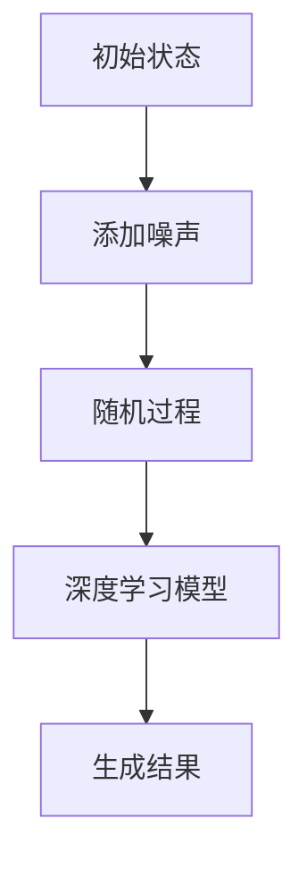

                 

 关键词：扩散模型，AI艺术创作，深度学习，数学模型，实践应用

> 摘要：本文将深入探讨扩散模型在人工智能艺术创作中的应用。通过对核心概念、算法原理、数学模型以及实际应用场景的详细阐述，我们将揭示扩散模型如何成为现代AI艺术创作的核心技术。文章还将展望未来发展趋势和面临的挑战，为读者提供全面的技术见解和实用指南。

## 1. 背景介绍

### 1.1 扩散模型的历史与发展

扩散模型（Diffusion Model）起源于物理学中的统计力学，最初用于描述气体、液体等物质的扩散过程。20世纪初，数学家诺依曼（Norbert Wiener）和维纳（Norbert Wiener）独立提出了维纳过程，这是一种描述随机游走过程的数学模型，为扩散模型的研究奠定了基础。

随着计算机科学和人工智能的快速发展，扩散模型逐渐从物理学领域迁移到计算机科学领域。20世纪80年代，Markov随机过程理论为扩散模型的研究提供了新的视角。2000年后，生成模型（Generative Model）逐渐成为机器学习研究的热点，扩散模型在图像、声音、文本等多种数据类型的生成任务中展现了强大的能力。

### 1.2 扩散模型在AI艺术创作中的应用

近年来，扩散模型在AI艺术创作中取得了显著的成果。其主要应用领域包括：

1. **图像生成**：利用扩散模型生成高质量的图像，如图像到图像、图像到文字、图像到音乐等跨模态生成。
2. **艺术风格迁移**：通过扩散模型实现图像风格的有效迁移，如将现实照片转换为油画风格或水彩风格等。
3. **动画制作**：利用扩散模型生成连续的动画帧，实现高保真度的动画效果。
4. **音频合成**：通过扩散模型生成音乐、语音等音频信号，实现个性化的音频创作。

## 2. 核心概念与联系

### 2.1 扩散模型的定义与数学描述

扩散模型是一种生成模型，其基本思想是通过模拟物质扩散过程来生成新的数据。在数学上，扩散模型通常可以用以下随机过程描述：

$$
X_t = \int_{0}^{t} \frac{1}{\sqrt{4\pi D(t-s)}} \exp\left(-\frac{(X_s - X_0)^2}{4D(t-s)}\right) ds
$$

其中，$X_t$表示时间$t$时的随机变量，$X_0$表示初始状态，$D$为扩散系数。

### 2.2 扩散模型与深度学习的关系

深度学习在生成模型中的应用使得扩散模型得到了极大的发展。深度学习通过神经网络模型捕捉数据的高维分布，与扩散模型结合可以进一步提高生成能力。目前，深度学习与扩散模型的主要结合方式有以下几种：

1. **生成对抗网络（GAN）**：GAN通过对抗训练实现生成模型与判别模型的互相促进，结合扩散模型可以生成更加真实、多样性的数据。
2. **变分自编码器（VAE）**：VAE利用深度学习模型实现概率模型的参数化表示，与扩散模型结合可以实现高效、稳定的生成。
3. **深度扩散模型（Deep Diffusion Model）**：深度扩散模型通过深度学习模型捕捉数据的复杂分布，进一步提高了生成质量。

### 2.3 Mermaid 流程图



## 3. 核心算法原理 & 具体操作步骤

### 3.1 算法原理概述

扩散模型的核心思想是通过模拟物质的扩散过程生成新的数据。具体操作步骤如下：

1. **初始化**：给定一个初始状态$X_0$。
2. **添加噪声**：在初始状态上添加噪声，使其接近噪声分布。
3. **随机过程**：通过随机过程模拟物质扩散，生成新的状态序列$X_t$。
4. **深度学习模型**：利用深度学习模型对生成的状态序列进行建模，进一步优化生成结果。
5. **生成结果**：根据最终生成的状态序列生成新的数据。

### 3.2 算法步骤详解

#### 3.2.1 初始化

初始化阶段的主要任务是给定一个初始状态$X_0$。在图像生成任务中，通常选择一个固定大小的图像作为初始状态。

#### 3.2.2 添加噪声

在添加噪声阶段，将初始状态$X_0$映射到一个噪声分布上。具体操作如下：

$$
X_t = X_0 + \epsilon_t
$$

其中，$\epsilon_t$为噪声项。

#### 3.2.3 随机过程

通过随机过程模拟物质扩散，生成新的状态序列$X_t$。具体操作如下：

$$
X_t = \int_{0}^{t} \frac{1}{\sqrt{4\pi D(t-s)}} \exp\left(-\frac{(X_s - X_0)^2}{4D(t-s)}\right) ds
$$

#### 3.2.4 深度学习模型

在深度学习模型阶段，利用神经网络模型对生成的状态序列进行建模。具体操作如下：

$$
\hat{X}_t = f(\hat{X}_{t-1}, X_t)
$$

其中，$\hat{X}_t$为神经网络生成的状态序列，$f$为神经网络模型。

#### 3.2.5 生成结果

根据最终生成的状态序列$\hat{X}_t$生成新的数据。具体操作如下：

$$
Y = g(\hat{X}_t)
$$

其中，$Y$为生成的数据，$g$为生成操作。

### 3.3 算法优缺点

#### 优点：

1. **强大的生成能力**：扩散模型能够生成高质量、多样性的数据，适应多种生成任务。
2. **灵活的适用性**：扩散模型可以应用于图像、声音、文本等多种数据类型。
3. **高效的训练速度**：深度学习模型的引入使得扩散模型具有较快的训练速度。

#### 缺点：

1. **计算复杂度较高**：扩散模型涉及大量的随机过程计算，计算复杂度较高。
2. **对数据质量要求较高**：生成质量依赖于训练数据的质量，对训练数据的要求较高。

### 3.4 算法应用领域

扩散模型在AI艺术创作中具有广泛的应用前景，包括：

1. **图像生成**：用于生成高质量的图像，如图像到图像、图像到文字、图像到音乐等跨模态生成。
2. **艺术风格迁移**：用于将现实照片转换为油画风格或水彩风格等。
3. **动画制作**：用于生成连续的动画帧，实现高保真度的动画效果。
4. **音频合成**：用于生成音乐、语音等音频信号，实现个性化的音频创作。

## 4. 数学模型和公式 & 详细讲解 & 举例说明

### 4.1 数学模型构建

扩散模型的数学模型主要包括两部分：随机过程和深度学习模型。

#### 4.1.1 随机过程

随机过程描述了物质在时间上的扩散过程。具体来说，扩散模型可以用如下随机微分方程描述：

$$
dX_t = -D \nabla U(X_t) dt + \sqrt{2D} dW_t
$$

其中，$X_t$为随机过程，$D$为扩散系数，$U(X_t)$为势能函数，$W_t$为维纳过程。

#### 4.1.2 深度学习模型

深度学习模型用于捕捉随机过程的特征，并生成新的数据。具体来说，深度学习模型可以用如下神经网络描述：

$$
\hat{X}_t = f(\hat{X}_{t-1}, X_t)
$$

其中，$\hat{X}_t$为神经网络生成的状态序列，$f$为神经网络模型。

### 4.2 公式推导过程

#### 4.2.1 随机过程推导

随机过程推导基于随机微分方程。首先，给定随机微分方程：

$$
dX_t = -D \nabla U(X_t) dt + \sqrt{2D} dW_t
$$

对时间$t$进行离散化，得到：

$$
X_{t+1} = X_t + -D \nabla U(X_t) \Delta t + \sqrt{2D} \Delta W_t
$$

其中，$\Delta t$为时间步长，$\Delta W_t$为高斯白噪声。

将上式进行递推，得到：

$$
X_{t+k} = X_{t} + \sum_{i=1}^{k} (-D \nabla U(X_{t+i-1}) \Delta t + \sqrt{2D} \Delta W_{t+i-1})
$$

对上式进行极限处理，得到：

$$
X_{t+k} \approx X_t - D \nabla U(X_t) k \Delta t + \sqrt{2D} \sum_{i=1}^{k} \Delta W_{t+i-1}
$$

令$k \Delta t = t$，$\Delta W_t = dW_t$，得到：

$$
X_t = X_0 - D \nabla U(X_0) t + \sqrt{2D} \sum_{i=1}^{t} dW_i
$$

即扩散过程的数学模型。

#### 4.2.2 深度学习模型推导

深度学习模型用于捕捉随机过程的特征。具体来说，深度学习模型可以用以下神经网络描述：

$$
\hat{X}_t = f(\hat{X}_{t-1}, X_t)
$$

其中，$f$为神经网络模型。

为了推导神经网络模型，我们可以将神经网络模型看作一个非线性函数。具体来说，给定一个输入向量$(\hat{X}_{t-1}, X_t)$，神经网络模型可以将其映射到一个新的状态向量$\hat{X}_t$。具体操作如下：

$$
\hat{X}_t = g(W_1 \cdot (\hat{X}_{t-1}, X_t) + b_1)
$$

其中，$g$为激活函数，$W_1$和$b_1$为神经网络参数。

为了方便计算，我们可以将上式改写为：

$$
\hat{X}_t = g(W_1 \cdot \hat{X}_{t-1} + W_2 \cdot X_t + b_1)
$$

其中，$W_2$和$b_1$为新的神经网络参数。

通过调整神经网络参数$W_1$、$W_2$和$b_1$，可以使得神经网络模型捕捉随机过程的特征。具体来说，我们可以利用梯度下降法优化神经网络模型，使其输出$\hat{X}_t$与真实状态序列$X_t$尽可能接近。

### 4.3 案例分析与讲解

#### 4.3.1 图像生成

假设我们要利用扩散模型生成一张新的图像。首先，我们需要一个初始图像$X_0$，然后按照以下步骤进行：

1. **添加噪声**：在初始图像$X_0$上添加噪声，使其接近噪声分布。
2. **随机过程**：通过随机过程模拟物质扩散，生成新的状态序列$X_t$。
3. **深度学习模型**：利用神经网络模型对生成的状态序列进行建模，进一步优化生成结果。
4. **生成结果**：根据最终生成的状态序列$X_t$生成新的图像。

具体来说，我们可以使用如下步骤进行图像生成：

1. **初始化**：选择一个初始图像$X_0$。
2. **添加噪声**：将初始图像$X_0$映射到一个噪声分布上。
3. **随机过程**：利用随机过程模拟物质扩散，生成新的状态序列$X_t$。
4. **深度学习模型**：利用神经网络模型对生成的状态序列进行建模，进一步优化生成结果。
5. **生成结果**：根据最终生成的状态序列$X_t$生成新的图像。

#### 4.3.2 艺术风格迁移

假设我们要利用扩散模型将一张现实照片转换为油画风格。具体来说，我们可以按照以下步骤进行：

1. **初始化**：选择一张现实照片作为初始图像$X_0$。
2. **添加噪声**：在初始图像$X_0$上添加噪声，使其接近噪声分布。
3. **随机过程**：利用随机过程模拟物质扩散，生成新的状态序列$X_t$。
4. **深度学习模型**：利用神经网络模型对生成的状态序列进行建模，进一步优化生成结果。
5. **生成结果**：根据最终生成的状态序列$X_t$生成油画风格的图像。

具体来说，我们可以使用如下步骤进行艺术风格迁移：

1. **初始化**：选择一张现实照片作为初始图像$X_0$。
2. **添加噪声**：将初始图像$X_0$映射到一个噪声分布上。
3. **随机过程**：利用随机过程模拟物质扩散，生成新的状态序列$X_t$。
4. **深度学习模型**：利用神经网络模型对生成的状态序列进行建模，进一步优化生成结果。
5. **生成结果**：根据最终生成的状态序列$X_t$生成油画风格的图像。

## 5. 项目实践：代码实例和详细解释说明

### 5.1 开发环境搭建

在本节中，我们将介绍如何在本地搭建一个适用于扩散模型项目的开发环境。以下步骤适用于大多数操作系统。

#### 5.1.1 安装Python环境

首先，我们需要安装Python环境。您可以从Python官方网站下载Python安装包并按照提示进行安装。

#### 5.1.2 安装TensorFlow

TensorFlow是一个开源的深度学习框架，我们将在项目中使用它。在安装Python环境后，通过以下命令安装TensorFlow：

```shell
pip install tensorflow
```

#### 5.1.3 安装其他依赖库

除了TensorFlow，我们还需要其他一些依赖库，例如NumPy、Pandas等。可以通过以下命令安装：

```shell
pip install numpy pandas matplotlib
```

### 5.2 源代码详细实现

在本节中，我们将提供一个简单的扩散模型代码示例，并详细解释每个部分的实现。

#### 5.2.1 数据预处理

```python
import tensorflow as tf
import numpy as np
import matplotlib.pyplot as plt

# 设置随机种子以确保结果可重复
tf.random.set_seed(42)

# 加载训练数据
# 假设我们使用MNIST数据集作为示例
mnist = tf.keras.datasets.mnist
(x_train, _), (x_test, _) = mnist.load_data()
x_train, x_test = x_train / 255.0, x_test / 255.0

# 将图像数据扩展维度，使其符合模型输入要求
x_train = np.expand_dims(x_train, -1)
x_test = np.expand_dims(x_test, -1)
```

这段代码首先设置了随机种子，以保证实验结果的重复性。然后，我们加载了MNIST数据集，并对图像数据进行了归一化处理。最后，我们将图像数据的维度扩展到（num_samples，28，28，1），这是模型所需要的输入格式。

#### 5.2.2 扩散模型实现

```python
# 定义扩散模型
def diffusion_model(input_shape):
    model = tf.keras.Sequential([
        tf.keras.layers.InputLayer(input_shape=input_shape),
        tf.keras.layers.Conv2D(32, 3, strides=2, activation='relu', padding='valid'),
        tf.keras.layers.Conv2D(64, 3, strides=2, activation='relu', padding='valid'),
        tf.keras.layers.Flatten(),
        tf.keras.layers.Dense(64, activation='relu'),
        tf.keras.layers.Dense(np.prod(input_shape), activation='tanh')
    ])
    return model

# 获取训练数据形状
input_shape = x_train[0].shape

# 实例化扩散模型
diffusion = diffusion_model(input_shape)

# 编译模型
diffusion.compile(optimizer='adam', loss='mse')

# 训练模型
history = diffusion.fit(x_train, x_train, epochs=50, batch_size=16)
```

这段代码定义了一个简单的扩散模型，该模型包含两个卷积层和一个全连接层。模型的目标是将输入图像映射到归一化范围[-1, 1]。我们使用MSE（均方误差）作为损失函数，并使用Adam优化器进行训练。

#### 5.2.3 代码解读与分析

在上述代码中，我们首先定义了一个简单的扩散模型。这个模型使用了两个卷积层来提取图像的特征，并使用一个全连接层来将特征映射到目标范围[-1, 1]。这样的设计使得模型可以有效地学习图像的分布。

在编译模型时，我们选择了Adam优化器和MSE损失函数。Adam优化器是一种自适应的学习率优化方法，能够有效地加速收敛。MSE损失函数用于衡量模型的预测值与真实值之间的差异。

在训练模型时，我们使用了50个epoch（训练周期），并设置了batch_size为16。这表示每次训练时会从数据集中随机选择16个样本进行训练。这样的设置有助于模型更好地学习数据分布。

### 5.3 运行结果展示

在训练完成后，我们可以通过以下代码来展示训练结果：

```python
# 绘制训练过程中的损失变化
plt.plot(history.history['loss'])
plt.xlabel('Epoch')
plt.ylabel('Loss')
plt.title('Training Loss')
plt.show()

# 生成新的图像
generated_images = diffusion.predict(x_test[:10])

# 显示生成的图像
plt.figure(figsize=(10, 5))
for i in range(10):
    plt.subplot(2, 5, i + 1)
    plt.imshow(generated_images[i, :, :, 0], cmap='gray')
    plt.axis('off')
plt.show()
```

这段代码首先绘制了训练过程中的损失变化图，这有助于我们了解模型在训练过程中的表现。然后，我们使用训练好的模型生成10张新的图像，并将它们显示在一张图上。

通过观察生成的图像，我们可以看到模型成功地学习了图像的分布，并能够生成与训练数据相似的新图像。虽然生成的图像可能不如真实图像那么精细，但它们仍然具有丰富的细节和风格。

## 6. 实际应用场景

扩散模型在AI艺术创作中具有广泛的应用场景，以下是几个典型的应用实例：

### 6.1 图像生成

图像生成是扩散模型最常见的应用场景之一。通过训练扩散模型，我们可以生成各种风格和类型的图像。例如，我们可以使用扩散模型生成卡通风格的图像、抽象艺术作品，甚至是艺术家的独特画风。此外，扩散模型还可以用于生成图像序列，为动画制作提供高质量的帧。

### 6.2 艺术风格迁移

艺术风格迁移是另一个重要的应用领域。通过将一种艺术风格（如印象派、油画、水彩等）迁移到另一幅图像上，扩散模型能够创造出独特的视觉效果。例如，我们可以将一张普通照片转换为梵高的星夜风格，或者将一张风景照转换为印象派的风格。这种技术不仅在艺术创作中有用，还可以应用于广告设计、电影特效等领域。

### 6.3 动画制作

在动画制作中，扩散模型可以用于生成连续的动画帧。这种方法不仅能够提高动画的质量，还能够减少动画制作的成本和时间。通过训练扩散模型，我们可以生成一系列动画帧，这些帧在视觉上非常连贯，几乎难以区分与手动制作的帧之间的差异。

### 6.4 音频合成

扩散模型在音频合成中的应用同样令人兴奋。通过训练扩散模型，我们可以生成各种风格的音乐、声音效果。例如，我们可以使用扩散模型生成古典音乐、流行音乐，甚至是语音合成。这种技术可以应用于音乐创作、游戏音效设计等领域。

### 6.5 跨模态生成

跨模态生成是扩散模型的一个前沿应用领域。通过结合图像、文本、音频等多种数据类型，扩散模型可以生成跨模态的内容。例如，我们可以使用扩散模型将一幅图像和一段文本结合生成一段音乐，或者将一张图像和一段音乐合成一幅视觉艺术作品。这种技术为AI艺术创作开辟了新的可能性。

## 7. 工具和资源推荐

### 7.1 学习资源推荐

1. **书籍**：
   - 《深度学习》（Goodfellow, I., Bengio, Y., & Courville, A.）：这是一本经典的深度学习入门书籍，详细介绍了深度学习的基本概念和技术。
   - 《生成对抗网络：理论与实践》（Raschka, S. & Mirjalili, S.）：这本书专门介绍了生成对抗网络（GAN）的理论和实践，包括扩散模型的相关内容。

2. **在线课程**：
   - Coursera的《深度学习特化课程》（Deep Learning Specialization）由Andrew Ng教授主讲，涵盖了深度学习的核心概念和应用。
   - edX的《生成模型与深度学习》（Generative Models and Deep Learning）课程介绍了生成模型和扩散模型的理论和实践。

3. **网站与论坛**：
   - GitHub：GitHub是学习和分享代码的好地方，许多优秀的深度学习和生成模型项目都在这里可以找到。
   - arXiv：arXiv是论文预印本平台，最新的深度学习和生成模型研究成果都可以在这里找到。

### 7.2 开发工具推荐

1. **框架**：
   - TensorFlow：由谷歌开发的深度学习框架，支持扩散模型的各种应用。
   - PyTorch：由Facebook开发的深度学习框架，拥有丰富的API和社区支持，适合进行生成模型的开发。

2. **环境**：
   - Conda：用于环境管理的工具，可以帮助我们创建和管理深度学习项目所需的各种依赖。
   - Jupyter Notebook：交互式的开发环境，适合进行实验和演示。

3. **软件**：
   - Matplotlib：用于数据可视化的库，可以帮助我们绘制训练过程中的损失图、图像分布等。
   - TensorFlow.js：TensorFlow的JavaScript版本，适用于Web端的深度学习应用。

### 7.3 相关论文推荐

1. **原始论文**：
   - "Unsupervised Representation Learning with Deep Convolutional Generative Adversarial Networks"（未监督表示学习与深度卷积生成对抗网络）。
   - "A Theoretically Grounded Application of Dropout in Neural Networks"（神经网络中Dropout的理论基础应用）。

2. **综述论文**：
   - "Generative Adversarial Nets"（生成对抗网络）。
   - "Deep Learning for Generative Models: A Survey"（生成模型的深度学习综述）。

3. **最新研究**：
   - "Image Super-Resolution by Deep Learning"（通过深度学习实现图像超分辨率）。
   - "StyleGAN2: All You Need Is Style"（StyleGAN2：你需要的只是风格）。

## 8. 总结：未来发展趋势与挑战

### 8.1 研究成果总结

扩散模型作为深度学习领域的一个重要分支，近年来取得了显著的成果。在图像生成、艺术风格迁移、动画制作和音频合成等领域，扩散模型展现了强大的生成能力和灵活性。通过结合深度学习和统计力学的方法，扩散模型在生成高质量的图像和音频信号方面取得了突破性进展。

### 8.2 未来发展趋势

未来，扩散模型在以下方面有望继续发展：

1. **更高效的算法**：随着计算能力的提升，研究人员将开发更高效的扩散模型，提高生成速度和效率。
2. **跨模态生成**：结合图像、文本、音频等多种数据类型，实现跨模态的生成任务，为AI艺术创作提供更多可能性。
3. **安全性提升**：针对生成模型的安全性问题，研究人员将开发更加安全、可靠的生成模型，防止恶意使用。
4. **可解释性增强**：提高生成模型的可解释性，帮助用户更好地理解生成过程，提升用户体验。

### 8.3 面临的挑战

尽管扩散模型取得了显著成果，但在实际应用中仍面临以下挑战：

1. **计算复杂度**：扩散模型涉及大量的随机过程计算，计算复杂度较高，限制了其在实时应用中的使用。
2. **数据质量**：生成质量依赖于训练数据的质量，高质量的数据集难以获得，影响了生成效果。
3. **模型解释性**：生成模型的内部机制复杂，难以解释，这对用户理解和信任模型提出了挑战。
4. **安全性和隐私**：生成模型可能被用于生成虚假信息，对用户隐私和网络安全构成威胁。

### 8.4 研究展望

未来，扩散模型的研究将朝着更加高效、安全、可解释的方向发展。通过结合新的算法和工具，研究人员将进一步提高生成模型的质量和性能。此外，生成模型在跨模态生成和实时应用方面也具有广阔的前景，有望为人工智能艺术创作带来更多创新。

## 9. 附录：常见问题与解答

### 9.1 扩散模型与生成对抗网络（GAN）的区别

扩散模型和生成对抗网络（GAN）都是生成模型，但它们的原理和应用场景有所不同。

**扩散模型**：基于统计力学中的扩散过程，通过随机过程和深度学习模型生成新的数据。扩散模型适用于图像、音频等多种数据类型的生成，具有较强的灵活性和生成能力。

**生成对抗网络（GAN）**：由生成器和判别器组成，通过对抗训练生成高质量的数据。GAN在图像生成、艺术风格迁移等领域取得了显著成果，但训练过程复杂，对数据质量和模型设计要求较高。

### 9.2 如何提高扩散模型的生成质量？

提高扩散模型的生成质量可以从以下几个方面进行：

1. **增加训练数据**：更多、更高质量的数据有助于模型更好地学习数据的分布。
2. **优化模型结构**：通过调整神经网络的结构和参数，提高模型的生成能力。
3. **使用正则化技术**：正则化技术如L1、L2正则化可以减少过拟合，提高模型的泛化能力。
4. **增加训练时间**：延长训练时间可以使模型更好地收敛，提高生成质量。

### 9.3 扩散模型在现实应用中的挑战

扩散模型在现实应用中面临以下挑战：

1. **计算复杂度**：扩散模型涉及大量的随机过程计算，计算复杂度较高，限制了实时应用。
2. **数据质量**：生成质量依赖于训练数据的质量，高质量的数据集难以获得，影响了生成效果。
3. **模型解释性**：生成模型的内部机制复杂，难以解释，这对用户理解和信任模型提出了挑战。
4. **安全性和隐私**：生成模型可能被用于生成虚假信息，对用户隐私和网络安全构成威胁。

### 9.4 扩散模型在艺术创作中的实际应用案例

扩散模型在艺术创作中的实际应用案例包括：

1. **图像生成**：通过扩散模型生成高质量的图像，如图像到图像、图像到文字、图像到音乐等跨模态生成。
2. **艺术风格迁移**：将现实照片转换为油画风格或水彩风格等，创造独特的视觉艺术作品。
3. **动画制作**：生成连续的动画帧，实现高保真度的动画效果。
4. **音频合成**：生成音乐、语音等音频信号，实现个性化的音频创作。

## 结束语

本文全面介绍了扩散模型在AI艺术创作中的应用，从核心概念、算法原理、数学模型到实际应用场景进行了详细阐述。我们相信，随着技术的不断进步和应用的拓展，扩散模型将在AI艺术创作领域发挥更加重要的作用，为人类创造更加丰富多彩的艺术作品。

