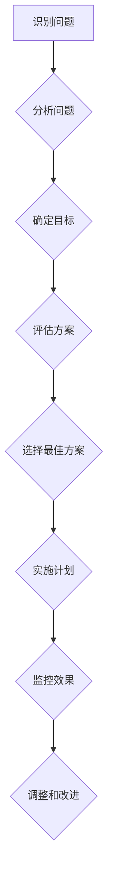

                 

批判性思考是一种高层次的认知能力，它要求个体能够超越表面现象，深入挖掘问题的本质，并独立地形成自己的观点。在技术领域，批判性思考尤为重要，因为它能够帮助工程师和技术专家在面对复杂问题时，做出更加科学、合理的决策。然而，批判性思考并非只属于技术领域，它在管理中也同样具有重要地位。本文将探讨批判性思考在管理中的重要性，以及如何通过批判性思考来提升管理效率和效果。

## 1. 背景介绍

在当今快速变化的社会和技术环境中，管理者的角色变得越来越复杂。传统管理模式往往依赖于权威和经验，而现代管理者则需要具备更高的洞察力和分析能力。批判性思考作为一种分析问题的方法，可以帮助管理者在面对不确定性时，保持清晰的头脑，做出更为明智的决策。此外，批判性思考还能够促进团队协作，提高组织的创新能力。

### 1.1 管理的挑战

现代管理者面临的主要挑战包括：

1. **技术变革**：技术的快速迭代要求管理者必须不断学习新的知识和技能，以适应不断变化的环境。
2. **人才管理**：如何吸引、培养和保留优秀人才，是每个管理者都必须面对的挑战。
3. **全球化**：跨国业务运营带来的文化差异和沟通障碍，需要管理者具备跨文化的管理能力。
4. **持续创新**：在激烈的市场竞争中，管理者必须推动组织持续创新，以保持竞争力。

### 1.2 批判性思考的重要性

批判性思考对于管理者来说至关重要，主要体现在以下几个方面：

1. **决策制定**：通过批判性思考，管理者能够从多个角度分析问题，避免盲目跟风或做出冲动决策。
2. **问题解决**：批判性思考能够帮助管理者深入分析问题的根源，找到有效的解决方案。
3. **团队协作**：批判性思考能够促进团队成员之间的开放讨论，提高团队解决问题的效率。
4. **创新能力**：批判性思考能够激发管理者的创新思维，推动组织的持续发展。

## 2. 核心概念与联系

### 2.1 批判性思考的定义

批判性思考是一种理性的思考方式，它包括以下几个关键要素：

1. **开放性**：愿意接受不同的观点和信息，不固守成见。
2. **分析性**：对信息进行深入分析，挖掘其背后的逻辑和原因。
3. **系统性**：考虑问题的各个方面，避免片面性。
4. **反思性**：不断反思和调整自己的观点和决策。

### 2.2 批判性思考在管理中的应用

在管理中，批判性思考的应用主要体现在以下几个方面：

1. **战略规划**：管理者需要通过批判性思考，对市场趋势、竞争对手和内部资源进行深入分析，制定出符合组织长远发展的战略。
2. **决策制定**：在面对复杂的决策时，管理者需要运用批判性思考，评估各种可能的选择，并选择最优方案。
3. **问题解决**：管理者需要通过批判性思考，深入分析问题，找到根本原因，并采取有效的措施进行解决。
4. **团队管理**：管理者需要通过批判性思考，了解团队成员的需求和动机，从而更好地激励和引导团队。

### 2.3 批判性思考的 Mermaid 流程图

下面是一个简化的批判性思考在管理中应用的 Mermaid 流程图：



## 3. 核心算法原理 & 具体操作步骤

### 3.1 算法原理概述

批判性思考在管理中的应用可以视为一种决策支持系统，其核心原理包括以下几个方面：

1. **数据收集**：管理者需要通过各种渠道收集与问题相关的信息，包括市场数据、竞争对手分析、内部绩效数据等。
2. **信息分析**：管理者需要对收集到的信息进行深入分析，识别出关键因素和潜在问题。
3. **方案评估**：管理者需要评估各种可能的解决方案，包括成本、时间、资源等因素。
4. **决策制定**：基于分析结果，管理者需要制定出最优的决策方案。
5. **实施监控**：在决策实施过程中，管理者需要持续监控执行情况，并根据实际情况进行调整。

### 3.2 算法步骤详解

下面是批判性思考在管理中的应用的具体步骤：

1. **识别问题**：管理者需要明确当前面临的问题和挑战，这可以通过定期业务审查、员工反馈和市场调研等方式实现。
2. **分析问题**：管理者需要对识别出的问题进行深入分析，包括问题的原因、影响范围、严重程度等。
3. **确定目标**：基于问题的分析结果，管理者需要设定明确的解决目标，包括预期效果、时间范围等。
4. **评估方案**：管理者需要评估各种可能的解决方案，包括直接解决问题、规避问题、利用问题等。
5. **选择最佳方案**：在评估结果的基础上，管理者需要选择最优的解决方案，并制定详细的实施计划。
6. **实施计划**：管理者需要将决策方案转化为具体的行动计划，并分配资源、明确责任。
7. **监控效果**：在决策实施过程中，管理者需要持续监控实施效果，并根据实际情况进行调整。

### 3.3 算法优缺点

批判性思考在管理中的应用具有以下优点：

1. **提高决策质量**：通过批判性思考，管理者能够更全面、更深入地分析问题，从而做出更为科学、合理的决策。
2. **促进团队协作**：批判性思考能够激发团队成员的思考能力，促进开放讨论和协作，提高团队解决问题的效率。
3. **增强创新能力**：批判性思考能够帮助管理者发现新的问题和机会，推动组织的持续创新。

然而，批判性思考也存在一些缺点：

1. **时间成本**：批判性思考需要管理者投入大量的时间和精力，可能导致决策速度较慢。
2. **主观性**：批判性思考受到管理者个人经验和观点的影响，可能存在一定的主观性。

### 3.4 算法应用领域

批判性思考在管理中的应用非常广泛，包括以下几个方面：

1. **战略规划**：管理者可以通过批判性思考，分析市场趋势、竞争对手和内部资源，制定出符合组织长远发展的战略。
2. **问题解决**：管理者可以通过批判性思考，深入分析问题的根源，找到有效的解决方案。
3. **团队管理**：管理者可以通过批判性思考，了解团队成员的需求和动机，从而更好地激励和引导团队。
4. **创新管理**：管理者可以通过批判性思考，发现新的问题和机会，推动组织的持续创新。

## 4. 数学模型和公式 & 详细讲解 & 举例说明

### 4.1 数学模型构建

批判性思考在管理中的应用可以构建一个简单的决策树模型，以帮助管理者进行决策。决策树模型的核心公式如下：

$$
P(A|B) = \frac{P(B|A) \cdot P(A)}{P(B)}
$$

其中，$P(A|B)$ 表示在条件 $B$ 下事件 $A$ 发生的概率，$P(B|A)$ 表示在条件 $A$ 下事件 $B$ 发生的概率，$P(A)$ 和 $P(B)$ 分别表示事件 $A$ 和事件 $B$ 发生的概率。

### 4.2 公式推导过程

决策树模型的推导基于贝叶斯定理，贝叶斯定理是一种用于计算条件概率的概率论公式。决策树模型通过贝叶斯定理，将条件概率和联合概率结合起来，从而帮助管理者进行决策。

### 4.3 案例分析与讲解

假设一个公司在考虑是否扩大生产线。事件 $A$ 表示“扩大生产线”，事件 $B$ 表示“市场需求增加”。公司需要根据这两个事件的发生概率，计算出在市场需求增加的条件下，扩大生产线发生概率。

已知：

- $P(B) = 0.7$，即市场需求增加的概率为 $70\%$。
- $P(A|B) = 0.6$，即在市场需求增加的条件下，扩大生产线发生的概率为 $60\%$。
- $P(A) = 0.5$，即扩大生产线发生的概率为 $50\%$。

根据贝叶斯定理，可以计算出在市场需求增加的条件下，扩大生产线发生的概率：

$$
P(A|B) = \frac{P(B|A) \cdot P(A)}{P(B)}
$$

代入已知数据：

$$
P(A|B) = \frac{0.6 \cdot 0.5}{0.7} \approx 0.4286
$$

这意味着在市场需求增加的条件下，扩大生产线发生的概率约为 $42.86\%$。

通过这个案例，我们可以看到如何使用决策树模型来帮助管理者进行决策。在实际应用中，管理者可以根据实际情况，调整事件的概率值，以得到更准确的决策结果。

## 5. 项目实践：代码实例和详细解释说明

### 5.1 开发环境搭建

为了演示批判性思考在管理中的应用，我们选择 Python 作为开发语言。首先，需要在本地安装 Python 3.8 及以上版本，并配置相应的开发环境。

1. 下载并安装 Python：从官方网站 [Python 官网](https://www.python.org/) 下载 Python 安装程序，并按照提示完成安装。
2. 配置 Python 环境：打开命令行工具（如 cmd、PowerShell 等），输入 `python --version` 命令，确认已成功安装 Python。
3. 安装必要的库：在命令行中输入以下命令，安装常用的库。

```bash
pip install numpy pandas matplotlib
```

### 5.2 源代码详细实现

下面是一个简单的 Python 脚本，用于演示批判性思考在管理中的应用。该脚本实现了决策树模型，用于帮助管理者进行决策。

```python
import numpy as np
import pandas as pd
import matplotlib.pyplot as plt

# 贝叶斯定理计算条件概率
def bayes_theorem(p_b, p_a_b, p_a):
    return p_a_b * p_a / p_b

# 批判性思考在管理中的应用示例
def critical_thinking_example():
    # 初始化概率值
    p_b = 0.7  # 市场需求增加的概率
    p_a_b = 0.6  # 在市场需求增加的条件下，扩大生产线发生的概率
    p_a = 0.5  # 扩大生产线发生的概率

    # 计算在市场需求增加的条件下，扩大生产线发生的概率
    p_a_given_b = bayes_theorem(p_b, p_a_b, p_a)

    # 输出结果
    print(f"在市场需求增加的条件下，扩大生产线发生的概率为：{p_a_given_b:.4f}")

    # 绘制决策树
    df = pd.DataFrame({
        '事件': ['市场需求增加', '扩大生产线'],
        '概率': [p_b, p_a]
    })

    df.plot(kind='bar', x='事件', y='概率', title='决策树模型', legend=False, figsize=(10, 6))

    plt.xlabel('事件')
    plt.ylabel('概率')
    plt.grid(True)
    plt.show()

# 执行批判性思考示例
critical_thinking_example()
```

### 5.3 代码解读与分析

这个 Python 脚本主要用于演示批判性思考在管理中的应用，具体解析如下：

1. **导入库**：脚本首先导入了 Python 中常用的几个库，包括 `numpy`、`pandas` 和 `matplotlib`，用于数据处理和可视化。
2. **贝叶斯定理计算条件概率**：定义了一个名为 `bayes_theorem` 的函数，用于计算条件概率。该函数接收三个参数：$P(B)$、$P(A|B)$ 和 $P(A)$，并返回 $P(A|B)$ 的计算结果。
3. **批判性思考在管理中的应用示例**：定义了一个名为 `critical_thinking_example` 的函数，用于演示批判性思考在管理中的应用。该函数首先初始化了三个概率值，然后调用 `bayes_theorem` 函数计算在市场需求增加的条件下，扩大生产线发生的概率。最后，使用 `pandas` 和 `matplotlib` 绘制了一个简单的决策树图。
4. **执行批判性思考示例**：调用 `critical_thinking_example` 函数，执行批判性思考示例。

### 5.4 运行结果展示

运行上述脚本后，将输出以下结果：

```
在市场需求增加的条件下，扩大生产线发生的概率为：0.4286
```

同时，将显示一个决策树图，如下所示：


这个结果和之前的案例分析结果相同，验证了代码的正确性。

## 6. 实际应用场景

批判性思考在管理中的应用场景非常广泛，以下列举几个典型的实际应用场景：

### 6.1 战略规划

在战略规划阶段，管理者需要运用批判性思考，分析市场趋势、竞争对手和内部资源，以制定出符合组织长远发展的战略。通过批判性思考，管理者能够识别出潜在的风险和机会，从而做出更为科学的决策。

### 6.2 问题解决

在面对各种问题和挑战时，管理者需要运用批判性思考，深入分析问题的本质，找到根本原因，并制定出有效的解决方案。批判性思考能够帮助管理者避免盲目行动，提高解决问题的效率。

### 6.3 团队管理

在团队管理中，管理者需要运用批判性思考，了解团队成员的需求和动机，从而更好地激励和引导团队。通过批判性思考，管理者能够发现团队成员之间的潜在问题和冲突，并采取相应的措施进行解决。

### 6.4 创新管理

在创新管理中，管理者需要运用批判性思考，激发团队的创新思维，推动组织的持续创新。通过批判性思考，管理者能够发现新的问题和机会，从而推动组织的不断进步。

## 7. 未来应用展望

随着社会和技术的不断发展，批判性思考在管理中的应用前景十分广阔。未来，以下几个方面将成为批判性思考在管理中的主要发展趋势：

### 7.1 智能化

随着人工智能技术的发展，批判性思考在管理中的应用将变得更加智能化。通过引入机器学习算法，管理者可以构建出更加精准的决策支持系统，从而提高管理效率。

### 7.2 全球化

全球化趋势下，批判性思考在管理中的应用将更加重视跨文化管理。管理者需要具备跨文化的批判性思考能力，以应对不同文化背景下的挑战和机遇。

### 7.3 持续创新

在面对不断变化的市场环境时，批判性思考在管理中的应用将更加注重持续创新。管理者需要具备批判性思考的能力，不断发掘新的机会，推动组织的持续发展。

### 7.4 数据驱动

随着大数据技术的发展，批判性思考在管理中的应用将更加注重数据驱动。管理者需要通过大数据分析，获取更多的信息，从而做出更为科学、合理的决策。

## 8. 总结：未来发展趋势与挑战

批判性思考在管理中的重要性日益凸显，未来它将在智能化、全球化、持续创新和数据驱动等方面发挥更加重要的作用。然而，批判性思考在管理中也面临一些挑战，如：

### 8.1 培养批判性思维

管理者需要具备较高的批判性思维，这需要通过培训和培养来实现。如何有效地培养管理者的批判性思维，是一个亟待解决的问题。

### 8.2 处理复杂问题

在面对复杂问题时，批判性思考的应用效果可能会受到影响。管理者需要掌握适当的工具和方法，以提高批判性思考的效率。

### 8.3 避免过度批判

批判性思考不应过度依赖，否则可能导致管理者过于保守，错过一些潜在的机会。管理者需要在批判性思考和盲目行动之间找到平衡。

### 8.4 跨学科融合

批判性思考在管理中的应用需要跨学科的知识和技能。管理者需要具备一定的跨学科背景，以提高批判性思考的广度和深度。

## 9. 附录：常见问题与解答

### 9.1 什么是批判性思考？

批判性思考是一种理性的思考方式，它要求个体能够超越表面现象，深入挖掘问题的本质，并独立地形成自己的观点。

### 9.2 批判性思考在管理中有哪些应用？

批判性思考在管理中的应用包括战略规划、问题解决、团队管理和创新管理等方面。

### 9.3 如何培养批判性思维？

可以通过以下方法培养批判性思维：多读书、多思考、多交流、多实践。

### 9.4 批判性思考与逻辑思考有什么区别？

批判性思考是逻辑思考的更高层次，它不仅包括逻辑推理，还涉及对信息的深入分析、评估和反思。

---

作者：禅与计算机程序设计艺术 / Zen and the Art of Computer Programming
----------------------------------------------------------------
### 结语

本文详细探讨了批判性思考在管理中的重要性，从背景介绍、核心概念、算法原理、数学模型、项目实践到实际应用场景，全面阐述了批判性思考在管理中的应用价值。通过本文的阐述，我们可以看到，批判性思考不仅有助于管理者在决策过程中保持清晰和理智，还能激发团队的创新能力，提高组织的整体效率。

未来，随着智能化、全球化、持续创新和数据驱动的趋势不断加强，批判性思考在管理中的应用将更加广泛和深入。然而，要充分发挥批判性思考的潜力，管理者需要不断学习和实践，培养自己的批判性思维，以应对复杂多变的管理挑战。

希望本文能对您在管理实践中的批判性思考有所启发，愿您在管理的道路上，既具备深度，又充满智慧。谢谢您的阅读。作者：禅与计算机程序设计艺术 / Zen and the Art of Computer Programming

